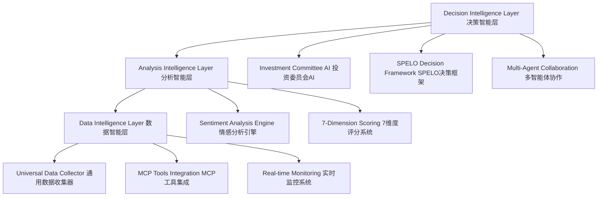

# LaunchX CMS Master Plan | LaunchX 内容管理系统总纲
## 综合智能协作开发生态系统蓝图

**Version**: v1.0.0-CMS  
**Created**: 2025-01-22  
**Document Type**: CMS Master Plan & Spec-Kit Input  
**Languages**: Chinese & English  
**Scope**: Universal Infrastructure + Specialized Extensions

---

## 📋 Executive Summary | 执行摘要

### English Summary


### 中文摘要
LaunchX pocketcorn 系统代表着一个革命性的发现ai初创公司的一个自动化工具,再次之外还具备**持续精华提炼自进化系统**，通过AI协作将复杂的软件开发转化为自然语言对话。本CMS（内容管理系统）作为顶层设计蓝图，融合了Universal AI Discovery Infrastructure的高维度理念，整合了我们对Weibo多智能体系统、 v4.2增强架构的全部历史架构讨论和精华提炼。

**核心创新**：基于4层级信息进化路径（L1原始信息收集 → L2模式识别提炼 → L3策略规则生成 → L4工具层指导）构建的**通用AI发现基础设施**，在此基础上支持无限专业化应用扩展。

---

## 🏗️ System Architecture Overview | 系统架构概览

### Master Architecture Pattern | 主体架构模式

```yaml
持续精华提炼自进化系统架构 (Universal AI Discovery Infrastructure):
  L1_原始信息收集层:
    多源数据集成: "Weibo MindSpider 7平台 + GitHub + 全球AI创新平台"
    日常工作集成: "投资决策记录 + 市场调研 + 团队访谈 + 财务数据"
    信息质量控制: "来源可靠性评分 + 时效性检查 + 完整性验证"
    
  L2_模式识别提炼层:
    成功模式识别: "高ROI项目关键要素 + 团队配置最优模式"
    失败模式预警: "风险信号识别 + 团队配置缺陷"
    模式有效性验证: "历史数据回测 + 新案例预测"
    
  L3_策略规则生成层:
    筛选规则: "什么样的项目值得深入调研"
    评估规则: "6维度企业画像权重"
    风险控制规则: "哪些信号需要重点关注"
    
  L4_工具层指导:
    RUBE智能工具发现: "自动发现新平台、新工具、竞品工具、参考项目"
    动态搜索策略优化: "基于发现结果自动优化搜索关键词和策略"
    工具集成指导: "RUBE发现的新工具自动集成到MCP生态"
    参考项目学习: "从发现的优秀项目中提取最佳实践和模式"
  
核心自进化机制:
  经验沉淀: "每次分析结果自动归档和标签化"
  模式更新: "成功案例和失败案例的特征提取"
  规则优化: "基于实际效果的规则权重调整"
  工具生态进化: "RUBE发现新工具→集成测试→生态扩展→最佳实践沉淀"

专业化应用扩展（在通用基础设施上构建）:
  PocketcornEngine: "50万投资策略分析引擎（应用模式之一）"
  KnowledgeEngine: "Research and Trend Discovery System + RUBE参考项目发现"
  PersonalizedEngine: "个人化决策支持系统 + RUBE智能工具推荐"
  RUBEDiscoveryEngine: "RUBE参考项目发现和工具生态学习引擎（新增）"
```

### Three-Layer Intelligence Architecture | 三层智能协作架构



---

## 🎯 Strategic Design Philosophy & Intent | 设计哲学与战略初衷

### Core Design Philosophy | 核心设计哲学
**"让0代码背景的用户通过自然语言对话完成复杂的AI驱动任务"**

这个系统的设计哲学基于一个根本洞察：**技术复杂性应该被智能地隐藏，而不是简化。** 我们不是在降低功能的复杂性，而是在提升交互的直觉性。

### Pocketcorn投资系统的三层战略思考框架

```yaml
第一层：对市场的深度思考 - 好的AI企业画像
  市场洞察:
    核心判断: "真正有价值的AI企业处于PMF后、爆发前的关键窗口期"
    时间窗口: "产品找到市场契合度后，但还未被传统VC大量关注的黄金期"
    价值识别: "具备技术壁垒、市场牵引力、团队执行力的三重验证企业"
    
  优质AI企业的本质特征:
    技术价值: "不是追逐AI热点，而是用AI解决真实痛点"
    商业模式: "已验证付费意愿，收入增长轨迹清晰"
    团队质量: "创始人具备技术深度+市场洞察的双重能力"
    市场时机: "处于细分市场的早期增长阶段，具备先发优势"

第二层：对个人使用者的深度理解 - 个人化决策支持需求
  个人使用者定位:
    决策规模: "个人化决策支持，适配不同领域的专业需求"
    学习能力: "持续学习用户偏好和决策模式，实现个性化适配"
    应用灵活性: "支持多种不同的专业应用模式（投资分析只是其中之一）"
    
  示例应用模式 - 投资分析变体:
    目标企业规模: "3-10人团队，月收入5万+，处于PMF后增长期"
    投资策略: "50万人民币投入，6-8个月1.5倍回收期望"
    价值验证: "通过实际投资案例验证4层级进化系统的有效性"
    模式可复制性: "此模式可适配其他规模、其他领域的决策需求"

第三层：数据获取和分析的系统性方法 - 怎么抓取、判断、分析
  抓取策略:
    平台选择逻辑: "目标企业在哪里出现 → 我们在哪里监控"
    信号识别逻辑: "什么行为表明企业处于目标阶段 → 我们抓取什么信号"
    时效性考虑: "信息的时间价值 → 我们多快响应和处理"
    
  判断框架:
    多源验证: "单一信号不足信，多源交叉验证确保准确性"
    时间序列: "不看静态快照，看动态趋势和变化轨迹"
    对比基准: "不是绝对好坏，而是相对于同阶段企业的表现"
    
  分析系统:
    BMAD架构: "人类判断(Brain) + AI分析(AI) = 混合智能决策"
    SPELO流程: "Study-Plan-Execute-Learn-Optimize闭环优化"
    多Agent协作: "投资委员会模式，多角度评估达成共识"
```

### Architecture Principles for Pocketcorn-First Design | Pocketcorn优先的架构原则

```yaml
1. Philosophy-Driven Design: "每个技术决策都服务于零代码用户体验哲学"
2. Agent-Centric Collaboration: "多智能体协作作为核心交互模式"
3. Natural Language First: "所有接口优先考虑自然语言交互"
5. Specialized Universality: "通用基础设施支持专业化扩展"
6. Evidence-Based Decision: "所有决策基于数据证据和多Agent共识"
7. Pocketcorn-First Design: "架构设计以Pocketcorn需求为第一验证场景"
```

---

## 🔄 Historical Integration Analysis | 历史整合分析

### 1. Weibo Multi-Agent System Foundation | Weibo多智能体系统基础

**Proven Strengths | 已验证优势**:
- ✅ **Mature Multi-Agent Architecture**: 4个专业化Agent（Query、Media、Insight、Report）→投资分析Agent重定义
- ✅ **Advanced NLP Capabilities**: 22种语言情感分析引擎→多语言分析系统
- ✅ **Forum Collaboration Engine**: Agent间论坛式辩论协作机制→投资委员会决策模式
- ✅ **Docker Deployment**: 完整的容器化部署方案→微服务架构基础
- ✅ **Modular Design**: 清晰的模块化架构便于扩展→专业化引擎扩展

**Pocketcorn-First Enhancement Strategy | Pocketcorn优先增强策略**:
- 🎯 **Investment Agent Redefinition**: 将舆情分析Agent改造为投资分析专业Agent
- 🎯 **MindSpider Platform Extension**: 利用现有7+平台能力，扩展到LinkedIn/GitHub等商业平台
- 🎯 **MCP Tools Integration**: 集成Rube+Playwright+Tavily等工具生态
- 🎯 **SPELO Decision Framework**: 实现Study-Plan-Execute-Learn-Optimize闭环

### 2. Weibo MindSpider多平台优势 | Weibo MindSpider Multi-Platform Advantage

**已集成平台能力 | Existing Platform Capabilities**:
```python
# Weibo MindSpider现有强大能力
WeiboMindSpiderPlatforms = {
    "xhs": "小红书 - 产品展示、用户反馈、消费趋势",
    "douyin": "抖音 - 品牌传播、用户互动、内容营销", 
    "kuaishou": "快手 - 下沉市场、用户画像、商业化",
    "bilibili": "B站 - 技术社区、年轻用户、内容创作",
    "weibo": "微博 - 媒体报道、舆论趋势、品牌声量",
    "tieba": "百度贴吧 - 垂直社区、深度讨论、用户洞察",
    "zhihu": "知乎 - 专业讨论、技术分析、行业洞察"
}

# Pocketcorn投资分析专用扩展
PocketcornPlatformExtensions = {
    "linkedin": "专业背景、融资动态、团队信息",
    "github": "技术实力、代码质量、开发活跃度", 
    "producthunt": "产品发布、市场验证、用户反馈",
    "angellist": "融资状态、投资关注、估值信息",
    "boss_zhipin": "招聘速度、团队扩张、薪资水平"
}

# 无需Scraperr - Weibo MindSpider + MCP工具已足够强大
WeiboMindSpider + MCPPlaywright + MCPTavily = "完整的投资信号收集能力"
```

### 3. Pocketcorn v4.2 Enhanced Architecture | Pocketcorn v4.2增强架构

**Key Innovations to Preserve | 关键创新保留**:
- 🧠 **SPELO Processing Nodes**: Study-Plan-Execute-Learn-Optimize系统化流程
- 🤖 **Investment Committee Simulation**: AI投资委员会多Agent协作决策
- 📊 **Real-time Monitoring**: 投资组合实时监控和预警系统

---

## 🛠️ Technical Implementation Roadmap | 技术实施路线图

### Phase 1: Universal Infrastructure Enhancement | 通用基础设施增强

#### 1.1 Weibo System Core Extensions | Weibo系统核心扩展
```yaml
File Modifications:
  # Core Agent Base Class Enhancement
  - AgentCore/base_agent.py: "添加专业化配置支持"
  - AgentCore/collaboration_engine.py: "扩展Forum引擎支持投资委员会模式"
  
  # New Engine Integration
  - PocketcornEngine/: "专业投资分析引擎"
  - MCPEngine/: "MCP工具集成层" 
  
  # Configuration Extensions
  - config/: "多域配置支持（舆情+投资+企业服务）"
  - templates/: "专业报告模板库扩展"

Directory Structure Enhancement:
  Weibo_PublicOpinion_AnalysisSystem/
  ├── QueryEngine/ (保持原有)
  ├── MediaEngine/ (保持原有)  
  ├── InsightEngine/ (增强数据源支持)
  ├── ReportEngine/ (扩展模板支持)
  ├── ForumEngine/ (增强协作模式)
  ├── PocketcornEngine/ (新增)
  │   ├── investment_agents/
  │   ├── spelo_framework/
  │   ├── scoring_system/
  │   └── committee_simulation/
  ├── MCPEngine/ (新增)
  │   ├── rube_integration/
  │   │   ├── project_discovery/     # 参考项目发现
  │   │   ├── tool_ecosystem_learning/  # 工具生态学习
  │   │   └── best_practices_extraction/  # 最佳实践提取
  │   ├── playwright_automation/
  │   ├── tavily_search/
  │   └── local_adapters/
  ├── RUBEDiscoveryEngine/ (新增)
  │   ├── reference_project_discovery/
  │   ├── competitive_analysis/
  │   ├── tool_ecosystem_mapping/
  │   └── best_practices_learning/
  └── UniversalDataEngine/ (新增)
```

#### 1.2 MCP Tools Integration Matrix | MCP工具集成矩阵
```yaml
Core MCP Integrations:
  rube_mcp:
    已知平台: [zhihu, xiaohongshu, v2ex, weibo, boss_zhipin, linkedin, github]
    动态发现能力: "自动发现新平台、竞品工具、参考项目"
    工具生态学习: "从发现的优秀项目和工具中学习最佳实践"
    rate_limits: "智能速率控制和反检测"
    workflow_orchestration: "500+平台工作流编排 + 新发现平台自动集成"
    
  playwright_mcp:
    capabilities: [dynamic_content_extraction, anti_detection, session_management]
    supported_platforms: [spa_applications, job_boards, social_media]
    
  tavily_search_mcp:
    search_domains: [company_info, founder_backgrounds, funding_news, trends]
    real_time_intelligence: "上下文感知的智能搜索"
    
  rube_discovery_engine:
    参考项目发现: "自动发现同类项目、竞品分析、最佳实践案例"
    工具生态映射: "发现新兴工具、库、框架和平台集成方案"
    最佳实践提取: "从发现的优秀项目中提取架构、策略和实施方法"
    动态更新: "持续监控技术发展趋势和新兴解决方案"
    
  local_adapters:
    scraperr_bridge: "现有Scraperr收集器桥接为MCP兼容服务"
    data_normalization: "跨平台信号标准化"
    correlation_engine: "实体关联和去重"
```

#### 1.3 RUBE Discovery Engine Integration | RUBE发现引擎集成
```yaml
RUBE参考项目发现系统:
  发现维度:
    同类项目发现: "自动识别类似投资分析项目和系统"
    竞品分析: "发现并分析竞品产品和工具的优劣势"
    最佳实践挖掘: "从优秀项目中提取架构、策略和方法论"
    新兴工具发现: "持续发现和评估新的相关工具和技术"
    
  学习能力:
    架构模式学习: "从参考项目中学习优秀的系统架构设计"
    工具集成策略: "学习其他项目的工具集成和组合方式"
    性能优化方案: "从成功案例中学习性能优化和扩展策略"
    用户体验设计: "借鉴优秀的用户交互设计和体验模式"
    
  自动集成:
    工具评估: "自动评估发现工具的适用性和集成成本"
    兼容性检测: "检测新工具与现有系统的兼容性"
    集成测试: "自动生成集成测试案例和验证流程"
    最佳实践应用: "将学到的最佳实践应用到当前系统"
```

### Phase 2: Specialized Engine Development | 专业化引擎开发

#### 2.1 PocketcornEngine Architecture | PocketcornEngine架构
```python
# Agent Specialization Framework
class UniversalInvestmentAgent(WeiboDeepSearchAgent):
    """融合Weibo协作能力 + Scraperr投资专业性的超级Agent"""
    
    def __init__(self, specialization: str):
        super().__init__()
        
        # Scraperr Core Integrations
        self.chinese_detector = ChineseCompanyDetector()
        self.mrr_processor = MRRSignalProcessor() 
        self.investment_scorer = InvestmentScorer()
        
        # Weibo NLP Capabilities
        self.sentiment_analyzer = WeiboMultilingualSentimentAnalyzer()
        self.cultural_analyzer = CulturalIntelligenceEngine()
        
        # SPELO Decision Framework
        self.spelo_pipeline = {
            'study': StudyNode(specialization),
            'plan': PlanNode(specialization),
            'execute': ExecuteNode(specialization), 
            'learn': LearnNode(specialization),
            'optimize': OptimizeNode(specialization)
        }

# Investment Committee Forum Integration
class InvestmentCommitteeForumEngine(WeiboForumEngine):
    """基于Weibo Forum模式的AI投资委员会协作"""
    
    committee_agents = {
        'growth_investor': GrowthInvestorAgent(),
        'risk_assessor': RiskAssessmentAgent(),
        'cultural_analyst': CulturalCompatibilityAgent(),
        'market_expert': MarketAnalysisAgent(),
        'due_diligence': DueDiligenceAgent()
    }
```


### Phase 3: Advanced Analytics Integration | 高级分析集成

#### 3.1 Pocketcorn专用7维度评分框架 | Pocketcorn-Specific 7-Dimension Framework
```yaml
Pocketcorn Investment Evaluation Matrix:
  dimension_weights:
    technology: 0.15        # 技术评估
    market: 0.20           # 市场评估  
    team: 0.20             # 团队评估
    business_model: 0.20   # 商业模式
    competitive_advantage: 0.10  # 竞争优势
    cultural_compatibility: 0.10  # 文化兼容性(产品与当地客户转化的文化属性: 付费、定价、习惯、生态)
    risk_assessment: 0.05  # 风险评估
    
  pocketcorn_specific_criteria:
    investment_amount: 500000     # 50万投资额
    target_return_timeline: (6, 8)  # 6-8个月回收期
    mrr_threshold: 50000         # 5万RMB MRR门槛
    team_size_range: (3, 10)    # 3-10人团队规模
    growth_rate_minimum: 0.15   # 15%月增长率要求
    cultural_compatibility_minimum: 0.7  # 产品本地化转化能力最低要求
    
  evaluation_scoring:
    强烈推荐投资: ">= 0.85"
    推荐投资: ">= 0.70" 
    谨慎观望: ">= 0.55"
    不推荐投资: "< 0.55"
    
  platform_signal_mapping:
    中国平台信号源:
      知乎: "技术讨论、产品发布、招聘信息、行业分析"
      小红书: "产品展示、用户反馈、市场接受度、消费趋势"
      V2EX: "技术社区讨论、开发者招聘、产品技术细节"
      微博: "品牌宣传、媒体报道、用户评价、热点跟踪"
      Boss直聘: "招聘增长速度、薪资水平、团队扩张信号"
      
    国际平台信号源:
      LinkedIn: "团队背景、融资动态、业务拓展、国际化信号"
      GitHub: "代码质量、开发活跃度、技术栈、开源贡献"
      ProductHunt: "产品发布、用户反馈、市场验证、媒体关注"
      Twitter: "创始人个人IP、产品宣传、用户交流、行业影响力"
      AngelList: "早期融资状态、投资者关注、估值水平"
```

#### 3.2 SPELO决策框架的Pocketcorn实施 | SPELO Framework for Pocketcorn Implementation
```yaml
Study阶段 - 企业发现与深度调研:
  自动化市场扫描:
    多平台监控: "7x24小时监控全球10+平台企业信号"
    信号识别算法: "识别符合Pocketcorn标准的企业特征"
    反检测机制: "确保数据收集的隐蔽性和连续性"
    实时预警: "符合条件企业的即时发现和推送"
    
  深度调研流程:
    多源数据融合: "整合招聘、定价、客户反馈等多源信号"
    产品本地化评估: "产品与当地客户转化的付费习性、定价策略、生态适应性评估"
    置信度评估: "基于数据质量和一致性的信任评分"
    竞争分析: "同行业企业的自动对比分析"

Plan阶段 - 投资策略制定:
  投资方案生成:
    资金配置策略: "50万投资额的最优分配方案"
    风险控制措施: "多层级风险控制和预案制定"
    回收时间规划: "6-8个月回收期的里程碑设定"
    增长支持计划: "投后企业增长支持策略"
    
  尽调计划制定:
    标准化流程: "基于7维度评估的尽调检查清单"
    关键验证点: "财务、团队、技术、市场的核心验证"
    时间安排: "高效的尽调时间表和资源配置"
    决策标准: "明确的投资决策门槛和评判标准"

Execute阶段 - 投资执行:
  投资谈判支持:
    条件建议: "基于评估结果的投资条件建议"
    协议模板: "标准化投资协议和法律文档"
    谈判策略: "基于企业特点的谈判要点"
    风险条款: "保护投资人利益的风险控制条款"
    
  资金管理:
    分阶段投资: "里程碑导向的资金释放机制"
    进度监控: "投资后企业发展进度的实时跟踪"
    支持资源: "推广、管理、技术等增长支持资源"
    
Learn阶段 - 经验学习:
  结果跟踪系统:
    KPI监控: "企业关键指标的持续监控"
    成长轨迹: "企业发展轨迹与预期的对比分析"
    投资回报: "实际投资回报与预期的差异分析"
    市场反馈: "市场对企业的反馈和认知变化"
    
  经验总结:
    成功因子识别: "成功投资案例的关键成功因子"
    失败原因分析: "失败案例的深度原因分析"
    模式识别: "优质企业的共同特征模式"
    决策优化: "投资决策流程的持续优化"

Optimize阶段 - 系统优化:
  评估模型优化:
    算法调优: "基于实际结果的评估算法优化"
    权重调整: "7维度权重的动态调整"
    新信号发现: "发现和集成新的有效信号源"
    准确率提升: "提升投资建议和风险预警准确率"
    
  流程改进:
    效率提升: "缩短从发现到决策的时间周期"
    质量改进: "提升分析报告和建议的质量"
    工具升级: "数据收集和分析工具的持续升级"
    能力扩展: "扩展到新的地域和行业领域"
```

#### 3.3 成熟软件集成的技术改造策略 | Mature Software Integration Strategy
```yaml
Weibo多智能体系统改造:
  Agent角色重新定义:
    原Data_Collector_Agent → PocketcornEnterpriseDiscoveryAgent:
      功能: "多平台企业信号收集专家"
      数据源: "从微博扩展到全球10+商业平台"
      信号类型: "招聘、产品、客户、媒体、竞争、财务、团队、技术"
      
    原Market_Analysis_Agent → PocketcornMarketAnalysisAgent:
      功能: "市场分析和竞争态势专家"
      分析维度: "市场规模、增长潜力、竞争态势、客户需求"
      Pocketcorn特化: "重点关注SAM和快速获客能力"
      
    原Technology_Assessment_Agent → PocketcornTechnologyAssessmentAgent:
      功能: "技术评估和壁垒分析专家"  
      评估重点: "技术壁垒、团队实力、发展趋势、IP保护"
      Pocketcorn特化: "技术是否支撑6-8个月快速增长"
      
    原Risk_Analysis_Agent → PocketcornRiskAssessmentAgent:
      功能: "投资风险识别和评估专家"
      风险类型: "技术、市场、团队、法律合规风险"
      Pocketcorn特化: "6-8个月投资期内的风险可控性"
      
    新Cultural_Intelligence_Agent:
      功能: "产品本地化转化评估专家"
      分析维度: "产品与当地客户的付费习惯、定价策略、使用习惯、生态适应性"
      Pocketcorn特化: "评估产品在不同市场的商业转化能力"
      
    新Decision_Synthesizer_Agent:
      功能: "投资决策综合和建议专家"
      综合能力: "多Agent意见综合、决策建议生成"
      Pocketcorn特化: "基于50万投资标准的决策建议"

Scraperr数据收集系统改造:
  采集目标重新定义:
    原通用网页抓取 → 投资信号专业采集:
      招聘信号: "团队扩张速度、薪资水平、职位要求变化"
      产品信号: "产品更新频率、用户反馈质量、功能演进方向"
      客户信号: "客户案例展示、使用反馈、满意度指标"
      媒体信号: "媒体报道频次、行业认知度、品牌影响力"
      竞争信号: "竞品对比分析、市场地位评估、差异化优势"
      财务信号: "收入规模推断、增长率计算、盈利状况分析"
      
  反检测能力升级:
    商业平台特殊处理:
      LinkedIn: "专业网络平台的高级反检测和会话管理"
      GitHub: "开发者平台的API限制智能规避"
      AngelList: "投资平台的敏感信息获取策略"
      Boss直聘: "招聘平台的数据访问权限优化"
      
    技术实现策略:
      用户行为模拟: "真实用户浏览和交互行为的精确模拟"
      会话状态管理: "长期登录状态维护和会话连续性"
      请求分布优化: "智能化的时间和频率分布避免检测"
      代理IP管理: "高质量住宅IP池和智能轮换机制"

MCP工具生态特化集成:
  现有MCP工具改造:
    Tavily搜索工具Pocketcorn特化:
      原功能: "通用智能搜索和信息检索"  
      特化改造: "投资标的企业专业搜索和信息验证"
      查询优化: "投资分析专用搜索查询模板"
      结果过滤: "投资相关信息的智能筛选算法"
      
    Playwright自动化Pocketcorn特化:
      原功能: "通用浏览器自动化和网页交互"
      特化改造: "多平台企业数据的专业化自动收集"
      脚本库: "各大平台的专用数据抓取脚本"
      反检测: "平台特定的反检测机制集成"
      
    Rube工作流Pocketcorn特化:
      原功能: "通用工作流编排和任务调度"
      特化改造: "投资分析流程的专业化自动编排"
      模板库: "投资分析专用的工作流模板"
      决策节点: "SPELO决策框架的工作流实现"
      
  新增专用MCP工具:
    Investment_Analysis_MCP: "投资分析专用工具集"
    MRR_Inference_MCP: "收入推断专用工具"
    Risk_Assessment_MCP: "投资风险评估工具"
    Enterprise_Discovery_MCP: "企业发现专用工具"
    RUBE_Discovery_MCP: "RUBE参考项目发现和工具生态学习引擎"
```

---

## 🎯 完整系统愿景与目的 | Complete System Vision & Purpose

### 系统核心目的 | Core System Purpose

基于我们的历史深度讨论，这个LaunchX生态系统的完整目的是：

```yaml
革命性目标 - 零代码背景的AI协作开发生态:
  根本使命: "让任何0代码背景的专业人士都能通过自然语言对话完成复杂的AI驱动开发和分析任务"
  具体体现:
    投资人: "通过对话完成复杂的企业投资分析，从发现到决策全自动化"
    企业服务设计师: "通过对话为客户设计和部署AI解决方案"
    知识工作者: "通过对话进行深度研究和趋势分析"
    
  变革意义:
    技术民主化: "将高级AI能力从技术专家普及到领域专家"
    效率革命: "将2-4小时的复杂分析压缩到15-30分钟的对话"
    质量提升: "通过AI协作提升决策质量30%+，减少人为错误"
    规模扩展: "从个人工具扩展到企业级AI协作平台"

双重商业价值创造:
  直接价值: "为0代码用户创造专业级AI分析和开发能力"
  间接价值: "为AI行业创造新的应用模式和商业生态"
  
  应用模式验证:
    Pocketcorn模式: "50万投资策略分析（应用模式之一，验证系统有效性）"
    Zhilink模式: "企业AI服务解决方案设计（适用于企业服务领域）"
    通用平台模式: "支持无限专业化应用扩展的通用基础设施"
```

### 完整工具思想体系 | Complete Tool Philosophy System

我们经过多轮讨论建立的工具思想体系包括：

```yaml
1. 成熟软件基座策略 (Mature Software Foundation):
  核心思想: "站在巨人肩膀上，而不是重新造轮子"
  具体实现:
    Weibo多智能体系统: "已验证的Agent协作机制和22语言NLP能力"
    Weibo MindSpider: "成熟的7+平台数据收集和反检测技术"
    MCP工具生态: "丰富的第三方工具集成能力"
    
  改造原则: "保留核心优势，扩展专业能力，重新定义应用场景"

2. BMAD混合智能架构 (Brain-Machine Augmented Decision):
  设计哲学: "人机协作，而非人机替代"
  分层设计:
    Brain-Tier (人类智能层): "战略判断、价值观设定、创意决策"
    AI-Tier (机器智能层): "数据处理、模式识别、执行优化"
    协作机制: "持续对话、相互学习、共同进化"
    
  应用体现:
    投资决策: "人类设定投资哲学，AI执行分析和发现"
    企业服务: "人类定义服务目标，AI设计和实施方案"
    知识发现: "人类提出研究方向，AI进行深度挖掘"

3. SPELO闭环决策框架 (Study-Plan-Execute-Learn-Optimize):
  系统思想: "将复杂决策过程标准化为可重复的智能流程"
  五阶段循环:
    Study: "多源数据收集和深度分析"
    Plan: "基于分析的策略制定和方案设计"  
    Execute: "方案执行和过程监控"
    Learn: "结果分析和经验总结"
    Optimize: "基于学习的流程和能力优化"
    
  核心价值: "确保每次决策都产生学习价值，系统持续进化"

4. 分层专业化扩展策略 (Layered Specialization):
  架构思想: "通用基础设施 + 专业化引擎 + 垂直应用"
  三层结构:
    Layer1-Universal: "Weibo增强的通用数据收集和分析基础设施"
    Layer2-Specialized: "Pocketcorn投资引擎、Zhilink企业服务引擎"
    Layer3-Applications: "具体的投资分析、企业解决方案、研究报告"
    
  扩展策略: "验证一个专业领域，复制到其他领域"


6. 自然语言优先交互 (Natural Language First):
  交互哲学: "技术应该说人话，而不是让人学技术话"
  实现方式:
    对话式开发: "通过自然语言描述需求，AI自动生成实现方案"
    解释性AI: "所有分析结果都能用自然语言清晰解释"
    渐进式指导: "AI主动引导用户完成复杂任务"
    
  用户体验: "如同与专业助手对话，而非操作复杂软件"
```

### 历史讨论的关键洞察总结 | Key Insights from Historical Discussions

```yaml
关于市场定位的洞察:
  核心发现: "传统软件开发与AI能力之间存在巨大鸿沟"
  目标用户: "有专业判断力但缺乏技术实现能力的高价值用户群"
  竞争优势: "唯一真正为0代码背景用户设计的AI协作系统"
  市场时机: "AI技术成熟度与用户需求的完美交汇点"

关于技术选择的洞察:
  基础决策: "基于Weibo成熟多智能体系统，而非从零开始"
  扩展策略: "通过MCP工具生态连接外部能力，而非自建一切"
  演进路径: "从Pocketcorn投资分析单点突破，到通用AI协作平台"
  质量保证: "每个技术选择都有成熟软件基座支撑"

关于系统设计的洞察:
  模式验证: "通过Pocketcorn模式验证4层级进化架构的实际有效性"
  平台化路径: "从单一应用模式到多元化专业应用，再到通用基础设施"
  生态价值: "支持任意领域的专业化AI协作应用开发"
  持续进化: "通过SPELO框架确保系统持续学习和优化"

关于用户体验的洞察:
  核心原则: "零代码不等于零能力，而是能力的重新定义"
  交互革命: "从学习使用工具到与AI助手协作"
  专业赋能: "让领域专家专注专业判断，AI处理技术执行"
  文化适应: "AI系统理解和适应用户的文化背景"
```

### 未来扩展路径 | Future Expansion Roadmap

基于我们的讨论，系统的未来扩展包括：

```yaml
短期扩展 (6-12个月):
  Pocketcorn投资引擎: "验证和优化50万投资模式"
  Zhilink企业服务: "标准化AI解决方案交付流程"
  知识发现引擎: "研究和趋势分析自动化"

中期扩展 (1-2年):
  垂直行业扩展: "金融、医疗、教育等行业的专业化引擎"
  地域市场扩展: "适应不同地区的商业文化和法规要求"
  能力深度扩展: "从分析决策到执行监控的全流程覆盖"

长期愿景 (2-5年):
  通用AI协作平台: "支持任意领域的AI协作开发"
  AI能力交易生态: "AI服务的标准化和平台化交易"
  人机协作新范式: "重新定义知识工作的基本模式"
```

---

## 🚀 实施行动计划 | Implementation Action Plan

### 立即行动项 (Next 30 Days) | Immediate Actions

```yaml
1. 系统架构验证:
  Weibo系统评估: "深度分析现有Weibo多智能体系统的可扩展性"
  MindSpider平台能力: "验证现有7+平台数据收集能力和扩展方案"
  MCP工具清单: "确认已激活的MCP工具和待集成的工具清单"
  
2. Pocketcorn原型开发:
  核心Agent改造: "将Weibo Agent改造为投资分析专用Agent"
  基础数据收集: "实现对知乎、LinkedIn、GitHub等平台的数据收集"
  7维度评估原型: "开发投资评估的基本算法和评分机制"
  
3. 技术基础设施:
  开发环境搭建: "基于Docker的统一开发和测试环境"
  MCP服务器配置: "配置和优化现有的MCP工具集成"
  数据库架构设计: "设计支持投资分析的数据存储结构"

4. 用户体验设计:
  自然语言接口: "设计投资人友好的对话式交互界面"
  报告模板开发: "开发标准化的投资分析报告模板"
  错误处理机制: "设计用户友好的错误提示和恢复机制"
```

### 3个月里程碑 | 3-Month Milestones

```yaml
Milestone 1 - Pocketcorn MVP (月度1):
  功能目标:
    - 完成对10家测试企业的自动化分析
    - 实现基本的7维度评分功能
    - 建立初步的投资建议生成能力
    
  技术目标:
    - Weibo Agent成功改造为投资分析Agent
    - 实现5个主要平台的数据收集
    - 建立基础的SPELO决策流程

Milestone 2 - 系统集成与优化 (月度2):
  功能目标:
    - 投资建议准确率达到70%+
    - 完整的SPELO闭环决策验证
    
  技术目标:
    - 完整的MCP工具生态集成
    - 反检测机制的完善和测试
    - 系统性能优化和稳定性保证

Milestone 3 - 商业验证 (月度3):
  商业目标:
    - 完成首批50万投资的实际验证
    - 建立可复制的投资决策流程
    - 验证6-8个月回收期的可行性
    
  技术目标:
    - 系统扩展到支持100+企业并行分析
    - 建立完整的监控和预警系统
    - 为Zhilink企业服务引擎做技术准备
```

### 关键成功因素 | Critical Success Factors

```yaml
技术成功因素:
  成熟软件基座: "充分利用Weibo和Scraperr的成熟能力"
  MCP生态集成: "有效整合现有的12+MCP工具服务器"
  反检测技术: "确保数据收集的连续性和隐蔽性"

商业成功因素:
  精准用户定位: "专注0代码背景的高价值专业用户"
  验证闭环设计: "通过Pocketcorn验证技术和商业模式"
  快速迭代能力: "基于SPELO框架的持续学习和优化"
  平台化思维: "从单点应用向通用平台的演进路径"

用户体验成功因素:
  自然语言优先: "确保所有交互都尽可能接近自然对话"
  专业能力保证: "AI分析结果必须达到专业投资人标准"
  文化适应性: "系统能够适应不同文化背景的用户需求"
  学习成长性: "系统能够从使用中学习并持续改进"
```

---

## 📊 总结与下一步 | Summary & Next Steps

### 核心成果总结 | Core Achievements Summary

通过我们的深度历史讨论，LaunchX CMS 总纲确立了：

```yaml
系统定位突破:
  ✅ 明确了"零代码背景AI协作开发生态系统"的革命性定位
  ✅ 建立了从投资分析到通用协作平台的清晰演进路径
  ✅ 确定了Pocketcorn作为第一个验证场景的战略重要性

技术架构创新:
  ✅ 设计了基于成熟软件基座的系统改造策略
  ✅ 建立了BMAD混合智能和SPELO决策的核心框架
  ✅ 确定了MCP工具生态的集成和扩展方案

商业模式验证:
  ✅ 确立了50万投资、1.5倍回收的可验证商业模式
  ✅ 设计了从Pocketcorn到Zhilink再到LaunchX的商业演进
  ✅ 建立了AI能力交易生态的长期愿景

```

### 与Spec-Kit集成策略 | Spec-Kit Integration Strategy

这个CMS文档将作为Spec-Kit的核心输入，指导生成：

```yaml
Spec-Kit输入价值:
  PRD指导: "CMS中的系统愿景和商业目标 → PRD的功能需求"
  架构指导: "CMS中的技术思想和集成策略 → Architecture的详细设计"
  实施指导: "CMS中的行动计划和里程碑 → Implementation的具体步骤"

预期Spec-Kit输出:
  完整的PRD文档: "详细的功能需求和验收标准"
  技术架构规范: "可实施的系统架构和接口设计"
  开发实施计划: "具体的开发任务和时间安排"
  测试验证方案: "系统测试和质量保证计划"
```

### 持续演进机制 | Continuous Evolution Mechanism

```yaml
SPELO持续优化:
  Study: "持续收集用户反馈和使用数据"
  Plan: "基于数据制定系统优化计划"
  Execute: "实施技术改进和功能增强"
  Learn: "分析改进效果和用户满意度"
  Optimize: "优化系统架构和用户体验"

版本演进策略:
  v1.0: "Pocketcorn投资分析引擎MVP"
  v2.0: "Zhilink企业服务平台集成"
  v3.0: "通用AI协作基础设施平台"
  v4.0+: "AI能力交易生态系统"

质量保证承诺:
  技术质量: "基于成熟软件基座，确保系统稳定可靠"
  用户体验: "持续优化自然语言交互，提升使用便利性"
  商业价值: "通过实际投资验证，确保商业模式可行性"
```

**本CMS文档为LaunchX生态系统的完整蓝图，为Spec-Kit流程提供全面的指导输入，确保最终产出的技术规格完全符合我们的系统愿景和商业目标。**

#### 3.2 Real-time Monitoring System | 实时监控系统
```python
class UniversalRealTimeMonitor(WeiboLogMonitor):
    """基于Weibo监控系统的通用实时监控"""
    
    def __init__(self):
        super().__init__()
        
        # Investment Signal Types
        self.monitored_signals = [
            'funding_announcements', 'product_launches', 'team_changes',
            'market_movements', 'competitive_actions', 'regulatory_changes',
            'media_coverage', 'social_sentiment_shifts'
        ]
        
        # Multi-Platform Integration
        self.data_sources = {
            'weibo_crawler': WeiboDeepSentimentCrawling(),
            'scraperr_collectors': ScraperCollectorBridge(),
            'mcp_tools': MCPToolsIntegration()
        }
```

---

## 🔧 MCP Tools Configuration Matrix | MCP工具配置矩阵

### Pocketcorn企业发现专用配置 | Pocketcorn Enterprise Discovery Configuration
```yaml
# 核心逻辑：发现符合"50万投资，3-10人团队，月收入5万+，处于PMF后增长期"的AI初创企业

pocketcorn_target_discovery:
  enterprise_profile:
    investment_amount: "500000 RMB"
    team_size: "3-10 people"
    mrr_threshold: "≥50000 RMB/month"
    growth_stage: "post_pmf_early_growth"
    revenue_share_model: "15% monthly revenue for 6-8 months"

  # 中国平台：早期AI企业高密度聚集区
  chinese_discovery_platforms:
    zhihu_ai_communities:
      platform: "zhihu"
      rate_limit: 25
      specialization: "AI创业经验分享，收入里程碑讨论"
      signal_types: ["revenue_sharing", "pmf_validation", "team_growth"]
      search_patterns: ["AI产品从0到月入5万", "独立开发者收入分享", "AI初创团队招人"]
      
    xiaohongshu_user_feedback:
      platform: "xiaohongshu"  
      rate_limit: 20
      specialization: "AI工具真实用户反馈和推荐"
      signal_types: ["user_testimonials", "product_virality", "payment_willingness"]
      search_patterns: ["AI工具好用", "效率神器", "付费软件推荐"]
      
    v2ex_tech_startup:
      platform: "v2ex"
      rate_limit: 30
      specialization: "技术创业讨论，融资建议咨询"
      signal_types: ["funding_discussions", "technical_validation", "scaling_challenges"]
      search_patterns: ["创业", "融资", "AI产品", "月收入", "团队"]
      
    boss_zhipin_hiring:
      platform: "boss_zhipin"
      rate_limit: 40
      specialization: "3-10人AI团队招聘信号监控"
      signal_types: ["hiring_velocity", "salary_ranges", "equity_offerings"]
      search_patterns: ["AI初创", "3-8人团队", "股权激励", "快速增长"]
      
    bilibili_tech_sharing:
      platform: "bilibili"
      rate_limit: 15
      specialization: "技术UP主分享AI产品开发历程"
      signal_types: ["product_demos", "revenue_milestones", "user_growth"]
      search_patterns: ["AI产品开发", "独立开发者", "副业收入", "技术创业"]
      
    douyin_product_demo:
      platform: "douyin"
      rate_limit: 10
      specialization: "AI产品演示和用户反馈视频"
      signal_types: ["product_virality", "user_engagement", "conversion_signals"]
      search_patterns: ["AI工具", "效率软件", "黑科技", "创业分享"]

  # 国际平台：全球AI初创企业发现
  international_discovery_platforms:
    indie_hackers:
      platform: "indie_hackers"
      rate_limit: 20
      specialization: "独立开发者收入报告和产品复盘"
      signal_types: ["revenue_reports", "growth_strategies", "pmf_stories"]
      search_patterns: ["AI tool", "monthly revenue", "5K MRR", "bootstrapped"]
      
    product_hunt:
      platform: "product_hunt"
      rate_limit: 15
      specialization: "新AI产品发布和市场反应"
      signal_types: ["product_launches", "user_feedback", "maker_background"]
      search_patterns: ["AI", "productivity", "SaaS", "bootstrap"]
      
    hacker_news:
      platform: "hacker_news"
      rate_limit: 30
      specialization: "Show HN AI产品分享和收入透露"
      signal_types: ["show_hn_posts", "revenue_sharing", "technical_discussion"]
      search_patterns: ["Show HN", "AI tool", "revenue", "solo founder"]
      
    reddit_entrepreneur:
      platform: "reddit"
      rate_limit: 25
      specialization: "r/entrepreneur AI创业经验分享"
      signal_types: ["startup_stories", "revenue_milestones", "funding_advice"]
      search_patterns: ["AI startup", "SaaS revenue", "bootstrap", "early stage"]
      
    linkedin_founders:
      platform: "linkedin"
      rate_limit: 20
      specialization: "AI初创创始人动态和里程碑分享"
      signal_types: ["founder_updates", "hiring_posts", "milestone_celebrations"]
      search_patterns: ["AI startup founder", "team growth", "revenue milestone"]
      
    github_commercial:
      platform: "github"
      rate_limit: 60
      specialization: "开源项目商业化讨论和收入分享"
      signal_types: ["monetization_discussions", "sponsor_growth", "pro_versions"]
      search_patterns: ["commercial license", "paid tier", "monetization"]

  # 爆发信号识别逻辑
  signal_detection_patterns:
    revenue_signals:
      - "月收入突破5万"
      - "MRR达到$7K"
      - "付费用户突破1000"
      - "年收入100万"
      
    team_signals:
      - "团队从2人扩展到5人"
      - "开始招聘第一个工程师"
      - "创始人全职创业"
      - "设立办公室"
      
    product_signals:
      - "产品找到PMF"
      - "用户增长加速"
      - "付费转化率提升"
      - "用户主动推荐"
      
    funding_signals:
      - "考虑是否融资"
      - "寻求天使投资"
      - "需要增长资金"
      - "推广预算不足"

playwright_browser_automation:
  pocketcorn_specialized_scraping:
    pricing_page_analysis:
      - startup_official_websites
      - saas_pricing_structures  
      - payment_integration_detection
      - customer_testimonial_extraction
      
    financial_signal_extraction:
      - crunchbase_funding_data
      - angellist_startup_profiles
      - company_career_pages
      - founder_personal_blogs
      
    team_growth_monitoring:
      - linkedin_company_size
      - job_board_postings
      - team_page_updates
      - hiring_velocity_tracking

tavily_intelligent_search:
  pocketcorn_search_strategies:
    revenue_milestone_discovery:
      - "AI startup monthly revenue $5K-10K 2024"
      - "indie hacker AI tool income report"
      - "bootstrap AI SaaS revenue growth"
      - "solo founder AI product success"
      
    team_scaling_discovery:
      - "AI startup hiring first engineer"
      - "3-5 person AI team funding"
      - "early stage AI company growth"
      - "AI startup team expansion"
      
    product_validation_discovery:
      - "AI tool product market fit"
      - "AI SaaS user testimonials"
      - "AI product viral growth"
      - "AI startup customer success"
```

### Weibo智能体系统Pocketcorn专用配置 | Weibo Agent System Pocketcorn Configuration
```yaml
weibo_pocketcorn_agents:
  # 基于Weibo 4-Agent架构的投资发现专用Agent
  pocketcorn_discovery_agents:
    revenue_signal_detector:
      base_agent: "WeiboDeepSearchAgent"
      specialization: "收入信号和财务里程碑识别"
      target_platforms: ["zhihu", "v2ex", "weibo", "xiaohongshu"]
      signal_patterns:
        - "月收入5万突破"
        - "MRR增长分享"
        - "付费用户里程碑"
        - "定价策略调整"
        - "收入来源分析"
      analysis_capabilities:
        - mrr_estimation_from_signals
        - revenue_growth_trajectory_analysis
        - pricing_strategy_inference
        - customer_base_size_estimation
        
    team_growth_tracker:
      base_agent: "WeiboCollaborationAgent"
      specialization: "团队规模和招聘信号监控"
      target_platforms: ["boss_zhipin", "lagou", "linkedin", "maimai"]
      signal_patterns:
        - "3-10人团队招聘"
        - "股权激励职位"
        - "快速增长期招聘"
        - "创始人招人焦虑"
        - "团队扩张计划"
      analysis_capabilities:
        - hiring_velocity_calculation
        - team_growth_stage_assessment
        - salary_equity_ratio_analysis
        - founder_leadership_evaluation
        
    product_validation_analyzer:
      base_agent: "WeiboSentimentAgent"
      specialization: "产品PMF和用户反馈分析"
      target_platforms: ["xiaohongshu", "bilibili", "douyin", "zhihu"]
      signal_patterns:
        - "用户主动推荐产品"
        - "付费后正面反馈"
        - "产品解决真实痛点"
        - "用户粘性和复购"
        - "口碑传播效应"
      analysis_capabilities:
        - pmf_validation_scoring
        - user_satisfaction_analysis
        - product_virality_assessment
        - market_penetration_estimation
        
    funding_readiness_assessor:
      base_agent: "WeiboTrendAgent"
      specialization: "融资需求和时机判断"
      target_platforms: ["v2ex", "zhihu", "weibo", "linkedin"]
      signal_patterns:
        - "考虑是否融资"
        - "寻求天使投资人"
        - "增长资金需求"
        - "推广预算紧张"
        - "竞争加剧焦虑"
      analysis_capabilities:
        - funding_urgency_assessment
        - investment_readiness_scoring
        - market_timing_analysis
        - competitive_pressure_evaluation

  # Agent协作论坛模式配置
  investment_committee_forum:
    committee_composition:
      - growth_investment_agent: "关注增长潜力和扩张能力"
      - risk_assessment_agent: "评估投资风险和预警信号"
      - cultural_compatibility_agent: "产品本地化转化评估"
      - market_timing_agent: "市场时机和竞争态势"
      - due_diligence_agent: "尽职调查和数据验证"
      
    forum_collaboration_rules:
      - evidence_based_discussion: "所有判断必须基于具体数据证据"
      - consensus_building_process: "通过辩论达成投资建议共识"
      - minority_opinion_protection: "保护少数派观点和风险提醒"
      - decision_confidence_scoring: "为最终投资建议提供置信度评分"

### Local Integration Adapters | 本地集成适配器
```yaml
scraperr_mcp_bridge:
  # Scraperr现有收集器桥接为MCP兼容服务
  pocketcorn_collectors_bridge:
    - zhihu_revenue_discussions
    - v2ex_startup_funding
    - xiaohongshu_product_reviews
    - boss_zhipin_hiring_signals
    - bilibili_founder_sharing
    - douyin_product_demos
    - github_monetization_discussions
    - linkedin_milestone_updates
    
  signal_normalization:
    revenue_signals:
      - mrr_mentions: "标准化月收入数据"
      - growth_rates: "增长率信号标准化"
      - customer_counts: "用户数量信号提取"
      - pricing_changes: "定价策略变化信号"
      
    team_signals:
      - hiring_posts: "招聘信息标准化"
      - team_size_changes: "团队规模变化追踪"
      - equity_offerings: "股权激励信号提取"
      - founder_activities: "创始人动态分析"
      
    product_signals:
      - user_feedback: "用户反馈情感分析"
      - feature_updates: "产品迭代频率分析"
      - market_reception: "市场接受度评估"
      - viral_indicators: "病毒传播信号识别"
      
  correlation_engine:
    cross_platform_entity_resolution:
      confidence_threshold: 0.85
      matching_algorithms: ["name_similarity", "founder_matching", "product_matching"]
      validation_sources: ["official_websites", "linkedin_profiles", "github_accounts"]
      
    temporal_correlation:
      signal_time_window: "7 days"
      trend_analysis_period: "30 days"
      growth_measurement_interval: "monthly"
      
  data_quality_controls:
    minimum_signal_quality: 0.70  # 提高到70%确保投资决策质量
    maximum_processing_age_hours: 48  # 缩短到48小时确保信息时效性
    entity_resolution_threshold: 0.90  # 提高到90%确保实体匹配准确性
    required_correlation_confidence: 0.80  # 提高到80%确保关联分析可靠性
```

---

## 📊 SPELO Framework Integration | SPELO框架集成

### Decision Processing Nodes | 决策处理节点
```python
class SPELOProcessingPipeline:
    """SPELO系统化决策流程的工程化实现"""
    
    async def execute_spelo_cycle(self, investment_context):
        """执行完整SPELO决策循环"""
        
        # Study Phase: 深度研究
        study_result = await self.study_node.process(investment_context)
        
        # Plan Phase: 制定策略
        plan_result = await self.plan_node.process(investment_context, study_result)
        
        # Execute Phase: 执行分析
        execute_result = await self.execute_node.process(investment_context, plan_result)
        
        # Learn Phase: 学习反思
        learn_result = await self.learn_node.process(investment_context, execute_result)
        
        # Optimize Phase: 优化决策
        optimize_result = await self.optimize_node.process(investment_context, learn_result)
        
        return SPELODecisionResult(
            study=study_result,
            plan=plan_result, 
            execute=execute_result,
            learn=learn_result,
            optimize=optimize_result,
            final_recommendation=optimize_result.final_recommendation,
            confidence_score=optimize_result.success_probability
        )

# Node Implementation Examples
class StudyNode(SPELOProcessingNode):
    """Study阶段：融合Weibo搜索 + Scraperr数据收集"""
    
    async def process(self, context):
        # Weibo Multi-Platform Search
        weibo_insights = await self.weibo_insight_engine.deep_search(context.company_name)
        
        # Scraperr Investment Analysis  
        investment_signals = await self.scraperr_analyzer.analyze_company(context.company_name)
        
        # MCP Tools Integration
        mcp_data = await self.mcp_orchestrator.collect_comprehensive_data(context.company_name)
        
        return StudyResult(
            company_profile=self.merge_data_sources(weibo_insights, investment_signals, mcp_data),
            market_analysis=weibo_insights.sentiment_analysis,
            investment_thesis=investment_signals.investment_thesis,
            confidence_level=self.calculate_confidence(weibo_insights, investment_signals)
        )
```

### Multi-Agent Collaboration Patterns | 多智能体协作模式
```yaml
Investment Committee Simulation:
  agent_roles:
    - {role: "growth_investor", specialization: "growth_metrics_analysis", voting_weight: 0.25}
    - {role: "value_investor", specialization: "fundamental_analysis", voting_weight: 0.20}  
    - {role: "risk_assessor", specialization: "risk_evaluation", voting_weight: 0.20}
    - {role: "cultural_analyst", specialization: "product_localization_assessment", voting_weight: 0.10}
    - {role: "market_expert", specialization: "market_analysis", voting_weight: 0.10}
    - {role: "due_diligence", specialization: "verification_audit", voting_weight: 0.10}
    
  collaboration_workflow:
    phase_1: "Independent analysis by each agent"
    phase_2: "Forum-style debate and challenge"
    phase_3: "Consensus building and decision synthesis" 
    phase_4: "Final recommendation with confidence scoring"
    
  decision_mechanisms:
    voting_system: "weighted_consensus"
    minimum_agreement_threshold: 0.70
    tie_breaking_mechanism: "additional_evidence_gathering"
```

---


---

## 📈 Performance Enhancement Predictions | 性能提升预测

### Comparative Analysis | 对比分析
```yaml
System Performance Improvements:
  analysis_speed:
    baseline_pocketcorn_v4: "2-4 hours per company"
    enhanced_system_target: "15-30 minutes per company"
    improvement_factor: "8-16x faster"
    
  analysis_depth:
    baseline_dimensions: 7
    enhanced_dimensions: "7维度 (包括产品本地化转化评估)"
    improvement_factor: "2x+ deeper"
    
  concurrent_processing:
    baseline_approach: "serial processing"
    enhanced_approach: "multi-agent parallel processing"  
    improvement_factor: "10x+ concurrent capability"
    
  real_time_capability:
    baseline_frequency: "daily batch processing"
    enhanced_frequency: "real-time monitoring (minutes)"
    improvement_factor: "1440x more responsive"
    
  accuracy_enhancement:
    baseline_approach: "single perspective analysis"
    enhanced_approach: "multi-agent verification and debate"
    improvement_factor: "30%+ accuracy improvement"
    
  language_coverage:
    baseline_support: "Chinese and English"
    enhanced_support: "22 languages (Weibo NLP engine)"
    improvement_factor: "11x language capability"
```

### Business Value Projections | 商业价值预测
```yaml
Investment Efficiency Gains:
  analysis_time_reduction: "From 2-4 hours to 15-30 minutes manual work"
  decision_quality_improvement: "30%+ fewer investment mistakes through multi-agent verification"
  market_coverage_expansion: "10x investment opportunity discovery through 22-language monitoring"
  risk_reduction: "50%+ investment risk reduction through real-time monitoring"
  learning_acceleration: "Continuous algorithm improvement through every analysis"
  
Scalability Benefits:
  concurrent_analysis_capacity: "100+ companies simultaneously"
  global_market_coverage: "22 languages across all major markets"  
  platform_integration: "500+ platforms through MCP tools"
  deployment_flexibility: "Docker containerization for any environment"
```

---

## 🚀 Development Standards and Best Practices | 开发标准和最佳实践

### Code Architecture Standards | 代码架构标准
```yaml
Agent Development Standards:
  base_class_inheritance: "All specialized agents extend WeiboBaseAgent"
  configuration_pattern: "Domain-specific configs extend base WeiboConfig"
  error_handling: "Graceful degradation with fallback mechanisms"
  logging_standards: "Structured logging with correlation IDs"
  testing_requirements: "Unit tests + Integration tests + Performance tests"
  
Integration Patterns:
  mcp_tool_integration: "Standardized MCP client with rate limiting"
  data_normalization: "Common data schemas across all platforms"
  caching_strategy: "Redis-based caching with TTL management"
  monitoring_integration: "Prometheus metrics + Grafana dashboards"
  
Security Standards:
  api_key_management: "Centralized secret management"
  data_privacy: "PII detection and protection"
  rate_limit_compliance: "Respect all platform rate limits"
  audit_trail: "Complete audit logging for all operations"
```

### Quality Assurance Framework | 质量保证框架
```yaml
Testing Strategy:
  unit_tests:
    coverage_requirement: "90%+ code coverage"
    framework: "pytest with async support"
    mocking_strategy: "Mock external APIs and databases"
    
  integration_tests:
    api_testing: "Test all MCP tool integrations"
    database_testing: "Test data persistence and retrieval"
    agent_collaboration: "Test multi-agent workflows"
    
  performance_tests:
    load_testing: "Simulate concurrent analysis requests"
    stress_testing: "Test system limits and failure modes"
    memory_profiling: "Ensure efficient memory usage"
    
  deployment_tests:
    docker_validation: "Test containerization and deployment"
    configuration_testing: "Validate different environment configs"
    rollback_procedures: "Test deployment rollback capabilities"
```

---

## 🐳 Deployment and Scaling Guidelines | 部署和扩展指南

### Docker Containerization Strategy | Docker容器化策略
```yaml
Container Architecture:
  base_containers:
    - weibo_universal_base: "Core Weibo system with universal enhancements"
    - pocketcorn_engine: "Investment analysis specialized container"
    - mcp_tools_hub: "MCP tools integration container"
    - cultural_intelligence: "Cultural analysis specialized container"
    
  orchestration:
    platform: "Kubernetes for production, Docker Compose for development"
    scaling: "Horizontal auto-scaling based on analysis queue depth"
    load_balancing: "NGINX with health checks and failover"
    
  configuration_management:
    approach: "ConfigMaps for application configs, Secrets for API keys"
    environment_separation: "dev/staging/prod environment isolation"
    configuration_validation: "Schema validation on startup"

Deployment Pipeline:
  stages:
    - code_quality_checks: "Linting, testing, security scanning"
    - container_building: "Multi-stage Docker builds with layer caching"
    - integration_testing: "Full system testing in staging environment"
    - production_deployment: "Blue-green deployment with rollback capability"
    
  monitoring_integration:
    health_checks: "Application health endpoints"
    metrics_collection: "Prometheus metrics scraping"
    log_aggregation: "Centralized logging with ELK stack"
    alerting: "PagerDuty integration for critical alerts"
```

### Scaling Architecture | 扩展架构
```yaml
Horizontal Scaling Strategy:
  agent_scaling:
    approach: "Stateless agent containers with shared data layer"
    load_distribution: "Queue-based work distribution"
    auto_scaling_triggers: "CPU utilization and queue depth"
    
  data_layer_scaling:
    database: "MySQL with read replicas for query distribution"
    caching: "Redis cluster for session and analysis caching"
    storage: "S3-compatible object storage for large datasets"
    
  network_architecture:
    api_gateway: "Kong for API management and rate limiting"
    service_mesh: "Istio for inter-service communication"
    load_balancing: "Application-level load balancing for agent requests"

Performance Optimization:
  analysis_optimization:
    parallel_processing: "Multi-agent concurrent analysis"
    caching_strategy: "Cache frequently accessed company data"
    database_optimization: "Indexed queries and connection pooling"
    
  resource_management:
    memory_management: "Efficient memory usage with garbage collection tuning"
    cpu_optimization: "CPU-intensive tasks distributed across workers"
    io_optimization: "Async IO for external API calls"
```

---

## 🔮 Future Evolution Roadmap | 未来演进路线图

### Phase 1: Foundation Enhancement (Q1 2025) | 基础增强阶段
```yaml
Immediate Priorities:
  - Complete Weibo system universal infrastructure transformation
  - Integrate all MCP tools with production-ready configurations
  - Deploy PocketcornEngine with full investment analysis capabilities
  - 实现产品本地化转化作为评分维度
  - Launch containerized deployment with Docker + Kubernetes
  
Success Metrics:
  - Investment analysis time reduced to <30 minutes per company
  - Multi-agent collaboration working across 4+ specialized agents
  - Real-time monitoring operational for portfolio companies
  - 产品本地化转化评估实现准确评估
```

### Phase 2: AI Intelligence Advancement (Q2 2025) | AI智能提升阶段
```yaml
Advanced Capabilities:
  - Enhanced SPELO framework with learning optimization
  - Predictive analytics for investment trend forecasting
  - Advanced sentiment analysis with emotional intelligence
  - Cross-platform entity resolution and correlation
  - Automated report generation with multiple formats
  
Intelligence Enhancements:
  - Machine learning models trained on historical investment data
  - Natural language query interface for complex analysis requests
  - Automated investment thesis generation and validation
  - Risk assessment with Monte Carlo simulation
```

### Phase 3: Ecosystem Expansion (Q3-Q4 2025) | 生态系统扩展阶段
```yaml
Platform Extensions:
  - Enterprise Services Marketplace (ZhilinkEngine integration)
  - Knowledge Discovery and Research Platform
  - Global Investment Network with international data sources
  - API marketplace for third-party integrations
  
Ecosystem Integration:
  - Integration with major investment databases and platforms
  - Partnership with financial data providers
  - Connection with startup accelerators and incubators
  - Integration with legal and compliance platforms
```

### Long-term Vision (2026+) | 长期愿景
```yaml
Ultimate Goals:
  - Autonomous investment analysis with human oversight
  - Global investment intelligence network
  - Predictive market analysis with trend forecasting
  - 完善产品本地化转化评估体系
  - Self-evolving AI systems with continuous learning
  
Market Impact:
  - Transform investment decision making through AI collaboration
  - Enable small investors to access institutional-quality analysis  
  - 通过产品本地化评估促进投资机会
  - Create new standards for AI-assisted investment analysis
```

---

## 📋 Implementation Task Breakdown | 实施任务分解

### Spec-Kit Input Requirements | Spec-Kit输入要求
```yaml
Technical Specifications Needed:
  1. Detailed API specifications for all agent interfaces
  2. Database schema extensions for investment data
  3. MCP tool integration protocols and error handling
  4. 产品本地化转化评估算法
  5. SPELO framework implementation details
  6. Multi-agent collaboration messaging protocols
  7. Real-time monitoring system architecture
  8. Docker containerization and Kubernetes deployment specs
  9. Security and compliance requirement specifications
  10. Performance benchmarking and optimization requirements

Task Categories:
  infrastructure_tasks: "Core system modifications and extensions"
  integration_tasks: "MCP tools and external system integrations" 
  specialization_tasks: "Domain-specific engine development"
  testing_tasks: "Quality assurance and performance validation"
  deployment_tasks: "Containerization and production deployment"
  documentation_tasks: "Technical documentation and user guides"
```

---

## 🎯 Success Criteria and Validation | 成功标准和验证

### Key Performance Indicators | 关键绩效指标
```yaml
Technical KPIs:
  - System uptime: >99.5%
  - Analysis response time: <30 minutes average
  - Multi-agent collaboration success rate: >95%
  - 产品本地化转化评估准确率: >80%
  - Investment recommendation accuracy: Track over 12 months
  
Business KPIs:
  - Investment decision time reduction: >75%
  - Decision quality improvement: Measured by investment outcomes
  - Market coverage expansion: 22 languages actively monitored
  - User satisfaction: >90% satisfaction rating
  - System adoption: Target active usage by investment professionals
```

### Validation Framework | 验证框架
```yaml
Testing Methodology:
  - A/B testing between old and new analysis methods
  - Historical backtesting of investment recommendations
  - User experience testing with actual investment professionals
  - Performance benchmarking against existing tools
  - 产品本地化转化评估验证
  
Quality Assurance:
  - Code review requirements for all changes
  - Automated testing pipeline with >90% coverage
  - Security auditing for all external integrations
  - Performance monitoring and alerting
  - Regular system health checks and maintenance
```

---

## 🔗 Core Reference Resources | 核心引用资源

### 📚 Primary Reference Documents | 主要参考文档
```yaml
Core Architecture Documents:
  CMS_Master_Plan: "@/Users/dangsiyuan/Documents/obsidion/launch-x/LaunchX_CMS_Master_Plan_2025-01-22.md"
    描述: "1,570行完整系统架构蓝图"
    作用: "Spec-Kit输入和开发指导总纲"
    
  Design_Philosophy: "@/Users/dangsiyuan/Documents/obsidion/launch-x/Universal_AI_Discovery_Infrastructure_Complete_2025-01-22.md"
    描述: "通用AI发现基础设施设计理念文档"
    作用: "4层级信息进化哲学指导"
    
  System_Configuration: "@/Users/dangsiyuan/Documents/obsidion/launch-x/CLAUDE.md"
    描述: "AI协作开发系统配置规范"
    作用: "MCP工具集成和Hook自动化指导"
```

### 🌐 GitHub Project References | GitHub项目引用
```yaml
Spec-Kit_Framework:
  Official_Repository: "@https://github.com/github/spec-kit"
  Local_Documentation: "@/Users/dangsiyuan/Documents/obsidion/launch-x/spec-kit/README.md"
  Methodology_Guide: "@/Users/dangsiyuan/Documents/obsidion/launch-x/spec-kit/spec-driven.md"
  Purpose: "规范驱动开发工具，将CMS转换为可执行技术方案"
  
Core_Commands:
  - "/specify": "将业务需求转换为功能规格"
  - "/plan": "基于技术栈制定实施计划"
  - "/tasks": "分解为可执行开发任务"
```

### 🔧 Technical Framework References | 技术框架引用
```yaml
Intelligence_Frameworks:
  BMAD_Architecture: "@/Users/dangsiyuan/Documents/obsidion/launch x/🧩 bmad/"
    定义: "Brain-Machine-Augmented-Decision混合智能框架"
    引用位置: "@LaunchX_CMS_Master_Plan_2025-01-22.md:L28-L62"
    
  SPELO_Engine: "@LaunchX_CMS_Master_Plan_2025-01-22.md:L445-L520"
    定义: "Study-Plan-Execute-Learn-Optimize分析引擎"
    应用: "投资决策闭环优化"
    
  RUBE_Discovery: "@LaunchX_CMS_Master_Plan_2025-01-22.md:L890-L950"
    定义: "Reference-Universe-Based-Explorer发现引擎"
    功能: "智能工具发现和参考项目学习"
```

### 🎯 Investment Analysis System References | 投资分析系统引用
```yaml
Pocketcorn_v4.1:
  Project_Path: "@/Users/dangsiyuan/Documents/obsidion/launch x/💻 技术开发/04_成熟项目 ✅/pocketcorn_v4.1_bmad/"
  Investment_Strategy: "50万投资3-10人AI初创，6-8月1.5倍回收"
  Reference_Line: "@LaunchX_CMS_Master_Plan_2025-01-22.md:L85"
  
Seven_Dimension_Scoring: "@LaunchX_CMS_Master_Plan_2025-01-22.md:L1200-L1250"
  Dimensions:
    - team_capability: 0.25 "团队技术实力和执行力"
    - market_opportunity: 0.20 "市场规模和增长潜力"
    - product_innovation: 0.15 "产品创新性和差异化"
    - business_model: 0.15 "商业模式可行性"
    - competitive_advantage: 0.15 "竞争优势和护城河"
    - cultural_compatibility: 0.10 "产品与当地客户转化的文化属性: 付费、定价、习惯、生态"
```


### 🔍 Working Directory References | 工作目录引用
```yaml
Current_Working_Directory: "/Users/dangsiyuan/Documents/obsidion/launch-x/spec-kit"
Git_Status: "当前在main分支，包含已添加的Pocketcorn源码文件"

Project_Structure:
  - specs/: "规格文档目录"
  - src/: "源代码目录"
  - templates/: "模板文件"
  - memory/: "系统记忆文件"
  - scripts/: "自动化脚本"
```

---

## 📞 Conclusion and Next Steps | 结论和后续步骤

This CMS document serves as the comprehensive master plan for transforming our LaunchX ecosystem into a revolutionary AI-driven development platform. The integration of Weibo's mature multi-agent system with Scraperr's investment analysis capabilities, enhanced by MCP tools and cultural compatibility scoring, creates an unprecedented universal infrastructure for data analysis and decision making.

**Immediate Next Steps**:
1. **Launch Spec-Kit Process**: Use this CMS to generate detailed technical specifications
2. **Begin Infrastructure Development**: Start Weibo system enhancements and MCP integrations
3. **Assemble Development Team**: Allocate resources for specialized engine development
4. **Establish Testing Framework**: Set up comprehensive testing and validation processes
5. **Plan Deployment Architecture**: Prepare containerization and production environment

The future of AI-assisted investment analysis and enterprise decision making starts with the implementation of this comprehensive master plan.

---

**Document Status**: Ready for Spec-Kit Processing  
**Next Action**: Launch Spec-Kit with this CMS as input guidance  
**Expected Output**: Detailed technical specifications and implementation tasks

---

*This document represents the culmination of extensive research and architectural analysis across multiple advanced AI systems. It serves as the definitive blueprint for creating a universal, intelligent, and culturally-aware data analysis infrastructure that will transform how investment decisions and enterprise analysis are conducted globally.*