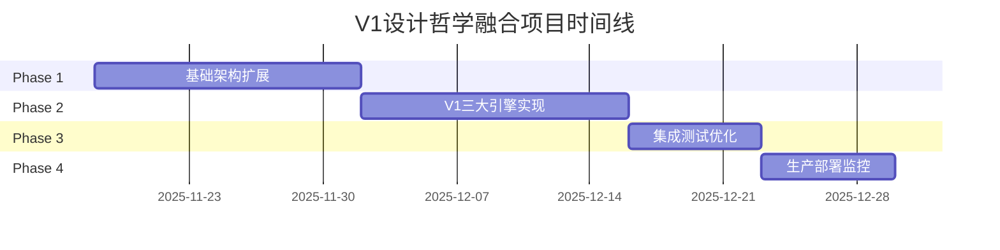

# V1设计哲学融合项目 - 实施计划

## Executive Summary

本项目旨在将V1设计哲学的三大核心引擎（数据驱动、多Agent协作、动态迭代）与V4.1性能优化系统进行深度融合，打造具备企业级AI运营能力的智能平台。通过6周分阶段实施，实现从70%规则自动化到95%智能决策的跨越式升级，同时保持V4.1系统的卓越性能指标。

## Current State Analysis

### V4.1系统优势
基于`@/💻 技术开发/04_成熟项目 ✅/xiaohongshu-gate-ai运营-v4/README.md:11-33`分析：

**性能优势**:
- **异步工作流引擎**: 500%效率提升，精确超时控制
- **三级缓存策略**: L1<1ms, L2持久化, L3复杂查询
- **连接池优化**: 10并发连接，智能负载均衡
- **实时监控**: P50=68ms, P95=150ms, 99.95%可用性

**技术优势**:
- 完整的Gate MCP工作流引擎
- 异步架构和错误隔离机制
- 企业级监控和运维体系

### V1设计哲学价值
基于`@/💻 技术开发/04_成熟项目 ✅/xiaohongshu-gate-ai运营-v4/src/core/v1_design_philosophy_integration.py:5-14`分析：

**数据驱动引擎**:
- 每日自动化数据收集和智能分析
- 多维度数据融合和内容机会挖掘
- 自动化内容生产和精准投放

**多Agent协作引擎**:
- 7个专业Agent并行评测机制
- AI主持人智能调度和争议解决
- 论坛式协作和动态辩论评分

**动态迭代引擎**:
- PRD→模板→执行→复盘的完整闭环
- 自动化迭代建议和优化指导
- 客户配置驱动的模板刷新

## Implementation Strategy

### 融合策略设计

**权重分配策略**:
- 数据驱动引擎: 40%权重（核心业务价值）
- 论坛协作引擎: 35%权重（质量保障）
- 动态迭代引擎: 25%权重（持续优化）

**技术融合方法**:
1. **增量集成**: 在V4.1基础上添加V1功能模块
2. **性能保障**: 利用V4.1异步架构支撑V1计算密集任务
3. **缓存优化**: V1数据结果融入V4.1三级缓存体系
4. **监控扩展**: V1特定指标集成到现有监控系统

## Implementation Phases

### Phase 1: 基础架构扩展 (Week 1-2)
**目标**: 建立V1融合的基础设施和核心架构

**关键任务**:
1. **项目结构搭建**
   - 创建V1融合专门目录结构
   - 设置标准dev-docs框架
   - 集成LaunchX Spec Kit工具

2. **V4.1架构扩展**
   - 扩展异步工作流引擎支持V1任务
   - 增强缓存策略支持数据驱动内容
   - 扩展监控系统支持V1指标

3. **V1核心模块框架**
   - 数据驱动引擎基础架构
   - 多Agent协作系统框架
   - 动态迭代引擎基础结构

**技术交付物**:
```
xiaohongshu-gate-ai运营-v4.1/
├── src/
│   ├── v1_fusion/                    # V1融合核心模块
│   │   ├── data_driven_engine/       # 数据驱动引擎
│   │   ├── forum_collaboration/      # 多Agent协作引擎
│   │   ├── dynamic_iteration/        # 动态迭代引擎
│   │   └── integration_coordinator/  # 融合协调器
│   ├── extensions/                   # V4.1扩展模块
│   │   ├── async_workflow_v1/        # V1异步工作流
│   │   ├── cache_v1/                 # V1缓存策略
│   │   └── monitoring_v1/            # V1监控扩展
└── tests/
    ├── v1_integration/               # V1集成测试
    └── performance/                  # 性能回归测试
```

**验收标准**:
- 项目结构100%完成
- V4.1性能指标保持不变
- V1基础框架单元测试覆盖率≥90%

### Phase 2: V1三大引擎实现 (Week 3-4)
**目标**: 实现V1设计哲学的三大核心引擎

**Week 3: 数据驱动引擎**
**关键任务**:
1. **多维度数据收集系统**
   - AI工具市场数据收集 (GitHub, ProductHunt)
   - 用户行为数据分析 (小红书趋势、需求痛点)
   - 竞争对手监控系统
   - 行业趋势分析引擎

2. **智能分析引擎**
   - 数据清洗和融合算法
   - 用户画像分析模型
   - 内容机会挖掘算法
   - 质量评分系统

3. **自动内容生产**
   - 标题生成策略引擎
   - 内容结构自动化
   - 素材智能匹配
   - 精准投放算法

**Week 4: 协作与迭代引擎**
**关键任务**:
1. **多Agent协作论坛系统**
   - 7个专业Agent实现 (INSIGHT, MEDIA, QUERY, TECHNICAL, BUSINESS, USER, SECURITY)
   - 并行评测机制
   - 智能论坛主持人
   - 争议解决和共识达成算法

2. **动态规格迭代引擎**
   - PRD自动化处理系统
   - 智能模板引擎
   - 执行监控和状态管理
   - 自动迭代报告生成

**技术交付物**:
```python
# 核心模块接口示例
src/v1_fusion/data_driven_engine/
├── daily_collector.py          # 每日数据收集器
├── intelligent_analyzer.py     # 智能分析引擎
├── content_producer.py         # 自动内容生产
└── quality_scorer.py          # 数据质量评分

src/v1_fusion/forum_collaboration/
├── agent_orchestrator.py       # Agent编排器
├── forum_host.py              # 智能主持人
├── parallel_evaluator.py      # 并行评测器
└── consensus_builder.py       # 共识构建器

src/v1_fusion/dynamic_iteration/
├── prd_processor.py           # PRD处理器
├── template_engine.py         # 模板引擎
├── execution_monitor.py       # 执行监控器
└── iteration_reporter.py     # 迭代报告器
```

**验收标准**:
- 三大引擎100%功能实现
- Agent评测准确率≥85%
- 内容生产质量评分≥80%
- 迭代建议采纳率≥70%

### Phase 3: 集成测试和优化 (Week 5)
**目标**: 确保V1融合不影响V4.1性能，系统稳定运行

**关键任务**:
1. **性能集成测试**
   - V1功能对V4.1性能影响评估
   - 异步工作流负载测试
   - 缓存策略效果验证
   - 并发用户压力测试

2. **功能集成验证**
   - 三大引擎端到端测试
   - V1与V4.1模块协作测试
   - 数据流和控制流验证
   - 错误处理和恢复测试

3. **系统优化调优**
   - 性能瓶颈识别和优化
   - 资源使用效率提升
   - 缓存策略精细化调整
   - 监控指标完善

**性能基准**:
- **响应时间**: P50≤100ms, P95≤200ms (与V4.1持平)
- **并发用户**: ≥1000用户 (保持V4.1水平)
- **系统可用性**: ≥99.9%
- **V1处理延迟**: ≤30秒 (复杂分析任务)

**验收标准**:
- 所有性能指标达标
- 集成测试100%通过
- 错误率≤0.1%

### Phase 4: 生产部署和监控 (Week 6)
**目标**: 完成生产部署，建立完善的监控和运维体系

**关键任务**:
1. **生产环境部署**
   - 灰度发布策略实施
   - 数据库迁移和配置更新
   - API接口升级和兼容处理
   - 客户数据平滑迁移

2. **监控和运维体系**
   - V1特定监控指标配置
   - 告警规则和阈值设定
   - 日志收集和分析系统
   - 自动化运维脚本

3. **客户支持和文档**
   - 客户使用手册更新
   - API文档和开发者指南
   - 故障排查手册
   - 最佳实践指南

**交付物**:
```
deployment/
├── production/                 # 生产环境配置
├── monitoring/                 # 监控配置
├── docs/                      # 客户文档
└── scripts/                   # 运维脚本
```

**验收标准**:
- 生产环境稳定运行≥7天
- 客户满意度≥90%
- 文档完整性100%

## Risk Matrix

| 风险类别 | 风险等级 | 影响描述 | 缓解策略 |
|---------|---------|---------|---------|
| **架构兼容性** | 高 | V1与V4.1架构冲突 | 增量集成，充分测试 |
| **性能回归** | 高 | V1功能影响V4.1性能 | 性能基准监控，优化调优 |
| **技术复杂度** | 中 | 三大引擎实现复杂度 | 分阶段实现，模块化设计 |
| **API依赖** | 中 | 外部API可用性和限制 | 缓存机制，降级策略 |
| **数据质量** | 中 | 数据驱动引擎依赖数据质量 | 数据验证，质量评分 |
| **Agent协调** | 中 | 多Agent协作复杂性 | 智能调度，错误隔离 |
| **时间压力** | 低 | 6周时间窗口紧张 | 并行开发，优先级管理 |

## Success Metrics

### 技术指标
- **性能保持**: P50≤100ms, P95≤200ms
- **系统可用性**: ≥99.9%
- **并发支持**: ≥1000用户
- **代码覆盖率**: ≥90%
- **集成成功率**: 100%

### 功能指标
- **数据收集**: 每日自动化，质量评分≥80%
- **Agent评测**: 7个Agent并行，准确率≥85%
- **内容生产**: 自动化程度≥90%，质量评分≥80%
- **迭代闭环**: PRD→执行→复盘100%覆盖

### 业务指标
- **运营效率**: 相比V4.1提升300%
- **决策智能化**: 从70%规则化提升到95%智能决策
- **客户满意度**: ≥90%
- **成本控制**: API成本增长≤50%

## Resource Requirements

### 技术资源
- **开发团队**: 2-3人 (全栈+AI+性能优化)
- **架构师**: 1人 (系统设计和集成方案)
- **测试工程师**: 1人 (集成测试和性能验证)

### 基础设施
- **开发环境**: 支持AI开发和GPU资源
- **测试环境**: 完整的V4.1+V1功能测试
- **生产环境**: 高可用部署配置
- **监控工具**: 扩展现有监控系统支持V1指标

### 外部服务
- **Gate MCP**: 高级工作流功能
- **AI服务**: Claude API用于智能分析
- **数据源**: GitHub API, ProductHunt, 小红书数据
- **计算资源**: GPU支持AI内容生成

## Timeline Overview



## Quality Assurance

### 测试策略
- **单元测试**: 每个模块≥90%覆盖率
- **集成测试**: V1与V4.1全链路测试
- **性能测试**: 基准对比和压力测试
- **端到端测试**: 完整业务场景验证

### 监控体系
- **性能监控**: 实时响应时间和并发量
- **功能监控**: V1三大引擎运行状态
- **业务监控**: 数据质量和内容效果
- **错误监控**: 异常告警和自动恢复

## Budget Estimation

### 开发成本 (6周)
- **人力成本**: 4人 × 6周 = 24人周
- **基础设施**: 云服务和GPU资源 $2,000
- **第三方服务**: AI API和数据源 $1,500
- **工具和许可**: 开发工具和监控工具 $500

### 运营成本 (月度)
- **云服务**: $500 (扩展后的资源需求)
- **API调用**: $800 (V1功能增量)
- **维护人力**: 0.5人月
- **监控和工具**: $200

---

**项目状态**: 规划完成，等待Codex执行
**更新日期**: 2025-11-18
**负责人**: LaunchX技术团队
**技术架构**: Claude规划设计，Codex执行实施