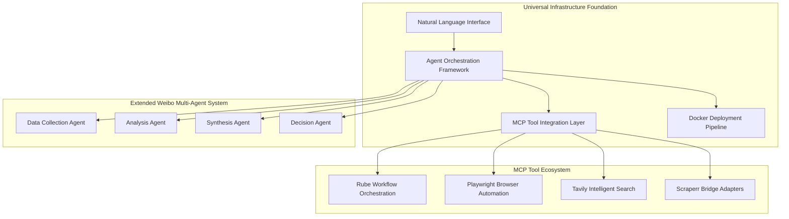
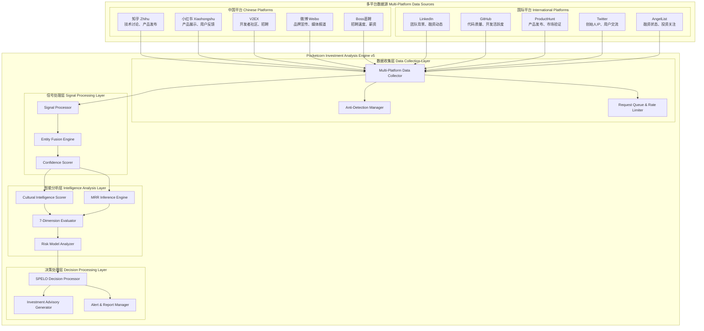
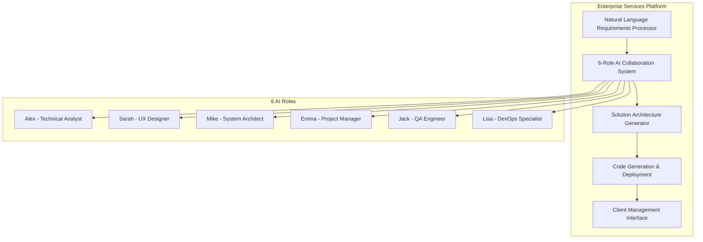
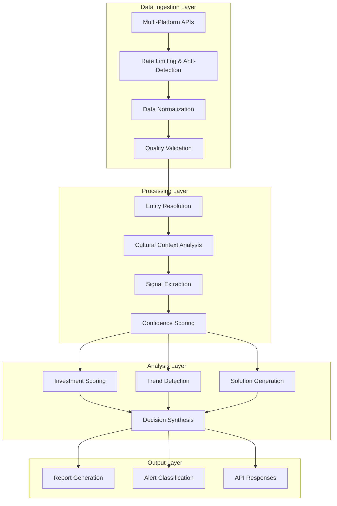

# Technical Architecture Specification
**Universal Zero-Code AI Collaboration Ecosystem**  
**Version:** 1.0.0  
**Date:** 2025-01-22  
**Status:** Specification Phase

## Design Philosophy & Strategic Intent | 设计哲学与战略初衷

### Core Design Philosophy
**"让0代码背景的用户通过自然语言对话完成复杂的AI驱动任务"**

这个系统的设计哲学基于一个根本洞察：**技术复杂性应该被智能地隐藏，而不是简化。** 我们不是在降低功能的复杂性，而是在提升交互的直觉性。

### Strategic Design Principles | 战略设计原则

```yaml
哲学层次 (Philosophy Level):
  人机协作新范式:
    理念: "AI作为超级助手，人类保持决策主导权"
    实现: "BMAD混合智能架构 - Brain-Tier人类判断 + AI-Tier机器执行"
    价值: "放大人类直觉和创造力，而非替代人类思考"
    
  零代码不等于零能力:
    理念: "降低技术门槛，提升专业能力"
    实现: "通过自然语言接口释放复杂AI功能"
    价值: "让投资人专注投资判断，让设计师专注创意实现"
    
  专业化通用基础设施:
    理念: "一套基础设施，多个专业扩展"
    实现: "Weibo通用多智能体 + Pocketcorn投资专业化 + Zhilink企业服务专业化"
    价值: "避免重复造轮子，实现真正的模块化复用"

战略层次 (Strategic Level):
  市场定位战略:
    目标用户: "有专业判断力但缺乏技术实现能力的高价值用户群"
    差异化优势: "唯一真正为0代码背景用户设计的AI协作系统"
    市场机会: "传统软件开发与AI能力之间的巨大鸿沟"
    
  技术选择战略:
    基础决策: "基于Weibo成熟多智能体系统，而非从零开始"
    扩展策略: "通过MCP工具生态连接外部能力，而非自建一切"
    演进路径: "从投资分析单点突破，到通用AI协作平台"
    
  商业模式战略:
    Pocketcorn: "投资分析专业化，收入分成模式验证市场"
    Zhilink: "企业服务平台化，AI能力交易生态"
    LaunchX: "通用协作基础设施，赋能更多垂直领域"

实施层次 (Implementation Level):
  架构选择依据:
    每个技术选择都服务于"零代码用户体验"这一核心目标
    每个组件设计都考虑"专业化扩展"的灵活性要求
    每个接口定义都优化"自然语言交互"的直觉性
```

### Pocketcorn投资系统的三层战略思考框架
```yaml
第一层：对市场的深度思考 - 好的AI企业画像
  市场洞察:
    核心判断: "真正有价值的AI企业处于PMF后、爆发前的关键窗口期"
    时间窗口: "产品找到市场契合度后，但还未被传统VC大量关注的黄金期"
    价值识别: "具备技术壁垒、市场牵引力、团队执行力的三重验证企业"
    
  优质AI企业的本质特征:
    技术价值: "不是追逐AI热点，而是用AI解决真实痛点"
    商业模式: "已验证付费意愿，收入增长轨迹清晰"
    团队质量: "创始人具备技术深度+市场洞察的双重能力"
    市场时机: "处于细分市场的早期增长阶段，具备先发优势"
    
  投资哲学:
    不投机: "不追风口，投长期价值创造者"
    不跟风: "在共识形成前发现，在泡沫形成前退出"
    不贪心: "50万精准投资，1.5倍稳健回收，复利增长"

第二层：对我们自己的深度理解 - 我们要找的内容画像
  自身定位:
    资金规模: "50万投资额决定了我们的目标企业规模和阶段"
    回收期望: "6-8个月1.5倍回收，决定了企业必须处于增长爆发期"
    能力边界: "我们擅长发现和验证，不擅长长期陪伴和资源整合"
    
  目标企业精确画像:
    团队规模: "3-10人 (50万能产生显著推动作用的规模)"
    收入水平: "月收入5万+ (能承受15%分成且有增长空间)"
    发展阶段: "PMF已验证，但增长资源受限的关键突破期"
    创始人状态: "有增长焦虑，愿意接受外部资金和指导"
    
  数据维度需求:
    财务维度: "MRR趋势、增长率、用户付费意愿、收入结构"
    团队维度: "招聘速度、薪资水平、股权分配、团队稳定性"
    产品维度: "用户反馈、迭代频率、市场接受度、技术壁垒"
    市场维度: "竞争态势、用户规模、市场时机、行业趋势"

第三层：数据获取和分析的系统性方法 - 怎么抓取、判断、分析
  抓取策略:
    平台选择逻辑: "目标企业在哪里出现 → 我们在哪里监控"
    信号识别逻辑: "什么行为表明企业处于目标阶段 → 我们抓取什么信号"
    时效性考虑: "信息的时间价值 → 我们多快响应和处理"
    
  判断框架:
    多源验证: "单一信号不足信，多源交叉验证确保准确性"
    时间序列: "不看静态快照，看动态趋势和变化轨迹"
    对比基准: "不是绝对好坏，而是相对于同阶段企业的表现"
    
  分析系统:
    BMAD架构: "人类判断(Brain) + AI分析(AI) = 混合智能决策"
    SPELO流程: "Study-Plan-Execute-Learn-Optimize闭环优化"
    多Agent协作: "投资委员会模式，多角度评估达成共识"
    文化智能: "跨文化投资的兼容性和风险评估"

核心战略原则:
  信息不对称套利: "我们通过更好的信息发现和分析创造价值"
  时间窗口套利: "我们在价值被广泛认知前进入和退出"
  专业化套利: "我们专注AI企业分析，形成独特的判断优势"
```

### 技术架构的哲学体现
```yaml
自然语言优先:
  设计理念: "技术应该说人话，而不是让人学技术话"
  实现方式: "所有功能都可以通过对话完成，而非学习复杂界面"
  体验目标: "如同与专业助手对话，而非操作软件系统"

智能体协作:
  设计理念: "模拟真实的专业团队协作模式"
  实现方式: "多Agent论坛式辩论，达成共识式决策"
  体验目标: "如同拥有一个专业的投资分析团队"

文化智能:
  设计理念: "AI系统应该理解商业文化的差异性"
  实现方式: "内置东西方商业文化兼容性分析"
  体验目标: "跨文化投资决策的智能支持"

持续进化:
  设计理念: "系统应该从每次使用中学习和改进"
  实现方式: "SPELO框架确保每个决策都产生学习价值"
  体验目标: "系统越用越智能，越来越懂用户"
```

## Architecture Overview

基于上述设计哲学，Universal Zero-Code AI Collaboration Ecosystem通过分层的微服务架构实现，将Weibo成熟的多智能体协作模式扩展为通用的AI协作基础设施。**Pocketcorn投资分析系统作为第一个实战特化任务**，验证和指导整个架构的设计和实现。

### Core Architecture Principles | 核心架构原则

1. **Philosophy-Driven Design:** 每个技术决策都服务于零代码用户体验哲学
2. **Agent-Centric Collaboration:** 多智能体协作作为核心交互模式
3. **Natural Language First:** 所有接口优先考虑自然语言交互
4. **Cultural Intelligence Integration:** 内置文化智能，支持跨文化场景
5. **Specialized Universality:** 通用基础设施支持专业化扩展
6. **Evidence-Based Decision:** 所有决策基于数据证据和多Agent共识
7. **Pocketcorn-First Design:** 架构设计以Pocketcorn需求为第一验证场景

### Pocketcorn作为架构验证的第一特化任务

#### 核心实施要求 | Core Implementation Requirements

```yaml
为什么Pocketcorn是理想的第一任务:
  业务复杂度适中: "投资分析涉及多维度数据但逻辑相对清晰"
  数据源丰富: "全球化平台提供充分的测试数据"
  结果可验证: "投资成败有明确的验证反馈"
  用户价值明确: "0代码背景投资人的真实需求"
  技术栈完整: "需要用到架构的所有核心组件"

Pocketcorn驱动的架构需求:
  实时数据收集: "企业发现需要7x24小时监控全球平台"
  多源数据融合: "投资分析需要跨平台信号关联"
  智能Agent协作: "投资委员会需要多角度评估和辩论"
  自然语言交互: "投资人需要对话式的分析和报告"
  文化智能分析: "跨文化投资需要兼容性评估"
  学习优化能力: "投资决策需要从历史中学习"

架构设计的Pocketcorn约束:
  性能要求: "15-30分钟内完成完整企业分析"
  准确性要求: "投资建议准确率>85%，风险预警准确率>90%"
  扩展性要求: "支持并行分析100+目标企业"
  可靠性要求: "7x24小时稳定运行，数据丢失率<0.1%"
```

#### Pocketcorn具体实施细节 | Specific Implementation Details

```yaml
目标企业画像精确化:
  财务指标约束:
    团队规模: "3-10人 (50万投资额的最优影响规模)"
    月收入要求: "≥5万MRR (能够承受15%收入分成)"
    增长率要求: "月环比增长≥15% (证明处于增长期)"
    收入稳定性: "连续3个月正现金流 (基础生存能力)"
    
  发展阶段识别:
    PMF验证: "产品市场契合度已初步验证，有付费用户"
    增长瓶颈: "受限于推广资金，而非产品或团队能力"
    时间窗口: "处于VC关注前的黄金发现期"
    扩张准备: "团队具备接受投资后快速扩张的能力"
    
  文化兼容性:
    沟通方式: "能够接受中西方混合的商业协作模式"
    开放程度: "愿意分享核心业务数据和后台权限"
    增长意愿: "对快速增长有强烈渴望和执行决心"
    学习能力: "能够接受专业指导并快速调整策略"

平台监控与企业发现策略:
  中国平台信号源:
    知乎: "技术讨论、产品发布、招聘信息、行业分析"
    小红书: "产品展示、用户反馈、市场接受度、消费趋势"
    V2EX: "技术社区讨论、开发者招聘、产品技术细节"
    微博: "品牌宣传、媒体报道、用户评价、热点跟踪"
    Boss直聘/拉勾: "招聘增长速度、薪资水平、团队扩张信号"
    
  国际平台信号源:
    LinkedIn: "团队背景、融资动态、业务拓展、国际化信号"
    GitHub: "代码质量、开发活跃度、技术栈、开源贡献"
    ProductHunt: "产品发布、用户反馈、市场验证、媒体关注"
    Twitter: "创始人个人IP、产品宣传、用户交流、行业影响力"
    AngelList: "早期融资状态、投资者关注、估值水平"

数据抓取与分析的技术实现:
  反检测机制:
    用户代理轮换: "模拟真实用户行为，避免被识别为爬虫"
    请求频率控制: "符合各平台的访问频率限制"
    代理IP轮换: "使用住宅代理IP，降低被封禁风险"
    会话管理: "维护真实的会话状态和cookie管理"
    
  数据质量控制:
    多源验证: "同一信号需要至少2个平台的交叉验证"
    时效性检查: "数据时间戳验证，确保信息新鲜度"
    置信度评分: "基于数据源可靠性和一致性的综合评分"
    异常检测: "识别和过滤明显的虚假或误导信息"
    
  信号融合算法:
    加权融合: "不同平台数据根据可靠性进行加权"
    趋势分析: "时间序列分析识别增长轨迹和变化趋势"
    关联分析: "跨平台实体识别和关系映射"
    情感分析: "用户评价和市场反馈的情感倾向分析"

BMAD混合智能的具体实现:
  Brain-Tier人类判断层:
    投资价值观设定: "风险偏好、行业倾向、投资哲学"
    战略决策制定: "投资方向、退出策略、组合管理"
    直觉判断补充: "数据无法量化的软性因素评估"
    经验知识注入: "历史投资经验和市场洞察"
    
  AI-Tier机器执行层:
    数据收集自动化: "7x24小时监控和数据抓取"
    模式识别分析: "识别成功企业的共同特征模式"
    风险评估建模: "基于历史数据的风险预测模型"
    报告生成优化: "自动化生成结构化分析报告"

SPELO闭环决策的执行细节:
  Study阶段 (研究):
    市场扫描: "识别符合条件的潜在目标企业"
    深度调研: "收集企业的全维度数据和信号"
    竞争分析: "分析同行业其他企业的表现"
    趋势研究: "理解行业发展趋势和未来机会"
    
  Plan阶段 (计划):
    投资策略: "制定具体的投资方案和条件"
    尽调计划: "设计深度尽职调查的执行计划"
    风险预案: "识别可能风险并制定应对策略"
    退出规划: "设定投资回收的时间和条件"
    
  Execute阶段 (执行):
    投资谈判: "与目标企业进行投资条件谈判"
    协议签署: "完成法律文件和投资协议"
    资金投入: "按计划分阶段投入资金和资源"
    增长支持: "提供推广和管理支持"
    
  Learn阶段 (学习):
    结果跟踪: "监控投资后企业的发展表现"
    经验总结: "分析成功和失败的关键因素"
    模型优化: "基于实际结果优化评估模型"
    知识积累: "将经验转化为可复用的知识"
    
  Optimize阶段 (优化):
    策略调整: "基于学习结果调整投资策略"
    流程改进: "优化投资决策流程和效率"
    工具升级: "改进数据收集和分析工具"
    能力提升: "提升投资判断和执行能力"

MCP工具集成的Pocketcorn特化配置:
  Rube工作流编排:
    企业发现工作流: "自动化的多平台企业监控和识别"
    尽调数据收集流: "标准化的企业深度调研流程"
    投资决策工作流: "结构化的投资评估和决策流程"
    投后管理工作流: "系统化的投资后跟踪和支持"
    
  Tavily智能搜索:
    行业趋势搜索: "实时的行业动态和趋势分析"
    竞品对比搜索: "同行业企业的对比分析"
    创始人背景搜索: "团队核心人员的背景调研"
    媒体报道搜索: "企业相关的媒体报道收集"
    
  Playwright浏览器自动化:
    平台数据抓取: "自动化的多平台数据收集"
    反检测处理: "模拟真实用户行为的数据获取"
    动态内容获取: "处理JavaScript动态加载的内容"
    登录状态维护: "维护平台登录状态进行深度抓取"

成熟软件基座的集成改造:
  Weibo多智能体系统改造:
    Agent角色重新定义: "从舆情分析转向投资分析专业角色"
    数据源扩展: "从微博单一平台扩展到全球多平台"
    分析维度调整: "从舆情指标转向投资评估维度"
    决策逻辑优化: "从舆情响应转向投资决策逻辑"
    
  Scraperr数据收集系统集成:
    采集目标调整: "从通用网页抓取转向企业信号采集"
    反检测升级: "增强反检测能力适应商业平台监控"
    数据结构优化: "调整数据结构适应投资分析需求"
    实时性增强: "提升数据收集的实时性和准确性"
    
  现有MCP生态利用:
    工具链整合: "将现有MCP工具整合到投资分析流程中"
    接口标准化: "统一各工具的接口和数据格式"
    工作流编排: "将独立工具编排成完整的投资分析流程"
    性能优化: "优化工具调用效率和资源利用率"
```

## System Architecture Layers

### Layer 1: Universal Infrastructure Foundation



#### Natural Language Interface (NLI)
**Technology Stack:** Python/FastAPI + OpenAI GPT-4 + Custom Intent Recognition
**Responsibilities:**
- Intent recognition and task decomposition
- Multi-language support (22+ languages) with cultural context preservation
- Conversational flow management and user guidance
- Query optimization and disambiguation

**Key Components:**
```python
class NaturalLanguageInterface:
    def __init__(self):
        self.intent_classifier = MultiLanguageIntentClassifier()
        self.task_decomposer = TaskDecompositionEngine()
        self.context_manager = ConversationContextManager()
        self.cultural_adapter = CulturalContextAdapter()
    
    async def process_user_input(self, query: str, user_context: dict) -> ProcessedTask:
        # Intent recognition with cultural context
        intent = await self.intent_classifier.classify(query, user_context)
        
        # Task decomposition
        subtasks = await self.task_decomposer.decompose(intent)
        
        # Cultural context injection
        enriched_tasks = await self.cultural_adapter.enrich(subtasks)
        
        return ProcessedTask(intent=intent, subtasks=enriched_tasks)
```

#### Agent Orchestration Framework (AOF)
**Technology Stack:** Python/Asyncio + Redis for state management + Message Queue
**Responsibilities:**
- Dynamic agent composition and lifecycle management
- Forum-style debate coordination between agents
- Cross-agent knowledge sharing and context preservation
- Task routing and load balancing

**Architecture Pattern:**
```python
class AgentOrchestrationFramework:
    def __init__(self):
        self.agent_registry = AgentRegistry()
        self.debate_coordinator = DebateCoordinator()
        self.knowledge_broker = CrossAgentKnowledgeBroker()
        self.task_router = TaskRouter()
    
    async def orchestrate_task(self, task: ProcessedTask) -> TaskResult:
        # Select optimal agent composition
        agents = await self.agent_registry.select_agents(task.requirements)
        
        # Initialize debate session
        debate_session = await self.debate_coordinator.initialize(
            task=task, 
            participants=agents
        )
        
        # Execute collaborative analysis
        result = await debate_session.execute()
        
        return result
```

### Layer 2: Specialized Application Engines

#### Investment Analysis Engine (Pocketcorn v5)

**核心系统架构图:**



**Pocketcorn专用技术组件:**

```python
# 企业发现与信号收集系统
class PocketcornEnterpriseDiscoverySystem:
    def __init__(self):
        self.platform_adapters = {
            'zhihu': ZhihuAdapter(),
            'xiaohongshu': XiaohongshuAdapter(), 
            'v2ex': V2EXAdapter(),
            'weibo': WeiboAdapter(),
            'boss_zhipin': BossZhipinAdapter(),
            'linkedin': LinkedInAdapter(),
            'github': GitHubAdapter(),
            'producthunt': ProductHuntAdapter(),
            'twitter': TwitterAdapter(),
            'angellist': AngelListAdapter()
        }
        self.anti_detection = AdvancedAntiDetectionManager()
        self.signal_fusion = CrossPlatformSignalFusion()
        self.enterprise_filter = PocketcornEnterpriseFilter()
    
    async def discover_target_enterprises(self, scan_criteria: dict) -> List[EnterpriseProfile]:
        """发现符合Pocketcorn投资标准的目标企业"""
        
        # 1. 多平台并行扫描
        discovery_tasks = []
        for platform, adapter in self.platform_adapters.items():
            if platform in scan_criteria.get('platforms', []):
                task = self._scan_platform_for_signals(
                    platform, adapter, scan_criteria
                )
                discovery_tasks.append(task)
        
        platform_results = await asyncio.gather(*discovery_tasks)
        
        # 2. 跨平台信号融合
        fused_signals = await self.signal_fusion.fuse_cross_platform_signals(
            platform_results
        )
        
        # 3. Pocketcorn标准过滤
        filtered_enterprises = await self.enterprise_filter.filter_by_pocketcorn_criteria(
            fused_signals,
            criteria={
                'team_size_range': (3, 10),
                'mrr_minimum': 50000,  # 5万RMB
                'growth_rate_minimum': 0.15,  # 15%月增长
                'cultural_compatibility_minimum': 0.7
            }
        )
        
        return filtered_enterprises
    
    async def _scan_platform_for_signals(self, platform: str, adapter: PlatformAdapter, 
                                       criteria: dict) -> PlatformScanResult:
        """单平台信号扫描"""
        
        # 反检测设置
        await self.anti_detection.setup_session(platform)
        
        # 定向信号搜索
        search_queries = self._generate_search_queries(platform, criteria)
        
        signals = []
        for query in search_queries:
            try:
                # 执行搜索并收集信号
                results = await adapter.search_with_anti_detection(
                    query=query,
                    anti_detection_config=self.anti_detection.get_config(platform)
                )
                
                # 提取企业相关信号
                enterprise_signals = await adapter.extract_enterprise_signals(results)
                signals.extend(enterprise_signals)
                
                # 频率控制
                await self.anti_detection.apply_rate_limiting(platform)
                
            except Exception as e:
                logger.warning(f"Platform {platform} query failed: {e}")
                continue
        
        return PlatformScanResult(
            platform=platform,
            signals=signals,
            scan_timestamp=datetime.now(),
            signal_count=len(signals)
        )
    
    def _generate_search_queries(self, platform: str, criteria: dict) -> List[str]:
        """为特定平台生成搜索查询"""
        
        base_queries = {
            'zhihu': [
                'AI创业 月收入 增长',
                'SaaS产品 付费用户 团队',
                '技术创业 B端产品 营收',
                'AI工具 商业化 盈利模式'
            ],
            'xiaohongshu': [
                'AI产品 用户反馈 商业模式',
                '创业产品 付费转化 增长',
                'SaaS工具 企业服务 收入'
            ],
            'v2ex': [
                '创业项目 技术团队 招聘',
                'side project 月收入',
                '独立开发 商业化 盈利',
                'AI项目 用户增长'
            ],
            'linkedin': [
                'AI startup Series A funding',
                'SaaS company revenue growth',
                'Early stage AI company hiring',
                'AI product market fit validation'
            ],
            'github': [
                'AI project commercial license',
                'SaaS open source monetization',
                'Startup technical architecture'
            ]
        }
        
        return base_queries.get(platform, [])

# MRR推断引擎 - Pocketcorn特化版本
class PocketcornMRRInferenceEngine:
    def __init__(self):
        self.hiring_signal_analyzer = HiringSignalAnalyzer()
        self.pricing_evolution_tracker = PricingEvolutionTracker()
        self.customer_testimony_analyzer = CustomerTestimonyAnalyzer()
        self.cultural_mrr_adjuster = CulturalMRRAdjuster()
        
    async def infer_mrr_with_cultural_context(self, 
                                            company_signals: EnterpriseSignals) -> MRREstimate:
        """推断企业MRR，考虑文化和地区因素"""
        
        # 1. 基础MRR信号分析
        hiring_mrr_signal = await self.hiring_signal_analyzer.analyze(
            hiring_data=company_signals.hiring_signals,
            geographic_context=company_signals.geographic_context
        )
        
        pricing_mrr_signal = await self.pricing_evolution_tracker.analyze(
            pricing_history=company_signals.pricing_evolution,
            market_context=company_signals.market_positioning
        )
        
        customer_mrr_signal = await self.customer_testimony_analyzer.analyze(
            testimonials=company_signals.customer_testimonials,
            satisfaction_indicators=company_signals.satisfaction_metrics
        )
        
        # 2. 文化调整因子
        cultural_adjustment = await self.cultural_mrr_adjuster.calculate_adjustment(
            company_location=company_signals.company_location,
            customer_base_distribution=company_signals.customer_geography,
            communication_style=company_signals.communication_patterns
        )
        
        # 3. 综合MRR估算
        base_mrr_estimate = self._calculate_weighted_mrr(
            hiring_signal=hiring_mrr_signal,
            pricing_signal=pricing_mrr_signal,
            customer_signal=customer_mrr_signal
        )
        
        # 4. 文化因素调整
        adjusted_mrr_estimate = base_mrr_estimate * cultural_adjustment.multiplier
        
        # 5. 置信度评估
        confidence_score = self._calculate_confidence(
            signal_consistency=company_signals.signal_consistency,
            data_freshness=company_signals.data_freshness,
            cross_platform_validation=company_signals.cross_platform_validation
        )
        
        return MRREstimate(
            estimated_mrr=adjusted_mrr_estimate,
            confidence_level=confidence_score,
            cultural_adjustment_factor=cultural_adjustment.multiplier,
            supporting_signals={
                'hiring': hiring_mrr_signal,
                'pricing': pricing_mrr_signal,
                'customer': customer_mrr_signal
            },
            meets_pocketcorn_threshold=adjusted_mrr_estimate >= 50000  # 5万RMB门槛
        )

# 7维度投资评估器 - Pocketcorn定制版
class PocketcornSevenDimensionEvaluator:
    def __init__(self):
        self.dimension_analyzers = {
            'technology': TechnologyAssessmentAnalyzer(),
            'market': MarketAnalysisAnalyzer(),
            'team': TeamEvaluationAnalyzer(),
            'business_model': BusinessModelAnalyzer(),
            'competitive_advantage': CompetitiveAdvantageAnalyzer(),
            'risk_assessment': RiskAssessmentAnalyzer(),
            'timing': TimingAnalysisAnalyzer()
        }
        self.pocketcorn_weights = {
            'technology': 0.15,
            'market': 0.20,
            'team': 0.25,  # 重点关注团队
            'business_model': 0.20,
            'competitive_advantage': 0.10,
            'risk_assessment': 0.05,
            'timing': 0.05
        }
    
    async def evaluate_for_pocketcorn_investment(self, 
                                               company_profile: EnterpriseProfile) -> InvestmentEvaluation:
        """基于Pocketcorn投资标准的7维度评估"""
        
        dimension_scores = {}
        detailed_analysis = {}
        
        # 并行执行7个维度的分析
        analysis_tasks = []
        for dimension, analyzer in self.dimension_analyzers.items():
            task = analyzer.analyze_with_pocketcorn_focus(
                company_profile=company_profile,
                investment_amount=500000,  # 50万投资额
                target_return_timeline=(6, 8),  # 6-8个月回收期
                cultural_context=company_profile.cultural_intelligence
            )
            analysis_tasks.append((dimension, task))
        
        results = await asyncio.gather(*[task for _, task in analysis_tasks])
        
        for (dimension, _), result in zip(analysis_tasks, results):
            dimension_scores[dimension] = result.score
            detailed_analysis[dimension] = result.analysis
        
        # 计算加权总分
        weighted_score = sum(
            score * self.pocketcorn_weights[dimension]
            for dimension, score in dimension_scores.items()
        )
        
        # 生成投资建议
        investment_recommendation = self._generate_pocketcorn_recommendation(
            weighted_score=weighted_score,
            dimension_scores=dimension_scores,
            company_profile=company_profile
        )
        
        return InvestmentEvaluation(
            overall_score=weighted_score,
            dimension_scores=dimension_scores,
            detailed_analysis=detailed_analysis,
            investment_recommendation=investment_recommendation,
            pocketcorn_fit_assessment=self._assess_pocketcorn_fit(
                company_profile, dimension_scores
            )
        )
    
    def _generate_pocketcorn_recommendation(self, weighted_score: float,
                                          dimension_scores: dict,
                                          company_profile: EnterpriseProfile) -> InvestmentRecommendation:
        """生成Pocketcorn投资建议"""
        
        if weighted_score >= 0.85:
            recommendation = "强烈推荐投资"
            confidence = "高置信度"
        elif weighted_score >= 0.70:
            recommendation = "推荐投资"
            confidence = "中高置信度"
        elif weighted_score >= 0.55:
            recommendation = "谨慎观望"
            confidence = "中等置信度"
        else:
            recommendation = "不推荐投资"
            confidence = "低置信度"
        
        # 识别关键风险和机会
        key_strengths = [
            dim for dim, score in dimension_scores.items() 
            if score >= 0.80
        ]
        key_concerns = [
            dim for dim, score in dimension_scores.items() 
            if score <= 0.50
        ]
        
        return InvestmentRecommendation(
            recommendation=recommendation,
            confidence_level=confidence,
            key_strengths=key_strengths,
            key_concerns=key_concerns,
            investment_rationale=self._generate_rationale(
                weighted_score, dimension_scores, company_profile
            ),
            suggested_investment_terms=self._suggest_investment_terms(
                company_profile, weighted_score
            )
        )
```

**7维度评估的Pocketcorn特化标准:**

```yaml
技术评估 (Technology Assessment) - 权重15%:
  技术壁垒强度: "评估技术门槛和可复制性"
  技术团队实力: "核心技术人员的背景和能力"
  技术发展趋势: "所用技术是否符合行业发展方向"
  知识产权保护: "专利、商业秘密等IP保护情况"
  Pocketcorn关注点: "技术是否足以支撑6-8个月的快速增长"

市场评估 (Market Analysis) - 权重20%:
  市场规模评估: "TAM/SAM/SOM分析，重点关注SAM"
  增长潜力分析: "市场增长率和发展阶段"
  客户需求验证: "PMF验证和付费意愿强度"
  市场竞争态势: "竞争对手分析和市场集中度"
  Pocketcorn关注点: "市场是否支持快速获客和收入增长"

团队评估 (Team Evaluation) - 权重25% (最高权重):
  创始人背景: "教育背景、工作经历、创业经验"
  团队配置: "技术、市场、运营团队的配置合理性"
  执行能力: "项目推进速度和里程碑达成情况"
  学习适应能力: "接受指导和快速调整的能力"
  文化匹配度: "与Pocketcorn合作模式的兼容性"
  Pocketcorn关注点: "团队是否能承受和利用50万投资快速扩张"

商业模式 (Business Model) - 权重20%:
  收入模式清晰度: "收入来源和盈利模式的明确性"
  用户获取成本: "CAC和LTV的健康度"
  现金流状况: "现金流正负和现金流周期"
  扩展性评估: "业务模式的规模化潜力"
  Pocketcorn关注点: "商业模式是否支持15%收入分成且仍有增长空间"

竞争优势 (Competitive Advantage) - 权重10%:
  差异化程度: "产品或服务的独特性"
  护城河深度: "竞争壁垒的强度和持久性"
  先发优势: "在细分市场的领先地位"
  网络效应: "用户增长是否带来竞争优势增强"
  Pocketcorn关注点: "竞争优势是否足以维持6-8个月的增长期"

风险评估 (Risk Assessment) - 权重5%:
  技术风险: "技术实现和发展的不确定性"
  市场风险: "市场变化和竞争风险"
  团队风险: "关键人员依赖和团队稳定性"
  法律合规风险: "知识产权、数据保护等合规风险"
  Pocketcorn关注点: "风险是否在6-8个月投资期内可控"

时机判断 (Timing Analysis) - 权重5%:
  市场时机: "进入市场的时机是否合适"
  融资时机: "企业发展阶段与融资需求的匹配"
  行业周期: "所处行业的发展周期位置"
  宏观环境: "经济环境对业务的影响"
  Pocketcorn关注点: "当前是否是投资的最佳时机窗口"
```

**Key Technical Components:**

```python
class InvestmentAnalysisEngine:
    def __init__(self):
        self.data_collector = MultiPlatformDataCollector()
        self.cultural_scorer = CulturalIntelligenceScorer()
        self.mrr_engine = MRRInferenceEngine()
        self.evaluator = SevenDimensionEvaluator()
        self.spelo_processor = SPELODecisionProcessor()
    
    async def analyze_company(self, company_identifier: str) -> InvestmentAnalysis:
        # Multi-platform data collection
        raw_data = await self.data_collector.collect_comprehensive_data(
            company_identifier,
            platforms=['zhihu', 'linkedin', 'github', 'boss_zhipin', 'v2ex']
        )
        
        # Cultural intelligence analysis
        cultural_score = await self.cultural_scorer.analyze(
            raw_data.communication_patterns,
            raw_data.team_composition,
            raw_data.business_approach
        )
        
        # Revenue inference
        mrr_estimate = await self.mrr_engine.infer_revenue(
            hiring_signals=raw_data.hiring_velocity,
            pricing_signals=raw_data.pricing_evolution,
            customer_signals=raw_data.customer_testimonials
        )
        
        # Comprehensive evaluation
        evaluation = await self.evaluator.evaluate_seven_dimensions(
            thesis_fit=raw_data.market_fit_signals,
            traction=raw_data.growth_indicators,
            cultural_fit=cultural_score,
            risk_factors=raw_data.risk_indicators
        )
        
        # SPELO decision process
        decision = await self.spelo_processor.process_decision(
            evaluation=evaluation,
            mrr_estimate=mrr_estimate,
            confidence_level=raw_data.confidence_score
        )
        
        return InvestmentAnalysis(
            evaluation=evaluation,
            cultural_intelligence=cultural_score,
            revenue_estimate=mrr_estimate,
            investment_decision=decision
        )
```

**Cultural Intelligence Scoring System:**
```python
class CulturalIntelligenceScorer:
    def __init__(self):
        self.communication_analyzer = CommunicationStyleAnalyzer()
        self.relationship_detector = RelationshipOrientationDetector()
        self.cross_border_assessor = CrossBorderReadinessAssessor()
        self.governance_analyzer = CollaborativeGovernanceAnalyzer()
    
    async def analyze(self, communication_patterns: dict, team_data: dict, 
                     business_approach: dict) -> CulturalIntelligenceScore:
        
        # Analyze communication style (Western direct vs Chinese relationship-oriented)
        comm_style = await self.communication_analyzer.analyze(
            communication_patterns
        )
        
        # Assess relationship orientation
        relationship_score = await self.relationship_detector.assess(
            team_data.interaction_patterns,
            business_approach.partnership_signals
        )
        
        # Evaluate cross-border readiness
        readiness_score = await self.cross_border_assessor.evaluate(
            team_data.international_experience,
            business_approach.market_expansion_signals,
            communication_patterns.language_usage
        )
        
        # Analyze collaborative governance potential
        governance_score = await self.governance_analyzer.score(
            business_approach.decision_making_patterns,
            team_data.hierarchy_indicators
        )
        
        return CulturalIntelligenceScore(
            communication_style=comm_style,
            relationship_orientation=relationship_score,
            cross_border_readiness=readiness_score,
            collaborative_governance=governance_score,
            overall_compatibility=self._calculate_overall_score(
                comm_style, relationship_score, readiness_score, governance_score
            )
        )
```

#### Enterprise Services Platform (Zhilink v4)



**6-Role AI Collaboration System:**
```python
class SixRoleCollaborationSystem:
    def __init__(self):
        self.roles = {
            'alex': TechnicalAnalystAgent(),      # Requirements analysis & feasibility
            'sarah': UXDesignerAgent(),          # User experience & interface design
            'mike': SystemArchitectAgent(),      # Technical architecture & scalability
            'emma': ProjectManagerAgent(),       # Timeline, resources & coordination
            'jack': QAEngineerAgent(),          # Quality assurance & testing
            'lisa': DevOpsSpecialistAgent()     # Deployment & operations
        }
        self.collaboration_coordinator = CollaborationCoordinator()
        self.consensus_engine = ConsensusEngine()
    
    async def generate_enterprise_solution(self, 
                                         client_requirements: str) -> EnterpriseSolution:
        # Phase 1: Requirements analysis
        requirements = await self.roles['alex'].analyze_requirements(client_requirements)
        
        # Phase 2: Design collaboration
        design_session = await self.collaboration_coordinator.initiate_session([
            self.roles['sarah'],  # UX design
            self.roles['mike'],   # System architecture
            self.roles['emma']    # Project planning
        ])
        
        design_result = await design_session.collaborate_on_design(requirements)
        
        # Phase 3: Implementation planning
        implementation_plan = await self.roles['mike'].create_implementation_plan(
            design_result.architecture,
            requirements.technical_constraints
        )
        
        # Phase 4: Quality & deployment strategy
        quality_plan = await self.roles['jack'].create_quality_assurance_plan(
            implementation_plan
        )
        
        deployment_strategy = await self.roles['lisa'].design_deployment_strategy(
            implementation_plan,
            requirements.deployment_constraints
        )
        
        # Phase 5: Project coordination
        project_plan = await self.roles['emma'].create_project_plan(
            design_result,
            implementation_plan,
            quality_plan,
            deployment_strategy
        )
        
        return EnterpriseSolution(
            requirements_analysis=requirements,
            system_design=design_result,
            implementation_plan=implementation_plan,
            quality_assurance_plan=quality_plan,
            deployment_strategy=deployment_strategy,
            project_plan=project_plan,
            estimated_timeline=project_plan.timeline,
            resource_requirements=project_plan.resources
        )
```

### Layer 3: Knowledge Management System

```python
class KnowledgeManagementSystem:
    def __init__(self):
        self.data_ingestion_engine = GlobalDataIngestionEngine()
        self.trend_detector = IntelligentTrendDetector()
        self.entity_resolver = CrossPlatformEntityResolver()
        self.knowledge_graph = SemanticKnowledgeGraph()
        self.research_generator = AutomatedResearchGenerator()
    
    async def discover_market_trends(self, research_query: str) -> MarketIntelligence:
        # Global data ingestion (22+ languages)
        raw_data = await self.data_ingestion_engine.ingest_global_data(
            query=research_query,
            languages=['en', 'zh-cn', 'zh-tw', 'ja', 'ko', 'de', 'fr', 'es'],
            sources=['news', 'social_media', 'industry_reports', 'academic_papers']
        )
        
        # Entity resolution and relationship mapping
        entities = await self.entity_resolver.resolve_entities(raw_data)
        
        # Trend detection and pattern recognition
        trends = await self.trend_detector.detect_emerging_trends(
            historical_data=raw_data.historical,
            current_data=raw_data.current,
            entities=entities
        )
        
        # Knowledge graph update
        await self.knowledge_graph.update_relationships(entities, trends)
        
        # Research report generation
        research_report = await self.research_generator.generate_comprehensive_report(
            trends=trends,
            entities=entities,
            market_context=raw_data.market_context
        )
        
        return MarketIntelligence(
            emerging_trends=trends,
            key_entities=entities,
            research_report=research_report,
            confidence_level=trends.overall_confidence,
            last_updated=datetime.now()
        )
```

## Data Architecture

### Data Flow Pipeline



### Database Schema

**Investment Analysis Storage:**
```sql
-- Companies table with cultural intelligence
CREATE TABLE companies (
    id UUID PRIMARY KEY,
    name VARCHAR(255) NOT NULL,
    chinese_name VARCHAR(255),
    domain VARCHAR(255),
    industry VARCHAR(100),
    region VARCHAR(50),
    cultural_intelligence_score DECIMAL(3,2),
    mrr_estimate INTEGER,
    confidence_level DECIMAL(3,2),
    last_analyzed TIMESTAMP DEFAULT NOW(),
    created_at TIMESTAMP DEFAULT NOW()
);

-- Multi-dimensional evaluation scores
CREATE TABLE evaluation_scores (
    id UUID PRIMARY KEY,
    company_id UUID REFERENCES companies(id),
    thesis_fit_score DECIMAL(3,2),
    traction_score DECIMAL(3,2),
    cultural_fit_score DECIMAL(3,2),
    risk_score DECIMAL(3,2),
    overall_score DECIMAL(3,2),
    evaluation_date TIMESTAMP DEFAULT NOW()
);

-- Cultural intelligence breakdown
CREATE TABLE cultural_intelligence (
    id UUID PRIMARY KEY,
    company_id UUID REFERENCES companies(id),
    communication_style_score DECIMAL(3,2),
    relationship_orientation_score DECIMAL(3,2),
    cross_border_readiness_score DECIMAL(3,2),
    collaborative_governance_score DECIMAL(3,2),
    analysis_date TIMESTAMP DEFAULT NOW()
);

-- Evidence chains for audit trails
CREATE TABLE evidence_chains (
    id UUID PRIMARY KEY,
    company_id UUID REFERENCES companies(id),
    evaluation_id UUID REFERENCES evaluation_scores(id),
    platform VARCHAR(50),
    signal_type VARCHAR(50),
    evidence_text TEXT,
    confidence_weight DECIMAL(3,2),
    source_url TEXT,
    collected_at TIMESTAMP DEFAULT NOW()
);
```

### Caching Strategy

**Redis Cache Layers:**
```python
class CacheStrategy:
    def __init__(self):
        self.redis_client = Redis()
        self.cache_configs = {
            'company_analysis': {'ttl': 3600, 'prefix': 'company:'},
            'cultural_intelligence': {'ttl': 7200, 'prefix': 'cultural:'},
            'market_trends': {'ttl': 1800, 'prefix': 'trends:'},
            'platform_data': {'ttl': 900, 'prefix': 'platform:'}
        }
    
    async def get_or_compute(self, key: str, compute_func: callable, 
                           cache_type: str = 'company_analysis'):
        config = self.cache_configs[cache_type]
        cache_key = f"{config['prefix']}{key}"
        
        # Try cache first
        cached_result = await self.redis_client.get(cache_key)
        if cached_result:
            return json.loads(cached_result)
        
        # Compute if not cached
        result = await compute_func()
        
        # Cache result
        await self.redis_client.setex(
            cache_key, 
            config['ttl'], 
            json.dumps(result, default=str)
        )
        
        return result
```

## Deployment Architecture

### Containerization Strategy

**Docker Compose Configuration:**
```yaml
version: '3.8'
services:
  # API Gateway
  api-gateway:
    image: nginx:alpine
    ports:
      - "80:80"
      - "443:443"
    volumes:
      - ./nginx.conf:/etc/nginx/nginx.conf
    depends_on:
      - natural-language-interface
      - investment-analysis-engine
      - enterprise-services-platform

  # Natural Language Interface
  natural-language-interface:
    build: ./services/natural-language-interface
    environment:
      - OPENAI_API_KEY=${OPENAI_API_KEY}
      - REDIS_URL=${REDIS_URL}
      - POSTGRES_URL=${POSTGRES_URL}
    depends_on:
      - redis
      - postgres

  # Investment Analysis Engine
  investment-analysis-engine:
    build: ./services/investment-analysis-engine
    environment:
      - MCP_SERVERS_CONFIG=${MCP_SERVERS_CONFIG}
      - TAVILY_API_KEY=${TAVILY_API_KEY}
      - POSTGRES_URL=${POSTGRES_URL}
    depends_on:
      - postgres
      - redis

  # Enterprise Services Platform
  enterprise-services-platform:
    build: ./services/enterprise-services-platform
    environment:
      - CLAUDE_API_KEY=${CLAUDE_API_KEY}
      - POSTGRES_URL=${POSTGRES_URL}
    depends_on:
      - postgres

  # Data stores
  postgres:
    image: postgres:15
    environment:
      - POSTGRES_DB=universal_ai_ecosystem
      - POSTGRES_USER=${POSTGRES_USER}
      - POSTGRES_PASSWORD=${POSTGRES_PASSWORD}
    volumes:
      - postgres_data:/var/lib/postgresql/data

  redis:
    image: redis:7-alpine
    command: redis-server --appendonly yes
    volumes:
      - redis_data:/data

  # Message Queue
  rabbitmq:
    image: rabbitmq:3-management
    environment:
      - RABBITMQ_DEFAULT_USER=${RABBITMQ_USER}
      - RABBITMQ_DEFAULT_PASS=${RABBITMQ_PASS}
    ports:
      - "15672:15672"  # Management UI
    volumes:
      - rabbitmq_data:/var/lib/rabbitmq

volumes:
  postgres_data:
  redis_data:
  rabbitmq_data:
```

### Kubernetes Deployment

**Production Kubernetes Configuration:**
```yaml
apiVersion: apps/v1
kind: Deployment
metadata:
  name: universal-ai-ecosystem
spec:
  replicas: 3
  selector:
    matchLabels:
      app: universal-ai-ecosystem
  template:
    metadata:
      labels:
        app: universal-ai-ecosystem
    spec:
      containers:
      - name: natural-language-interface
        image: universal-ai/natural-language-interface:latest
        ports:
        - containerPort: 8000
        env:
        - name: OPENAI_API_KEY
          valueFrom:
            secretKeyRef:
              name: ai-api-keys
              key: openai-key
        resources:
          requests:
            memory: "512Mi"
            cpu: "500m"
          limits:
            memory: "1Gi"
            cpu: "1000m"
        livenessProbe:
          httpGet:
            path: /health
            port: 8000
          initialDelaySeconds: 30
          periodSeconds: 10
        readinessProbe:
          httpGet:
            path: /ready
            port: 8000
          initialDelaySeconds: 5
          periodSeconds: 5
---
apiVersion: v1
kind: Service
metadata:
  name: universal-ai-ecosystem-service
spec:
  selector:
    app: universal-ai-ecosystem
  ports:
  - protocol: TCP
    port: 80
    targetPort: 8000
  type: LoadBalancer
```

## Security Architecture

### Authentication and Authorization

```python
class SecurityFramework:
    def __init__(self):
        self.auth_provider = OAuth2Provider()
        self.rbac_manager = RoleBasedAccessControl()
        self.audit_logger = SecurityAuditLogger()
        self.rate_limiter = RateLimiter()
    
    async def authenticate_request(self, request: Request) -> AuthenticatedUser:
        # OAuth 2.0 token validation
        token = extract_bearer_token(request)
        user_claims = await self.auth_provider.validate_token(token)
        
        # Role-based access control
        user_permissions = await self.rbac_manager.get_user_permissions(
            user_claims.user_id
        )
        
        # Rate limiting
        await self.rate_limiter.check_rate_limit(
            user_id=user_claims.user_id,
            endpoint=request.url.path
        )
        
        # Audit logging
        await self.audit_logger.log_access(
            user_id=user_claims.user_id,
            action="api_access",
            resource=request.url.path,
            timestamp=datetime.now()
        )
        
        return AuthenticatedUser(
            user_id=user_claims.user_id,
            permissions=user_permissions,
            rate_limit_remaining=self.rate_limiter.get_remaining_quota(
                user_claims.user_id
            )
        )
```

### Data Privacy and Compliance

**GDPR/CCPA Compliance Framework:**
```python
class DataPrivacyFramework:
    def __init__(self):
        self.pii_detector = PersonallyIdentifiableInformationDetector()
        self.data_anonymizer = DataAnonymizer()
        self.retention_manager = DataRetentionManager()
        self.consent_manager = ConsentManager()
    
    async def process_data_for_analysis(self, raw_data: dict, 
                                      user_consent: dict) -> dict:
        # PII detection and flagging
        pii_analysis = await self.pii_detector.analyze(raw_data)
        
        # Data anonymization
        if pii_analysis.contains_pii:
            anonymized_data = await self.data_anonymizer.anonymize(
                raw_data, pii_analysis.pii_fields
            )
        else:
            anonymized_data = raw_data
        
        # Consent verification
        consent_valid = await self.consent_manager.verify_consent(
            user_consent, required_purposes=['analysis', 'storage']
        )
        
        if not consent_valid:
            raise ConsentRequiredError("User consent required for data processing")
        
        # Data retention scheduling
        await self.retention_manager.schedule_deletion(
            data_id=anonymized_data.get('id'),
            retention_period=user_consent.get('retention_period', 90)
        )
        
        return anonymized_data
```

## Performance and Monitoring

### Observability Stack

**Metrics Collection:**
```python
class ObservabilityFramework:
    def __init__(self):
        self.metrics_collector = PrometheusMetricsCollector()
        self.tracer = JaegerTracer()
        self.logger = StructuredLogger()
        self.alerting = AlertingManager()
    
    async def instrument_request(self, request_id: str, operation: str):
        # Start distributed tracing
        span = await self.tracer.start_span(
            operation_name=operation,
            tags={'request_id': request_id}
        )
        
        # Metrics collection
        start_time = time.time()
        
        try:
            yield span
        except Exception as e:
            # Error tracking
            await self.logger.error(
                message="Operation failed",
                request_id=request_id,
                operation=operation,
                error=str(e),
                stack_trace=traceback.format_exc()
            )
            
            # Alert generation
            await self.alerting.create_alert(
                severity="error",
                message=f"Operation {operation} failed",
                context={'request_id': request_id, 'error': str(e)}
            )
            
            raise
        finally:
            # Record metrics
            duration = time.time() - start_time
            await self.metrics_collector.record(
                metric_name=f"{operation}_duration_seconds",
                value=duration,
                labels={'operation': operation, 'status': 'completed'}
            )
            
            # Finish span
            await span.finish()
```

## Integration Specifications

### MCP Tool Integration Protocol

```python
class MCPIntegrationFramework:
    def __init__(self):
        self.tool_registry = MCPToolRegistry()
        self.orchestration_engine = ToolOrchestrationEngine()
        self.fallback_manager = FallbackManager()
    
    async def execute_mcp_workflow(self, workflow_spec: dict) -> dict:
        """
        Execute complex multi-tool workflows using MCP protocol
        """
        # Register required tools
        required_tools = workflow_spec.get('required_tools', [])
        available_tools = await self.tool_registry.ensure_tools_available(
            required_tools
        )
        
        # Handle missing tools
        missing_tools = set(required_tools) - set(available_tools.keys())
        if missing_tools:
            fallback_plan = await self.fallback_manager.create_fallback_plan(
                missing_tools
            )
            available_tools.update(fallback_plan)
        
        # Execute orchestrated workflow
        workflow_result = await self.orchestration_engine.execute_workflow(
            workflow_spec=workflow_spec,
            available_tools=available_tools
        )
        
        return workflow_result

# Example MCP tool integration for Rube workflow orchestration
class RubeMCPIntegration:
    def __init__(self):
        self.rube_client = RubeWorkflowClient()
        self.rate_limiter = PlatformRateLimiter()
        self.anti_detection = AntiDetectionManager()
    
    async def create_data_collection_workflow(self, 
                                            target_company: str,
                                            platforms: list) -> str:
        """
        Create a Rube workflow for multi-platform data collection
        """
        workflow_config = {
            'name': f'data_collection_{target_company}',
            'platforms': platforms,
            'anti_detection': {
                'user_agent_rotation': True,
                'proxy_rotation': True,
                'request_timing_randomization': True
            },
            'rate_limiting': {
                platform: await self.rate_limiter.get_limits(platform)
                for platform in platforms
            },
            'data_extraction': {
                'hiring_signals': True,
                'product_updates': True,
                'customer_testimonials': True,
                'media_mentions': True
            }
        }
        
        workflow_id = await self.rube_client.create_workflow(workflow_config)
        return workflow_id
```

## Conclusion

This technical architecture provides a robust, scalable foundation for the Universal Zero-Code AI Collaboration Ecosystem. The design prioritizes:

1. **Modularity:** Clear separation of concerns with microservices architecture
2. **Scalability:** Horizontal scaling capabilities with container orchestration
3. **Reliability:** Comprehensive monitoring, fallback mechanisms, and error handling
4. **Security:** Enterprise-grade authentication, authorization, and data privacy
5. **Cultural Intelligence:** Built-in understanding of East-West business contexts
6. **Natural Language First:** Conversational interfaces throughout the system

The architecture transforms complex technical capabilities into accessible, conversational experiences while maintaining the depth and accuracy required for professional investment analysis and enterprise service delivery.

### Pocketcorn实施规划与成熟软件改造策略

#### 分阶段实施路线图

```yaml
Phase 1: 基础架构搭建 (1-2个月)
  Weibo多智能体系统改造:
    现有能力评估: "分析Weibo系统的Agent架构和多智能体协作机制"
    角色重新定义: "将舆情分析Agent改造为投资分析专用Agent"
    数据流调整: "从微博单一数据源扩展到全球多平台数据流"
    决策逻辑迁移: "保留Agent论坛式辩论机制，调整为投资决策逻辑"
    
  Scraperr数据收集改造:
    反检测能力增强: "升级现有反检测机制适应商业平台监控"
    采集目标调整: "从通用网页抓取转向投资分析信号采集"
    数据结构标准化: "调整数据结构适配投资分析的多维需求"
    实时性优化: "提升数据收集频率和准确性，支持投资决策时效性"
    
  MCP工具生态集成:
    现有工具评估: "盘点已激活的MCP服务器和工具能力"
    工具链整合: "将分散的MCP工具整合到统一的投资分析流程"
    接口标准化: "统一各工具的数据格式和调用接口"
    权限管理完善: "建立细粒度的工具访问权限控制"

Phase 2: Pocketcorn核心功能实现 (2-3个月)
  企业发现引擎开发:
    多平台监控: "实现对10+平台的7x24小时监控"
    信号识别算法: "开发识别目标企业的特征信号算法"
    反检测系统: "确保数据收集的隐蔽性和连续性"
    实时预警机制: "符合条件企业的即时发现和推送"
    
  MRR推断引擎构建:
    多源数据融合: "整合招聘、定价、客户反馈等多源信号"
    文化智能调整: "考虑地域和文化因素的收入推断模型"
    置信度评估: "建立基于数据质量和一致性的置信度系统"
    历史验证循环: "通过历史数据验证和优化推断模型"
    
  7维度评估系统:
    评估模型开发: "构建技术、市场、团队等7个维度的评估模型"
    权重优化算法: "基于历史成功案例优化各维度权重"
    文化兼容性分析: "内置东西方商业文化兼容性评估"
    决策建议生成: "自动生成投资建议和风险提示"

Phase 3: SPELO决策系统构建 (1-2个月)
  Study阶段自动化:
    市场扫描自动化: "全自动的目标企业识别和初步筛选"
    深度调研流程: "标准化的企业深度数据收集和分析"
    竞争分析自动化: "同行业企业的自动对比分析"
    趋势研究系统: "行业发展趋势的自动跟踪和分析"
    
  Plan阶段决策支持:
    投资策略生成: "基于分析结果的投资方案自动生成"
    尽调计划制定: "个性化的尽职调查计划制定"
    风险预案设计: "潜在风险识别和应对策略制定"
    退出规划工具: "投资回收时间和条件的规划工具"
    
  Execute阶段流程支持:
    投资谈判支持: "谈判要点提取和建议生成"
    协议模板生成: "标准化投资协议模板和条款建议"
    资金管理工具: "分阶段投资的资金管理和追踪"
    增长支持系统: "投后企业增长支持工具和资源"
    
  Learn & Optimize闭环:
    结果跟踪系统: "投资后企业表现的自动跟踪"
    经验总结算法: "成功失败案例的自动分析和总结"
    模型优化机制: "基于实际结果的评估模型持续优化"
    知识库更新: "经验知识的自动沉淀和复用"

Phase 4: 系统优化与扩展 (1个月)
  性能优化:
    响应时间优化: "确保15-30分钟内完成完整企业分析"
    并发处理能力: "支持100+企业的并行分析处理"
    数据处理效率: "优化大量数据的处理和分析速度"
    资源利用优化: "CPU、内存、存储的高效利用"
    
  质量提升:
    准确性验证: "投资建议准确率>85%的验证和优化"
    风险预警优化: "风险预警准确率>90%的系统调优"
    数据质量保证: "多源数据的质量控制和验证机制"
    结果一致性: "确保重复分析结果的一致性"
    
  用户体验优化:
    界面友好度: "为0代码背景用户优化交互界面"
    报告可读性: "投资分析报告的结构化和可视化"
    操作简便性: "一键式的企业分析和投资决策流程"
    个性化配置: "用户个性化的投资偏好设置"
```

#### 成熟软件改造的技术细节

```yaml
Weibo多智能体系统改造详情:
  
  Agent角色转换策略:
    原舆情分析Agent → 投资分析Agent:
      "保留多Agent论坛式辩论的核心机制"
      "调整Agent的专业知识域从舆情转向投资分析"
      "优化Agent间的协作模式适应投资决策流程"
      
    具体Agent角色重定义:
      Data_Collector_Agent: "多平台企业信号收集专家"
      Market_Analyst_Agent: "市场分析和竞争态势专家"  
      Technology_Assessor_Agent: "技术评估和壁垒分析专家"
      Team_Evaluator_Agent: "团队背景和能力评估专家"
      Business_Model_Agent: "商业模式和财务分析专家"
      Risk_Analyst_Agent: "投资风险识别和评估专家"
      Cultural_Intelligence_Agent: "跨文化兼容性分析专家"
      Decision_Synthesizer_Agent: "投资决策综合和建议专家"
  
  数据流重构策略:
    输入数据源扩展:
      原: "微博平台单一数据源"
      新: "全球10+平台的多元化数据源"
      技术实现: "开发统一的多平台数据采集接口"
      
    数据处理流程调整:
      原: "舆情关键词识别 → 情感分析 → 传播分析"
      新: "企业信号识别 → 多维度分析 → 投资评估"
      技术实现: "重构数据处理pipeline和分析算法"
      
    输出格式重定义:
      原: "舆情监控报告和传播趋势分析"
      新: "投资分析报告和决策建议"
      技术实现: "重新设计报告模板和可视化组件"

Scraperr数据收集系统改造详情:
  
  采集目标调整:
    原采集范围: "通用网页内容和结构化数据"
    新采集范围: "企业投资信号和商业智能数据"
    
    具体采集目标重定义:
      招聘信号: "团队扩张速度、薪资水平、职位要求"
      产品信号: "产品更新频率、用户反馈、功能演进"
      客户信号: "客户案例、使用反馈、满意度指标"
      媒体信号: "媒体报道、行业认知、品牌影响力"
      竞争信号: "竞品对比、市场地位、差异化优势"
      财务信号: "收入规模、增长率、盈利状况"
      团队信号: "团队背景、核心人员、组织架构"
      技术信号: "技术栈、代码质量、创新能力"
  
  反检测能力升级:
    商业平台特殊要求:
      LinkedIn: "专业网络平台的高级反检测机制"
      GitHub: "开发者平台的API限制和访问控制"
      AngelList: "投资平台的敏感信息保护"
      Boss直聘: "招聘平台的数据访问权限控制"
      
    技术实现策略:
      用户行为模拟: "模拟真实用户的浏览和交互行为"
      会话状态管理: "维护真实的登录状态和会话连续性"
      请求分布优化: "时间和频率的智能分布避免触发限制"
      代理IP轮换: "使用住宅IP和高质量代理服务"
      指纹管理: "浏览器指纹的动态管理和伪造"
  
  数据质量控制:
    多源验证机制: "同一信号需要2+平台的交叉验证"
    时效性检查: "数据新鲜度验证和过期数据过滤"
    置信度评分: "基于数据源可靠性的综合评分系统"
    异常检测: "识别和过滤虚假或误导性信息"

MCP工具生态的Pocketcorn特化集成:
  
  现有MCP工具的改造利用:
    Tavily搜索工具特化:
      原功能: "通用智能搜索和信息检索"
      Pocketcorn特化: "投资标的企业的专业搜索和验证"
      技术改造: "优化搜索查询模板和结果过滤算法"
      
    Playwright自动化工具特化:
      原功能: "通用浏览器自动化和网页交互"
      Pocketcorn特化: "多平台企业数据的自动化收集"
      技术改造: "开发平台特定的自动化脚本和反检测机制"
      
    Rube工作流工具特化:
      原功能: "通用工作流编排和任务调度"
      Pocketcorn特化: "投资分析流程的自动化编排"
      技术改造: "设计投资分析专用的工作流模板"
  
  新增Pocketcorn专用MCP工具:
    Investment_Analysis_MCP: "投资分析专用工具集"
    Cultural_Intelligence_MCP: "文化智能分析工具"
    MRR_Inference_MCP: "收入推断专用工具"
    Risk_Assessment_MCP: "投资风险评估工具"
    Enterprise_Discovery_MCP: "企业发现专用工具"
```

#### 技术债务和迁移风险管理

```yaml
迁移风险识别与控制:
  数据迁移风险:
    风险: "Weibo系统现有数据结构与新需求不匹配"
    控制: "设计兼容性适配层，确保数据无损迁移"
    验证: "建立数据迁移前后的一致性验证机制"
    
  功能兼容性风险:
    风险: "改造过程中影响现有功能的稳定性"
    控制: "采用蓝绿部署策略，确保平滑切换"
    验证: "建立全面的回归测试和功能验证"
    
  性能下降风险:
    风险: "系统改造导致性能下降或响应时间增加"
    控制: "分阶段优化，每阶段都进行性能基准测试"
    验证: "建立性能监控和预警机制"
    
  集成复杂性风险:
    风险: "多系统集成导致的复杂性和不稳定性"
    控制: "采用微服务架构，降低系统间耦合"
    验证: "建立端到端的集成测试和监控"

技术债务管理策略:
  代码重构规划:
    优先级1: "核心投资分析逻辑的重构和优化"
    优先级2: "数据收集和处理pipeline的现代化"
    优先级3: "用户界面和体验的优化改进"
    
  架构演进策略:
    短期: "在现有架构基础上进行功能扩展"
    中期: "逐步向微服务架构迁移"
    长期: "实现完全的云原生架构"
    
  质量保证机制:
    代码审查: "所有改动必须经过专业代码审查"
    自动化测试: "建立完整的单元测试和集成测试"
    性能监控: "实时监控系统性能和用户体验"
    安全扫描: "定期进行安全漏洞扫描和修复"
```

**Next Steps:**
1. Pocketcorn投资分析引擎的详细技术规格制定
2. Weibo和Scraperr系统改造的技术方案设计
3. MCP工具集成的接口规范和协议定义
4. 文化智能分析模型的训练数据准备
5. 7维度投资评估算法的验证和优化
6. SPELO决策流程的自动化实现规划
7. 系统安全和合规性框架的建立
8. 性能基准测试和监控体系的搭建