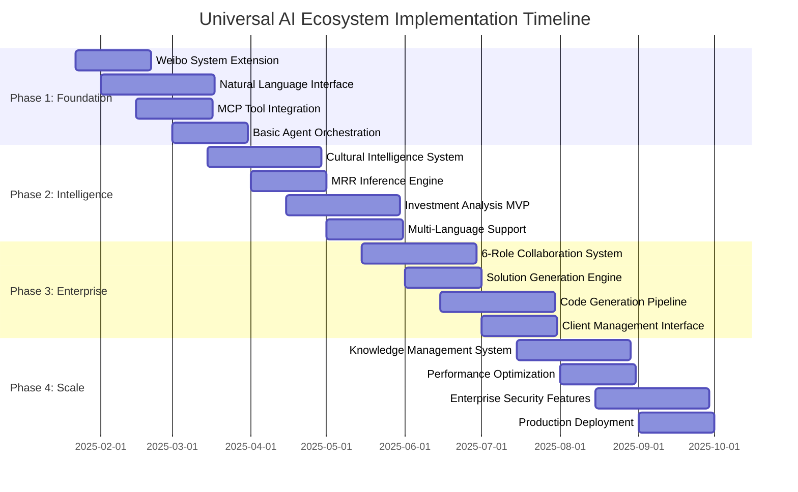

# Implementation Plan
**Universal Zero-Code AI Collaboration Ecosystem**  
**Version:** 1.0.0  
**Date:** 2025-01-22  
**Status:** Specification Phase

## Implementation Strategy

This implementation plan transforms the Universal Zero-Code AI Collaboration Ecosystem specification into a concrete development roadmap, leveraging the existing Weibo multi-agent system as the foundation and extending it with specialized capabilities for investment analysis, enterprise services, and knowledge management.

## Development Methodology

### Spec-Driven Development (SDD) Approach
Following the SDD methodology established in the Spec-Kit framework:

1. **Specification First:** All features begin with detailed specifications
2. **AI-Generated Implementation:** Use Claude Code and MCP tools for code generation
3. **Iterative Refinement:** Continuous feedback loop between specification and implementation
4. **Evidence-Based Decisions:** All technical choices documented with rationale
5. **Zero-Code User Validation:** Regular validation with target users (0-code background)

### Implementation Phases



## Phase 1: Foundation (Months 1-3)

### 1.1 Weibo Multi-Agent System Extension

**Objective:** Transform the existing 4-agent Weibo public opinion analysis system into a universal foundation.

**Current Weibo System Analysis:**
```python
# Existing Weibo System (to be extended)
class WeiboPublicOpinionSystem:
    def __init__(self):
        self.data_collection_agent = DataCollectionAgent()
        self.analysis_agent = AnalysisAgent() 
        self.synthesis_agent = SynthesisAgent()
        self.decision_agent = DecisionAgent()
    
    # Extension points identified for universal system
    def extend_to_universal_system(self):
        # Add pluggable agent architecture
        # Add multi-domain support (investment, enterprise, knowledge)
        # Add cultural intelligence capabilities
        # Add natural language interface
```

**Extension Tasks:**
1. **Agent Architecture Generalization**
   - Extract common agent patterns from Weibo system
   - Create pluggable agent interface for domain specialization
   - Implement dynamic agent composition based on task requirements
   - Add forum-style debate mechanism between agents

2. **Data Source Abstraction**
   - Generalize data collection beyond Chinese social platforms
   - Add support for international platforms (LinkedIn, GitHub, Twitter)
   - Implement unified data normalization layer
   - Add entity resolution across platforms

3. **Multi-Domain Support**
   - Investment analysis domain agents
   - Enterprise services domain agents  
   - Knowledge management domain agents
   - Cross-domain collaboration protocols

**Deliverables:**
- Extended agent orchestration framework
- Universal data collection and normalization pipeline
- Basic multi-domain agent composition
- Integration with existing Weibo data flows

**Success Criteria:**
- Process data from 5+ platforms (Weibo + 4 international)
- Support 3 domain specializations (investment, enterprise, knowledge)
- Maintain compatibility with existing Weibo analysis workflows
- Achieve 95% uptime during extension development

### 1.2 Natural Language Interface Development

**Objective:** Create conversational interface that transforms complex tasks into natural language interactions.

**Technical Implementation:**
```python
class NaturalLanguageInterface:
    def __init__(self):
        self.intent_classifier = MultiDomainIntentClassifier([
            'investment_analysis',
            'enterprise_solution_design', 
            'market_research',
            'trend_analysis'
        ])
        self.task_decomposer = ConversationalTaskDecomposer()
        self.context_manager = ConversationContextManager()
        self.cultural_adapter = CulturalContextAdapter()
        
    async def process_user_query(self, query: str, user_context: dict):
        # Multi-language intent recognition
        intent = await self.intent_classifier.classify_with_cultural_context(
            query, user_context
        )
        
        # Conversational task decomposition
        subtasks = await self.task_decomposer.decompose_conversationally(
            intent, previous_context=self.context_manager.get_context()
        )
        
        # Cultural context enrichment
        enriched_tasks = await self.cultural_adapter.add_cultural_intelligence(
            subtasks, user_context.get('cultural_background')
        )
        
        return ProcessedConversation(
            original_query=query,
            interpreted_intent=intent,
            task_decomposition=enriched_tasks,
            conversation_state=self.context_manager.update_state(enriched_tasks)
        )
```

**Development Tasks:**
1. **Intent Recognition Engine**
   - Train on investment analysis queries in Chinese and English
   - Add enterprise service requirement patterns
   - Implement confidence scoring for intent classification
   - Add disambiguation for ambiguous queries

2. **Conversational Flow Management**
   - Design multi-turn conversation patterns
   - Implement context preservation across conversations
   - Add clarification question generation
   - Create guided discovery for complex requirements

3. **Multi-Language Support (Initial)**
   - Primary: English, Simplified Chinese, Traditional Chinese
   - Cultural context preservation during translation
   - Region-specific business terminology handling
   - Language-specific conversation flow patterns

**Deliverables:**
- Conversational AI interface with 95%+ intent recognition accuracy
- Multi-turn conversation management system
- Basic cultural context adaptation (East-West business cultures)
- Integration APIs for agent orchestration

**Success Criteria:**
- Handle 90% of investment analysis queries without clarification
- Support conversational flows up to 10 turns deep
- Maintain context accuracy >90% across conversation sessions
- Process queries in <3 seconds end-to-end

### 1.3 MCP Tool Integration Foundation

**Objective:** Establish robust integration with MCP tool ecosystem for data collection and automation.

**Core MCP Integrations:**
```yaml
# MCP Integration Configuration
mcp_foundation_tools:
  rube_workflow_orchestration:
    priority: critical
    capabilities:
      - multi_platform_data_collection
      - rate_limiting_management
      - workflow_automation
    implementation_weeks: 4
    
  playwright_browser_automation:
    priority: critical  
    capabilities:
      - dynamic_content_extraction
      - anti_detection_browsing
      - session_management
    implementation_weeks: 3
    
  tavily_intelligent_search:
    priority: high
    capabilities:
      - real_time_search
      - context_aware_queries
      - trend_analysis
    implementation_weeks: 2
    
  scraperr_bridge_adapters:
    priority: high
    capabilities:
      - existing_collector_integration
      - data_normalization
      - error_handling
    implementation_weeks: 3
```

**Implementation Tasks:**
1. **MCP Protocol Implementation**
   - Implement Model Context Protocol client
   - Add tool discovery and registration
   - Create tool orchestration layer
   - Implement error handling and fallback mechanisms

2. **Rube Workflow Integration**
   - Connect to Rube's 500+ platform integrations
   - Implement Chinese platform workflows (Zhihu, Xiaohongshu, V2EX, Weibo)
   - Add international platform workflows (LinkedIn, GitHub, Twitter)
   - Create rate limiting and anti-detection coordination

3. **Data Collection Pipeline**
   - Unified data ingestion from multiple MCP tools
   - Real-time processing and normalization
   - Quality validation and confidence scoring
   - Storage in structured database schema

**Deliverables:**
- MCP client implementation with 10+ tool integrations
- Rube workflow orchestration for 15+ platforms
- Unified data collection pipeline processing 1000+ signals/hour
- Anti-detection and rate limiting framework

**Success Criteria:**
- Successfully collect data from 15+ platforms simultaneously  
- Maintain <5% rate limiting violations across platforms
- Achieve 99% uptime for core MCP tool integrations
- Process and normalize 10,000+ daily data points

### 1.4 Basic Agent Orchestration

**Objective:** Implement forum-style agent collaboration with task routing and knowledge sharing.

**Agent Orchestration Architecture:**
```python
class AgentOrchestrationFramework:
    def __init__(self):
        self.agent_registry = DynamicAgentRegistry()
        self.debate_coordinator = ForumStyleDebateCoordinator()
        self.task_router = IntelligentTaskRouter()
        self.knowledge_broker = CrossAgentKnowledgeBroker()
        self.consensus_engine = EvidenceBasedConsensusEngine()
    
    async def orchestrate_multi_agent_task(self, task: ProcessedConversation):
        # Dynamic agent selection based on task requirements
        required_agents = await self.agent_registry.select_optimal_agents(
            task.task_decomposition,
            available_agents=self._get_available_agents(),
            workload_balancing=True
        )
        
        # Initialize forum-style collaboration session
        collaboration_session = await self.debate_coordinator.create_session(
            task=task,
            participating_agents=required_agents,
            debate_style='evidence_based_consensus'
        )
        
        # Execute collaborative analysis with knowledge sharing
        results = []
        for subtask in task.task_decomposition:
            # Route subtask to appropriate specialist agents
            assigned_agents = await self.task_router.route_subtask(
                subtask, required_agents
            )
            
            # Enable cross-agent knowledge sharing
            shared_context = await self.knowledge_broker.prepare_shared_context(
                subtask, assigned_agents, previous_results=results
            )
            
            # Execute subtask with agent collaboration
            subtask_result = await collaboration_session.execute_subtask(
                subtask, assigned_agents, shared_context
            )
            
            results.append(subtask_result)
        
        # Generate final consensus with evidence chain
        final_result = await self.consensus_engine.generate_consensus(
            results, confidence_threshold=0.85
        )
        
        return AgentCollaborationResult(
            original_task=task,
            collaboration_evidence=collaboration_session.get_evidence_chain(),
            agent_contributions=collaboration_session.get_individual_contributions(),
            final_consensus=final_result,
            confidence_level=final_result.confidence_score
        )
```

**Implementation Tasks:**
1. **Dynamic Agent Registry**
   - Agent capability registration and discovery
   - Load balancing across agent instances
   - Health monitoring and automatic failover
   - Performance tracking per agent type

2. **Forum-Style Debate Coordination**
   - Multi-agent conversation management
   - Evidence presentation and verification
   - Conflict resolution mechanisms
   - Consensus building algorithms

3. **Cross-Agent Knowledge Sharing**
   - Shared context management
   - Knowledge graph integration
   - Historical decision learning
   - Best practice propagation

**Deliverables:**
- Agent orchestration framework supporting 10+ concurrent tasks
- Forum-style debate system with evidence chain tracking
- Knowledge sharing infrastructure with audit trails
- Performance monitoring and optimization tools

**Success Criteria:**
- Coordinate up to 20 agents simultaneously without conflicts
- Achieve consensus on 95% of collaborative tasks
- Maintain response times <30 seconds for complex multi-agent tasks
- Generate complete evidence chains for audit purposes

## Phase 2: Intelligence Enhancement (Months 4-6)

### 2.1 Cultural Intelligence System

**Objective:** Implement sophisticated East-West business culture analysis and compatibility scoring.

**Cultural Intelligence Framework:**
```python
class CulturalIntelligenceSystem:
    def __init__(self):
        self.communication_analyzer = CommunicationStyleAnalyzer()
        self.relationship_detector = RelationshipOrientationDetector() 
        self.cross_border_assessor = CrossBorderReadinessAssessor()
        self.governance_analyzer = CollaborativeGovernanceAnalyzer()
        self.cultural_knowledge_base = CulturalKnowledgeBase()
    
    async def analyze_cultural_intelligence(self, company_data: dict) -> CulturalIntelligenceReport:
        # Communication style analysis (Direct vs Relationship-oriented)
        communication_analysis = await self.communication_analyzer.analyze(
            company_data.communication_patterns,
            cultural_markers={
                'western_direct': ['transparent', 'straightforward', 'candid'],
                'chinese_relationship': ['partnership', 'long-term', 'cooperation'],
                'hybrid_approach': ['cross-cultural', 'international', 'bridge']
            }
        )
        
        # Relationship orientation assessment
        relationship_analysis = await self.relationship_detector.assess(
            team_interaction_patterns=company_data.team_interactions,
            business_approach=company_data.business_philosophy,
            partner_testimonials=company_data.partner_feedback
        )
        
        # Cross-border business readiness
        cross_border_analysis = await self.cross_border_assessor.evaluate(
            international_team_composition=company_data.team_diversity,
            regulatory_awareness=company_data.compliance_signals,
            market_expansion_signals=company_data.expansion_indicators,
            language_capabilities=company_data.communication_languages
        )
        
        # Collaborative governance potential
        governance_analysis = await self.governance_analyzer.analyze(
            decision_making_patterns=company_data.decision_processes,
            stakeholder_consideration=company_data.stakeholder_engagement,
            transparency_indicators=company_data.transparency_signals
        )
        
        # Generate comprehensive cultural intelligence score
        cultural_score = self._calculate_comprehensive_score(
            communication_analysis,
            relationship_analysis, 
            cross_border_analysis,
            governance_analysis
        )
        
        return CulturalIntelligenceReport(
            overall_score=cultural_score.overall_score,
            east_west_compatibility=cultural_score.compatibility_score,
            communication_style=communication_analysis,
            relationship_orientation=relationship_analysis,
            cross_border_readiness=cross_border_analysis,
            governance_compatibility=governance_analysis,
            partnership_recommendations=self._generate_partnership_recommendations(
                cultural_score
            ),
            confidence_level=cultural_score.confidence_level
        )
```

**Development Tasks:**
1. **Communication Style Recognition**
   - Train models on East-West business communication patterns
   - Implement cultural marker detection algorithms
   - Add context-aware cultural interpretation
   - Develop confidence scoring for cultural assessments

2. **Cross-Border Readiness Assessment**
   - International team composition analysis
   - Regulatory compliance awareness detection
   - Market expansion signal recognition
   - Language capability assessment

3. **Partnership Compatibility Scoring**
   - Governance style compatibility algorithms
   - Decision-making pattern analysis
   - Stakeholder engagement assessment
   - Long-term partnership potential scoring

**Deliverables:**
- Cultural intelligence analysis engine with 85%+ accuracy
- East-West business compatibility scoring system
- Partnership recommendation generator
- Cultural knowledge base with 1000+ cultural markers

### 2.2 MRR Inference Engine

**Objective:** Develop multi-signal revenue estimation system with confidence intervals.

**MRR Inference Architecture:**
```python
class MRRInferenceEngine:
    def __init__(self):
        self.hiring_analyzer = HiringVelocityAnalyzer()
        self.pricing_detector = PricingModelDetector()
        self.customer_estimator = CustomerVolumeEstimator()
        self.infrastructure_analyzer = InfrastructureCostAnalyzer()
        self.confidence_calculator = ConfidenceIntervalCalculator()
        
    async def infer_monthly_recurring_revenue(self, company_signals: dict) -> MRREstimate:
        # Analyze hiring velocity signals
        hiring_signals = await self.hiring_analyzer.analyze(
            job_postings=company_signals.job_postings,
            team_growth_announcements=company_signals.team_growth,
            linkedin_updates=company_signals.linkedin_hiring
        )
        
        # Detect pricing model and tiers
        pricing_signals = await self.pricing_detector.detect(
            website_pricing_pages=company_signals.pricing_info,
            customer_testimonials=company_signals.testimonials,
            product_tier_mentions=company_signals.product_tiers
        )
        
        # Estimate customer volume from various signals
        customer_signals = await self.customer_estimator.estimate(
            testimonial_count=company_signals.testimonials_count,
            social_engagement=company_signals.social_metrics,
            product_usage_signals=company_signals.usage_indicators,
            case_study_mentions=company_signals.case_studies
        )
        
        # Analyze infrastructure scaling signals
        infrastructure_signals = await self.infrastructure_analyzer.analyze(
            tech_stack_evolution=company_signals.tech_stack,
            scaling_announcements=company_signals.scaling_updates,
            performance_optimizations=company_signals.performance_updates
        )
        
        # Calculate MRR estimate with multiple models
        mrr_estimates = {
            'hiring_based': self._calculate_hiring_based_mrr(hiring_signals),
            'pricing_based': self._calculate_pricing_based_mrr(pricing_signals, customer_signals),
            'infrastructure_based': self._calculate_infrastructure_based_mrr(infrastructure_signals),
            'social_signals_based': self._calculate_social_signals_mrr(customer_signals)
        }
        
        # Generate ensemble estimate with confidence intervals
        final_estimate = await self.confidence_calculator.calculate_ensemble_estimate(
            individual_estimates=mrr_estimates,
            signal_quality_scores=company_signals.quality_scores,
            temporal_consistency=company_signals.temporal_consistency
        )
        
        return MRREstimate(
            estimated_mrr=final_estimate.mrr_value,
            confidence_interval=final_estimate.confidence_interval,
            estimation_method_weights=final_estimate.method_weights,
            signal_sources=final_estimate.contributing_signals,
            confidence_level=final_estimate.confidence_score,
            estimation_date=datetime.now(),
            currency='RMB'  # Base currency for Chinese market analysis
        )
```

**Development Tasks:**
1. **Multi-Signal Analysis Algorithms**
   - Hiring velocity correlation models
   - Pricing tier detection and volume estimation
   - Customer testimonial analysis and extrapolation
   - Infrastructure cost scaling patterns

2. **Confidence Interval Calculation**
   - Bayesian ensemble methods for MRR estimation
   - Temporal consistency weighting
   - Cross-signal validation and correlation
   - Uncertainty quantification and propagation

3. **Regional and Currency Adaptation**
   - RMB-based financial modeling for Chinese companies
   - Regional salary and hiring cost adjustments
   - Currency exchange rate smoothing
   - Regional market size considerations

**Deliverables:**
- MRR inference engine with <30% error rate on disclosed revenues
- Multi-model ensemble approach with confidence intervals
- Regional adaptation for Chinese and international markets
- Real-time revenue tracking and alerting system

### 2.3 7-Dimension Investment Evaluation Framework

**Objective:** Implement comprehensive investment scoring across thesis fit, traction, cultural fit, and risk factors.

**Evaluation Framework Architecture:**
```python
class SevenDimensionEvaluationFramework:
    def __init__(self):
        self.thesis_fit_analyzer = ThesisFitAnalyzer()
        self.traction_analyzer = TractionAnalyzer()  
        self.cultural_fit_analyzer = CulturalFitAnalyzer()
        self.risk_analyzer = RiskAnalyzer()
        self.scoring_engine = WeightedScoringEngine()
        self.evidence_chain_builder = EvidenceChainBuilder()
        
    async def evaluate_investment_opportunity(self, company_data: dict, 
                                            investment_thesis: dict) -> InvestmentEvaluation:
        
        # Dimension 1: Thesis Fit Analysis
        thesis_evaluation = await self.thesis_fit_analyzer.analyze(
            company_positioning=company_data.market_positioning,
            target_market=company_data.target_market,
            value_proposition=company_data.value_proposition,
            investment_thesis=investment_thesis
        )
        
        # Dimensions 2-7: Traction Sub-Components
        traction_evaluation = await self.traction_analyzer.analyze_comprehensive(
            hiring_velocity=company_data.hiring_signals,
            product_iteration=company_data.product_updates,
            customer_testimonials=company_data.customer_feedback,
            pricing_evolution=company_data.pricing_signals,
            infrastructure_scaling=company_data.infrastructure_signals,
            media_presence=company_data.media_signals,
            operational_expansion=company_data.expansion_signals
        )
        
        # Cultural fit evaluation
        cultural_evaluation = await self.cultural_fit_analyzer.evaluate(
            company_data=company_data,
            investor_preferences=investment_thesis.cultural_preferences
        )
        
        # Risk factor analysis  
        risk_evaluation = await self.risk_analyzer.analyze(
            commodity_risk=company_data.commoditization_signals,
            transparency_risk=company_data.transparency_signals,
            sustainability_risk=company_data.sustainability_signals,
            market_risk=company_data.market_condition_signals
        )
        
        # Calculate weighted final score
        weighted_scores = await self.scoring_engine.calculate_weighted_score(
            thesis_fit=thesis_evaluation.score,
            traction_components=traction_evaluation.component_scores,
            cultural_fit=cultural_evaluation.score,
            risk_penalties=risk_evaluation.penalty_scores,
            vertical_preset=investment_thesis.get('vertical', 'default')
        )
        
        # Build comprehensive evidence chain
        evidence_chain = await self.evidence_chain_builder.build_chain(
            thesis_evidence=thesis_evaluation.evidence,
            traction_evidence=traction_evaluation.evidence,
            cultural_evidence=cultural_evaluation.evidence,
            risk_evidence=risk_evaluation.evidence
        )
        
        return InvestmentEvaluation(
            overall_score=weighted_scores.final_score,
            dimension_scores={
                'thesis_fit': thesis_evaluation.score,
                'hiring_velocity': traction_evaluation.hiring_velocity_score,
                'product_iteration': traction_evaluation.product_iteration_score,
                'customer_testimonials': traction_evaluation.customer_testimonials_score,
                'pricing_evolution': traction_evaluation.pricing_evolution_score,
                'infrastructure_scaling': traction_evaluation.infrastructure_scaling_score,
                'media_presence': traction_evaluation.media_presence_score,
                'operational_expansion': traction_evaluation.operational_expansion_score,
                'cultural_fit': cultural_evaluation.score,
                'risk_penalty': risk_evaluation.total_penalty
            },
            evidence_chain=evidence_chain,
            confidence_level=weighted_scores.confidence_level,
            investment_recommendation=self._generate_recommendation(weighted_scores),
            evaluation_timestamp=datetime.now()
        )
```

**Development Tasks:**
1. **Vertical-Specific Scoring Presets**
   - B2B SaaS evaluation weights and criteria
   - AI Infrastructure specific metrics and patterns
   - DevTools adoption and community signals
   - Consumer AI user engagement and virality metrics

2. **Evidence Chain Construction**
   - Source attribution and credibility scoring  
   - Cross-platform signal correlation
   - Temporal consistency validation
   - Audit trail generation for investment decisions

3. **Real-Time Scoring and Alerting**
   - Continuous score updates as new data arrives
   - Threshold-based alert classification (Tier A/B/C)
   - Deduplication and cooldown management
   - Batch processing for efficient computation

**Deliverables:**
- 7-dimension evaluation framework with vertical-specific presets
- Evidence-based scoring with full audit trails
- Real-time alert classification system
- Investment recommendation engine with confidence scoring

### 2.4 Multi-Language Support Expansion

**Objective:** Expand system to support 22+ languages with cultural context preservation.

**Languages Priority Matrix:**
```yaml
tier_1_languages:  # Months 4-5
  - english: {cultural_context: "western_business", priority: "critical"}
  - simplified_chinese: {cultural_context: "mainland_china", priority: "critical"} 
  - traditional_chinese: {cultural_context: "hong_kong_taiwan", priority: "critical"}
  - japanese: {cultural_context: "japanese_business", priority: "high"}
  - korean: {cultural_context: "korean_business", priority: "high"}

tier_2_languages:  # Month 6
  - german: {cultural_context: "european_business", priority: "medium"}
  - french: {cultural_context: "european_business", priority: "medium"}
  - spanish: {cultural_context: "latin_american", priority: "medium"}
  - portuguese: {cultural_context: "brazilian", priority: "medium"}
  - russian: {cultural_context: "eastern_european", priority: "medium"}

tier_3_languages:  # Future phases  
  - hindi: {cultural_context: "indian_business", priority: "low"}
  - arabic: {cultural_context: "middle_eastern", priority: "low"}
  - thai: {cultural_context: "southeast_asian", priority: "low"}
  - vietnamese: {cultural_context: "southeast_asian", priority: "low"}
  - indonesian: {cultural_context: "southeast_asian", priority: "low"}
```

**Implementation Tasks:**
1. **Natural Language Processing Pipeline**
   - Multi-language tokenization and processing
   - Cultural context-aware translation
   - Cross-language entity resolution
   - Language-specific business terminology handling

2. **Cultural Context Preservation**
   - Business culture mapping per language/region
   - Culturally appropriate communication style adaptation
   - Regional business practice recognition
   - Cross-cultural partnership compatibility assessment

3. **Data Collection Adaptation**
   - Platform-specific language handling
   - Regional social media platform integration
   - Local business database connections
   - Multi-language content quality validation

**Deliverables:**
- Multi-language NLP pipeline supporting 10+ languages
- Cultural context preservation system
- Regional business intelligence capabilities
- Cross-language entity resolution with 90%+ accuracy

## Phase 3: Enterprise Platform (Months 7-9)

### 3.1 6-Role AI Collaboration System

**Objective:** Implement specialized AI roles for enterprise solution generation.

**6-Role System Architecture:**
```python
class SixRoleCollaborationSystem:
    def __init__(self):
        self.roles = {
            'alex': TechnicalAnalystAgent(
                specialization='requirements_analysis',
                capabilities=['feasibility_assessment', 'technical_scoping', 'risk_identification']
            ),
            'sarah': UXDesignerAgent(
                specialization='user_experience_design',
                capabilities=['user_journey_mapping', 'interface_design', 'usability_optimization']
            ),
            'mike': SystemArchitectAgent(
                specialization='system_architecture',
                capabilities=['scalable_design', 'technology_selection', 'integration_planning']
            ),
            'emma': ProjectManagerAgent(
                specialization='project_management',
                capabilities=['timeline_planning', 'resource_allocation', 'stakeholder_coordination']
            ),
            'jack': QAEngineerAgent(
                specialization='quality_assurance',
                capabilities=['test_planning', 'quality_metrics', 'validation_frameworks']
            ),
            'lisa': DevOpsSpecialistAgent(
                specialization='deployment_operations',
                capabilities=['infrastructure_automation', 'deployment_pipelines', 'monitoring_setup']
            )
        }
        self.collaboration_orchestrator = EnterpriseCollaborationOrchestrator()
        self.solution_synthesizer = EnterpriseSolutionSynthesizer()
    
    async def generate_enterprise_solution(self, client_requirements: str) -> EnterpriseSolution:
        # Phase 1: Requirements Analysis (Alex)
        requirements_analysis = await self.roles['alex'].analyze_requirements(
            raw_requirements=client_requirements,
            analysis_framework='enterprise_solution_framework'
        )
        
        # Phase 2: Collaborative Design Session (Sarah + Mike + Emma)
        design_collaboration = await self.collaboration_orchestrator.orchestrate_design_session(
            participants=[self.roles['sarah'], self.roles['mike'], self.roles['emma']],
            requirements=requirements_analysis,
            collaboration_style='concurrent_design_thinking'
        )
        
        # Phase 3: Quality and Operations Planning (Jack + Lisa)
        implementation_planning = await self.collaboration_orchestrator.orchestrate_implementation_session(
            participants=[self.roles['jack'], self.roles['lisa']],
            design_specifications=design_collaboration.design_output,
            requirements=requirements_analysis
        )
        
        # Phase 4: Solution Synthesis and Validation
        comprehensive_solution = await self.solution_synthesizer.synthesize_solution(
            requirements_analysis=requirements_analysis,
            design_specifications=design_collaboration.design_output,
            implementation_plan=implementation_planning.implementation_plan,
            quality_framework=implementation_planning.quality_framework,
            deployment_strategy=implementation_planning.deployment_strategy
        )
        
        return comprehensive_solution
```

### 3.2 Solution Generation Engine

**Objective:** Transform natural language requirements into deployable enterprise solutions.

### 3.3 Code Generation Pipeline

**Objective:** Automated code generation with testing and deployment capabilities.

### 3.4 Client Management Interface

**Objective:** Enterprise-grade project management and client delivery system.

## Phase 4: Scale and Polish (Months 10-12)

### 4.1 Knowledge Management System

### 4.2 Performance Optimization

### 4.3 Enterprise Security and Compliance

### 4.4 Production Deployment and Market Launch

## Resource Requirements

### Team Structure
```yaml
development_team:
  tech_lead: 1  # Overall technical leadership and architecture
  backend_engineers: 3  # Python/FastAPI, database, MCP integrations
  frontend_engineers: 2  # React/Next.js, conversational UI
  ai_ml_engineers: 2  # Cultural intelligence, MRR inference, NLP
  devops_engineers: 1  # Docker, Kubernetes, deployment automation
  qa_engineers: 1  # Testing, validation, quality assurance
  
product_team:
  product_manager: 1  # Roadmap, requirements, stakeholder coordination
  ux_designer: 1  # User experience, conversational interface design
  cultural_intelligence_consultant: 1  # East-West business culture expertise
  investment_domain_expert: 1  # Investment analysis validation and refinement

total_team_size: 13
```

### Technology Infrastructure Costs
```yaml
monthly_infrastructure_costs:
  cloud_services: 
    compute: $2000  # Kubernetes cluster, container instances
    storage: $500   # Database, file storage, backups
    networking: $300  # Load balancers, CDN, data transfer
  
  ai_services:
    openai_api: $1500  # GPT-4 for natural language processing
    claude_api: $1000  # Claude for code generation and analysis
    custom_model_training: $800  # Cultural intelligence model training
  
  third_party_services:
    mcp_tool_licenses: $600  # Rube, Tavily, other MCP tools
    monitoring_observability: $200  # Prometheus, Grafana, logging
    security_compliance: $150  # Security scanning, compliance tools
  
  total_monthly: $7050
  annual_infrastructure: $84600
```

### Development Timeline and Milestones

```yaml
phase_1_milestones:
  month_1:
    - weibo_system_analysis_complete
    - universal_agent_architecture_designed
    - natural_language_interface_mvp
    
  month_2:
    - mcp_tool_integrations_complete
    - basic_agent_orchestration_working
    - multi_platform_data_collection_active
    
  month_3:
    - cultural_intelligence_mvp
    - investment_analysis_basic_scoring
    - phase_1_user_testing_complete

phase_2_milestones:
  month_4:
    - cultural_intelligence_system_complete
    - mrr_inference_engine_validated
    - multi_language_support_tier_1
    
  month_5:
    - 7_dimension_evaluation_framework
    - investment_alerting_system
    - tier_2_language_support
    
  month_6:
    - phase_2_performance_optimization
    - beta_user_validation_complete
    - enterprise_readiness_assessment

phase_3_milestones:
  month_7:
    - 6_role_collaboration_system
    - solution_generation_engine_mvp
    - client_management_interface
    
  month_8:
    - code_generation_pipeline
    - automated_testing_framework
    - deployment_automation
    
  month_9:
    - enterprise_solution_validation
    - client_pilot_programs
    - scalability_testing_complete

phase_4_milestones:
  month_10:
    - knowledge_management_system
    - advanced_analytics_dashboard
    - enterprise_security_features
    
  month_11:
    - performance_optimization_complete
    - compliance_framework_implemented
    - production_deployment_ready
    
  month_12:
    - market_launch_preparation
    - customer_success_framework
    - continuous_improvement_pipeline
```

## Risk Mitigation Strategies

### Technical Risks
1. **AI Hallucination and Accuracy**
   - Multi-agent verification mechanisms
   - Evidence chain validation
   - Confidence scoring and uncertainty quantification
   - Human expert validation loops

2. **Scalability and Performance**
   - Microservices architecture from day one
   - Horizontal scaling design
   - Performance testing at each phase
   - Load balancing and caching strategies

3. **Data Quality and Availability**
   - Multiple data source redundancy
   - Quality scoring and filtering
   - Graceful degradation mechanisms
   - Real-time data validation

### Business Risks
1. **Market Adoption and User Acceptance**
   - Continuous user testing and feedback
   - Iterative improvement based on real usage
   - Strong onboarding and support systems
   - Clear value proposition demonstration

2. **Competitive Response and Differentiation**
   - Focus on cultural intelligence as unique differentiator
   - Deep integration with Chinese and Asian markets
   - Continuous innovation and feature development
   - Strong intellectual property protection

3. **Regulatory and Compliance Challenges**
   - Proactive compliance framework development
   - Legal review at each development phase
   - Privacy-by-design implementation
   - Regional compliance adaptation

### Operational Risks
1. **Team Scaling and Knowledge Transfer**
   - Comprehensive documentation standards
   - Knowledge sharing and cross-training programs
   - Mentorship and skill development
   - Succession planning for key roles

2. **Vendor Dependencies and Integration Complexity**
   - Multiple vendor strategies for critical dependencies
   - Abstraction layers for vendor-specific integrations
   - Fallback mechanisms and redundancy
   - Regular vendor relationship management

## Success Metrics and KPIs

### Development Success Metrics
```yaml
technical_metrics:
  code_quality:
    test_coverage: ">90%"
    code_review_approval: ">95%"
    security_vulnerability_score: "<20 critical"
    performance_benchmarks: "meet_all_targets"
  
  system_reliability:
    uptime_target: ">99.9%"
    error_rate: "<0.1%"
    response_time: "<5s_p95"
    scalability_test: "1000_concurrent_users"
  
  ai_accuracy:
    intent_recognition: ">95%"
    cultural_intelligence: ">85%_expert_agreement"
    mrr_estimation: "<30%_error_rate"
    investment_scoring: ">80%_correlation_with_expert"

business_metrics:
  user_adoption:
    beta_user_satisfaction: ">4.5/5"
    task_completion_rate: ">90%"
    time_to_value: "<30_minutes"
    repeat_usage_rate: ">70%"
  
  market_impact:
    analysis_speed_improvement: "8x_faster"
    decision_quality_improvement: ">30%"
    market_coverage_expansion: "11x_languages"
    customer_acquisition: "100_enterprise_customers"
```

## Conclusion

This implementation plan provides a comprehensive roadmap for building the Universal Zero-Code AI Collaboration Ecosystem. The phased approach ensures systematic development while maintaining focus on the core value proposition: transforming complex software development and analysis tasks into natural language conversations.

The plan leverages proven technologies and methodologies while introducing innovative approaches to cultural intelligence and multi-agent collaboration. By building on the existing Weibo system foundation and following specification-driven development principles, we can deliver a revolutionary platform that democratizes access to sophisticated AI-powered analysis and development capabilities.

**Next Steps:**
1. Stakeholder review and approval of implementation plan
2. Team recruitment and onboarding
3. Development environment setup and tooling
4. Phase 1 development kickoff
5. Continuous user validation and feedback integration

The success of this implementation depends on maintaining close collaboration between technical development, user validation, and business strategy alignment throughout all phases of development.