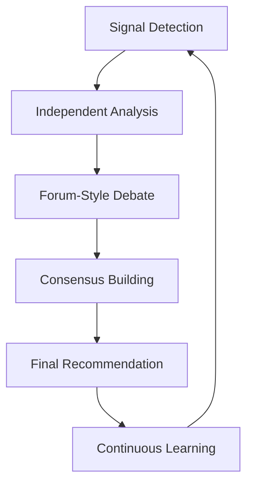

# Pocketcorn v4.2 - AI-Assisted Investment Discovery & Analysis System

> A revolutionary AI-assisted investment discovery and analysis system for early-stage AI startups, built on the LaunchX Universal AI Discovery Infrastructure.

## 🎯 Mission

Transform investment decision-making for non-technical investors through natural-language workflows, multi-agent collaboration, and real-time portfolio monitoring. Target: reduce analysis time from 2-4 hours to 15-30 minutes per company while improving decision quality by 30%.

## 🏗️ System Architecture

### Core Framework
- **BMAD Architecture**: Brain-Machine Augmented Decision framework combining human judgment with AI processing
- **SPELO Loop**: Study–Plan–Execute–Learn–Optimize decision cycles for continuous improvement  
- **Multi-Agent Collaboration**: Investment committee simulation with specialized AI agents
- **Cultural Intelligence**: 7-dimension scoring including cultural compatibility assessment

### Technology Stack
- **Base Platform**: Enhanced Weibo Multi-Agent System + MindSpider 7+ platform capabilities
- **MCP Integration**: RUBE discovery, Playwright automation, Tavily search, E2B sandbox
- **Signal Processing**: Multi-platform ingestion (Zhihu, V2EX, Weibo, Xiaohongshu, LinkedIn, GitHub, Product Hunt)
- **Containerization**: Docker + Kubernetes for scalable deployment

## 📊 Investment Strategy Parameters

```yaml
Target Profile:
  Investment Amount: 50万 RMB (~$70K USD)
  Team Size: 3-10 people
  Revenue Threshold: ≥5万 RMB/month MRR
  Growth Stage: Post-PMF early growth phase
  Return Strategy: 1.5x return in 6-8 months (15% monthly revenue share)
  
7-Dimension Scoring:
  - Technology Assessment (15%)
  - Market Opportunity (20%) 
  - Team Capability (20%)
  - Business Model (20%)
  - Competitive Advantage (10%)
  - Cultural Compatibility (10%) # 产品本地化转化评估
  - Risk Assessment (5%)
```

## 🤖 Multi-Agent Investment Committee

### Specialized Agents
1. **Enterprise Discovery Agent** - Multi-platform signal collection and company identification
2. **Market Analysis Agent** - Market size, growth potential, competitive landscape analysis
3. **Technology Assessment Agent** - Technical barriers, team capabilities, IP evaluation
4. **Risk Assessment Agent** - Investment risk identification and mitigation strategies
5. **Cultural Intelligence Agent** - Product localization and market fit assessment
6. **Decision Synthesizer Agent** - Final recommendation synthesis and confidence scoring

### Collaboration Workflow


## 🌐 Multi-Platform Signal Ingestion

### Chinese Platforms (Early AI Startup Concentration)
- **知乎 (Zhihu)**: Tech discussions, revenue milestones, team growth signals
- **小红书 (Xiaohongshu)**: User feedback, product virality, payment willingness
- **V2EX**: Technical startup discussions, funding consultations
- **微博 (Weibo)**: Brand promotion, media coverage, user reviews
- **Boss直聘**: Hiring velocity, salary ranges, team expansion signals
- **B站 (Bilibili)**: Tech content creator product development journeys

### International Platforms
- **LinkedIn**: Professional backgrounds, funding dynamics, milestone updates
- **GitHub**: Code quality, development activity, technical stack analysis
- **Product Hunt**: Product launches, user feedback, market validation
- **Indie Hackers**: Revenue reports, growth strategies, PMF stories
- **Hacker News**: Show HN posts, technical discussions, revenue sharing

## 🔧 Technical Implementation

### Core Components

```
pocketcorn4.2/
├── src/
│   ├── agents/                    # Multi-agent system
│   │   ├── discovery/             # Enterprise discovery agents
│   │   ├── analysis/              # Analysis specialized agents
│   │   └── collaboration/         # Agent collaboration framework
│   ├── collectors/                # Signal collection system
│   │   ├── mcp_orchestrator.py    # MCP tools orchestration
│   │   ├── scraperr_bridge.py     # Legacy system integration
│   │   └── signal_processor.py    # Signal normalization
│   ├── scoring/                   # 7-dimension scoring system
│   │   ├── investment_scorer.py   # Core scoring engine
│   │   ├── cultural_analyzer.py   # Cultural compatibility assessment
│   │   └── risk_evaluator.py      # Risk assessment models
│   ├── spelo/                     # SPELO decision framework
│   │   ├── study_phase.py         # Deep research phase
│   │   ├── plan_phase.py          # Strategy planning
│   │   ├── execute_phase.py       # Analysis execution
│   │   ├── learn_phase.py         # Experience learning
│   │   └── optimize_phase.py      # System optimization
│   └── api/                       # API interfaces
│       ├── investment_api.py      # Investment analysis endpoints
│       └── monitoring_api.py      # Portfolio monitoring
├── config/                        # Configuration management
├── docker/                        # Container definitions
├── tests/                         # Testing suite
└── docs/                          # Documentation
```

### Key Features

#### Universal Signal Collector
- Mission-oriented discovery pipeline covering Tier 1 (Zhihu, Weibo, Boss直聘, LinkedIn, GitHub) and Tier 2 (小红书, Product Hunt, V2EX, Indie Hackers) platforms
- Normalises signals into the Pocketcorn schema with freshness & reliability scoring plus cultural intelligence tags
- Mission orchestration service exposes REST contracts (`specs/006-pocketcorn-v4-2-signal-collector/contracts/`) and CLI commands (`python -m pocketcorn.cli.mission_commands`)
- Structured logging and metrics include mission IDs with audit trail events for rate limits or collector errors

#### 🔍 Intelligent Signal Detection
- **Revenue Signals**: "月收入突破5万", "MRR达到$7K", "付费用户突破1000"
- **Team Signals**: "团队扩展", "开始招聘", "创始人全职", "设立办公室"
- **Product Signals**: "找到PMF", "用户增长加速", "付费转化提升"
- **Funding Signals**: "考虑融资", "寻求天使投资", "需要增长资金"

#### 📈 Real-Time Portfolio Monitoring
- Continuous monitoring of portfolio companies across all platforms
- Early warning system for risk signals and growth opportunities
- Automated progress reports and milestone tracking
- Performance benchmarking against industry standards

#### 🌍 Cultural Compatibility Assessment
Novel evaluation dimension assessing product-market cultural fit:
- Payment behavior adaptation (付费习惯适应性)
- Pricing strategy localization (定价策略本地化)
- User experience cultural alignment (用户体验文化契合)
- Ecosystem integration capability (生态集成能力)

## 🚀 Getting Started

### Prerequisites
- Python 3.11+
- Docker & Kubernetes
- MCP servers configured (tavily, playwright, rube, e2b)
- Access to target platforms (API keys/authentication)

### Quick Start
```bash
# Clone and setup
git clone <repository>
cd pocketcorn4.2
pip install -r requirements.txt

# Configure MCP tools
cp config/mcp.example.json config/mcp.json
# Edit with your API keys

# Run development server
python src/api/main.py

# Or use Docker
docker-compose up -d
```

### Example Usage
```python
from pocketcorn import InvestmentAnalyzer

# Initialize analyzer
analyzer = InvestmentAnalyzer()

# Analyze a company
result = await analyzer.analyze_company(
    company_name="AI Startup Example",
    platforms=["zhihu", "github", "linkedin"],
    analysis_depth="comprehensive"
)

# Get investment recommendation
recommendation = result.get_investment_recommendation()
print(f"Score: {recommendation.overall_score}")
print(f"Recommendation: {recommendation.decision}")
print(f"Confidence: {recommendation.confidence}")
```

## 📊 Performance Targets

### Speed Improvements
- **Analysis Time**: 2-4 hours → 15-30 minutes (8-16x faster)
- **Concurrent Processing**: 1 company → 100+ companies simultaneously
- **Real-time Monitoring**: Daily batch → real-time (1440x more responsive)

### Quality Enhancements
- **Multi-agent Verification**: 30%+ accuracy improvement
- **Cultural Assessment**: New dimension for market fit evaluation
- **Risk Reduction**: 50%+ investment risk reduction through continuous monitoring

## 🔄 SPELO Decision Framework

### Study Phase (研究阶段)
- Multi-platform automated scanning for qualifying companies
- Deep research on discovered opportunities
- Signal collection and preliminary assessment

### Plan Phase (计划阶段)  
- Investment strategy formulation based on analysis
- Risk mitigation planning
- Resource allocation optimization

### Execute Phase (执行阶段)
- Due diligence execution
- Investment negotiation support
- Decision implementation

### Learn Phase (学习阶段)
- Outcome tracking and analysis
- Success/failure factor identification
- Model accuracy assessment

### Optimize Phase (优化阶段)
- Algorithm refinement based on results
- Strategy adjustment
- System capability enhancement

## 🎯 Success Metrics

### Technical KPIs
- System uptime: >99.5%
- Analysis response time: <30 minutes average
- Multi-agent collaboration success rate: >95%
- Cultural compatibility assessment accuracy: >80%

### Business KPIs
- Investment decision time reduction: >75%
- Decision quality improvement: Tracked via investment outcomes
- Market coverage: 22 languages monitored
- User satisfaction: >90% rating

## 🔗 Integration Points

### MCP Tool Ecosystem
- **RUBE Discovery**: Automated tool and reference project discovery
- **Playwright Automation**: Advanced web scraping with anti-detection
- **Tavily Search**: Real-time intelligent search capabilities
- **E2B Sandbox**: Secure code execution environment

### Legacy System Integration
- **Weibo Multi-Agent**: Proven agent collaboration framework
- **Scraperr Collectors**: Existing data collection capabilities
- **MindSpider Platform**: 7+ platform integration experience

## 📝 Development Roadmap

### Phase 1: Foundation (Q1 2025)
- [ ] Core architecture implementation
- [ ] MCP tools integration
- [ ] Basic 7-dimension scoring
- [ ] SPELO framework MVP

### Phase 2: Intelligence (Q2 2025)
- [ ] Advanced ML models
- [ ] Cultural compatibility deep assessment
- [ ] Predictive analytics
- [ ] Natural language interface

### Phase 3: Ecosystem (Q3-Q4 2025)
- [ ] Enterprise marketplace integration
- [ ] Global platform expansion
- [ ] Third-party API ecosystem
- [ ] Advanced portfolio management

## 🤝 Contributing

This project is part of the LaunchX Universal AI Discovery Infrastructure. See [Contributing Guidelines](CONTRIBUTING.md) for development standards and procedures.

## 📄 License

[License details to be determined]

---

**Built with ❤️ for the AI investment community | Powered by LaunchX Universal AI Discovery Infrastructure**