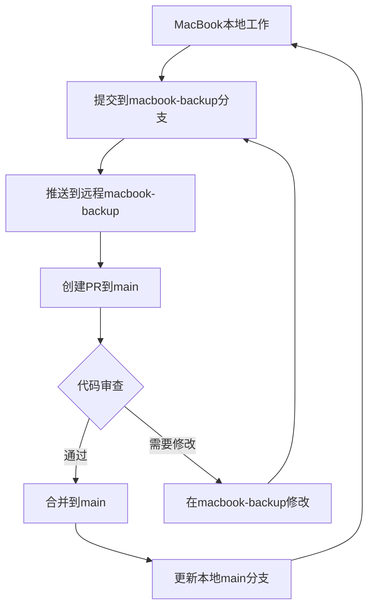

# 版本同步工作流指南 - MacBook 备份策略

> **目标**：建立安全的版本同步机制，确保本地 MacBook 工作作为权威源，通过 PR 工作流保护主分支稳定性。

## 1. 当前状态

### 1.1 分支结构
- **当前分支**：`macbook-backup` ✅ 已创建
- **远程仓库**：`origin` (git@github.com:AlexSD89/Obsidion.git)
- **主分支**：`main` (需要保护)
- **工作分支**：`version-sync` (版本同步基准)

### 1.2 同步状态
```bash
# 本地领先远程 1 个提交
6dd8e0c3 backup: 创建macbook备份分支，同步本地所有更改

# 文件变更统计
- 修改文件：3 个 (AGENTS.md, CLAUDE.md, RULES.md)
- 新增文件：200+ 个 (.obsidian配置, study目录, Skills生态系统等)
- 删除文件：1 个 (旧的 geta/gate-web 引用)
```

## 2. 版本同步工作流

### 2.1 日常更新流程



### 2.2 操作命令集

#### 2.2.1 初始设置（已完成）
```bash
# 创建macbook-backup分支（已完成）
git checkout -b macbook-backup

# 推送到远程（已完成）
git push -u origin macbook-backup
```

#### 2.2.2 日常同步操作
```bash
# 1. 切换到备份分支
git checkout macbook-backup

# 2. 添加所有更改
git add .

# 3. 提交更改（建议使用约定式提交）
git commit -m "backup: [描述更改内容]"

# 4. 推送到远程
git push origin macbook-backup

# 5. 创建/更新 PR 到 main
# 通过 GitHub UI 或 gh 命令行工具
gh pr create --title "MacBook 备份同步 - YYYYMMDD" --body "### 变更摘要
- [ ] 新增文件
- [ ] 修改文件
- [ ] 删除文件

### 验证检查清单
- [ ] 本地构建成功
- [ ] 测试通过
- [ ] 文档更新
- [ ] 无敏感信息泄露

### 审查重点
- [ ] 代码质量
- [ ] 文档完整性
- [ ] 版本兼容性
"
```

#### 2.2.3 PR 合并后操作
```bash
# 1. 切换到 main 分支
git checkout main

# 2. 拉取最新更改
git pull origin main

# 3. 切换回备份分支，重新基于 main
git checkout macbook-backup
git rebase main

# 4. 继续日常工作...
```

## 3. 分支保护策略

### 3.1 Main 分支保护
- **直接推送**：❌ 禁止
- **PR 要求**：✅ 必需
- **代码审查**：✅ 至少 1 人
- **CI/CD 检查**：✅ 通过后才可合并

### 3.2 MacBook-Backup 分支规则
- **直接推送**：✅ 允许（本地 MacBook）
- **提交规范**：✅ 建议使用约定式提交
- **同步频率**：📅 建议每日或重要变更后

## 4. 约定式提交规范

```bash
# 提交格式
<type>[optional scope]: <description>

[optional body]

[optional footer(s)]

# 常用类型
backup:    - 备份相关更改
feat:      - 新功能
fix:       - 修复问题
docs:      - 文档更新
style:     - 格式调整（不影响代码运行）
refactor:  - 重构
test:      - 测试相关
chore:     - 构建过程或辅助工具的变动
```

### 4.1 提交示例
```bash
git commit -m "backup: 添加 Skills 生态系统文档和配置文件

- 新增 Claude Code Skills 开发指南
- 更新 AGENTS.md 和 CLAUDE.md
- 完善 .obsidian 配置

验证：文档结构完整，链接正常"
```

## 5. 应急恢复程序

### 5.1 本地数据丢失恢复
```bash
# 1. 克隆最新备份
git clone git@github.com:AlexSD89/Obsidion.git recovery-repo

# 2. 切换到备份分支
cd recovery-repo
git checkout macbook-backup

# 3. 验证数据完整性
find . -name "*.md" | wc -l  # 统计文档数量
git status                 # 检查状态
```

### 5.2 分支冲突解决
```bash
# 1. 查看冲突文件
git status

# 2. 手动解决冲突
# 编辑冲突文件，保留需要的版本

# 3. 标记冲突已解决
git add <conflicted-files>

# 4. 继续合并/变基
git rebase --continue  # 或 git merge --continue

# 5. 强制推送（谨慎使用）
git push --force-with-lease origin macbook-backup
```

## 6. 自动化脚本建议

### 6.1 快速同步脚本
```bash
#!/bin/bash
# quick-sync.sh

echo "🔄 开始快速同步到 MacBook 备份分支..."

# 切换分支
git checkout macbook-backup

# 添加所有更改
git add .

# 提示输入提交信息
echo "请输入提交信息（留空使用默认）:"
read commit_msg

if [ -z "$commit_msg" ]; then
    commit_msg="backup: $(date '+%Y-%m-%d %H:%M:%S') 自动同步"
fi

# 提交并推送
git commit -m "$commit_msg"
git push origin macbook-backup

echo "✅ 同步完成！"
echo "📝 记得创建 PR 到 main 分支："
echo "gh pr create --title 'MacBook 备份同步 - $(date +%Y%m%d)' --body '自动同步备份'"
```

### 6.2 PR 创建脚本
```bash
#!/bin/bash
# create-pr.sh

echo "🔗 创建 PR 到 main 分支..."

# 确保在备份分支
current_branch=$(git branch --show-current)
if [ "$current_branch" != "macbook-backup" ]; then
    echo "❌ 请先切换到 macbook-backup 分支"
    exit 1
fi

# 创建 PR
gh pr create \
    --title "MacBook 备份同步 - $(date +%Y%m%d)" \
    --body "### 📊 变更统计
$(git diff --stat main origin/main)

### ✅ 验证清单
- [ ] 本地构建成功
- [ ] 测试通过
- [ ] 文档更新完整
- [ ] 无敏感信息

### 📋 变更说明
$(git log main..HEAD --oneline)

---
🤖 自动生成于 $(date)" \
    --base main \
    --head macbook-backup

echo "✅ PR 创建完成！"
```

## 7. 最佳实践

### 7.1 每日工作流
1. **开始工作**：`git checkout macbook-backup`
2. **定期提交**：每完成一个功能或修复就提交
3. **推送备份**：每天结束前推送到远程
4. **创建 PR**：重要变更后立即创建 PR
5. **代码审查**：及时处理 PR 反馈

### 7.2 数据安全
- **敏感信息**：确保不提交 API 密钥、密码等
- **大文件**：使用 Git LFS 处理大文件
- **定期清理**：删除不必要的文件和分支
- **多重备份**：考虑额外备份到其他位置

### 7.3 协作规范
- **沟通**：重要变更前与团队沟通
- **文档**：保持文档与代码同步更新
- **测试**：确保变更不破坏现有功能
- **版本**：使用语义化版本号

## 8. 故障排查

### 8.1 常见问题
| 问题 | 原因 | 解决方案 |
|------|------|----------|
| 推送被拒绝 | 远程分支有新提交 | git pull --rebase origin macbook-backup |
| PR 无法合并 | 冲突未解决 | 手动解决冲突后重新提交 |
| 提交信息不规范 | 格式错误 | 使用 git commit --amend 修改 |
| 分支丢失 | 本地分支被误删 | git checkout -b macbook-backup origin/macbook-backup |

### 8.2 性能优化
- **浅克隆**：`git clone --depth 1` 用于快速部署
- **稀疏检出**：`git sparse-checkout` 只检出需要的目录
- **分支清理**：定期删除已合并的分支
- **历史压缩**：使用 `git rebase -i` 清理提交历史

---

## 9. 联系信息

- **维护者**：LaunchX Team
- **创建日期**：2025-10-31
- **最后更新**：2025-10-31
- **版本**：v1.0

---

*本文档是 LaunchX 版本同步工作流的正式指南，所有团队成员都应遵循这些流程来确保代码质量和版本控制的安全性。*