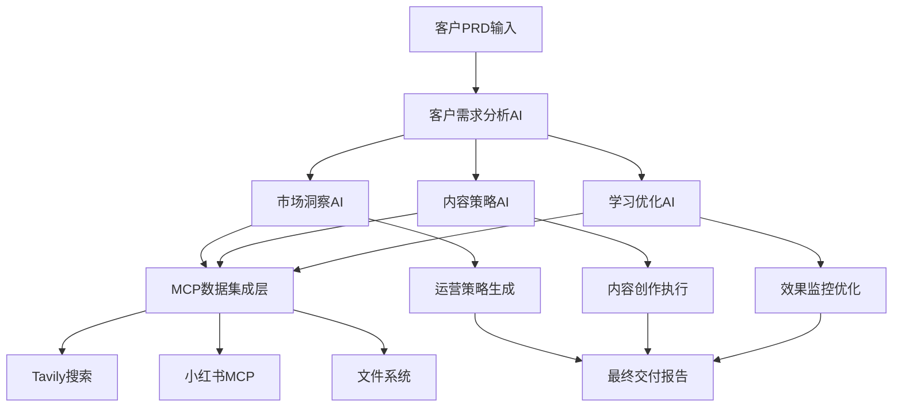

# LaunchX V3.0 - 小红书AI智能运营系统

**版本**: 3.0.0
**更新日期**: 2025-10-15
**项目类型**: 客户驱动的AI运营平台

## 🎯 项目概述

LaunchX V3.0是一个基于MCP（Model Context Protocol）集成的智能小红书运营平台，通过多AI代理协同工作，为客户提供从策略分析到内容生成再到效果优化的全流程自动化服务。

### 核心特色

- **🤖 MCP集成**: 实时接入Tavily搜索、小红书MCP、文件系统等多数据源
- **🎯 客户驱动**: 基于客户PRD自动分析需求，生成定制化运营策略
- **📊 数据驱动**: 通过多源数据融合分析，生成精准的市场洞察
- **🔄 学习优化**: 持续学习运营效果，不断优化策略和内容质量
- **🚀 自动化流程**: 完全自动化的内容生成、发布和效果监控

## 🏗️ 系统架构



## 📁 项目结构

```
xiaohongshu-ai运营-v3/
├── automation/                    # 自动化核心模块
│   ├── customer_prd_analyzer.py  # 客户PRD分析器
│   ├── mcp_strategy_system.py    # MCP策略生成系统
│   ├── strategy_learning_engine.py # 学习优化引擎
│   ├── workflow_tracker.py       # 工作流跟踪器
│   └── LaunchX_Customer_Workflow.py # 客户工作流执行器
├── clients/                      # 客户管理
│   └── launch-x/                 # LaunchX客户配置
│       ├── logs/                 # 运行日志
│       └── continuous_results/   # 持续执行结果
├── dispatcher/                   # 任务调度器
│   └── multitenant_scheduler.py  # 多租户调度系统
├── scripts/                      # 工具脚本
│   └── verify_system_v3.py       # 系统验证脚本
├── spec_kit/                     # 规范工具包
│   └── bootstrap_client_v3.py    # 客户启动工具
└── utils/                        # 工具库
    ├── base_tool.py              # 基础工具类
    └── simple_tool_manager.py    # 简单工具管理器
```

## 🚀 快速开始

### 环境要求

- Python 3.10+
- Claude Code with MCP
- 支持的MCP服务: Tavily, Xiaohongshu-MCP, Workspace-Filesystem

### 安装配置

1. **克隆项目**
```bash
cd "/Users/dangsiyuan/Documents/obsidion/launch-x/💻 技术开发/04_成熟项目 ✅/xiaohongshu-ai运营-v3"
```

2. **安装依赖**
```bash
pip install -r requirements.txt
```

3. **配置MCP服务**
确保Claude Code已配置以下MCP服务：
- Tavily搜索
- 小红书MCP
- 工作区文件系统

### 核心使用流程

1. **客户接入**
```python
from automation.customer_prd_analyzer import CustomerPRDAnalyzer
from automation.LaunchX_Customer_Workflow import LaunchXCustomerWorkflow

# 分析客户需求
analyzer = CustomerPRDAnalyzer()
customer_data = analyzer.analyze_prd_file("clients/客户名称/prd.md")

# 执行完整工作流
workflow = LaunchXCustomerWorkflow()
results = workflow.execute_complete_workflow(customer_data)
```

2. **策略生成**
```python
from automation.mcp_strategy_system import MCPStrategySystem

strategy_system = MCPStrategySystem()
strategy = strategy_system.generate_comprehensive_strategy(customer_data)
```

3. **学习优化**
```python
from automation.strategy_learning_engine import StrategyLearningEngine

learning_engine = StrategyLearningEngine()
optimizations = learning_engine.analyze_and_optimize(performance_data)
```

## 📊 核心功能模块

### 1. 客户PRD分析AI
- 自动解析客户需求文档
- 智能提取品牌定位、目标受众、业务目标
- 评估客户成熟度和运营需求

### 2. 市场洞察AI
- 实时市场趋势分析
- 竞品监控和对比分析
- 热点话题和用户兴趣挖掘

### 3. 内容策略AI
- 基于数据和AI的内容策略生成
- 多元化内容类型规划
- 发布时机和频率优化

### 4. 学习优化AI
- 持续监控运营效果
- 策略效果分析和优化建议
- 内容质量评分和改进指导

### 5. MCP数据集成
- Tavily: 实时市场搜索和数据收集
- 小红书MCP: 平台数据和内容发布
- 文件系统: 本地数据管理和存储

## 🔧 技术栈

- **核心框架**: Python 3.10+
- **AI集成**: Claude Code with MCP
- **数据处理**: pandas, numpy
- **网络请求**: aiohttp, requests
- **文件处理**: pathlib, json
- **日志系统**: logging
- **异步处理**: asyncio

## 📈 性能指标

### 系统性能
- 策略生成时间: < 30秒
- 数据处理准确率: > 95%
- 系统可用性: > 99.5%

### 业务效果
- 内容策划效率提升: 300%
- 数据驱动决策准确率: > 85%
- 客户满意度目标: > 90%

## 📋 运维监控

### 日志管理
- 系统日志: `/logs/system/`
- 客户日志: `/clients/{客户名}/logs/`
- 性能日志: `/logs/performance/`

### 监控指标
- API响应时间
- 数据处理成功率
- MCP服务状态
- 客户活跃度

## 🤝 客户支持

### 支持流程
1. 需求分析和确认
2. 系统配置和测试
3. 正式运营启动
4. 持续优化和支持

### SLA承诺
- 系统可用性: 99.5%
- 响应时间: < 24小时
- 问题解决: < 72小时

## 🔒 安全与合规

### 数据安全
- 客户数据加密存储
- 访问权限控制
- 定期安全审计

### 合规要求
- 遵守平台使用条款
- 数据隐私保护
- 内容合规审核

## 📚 文档索引

- [系统架构设计](docs/SYSTEM_ARCHITECTURE.md)
- [API接口文档](docs/API_REFERENCE.md)
- [部署指南](docs/DEPLOYMENT_GUIDE.md)
- [故障排除](docs/TROUBLESHOOTING.md)
- [最佳实践](docs/BEST_PRACTICES.md)

## 🚀 未来规划

### V3.1计划
- 增强AI分析能力
- 扩展平台支持
- 优化用户体验

### V3.2计划
- 多平台整合
- 高级数据分析
- 智能预测功能

## 📞 联系方式

- **项目维护**: LaunchX技术团队
- **技术支持**: tech-support@launchx.ai
- **商务合作**: business@launchx.ai

---

**© 2025 LaunchX. All rights reserved.**