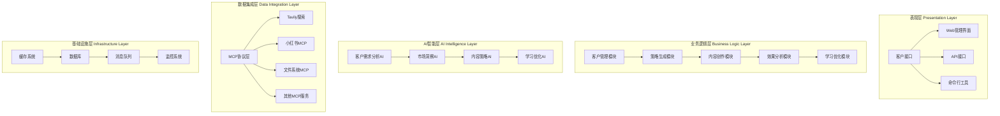
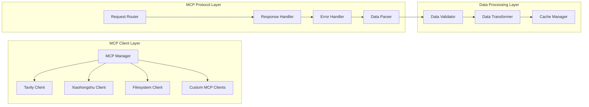
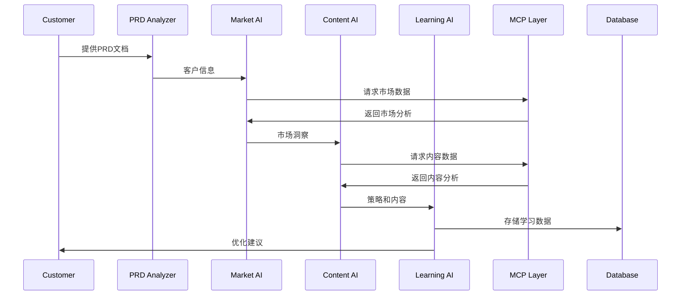
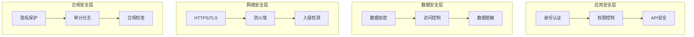

# LaunchX V3.0 系统架构设计

**版本**: 3.0.0
**更新日期**: 2025-10-15
**作者**: LaunchX技术团队

## 1. 总体架构概述

LaunchX V3.0采用分层微服务架构，基于MCP（Model Context Protocol）实现多源数据集成和AI能力协同。系统设计遵循高内聚、低耦合原则，支持水平扩展和多租户运营。

### 1.1 架构原则

- **客户驱动**: 以客户需求为中心的业务流程设计
- **AI优先**: 全面集成AI能力，实现智能化运营决策
- **数据驱动**: 基于实时数据分析和洞察指导运营策略
- **模块化**: 松耦合的模块设计，支持独立开发和部署
- **可扩展**: 支持新客户、新平台、新功能的快速接入

### 1.2 技术架构分层



## 2. 核心模块设计

### 2.1 客户需求分析模块 (CustomerPRDAnalyzer)

**功能职责**:
- 解析和分析客户需求文档(PRD)
- 提取关键信息：品牌定位、目标受众、业务目标
- 评估客户成熟度和运营复杂度
- 生成结构化的客户画像

**核心类设计**:
```python
@dataclass
class CustomerBasicInfo:
    company_name: str
    industry: str
    company_size: str
    contact_person: str
    contact_info: str

@dataclass
class BrandPositioning:
    brand_name: str
    brand_value: str
    market_position: str
    competitive_advantage: str

@dataclass
class TargetAudience:
    primary_demographic: str
    interests: List[str]
    pain_points: List[str]
    consumption_habits: str

class CustomerPRDAnalyzer:
    def analyze_prd_file(self, file_path: str) -> Dict
    def extract_customer_info(self, content: str) -> CustomerBasicInfo
    def analyze_brand_positioning(self, content: str) -> BrandPositioning
    def analyze_target_audience(self, content: str) -> TargetAudience
    def assess_maturity_level(self, customer_data: Dict) -> int
```

### 2.2 MCP策略生成系统 (MCPStrategySystem)

**功能职责**:
- 集成多个MCP数据源
- 实时市场数据收集和分析
- 生成基于数据的运营策略
- 提供策略置信度评估

**核心组件**:
```python
class MarketInsightAI:
    async def analyze_market_trends(self, customer_info: Dict) -> Dict
    async def analyze_competitors(self, customer_info: Dict) -> Dict
    async def identify_opportunities(self, customer_info: Dict) -> List[Dict]

class ContentStrategyAI:
    async def generate_content pillars(self, customer_info: Dict) -> List[Dict]
    async def recommend_content_types(self, market_data: Dict) -> List[str]
    async def optimize_publishing_schedule(self, audience_data: Dict) -> Dict

class MCPStrategySystem:
    def __init__(self):
        self.market_ai = MarketInsightAI()
        self.content_ai = ContentStrategyAI()

    async def generate_comprehensive_strategy(self, customer_data: Dict) -> Dict
    async def validate_strategy_feasibility(self, strategy: Dict) -> float
```

### 2.3 学习优化引擎 (StrategyLearningEngine)

**功能职责**:
- 监控和分析运营效果数据
- 识别策略执行模式和问题
- 生成优化建议和改进方案
- 实现系统的自学习和迭代

**核心算法**:
```python
@dataclass
class StrategyPerformance:
    engagement_rate: float
    conversion_rate: float
    content_quality_score: float
    audience_growth: float
    roi_metrics: Dict[str, float]

class StrategyLearningEngine:
    def __init__(self):
        self.performance_history = []
        self.learning_insights = []

    async def analyze_performance_data(self, performance_data: Dict) -> StrategyPerformance
    async def identify_success_patterns(self, history: List[Dict]) -> List[Dict]
    async def generate_optimization_recommendations(self, performance: StrategyPerformance) -> List[Dict]
    async def apply_learning_to_strategy(self, strategy: Dict, insights: List[Dict]) -> Dict
```

### 2.4 工作流跟踪器 (WorkflowTracker)

**功能职责**:
- 跟踪客户工作流执行状态
- 记录每个阶段的执行结果
- 提供工作流进度查询接口
- 支持工作流的暂停、恢复和回滚

**状态管理**:
```python
@dataclass
class WorkflowState:
    workflow_id: str
    customer_id: str
    current_stage: str
    stage_status: Dict[str, str]
    progress_percentage: float
    start_time: datetime
    estimated_completion: datetime
    results: Dict[str, Any]

class WorkflowTracker:
    def create_workflow(self, customer_id: str) -> str
    def update_stage_status(self, workflow_id: str, stage: str, status: str, result: Any = None)
    def get_workflow_progress(self, workflow_id: str) -> WorkflowState
    def complete_workflow(self, workflow_id: str, final_results: Dict)
```

## 3. MCP集成架构

### 3.1 MCP协议层设计



### 3.2 数据源集成策略

**Tavily搜索集成**:
- 实时市场趋势搜索
- 竞品信息收集
- 热点话题发现
- 用户兴趣分析

**小红书MCP集成**:
- 平台数据获取
- 内容发布功能
- 用户互动分析
- 账号管理

**文件系统集成**:
- 本地数据存储
- 配置文件管理
- 日志文件处理
- 备份和恢复

## 4. 数据流架构

### 4.1 数据流向图



### 4.2 数据模型设计

**客户数据模型**:
```json
{
  "customer_id": "string",
  "basic_info": {
    "company_name": "string",
    "industry": "string",
    "company_size": "string"
  },
  "brand_positioning": {
    "brand_name": "string",
    "brand_value": "string",
    "market_position": "string"
  },
  "target_audience": {
    "demographics": "string",
    "interests": ["string"],
    "pain_points": ["string"]
  },
  "business_goals": {
    "primary_goals": ["string"],
    "success_metrics": ["string"],
    "timeline": "string"
  }
}
```

**策略数据模型**:
```json
{
  "strategy_id": "string",
  "customer_id": "string",
  "created_at": "datetime",
  "market_analysis": {
    "trends": ["string"],
    "competitors": ["string"],
    "opportunities": ["string"]
  },
  "content_strategy": {
    "pillars": [{"name": "string", "topics": ["string"]}],
    "content_types": ["string"],
    "publishing_schedule": {"frequency": "string", "best_times": ["string"]}
  },
  "confidence_score": "float",
  "expected_outcomes": {
    "engagement_rate": "float",
    "follower_growth": "float",
    "conversion_rate": "float"
  }
}
```

## 5. 安全架构设计

### 5.1 安全层次



### 5.2 数据保护策略

- **传输加密**: 所有API通信使用HTTPS/TLS加密
- **存储加密**: 敏感数据使用AES-256加密存储
- **访问控制**: 基于角色的权限管理(RBAC)
- **审计日志**: 完整的操作审计和访问日志
- **备份策略**: 定期数据备份和灾难恢复

## 6. 性能优化架构

### 6.1 性能优化策略

**缓存策略**:
- Redis缓存热点数据
- 本地缓存减少重复计算
- CDN加速静态资源访问

**异步处理**:
- 异步MCP数据请求
- 后台任务队列处理
- 非阻塞IO操作

**数据库优化**:
- 索引优化
- 查询优化
- 读写分离

### 6.2 监控和告警

**系统监控**:
- CPU、内存、磁盘使用率
- 网络流量和延迟
- API响应时间

**业务监控**:
- 客户工作流执行状态
- 策略生成成功率
- 内容发布效果

**告警机制**:
- 系统异常告警
- 性能阈值告警
- 业务指标异常告警

## 7. 部署架构

### 7.1 部署模式

**单机部署**:
- 适用于小规模客户
- 资源占用少
- 运维简单

**分布式部署**:
- 适用于大规模客户
- 高可用性
- 水平扩展

**容器化部署**:
- Docker容器化
- Kubernetes编排
- 微服务架构

### 7.2 环境管理

```yaml
environments:
  development:
    - 本地开发环境
    - 功能测试环境

  staging:
    - 预发布环境
    - 性能测试环境

  production:
    - 生产环境
    - 监控和运维环境
```

## 8. 技术债务和改进计划

### 8.1 当前技术债务

- 代码重构需求
- 单元测试覆盖率提升
- 文档完善度提升
- 性能优化空间

### 8.2 改进计划

**短期计划 (1-3个月)**:
- 完善单元测试和集成测试
- 优化数据库查询性能
- 增强错误处理机制

**中期计划 (3-6个月)**:
- 微服务架构重构
- 引入消息队列
- 实现自动化部署

**长期计划 (6-12个月)**:
- 多平台支持扩展
- AI算法优化升级
- 国际化支持

---

**© 2025 LaunchX. All rights reserved.**