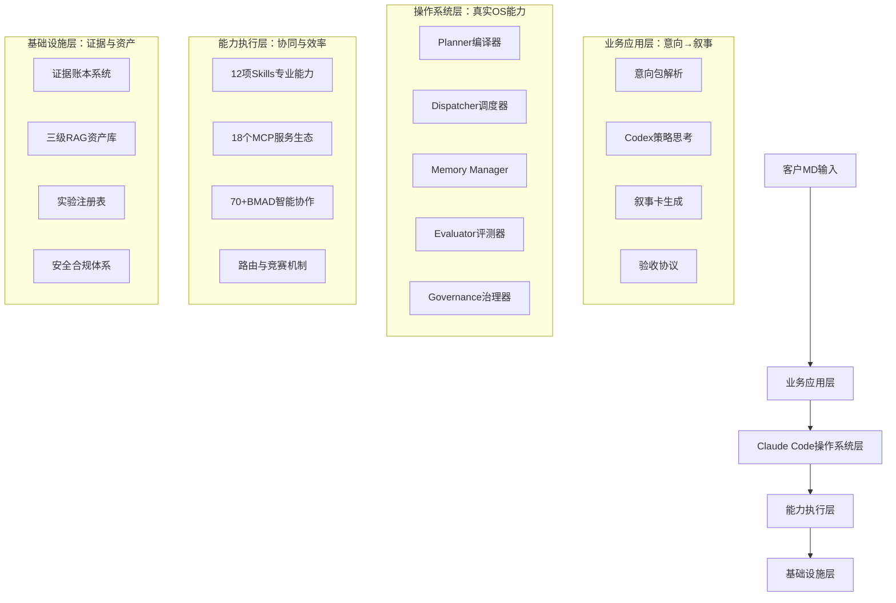
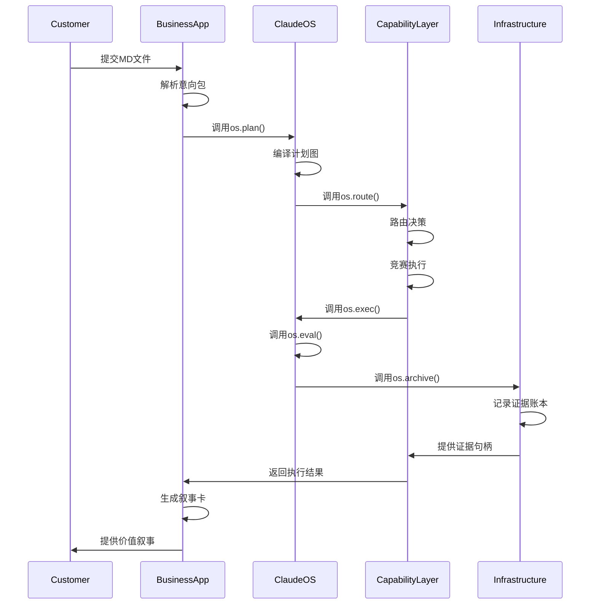

# 架构总体设计 - 小红书AI运营系统v4.0

> **设计目标**：构建"意向包→计划图→证据门→叙事卡→账本/资产化"的可追溯价值链

---

## 🏗️ 四层架构深度设计

### 架构总览

基于Codex深度策略思考，构建以**证据驱动的叙事—意向匹配引擎**为中心的四层架构体系：



## 📱 业务应用层 - 意向→叙事

### 核心设计理念
**将客户的简单MD输入转化为深度策略理解，最终生成面向业务的价值叙事**

### 1.1 意向包系统 (Intent Package)

**设计原则**：结构化客户意图，绑定可验证的证据需求

```yaml
意向包结构:
  trace_id: "唯一标识符"
  target_definition:
    primary_goal: "主要业务目标"
    success_criteria: "成功标准KPI"
    time_horizon: "时间窗口"
    budget_constraints: "预算限制"
  hypothesis_set:
    core_assumption: "核心假设"
    supporting_assumptions: "支撑假设列表"
  constraints:
    compliance: "合规要求"
    brand_guidelines: "品牌指导原则"
    resource_limitations: "资源限制"
  context_links:
    historical_data: "历史数据链接"
    market_intelligence: "市场情报"
    competitive_analysis: "竞品分析"
  risk_assessment:
    identified_risks: "已识别风险"
    mitigation_strategies: "缓解策略"
    rollback_thresholds: "回滚阈值"
```

### 1.2 Codex策略思考集成

**三件套思维器**：体现Codex的深度策略思考能力

```python
class CodexStrategicThinker:
    """Codex策略思考器 - 深度策略分析"""
    
    def __init__(self):
        self.constraint_identifier = ConstraintIdentifier()      # 主约束识别器
        self.counterfactual_generator = CounterfactualGenerator() # 反事实生成器
        self.dual_perspective_analyzer = DualPerspectiveAnalyzer() # 对偶视角分析器
    
    async def think_strategically(self, intent_package, evidence_context):
        """Codex深度策略思考"""
        
        # 主约束识别：识别瓶颈/成本/时间约束
        primary_constraints = await self.constraint_identifier.identify(
            intent_package, evidence_context
        )
        
        # 反事实生成：If-Not/If-More/If-Less情景分析
        counterfactual_scenarios = await self.counterfactual_generator.generate(
            intent_package, primary_constraints
        )
        
        # 对偶视角：客户/平台/竞争者多角度分析
        dual_perspectives = await self.dual_perspective_analyzer.analyze(
            intent_package, evidence_context
        )
        
        return StrategicThinkingOutput(
            constraints=primary_constraints,
            counterfactuals=counterfactual_scenarios,
            perspectives=dual_perspectives,
            decision_framework=self.generate_decision_framework(
                primary_constraints, counterfactual_scenarios
            )
        )
```

### 1.3 叙事卡生成 (Narrative Card)

**设计目标**：将执行证据聚合为面向业务的变化叙事

```yaml
叙事卡结构:
  narrative_id: "叙事标识符"
  trace_id: "关联的意向包ID"
  execution_summary:
    results: "执行结果摘要"
    key_findings: "关键发现"
    performance_metrics: "性能指标"
  evidence_chain:
    primary_evidence: "主要证据"
    supporting_evidence: "支撑证据列表"
    confidence_scores: "置信度评分"
  causal_analysis:
    root_causes: "根本原因分析"
    effect_chains: "影响链"
    correlation_vs_causation: "相关性vs因果关系分析"
  counterfactual_analysis:
    what_if_scenarios: "假设情景分析"
    missed_opportunities: "错失机会"
    alternative_paths: "替代路径"
  decision_recommendations:
    immediate_actions: "立即行动"
    strategic_adjustments: "战略调整"
    next_steps: "下一步计划"
  learning_insights:
    success_patterns: "成功模式"
    failure_lessons: "失败教训"
    knowledge_gaps: "知识缺口"
```

### 1.4 验收协议机制

**验收绑定**：每个意向包进入执行前必须绑定验收标准

```python
class AcceptanceProtocol:
    """验收协议管理器"""
    
    def __init__(self):
        self.metric_definer = MetricDefiner()
        self.observation_planner = ObservationPlanner()
        self.rollback_thresholds = RollbackThresholds()
    
    async def bind_acceptance_criteria(self, intent_package):
        """为意向包绑定验收标准"""
        
        # 定义验收指标
        success_metrics = await self.metric_definer.define_metrics(
            intent_package.success_criteria
        )
        
        # 规划观测方式
        observation_plan = await self.observation_planner.plan_observations(
            success_metrics, intent_package.time_horizon
        )
        
        # 设定回滚界限
        rollback_limits = await self.rollback_thresholds.define_limits(
            intent_package.risk_assessment
        )
        
        return AcceptanceCriteria(
            metrics=success_metrics,
            observations=observation_plan,
            rollback_limits=rollback_limits,
            validation_schedule=self.create_validation_schedule(
                intent_package.time_horizon
            )
        )
```

## 🖥️ Claude Code操作系统层 - 真实OS能力

### 设计理念
**将Claude Code转化为真正的操作系统，提供完整的进程管理、资源调度、内存管理、评测治理能力**

### 2.1 Kernel五件套架构

#### 2.1.1 Planner编译器

**功能**：将意向包编译为可执行计划图

```python
class PlanGraphCompiler:
    """计划图编译器 - 意向包到可执行计划的转换"""
    
    def __init__(self):
        self.task_decomposer = TaskDecomposer()
        self.dependency_analyzer = DependencyAnalyzer()
        self.resource_planner = ResourcePlanner()
        self.evidence_gate_placer = EvidenceGatePlacer()
    
    async def compile_plan_graph(self, intent_package):
        """编译意向包为计划图"""
        
        # 任务分解：将意向包分解为可执行任务
        tasks = await self.task_decomposer.decompose(intent_package)
        
        # 依赖分析：分析任务间依赖关系
        dependencies = await self.dependency_analyzer.analyze(tasks)
        
        # 资源规划：规划所需的技能、MCP、Agent资源
        resource_requirements = await self.resource_planner.plan(
            tasks, dependencies
        )
        
        # 证据门放置：在关键节点放置证据验证门
        evidence_gates = await self.evidence_gate_placer.place_gates(
            tasks, dependencies
        )
        
        return PlanGraph(
            nodes=tasks,
            edges=dependencies,
            resource_requirements=resource_requirements,
            evidence_gates=evidence_gates,
            compiled_timestamp=datetime.now()
        )
```

#### 2.1.2 Dispatcher调度器

**功能**：多队列优先级调度，支持抢占、退避、节流

```python
class IntelligentDispatcher:
    """智能调度器 - 多队列优先级调度系统"""
    
    def __init__(self):
        self.priority_queues = PriorityQueues()
        self.cost_quota_manager = CostQuotaManager()
        self.preemption_handler = PreemptionHandler()
        self.throttling_controller = ThrottlingController()
    
    async def dispatch_tasks(self, plan_graph):
        """调度计划图中的任务"""
        
        # 优先级分类
        prioritized_tasks = await self.priority_queues.classify(plan_graph.nodes)
        
        # 成本配额分配
        resource_allocation = await self.cost_quota_manager.allocate(
            prioritized_tasks, plan_graph.resource_requirements
        )
        
        # 调度执行
        execution_results = []
        for task_batch in prioritized_tasks:
            # 检查抢占条件
            if await self.preemption_handler.should_preempt(task_batch):
                await self.handle_preemption(task_batch)
            
            # 节流控制
            if await self.throttling_controller.should_throttle(task_batch):
                await self.apply_throttling(task_batch)
            
            # 执行任务批次
            batch_result = await self.execute_task_batch(
                task_batch, resource_allocation
            )
            execution_results.append(batch_result)
        
        return execution_results
```

#### 2.1.3 Memory Manager内存管理

**功能**：分层内存管理，统一证据句柄引用

```python
class LayeredMemoryManager:
    """分层内存管理器 - 短时/中时/长时内存分层管理"""
    
    def __init__(self):
        self.short_term_memory = ShortTermMemory()  # 对话上下文
        self.medium_term_memory = MediumTermMemory()  # 任务缓存
        self.long_term_memory = LongTermMemory()      # 资产化存储
        self.evidence_handle_registry = EvidenceHandleRegistry()
    
    async def allocate_memory(self, memory_request):
        """分配内存资源"""
        
        if memory_request.type == "conversation_context":
            # 短时内存：对话上下文
            return await self.short_term_memory.allocate(
                memory_request.size, memory_request.ttl
            )
            
        elif memory_request.type == "task_cache":
            # 中时内存：任务执行缓存
            return await self.medium_term_memory.allocate(
                memory_request.size, memory_request.priority
            )
            
        elif memory_request.type == "asset_storage":
            # 长时内存：资产化存储
            evidence_handle = await self.evidence_handle_registry.create_handle(
                memory_request.content
            )
            return await self.long_term_memory.store(
                evidence_handle, memory_request.content
            )
    
    async def retrieve_by_evidence_handle(self, evidence_handle):
        """通过证据句柄检索内容"""
        return await self.long_term_memory.retrieve(evidence_handle)
```

#### 2.1.4 Evaluator评测器

**功能**：强制前置证据+后置评测，失败触发回退

```python
class StrictEvaluator:
    """严格评测器 - 前置证据+后置评测的强制验证"""
    
    def __init__(self):
        self.pre_evaluation_checker = PreEvaluationChecker()
        self.post_evaluation_verifier = PostEvaluationVerifier()
        self.rollback_strategist = RollbackStrategist()
    
    async def evaluate_node(self, node, execution_context):
        """评测节点执行结果"""
        
        # 前置评测：检查前置证据
        pre_eval_result = await self.pre_evaluation_checker.check(
            node, execution_context
        )
        
        if not pre_eval_result.sufficient_evidence:
            # 前置证据不足，触发回退
            rollback_strategy = await self.rollback_strategist.plan_rollback(
                node, pre_eval_result.missing_evidence
            )
            return EvaluationResult(
                status="FAILED",
                reason="INSUFFICIENT_PRE_EVIDENCE",
                rollback_strategy=rollback_strategy
            )
        
        # 后置评测：验证执行结果
        post_eval_result = await self.post_evaluation_verifier.verify(
            node, execution_context
        )
        
        if not post_eval_result.meets_criteria:
            # 后置评测未达标，触发降级或重试
            degradation_strategy = await self.plan_degradation(
                node, post_eval_result.gaps
            )
            return EvaluationResult(
                status="DEGRADED",
                degradation=degradation_strategy
            )
        
        return EvaluationResult(
            status="PASSED",
            confidence=post_eval_result.confidence_score,
            quality_metrics=post_eval_result.quality_metrics
        )
```

#### 2.1.5 Governance治理器

**功能**：策略沙箱、人类回路、审计可回放

```python
class GovernanceSystem:
    """治理系统 - 安全、合规、可审计的系统治理"""
    
    def __init__(self):
        self.policy_sandbox = PolicySandbox()
        self.human_in_the_loop = HumanInTheLoop()
        self.audit_recorder = AuditRecorder()
        self.compliance_checker = ComplianceChecker()
    
    async def govern_execution(self, execution_request):
        """治理执行请求"""
        
        # 策略沙箱检查
        sandbox_result = await self.policy_sandbox.validate(execution_request)
        
        if not sandbox_result.allowed:
            return GovernanceResult(
                status="REJECTED",
                reason=sandbox_result.violation,
                suggested_alternatives=sandbox_result.alternatives
            )
        
        # 人类回路检查
        hitl_check = await self.human_in_the_loop.check(execution_request)
        
        if hitl_check.requires_human_approval:
            approval_result = await self.request_human_approval(
                execution_request, hitl_check
            )
            
            if not approval_result.approved:
                return GovernanceResult(
                    status="PENDING_HUMAN_APPROVAL",
                    human_feedback=approval_result.feedback
                )
        
        # 合规性检查
        compliance_result = await self.compliance_checker.check(execution_request)
        
        if not compliance_result.compliant:
            return GovernanceResult(
                status="COMPLIANCE_VIOLATION",
                violations=compliance_result.violations,
                remediation_steps=compliance_result.remediation
            )
        
        # 记录审计
        await self.audit_recorder.record_execution(execution_request)
        
        return GovernanceResult(status="APPROVED")
```

### 2.2 统一Syscall规范

**标准化API**：提供统一的操作系统级接口

```python
class ClaudeCodeOSSyscalls:
    """Claude Code操作系统系统调用接口"""
    
    async def plan(self, intent_package: IntentPackage) -> PlanGraph:
        """编译意向包为计划图"""
        return await self.planner.compile_plan_graph(intent_package)
    
    async def route(self, task: Task) -> Tuple[CapabilityType, str]:
        """路由任务到合适的能力"""
        return await self.router.determine_optimal_capability(task)
    
    async def exec(self, node: PlanNode) -> EvidenceHandle:
        """执行计划节点"""
        return await self.executor.execute_node(node)
    
    async def eval(self, node: PlanNode, evidence: EvidenceHandle) -> EvaluationResult:
        """评测节点执行结果"""
        return await self.evaluator.evaluate_node(node, evidence)
    
    async def archive(self, trace_id: str) -> LedgerEntry:
        """归档执行轨迹到证据账本"""
        return await self.archiver.archive_trace(trace_id)
```

## 🚀 能力执行层 - 协同与效率

### 设计理念
**统一12项Skills、18个MCP服务、70+BMAD Agent的协作效率，建立智能路由和竞赛机制**

### 3.1 能力图谱系统

**统一类型系统**：描述所有能力的输入/输出/副作用/成本/时延/置信度

```python
class CapabilityGraph:
    """能力图谱 - 统一能力描述和关系管理"""
    
    def __init__(self):
        self.capability_registry = CapabilityRegistry()
        self.type_system = TypeSystem()
        self.relationship_analyzer = RelationshipAnalyzer()
        self.performance_tracker = PerformanceTracker()
    
    def register_capability(self, capability):
        """注册能力到图谱"""
        
        # 类型验证
        type_validation = await self.type_system.validate(capability)
        
        # 性能基线记录
        performance_baseline = await self.performance_tracker.establish_baseline(
            capability
        )
        
        # 关系分析
        relationships = await self.relationship_analyzer.analyze(
            capability, self.capability_registry.get_all_capabilities()
        )
        
        return self.capability_registry.register(
            capability, type_validation, performance_baseline, relationships
        )
    
    def find_equivalent_capabilities(self, task_requirements):
        """查找等价能力"""
        return self.capability_registry.find_by_requirements(
            task_requirements, relationship_type="equivalent"
        )
    
    def find_complementary_capabilities(self, base_capability):
        """查找互补能力"""
        return self.capability_registry.find_complementary(base_capability)
```

### 3.2 智能路由与竞赛机制

#### 3.2.1 分层路由器

```python
class HierarchicalRouter:
    """分层路由器 - 启发式→小样本试探→多臂老虎机"""
    
    def __init__(self):
        self.heuristic_router = HeuristicRouter()
        self.exploration_sampler = ExplorationSampler()
        self.multi_armed_bandit = MultiArmedBandit()
        self.performance_tracker = PerformanceTracker()
    
    async def route_task(self, task):
        """智能路由任务到最优能力"""
        
        # 第一层：启发式路由
        heuristic_suggestion = await self.heuristic_router.suggest(task)
        
        # 第二层：小样本试探（对新或不确定的任务）
        if heuristic_suggestion.confidence < 0.7:
            exploration_results = await self.exploration_sampler.sample(
                task, sample_size=5
            )
            best_exploration = max(exploration_results, key=lambda x: x.performance)
            
            # 更新启发式路由器
            await self.heuristic_router.update_with_exploration(
                task, exploration_results
            )
            
            return best_exploration.capability
        
        # 第三层：多臂老虎机（对成熟任务）
        else:
            mab_result = await self.multi_armed_bandit.select(
                task, heuristic_suggestion.confidence
            )
            return mab_result.selected_capability
```

#### 3.2.2 混合评测竞赛器

```python
class HybridEvaluationCompetition:
    """混合评测竞赛器 - 规则+统计+LLM的综合评测"""
    
    def __init__(self):
        self.rule_evaluator = RuleBasedEvaluator()
        self.statistical_evaluator = StatisticalEvaluator()
        self.llm_evaluator = LLMEvaluator()
        self.performance_tracker = PerformanceTracker()
    
    async def compete_capabilities(self, task, candidate_capabilities):
        """能力竞赛机制"""
        
        competition_results = []
        
        for capability in candidate_capabilities:
            # 规则评测
            rule_score = await self.rule_evaluator.evaluate(capability, task)
            
            # 统计评测
            stat_score = await self.statistical_evaluator.evaluate(
                capability, task, self.performance_tracker.get_history(capability)
            )
            
            # LLM评测
            llm_score = await self.llm_evaluator.evaluate(
                capability, task
            )
            
            # 综合评分
            composite_score = self.calculate_composite_score(
                rule_score, stat_score, llm_score
            )
            
            competition_results.append(
                CompetitionResult(
                    capability=capability,
                    rule_score=rule_score,
                    stat_score=stat_score,
                    llm_score=llm_score,
                    composite_score=composite_score
                )
            )
        
        # 选择获胜者
        winner = max(competition_results, key=lambda x: x.composite_score)
        
        # 记录竞赛结果到学习样本池
        await self.record_competition_results(task, competition_results)
        
        return winner
```

### 3.3 供给治理机制

```python
class CapabilitySupplyGovernance:
    """能力供给治理 - 稳定器、替代器、熔断器"""
    
    def __init__(self):
        self.stabilizers = {}  # 每类能力的稳定器
        self.alternatives = {}  # 等价候选排列
        self.circuit_breakers = {}  # 健康度监控熔断器
        self.health_monitor = HealthMonitor()
    
    def setup_capability_governance(self, capability_type):
        """设置能力治理机制"""
        
        # 稳定器：速率阈值、批处理聚合、缓存层
        self.stabilizers[capability_type] = CapabilityStabilizer(
            rate_limit=self.determine_rate_limit(capability_type),
            batch_size=self.determine_batch_size(capability_type),
            cache_strategy=self.determine_cache_strategy(capability_type)
        )
        
        # 替代器：等价候选排列
        self.alternatives[capability_type] = self.identify_alternatives(
            capability_type
        )
        
        # 熔断器：健康度监控
        self.circuit_breakers[capability_type] = CircuitBreaker(
            failure_threshold=self.determine_failure_threshold(capability_type),
            recovery_timeout=self.determine_recovery_timeout(capability_type)
        )
    
    async def execute_with_governance(self, capability, task):
        """带治理的能力执行"""
        
        # 健康度检查
        if self.circuit_breakers[capability.type].is_open():
            # 熔断器开启，使用替代能力
            alternative = await self.stabilizers[capability.type].select_alternative(
                capability, self.alternatives[capability.type]
            )
            return await self.execute_with_governance(alternative, task)
        
        # 稳定器处理
        try:
            # 应用速率限制和批处理
            stabilized_request = await self.stabilizers[capability.type].process_request(
                capability, task
            )
            
            # 执行能力
            result = await capability.execute(stabilized_request)
            
            return result
            
        except Exception as e:
            # 执行失败，记录健康度
            await self.health_monitor.record_failure(capability, e)
            
            # 尝试降级策略
            degraded_result = await self.apply_degradation_strategy(
                capability, task, e
            )
            
            return degraded_result
```

## 🗄️ 基础设施层 - 证据与资产

### 设计理念
**构建可信的证据账本系统，实现证据驱动的决策和资产化沉淀**

### 4.1 证据账本系统

```python
class EvidenceLedger:
    """证据账本 - 可追溯、可验证的单一事实源"""
    
    def __init__(self):
        self.ledger_storage = LedgerStorage()
        self.hash_generator = HashGenerator()
        self.index_manager = IndexManager()
        self.version_manager = VersionManager()
    
    async def record_evidence(self, evidence_entry):
        """记录证据到账本"""
        
        # 生成哈希
        entry_hash = await self.hash_generator.generate_hash(evidence_entry)
        
        # 创建账本条目
        ledger_entry = LedgerEntry(
            id=entry_hash,
            timestamp=datetime.now(),
            evidence_type=evidence_entry.type,
            content=evidence_entry.content,
            sources=evidence_entry.sources,
            confidence_score=evidence_entry.confidence,
            expiry_date=evidence_entry.expiry_date,
            metadata=evidence_entry.metadata,
            version=self.version_manager.get_current_version()
        )
        
        # 存储到账本
        await self.ledger_storage.append(ledger_entry)
        
        # 更新索引
        await self.index_manager.update_indices(ledger_entry)
        
        return ledger_entry
    
    async def query_by_trace_id(self, trace_id: str):
        """按TraceID查询证据链"""
        return await self.index_manager.query_by_trace_id(trace_id)
    
    async def query_by_topic(self, topic: str, time_range: Tuple[datetime, datetime]):
        """按主题和时间范围查询证据"""
        return await self.index_manager.query_by_topic(topic, time_range)
```

### 4.2 三级RAG资产库

```python
class ThreeLevelRAGAssetStore:
    """三级RAG资产库 - 叙事/流程/策略级知识资产"""
    
    def __init__(self):
        self.narrative_rag = NarrativeLevelRAG()
        self.process_rag = ProcessLevelRAG()
        self.strategy_rag = StrategyLevelRAG()
        self.domain_ontology = DomainOntology()
    
    async def store_narrative_asset(self, narrative_card, evidence_chain):
        """存储叙事级资产"""
        
        # 提取叙事模式
        narrative_patterns = await self.extract_narrative_patterns(
            narrative_card, evidence_chain
        )
        
        # 域于领域本体索引
        indexed_narrative = await self.domain_ontology.index_narrative(
            narrative_card, narrative_patterns
        )
        
        # 存储到RAG系统
        return await self.narrative_rag.store(
            indexed_narrarrative, evidence_chain
        )
    
    async def store_process_asset(self, workflow_execution, lessons_learned):
        """存储流程级资产"""
        
        # 提取流程模板
        process_template = await self.extract_process_template(
            workflow_execution
        )
        
        # 基于成功/失败案例生成模板
        process_assets = await self.generate_process_assets(
            workflow_execution, lessons_learned
        )
        
        return await self.process_rag.store(process_assets)
    
    async def store_strategy_asset(self, strategy_result, success_patterns):
        """存储策略级资产"""
        
        # 提取策略模式
        strategy_patterns = await self.extract_strategy_patterns(
            strategy_result, success_patterns
        )
        
        # 生成策略手册
        strategy_playbook = await self.generate_strategy_playbook(
            strategy_result, strategy_patterns
        )
        
        return await self.strategy_rag.store(strategy_playbook)
```

### 4.3 实验与评测注册表

```python
class ExperimentRegistry:
    """实验与评测注册表 - 记录A/B测试和效果评估"""
    
    def __init__(self):
        self.experiment_designer = ExperimentDesigner()
        self.metrics_collector = MetricsCollector()
        self.statistical_analyzer = StatisticalAnalyzer()
        self.effect_size_calculator = EffectSizeCalculator()
    
    async def register_experiment(self, experiment_design):
        """注册实验设计"""
        
        # 设计实验参数
        designed_experiment = await self.experiment_designer.design(
            experiment_design
        )
        
        # 配置指标收集
        metrics_config = await self.metrics_collector.configure(
            designed_experiment.success_metrics
        )
        
        return ExperimentRegistry(
            id=designed_experiment.id,
            design=designed_experiment,
            metrics=metrics_config,
            status="REGISTERED"
        )
    
    async def analyze_experiment_results(self, experiment_id):
        """分析实验结果"""
        
        # 收集指标数据
        metrics_data = await self.metrics_collector.collect(experiment_id)
        
        # 统计分析
        statistical_results = await self.statistical_analyzer.analyze(
            metrics_data
        )
        
        # 效果大小计算
        effect_size = await self.effect_size_calculator.calculate(
            metrics_data.control_group, metrics_data.treatment_group
        )
        
        return ExperimentAnalysis(
            experiment_id=experiment_id,
            statistical_results=statistical_results,
            effect_size=effect_size,
            recommendation=self.generate_recommendation(
                statistical_results, effect_size
            )
        )
```

## 📊 系统协作机制

### 层间协作流程



## 🎯 质量保障体系

### 可观测性设计

```python
class SystemObservability:
    """系统可观测性 - 双视角监控体系"""
    
    def __init__(self):
        self.business_span_tracer = BusinessSpanTracer()
        self.engineering_span_tracer = EngineeringSpanTracer()
        self.performance_profiler = PerformanceProfiler()
        self.cost_tracker = CostTracker()
    
    def trace_business_flow(self, trace_id):
        """业务流程追踪"""
        return self.business_span_tracer.start_trace(
            operation_name="business_flow",
            trace_id=trace_id,
            attributes={
                "flow_type": "intent_to_narrative",
                "user_type": "customer",
                "business_domain": "xiaohongshu_marketing"
            }
        )
    
    def trace_engineering_execution(self, node_id):
        """工程执行追踪"""
        return self.engineering_span_tracer.start_trace(
            operation_name="capability_execution",
            trace_id=node_id,
            attributes={
                "execution_type": "skill/mcp/agent",
                "resource_type": self.get_resource_type(node_id),
                "complexity_level": self.get_complexity_level(node_id)
            }
        )
```

### 持续改进机制

```python
class ContinuousImprovementSystem:
    """持续改进系统 - 基于反馈的系统级进化"""
    
    def __init__(self):
        self.feedback_collector = FeedbackCollector()
        self.pattern_detector = PatternDetector()
        self.optimization_engine = OptimizationEngine()
        self.knowledge_distiller = KnowledgeDistiller()
    
    async def improve_system(self, execution_cycle):
        """系统改进循环"""
        
        # 收集反馈
        feedback_data = await self.feedback_collector.collect_cycle_feedback(
            execution_cycle
        )
        
        # 检测模式
        improvement_patterns = await self.pattern_detector.detect_patterns(
            feedback_data
        )
        
        # 优化策略
        optimization_plan = await self.optimization_engine.generate_plan(
            improvement_patterns
        )
        
        # 知识蒸馏
        distilled_knowledge = await self.knowledge_distiller.distill(
            execution_cycle, improvement_patterns
        )
        
        # 更新系统组件
        await self.update_system_components(
            optimization_plan, distilled_knowledge
        )
```

---

## 🔗 相关文档

- **[00-总体设计哲学.md](./00-总体设计哲学.md)**：核心哲学体系和决策框架
- **[02-能力融合映射.md](./02-能力融合映射.md)**：v3模块与Claude Code能力的具体融合
- **[03-智能化节点设计.md](./03-智能化节点设计.md)**：固化流程vs智能判断节点的详细设计
- **[08-性能指标定义.md](./08-性能指标定义.md)**：架构成功的量化指标体系

> **核心理念**：以"意向包→计划图→证据门→叙事卡→账本/资产化"为技术实现主轴，构建真正意义上的Claude Code操作系统，实现证据驱动的智能运营。