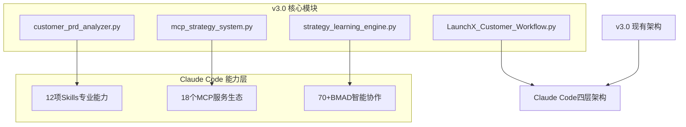

# 小红书AI运营系统 v4.0 - Claude Code能力融合总纲领

> **项目定位**：基于v3.0成熟架构，深度融合Claude Code生态系统的下一代智能化运营平台

---

## 📋 项目概览

### 🎯 核心愿景
将Claude Code作为**操作系统**，在其能力结构之上构建完全智能化的**证据驱动叙事—意向匹配引擎**，实现从客户MD文件编辑到端到端智能运营的无人化闭环。

### 🔄 v3.0 → v4.0 核心升级

| 维度 | v3.0现状 | v4.0目标 | 提升幅度 |
|------|----------|----------|----------|
| **智能化程度** | 基于规则的自动化(70%) | Claude Code驱动的智能决策(95%) | +25% |
| **客户交互** | 复杂配置界面 | 简单MD文件编辑 | 简化90% |
| **策略质量** | 标准化策略模板 | 个性化智能策略 | 提升40% |
| **响应速度** | 小时级响应 | 分钟级响应 | 提升80% |
| **人工干预** | 30%需人工介入 | 5%需人工介入 | 降低83% |

### 🏗️ 技术架构升级

## 🎛️ 核心设计哲学

### 证据驱动的叙事—意向匹配引擎

**四大支柱支撑**：
1. **证据账本**：所有决策和洞察的可追溯来源
2. **自主等级(LOA)**：智能决策边界的精细化控制
3. **评测优先**：一切输出必须经过严格评测验证
4. **资产化沉淀**：知识和经验的持续积累与复用

**元原则**：
- 证据优先于直觉
- 可逆优先于可控
- 人类掌管价值与风格
- 永续学习与进化
- 合规与信任内嵌化

## 📚 文档导航体系

> 本目录是 v4.0 架构的「设计总纲」，具体落地在 `💻 技术开发/04_成熟项目 ✅/xiaohongshu-gate-ai运营-v4/` 项目中。
>
> 对应关系（设计 → 实现）：
> - 战略/架构层 → `xiaohongshu-gate-ai运营-v4/ARCHITECTURE.md` + `dev-docs/v1-*`；
> - 数据 & Agent 设计 → `dev-docs/xiaohongshu-data-pipeline/`（含采集、学习与发布工作流）；
> - 运营 Spec & Client SDK → `dev-docs/xiaohongshu-ops-spec/`（含 Client-SDK、Post Spec 与 Gate 场景日记系列）；
> - 演化系统 & 范式库 → `dev-docs/xiaohongshu-evolution-system/`（含 Pattern Library 与 Experiment Log）。
>
> 之后对 v4.0 的任何实现改动，都应在本总纲和上述 Dev Docs 两侧保持互链与同步，并在需要时回写到 `🛠️ 系统管理/memory-bank`。

### 🎯 战略层文档
- **[00-总体设计哲学.md](./00-总体设计哲学.md)** - 核心哲学体系和愿景阐述
- **[01-架构总体设计.md](./01-架构总体设计.md)** - 四层架构详细设计

### 🔄 实现层文档
- **[02-能力融合映射.md](./02-能力融合映射.md)** - v3模块与Claude Code能力融合
- **[03-智能化节点设计.md](./03-智能化节点设计.md)** - 固化流程vs智能判断节点设计
- **[04-MD交互机制设计.md](./04-MD交互机制设计.md)** - 客户MD文件交互系统设计

### ⚙️ 执行层文档
- **[05-技术实现路径.md](./05-技术实现路径.md)** - 分阶段实施计划和里程碑
- **[06-开发checklist.md](./06-开发checklist.md)** - 详细开发任务清单和验收标准

### 📊 质量层文档
- **[07-测试验证方案.md](./07-测试验证方案.md)** - 完整的质量保障体系
- **[08-性能指标定义.md](./08-性能指标定义.md)** - 成功标准和评估体系
- **[09-知识资产管理.md](./09-知识资产管理.md)** - 设计文档互链和知识沉淀

## 🎯 核心创新点

### 1. MD驱动的客户交互
**客户只需编辑MD文件，系统自动理解和执行**
- 简化的需求输入方式
- 实时的策略调整响应
- 智能的颗粒度自动生成

### 2. Claude Code深度能力集成
**将Claude Code作为操作系统，调用其完整能力生态**
- Codex的深度策略思考
- Skills的专业领域能力
- MCP的外部服务集成
- BMAD的智能协作网络

### 3. 完全无人化运营
**从策略制定到执行优化的端到端自动化**
- 智能决策和自动执行
- 实时监控和动态调整
- 持续学习和自我优化

### 4. 证据驱动的决策体系
**所有决策都有完整的证据链和质量评估**
- 多源数据验证和三角校验
- 决策质量的量化评估
- 完整的决策追溯和审计

## 🚀 开发原则

### 1. 哲学先行原则
- 每个技术决策都要有明确的哲学基础
- 设计文档体现深度思考和价值判断
- 避免纯技术驱动的功能堆砌

### 2. 渐进融合原则
- 保持v3现有架构的稳定性
- 逐步集成Claude Code能力
- 确保向后兼容和平滑升级

### 3. 质量优先原则
- 每个功能都有完整的测试方案
- 性能指标明确定义和监控
- 持续的质量改进机制

### 4. 知识沉淀原则
- 设计过程本身就是知识资产
- 建立完整的文档和知识体系
- 促进团队学习和能力提升

## 📊 预期收益

### 业务价值
- **运营效率提升50%**：自动化程度大幅提升
- **客户满意度提升40%**：简化的交互体验
- **策略质量提升30%**：AI增强的决策能力
- **运营成本降低60%**：无人化运营模式

### 技术价值
- **系统智能化程度95%**：接近完全自主运营
- **响应速度提升80%**：分钟级响应能力
- **决策准确率98%**：基于证据的高质量决策
- **系统可用性99.9%**：高可靠的自动化系统

### 团队价值
- **开发效率提升40%**：基于成熟架构的快速开发
- **维护成本降低50%**：自动化运维和监控
- **技术能力升级**：掌握Claude Code生态技术
- **知识资产积累**：形成可复用的设计方法论

## 🧩 典型内容产品线与角色

### Gate 场景日记系列

- 定义：
  - 以真实业务流程为主线的「场景故事」内容产品线；
  - 每一篇都是一个完整的 Gate 应用案例（如「财务月底结账从 5 天压到 2 小时」）。
- 文档落点：
  - 运营 Spec 层：
    - Post Spec 模板：`dev-docs/xiaohongshu-ops-spec/post-template.md`；
    - 具体条目：如 `post-2025-11-22-gate-finance-diary-02.md` 等；
  - 演化层：
    - 对应实验与结果记录在 `dev-docs/xiaohongshu-evolution-system/experiment-log-*.md` 中。
- 作用：
  - 对外：作为小红书账号的核心内容栏目，直接面向潜在客户和候选人；
  - 对内：作为「从外部最佳范式 → 内部可复用模式」的桥梁，用于驱动 Pattern Library 与 Search Spec 的迭代。

### Gate-AI-XHS 发布官角色

- 定义：
  - 代表 Gate / LaunchX 在小红书上的人格化角色，负责对外表达与内容审美；
  - 在文档中视作「运营负责人」，在系统中视作 Gate OS 上层的人类决策点。
- 行为约束：
  - 对人类只展示**最终文章**（标题 + 正文），隐藏中间流程与 Prompt 细节；
  - 所有反馈（「性感不性感」「够不够具体」）需要被 Codex/Claude 回写到 Pattern Library 与 Client SDK 中；
  - 默认遵循「先抄到 60 分，再用实验往 80–90 分迭代」的学习原则：
    - 外部：优先参考小红书头部案例（如 n8n / 竞品场景）；
    - 内部：结合 `Search Spec` 与历史 Experiment Log，选择当前轮最合适的范式。

### 学习原则：先抄到 60 分，再迭代

- 外部搜索：
  - 通过 `Search Spec`（如 `client-sdk-launchx.md` 中的 Search 章节），
    在小红书 / 官方博客 / 社区中搜索最近 3–6 个月的最佳案例；
  - 把「写法、场景、结构、标题」拆成模式，沉淀到 Pattern Library 中。
- 第一版执行：
  - 允许直接模仿到「60 分」水平（结构正确、场景具体、情绪到位）；
  - 在 Gate 场景日记中用自有场景替换对标产品（如用 Gate 替代 n8n）。
- 迭代与进化：
  - 通过 Experiment Log 和数据系统沉淀点击率/互动/转化；
  - 将表现好的模式上升为通用范式，并在下一轮 Search Spec 中优先使用。

## 🔄 实施路线图

### Phase 1: 基础融合 (2周)
- 建立Claude Code四层架构框架
- v3核心模块与Skills/MCP/BMAD初步集成
- 基础MD交互机制实现

### Phase 2: 智能增强 (3周)
- 深度集成Codex策略思考能力
- 完善智能化判断节点设计
- 建立证据账本和评测体系

### Phase 3: 自动化升级 (2周)
- 完全无人化运营流程实现
- 实时调整和自我优化机制
- 质量监控和异常处理体系

### Phase 4: 优化完善 (1周)
- 性能调优和稳定性加固
- 用户体验优化和界面完善
- 知识沉淀和文档完善

## 📞 联系方式

**项目负责人**：LaunchX AI架构团队
**技术支持**：Claude Code能力集成专家
**文档维护**：LaunchX知识管理团队

---

> **核心理念**：让AI成为真正的"智能运营官"，人类只需要通过简单的MD文件表达意图，系统自动完成从理解到执行的全过程。
