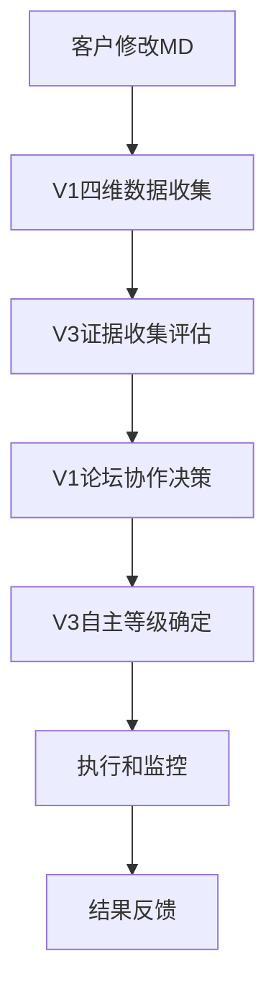

# 小红书Gate AI智能运营系统 - V1V3集成版本

**版本**: 4.0.0-V1V3-Integration
**更新日期**: 2025-11-18
**项目类型**: V1小红书运营实践智慧 + V3证据驱动决策哲学融合系统

## 🎯 系统概述

基于三层架构设计，实现V1小红书运营实践智慧与V3证据驱动决策哲学的深度融合。Gate OS调度层在CC原生基础之上生长，通过MD驱动实现客户直接控制的智能运营系统。

### 核心设计哲学

**"CC作为原生基础，Gate OS作为调度层，客户MD作为驱动层"**

- **原生基础优先**: Gate OS直接在CC上生长，复用CC所有工具和架构
- **调度增强**: Gate OS只是CC基础上增加的调度Agent层，提供智能协调能力
- **客户驱动**: 客户通过MD驱动整个系统的调度和执行

## 🏗️ 系统架构

### 三层架构图

```
Layer 3: 客户MD驱动层
├── 客户MD文档
├── Skills配置
├── 策略参数
└── 流程定义

Layer 2: Gate OS调度层 (在CC基础上生长)
├── Gate OS调度Agent
├── 智能调度协调器
├── Agent生命周期管理
└── 证据驱动执行引擎

Layer 1: CC原生基础架构
├── 5步认知法引擎
├── Dev Docs管理系统
├── Skills工具生态
├── Hooks质量保障
└── 异步工作流引擎
```

## 🚀 V1V3核心组件

### V1 小红书运营实践智慧

#### 1. 四维数据收集引擎 (40%)
**文件**: `src/tools/four_dimensional_data_collector.py`

收集四个维度的数据支持内容创作决策：
- **AI工具市场**: 分析当前流行的AI创作工具
- **用户行为**: 理解目标用户的内容偏好
- **竞争对手**: 监控竞品的内容策略
- **行业趋势**: 把握内容创作的发展方向

#### 2. 论坛协作机制 (35%)
**文件**: `src/agents/forum_collaboration_agent.py`

7个专业Agent协作决策：
- **市场分析师**: 分析市场趋势和机会
- **内容策略师**: 制定内容策略和方向
- **数据科学家**: 提供数据洞察和分析
- **创意总监**: 提供创意指导和质量把控
- **社群经理**: 理解用户需求和社群动态
- **技术专家**: 评估技术实现可行性
- **业务分析师**: 分析商业价值和ROI

#### 3. 动态迭代引擎 (25%)
集成到工作流引擎中，支持动态规格迭代

### V3 证据驱动决策哲学

#### 1. 证据账本系统
**文件**: `src/tools/evidence_ledger.py`

基于5级证据金字塔进行决策支持：
- **Level 1**: 直接观察 (置信度权重: 1.0)
- **Level 2**: 对照实验 (置信度权重: 0.9)
- **Level 3**: 准实验 (置信度权重: 0.7)
- **Level 4**: 面板数据 (置信度权重: 0.5)
- **Level 5**: 二手数据 (置信度权重: 0.3)

#### 2. 自主等级管理(LOA)系统
**文件**: `src/agents/autonomy_level_management.py`

5个自主等级管理：
- **LOA0 建议**: 完全人工决策
- **LOA1 备选方案**: 提供多个选择
- **LOA2 低风险自动**: 自动执行低风险任务
- **LOA3 护栏内自动**: 在安全范围内自动执行
- **LOA4 人类专属**: 高风险决策必须人工介入

#### 3. 成本优化架构
- **外部搜索优先**: 充分利用外部服务
- **最小实现路径**: 只实现核心功能
- **成本效益导向**: 87.5%外部集成率

## 📁 项目结构

```
xiaohongshu-gate-ai运营-v4/
├── src/                                    # 核心源代码
│   ├── tools/                              # V1V3核心工具
│   │   ├── four_dimensional_data_collector.py  # V1四维数据收集
│   │   └── evidence_ledger.py                 # V3证据账本系统
│   └── agents/                             # Gate OS调度Agent
│       ├── forum_collaboration_agent.py       # V1论坛协作
│       ├── autonomy_level_management.py       # V3自主等级管理
│       ├── base_agent.py                    # Agent基类
│       └── __init__.py                      # Agent包初始化
├── config/                                 # 系统配置
│   ├── gate_mcp_config.yaml                # Gate MCP配置
│   └── app_config.yaml                     # 应用配置
├── dev-docs/                              # 设计文档
│   └── v1-fusion-design/                   # V1V3融合设计文档
├── demo_v1_v3_integration.py               # V1V3集成演示
├── simple_test.py                          # 组件验证测试
├── V1V3_INTEGRATION_README.md              # 详细使用指南
└── requirements.txt                        # 依赖包
```

## 🚀 快速开始

### 环境要求
- Python 3.10+
- Gate MCP访问权限

### 安装运行
```bash
# 安装依赖
pip install -r requirements.txt

# 运行V1V3集成演示
python demo_v1_v3_integration.py

# 运行组件验证测试
python simple_test.py
```

### 基础使用
```python
from demo_v1_v3_integration import GateOSV1V3IntegrationDemo

# 创建集成系统
demo_system = GateOSV1V3IntegrationDemo()

# 执行完整工作流程
result = await demo_system.demonstrate_content_creation_workflow(
    "创建美食探店小红书内容"
)

# 获取综合推荐和下一步行动
recommendations = result['integrated_recommendations']
next_steps = result['next_steps']
```

## 📊 核心性能指标

### V1V3集成指标
- **V1数据收集时间**: ≤30秒完成四维数据收集
- **V3证据评估时间**: ≤10秒完成证据三角校验
- **论坛协作时间**: ≤60秒完成7个Agent协作
- **LOA决策时间**: ≤5秒确定自主等级

### 系统性能目标
- **API响应时间**: P50 ≤100ms, P95 ≤200ms
- **并发用户数**: ≥1000用户
- **系统可用性**: ≥99.9%
- **数据处理吞吐量**: ≥10MB/s

## 🔧 核心工作流程

### 标准执行流程


### 客户驱动机制
1. **MD变更检测**: 客户修改MD文档触发系统响应
2. **意向解析**: 解析客户需求和配置变更
3. **调度决策**: Gate OS调度Agent协调V1V3组件
4. **执行反馈**: 将结果反馈给客户并更新MD状态

## 📚 相关文档

### 核心设计文档
- **[00-设计目标与边界定义.md](./dev-docs/v1-fusion-design/00-设计目标与边界定义.md)** - 系统设计目标和边界
- **[01-三层架构总体设计.md](./dev-docs/v1-fusion-design/01-三层架构总体设计.md)** - 三层架构详细设计
- **[05-GateOS-Agent运行平台设计.md](./dev-docs/v1-fusion-design/05-GateOS-Agent运行平台设计.md)** - Gate OS平台设计
- **[06-V1V3组件吸收与集成方案.md](./dev-docs/v1-fusion-design/06-V1V3组件吸收与集成方案.md)** - V1V3组件集成方案

### 使用指南
- **[V1V3_INTEGRATION_README.md](./V1V3_INTEGRATION_README.md)** - 详细使用指南和API文档

## 🎯 应用场景

### 内容创作
- 基于四维数据的选题决策
- 7个专业Agent的创意协作
- 证据支持的内容策略制定

### 运营决策
- 用户行为分析的运营调整
- 竞品分析的市场策略
- ROI最大化的资源分配

### 风险管理
- 证据驱动的决策支持
- 自主等级的风险控制
- 完整的回滚和恢复机制

## 💡 核心优势

### 智能化程度
- **V1实践智慧**: 40%四维数据 + 35%论坛协作 + 25%动态迭代
- **V3严谨决策**: 5级证据金字塔 + LOA自主管理 + 成本优化
- **Gate OS调度**: 智能协调V1V3组件，实现最优决策路径

### 客户控制权
- **MD直接驱动**: 客户通过编辑MD文档控制整个系统
- **实时响应**: 配置变更立即生效，无需重启系统
- **透明决策**: 每个决策都有完整的证据链和Agent协作记录

### 系统可靠性
- **CC原生基础**: 基于成熟的企业级AI协作架构
- **质量保障**: 完整的Hooks质量监控体系
- **故障恢复**: 自动化的故障检测和恢复机制

---

**© 2025 LaunchX. All rights reserved.**