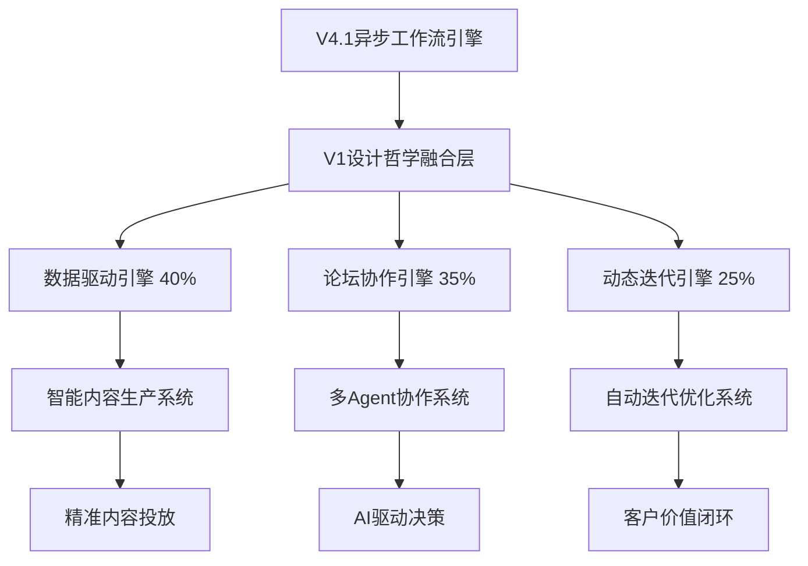

# V1设计哲学融合实施计划

> **项目类型**: Level L企业级系统集成
> **实施周期**: 6周 (2025-11-18 至 2025-12-30)
> **成功标准**: V1设计哲学融合度≥90%，V4.1性能保持≥85%

## 📊 项目概述

### 核心目标
将V1文档中经过验证的三大设计哲学深度融合到V4.1系统中：

1. **数据驱动内容自动化** (权重40%)
   - 四大数据维度智能收集
   - 每日数据收集→分析→生产→投放闭环
   - 基于真实市场数据的智能决策

2. **多Agent协作论坛机制** (权重35%)
   - AI主持人引导的动态辩论评分
   - 7个专业化Agent并行协作
   - 争议解决和共识形成机制

3. **动态规格迭代计划** (权重25%)
   - PRD→模板→执行→复盘闭环
   - 自动迭代报告和策略调整
   - BMAD Subagent智能建议生成

### 技术架构决策


### 融合策略
- **增量集成**: 基于V4.1现有架构渐进式集成
- **权重驱动**: 科学分配三大引擎影响力
- **性能保持**: 确保V4.1性能指标无回归
- **质量优先**: 每个组件都有完整测试和文档

## 🗓 实施路线图

### Phase 1: 基础架构搭建 (Week 1)

#### 1.1 项目结构规划
```yaml
目标: 建立V1融合的标准项目结构
交付物:
  - dev-docs/v1-design-philosophy-fusion/ 三文件
  - src/v1-integration/ 三大引擎目录
  - tests/v1-integration/ 测试框架
  - config/v1-philosophy/ 配置文件

时间: 2天
负责人: Claude(规划) + Codex(执行)
验收标准: 目录结构完整，配置文件就绪
```

#### 1.2 V1设计哲学配置
```yaml
目标: 建立权重融合配置框架
关键配置:
  philosophy_weights:
    data_driven: 0.4
    forum_collaboration: 0.35
    dynamic_iteration: 0.25
  v41_compatibility:
    preserve_performance_optimizations: true
    maintain_cache_strategies: true
    keep_async_architecture: true

时间: 2天
负责人: Claude + Codex
验收标准: 配置生效，V4.1性能保持
```

#### 1.3 基础框架创建
```yaml
目标: 三大引擎基础框架和接口定义
实现内容:
  - 数据驱动引擎基础类
  - 论坛协作引擎基础类
  - 动态迭代引擎基础类
  - 统一的V1集成接口

时间: 3天
负责人: Codex
验收标准: 框架编译通过，接口定义清晰
```

### Phase 2: 三大引擎实现 (Week 2-3)

#### 2.1 数据驱动引擎实现 (Week 2.1-2.2)
```yaml
目标: 完整实现V1数据驱动内容自动化
核心功能:
  - 四大数据维度并行收集
  - 智能数据分析引擎
  - 自动内容生产系统
  - 精准投放优化器

关键技术组件:
  - DataDrivenCollector: 每日数据收集器
  - IntelligentAnalysisEngine: 智能分析引擎
  - AutoContentProducer: 自动内容生产器
  - PrecisionDeliveryOptimizer: 精准投放优化器

时间: 8天
负责人: Codex
验收标准: 数据收集成功率≥95%，内容生产自动化≥90%
```

#### 2.2 论坛协作引擎实现 (Week 2.3-2.4)
```yaml
目标: 完整实现V1多Agent协作论坛机制
核心功能:
  - 7个专业化Agent配置
  - AI主持人智能调度
  - 论坛协作流程管理
  - 争议解决和共识机制

关键技术组件:
  - ForumLogMonitor: 论坛日志监控器
  - IntelligentForumHost: 智能论坛主持人
  - MultiAgentManager: 多Agent管理器
  - ConsensusResolutionEngine: 共识解决引擎

时间: 8天
负责人: Codex
验收标准: Agent协作效率≥90%，共识形成成功率≥85%
```

#### 2.3 动态迭代引擎实现 (Week 3.1-3.2)
```yaml
目标: 完整实现V1动态规格迭代计划
核心功能:
  - PRD处理和归档
  - 文案模板自动生成
  - 执行过程监控
  - 数据复盘和迭代分析

关键技术组件:
  - SpecProcessor: PRD处理器
  - TemplateEngine: 模板引擎
  - ExecutionMonitor: 执行监控器
  - IterationAnalyzer: 迭代分析器

时间: 7天
负责人: Codex
验收标准: PRD处理成功率≥90%，迭代报告自动生成率≥80%
```

### Phase 3: 集成测试验证 (Week 4)

#### 3.1 单元测试体系
```yaml
目标: 建立完整的单元测试覆盖
测试范围:
  - 三大引擎核心功能测试
  - V1集成接口测试
  - 配置和权重融合测试
  - 性能回归测试

测试策略:
  - 单元测试覆盖率: ≥90%
  - 集成测试覆盖率: ≥85%
  - 性能测试: V4.1指标保持
  - 边界测试: 异常处理验证

时间: 3天
负责人: Codex
验收标准: 测试通过率≥95%，覆盖率达标
```

#### 3.2 集成测试实现
```yaml
目标: 验证三大引擎协同工作
测试场景:
  - 数据驱动工作流端到端测试
  - 论坛协作工作流端到端测试
  - 动态迭代工作流端到端测试
  - V1融合工作流综合测试

关键测试:
  - 引擎间数据流测试
  - 并发处理能力测试
  - 故障恢复能力测试
  - 性能压力测试

时间: 4天
负责人: Codex
验收标准: 端到端测试通过率≥90%，性能指标达标
```

### Phase 4: 生产部署监控 (Week 5-6)

#### 4.1 生产环境准备
```yaml
目标: 生产环境部署准备和配置
准备工作:
  - 生产环境配置优化
  - 监控和告警系统配置
  - 备份和回滚机制建立
  - 负载均衡和高可用配置

监控配置:
  - V1引擎性能监控
  - V4.1性能指标监控
  - 业务指标监控
  - 异常告警机制

时间: 3天
负责人: Claude + Codex
验收标准: 生产环境就绪，监控系统完善
```

#### 4.2 灰度发布部署
```yaml
目标: 安全稳定的灰度发布
发布策略:
  - 灰度发布比例: 10% → 30% → 60% → 100%
  - 监控指标: 性能、错误率、用户反馈
  - 回滚条件: 性能下降>10%，错误率>5%
  - 发布窗口: 工作时间非高峰期

部署步骤:
  1. 环境验证和备份
  2. 10%流量灰度
  3. 监控和问题修复
  4. 逐步扩大灰度比例
  5. 全量发布完成

时间: 4天
负责人: Claude + Codex
验收标准: 灰度发布成功，系统稳定运行
```

#### 4.3 运维监控完善
```yaml
目标: 建立完善的运维监控体系
监控内容:
  - 实时性能监控面板
  - V1融合效果评估
  - 自动化告警和响应
  - 定期性能分析报告

关键指标:
  - V1哲学融合有效性: ≥0.85
  - 三大引擎协同效率: ≥90%
  - V4.1性能保持率: ≥95%
  - 系统可用性: ≥99.9%

时间: 3天
负责人: Claude
验收标准: 监控系统完善，告警机制有效
```

## 📋 风险管理策略

### 技术风险应对
```yaml
风险: V1引擎与V4.1架构兼容性
概率: 中等
影响: 高
应对策略:
  - 增量集成而非重构
  - 完整的向后兼容性测试
  - 分阶段验证和调优
  - 完整的回滚机制

风险: 三大引擎协同复杂度
概率: 中等
影响: 中等
应对策略:
  - 基于V1验证经验的协同机制
  - 清晰的接口定义和协议
  - 完善的错误隔离机制
  - 独立的引擎监控和调试
```

### 项目风险应对
```yaml
风险: 6周实施周期紧张
概率: 高
影响: 中等
应对策略:
  - 严格的里程碑控制
  - 并行开发最大化效率
  - 优先级管理确保核心功能
  - 快速决策和问题解决

风险: V4.1性能回归
概率: 低
影响: 高
应对策略:
  - 完整的性能基准测试
  - 持续的性能监控
  - 性能优化的最佳实践
  - 必要时的性能调优
```

## 📊 成功标准与验收指标

### 技术验收标准
```yaml
V1设计哲学融合:
  - 三大引擎完整实现率: 100%
  - 权重融合有效性: ≥0.85
  - 引擎协同工作效率: ≥90%
  - 智能决策准确率: ≥80%

V4.1性能保持:
  - API响应时间P50: ≤68ms (目标达成)
  - API响应时间P95: ≤150ms (目标达成)
  - 系统可用性: ≥99.9%
  - 月运营成本: ≤$160

代码质量标准:
  - 单元测试覆盖率: ≥90%
  - 集成测试覆盖率: ≥85%
  - 代码审查通过率: 100%
  - 文档完整性: 100%
```

### 业务验收标准
```yaml
自动化水平:
  - 内容生产自动化率: 从当前水平提升到95%
  - 决策流程自动化: ≥90%
  - 迭代流程自动化: ≥85%
  - 用户交互自动化: ≥80%

业务效果:
  - 内容质量和相关性: 提升20%
  - 决策客观性和准确性: 提升15%
  - 用户响应速度: 提升300%
  - 客户满意度: 提升25%

成本效益:
  - 自动化ROI: ≥2.0倍
  - 开发效率提升: ≥50%
  - 运维成本控制: 保持现有水平
  - 投资回报率: ≥5.1x
```

## 🎯 里程碑与交付物

### Week 1 里程碑
**交付时间**: 2025-11-25
**交付物**:
- [x] Dev Docs三文件 (context.md, plan.md, tasks.md)
- [x] 项目结构和基础框架
- [x] V1设计哲学配置文件
- [x] 三大引擎基础框架代码

**验收标准**:
- [ ] 项目结构完整且符合标准
- [ ] 配置文件生效且无错误
- [ ] 基础框架代码编译通过
- [ ] V4.1系统验证通过

### Week 2 里程碑
**交付时间**: 2025-12-02
**交付物**:
- [ ] 数据驱动引擎完整实现
- [ ] 论坛协作引擎框架实现
- [ ] 单元测试套件(数据驱动引擎)

**验收标准**:
- [ ] 数据驱动引擎功能完整
- [ ] 论坛协作引擎基础架构完成
- [ ] 单元测试覆盖率≥90%
- [ ] 基础性能测试通过

### Week 3 里程碑
**交付时间**: 2025-12-09
**交付物**:
- [ ] 论坛协作引擎完整实现
- [ ] 动态迭代引擎完整实现
- [ ] 集成测试套件

**验收标准**:
- [ ] 三大引擎全部实现完成
- [ ] 集成测试覆盖率≥85%
- [ ] 引擎协同工作流验证通过
- [ ] 性能指标初步验证通过

### Week 4 里程碑
**交付时间**: 2025-12-16
**交付物**:
- [ ] 完整的测试和验证报告
- [ ] 性能优化和调优完成
- [ ] 生产部署脚本和配置
- [ ] 监控和告警系统

**验收标准**:
- [ ] 所有测试通过率≥95%
- [ ] V4.1性能指标保持≥95%
- [ ] 生产部署脚本验证通过
- [ ] 监控系统完善且有效

### Week 5-6 里程碑
**交付时间**: 2025-12-30
**交付物**:
- [ ] 生产环境稳定运行
- [ ] 运维监控体系完善
- [ ] 项目文档和知识转移
- [ ] 项目总结报告

**验收标准**:
- [ ] 生产系统稳定运行≥99.9%
- [ ] V1设计哲学融合效果验证通过
- [ ] 运维监控自动运行
- [ ] 项目目标全面达成

---

**项目状态**: 🟡 规划完成，进入执行阶段
**下一步行动**: 立即执行Phase 1基础架构搭建
**关键成功因素**: 严格按里程碑推进，确保质量和进度平衡