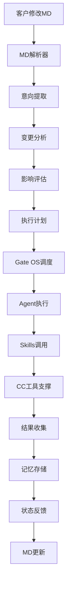

# 设计目标与边界定义

> **核心理念**：Agent SDK Skills在Gate OS运行，客户MD驱动，CC提供底层支撑的智能协作系统

---

## 🎯 系统设计目标

### 核心使命
**构建客户MD驱动的智能AI运营系统，所有Agent SDK Skills在Gate OS中运行**

### 设计目标优先级

#### P0: 核心目标 (必须实现)
1. **客户MD驱动机制**
   - 客户修改MD文档直接控制系统行为
   - MD变更实时生效，无需重启
   - 支持Skills配置、策略参数、流程定义的修改

2. **Gate OS运行平台**
   - 所有Agent SDK Skills在Gate OS中运行
   - Gate OS提供Agent生命周期管理
   - 统一的Agent调度和资源分配

3. **CC底层工具支撑**
   - CC作为最底层的工具和架构基础
   - 为Gate OS提供稳定的工具调用接口
   - 保持CC现有工具的完整性和性能

#### P1: 重要目标 (高优先级)
4. **Agent生态系统**
   - 完整的Agent开发、部署、管理框架
   - 标准化的Agent SDK接口
   - Agent间协作和通信机制

5. **Skills能力网络**
   - 专业化Skills的能力注册和发现
   - Skills的动态加载和卸载
   - Skills性能监控和质量评估

6. **证据驱动决策**
   - 基于V3证据驱动哲学的决策机制
   - 每个决策都有完整的证据链
   - 支持决策的可追溯和可解释

#### P2: 优化目标 (中等优先级)
7. **智能运维管理**
   - 自动化的监控、告警、故障恢复
   - 性能优化和资源调度
   - 运维知识库和经验积累

8. **客户价值闭环**
   - 从客户需求到价值交付的完整闭环
   - 商业价值叙事卡生成
   - ROI分析和持续优化

---

## 🏗️ 系统边界定义

### 边界清晰化原则

#### Gate OS边界 (核心运行平台)
```yaml
Gate_OS_职责:
  "Agent运行环境":
    - Agent生命周期管理 (启动、停止、重启)
    - Agent资源分配和调度
    - Agent间通信和协作

  "SDK管理":
    - Agent SDK的版本管理
    - SDK接口标准化和兼容性
    - SDK调用监控和优化

  "Skills运行平台":
    - Skills的注册、发现、调用
    - Skills性能监控和质量评估
    - Skills的动态更新和配置

  "客户MD处理":
    - MD文档解析和意向提取
    - 客户配置变更的实时响应
    - MD变更影响的智能分析

Gate_OS_边界:
  包含:
    - Agent运行时环境
    - Agent SDK管理
    - Skills执行引擎
    - 客户MD处理器
    - 智能调度系统

  不包含:
    - 底层工具的具体实现
    - 客户业务逻辑的具体规则
    - 外部系统的直接集成
```

#### CC边界 (底层工具基础)
```yaml
CC_职责:
  "底层工具提供":
    - 5步认知法引擎
    - Dev Docs管理系统
    - Hooks质量保障
    - 异步工作流引擎

  "基础能力支撑":
    - 文件系统操作
    - 网络通信能力
    - 数据存储和缓存
    - 性能监控和日志

  "标准化接口":
    - 统一的工具调用API
    - 标准化的数据格式
    - 一致的错误处理机制

CC_边界:
  包含:
    - 企业级AI协作工具集
    - 混合协作架构框架
    - 性能优化和监控体系
    - 质量保障和Hook系统

  不包含:
    - 具体的业务逻辑实现
    - Agent的运行时管理
    - 客户配置的实时处理
```

#### 客户边界 (驱动层)
```yaml
客户_职责:
  "MD文档编写":
    - 业务需求定义
    - Skills配置指定
    - 策略参数设置
    - 流程自定义定义

  "系统行为控制":
    - 通过MD修改控制Agent行为
    - 动态调整Skills配置
    - 实时更新策略参数

客户_边界:
  包含:
    - MD文档编辑权限
    - 系统配置控制权
    - 业务规则定义权

  不包含:
    - 系统内部的具体实现
    - Agent的代码级修改
    - 底层工具的直接调用
```

---

## 📋 详细板块定义

### 1. Agent运行平台
```yaml
板块定义:
  核心功能: "Agent生命周期管理和运行环境"
  技术实现: "容器化Agent运行时 + 资源调度器"
  关键指标: "Agent启动时间≤10s, 并发Agent数≥1000"

  包含组件:
    - Agent容器管理器
    - 资源调度和分配器
    - Agent健康监控器
    - Agent通信总线

  边界说明:
    - 只负责Agent运行，不包含Agent具体业务逻辑
    - 提供标准运行环境，不涉及底层系统调用
    - 管理Agent生命周期，不干涉Agent内部决策
```

### 2. SDK管理系统
```yaml
板块定义:
  核心功能: "Agent SDK的统一管理和接口标准化"
  技术实现: "SDK注册中心 + 版本管理 + 接口代理"
  关键指标: "SDK加载时间≤5s, 接口调用成功率≥99.9%"

  包含组件:
    - SDK注册和发现服务
    - 版本管理和兼容性检查
    - 接口标准化代理
    - SDK调用监控和分析

  边界说明:
    - 只管理SDK接口，不实现SDK具体功能
    - 提供标准调用方式，不涉及具体业务逻辑
    - 监控SDK使用情况，不修改SDK行为
```

### 3. Skills执行引擎
```yaml
板块定义:
  核心功能: "Skills的动态执行和性能管理"
  技术实现: "Skills注册中心 + 动态执行引擎 + 性能监控"
  关键指标: "Skills调用P50≤100ms, Skills加载时间≤3s"

  包含组件:
    - Skills注册和发现
    - 动态执行引擎
    - Skills性能监控
    - Skills配置管理

  边界说明:
    - 只负责Skills执行调度，不实现Skills具体功能
    - 管理Skills配置参数，不修改Skills内部逻辑
    - 监控Skills性能指标，不干涉Skills执行过程
```

### 4. 客户MD处理器
```yaml
板块定义:
  核心功能: "客户MD文档的解析和执行指令生成"
  技术实现: "MD解析器 + 意向提取器 + 指令生成器"
  关键指标: "MD解析时间≤2s, 变更响应时间≤10s"

  包含组件:
    - MD文档解析器
    - 客户意向提取器
    - 系统变更分析器
    - 执行指令生成器

  边界说明:
    - 只解析MD内容，不验证业务逻辑正确性
    - 生成执行指令，不执行具体业务操作
    - 分析变更影响，不负责变更实施
```

### 5. 记忆管理系统
```yaml
板块定义:
  核心功能: "系统记忆的存储、检索和管理"
  技术实现: "分层记忆存储 + 智能检索 + 记忆生命周期管理"
  关键指标: "记忆检索P50≤50ms, 存储容量≥1TB"

  包含组件:
    - 分层存储管理器
    - 智能检索引擎
    - 记忆生命周期管理
    - 记忆质量评估

  边界说明:
    - 只负责记忆存储和检索，不生成记忆内容
    - 管理记忆生命周期，不修改记忆具体内容
    - 提供检索能力，不参与记忆内容决策
```

---

## 🔄 执行流程定义

### 标准执行流程


### 关键执行节点
```yaml
执行节点:
  MD变更检测:
    触发条件: "客户MD文档修改"
    处理时间: "≤5秒"
    输出: "变更内容和影响范围"

  意向解析:
    处理逻辑: "提取客户意图和配置变更"
    处理时间: "≤3秒"
    输出: "结构化意向包"

  调度决策:
    决策依据: "意向包 + 当前系统状态"
    处理时间: "≤2秒"
    输出: "执行计划和资源分配"

  执行监控:
    监控范围: "Agent状态、Skills执行、系统性能"
    监控频率: "实时监控"
    输出: "执行状态和性能指标"
```

---

## 💾 记忆系统设计

### 记忆分层架构
```yaml
记忆分层:
  短期记忆:
    存储内容: "当前会话状态、临时数据、执行结果"
    存储时长: "会话期间 + 24小时"
    访问频率: "高频率实时访问"
    技术实现: "内存缓存 + Redis"

  中期记忆:
    存储内容: "Agent配置、Skills参数、客户偏好"
    存储时长: "1个月 - 6个月"
    访问频率: "中等频率定期访问"
    技术实现: "数据库 + 索引优化"

  长期记忆:
    存储内容: "系统经验、最佳实践、历史模式"
    存储时长: "永久存储"
    访问频率: "低频率分析访问"
    技术实现: "数据仓库 + 向量化存储"
```

### 记忆管理策略
```yaml
管理策略:
  记忆创建:
    触发条件: "关键决策、重要结果、异常情况"
    创建标准: "结构化格式 + 元数据标签"
    质量要求: "准确性≥95%, 完整性≥90%"

  记忆检索:
    检索策略: "语义检索 + 关键词匹配 + 上下文相关"
    检索优化: "缓存热门查询 + 预加载相关记忆"
    响应要求: "P50≤50ms, P95≤200ms"

  记忆更新:
    更新策略: "增量更新 + 版本控制"
    一致性: "分布式一致性保证"
    更新频率: "实时更新 + 定期同步"
```

---

## 🎯 质量保障体系

### 边界检查机制
```yaml
边界检查:
  层级边界检查:
    检查频率: "每次层间调用"
    检查内容: "调用合法性、参数合规性、权限验证"
    处理策略: "非法调用拒绝 + 告警记录"

  功能边界检查:
    检查频率: "每个功能模块执行前"
    检查内容: "功能职责范围、输入输出格式"
    处理策略: "越界操作拦截 + 错误返回"

  性能边界检查:
    检查频率: "实时监控"
    检查内容: "响应时间、资源使用、并发限制"
    处理策略: "超时熔断 + 资源保护"
```

### 质量指标定义
```yaml
质量指标:
  功能性指标:
    - MD解析准确率: ≥98%
    - Agent启动成功率: ≥99.9%
    - Skills调用成功率: ≥99.5%
    - 系统响应完整性: ≥95%

  性能指标:
    - MD变更响应时间: ≤10秒
    - Agent启动时间: ≤10秒
    - Skills调用P50: ≤100ms
    - 系统并发处理能力: ≥1000个请求

  可靠性指标:
    - 系统可用性: ≥99.9%
    - 故障恢复时间: ≤30秒
    - 数据一致性: ≥99.99%
    - 记忆检索成功率: ≥99.5%
```

---

## 📚 实施优先级和计划

### 实施优先级矩阵
```yaml
优先级矩阵:
  P0 - 必须实现 (Week 1-2):
    - Gate OS核心框架
    - Agent运行平台基础
    - MD解析和执行引擎
    - CC接口标准化

  P1 - 重要实现 (Week 3-4):
    - SDK管理系统
    - Skills执行引擎
    - 记忆管理系统
    - 质量保障体系

  P2 - 优化实现 (Week 5-6):
    - 性能优化
    - 监控告警完善
    - 客户体验优化
    - 系统稳定性增强
```

### 关键里程碑
```yaml
里程碑:
  Week 1:
    - 完成架构边界定义
    - Gate OS核心框架搭建
    - CC接口标准化完成

  Week 2:
    - Agent运行平台基础完成
    - MD解析器实现
    - 基础执行流程验证

  Week 3:
    - SDK管理系统完成
    - Skills执行引擎实现
    - 记忆系统基础架构

  Week 4:
    - 质量保障体系完成
    - 系统集成测试
    - 性能基准测试

  Week 5-6:
    - 系统优化和完善
    - 客户体验优化
    - 生产环境部署准备
```

---

## 📚 相关文档索引

- **[00-总体设计哲学.md](./00-总体设计哲学.md)** - 核心设计哲学和愿景
- **[01-三层架构总体设计.md](./01-三层架构总体设计.md)** - 三层架构详细设计
- **[02-V1哲学融合映射.md](./02-V1哲学融合映射.md)** - V1哲学到架构的映射关系

> **核心理念**：明确的设计目标和边界定义，确保Agent SDK Skills在Gate OS中高效运行，客户通过MD实现智能驱动。