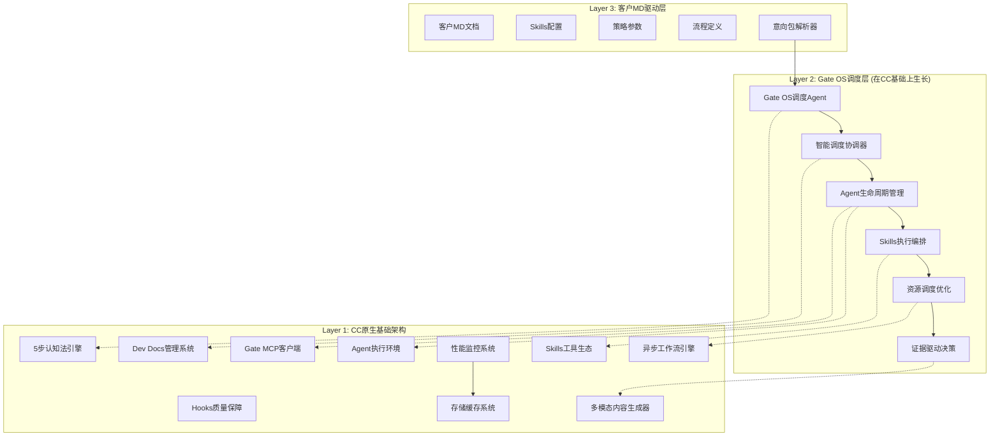
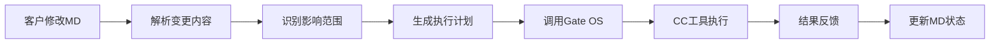

# 三层架构总体设计

> **架构定位**：基于CC底层工具构建的三层智能协作系统，实现客户MD驱动的全链条AI运营

---

## 🏗️ 架构总览

### 设计哲学
**"CC作为原生基础，Gate OS作为调度层，客户MD作为驱动层"**

- **原生基础**：Gate OS直接在CC上生长，复用CC所有工具和架构
- **调度增强**：Gate OS只是CC基础上增加的调度Agent层，提供智能协调能力
- **客户驱动**：客户通过MD驱动整个系统的调度和执行

### 三层架构图



**图例说明**:
- `-->` : 实线表示直接数据流和控制流
- `-.->` : 虚线表示Gate OS调度Agent调用CC原生工具

---

## Layer 1: CC原生基础架构 (最底层)

### 核心定位
**CC原生基础架构，提供完整工具和能力的原生系统**

### 关键组件

#### 1. 5步认知法引擎 (5-Step Cognitive Engine)
```python
class CognitiveEngine:
    """CC 5步认知法核心引擎"""

    async def execute_cognitive_workflow(self, task: Task) -> Result:
        # Collect → Model → Compare → Align → Deliver → Archive
        phase_result = await self.collect_phase(task)
        phase_result = await self.model_phase(phase_result)
        phase_result = await self.compare_phase(phase_result)
        phase_result = await self.align_phase(phase_result)
        phase_result = await self.deliver_phase(phase_result)
        return await self.archive_phase(phase_result)
```

#### 2. Dev Docs管理系统 (Documentation System)
```yaml
dev_docs_components:
  context_md: "SESSION PROGRESS状态跟踪"
  plan_md: "技术方案和实施路线图"
  tasks_md: "任务分解和验收标准"
  auto_sync: "实时同步和版本管理"
  template_engine: "标准化模板生成"
```

#### 3. Skills工具生态 (Skills Ecosystem)
```yaml
skills_categories:
  专业技能: "code-reviewer, test-writer-fixer, performance-benchmarker"
  分析技能: "data-analyst, market-researcher, trend-detector"
  创作技能: "content-creator, copy-writer, visual-designer"
  管理技能: "project-manager, workflow-optimizer, quality-controller"
```

#### 4. Hooks质量保障 (Quality Assurance)
```yaml
hook_systems:
  质量控制: "output-quality-grader, content-quality-control"
  工作流监控: "workflow-quality-monitor, post-tool-use-tracker"
  性能监控: "pm2-monitoring, incremental-build-system"
  技能激活: "skills-progressive-disclosure"
```

#### 5. 异步工作流引擎 (Async Workflow Engine)
```python
class AsyncWorkflowEngine:
    """高性能异步工作流引擎"""

    def __init__(self):
        self.concurrency_limit = 1000  # 并发处理能力
        self.cache_strategy = "L1+L2+L3"  # 三级缓存
        self.connection_pool = OptimizedConnectionPool()

    async def execute_workflow(self, workflow: Workflow) -> WorkflowResult:
        # 异步并发执行，性能优化
        pass
```

### CC层核心价值
- **工具丰富性**：提供完整的企业级AI协作工具集
- **架构成熟性**：经过验证的混合协作架构体系
- **性能保证**：P50≤100ms, P95≤200ms的高性能响应
- **质量保障**：完整的Hooks质量监控体系

---

## Layer 2: Gate OS调度层 (在CC基础上生长)

### 核心定位
**在CC原生架构基础上生长的智能调度Agent层，提供协调和管理能力**

### 设计理念
- **调度增强**：Gate OS不是独立系统，而是CC能力的智能调度层
- **Agent协调**：通过调度Agent协调CC工具的使用和协作
- **原生集成**：直接使用CC的原生工具，无需重复实现

### 关键组件

#### 1. Gate OS调度Agent (核心调度器)
```python
class GateOSSchedulingAgent:
    """Gate OS核心调度Agent，在CC基础上运行"""

    def __init__(self):
        self.cc_tools = CCToolsRegistry()  # 直接使用CC工具注册表
        self.scheduler = IntelligentScheduler()  # 智能调度器
        self.coordinator = ToolCoordinator()  # 工具协调器

    async def schedule_execution(self, intent_package: IntentPackage) -> ExecutionResult:
        # 1. 分析客户意向
        analysis = await self.analyze_intent(intent_package)

        # 2. 选择最优CC工具组合
        tool_combination = await self.select_cc_tools(analysis)

        # 3. 协调CC工具执行
        return await self.coordinate_cc_tools(tool_combination)

    async def coordinate_cc_tools(self, tools: List[CCTool]) -> ExecutionResult:
        """协调CC原生工具的执行"""
        for tool in tools:
            # 直接调用CC原生工具
            result = await tool.execute()
            await self.handle_intermediate_result(result)
        return await self.aggregate_results(tools)
```

#### 2. 证据驱动执行引擎
```python
class EvidenceDrivenExecutor:
    """基于V3证据驱动的执行引擎"""

    async def execute_with_evidence(self, task: Task) -> Result:
        # 证据收集 → 三角校验 → 置信度评估 → 执行决策
        evidence = await self.collect_evidence(task)
        validated = await self.triangulate(evidence)
        confidence = await self.calculate_confidence(validated)
        return await self.execute_decision(task, confidence)
```

#### 3. 智能调度系统
```yaml
scheduling_features:
  任务优先级: "基于LOA等级的自动调度"
  资源分配: "动态资源优化和负载均衡"
  故障恢复: "自动故障检测和恢复机制"
  性能监控: "实时性能指标追踪"
```

#### 4. 流程编排管理
```python
class WorkflowOrchestrator:
    """流程编排管理器"""

    async def orchestrate_workflow(self, workflow_def: WorkflowDefinition):
        # 基于客户MD定义的工作流自动编排
        phases = self.parse_workflow_phases(workflow_def)
        for phase in phases:
            await self.execute_phase(phase)
            await self.validate_phase_result(phase)
```

#### 5. 监控告警体系
```yaml
monitoring_stack:
  系统监控: "CPU、内存、网络、存储监控"
  业务监控: "任务执行状态、成功率、耗时监控"
  质量监控: "输出质量、用户满意度监控"
  告警系统: "多级告警、自动升级、通知机制"
```

### Gate OS层核心价值
- **运维专业性**：提供企业级的运维管理和监控
- **流程智能化**：基于证据驱动的智能流程编排
- **系统稳定性**：完善的监控告警和故障恢复机制
- **扩展性**：支持复杂的业务流程和自定义逻辑

---

## Layer 3: 客户MD驱动层 (用户层)

### 核心定位
**客户通过修改MD文档直接驱动整个系统**

### 关键组件

#### 1. MD文档解析器
```python
class MDDocumentParser:
    """客户MD文档智能解析器"""

    async def parse_customer_md(self, md_content: str) -> IntentPackage:
        # 解析客户需求、配置、策略
        return IntentPackage(
            requirements=self.extract_requirements(md_content),
            skills_config=self.extract_skills_config(md_content),
            strategy_params=self.extract_strategy_params(md_content),
            workflow_def=self.extract_workflow_definition(md_content)
        )
```

#### 2. Skills配置管理
```yaml
skills_configuration:
  启用技能: "客户指定启用的具体Skills"
  技能参数: "每个Skills的运行参数配置"
  协作模式: "Skills之间的协作和调用关系"
  性能要求: "响应时间、质量标准要求"
```

#### 3. 策略参数调整
```yaml
strategy_parameters:
  V1权重配置: "数据驱动40% + 论坛协作35% + 动态迭代25%"
  V3证据等级: "LOA自主等级和置信度阈值"
  执行策略: "自动化程度和人工干预策略"
  优化目标: "ROI、效率、质量等优化目标"
```

#### 4. 流程自定义
```yaml
workflow_customization:
  业务流程: "客户自定义的业务执行流程"
  决策节点: "关键决策点和人工干预点"
  输出格式: "客户期望的输出格式和内容"
  集成接口: "与外部系统的集成配置"
```

### 客户驱动机制


### 客户层核心价值
- **操作简便性**：通过修改MD即可控制整个系统
- **配置灵活性**：支持Skills、策略、流程的全方位自定义
- **实时响应**：MD变更立即生效，无需重启系统
- **用户控制权**：客户完全掌握系统的行为和输出

---

## 🔄 层间协作机制

### 数据流协议
```yaml
data_flow_protocols:
  Layer3_to_Layer2:
    - 意向包结构化数据
    - Skills配置变更通知
    - 策略参数更新请求

  Layer2_to_Layer1:
    - 标准化工具调用请求
    - 工作流执行指令
    - 资源分配和调度指令

  Layer1_to_Layer2:
    - 工具执行结果
    - 性能监控数据
    - 质量评估报告

  Layer2_to_Layer3:
    - 执行状态反馈
    - 结果数据聚合
    - 系统状态报告
```

### 接口标准
```python
# Layer间接口标准
class LayerInterface:
    """标准化的层间通信接口"""

    async def submit_request(self, request: LayerRequest) -> LayerResponse:
        """统一的请求提交接口"""
        pass

    async def get_status(self, request_id: str) -> ExecutionStatus:
        """统一的执行状态查询接口"""
        pass

    async def cancel_request(self, request_id: str) -> CancelResult:
        """统一的请求取消接口"""
        pass
```

### 错误处理和恢复
```yaml
error_handling:
  层级错误隔离: "单层错误不影响其他层级运行"
  自动恢复机制: "检测到错误自动尝试恢复"
  错误传播控制: "关键错误向上层传播，非关键错误本地处理"
  故障降级策略: "关键组件故障时的降级执行方案"
```

---

## 📊 架构性能指标

### 性能目标
```yaml
performance_targets:
  响应时间:
    客户MD解析: "P50≤50ms, P95≤100ms"
    Gate OS处理: "P50≤100ms, P95≤200ms"
    CC工具执行: "P50≤200ms, P95≤500ms"

  并发能力:
    同时处理MD文档: "≥100个"
    并发工作流执行: "≥1000个"
    CC工具并发调用: "≥5000个"

  可用性:
    系统整体可用性: "≥99.9%"
    单层可用性: "≥99.95%"
    故障恢复时间: "≤30秒"
```

### 扩展性设计
```yaml
scalability_features:
  水平扩展: "支持任意层级的水平扩展"
  垂直扩展: "支持单层性能的垂直扩展"
  动态扩缩容: "基于负载的自动扩缩容"
  资源隔离: "层级间的资源使用隔离"
```

---

## 🛠️ 实施路线图

### Phase 1: 底层CC架构验证 (Week 1)
- [x] CC现有工具和架构盘点
- [x] 层间接口设计和定义
- [x] 性能基准测试
- [ ] CC工具API标准化

### Phase 2: Gate OS中间层开发 (Week 2-3)
- [ ] Gate OS核心引擎开发
- [ ] 证据驱动执行引擎实现
- [ ] 智能调度系统开发
- [ ] 监控告警体系搭建

### Phase 3: 客户MD驱动层实现 (Week 4)
- [ ] MD文档解析器开发
- [ ] Skills配置管理实现
- [ ] 策略参数调整机制
- [ ] 流程自定义功能

### Phase 4: 集成测试优化 (Week 5)
- [ ] 三层架构集成测试
- [ ] 端到端业务流程验证
- [ ] 性能压力测试和调优
- [ ] 用户体验优化

### Phase 5: 生产部署运营 (Week 6)
- [ ] 生产环境部署配置
- [ ] 运维监控体系完善
- [ ] 客户培训和文档
- [ ] 持续优化和迭代

---

## 📚 相关文档索引

- **[00-总体设计哲学.md](./00-总体设计哲学.md)** - 核心设计哲学和愿景
- **[02-V1哲学融合映射.md](./02-V1哲学融合映射.md)** - V1哲学到架构的映射关系
- **[03-Skills能力网络设计.md](./03-Skills能力网络设计.md)** - 专业化技能系统设计
- **[04-SDK标准化接口设计.md](./04-SDK标准化接口设计.md)** - SDK接口规范和工具封装

> **核心理念**：通过CC底层工具、Gate OS中间运维、客户MD驱动的三层架构，实现客户直接控制AI运营系统的智能化协作平台。