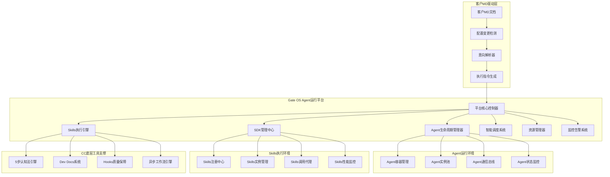

# Gate OS Agent运行平台设计

> **定位**：Gate OS作为Agent SDK Skills的核心运行平台，提供完整的Agent生命周期管理和智能调度能力

---

## 🎯 平台定位与目标

### 核心使命
**构建企业级Agent运行平台，所有Agent SDK Skills在Gate OS中统一管理和执行**

### 设计目标
```yaml
核心目标:
  "Agent运行环境":
    - 提供稳定、高性能的Agent运行时环境
    - 支持Agent的动态加载、启动、停止、重启
    - 实现Agent资源的智能调度和优化分配

  "SDK管理统一":
    - 统一的Agent SDK接口标准
    - SDK版本的兼容性管理和自动升级
    - SDK调用的监控和性能优化

  "Skills能力网络":
    - Skills的注册、发现、调用机制
    - Skills的动态配置和参数调整
    - Skills性能监控和质量评估

  "客户MD驱动":
    - 基于客户MD的Agent行为控制
    - 配置变更的实时生效机制
    - 智能的变更影响分析和执行计划
```

---

## 🏗️ 平台架构设计

### 整体架构图



---

## 🔧 核心组件详细设计

### 1. 平台核心控制器
```python
class GateOSCoreController:
    """Gate OS平台核心控制器"""

    def __init__(self):
        self.agent_lifecycle_manager = AgentLifecycleManager()
        self.sdk_manager = SDKManager()
        self.skills_engine = SkillsEngine()
        self.scheduler = IntelligentScheduler()
        self.resource_manager = ResourceManager()
        self.monitoring = MonitoringSystem()

    async def process_customer_request(self, md_content: str) -> ExecutionResult:
        """处理客户MD驱动的请求"""
        # 1. 解析客户意向
        intent_package = await self.parse_customer_intent(md_content)

        # 2. 生成执行计划
        execution_plan = await self.generate_execution_plan(intent_package)

        # 3. 执行调度
        return await self.execute_plan(execution_plan)

    async def parse_customer_intent(self, md_content: str) -> IntentPackage:
        """解析客户MD中的意向和配置"""
        return IntentPackage(
            agent_configs=self.extract_agent_configs(md_content),
            skills_configs=self.extract_skills_configs(md_content),
            strategy_params=self.extract_strategy_params(md_content),
            workflow_definitions=self.extract_workflow_definitions(md_content)
        )
```

### 2. Agent生命周期管理器
```python
class AgentLifecycleManager:
    """Agent生命周期管理器"""

    def __init__(self):
        self.agent_registry = AgentRegistry()
        self.container_manager = ContainerManager()
        self.health_monitor = HealthMonitor()
        self.state_manager = StateManager()

    async def register_agent(self, agent_config: AgentConfig) -> AgentInfo:
        """注册新的Agent"""
        agent_info = AgentInfo(
            id=agent_config.id,
            type=agent_config.type,
            version=agent_config.version,
            status="registered",
            created_at=datetime.now()
        )

        await self.agent_registry.register(agent_info)
        await self.container_manager.prepare_container(agent_config)

        return agent_info

    async def start_agent(self, agent_id: str) -> StartResult:
        """启动指定Agent"""
        agent_info = await self.agent_registry.get(agent_id)

        # 启动容器
        container_id = await self.container_manager.start_container(
            agent_info.config
        )

        # 初始化Agent
        await self.initialize_agent(agent_id, container_id)

        # 更新状态
        await self.state_manager.update_state(agent_id, "running")

        return StartResult(
            agent_id=agent_id,
            container_id=container_id,
            status="success",
            started_at=datetime.now()
        )

    async def stop_agent(self, agent_id: str, graceful: bool = True) -> StopResult:
        """停止指定Agent"""
        if graceful:
            # 优雅停止：等待当前任务完成
            await self.wait_for_tasks_completion(agent_id)

        # 停止容器
        container_id = await self.state_manager.get_container_id(agent_id)
        await self.container_manager.stop_container(container_id)

        # 更新状态
        await self.state_manager.update_state(agent_id, "stopped")

        return StopResult(
            agent_id=agent_id,
            status="success",
            stopped_at=datetime.now()
        )
```

### 3. SDK管理中心
```python
class SDKManager:
    """Agent SDK管理中心"""

    def __init__(self):
        self.sdk_registry = SDKRegistry()
        self.version_manager = VersionManager()
        self.interface_proxy = InterfaceProxy()
        self.performance_monitor = PerformanceMonitor()

    async def register_sdk(self, sdk_config: SDKConfig) -> SDKInfo:
        """注册Agent SDK"""
        sdk_info = SDKInfo(
            id=sdk_config.id,
            name=sdk_config.name,
            version=sdk_config.version,
            interfaces=sdk_config.interfaces,
            capabilities=sdk_config.capabilities
        )

        # 验证SDK兼容性
        await self.version_manager.check_compatibility(sdk_info)

        # 注册接口代理
        await self.interface_proxy.register_interfaces(sdk_info)

        return sdk_info

    async def invoke_sdk_method(self, agent_id: str, method_name: str,
                              parameters: dict) -> SDKResult:
        """调用SDK方法"""
        start_time = time.time()

        try:
            # 获取Agent SDK信息
            agent_sdk = await self.get_agent_sdk(agent_id)

            # 通过代理调用方法
            result = await self.interface_proxy.invoke(
                agent_sdk, method_name, parameters
            )

            # 记录性能指标
            execution_time = time.time() - start_time
            await self.performance_monitor.record_call(
                agent_id, method_name, execution_time, "success"
            )

            return SDKResult(
                success=True,
                data=result,
                execution_time=execution_time
            )

        except Exception as e:
            execution_time = time.time() - start_time
            await self.performance_monitor.record_call(
                agent_id, method_name, execution_time, "error"
            )

            return SDKResult(
                success=False,
                error=str(e),
                execution_time=execution_time
            )

    async def update_sdk_version(self, agent_id: str, new_version: str) -> UpdateResult:
        """更新Agent SDK版本"""
        # 检查版本兼容性
        compatibility = await self.version_manager.check_upgrade_compatibility(
            agent_id, new_version
        )

        if not compatibility.is_compatible:
            return UpdateResult(
                success=False,
                reason="版本不兼容",
                compatibility_issues=compatibility.issues
            )

        # 执行升级
        await self.perform_sdk_upgrade(agent_id, new_version)

        return UpdateResult(
            success=True,
            old_version=compatibility.old_version,
            new_version=new_version
        )
```

### 4. Skills执行引擎
```python
class SkillsEngine:
    """Skills执行引擎"""

    def __init__(self):
        self.skills_registry = SkillsRegistry()
        self.execution_manager = ExecutionManager()
        self.config_manager = ConfigManager()
        self.performance_tracker = PerformanceTracker()

    async def register_skill(self, skill_config: SkillConfig) -> SkillInfo:
        """注册新Skill"""
        skill_info = SkillInfo(
            id=skill_config.id,
            name=skill_config.name,
            type=skill_config.type,
            category=skill_config.category,
            interface=skill_config.interface,
            dependencies=skill_config.dependencies
        )

        # 验证Skill接口
        await self.validate_skill_interface(skill_info)

        # 注册到执行管理器
        await self.execution_manager.register_skill(skill_info)

        return skill_info

    async def execute_skill(self, skill_id: str, parameters: dict,
                          context: ExecutionContext) -> SkillResult:
        """执行指定Skill"""
        start_time = time.time()

        try:
            # 获取Skill信息
            skill_info = await self.skills_registry.get(skill_id)

            # 准备执行环境
            execution_env = await self.prepare_execution_environment(
                skill_info, context
            )

            # 执行Skill
            result = await self.execution_manager.execute(
                skill_info, parameters, execution_env
            )

            # 记录性能指标
            execution_time = time.time() - start_time
            await self.performance_tracker.record_execution(
                skill_id, execution_time, "success", result
            )

            return SkillResult(
                success=True,
                data=result,
                execution_time=execution_time,
                metadata=self.generate_execution_metadata(skill_info, context)
            )

        except Exception as e:
            execution_time = time.time() - start_time
            await self.performance_tracker.record_execution(
                skill_id, execution_time, "error", str(e)
            )

            return SkillResult(
                success=False,
                error=str(e),
                execution_time=execution_time
            )

    async def update_skill_config(self, skill_id: str, new_config: dict) -> UpdateResult:
        """更新Skill配置"""
        # 验证配置有效性
        validation_result = await self.validate_skill_config(skill_id, new_config)

        if not validation_result.is_valid:
            return UpdateResult(
                success=False,
                reason="配置无效",
                validation_errors=validation_result.errors
            )

        # 应用配置变更
        await self.config_manager.apply_config_update(skill_id, new_config)

        # 重新加载Skill（如果需要）
        if validation_result.requires_reload:
            await self.reload_skill(skill_id)

        return UpdateResult(
            success=True,
            config_version=validation_result.new_version
        )
```

### 5. 智能调度系统
```python
class IntelligentScheduler:
    """智能调度系统"""

    def __init__(self):
        self.resource_optimizer = ResourceOptimizer()
        self.load_balancer = LoadBalancer()
        self.priority_queue = PriorityQueue()
        self.predictor = WorkloadPredictor()

    async def schedule_agent_task(self, task: AgentTask) -> ScheduleResult:
        """调度Agent任务"""
        # 分析任务特征
        task_analysis = await self.analyze_task(task)

        # 预测资源需求
        resource_requirement = await self.predictor.predict_resource_requirement(
            task_analysis
        )

        # 选择最优Agent
        selected_agent = await self.select_optimal_agent(
            task, resource_requirement
        )

        # 分配资源
        resource_allocation = await self.resource_optimizer.allocate(
            selected_agent, resource_requirement
        )

        # 执行调度
        execution_plan = ExecutionPlan(
            task=task,
            agent=selected_agent,
            resources=resource_allocation,
            priority=self.calculate_priority(task),
            estimated_duration=self.estimate_duration(task, resource_requirement)
        )

        return await self.execute_schedule(execution_plan)

    async def balance_load(self) -> BalanceResult:
        """负载均衡"""
        # 获取当前负载状态
        load_status = await self.load_balancer.get_load_status()

        # 识别负载不均的Agent
        unbalanced_agents = await self.identify_unbalanced_agents(load_status)

        # 生成负载重分布计划
        redistribution_plan = await self.generate_redistribution_plan(
            unbalanced_agents
        )

        # 执行负载重分布
        return await self.execute_redistribution(redistribution_plan)
```

---

## 📊 性能与质量指标

### 关键性能指标 (KPI)
```yaml
性能指标:
  Agent管理:
    - Agent注册时间: ≤5秒
    - Agent启动时间: ≤10秒
    - Agent停止时间: ≤5秒
    - 并发Agent数量: ≥1000个

  SDK调用:
    - SDK方法调用P50: ≤100ms
    - SDK方法调用P95: ≤200ms
    - SDK调用成功率: ≥99.9%
    - SDK版本升级时间: ≤30秒

  Skills执行:
    - Skills调用P50: ≤50ms
    - Skills调用P95: ≤150ms
    - Skills执行成功率: ≥99.5%
    - Skills配置更新时间: ≤10秒

  调度系统:
    - 任务调度延迟: ≤100ms
    - 负载均衡响应时间: ≤1秒
    - 资源分配时间: ≤200ms
    - 调度决策准确率: ≥95%
```

### 质量保障指标
```yaml
质量指标:
  可靠性:
    - 平台可用性: ≥99.9%
    - Agent运行稳定性: ≥99.5%
    - 故障恢复时间: ≤30秒
    - 数据一致性: ≥99.99%

  扩展性:
    - 水平扩展能力: 线性扩展至10倍
    - 垂直扩展效率: ≥80%
    - 动态扩缩容响应时间: ≤60秒
    - 资源利用率: ≥70%

  安全性:
    - Agent隔离性: 100%
    - SDK调用权限控制: 100%
    - 配置变更审计: 100%
    - 敏感数据加密: 100%
```

---

## 🔄 监控告警体系

### 监控维度
```yaml
监控维度:
  系统级监控:
    - CPU使用率、内存使用率、磁盘I/O
    - 网络带宽、连接数、响应时间
    - 容器状态、服务健康检查

  Agent级监控:
    - Agent运行状态、执行性能
    - Agent资源使用、错误率
    - Agent间通信状态

  SDK级监控:
    - SDK调用次数、响应时间、成功率
    - SDK版本分布、升级状态
    - SDK接口使用频率和模式

  Skills级监控:
    - Skills执行次数、执行时间、成功率
    - Skills配置变更频率和影响
    - Skills性能趋势和优化建议
```

### 告警策略
```yaml
告警策略:
  紧急告警 (P0):
    - Agent运行失败率 > 5%
    - SDK调用成功率 < 99%
    - 系统可用性 < 99%
    - 响应时间P95 > 1秒

  重要告警 (P1):
    - Agent启动失败
    - Skills执行失败率 > 10%
    - 资源使用率 > 80%
    - 配置变更失败

  一般告警 (P2):
    - 性能指标下降趋势
    - 负载不均衡状态
    - 版本兼容性警告
    - 容量预警
```

---

## 🚀 实施路线图

### Phase 1: 核心框架搭建 (Week 1)
- [ ] 平台核心控制器基础框架
- [ ] Agent生命周期管理器核心功能
- [ ] SDK管理中心基础接口
- [ ] Skills执行引擎基础架构

### Phase 2: 运行环境完善 (Week 2)
- [ ] Agent容器管理系统
- [ ] SDK接口代理和版本管理
- [ ] Skills注册和执行机制
- [ ] 基础监控和状态管理

### Phase 3: 智能调度优化 (Week 3)
- [ ] 智能调度系统开发
- [ ] 负载均衡和资源优化
- [ ] 性能监控和分析
- [ ] 配置管理和热更新

### Phase 4: 客户驱动集成 (Week 4)
- [ ] 客户MD解析和意向处理
- [ ] 配置变更的实时响应
- [ ] 客户控制界面和API
- [ ] 变更影响分析和执行计划

### Phase 5: 质量保障和优化 (Week 5-6)
- [ ] 完整的监控告警体系
- [ ] 性能调优和压力测试
- [ ] 安全性和合规性检查
- [ ] 文档完善和培训准备

---

## 📚 相关文档索引

- **[00-设计目标与边界定义.md](./00-设计目标与边界定义.md)** - 系统设计目标和边界
- **[01-三层架构总体设计.md](./01-三层架构总体设计.md)** - 三层架构详细设计
- **[02-V1哲学融合映射.md](./02-V1哲学融合映射.md)** - V1哲学到架构的映射关系
- **[03-Skills能力网络设计.md](./03-Skills能力网络设计.md)** - Skills能力网络详细设计

> **核心理念**：构建企业级Agent运行平台，为Agent SDK Skills提供统一、高效、可靠的运行环境，实现客户MD驱动的智能协作系统。