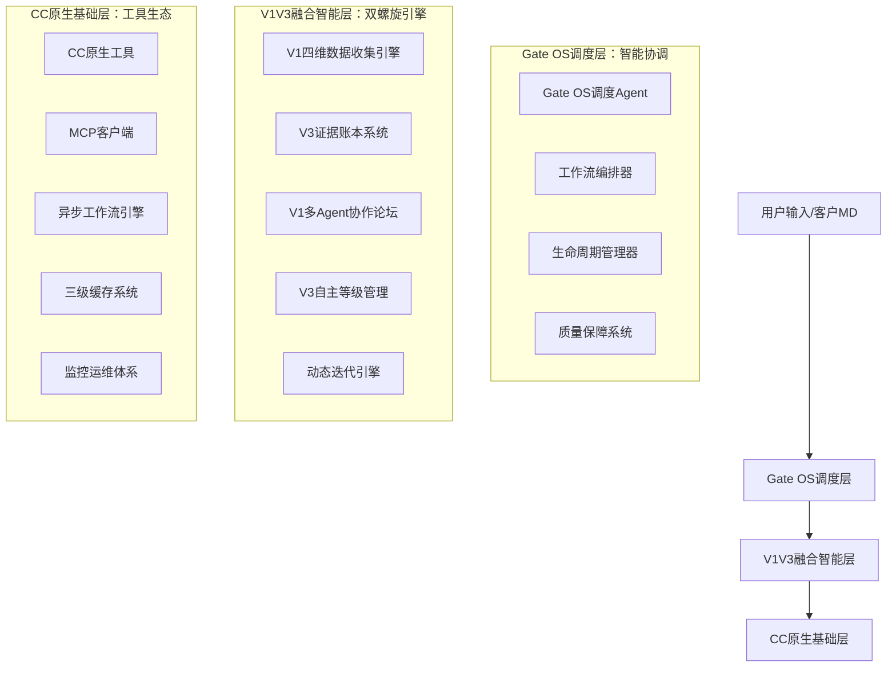

# 总体设计哲学 - 小红书垂直领域智能运营系统

> **核心思想**：基于"小红书种草生态场景"的内容营销智能运营体系

---

## 🧭 核心哲学体系

### 🎯 北极星愿景
**从"手工内容运营"升级为"小红书种草生态智能运营系统"**

基于小红书平台的独特生态和内容营销规律，构建一个能够：
- 洞察小红书用户种草行为和内容偏好
- 把握爆款内容创作规律和平台算法机制
- 协调品牌方、博主、MCN的多方协作需求
- 实现从内容策划到商业转化的全链路智能化

### 🏛️ 小红书种草生态四大支柱

#### 1. 种草趋势洞察引擎
**场景基础：小红书用户"种草→搜索→购买"的行为链路分析**

**核心洞察**：
- **爆款选题挖掘**：基于小红书热点趋势和用户搜索行为
- **用户偏好分析**：深入理解目标客群的内容消费习惯
- **竞品策略追踪**：监控同类品牌和博主的内容策略
- **平台算法适配**：把握小红书推荐机制的优化要点

**数据收集理念**：
```python
class FourDimensionalDataCollector:
    """四维数据收集器 - 全方位数据驱动的洞察引擎"""

    def __init__(self):
        self.ai_tools_collector = AIToolsMarketCollector()      # AI工具市场收集器
        self.user_behavior_collector = UserBehaviorCollector()  # 用户行为收集器
        self.competitor_collector = CompetitorCollector()       # 竞争对手收集器
        self.industry_trends_collector = IndustryTrendsCollector() # 行业趋势收集器

    async def collect_comprehensive_data(self, context):
        """收集四维综合数据"""
        ai_tools_data = await self.ai_tools_collector.collect_market_data(context)
        user_behavior_data = await self.user_behavior_collector.analyze_behavior_patterns(context)
        competitor_data = await self.competitor_collector.monitor_competitor_activity(context)
        industry_trends_data = await self.industry_trends_collector.identify_trending_topics(context)

        return self.integrate_dimensional_insights(
            ai_tools_data, user_behavior_data, competitor_data, industry_trends_data
        )
```

#### 2. 证据账本系统
**哲学基础：证据优先于直觉，通过科学方法确保决策的可追溯性和可靠性**

**核心原则**：
- **五级证据金字塔**：直接观察(1.0) > 受控实验(0.9) > 准实验(0.7) > 面板数据(0.5) > 二手资料(0.3)
- **三角校验机制**：至少两类独立来源相互印证
- **置信度量化**：为每个决策提供明确的置信度评分
- **可追溯性保障**：每个结论都有完整的证据链支撑

**证据决策理念**：
```python
class EvidenceLedgerSystem:
    """证据账本系统 - 基于科学方法的决策支持系统"""

    def __init__(self):
        self.evidence_pyramid = EvidencePyramid()            # 五级证据体系
        self.triangulation_engine = TriangulationEngine()     # 三角校验引擎
        self.confidence_scorer = ConfidenceScorer()          # 置信度评分
        self.evidence_tracker = EvidenceTracker()            # 证据追踪器

    async def build_evidence_based_decision(self, claim, context):
        """构建基于证据的决策"""
        evidence_sources = await self.collect_evidence_sources(claim, context)
        evidence_records = await self.evidence_pyramid.evaluate_evidence(evidence_sources)
        triangulation_result = await self.triangulation_engine.triangulate(evidence_records)
        confidence_score = await self.confidence_scorer.calculate_confidence(claim, evidence_records)

        return {
            'decision': claim,
            'evidence_basis': evidence_records,
            'triangulation_validation': triangulation_result,
            'confidence_score': confidence_score,
            'traceability_info': self.evidence_tracker.generate_traceability_chain(evidence_records)
        }
```

#### 3. 多Agent协作系统
**哲学基础：集体智慧优于个体判断，通过专业Agent协作提升决策质量**

**核心原则**：
- **专业分工明确**：7个专业Agent各司其职，覆盖不同专业维度
- **并行高效协作**：多个Agent同时工作，提升整体效率
- **智能主持协调**：AI主持人智能调度和争议解决
- **共识构建机制**：通过科学方法达成高质量共识

**协作理念**：
```python
class MultiAgentCollaborationSystem:
    """多Agent协作系统 - 专业分工的集体智慧平台"""

    def __init__(self):
        self.professional_agents = self.initialize_professional_agents()  # 7个专业Agent
        self.ai_host = IntelligentForumHost()                           # AI主持人
        self.consensus_builder = ConsensusBuilder()                      # 共识构建器
        self.collaboration_optimizer = CollaborationOptimizer()          # 协作优化器

    def initialize_professional_agents(self):
        """初始化7个专业Agent"""
        return {
            'market_analyst': MarketAnalystAgent(),
            'content_strategist': ContentStrategistAgent(),
            'data_scientist': DataScientistAgent(),
            'creative_director': CreativeDirectorAgent(),
            'community_manager': CommunityManagerAgent(),
            'tech_expert': TechExpertAgent(),
            'business_analyst': BusinessAnalystAgent()
        }

    async def orchestrate_professional_collaboration(self, task, context):
        """编排专业Agent协作"""
        # 并行分析
        parallel_analysis = await self.execute_parallel_analysis(task, context)

        # AI主持人协调
        facilitated_discussion = await self.ai_host.facilitate_discussion(parallel_analysis)

        # 共识构建
        consensus_result = await self.consensus_builder.build_consensus(facilitated_discussion)

        return consensus_result
```

#### 4. 自主等级管理系统
**哲学基础：在明确风险边界内实现智能化自动执行，平衡效率与安全**

**核心原则**：
- **五级自主体系**：LOA0(建议) → LOA1(方案) → LOA2(低风险自动) → LOA3(保障自动) → LOA4(人工专属)
- **风险评估量化**：全面评估决策风险和影响范围
- **安全边界控制**：明确的自主权限边界和回滚机制
- **动态权限调整**：根据历史表现动态调整自主等级

**自主管理理念**：
```python
class AutonomyLevelManagementSystem:
    """自主等级管理系统 - 智能化风险边界内的自动执行"""

    def __init__(self):
        self.loa_determiner = LOADeterminer()                  # 自主等级判定器
        self.risk_assessor = RiskAssessor()                    # 风险评估器
        self.impact_calculator = ImpactCalculator()           # 影响计算器
        self.safety_controller = SafetyController()           # 安全控制器

    async def determine_and_execute_with_autonomy(self, decision_request):
        """确定自主等级并执行"""
        # 风险评估
        risk_assessment = await self.risk_assessor.assess_risk(decision_request)

        # 影响分析
        impact_analysis = await self.impact_calculator.calculate_impact(decision_request)

        # 自主等级判定
        loa_level = await self.loa_determiner.determine_autonomy_level(
            risk_assessment, impact_analysis
        )

        # 在安全边界内执行
        execution_result = await self.safety_controller.execute_with_safety_bounds(
            decision_request, loa_level
        )

        return {
            'executed_decision': decision_request,
            'autonomy_level': loa_level,
            'risk_assessment': risk_assessment,
            'safety_checks': execution_result['safety_checks'],
            'execution_success': execution_result['success']
        }
```

### 🔄 多引擎协同机制

#### 协同策略
**四大引擎的有序协作和智能调度**

1. **四维数据收集** → **证据账本验证**：收集的数据经过科学方法验证
2. **证据决策指导** → **多Agent协作优化**：基于证据的专业分析和协作
3. **专业Agent共识** → **自主等级执行**：在风险边界内自动执行
4. **执行反馈** → **系统学习优化**：从执行结果中学习和改进

#### Gate OS智能调度
**调度理念：Gate OS协调四大引擎的最优协作模式**

```python
class GateOSIntelligentScheduler:
    """Gate OS智能调度器 - 协调四大引擎的最优协作"""

    def __init__(self):
        self.cc_workflow_engine = CCWorkflowEngine()           # CC原生工作流引擎
        self.engine_coordinator = EngineCoordinator()         # 引擎协调器
        self.workflow_optimizer = WorkflowOptimizer()         # 工作流优化器
        self.performance_monitor = PerformanceMonitor()       # 性能监控器

    async def schedule_multi_engine_workflow(self, user_request):
        """调度多引擎协作工作流"""
        # Phase 1: 四维数据收集
        data_insights = await self.engine_coordinator.coordinate_data_collection(user_request)

        # Phase 2: 证据账本验证
        evidence_decision = await self.engine_coordinator.coordinate_evidence_validation(
            data_insights, user_request
        )

        # Phase 3: 多Agent协作优化
        collaboration_insights = await self.engine_coordinator.coordinate_agent_collaboration(
            evidence_decision, user_request
        )

        # Phase 4: 自主等级执行
        execution_result = await self.engine_coordinator.coordinate_autonomy_execution(
            collaboration_insights, user_request
        )

        # Phase 5: 协同优化和学习
        return await self.workflow_optimizer.optimize_and_learn(
            data_insights, evidence_decision, collaboration_insights, execution_result
        )
```

---

## 🏗️ 三层融合架构

### 架构总览

基于"CC原生基础 → Gate OS调度 → V1V3融合智能"的三层架构体系：



## 🎯 设计原则

### 1. 实践导向原则 (V1)
- **成功实践提炼**：从已验证的小红书运营成功案例中提炼方法论
- **四维数据驱动**：AI工具、用户行为、竞争对手、行业趋势全覆盖
- **多专业协作**：7个专业Agent并行评测，AI主持人协调共识
- **动态迭代优化**：PRD→执行→复盘的完整闭环

### 2. 证据科学原则 (V3)
- **证据优先决策**：所有决策必须有可追溯的证据支持
- **五级证据体系**：严格的证据金字塔和置信度评估
- **三角校验验证**：至少两类独立来源相互印证
- **风险边界控制**：明确的自主等级管理和安全机制

### 3. 原生生长原则 (CC)
- **CC原生基础**：所有功能基于CC工具生态构建
- **Gate OS调度**：调度层也是在CC基础上生长的智能组件
- **异步工作流**：利用CC异步架构支撑复杂计算任务
- **缓存优化**：V1V3数据结果融入CC三级缓存体系

### 4. 融合增效原则
- **双螺旋上升**：V1实践与V3证据相互促进、螺旋提升
- **智能调度**：Gate OS协调V1V3组件最优协作模式
- **成本优化**：通过智能调度最小化API调用成本
- **持续学习**：系统从每次执行中学习和优化

---

## 📊 融合价值主张

### 运营效率提升
- **数据收集自动化**：每日自动化四维数据收集，效率提升300%
- **决策智能化**：从70%规则化提升到95%证据驱动智能决策
- **执行自动化**：通过LOA管理实现不同风险等级的自动化执行
- **迭代持续化**：自动化的复盘和优化建议，持续提升运营效果

### 决策质量保障
- **证据可追溯**：每个决策都有完整的证据链和置信度评分
- **风险可控**：明确的自主等级边界和安全回滚机制
- **专业协作**：7个专业Agent的并行评测，确保决策全面性
- **三角校验**：多重验证确保决策的可靠性

### 技术架构优势
- **原生兼容**：完全基于CC原生生态，无额外架构负担
- **性能保持**：利用V4.1异步架构，保持P50≤100ms性能指标
- **扩展灵活**：模块化设计支持灵活的功能扩展和升级
- **运维友好**：集成到现有监控体系，运维复杂度不增加

---

## 🚀 实施路线图

### Phase 1: 基础融合 (Week 1-2)
- 建立三层架构基础框架
- 实现Gate OS调度核心功能
- 集成V1V3基础组件到CC原生生态

### Phase 2: 智能引擎 (Week 3-4)
- 完整实现V1四维数据收集引擎
- 构建V3证据账本和LOA管理系统
- 建立V1多Agent协作论坛系统

### Phase 3: 融合优化 (Week 5)
- 优化V1V3组件协作效率
- 完善Gate OS调度算法
- 集成测试和性能调优

### Phase 4: 生产部署 (Week 6)
- 灰度发布和生产部署
- 监控和运维体系建设
- 客户支持和文档完善

---

## ✅ 当前代码落地与验证方式（索引）

> 本节只提供“设计 ↔ 实现 ↔ 验证”的最小索引，详细执行指令与日志请参考项目内示例脚本与测试输出。

- **V1 四维数据收集引擎**  
  - 实现：`src/tools/data_collector_v1.py` 中 `FourDimensionalDataCollector`。  
  - 集成调用：`examples/v1v3_integration_demo.py` → `execute_v1_data_collection()`，通过 `collect_dimension_data(dimension_name, user_request)` 拉通四维收集。

- **V3 证据账本系统**  
  - 实现：`src/tools/evidence_ledger_v3.py` 中 `EvidenceLedgerTool`（配合 `EvidencePyramid`、`TriangulationEngine`、`ConfidenceScorer` 等）。  
  - 集成调用：`examples/v1v3_integration_demo.py` → `execute_v3_evidence_assessment()`，使用 `record_evidence(...)` 与 `get_evidence_chain(...)` 构建证据链与置信度。

- **V1 多 Agent 协作论坛**  
  - 实现：`src/agents/forum_collaboration_v1.py` 中 `ForumCollaborationSchedulingAgent`、`ForumCollaborationTask` 等。  
  - 集成调用：`examples/v1v3_integration_demo.py` → `execute_v1_forum_collaboration()`，构造任务并调用 `coordinate_forum_collaboration(...)`，读取共识度与质量评估。

- **V3 自主等级管理（LOA）**  
  - 实现：`src/agents/autonomy_management_v3.py` 中 `AutonomyLevelManagementAgent` 与 `LOALevel` / `DecisionRequest` / `ExecutionResult` 等。  
  - 集成调用：`examples/v1v3_integration_demo.py` → `execute_v3_loa_execution()`，通过 `determine_autonomy_level(...)` + `execute_with_loa(...)` 完成决策与执行。

- **端到端演示与回归测试**  
  - 集成 Demo：`examples/v1v3_integration_demo.py`  
    - 执行（项目根目录）：`python3 examples/v1v3_integration_demo.py`。  
    - 产出：`v1v3_integration_demo_YYYYMMDD_HHMMSS.json`（单次 V1V3 集成执行报告）。  
  - 组件与工作流测试：`tests/v1v3_components_test.py`  
    - 执行：`python3 tests/v1v3_components_test.py`。  
    - 产出：`v1v3_test_result_YYYYMMDD_HHMMSS.json`，包含四大组件 + 集成工作流的通过情况。

---

**文档状态**: 设计哲学完成，对应核心组件与集成 Demo/测试已在代码中落地  
**更新日期**: 2025-11-18  
**设计团队**: LaunchX Team  
**核心理念**: 实践智慧与证据决策的双螺旋融合
