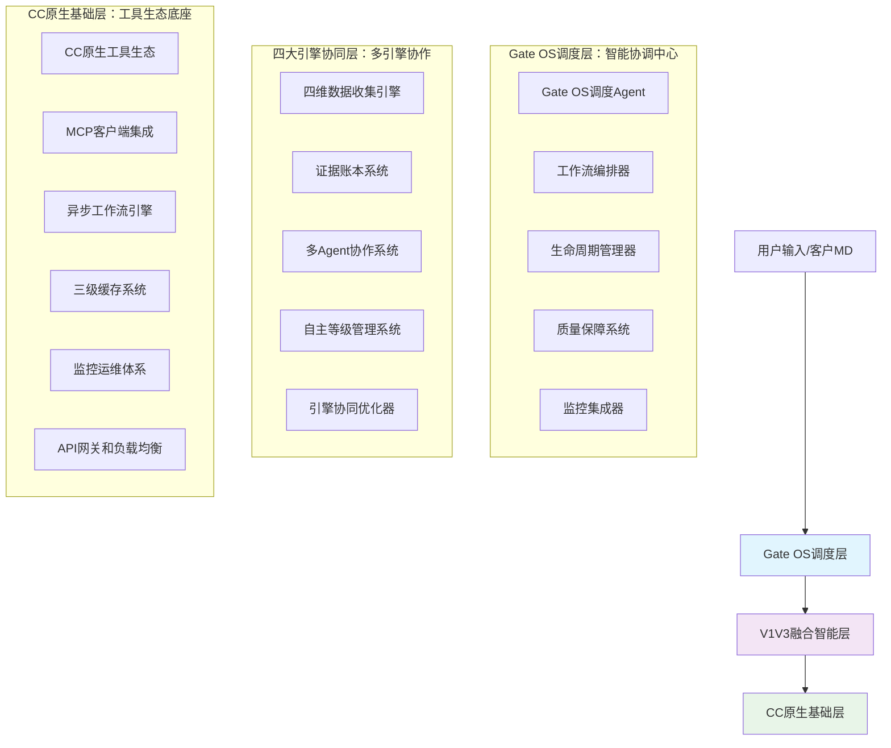
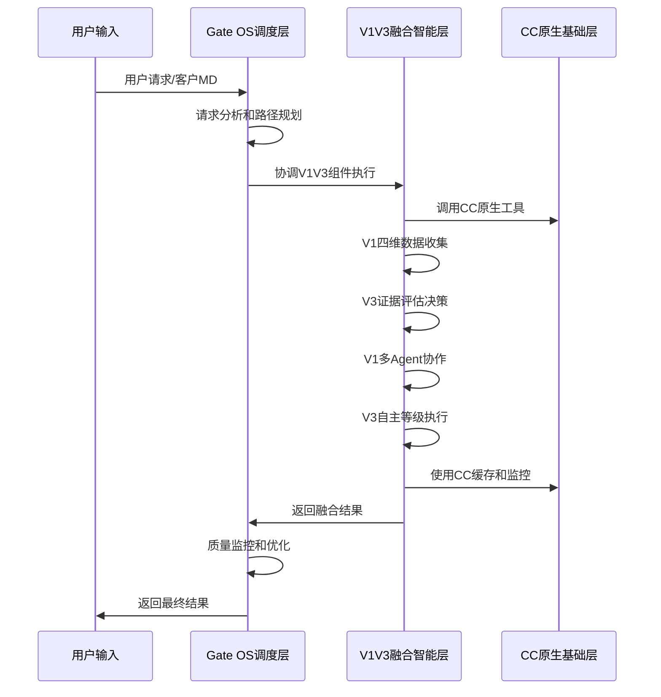

# 三层融合架构设计 - 多引擎协同Gate OS智能运营系统

> **设计目标**：构建"CC原生基础 → Gate OS调度 → 四大引擎协同"的三层可追溯价值链

---

## 🏗️ 三层架构深度设计

### 架构总览

基于"Gate OS调度也是在CC原生基础上生长"的理念，构建以V1V3融合智能为中心的三层架构体系：



## 📱 Layer 3: Gate OS调度层 - 智能协调中心

### 核心设计理念
**Gate OS不是独立系统，而是在CC原生基础上生长的智能调度层**

### 3.1 Gate OS调度Agent

**设计原则**：智能协调V1V3组件，优化CC原生资源使用

```python
class GateOSSchedulingAgent(BaseAgent):
    """Gate OS调度Agent - V1V3融合智能协调器"""

    def __init__(self):
        super().__init__()
        self.cc_workflow_engine = CCWorkflowEngine()           # CC原生工作流
        self.fusion_optimizer = FusionOptimizer()             # 融合优化器
        self.resource_scheduler = ResourceScheduler()          # 资源调度器
        self.quality_monitor = QualityMonitor()               # 质量监控器

    async def schedule_v1v3_fusion_workflow(self, user_request: str) -> Dict[str, Any]:
        """调度V1V3融合工作流"""

        # 1. 请求分析和路径规划
        workflow_plan = await self.analyze_request_and_plan_workflow(user_request)

        # 2. V1V3组件协调调度
        fusion_execution = await self.coordinate_v1v3_execution(workflow_plan)

        # 3. CC原生资源优化
        optimized_execution = await self.optimize_cc_resources(fusion_execution)

        # 4. 质量监控和保障
        quality_assured_result = await self.ensure_quality(optimized_execution)

        return {
            'workflow_id': workflow_plan['workflow_id'],
            'execution_result': quality_assured_result,
            'performance_metrics': self.collect_performance_metrics(),
            'quality_score': quality_assured_result['quality_score']
        }

    async def coordinate_v1v3_execution(self, workflow_plan: Dict) -> Dict[str, Any]:
        """协调V1V3组件执行"""

        # Phase 1: V1四维数据收集 (40%权重)
        if workflow_plan['requires_data_collection']:
            data_collection_task = await self.schedule_v1_data_collection(workflow_plan)

        # Phase 2: V3证据评估和决策
        if workflow_plan['requires_evidence_assessment']:
            evidence_assessment_task = await self.schedule_v3_evidence_assessment(workflow_plan)

        # Phase 3: V1多Agent协作 (35%权重)
        if workflow_plan['requires_forum_collaboration']:
            collaboration_task = await self.schedule_v1_forum_collaboration(workflow_plan)

        # Phase 4: V3自主等级执行 (25%权重)
        if workflow_plan['requires_loa_execution']:
            execution_task = await self.schedule_v3_loa_execution(workflow_plan)

        # Phase 5: 融合优化
        return await self.optimize_fusion_result([
            data_collection_task, evidence_assessment_task,
            collaboration_task, execution_task
        ])
```

### 3.2 工作流编排器

**设计原则**：基于CC异步工作流引擎编排V1V3融合任务

```python
class V1V3FusionWorkflowOrchestrator:
    """V1V3融合工作流编排器"""

    def __init__(self):
        self.cc_async_engine = CCAsyncWorkflowEngine()       # CC异步引擎
        self.v1v3_task_router = V1V3TaskRouter()           # V1V3任务路由
        self.dependency_manager = DependencyManager()      # 依赖管理器

    async def orchestrate_fusion_workflow(self, user_request: str) -> str:
        """编排V1V3融合工作流"""

        # 分析工作流复杂度
        workflow_complexity = await self.analyze_workflow_complexity(user_request)

        # 创建工作流图
        workflow_graph = await self.create_fusion_workflow_graph(user_request, workflow_complexity)

        # 在CC异步引擎上执行
        workflow_id = await self.cc_async_engine.execute_workflow(workflow_graph)

        return workflow_id

    async def create_fusion_workflow_graph(self, user_request: str, complexity: Dict) -> Dict:
        """创建V1V3融合工作流图"""

        workflow_graph = {
            'workflow_id': f"v1v3_fusion_{datetime.now().timestamp()}",
            'nodes': [],
            'edges': [],
            'optimization_strategy': self.determine_optimization_strategy(complexity)
        }

        # 添加V1数据收集节点
        if complexity['data_collection_required']:
            workflow_graph['nodes'].append({
                'id': 'v1_data_collection',
                'type': 'v1_component',
                'component': 'FourDimensionalDataCollector',
                'parameters': {'user_request': user_request},
                'priority': 'high',
                'estimated_duration': '2-5 minutes'
            })

        # 添加V3证据评估节点
        if complexity['evidence_assessment_required']:
            workflow_graph['nodes'].append({
                'id': 'v3_evidence_assessment',
                'type': 'v3_component',
                'component': 'EvidenceLedgerTool',
                'parameters': {'triangulation': True, 'confidence_threshold': 0.7},
                'priority': 'high',
                'estimated_duration': '1-3 minutes'
            })

        # 添加工作流依赖关系
        workflow_graph['edges'] = [
            {'from': 'v1_data_collection', 'to': 'v3_evidence_assessment', 'condition': 'data_ready'},
            {'from': 'v3_evidence_assessment', 'to': 'v1_forum_collaboration', 'condition': 'evidence_validated'},
            {'from': 'v1_forum_collaboration', 'to': 'v3_loa_execution', 'condition': 'consensus_reached'}
        ]

        return workflow_graph
```

### 3.3 生命周期管理器

**设计原则**：管理V1V3组件和CC原生资源的生命周期

```python
class V1V3LifecycleManager:
    """V1V3组件生命周期管理器"""

    def __init__(self):
        self.component_registry = ComponentRegistry()          # 组件注册表
        self.resource_monitor = ResourceMonitor()             # 资源监控器
        self.health_checker = HealthChecker()                 # 健康检查器

    async def manage_component_lifecycle(self, component_type: str, operation: str):
        """管理组件生命周期"""

        if operation == 'initialize':
            await self.initialize_component(component_type)
        elif operation == 'activate':
            await self.activate_component(component_type)
        elif operation == 'deactivate':
            await self.deactivate_component(component_type)
        elif operation == 'cleanup':
            await self.cleanup_component(component_type)

    async def monitor_component_health(self):
        """监控组件健康状态"""

        health_status = {}

        # 监控V1组件
        v1_components = ['data_collector', 'forum_collaboration', 'dynamic_iteration']
        for component in v1_components:
            health_status[f'v1_{component}'] = await self.health_checker.check_health(
                f'v1_{component}', self.component_registry.get_component_config(f'v1_{component}')
            )

        # 监控V3组件
        v3_components = ['evidence_ledger', 'autonomy_management']
        for component in v3_components:
            health_status[f'v3_{component}'] = await self.health_checker.check_health(
                f'v3_{component}', self.component_registry.get_component_config(f'v3_{component}')
            )

        # 监控CC原生组件
        cc_components = ['workflow_engine', 'cache_system', 'monitoring_system']
        for component in cc_components:
            health_status[f'cc_{component}'] = await self.health_checker.check_health(
                f'cc_{component}', self.component_registry.get_component_config(f'cc_{component}')
            )

        return health_status
```

---

## 🎯 Layer 2: V1V3融合智能层 - 双螺旋引擎

### 核心设计理念
**V1实践智慧与V3证据决策的螺旋融合，在Gate OS调度下协同工作**

### 2.1 V1四维数据收集引擎

**设计原则**：基于小红书运营成功实践的四维数据收集方法论

```python
class V1FourDimensionalDataEngine:
    """V1四维数据收集引擎"""

    def __init__(self):
        self.dimension_collectors = {
            'ai_tools_market': AIToolsMarketCollector(),
            'user_behavior': UserBehaviorCollector(),
            'competitor_monitoring': CompetitorMonitoringCollector(),
            'industry_trends': IndustryTrendsCollector()
        }
        self.data_integrator = FourDimensionalDataIntegrator()

    async def collect_comprehensive_operation_data(self, context: Dict) -> Dict[str, Any]:
        """收集四维运营数据"""

        collection_tasks = []

        # 并行收集四维数据
        for dimension, collector in self.dimension_collectors.items():
            task = asyncio.create_task(collector.collect_dimension_data(context))
            collection_tasks.append((dimension, task))

        # 等待所有收集完成
        dimension_results = {}
        for dimension, task in collection_tasks:
            try:
                result = await task
                dimension_results[dimension] = {
                    'data': result,
                    'quality_score': self.assess_data_quality(result),
                    'collection_timestamp': datetime.now().isoformat()
                }
            except Exception as e:
                dimension_results[dimension] = {
                    'error': str(e),
                    'fallback_data': await self.get_fallback_data(dimension, context)
                }

        # 四维数据融合
        integrated_data = await self.data_integrator.integrate_dimensions(dimension_results)

        return {
            'dimension_results': dimension_results,
            'integrated_insights': integrated_data,
            'collection_metadata': {
                'total_dimensions': len(dimension_results),
                'successful_collections': len([r for r in dimension_results.values() if 'error' not in r]),
                'overall_quality_score': self.calculate_overall_quality(dimension_results)
            }
        }
```

### 2.2 V3证据账本系统

**设计原则**：基于科学方法的证据收集、验证和决策支持

```python
class V3EvidenceLedgerSystem:
    """V3证据账本系统"""

    def __init__(self):
        self.evidence_pyramid = EvidencePyramid()            # 五级证据体系
        self.triangulation_engine = TriangulationEngine()     # 三角校验引擎
        self.confidence_scorer = ConfidenceScorer()          # 置信度评分
        self.decision_supporter = DecisionSupporter()         # 决策支持器

    async def build_evidence_chain(self, claim: str, context: Dict) -> Dict[str, Any]:
        """构建证据链"""

        # 收集多源证据
        evidence_sources = await self.collect_evidence_sources(claim, context)

        # 证据等级评估
        evidence_records = []
        for source in evidence_sources:
            evidence_record = await self.evidence_pyramid.evaluate_evidence(source)
            evidence_records.append(evidence_record)

        # 三角校验
        triangulation_result = await self.triangulation_engine.triangulate(evidence_records)

        # 置信度计算
        confidence_score = await self.confidence_scorer.calculate_confidence(
            claim, evidence_records, triangulation_result
        )

        # 决策支持
        decision_support = await self.decision_supporter.generate_decision_support(
            claim, evidence_records, confidence_score
        )

        return {
            'claim': claim,
            'evidence_chain': evidence_records,
            'triangulation_validation': triangulation_result,
            'confidence_score': confidence_score,
            'decision_support': decision_support,
            'evidence_metadata': {
                'total_evidence': len(evidence_records),
                'high_strength_evidence': len([e for e in evidence_records if e.strength >= 0.7]),
                'triangulation_success': triangulation_result['is_valid']
            }
        }
```

### 2.3 融合优化器

**设计原则**：优化V1V3组件协作效率，最大化整体系统性能

```python
class V1V3FusionOptimizer:
    """V1V3融合优化器"""

    def __init__(self):
        self.performance_analyzer = PerformanceAnalyzer()     # 性能分析器
        self.resource_optimizer = ResourceOptimizer()         # 资源优化器
        self.workflow_optimizer = WorkflowOptimizer()         # 工作流优化器

    async def optimize_fusion_execution(self, v1_results: Dict, v3_results: Dict) -> Dict[str, Any]:
        """优化V1V3融合执行"""

        # 分析性能瓶颈
        performance_analysis = await self.performance_analyzer.analyze_execution({
            'v1_results': v1_results,
            'v3_results': v3_results
        })

        # 资源使用优化
        resource_optimization = await self.resource_optimizer.optimize_resource_usage(
            performance_analysis['resource_usage']
        )

        # 工作流优化
        workflow_optimization = await self.workflow_optimizer.optimize_workflow_sequence(
            v1_results, v3_results, performance_analysis
        )

        # 融合结果优化
        optimized_result = await self.generate_optimized_fusion_result(
            v1_results, v3_results, performance_analysis,
            resource_optimization, workflow_optimization
        )

        return optimized_result

    async def generate_optimized_fusion_result(self, v1_results: Dict, v3_results: Dict,
                                             performance_analysis: Dict, resource_optimization: Dict,
                                             workflow_optimization: Dict) -> Dict[str, Any]:
        """生成优化的融合结果"""

        return {
            'fusion_insights': self.merge_v1v3_insights(v1_results, v3_results),
            'optimized_recommendations': self.generate_optimized_recommendations(
                v1_results, v3_results, performance_analysis
            ),
            'performance_improvements': {
                'response_time_reduction': performance_analysis.get('optimization_potential', 0),
                'resource_efficiency_gain': resource_optimization.get('efficiency_gain', 0),
                'workflow_optimization_score': workflow_optimization.get('optimization_score', 0)
            },
            'quality_metrics': {
                'v1_wisdom_score': self.calculate_wisdom_score(v1_results),
                'v3_evidence_score': self.calculate_evidence_score(v3_results),
                'fusion_quality_score': self.calculate_fusion_quality(v1_results, v3_results)
            }
        }
```

---

## ⚙️ Layer 1: CC原生基础层 - 工具生态底座

### 核心设计理念
**所有V1V3功能都基于CC原生工具生态构建，Gate OS调度层也是CC原生生长**

### 1.1 CC原生工具集成

**设计原则**：无缝集成V1V3组件到CC工具生态

```python
class CCNativeIntegration:
    """CC原生工具集成器"""

    def __init__(self):
        self.cc_tool_registry = CCToolRegistry()             # CC工具注册表
        self.mcp_client_manager = MCPClientManager()         # MCP客户端管理
        self.workflow_engine = CCWorkflowEngine()             # CC工作流引擎

    async def integrate_v1v3_to_cc_ecosystem(self):
        """将V1V3组件集成到CC生态"""

        # 注册V1组件到CC工具生态
        v1_tools = [
            ('data_collector_v1', 'FourDimensionalDataCollector'),
            ('forum_collaboration_v1', 'ForumCollaborationAgent'),
            ('dynamic_iteration_v1', 'DynamicIterationEngine')
        ]

        for tool_name, tool_class in v1_tools:
            await self.cc_tool_registry.register_tool(
                tool_name, tool_class,
                category='v1_wisdom',
                description='V1小红书运营实践智慧组件'
            )

        # 注册V3组件到CC工具生态
        v3_tools = [
            ('evidence_ledger_v3', 'EvidenceLedgerTool'),
            ('autonomy_management_v3', 'AutonomyLevelManagementAgent')
        ]

        for tool_name, tool_class in v3_tools:
            await self.cc_tool_registry.register_tool(
                tool_name, tool_class,
                category='v3_evidence',
                description='V3证据驱动决策哲学组件'
            )

        # 注册Gate OS调度组件
        gate_os_tools = [
            ('gate_os_scheduler', 'GateOSSchedulingAgent'),
            ('fusion_orchestrator', 'V1V3FusionWorkflowOrchestrator')
        ]

        for tool_name, tool_class in gate_os_tools:
            await self.cc_tool_registry.register_tool(
                tool_name, tool_class,
                category='gate_os_scheduling',
                description='Gate OS调度组件'
            )
```

### 1.2 异步工作流引擎扩展

**设计原则**：扩展CC异步工作流引擎支持V1V3融合任务

```python
class CCAsyncWorkflowExtension:
    """CC异步工作流引擎V1V3扩展"""

    def __init__(self):
        self.base_engine = CCAsyncWorkflowEngine()            # CC基础异步引擎
        self.v1v3_task_queue = V1V3TaskQueue()               # V1V3任务队列
        self.fusion_scheduler = FusionTaskScheduler()         # 融合任务调度器

    async def execute_v1v3_fusion_workflow(self, workflow_definition: Dict) -> str:
        """执行V1V3融合工作流"""

        # 创建V1V3融合任务
        fusion_tasks = await self.create_fusion_tasks(workflow_definition)

        # 优化任务调度顺序
        optimized_schedule = await self.fusion_scheduler.optimize_schedule(fusion_tasks)

        # 在CC异步引擎上执行
        workflow_id = await self.base_engine.execute_async_workflow(
            optimized_schedule,
            priority='high',
            timeout=300  # 5分钟超时
        )

        return workflow_id

    async def create_fusion_tasks(self, workflow_definition: Dict) -> List[Dict]:
        """创建V1V3融合任务"""

        tasks = []

        # V1数据收集任务
        if workflow_definition.get('data_collection', False):
            tasks.append({
                'task_id': 'v1_data_collection',
                'task_type': 'v1_component',
                'component': 'FourDimensionalDataCollector',
                'parameters': workflow_definition['data_collection_params'],
                'dependencies': [],
                'estimated_duration': 120  # 2分钟
            })

        # V3证据评估任务
        if workflow_definition.get('evidence_assessment', False):
            tasks.append({
                'task_id': 'v3_evidence_assessment',
                'task_type': 'v3_component',
                'component': 'EvidenceLedgerTool',
                'parameters': workflow_definition['evidence_assessment_params'],
                'dependencies': ['v1_data_collection'],
                'estimated_duration': 60  # 1分钟
            })

        return tasks
```

### 1.3 三级缓存系统集成

**设计原则**：V1V3数据结果融入CC三级缓存体系

```python
class CCThreeLevelCacheExtension:
    """CC三级缓存系统V1V3扩展"""

    def __init__(self):
        self.l1_cache = CCL1Cache()                           # L1内存缓存 (<1ms)
        self.l2_cache = CCL2Cache()                           # L2持久化缓存
        self.l3_cache = CCL3Cache()                           # L3复杂查询缓存

    async def cache_v1v3_results(self, result_type: str, result_data: Dict, cache_config: Dict):
        """缓存V1V3结果数据"""

        cache_key = self.generate_cache_key(result_type, result_data)

        # 根据数据类型选择缓存级别
        if cache_config.get('hot_data', False):
            # 热数据存入L1缓存
            await self.l1_cache.set(cache_key, result_data, ttl=3600)  # 1小时
        elif cache_config.get('frequently_accessed', False):
            # 频繁访问数据存入L2缓存
            await self.l2_cache.set(cache_key, result_data, ttl=86400)  # 24小时
        else:
            # 复杂分析结果存入L3缓存
            await self.l3_cache.set(cache_key, result_data, ttl=604800)  # 7天

    def generate_cache_key(self, result_type: str, result_data: Dict) -> str:
        """生成缓存键"""

        if result_type == 'v1_data_collection':
            dimensions = '+'.join(sorted(result_data.get('dimensions', [])))
            return f"v1:data_collector:{dimensions}:{result_data.get('context_hash', '')}"
        elif result_type == 'v3_evidence_assessment':
            claim_hash = hashlib.md5(result_data.get('claim', '').encode()).hexdigest()[:8]
            return f"v3:evidence_ledger:{claim_hash}"
        elif result_type == 'v1v3_fusion_result':
            workflow_id = result_data.get('workflow_id', '')
            return f"fusion:result:{workflow_id}"

        return f"unknown:{result_type}"
```

---

## 🔄 层间协作机制

### 协作数据流



### 性能保障机制

1. **异步并发处理**：利用CC异步引擎并行执行V1V3任务
2. **智能缓存策略**：V1V3结果融入CC三级缓存系统
3. **负载均衡**：Gate OS智能调度避免组件过载
4. **错误隔离**：单个组件失败不影响整体系统运行
5. **自动扩缩容**：根据负载动态调整资源分配

### 质量保障体系

1. **组件健康监控**：实时监控V1V3组件和CC基础组件状态
2. **性能指标监控**：响应时间、吞吐量、错误率等关键指标
3. **数据质量检查**：V1数据收集质量和V3证据有效性验证
4. **融合结果评估**：V1V3融合效果量化评估
5. **自动化恢复**：组件故障自动检测和恢复机制

---

**文档状态**: 三层架构设计完成，等待组件详细设计
**更新日期**: 2025-11-18
**架构师**: LaunchX Team
**设计原则**: CC原生基础上的V1V3融合智能