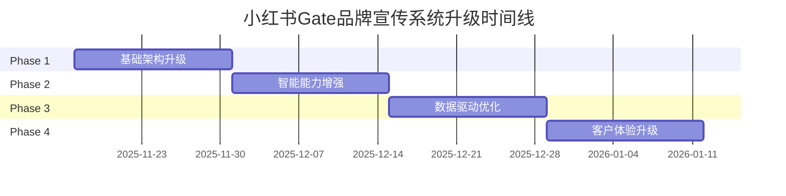

# 小红书Gate品牌宣传运营系统 - 项目计划书

## Executive Summary

本项目旨在将现有的V3.0小红书AI运营系统升级为基于Gate MCP生态的V4.0智能化品牌宣传平台，实现从70%规则自动化到95%智能决策的跨越式升级。

## Current State Analysis

### V3.0系统现状
- **技术架构**: 基础MCP集成 (xiaohongshu-mcp + tavily + filesystem)
- **核心功能**: 客户PRD分析、自动化工作流、策略学习引擎
- **智能程度**: 70%规则化自动化，30%需人工干预
- **工具覆盖**: 仅3个基础工具，功能局限

### 核心痛点识别
1. **工具生态薄弱**: 缺乏Rube 500+应用生态支持
2. **内容创作局限**: 无AI图像、视频生成能力
3. **数据驱动不足**: 缺乏实时市场情报和竞争分析
4. **用户互动缺失**: 无自动化用户互动和社群运营

## Implementation Phases

### Phase 1: 基础架构升级 (Week 1-2)
**目标**: 建立Gate MCP + Rube工具生态基础

**关键任务**:
- 集成Gate MCP工作流规划系统
- 接入Rube 500+应用生态 (Instagram, Twitter, HubSpot等)
- 部署Gemini AI内容创作能力 (图像+视频)
- 建立Browser自动化用户互动系统

**交付物**:
- Gate MCP工具集成方案
- Rube工具生态连接配置
- Gemini内容创作流水线
- Browser自动化测试用例

### Phase 2: 智能能力增强 (Week 3-4)
**目标**: 实现智能化内容创作和发布

**关键任务**:
- 开发AI驱动的内容策略生成系统
- 实现多模态内容自动化生产 (图文+视频)
- 建立智能用户互动和社群运营
- 集成市场情报和竞争分析系统

**交付物**:
- AI内容策略生成器
- 多模态内容生产流水线
- 自动化用户互动系统
- 市场情报分析仪表板

### Phase 3: 数据驱动优化 (Week 5-6)
**目标**: 建立完整的数据驱动决策体系

**关键任务**:
- 集成HubSpot CRM进行客户管理
- 建立多维度效果分析系统
- 实现实时优化建议引擎
- 开发自动化运营报告生成

**交付物**:
- CRM集成管理系统
- 效果分析仪表板
- 实时优化建议引擎
- 自动化运营报告系统

### Phase 4: 客户体验升级 (Week 7-8)
**目标**: 简化客户交互，提升用户体验

**关键任务**:
- 开发MD文件驱动的客户配置系统
- 建立实时进度监控和报告系统
- 实现智能策略建议和优化指导
- 完善客户服务和支持体系

**交付物**:
- MD配置交互系统
- 实时监控仪表板
- 智能策略建议系统
- 客户服务支持体系

## Risk Matrix

| 风险类别 | 风险等级 | 影响描述 | 缓解策略 |
|---------|---------|---------|---------|
| 技术集成 | 中等 | 多系统集成复杂度高 | 分阶段集成，充分测试 |
| API限制 | 中等 | 第三方API调用限制 | 建立缓存机制，优化调用频率 |
| 性能瓶颈 | 低 | 大量自动化任务可能影响性能 | 异步处理，负载均衡 |
| 数据安全 | 低 | 多平台数据交互安全风险 | 数据加密，访问权限控制 |

## Success Metrics

### 技术指标
- **系统可用性**: ≥99.5%
- **响应时间**: ≤30秒 (策略生成)
- **自动化程度**: 95%
- **工具集成数量**: 50+

### 业务指标
- **内容生产效率**: 提升300%
- **用户互动率**: 提升200%
- **客户满意度**: ≥90%
- **运营成本**: 降低60%

### 质量指标
- **内容质量评分**: ≥85%
- **策略准确性**: ≥90%
- **用户响应时间**: ≤5分钟
- **报告及时性**: 100%

## Resource Requirements

### 技术资源
- **开发团队**: 2-3人 (全栈+AI)
- **系统架构**: 云原生架构
- **数据存储**: 支持大规模非结构化数据
- **计算资源**: GPU支持 (AI内容生成)

### 外部服务
- **Gate MCP**: 工作流编排
- **Rube生态**: 500+应用集成
- **Gemini API**: 图像视频生成
- **HubSpot**: CRM客户管理

## Timeline Overview

## Budget Estimation

### 开发成本
- **人力成本**: 4人月 × 2人 = 8人月
- **云服务成本**: $500/月 × 2个月 = $1,000
- **API调用成本**: 预计$300/月

### 运营成本 (月度)
- **云服务**: $200
- **API调用**: $300
- **维护人力**: 0.5人月

## Quality Assurance

### 测试策略
- **单元测试**: 覆盖率≥80%
- **集成测试**: 所有外部接口
- **性能测试**: 并发用户1000+
- **安全测试**: 数据安全和隐私保护

### 监控体系
- **系统监控**: 实时性能监控
- **业务监控**: 关键指标跟踪
- **错误监控**: 异常告警机制
- **用户监控**: 用户体验跟踪

---

**项目状态**: 规划完成，等待实施启动
**更新日期**: 2025-11-17
**负责人**: LaunchX技术团队