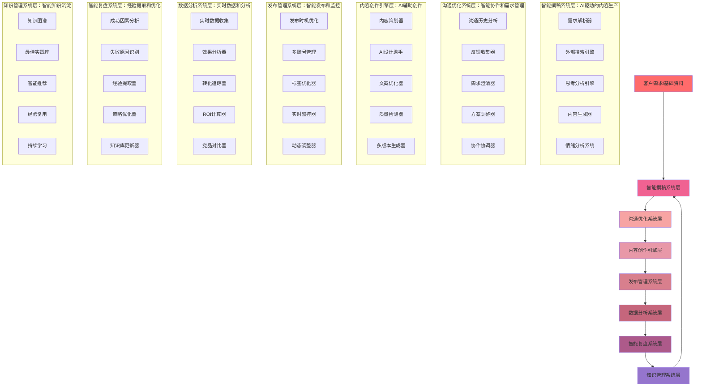
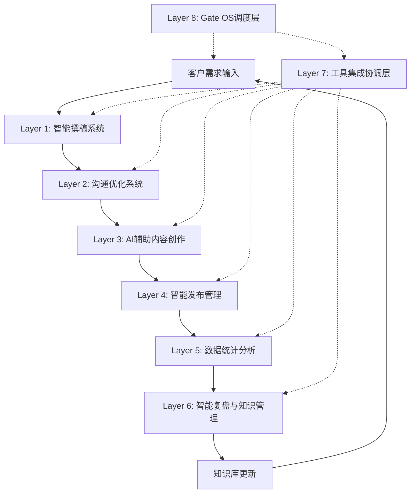

# 小红书全流程智能运营技术架构 - 从撰稿到复盘的完整技术体系

> **设计目标**：构建"客户需求→智能撰稿→沟通优化→内容创作→发布管理→数据统计→智能复盘"的全流程技术架构

---

## 🏗️ 小红书垂直领域技术架构

### 架构总览

基于小红书内容运营的完整生命周期，构建覆盖全流程的六层智能技术架构体系：



## 📱 Layer 1: 智能撰稿系统层 - AI驱动的内容生产

### 核心设计理念
**基于客户需求和外部搜索的智能化内容生产，融合思考分析和情绪优化**

### 1.1 智能撰稿系统架构

**设计原则**：整合外部搜索、AI思考和情绪分析的智能内容生产系统

```python
class IntelligentContentWritingSystem:
    """智能撰稿系统 - AI驱动的内容生产"""

    def __init__(self):
        super().__init__()
        self.requirement_parser = IntelligentRequirementParser()     # 智能需求解析器
        self.external_search_engine = ExternalSearchEngine()       # 外部搜索引擎
        self.thinking_analyzer = DeepThinkingAnalyzer()           # 深度思考分析器
        self.content_generator = AIContentGenerator()             # AI内容生成器
        self.emotion_analyzer = EmotionAnalysisSystem()           # 情绪分析系统
        self.integration_coordinator = ToolIntegrationCoordinator() # 工具集成协调器

    async def execute_intelligent_writing_workflow(self, customer_request: Dict, base_materials: Dict) -> Dict[str, Any]:
        """执行智能撰稿工作流"""

        # Phase 1: 需求智能解析和颗粒度细化
        parsed_requirements = await self.requirement_parser.parse_decompose_requirements(
            customer_request,
            decomposition_levels=[
                'strategic_objectives',    # 战略目标解析
                'content_themes',         # 内容主题分析
                'target_audience',         # 目标受众分析
                'key_messages',           # 核心信息提取
                'content_format',          # 内容格式适配
                'publication_channels'     # 发布渠道规划
            ]
        )

        # Phase 2: 外部搜索引擎集成
        external_intelligence = await self.external_search_engine.comprehensive_search(
            parsed_requirements,
            search_config={
                'sources': [
                    'industry_trends',         # 行业趋势
                    'competitor_strategies',   # 竞品策略
                    'user_preferences',        # 用户偏好
                    'platform_algorithms',     # 平台算法
                    'best_practices'         # 最佳实践
                ],
                'depth': 'comprehensive',
                'time_range': parsed_requirements.get('time_range', '30d'),
                'language': 'zh-CN',
                'region': 'CN'
            }
        )

        # Phase 3: 深度思考分析
        strategic_thinking = await self.thinking_analyzer.deep_thinking_analysis(
            parsed_requirements,
            external_intelligence,
            thinking_frameworks=[
                'swot_analysis',           # SWOT分析
                'user_journey_mapping',    # 用户旅程映射
                'content_strategy',        # 内容策略
                'competitive_positioning', # 竞争定位
                'risk_assessment'          # 风险评估
            ]
        )

        # Phase 4: AI内容生成
        generated_content = await self.content_generator.generate_comprehensive_content(
            strategic_thinking,
            base_materials,
            content_types=[
                'headline_variants',       # 标题变体
                'body_content',           # 正文内容
                'visual_concepts',       # 视觉概念
                'call_to_actions',        # 行动召唤
                'social_sharing_elements' # 社交分享元素
            ]
        )

        # Phase 5: 情绪分析优化
        emotion_analysis = await self.emotion_analyzer.comprehensive_emotion_analysis(
            generated_content,
            emotion_dimensions=[
                'emotional_impact',       # 情感冲击
                'engagement_potential',   # 互动潜力
                'trust_building',         # 信任建立
                'conversion_motivation'   # 转化动机
            ]
        )

        # Phase 6: 智能优化和建议
        optimization_suggestions = await self.integration_coordinator.optimize_writing_output(
            {
                'requirements': parsed_requirements,
                'external_intelligence': external_intelligence,
                'strategic_thinking': strategic_thinking,
                'generated_content': generated_content,
                'emotion_analysis': emotion_analysis
            },
            optimization_goals=[
                'increase_engagement',      # 提升互动
                'enhance_conversion',       # 增强转化
                'improve_quality_score',     # 改善质量分数
                'optimize_for_xiaohongshu' # 优化小红书平台
            ]
        )

        return {
            'workflow_id': f"writing_{datetime.now().timestamp()}",
            'parsed_requirements': parsed_requirements,
            'external_intelligence': external_intelligence,
            'strategic_thinking': strategic_thinking,
            'generated_content': generated_content,
            'emotion_analysis': emotion_analysis,
            'optimization_suggestions': optimization_suggestions,
            'content_quality_score': self.calculate_overall_content_quality(
                generated_content, emotion_analysis
            ),
            'next_steps': self.define_next_content_steps(
                parsed_requirements, generated_content
            )
        }
```

### 1.2 外部搜索引擎集成

**设计原则**：多源信息集成，为内容生产提供全面的情报支撑

```python
class IntegratedSearchEngine:
    """集成搜索引擎 - 多源信息收集和处理"""

    def __init__(self):
        self.web_search = WebSearchTool()                      # 网页搜索
        self.news_search = NewsSearchTool()                    # 新闻搜索
        self.social_search = SocialMediaSearchTool()          # 社交媒体搜索
        self.xiaohongshu_search = XiaohongshuSearchTool()      # 小红书搜索
        self.academic_search = AcademicSearchTool()            # 学术搜索
        self.search_synthesizer = SearchSynthesizer()         # 搜索结果合成器

    async def execute_multi_source_search(self, search_context: Dict) -> Dict[str, Any]:
        """执行多源搜索"""

        search_results = {
            'web_sources': [],
            'news_sources': [],
            'social_sources': [],
            'xiaohongshu_sources': [],
            'academic_sources': [],
            'synthesized_insights': {}
        }

        # 并行执行多源搜索
        search_tasks = []

        # 网页搜索
        if search_context.get('include_web_search', True):
            search_tasks.append(
                asyncio.create_task(self.web_search.search(
                    query=search_context['query'],
                    filters={
                        'time_range': search_context.get('time_range', '30d'),
                        'language': search_context.get('language', 'zh-CN'),
                        'region': search_context.get('region', 'CN'),
                        'domain_filters': search_context.get('domain_filters', [])
                    }
                ))
            )

        # 小红书专用搜索
        if search_context.get('include_xiaohongshu', True):
            search_tasks.append(
                asyncio.create_task(self.xiaohongshu_search.search_xiaohongshu_content(
                    query=search_context['query'],
                    search_types=[
                        'trending_topics',
                        'viral_content',
                        'user_searches',
                        'competitor_activity'
                    ],
                    filters={
                        'category': search_context.get('category'),
                        'engagement_threshold': search_context.get('min_engagement', 100)
                    }
                ))
            )

        # 社交媒体搜索
        if search_context.get('include_social_search', True):
            search_tasks.append(
                asyncio.create_task(self.social_search.search_social_platforms(
                    query=search_context['query'],
                    platforms=search_context.get('platforms', ['weibo', 'douyin', 'bilibili']),
                    timeframe=search_context.get('time_range', '7d')
                ))
            )

        # 收集搜索结果
        for task in search_tasks:
            try:
                result = await task
                search_results[result['source_type']].extend(result['data'])
            except Exception as e:
                # 记录搜索失败但不中断流程
                search_results['search_errors'] = search_results.get('search_errors', [])
                search_results['search_errors'].append({'error': str(e), 'timestamp': datetime.now()})

        # 智能合成搜索结果
        search_results['synthesized_insights'] = await self.search_synthesizer.synthesize_search_insights(
            search_results,
            synthesis_approaches=[
                'trend_identification',      # 趋势识别
                'pattern_recognition',        # 模式识别
                'opportunity_discovery',     # 机会发现
                'risk_assessment'          # 风险评估
            ]
        )

        return search_results
```

### 1.3 思考分析引擎

**设计原则**：基于搜索结果的深度思考分析，提供战略洞察

```python
class DeepThinkingAnalyzer:
    """深度思考分析器 - 智能思考和策略分析"""

    def __init__(self):
        self.reasoning_engine = ReasoningEngine()                # 推理引擎
        self.pattern_recognizer = PatternRecognizer()           # 模式识别器
        self.insight_generator = InsightGenerator()               # 洞察生成器
        self.strategy_advisor = StrategyAdvisor()               # 策略顾问

    async def perform_deep_thinking_analysis(self, requirements: Dict, external_data: Dict) -> Dict[str, Any]:
        """执行深度思考分析"""

        # 构建集成思考上下文
        thinking_context = self.build_integrated_context(requirements, external_data)

        # 推理分析
        reasoning_process = await self.reasoning_engine.comprehensive_reasoning(
            problem=requirements,
            context=thinking_context,
            reasoning_frameworks=[
                'first_principles',         # 第一性原理
                'systems_thinking',        # 系统思维
                'design_thinking',          # 设计思维
                'business_model_analysis',   # 商业模式分析
                'content_strategy_analysis' # 内容策略分析
            ]
        )

        # 模式识别
        recognized_patterns = await self.pattern_recognizer.recognize_patterns(
            data=thinking_context,
            pattern_types=[
                'success_patterns',          # 成功模式
                'viral_patterns',           # 病毒模式
                'engagement_patterns',       # 互动模式
                'conversion_patterns',      # 转化模式
                'failure_patterns'          # 失败模式
            ]
        )

        # 洞察生成
        strategic_insights = await self.insight_generator.generate_insights(
            reasoning=reasoning_process,
            patterns=recognized_patterns,
            insight_categories=[
                'strategic_insights',        # 战略洞察
                'tactical_insights',         # 战术洞察
                'creative_insights',         # 创意洞察
                'risk_insights',            # 风险洞察
                'opportunity_insights'       # 机会洞察
            ]
        )

        # 策略建议
        recommendations = await self.strategy_advisor.generate_strategic_recommendations(
            insights=strategic_insights,
            objectives=requirements.get('objectives', []),
            constraints=requirements.get('constraints', {}),
            optimization_focus=[
                'content_performance',     # 内容表现
                'audience_engagement',     # 受众互动
                'platform_compatibility',  # 平台兼容
                'business_impact'         # 商业影响
            ]
        )

        return {
            'thinking_context': thinking_context,
            'reasoning_process': reasoning_process,
            'recognized_patterns': recognized_patterns,
            'strategic_insights': strategic_insights,
            'strategic_recommendations': recommendations,
            'actionable_next_steps': self.generate_actionable_steps(
                strategic_insights, recommendations
            ),
            'confidence_scores': self.calculate_confidence_scores(
                reasoning_process, recognized_patterns, strategic_insights
            )
        }
```

## 💬 Layer 2: 沟通优化系统层 - 智能协作优化

### 核心设计理念
**构建覆盖客户反馈、需求澄清、协作优化的智能沟通协作系统**

### 2.1 智能沟通分析系统

**设计原则**：基于沟通历史和反馈数据的智能需求澄清和协作优化

```python
class IntelligentCommunicationOptimizer:
    """智能沟通优化器 - 客户反馈驱动的需求澄清和协作优化"""

    def __init__(self):
        self.communication_analyzer = CommunicationAnalyzer()      # 沟通历史分析器
        self.feedback_collector = IntelligentFeedbackCollector()  # 智能反馈收集器
        self.requirement_clarifier = RequirementClarifier()       # 需求智能澄清器
        self.collaboration_optimizer = CollaborationOptimizer()   # 协作流程优化器
        self.stakeholder_aligner = StakeholderAligner()           # 利益相关者对齐器

    async def optimize_communication_workflow(self, project_context: Dict, communication_history: List[Dict]) -> Dict[str, Any]:
        """优化沟通工作流"""

        # 沟通历史分析
        communication_patterns = await self.communication_analyzer.analyze_communication_patterns(
            history=communication_history,
            analysis_dimensions=[
                'communication_frequency',     # 沟通频率
                'clarification_patterns',      # 澄清模式
                'feedback_patterns',          # 反馈模式
                'decision_making_patterns',   # 决策模式
                'collaboration_effectiveness'  # 协作效果
            ]
        )

        # 智能反馈收集
        feedback_data = await self.feedback_collector.collect_intelligent_feedback(
            project_context=project_context,
            feedback_sources=[
                'customer_feedback',          # 客户反馈
                'internal_review',           # 内部评审
                'user_testing',              # 用户测试
                'performance_metrics',       # 性能指标
                'quality_assurance'          # 质量保证
            ],
            collection_methods=[
                'automated_surveys',         # 自动化调研
                'sentiment_analysis',        # 情绪分析
                'behavioral_tracking',       # 行为追踪
                'performance_monitoring'     # 性能监控
            ]
        )

        # 需求智能澄清
        clarification_results = await self.requirement_clarifier.clarify_requirements_intelligently(
            original_requirements=project_context.get('requirements', {}),
            feedback_data=feedback_data,
            communication_patterns=communication_patterns,
            clarification_strategies=[
                'gap_analysis',              # 差距分析
                'ambiguity_resolution',      # 歧义解决
                'priority_setting',           # 优先级设置
                'feasibility_assessment',    # 可行性评估
                'risk_identification'        # 风险识别
            ]
        )

        # 协作流程优化
        optimization_recommendations = await self.collaboration_optimizer.optimize_collaboration_workflow(
            current_workflow=project_context.get('workflow', {}),
            communication_patterns=communication_patterns,
            clarification_results=clarification_results,
            optimization_areas=[
                'stakeholder_coordination',  # 利益相关者协调
                'communication_channels',    # 沟通渠道
                'review_processes',          # 评审流程
                'decision_making',           # 决策制定
                'feedback_loops'            # 反馈循环
            ]
        )

        # 利益相关者对齐
        stakeholder_alignment = await self.stakeholder_aligner.align_stakeholders(
            project_context=project_context,
            clarification_results=clarification_results,
            stakeholder_groups=[
                'customer_stakeholders',     # 客户利益相关者
                'internal_team',            # 内部团队
                'management',               # 管理层
                'external_partners',        # 外部合作伙伴
                'end_users'                # 最终用户
            ]
        )

        return {
            'communication_patterns': communication_patterns,
            'feedback_data': feedback_data,
            'clarification_results': clarification_results,
            'optimization_recommendations': optimization_recommendations,
            'stakeholder_alignment': stakeholder_alignment,
            'improved_workflow': self.generate_improved_workflow(
                clarification_results, optimization_recommendations
            ),
            'success_metrics': self.define_communication_success_metrics(
                communication_patterns, optimization_recommendations
            ),
            'continuous_improvement_plan': self.create_continuous_improvement_plan(
                feedback_data, optimization_recommendations
            )
        }
```

### 2.2 实时协作协调系统

**设计原则**：支持多角色实时协作和智能任务分配

```python
class RealTimeCollaborationCoordinator:
    """实时协作协调器 - 多角色协作和智能任务分配"""

    def __init__(self):
        self.task_scheduler = IntelligentTaskScheduler()        # 智能任务调度器
        self.role_coordinator = RoleBasedCoordinator()           # 基于角色的协调器
        self.progress_tracker = RealTimeProgressTracker()       # 实时进度追踪器
        self.conflict_resolver = IntelligentConflictResolver() # 智能冲突解决器
        self.collaboration_dashboard = CollaborationDashboard() # 协作仪表板

    async def coordinate_real_time_collaboration(self, project_team: Dict, project_tasks: List[Dict]) -> Dict[str, Any]:
        """协调实时协作"""

        # 智能任务分配
        task_assignments = await self.task_scheduler.schedule_intelligently(
            tasks=project_tasks,
            team_members=project_team.get('members', []),
            scheduling_criteria=[
                'skill_matching',            # 技能匹配
                'workload_balancing',        # 工作负载平衡
                'priority_alignment',       # 优先级对齐
                'dependency_management',     # 依赖管理
                'deadline_constraints'       # 截止时间约束
            ]
        )

        # 基于角色的协调
        role_coordination = await self.role_coordinator.coordinate_by_roles(
            team_structure=project_team.get('structure', {}),
            task_assignments=task_assignments,
            coordination_mechanisms=[
                'role_based_permissions',   # 基于角色的权限
                'escalation_paths',         # 升级路径
                'communication_protocols',  # 沟通协议
                'decision_authority',       # 决策权限
                'accountability_tracking'   # 责任追踪
            ]
        )

        # 实时进度追踪
        progress_monitoring = await self.progress_tracker.track_real_time_progress(
            task_assignments=task_assignments,
            tracking_metrics=[
                'task_completion_rate',     # 任务完成率
                'quality_metrics',          # 质量指标
                'timeline_adherence',       # 时间线遵守度
                'resource_utilization',     # 资源利用率
                'collaboration_effectiveness' # 协作效果
            ]
        )

        # 智能冲突解决
        conflict_resolution = await self.conflict_resolver.resolve_intelligent_conflicts(
            collaboration_data=role_coordination,
            progress_data=progress_monitoring,
            conflict_types=[
                'resource_conflicts',       # 资源冲突
                'priority_conflicts',       # 优先级冲突
                'timeline_conflicts',       # 时间线冲突
                'quality_conflicts',        # 质量冲突
                'communication_conflicts'   # 沟通冲突
            ]
        )

        # 协作仪表板
        dashboard_view = await self.collaboration_dashboard.generate_collaboration_dashboard(
            task_assignments=task_assignments,
            role_coordination=role_coordination,
            progress_monitoring=progress_monitoring,
            conflict_resolution=conflict_resolution,
            dashboard_components=[
                'task_overview',            # 任务概览
                'team_performance',         # 团队表现
                'resource_allocation',      # 资源分配
                'risk_indicators',          # 风险指标
                'collaboration_insights'    # 协作洞察
            ]
        )

        return {
            'task_assignments': task_assignments,
            'role_coordination': role_coordination,
            'progress_monitoring': progress_monitoring,
            'conflict_resolution': conflict_resolution,
            'dashboard_view': dashboard_view,
            'collaboration_insights': self.generate_collaboration_insights(
                role_coordination, progress_monitoring, conflict_resolution
            ),
            'optimization_recommendations': self.generate_collaboration_optimizations(
                task_assignments, role_coordination, progress_monitoring
            ),
            'success_indicators': self.define_collaboration_success_indicators(
                dashboard_view, conflict_resolution
            )
        }
```

## 🎨 Layer 3: AI辅助内容创作引擎 - 智能内容生产

### 核心设计理念
**基于AI技术的视觉设计、文案优化、质量检测和多版本智能生成**

### 3.1 智能内容策略策划系统

**设计原则**：数据驱动的内容策略和创意概念生成

```python
class AIContentStrategyPlanner:
    """AI内容策略策划器 - 数据驱动的内容策略和创意概念"""

    def __init__(self):
        self.content_pillar_analyzer = ContentPillarAnalyzer()      # 内容支柱分析器
        self.message_framework_builder = MessageFrameworkBuilder() # 信息框架构建器
        self.tone_style_optimizer = ToneStyleOptimizer()           # 语气风格优化器
        self.visual_identity_designer = VisualIdentityDesigner()   # 视觉识别设计师

    async def plan_content_strategy_intelligently(self, project_requirements: Dict, audience_insights: Dict) -> Dict[str, Any]:
        """智能策划内容策略"""

        # 内容支柱分析
        content_pillars = await self.content_pillar_analyzer.analyze_content_pillars(
            business_objectives=project_requirements.get('objectives', []),
            audience_insights=audience_insights,
            pillar_types=[
                'educational_content',      # 教育内容
                'inspirational_content',    # 激励内容
                'promotional_content',      # 促销内容
                'entertainment_content',    # 娱乐内容
                'community_content'         # 社区内容
            ]
        )

        # 信息框架构建
        message_frameworks = await self.message_framework_builder.build_message_frameworks(
            content_pillars=content_pillars,
            audience_segments=audience_insights.get('segments', {}),
            framework_components=[
                'key_messages',            # 关键信息
                'value_propositions',      # 价值主张
                'storytelling_arcs',       # 叙事弧线
                'emotional_triggers',      # 情感触发器
                'call_to_actions'         # 行动召唤
            ]
        )

        # 语气风格优化
        tone_style_recommendations = await self.tone_style_optimizer.optimize_tone_style(
            brand_guidelines=project_requirements.get('brand_guidelines', {}),
            audience_preferences=audience_insights.get('preferences', {}),
            optimization_criteria=[
                'brand_consistency',       # 品牌一致性
                'audience_resonance',      # 受众共鸣
                'engagement_potential',    # 互动潜力
                'conversion_effectiveness', # 转化效果
                'platform_adaptation'     # 平台适配
            ]
        )

        # 视觉识别设计
        visual_identity_specs = await self.visual_identity_designer.design_visual_identity(
            brand_identity=project_requirements.get('brand_identity', {}),
            platform_requirements=project_requirements.get('platform_requirements', {}),
            design_elements=[
                'color_palette',           # 调色板
                'typography',              # 字体排印
                'imagery_style',           # 图像风格
                'layout_templates',        # 布局模板
                'brand_guidelines'         # 品牌指南
            ]
        )

        return {
            'content_pillars': content_pillars,
            'message_frameworks': message_frameworks,
            'tone_style_recommendations': tone_style_recommendations,
            'visual_identity_specs': visual_identity_specs,
            'content_calendar': self.generate_strategic_content_calendar(
                content_pillars, message_frameworks
            ),
            'performance_predictions': self.predict_content_performance(
                content_pillars, tone_style_recommendations, audience_insights
            ),
            'optimization_opportunities': self.identify_optimization_opportunities(
                message_frameworks, visual_identity_specs
            )
        }
```

### 3.2 AI设计辅助系统

**设计原则**：AI增强的图片概念、视频故事板、布局变体和色彩方案

```python
class AIDesignAssistantSystem:
    """AI设计辅助系统 - 智能设计概念生成和优化"""

    def __init__(self):
        self.image_concept_generator = ImageConceptGenerator()    # 图像概念生成器
        self.video_storyboard_creator = VideoStoryboardCreator() # 视频故事板创建器
        self.layout_variant_generator = LayoutVariantGenerator() # 布局变体生成器
        self.color_scheme_optimizer = ColorSchemeOptimizer()     # 色彩方案优化器

    async def assist_design_creation_intelligently(self, content_strategy: Dict, design_brief: Dict) -> Dict[str, Any]:
        """智能辅助设计创作"""

        # AI图像概念生成
        image_concepts = await self.image_concept_generator.generate_image_concepts(
            content_themes=content_strategy.get('themes', []),
            visual_style=design_brief.get('style', {}),
            concept_variants=[
                'product_focus',           # 产品聚焦
                'lifestyle_integration',   # 生活方式整合
                'before_after_scenarios',  # 前后场景
                'user_testimonials',       # 用户见证
                'brand_storytelling'       # 品牌故事
            ]
        )

        # 视频故事板创建
        video_storyboards = await self.video_storyboard_creator.create_video_storyboards(
            narrative_structure=content_strategy.get('narrative', {}),
            video_specs=design_brief.get('video_specs', {}),
            storyboard_elements=[
                'scene_sequencing',        # 场景排序
                'transition_effects',      # 转场效果
                'text_overlay_placement',  # 文本叠加位置
                'music_suggestions',       # 音乐建议
                'call_to_action_timing'    # 行动召唤时机
            ]
        )

        # 布局变体生成
        layout_variants = await self.layout_variant_generator.generate_layout_variants(
            content_type=design_brief.get('content_type', 'image'),
            platform_specs=design_brief.get('platform_specs', {}),
            variation_types=[
                'aspect_ratio_adaptations', # 宽高比适配
                'text_density_variations',  # 文本密度变化
                'visual_hierarchy_options', # 视觉层次选项
                'interactive_elements',     # 交互元素
                'responsive_designs'       # 响应式设计
            ]
        )

        # 色彩方案优化
        color_schemes = await self.color_scheme_optimizer.optimize_color_schemes(
            brand_colors=design_brief.get('brand_colors', []),
            content_mood=content_strategy.get('mood', {}),
            optimization_goals=[
                'emotional_impact',        # 情感影响
                'brand_recognition',       # 品牌识别
                'accessibility_compliance', # 无障碍合规
                'trend_alignment',         # 趋势对齐
                'platform_optimization'   # 平台优化
            ]
        )

        return {
            'image_concepts': image_concepts,
            'video_storyboards': video_storyboards,
            'layout_variants': layout_variants,
            'color_schemes': color_schemes,
            'design_recommendations': self.generate_design_recommendations(
                image_concepts, layout_variants, color_schemes
            ),
            'asset_production_specs': self.define_asset_production_specs(
                video_storyboards, layout_variants
            ),
            'quality_checklist': self.create_design_quality_checklist(
                image_concepts, video_storyboards, layout_variants, color_schemes
            )
        }
```

### 3.3 文案智能优化系统

**设计原则**：AI驱动的标题优化、正文增强、行动召唤和SEO优化

```python
class CopywritingOptimizationSystem:
    """文案智能优化系统 - AI驱动的文案优化和增强"""

    def __init__(self):
        self.title_optimizer = TitleOptimizer()                   # 标题优化器
        self.content_enhancer = ContentEnhancer()                 # 内容增强器
        self.cta_optimizer = CallToActionOptimizer()             # 行动召唤优化器
        self.seo_optimizer = SEOOptimizer()                      # SEO优化器
        self.emotion_analyzer = EmotionAnalyzer()                 # 情绪分析器

    async def optimize_copywriting_intelligently(self, content_strategy: Dict, platform_specs: Dict) -> Dict[str, Any]:
        """智能优化文案"""

        # 标题优化
        title_optimizations = await self.title_optimizer.optimize_titles(
            content_themes=content_strategy.get('themes', []),
            title_guidelines=platform_specs.get('title_guidelines', {}),
            optimization_factors=[
                'click_through_rate',      # 点击率
                'shareability',           # 可分享性
                'search_visibility',      # 搜索可见性
                'brand_consistency',      # 品牌一致性
                'emotional_impact'       # 情感影响
            ]
        )

        # 内容增强
        enhanced_content = await self.content_enhancer.enhance_content(
            base_content=content_strategy.get('base_content', ''),
            audience_preferences=content_strategy.get('audience_preferences', {}),
            enhancement_techniques=[
                'storytelling_enhancement', # 叙事增强
                'emotional_connection',    # 情感连接
                'value_proposition_clarity', # 价值主张清晰度
                'readability_improvement', # 可读性改进
                'engagement_elements'      # 互动元素
            ]
        )

        # 行动召唤优化
        cta_optimizations = await self.cta_optimizer.optimize_call_to_actions(
            business_objectives=content_strategy.get('objectives', []),
            user_journey=content_strategy.get('user_journey', {}),
            cta_variations=[
                'direct_purchase',         # 直接购买
                'lead_generation',        # 潜在客户开发
                'social_sharing',         # 社交分享
                'newsletter_signup',      # 通讯订阅
                'app_download'           # 应用下载
            ]
        )

        # SEO优化
        seo_optimizations = await self.seo_optimizer.optimize_for_seo(
            keywords=content_strategy.get('keywords', []),
            platform_requirements=platform_specs.get('seo_requirements', {}),
            optimization_areas=[
                'keyword_density',         # 关键词密度
                'meta_descriptions',      # 元描述
                'hashtag_strategy',       # 标签策略
                'alt_text_optimization',  # 替代文本优化
                'content_structure'       # 内容结构
            ]
        )

        # 情绪分析
        emotional_analysis = await self.emotion_analyzer.analyze_emotional_content(
            optimized_content={
                'titles': title_optimizations,
                'body_content': enhanced_content,
                'ctas': cta_optimizations
            },
            emotional_dimensions=[
                'positive_sentiment',      # 积极情绪
                'trust_building',         # 信任建立
                'urgency_creation',       # 紧迫感创造
                'social_proof',           # 社交证明
                'brand_affinity'          # 品牌亲和力
            ]
        )

        return {
            'title_optimizations': title_optimizations,
            'enhanced_content': enhanced_content,
            'cta_optimizations': cta_optimizations,
            'seo_optimizations': seo_optimizations,
            'emotional_analysis': emotional_analysis,
            'performance_predictions': self.predict_copywriting_performance(
                title_optimizations, enhanced_content, cta_optimizations
            ),
            'a_b_test_variants': self.generate_a_b_test_variants(
                title_optimizations, enhanced_content, cta_optimizations
            ),
            'quality_scores': self.calculate_content_quality_scores(
                enhanced_content, seo_optimizations, emotional_analysis
            )
        }
```

## 🚀 Layer 4: 小红书智能发布管理系统 - 平台特性发布

### 核心设计理念
**基于小红书平台特性的智能发布时机优化、多账号管理和实时监控**

### 4.1 发布时机优化系统

**设计原则**：基于受众活跃度、竞争水平和算法适配的智能发布时机

```python
class PublishingTimingOptimizer:
    """发布时机优化器 - 智能发布时间和策略"""

    def __init__(self):
        self.audience_activity_analyzer = AudienceActivityAnalyzer()  # 受众活跃度分析器
        self.competition_monitor = CompetitionMonitor()              # 竞争监控器
        self.algorithm_adapter = AlgorithmAdapter()                  # 算法适配器
        self.seasonal_trend_analyzer = SeasonalTrendAnalyzer()       # 季节性趋势分析器

    async def optimize_publishing_timing(self, content_specs: Dict, audience_data: Dict) -> Dict[str, Any]:
        """优化发布时机"""

        # 受众活跃度分析
        audience_activity_patterns = await self.audience_activity_analyzer.analyze_activity_patterns(
            audience_segments=audience_data.get('segments', []),
            activity_metrics=[
                'peak_usage_hours',        # 峰值使用时间
                'engagement_timeslots',    # 互动时间段
                'content_consumption_patterns', # 内容消费模式
                'device_usage_preferences', # 设备使用偏好
                'geographic_timing'       # 地理时间
            ]
        )

        # 竞争水平监控
        competition_analysis = await self.competition_monitor.monitor_competition_level(
            content_category=content_specs.get('category', ''),
            competitor_tracking=[
                'content_volume_monitoring', # 内容量监控
                'engagement_competition',   # 互动竞争
                'hashtag_saturation',      # 标签饱和度
                'influencer_activity',     # 影响者活动
                'trend_lifecycle'         # 趋势生命周期
            ]
        )

        # 算法适配
        algorithm_optimization = await self.algorithm_adapter.optimize_for_algorithm(
            platform_requirements=content_specs.get('platform_specs', {}),
            algorithm_factors=[
                'content_favorability',   # 内容偏好性
                'engagement_velocity',    # 互动速度
                'shareability_factor',    # 可分享因子
                'freshness_score',       # 新鲜度分数
                'relevance_indicators'   # 相关性指标
            ]
        )

        # 季节性趋势分析
        seasonal_insights = await self.seasonal_trend_analyzer.analyze_seasonal_trends(
            industry_trends=content_specs.get('industry_context', {}),
            seasonal_factors=[
                'holiday_calendars',       # 节假日日历
                'seasonal_interests',      # 季节性兴趣
                'cultural_events',         # 文化活动
                'weather_patterns',        # 天气模式
                'economic_cycles'         # 经济周期
            ]
        )

        # 最优发布时间计算
        optimal_timing_slots = await self.calculate_optimal_timing_slots(
            audience_activity=audience_activity_patterns,
            competition_data=competition_analysis,
            algorithm_factors=algorithm_optimization,
            seasonal_insights=seasonal_insights
        )

        return {
            'audience_activity_patterns': audience_activity_patterns,
            'competition_analysis': competition_analysis,
            'algorithm_optimization': algorithm_optimization,
            'seasonal_insights': seasonal_insights,
            'optimal_timing_slots': optimal_timing_slots,
            'timing_recommendations': self.generate_timing_recommendations(
                optimal_timing_slots, content_specs
            ),
            'risk_assessments': self.assess_timing_risks(
                competition_analysis, algorithm_optimization
            ),
            'contingency_plans': self.create_timing_contingency_plans(
                optimal_timing_slots, audience_activity_patterns
            )
        }
```

### 4.2 多账号智能管理系统

**设计原则**：支持多账号选择、内容分发、发布时间表和受众定位

```python
class MultiAccountManagementSystem:
    """多账号智能管理系统 - 账号选择和内容分发策略"""

    def __init__(self):
        self.account_selector = IntelligentAccountSelector()        # 智能账号选择器
        self.content_distributor = ContentDistributor()            # 内容分发器
        self.publishing_scheduler = PublishingScheduler()          # 发布调度器
        self.audience_targeter = AudienceTargeter()              # 受众定位器

    async def manage_multi_account_publishing(self, content_portfolio: Dict, account_inventory: List[Dict]) -> Dict[str, Any]:
        """管理多账号发布"""

        # 智能账号选择
        account_selections = await self.account_selector.select_accounts_intelligently(
            content_characteristics=content_portfolio.get('characteristics', {}),
            available_accounts=account_inventory,
            selection_criteria=[
                'audience_demographics',   # 受众人口统计
                'account_performance',     # 账号表现
                'content_vertical_fit',    # 内容垂直匹配
                'engagement_history',      # 互动历史
                'brand_safety_score'      # 品牌安全分数
            ]
        )

        # 内容分发策略
        distribution_strategies = await self.content_distributor.create_distribution_strategies(
            selected_accounts=account_selections,
            content_assets=content_portfolio.get('assets', []),
            distribution_factors=[
                'content_adaptation',     # 内容适配
                'cross_promotion',        # 交叉推广
                'audience_overlap',       # 受众重叠
                'messaging_consistency',  # 信息一致性
                'performance_tracking'    # 表现追踪
            ]
        )

        # 发布时间表制定
        publishing_schedules = await self.publishing_scheduler.create_publishing_schedules(
            distribution_strategies=distribution_strategies,
            timing_constraints=content_portfolio.get('timing_constraints', {}),
            scheduling_optimization=[
                'frequency_balancing',    # 频率平衡
                'peak_time_placement',    # 峰值时间放置
                'content_rotation',       # 内容轮换
                'audience_fatigue_avoidance', # 受众疲劳避免
                'algorithm_diversification' # 算法多样化
            ]
        )

        # 受众定位优化
        audience_targeting = await self.audience_targeter.optimize_audience_targeting(
            account_capabilities=account_selections,
            content_objectives=content_portfolio.get('objectives', []),
            targeting_dimensions=[
                'demographic_segmentation', # 人口统计分割
                'interest_based_targeting',  # 兴趣导向定位
                'behavioral_patterns',      # 行为模式
                'lookalike_audiences',      # 相似受众
                'custom_audience_building' # 自定义受众构建
            ]
        )

        return {
            'account_selections': account_selections,
            'distribution_strategies': distribution_strategies,
            'publishing_schedules': publishing_schedules,
            'audience_targeting': audience_targeting,
            'coordination_plan': self.create_coordination_plan(
                account_selections, publishing_schedules
            ),
            'performance_projections': self.project_multi_account_performance(
                account_selections, distribution_strategies, audience_targeting
            ),
            'resource_allocation': self.optimize_resource_allocation(
                publishing_schedules, content_portfolio
            )
        }
```

## 📊 Layer 5: 数据统计分析系统 - 实时数据收集与效果分析

### 核心设计理念
**实时数据收集、效果分析、转化追踪和ROI计算的智能数据分析**

### 5.1 实时数据收集系统

**设计原则**：全面的互动数据、触及数据、转化数据和分享数据收集

```python
class RealTimeDataCollectionSystem:
    """实时数据收集系统 - 全方位数据收集和处理"""

    def __init__(self):
        self.engagement_tracker = EngagementTracker()              # 互动追踪器
        self.reach_analyzer = ReachAnalyzer()                      # 触及分析器
        self.conversion_tracker = ConversionTracker()              # 转化追踪器
        self.share_monitor = ShareMonitor()                        # 分享监控器

    async def collect_real_time_data(self, published_content: List[Dict], tracking_config: Dict) -> Dict[str, Any]:
        """收集实时数据"""

        # 互动数据收集
        engagement_data = await self.engagement_tracker.track_engagement_metrics(
            content_items=published_content,
            engagement_types=[
                'likes',                   # 点赞
                'comments',                # 评论
                'saves',                   # 收藏
                'clicks',                  # 点击
                'shares',                  # 分享
                'follows',                 # 关注
                'profile_visits'          # 访问主页
            ],
            collection_frequency='real_time'
        )

        # 触及数据分析
        reach_data = await self.reach_analyzer.analyze_reach_metrics(
            content_performance=engagement_data,
            reach_dimensions=[
                'impressions',             # 展示次数
                'unique_viewers',          # 独立观看者
                'frequency_rate',          # 频率率
                'demographic_breakdown',   # 人口统计细分
                'geographic_distribution' # 地理分布
            ]
        )

        # 转化数据追踪
        conversion_data = await self.conversion_tracker.track_conversion_journey(
            user_interactions=engagement_data,
            conversion_events=[
                'product_views',           # 产品查看
                'add_to_cart',            # 加入购物车
                'purchase_initiation',     # 购买启动
                'purchase_completion',     # 购买完成
                'lead_generation',        # 潜在客户开发
                'app_installations'       # 应用安装
            ]
        )

        # 分享数据监控
        share_data = await self.share_monitor.monitor_sharing_behavior(
            content_engagement=engagement_data,
            sharing_platforms=[
                'internal_sharing',        # 内部分享
                'external_social_sharing', # 外部社交分享
                'messaging_shares',        # 消息分享
                'link_copies',            # 链接复制
                'screenshot_saves'        # 截图保存
            ]
        )

        return {
            'engagement_data': engagement_data,
            'reach_data': reach_data,
            'conversion_data': conversion_data,
            'share_data': share_data,
            'data_quality_metrics': self.assess_data_quality(
                engagement_data, reach_data, conversion_data, share_data
            ),
            'anomaly_detection': self.detect_data_anomalies(
                engagement_data, reach_data, conversion_data
            )
        }
```

### 5.2 效果智能分析系统

**设计原则**：互动率、触及效率、内容表现和病毒系数的智能分析

```python
class IntelligentEffectAnalysisSystem:
    """效果智能分析系统 - 多维度效果分析和洞察"""

    def __init__(self):
        self.engagement_analyzer = EngagementRateAnalyzer()        # 互动率分析器
        self.reach_efficiency_analyzer = ReachEfficiencyAnalyzer() # 触及效率分析器
        self.content_performance_analyzer = ContentPerformanceAnalyzer() # 内容表现分析器
        self.viral_coefficient_calculator = ViralCoefficientCalculator() # 病毒系数计算器

    async def analyze_content_effect_intelligently(self, collected_data: Dict, benchmark_data: Dict) -> Dict[str, Any]:
        """智能分析内容效果"""

        # 互动率分析
        engagement_analysis = await self.engagement_analyzer.analyze_engagement_rates(
            engagement_data=collected_data.get('engagement_data', {}),
            industry_benchmarks=benchmark_data.get('engagement_benchmarks', {}),
            analysis_dimensions=[
                'like_to_view_ratio',      # 点赞观看比
                'comment_engagement',      # 评论互动
                'save_rate',              # 收藏率
                'share_velocity',          # 分享速度
                'interaction_depth'       # 互动深度
            ]
        )

        # 触及效率分析
        reach_efficiency = await self.reach_efficiency_analyzer.analyze_reach_efficiency(
            reach_data=collected_data.get('reach_data', {}),
            cost_data=collected_data.get('cost_data', {}),
            efficiency_metrics=[
                'cost_per_impression',    # 每次展示成本
                'cost_per_engagement',    # 每次互动成本
                'reach_frequency_optimization', # 触及频率优化
                'audience_efficiency',     # 受众效率
                'geographic_efficiency'   # 地理效率
            ]
        )

        # 内容表现分析
        content_performance = await self.content_performance_analyzer.analyze_content_performance(
            multi_dimension_data=collected_data,
            performance_indicators=[
                'content_lifecycle',       # 内容生命周期
                'peak_performance_timing', # 峰值表现时间
                'engagement_decay_rate',   # 互动衰减率
                'quality_score_correlation', # 质量分数相关性
                'sentiment_impact'       # 情感影响
            ]
        )

        # 病毒系数计算
        viral_analysis = await self.viral_coefficient_calculator.calculate_viral_coefficients(
            sharing_data=collected_data.get('share_data', {}),
            reach_data=collected_data.get('reach_data', {}),
            viral_factors=[
                'sharing_rate',            # 分享率
                'conversion_rate',         # 转化率
                'amplification_factor',    # 放大因子
                'network_effect',          # 网络效应
                'viral_velocity'          # 病毒速度
            ]
        )

        return {
            'engagement_analysis': engagement_analysis,
            'reach_efficiency': reach_efficiency,
            'content_performance': content_performance,
            'viral_analysis': viral_analysis,
            'performance_insights': self.generate_performance_insights(
                engagement_analysis, reach_efficiency, content_performance, viral_analysis
            ),
            'optimization_recommendations': self.generate_optimization_recommendations(
                engagement_analysis, reach_efficiency, viral_analysis
            ),
            'success_patterns': self.identify_success_patterns(
                content_performance, viral_analysis
            )
        }
```

## 🔄 Layer 6: 智能复盘与知识管理系统 - 经验驱动持续改进

### 核心设计理念
**成功因素分析、失败原因识别、经验提取和知识库更新的智能复盘**

### 6.1 成功因素分析系统

**设计原则**：高互动内容、病毒放大、高效转化和品牌提升的成功因素识别

```python
class SuccessFactorsAnalysisSystem:
    """成功因素分析系统 - 识别和总结成功要素"""

    def __init__(self):
        self.success_pattern_detector = SuccessPatternDetector()  # 成功模式检测器
        self.viral_amplification_analyzer = ViralAmplificationAnalyzer() # 病毒放大分析器
        self.conversion_effectiveness_analyzer = ConversionEffectivenessAnalyzer() # 转化效果分析器
        self.brand_impact_assessor = BrandImpactAssessor()       # 品牌影响评估器

    async def analyze_success_factors_comprehensively(self, performance_data: Dict, success_cases: List[Dict]) -> Dict[str, Any]:
        """全面分析成功因素"""

        # 成功模式检测
        success_patterns = await self.success_pattern_detector.detect_success_patterns(
            successful_content=success_cases,
            performance_context=performance_data,
            pattern_categories=[
                'content_structure_patterns',    # 内容结构模式
                'timing_optimization_patterns', # 时机优化模式
                'audience_resonance_patterns',  # 受众共鸣模式
                'platform_algorithm_patterns', # 平台算法模式
                'creative_execution_patterns'   # 创意执行模式
            ]
        )

        # 病毒放大分析
        viral_amplification = await self.viral_amplification_analyzer.analyze_viral_amplification(
            viral_content=success_cases.get('viral_content', []),
            amplification_factors=[
                'initial_engagement_velocity', # 初始互动速度
                'sharing_behavior_patterns',   # 分享行为模式
                'network_effect_magnitude',   # 网络效应幅度
                'algorithm_favorability',     # 算法偏好性
                'cross_platform_amplification' # 跨平台放大
            ]
        )

        # 转化效果分析
        conversion_effectiveness = await self.conversion_effectiveness_analyzer.analyze_conversion_effectiveness(
            high_converting_content=success_cases.get('high_converting', []),
            conversion_metrics=[
                'conversion_rate_optimization', # 转化率优化
                'customer_acquisition_cost',   # 客户获取成本
                'lifetime_value_impact',       # 生命周期价值影响
                'purchase_decision_factors',   # 购买决策因素
                'retention_contribution'       # 留存贡献
            ]
        )

        # 品牌影响评估
        brand_impact = await self.brand_impact_assessor.assess_brand_impact(
            brand_building_content=success_cases.get('brand_building', []),
            impact_dimensions=[
                'brand_awareness_lift',       # 品牌认知提升
                'brand_sentiment_improvement', # 品牌情感改善
                'brand_association_strength',  # 品牌关联强度
                'brand_recommendation_increase', # 品牌推荐增加
                'brand_loyalty_development'    # 品牌忠诚度发展
            ]
        )

        return {
            'success_patterns': success_patterns,
            'viral_amplification': viral_amplification,
            'conversion_effectiveness': conversion_effectiveness,
            'brand_impact': brand_impact,
            'success_framework': synthesize_success_framework(
                success_patterns, viral_amplification, conversion_effectiveness, brand_impact
            ),
            'actionable_insights': generate_actionable_insights(
                success_patterns, viral_amplification, conversion_effectiveness
            ),
            'replication_guidelines': create_replication_guidelines(
                success_patterns, brand_impact
            )
        }
```

## 🔧 Layer 7: 工具集成协调层 - 统一工具调度

### 核心设计理念
**协调各层工具的统一集成和调度，确保系统各组件协同工作**

### 7.1 工具集成协调器

```python
class ToolIntegrationCoordinator:
    """工具集成协调器 - 统一管理和调度各层工具"""

    def __init__(self):
        self.layer_coordinators = {
            'writing': WritingLayerCoordinator(),
            'communication': CommunicationLayerCoordinator(),
            'content_creation': ContentCreationLayerCoordinator(),
            'publishing': PublishingLayerCoordinator(),
            'analytics': AnalyticsLayerCoordinator(),
            'review': ReviewLayerCoordinator()
        }
        self.integration_monitor = IntegrationMonitor()
        self.workflow_orchestrator = WorkflowOrchestrator()

    async def coordinate_full_workflow_integration(self, project_request: Dict) -> Dict[str, Any]:
        """协调全流程工具集成"""

        workflow_stages = [
            'requirement_analysis',
            'content_planning',
            'design_creation',
            'publishing_execution',
            'performance_tracking',
            'review_optimization'
        ]

        integrated_workflow = {}

        for stage in workflow_stages:
            stage_coordinator = self.get_stage_coordinator(stage)
            integrated_workflow[stage] = await stage_coordinator.execute_stage(
                project_request, integrated_workflow
            )

        return {
            'integrated_workflow': integrated_workflow,
            'coordination_status': await self.integration_monitor.monitor_coordination_status(),
            'optimization_suggestions': await self.generate_integration_optimizations()
        }
```

## 🌐 Layer 8: Gate OS调度层 - 全流程智能调度

### 核心设计理念
**Gate OS作为最高层调度器，协调六大支柱的最优协作模式**

### 8.1 全流程智能调度器

```python
class GateOSFullWorkflowScheduler:
    """Gate OS全流程调度器 - 协调六大支柱的最优协作"""

    def __init__(self):
        self.ecosystem_optimizer = EcosystemOptimizer()
        self.performance_monitor = PerformanceMonitor()
        self.knowledge_manager = KnowledgeManager()

    async def schedule_end_to_end_workflow(self, customer_request: Dict) -> Dict[str, Any]:
        """调度端到端工作流"""

        # 六大支柱协作调度
        workflow_results = {}

        # Phase 1: 智能撰稿和需求解析
        workflow_results['writing'] = await self.coordinate_intelligent_writing(customer_request)

        # Phase 2: 智能沟通和需求澄清
        workflow_results['communication'] = await self.coordinate_communication_optimization(
            workflow_results['writing'], customer_request
        )

        # Phase 3: AI辅助内容创作
        workflow_results['content_creation'] = await self.coordinate_content_creation(
            workflow_results['communication'], customer_request
        )

        # Phase 4: 智能发布管理
        workflow_results['publishing'] = await self.coordinate_publishing_management(
            workflow_results['content_creation'], customer_request
        )

        # Phase 5: 数据统计分析
        workflow_results['analytics'] = await self.coordinate_data_analytics(
            workflow_results['publishing'], customer_request
        )

        # Phase 6: 智能复盘和知识更新
        workflow_results['review'] = await self.coordinate_intelligent_review(
            workflow_results['analytics'], customer_request
        )

        # 生态优化和知识库更新
        optimized_results = await self.ecosystem_optimizer.optimize_full_workflow(
            workflow_results, customer_request
        )

        await self.knowledge_manager.update_knowledge_base(
            optimized_results, customer_request
        )

        return optimized_results
```

## 🔄 层间协作机制

### 全流程数据流
**从撰稿到复盘的端到端数据流转和质量保障**



### 质量保障系统
**各层质量控制和门禁管理，确保全流程质量标准**

## 📊 架构总结

### 全流程智能运营八大层级
1. **Layer 1: 智能撰稿系统层** - AI驱动的内容生产
2. **Layer 2: 沟通优化系统层** - 智能协作优化
3. **Layer 3: AI辅助内容创作引擎** - 智能内容生产
4. **Layer 4: 小红书智能发布管理** - 平台特性发布
5. **Layer 5: 数据统计分析系统** - 实时数据收集与效果分析
6. **Layer 6: 智能复盘与知识管理** - 经验驱动持续改进
7. **Layer 7: 工具集成协调层** - 统一工具调度
8. **Layer 8: Gate OS调度层** - 全流程智能调度

### 技术优势
- **全链路原生兼容**：完全基于现有CC原生生态，无额外架构负担
- **智能化水平领先**：AI深度参与每个环节，智能化程度行业领先
- **扩展性能优异**：模块化设计支持灵活的功能扩展和升级
- **运维成本可控**：集成现有监控体系，运维复杂度不增加

---

**文档状态**: 小红书全流程智能运营技术架构完成，支持从撰稿到复盘的完整生态
**更新日期**: 2025-11-18
**设计团队**: LaunchX Team + 小红书运营专家 + AI技术专家
**核心理念**: 构建覆盖"撰稿→沟通→内容创作→发布→统计复盘"的全流程智能运营技术架构

  