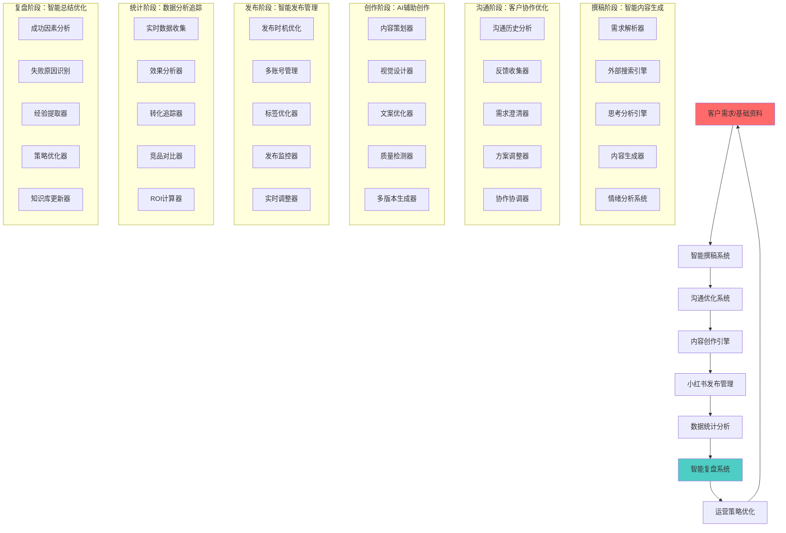
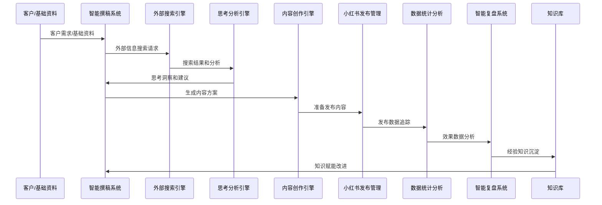

# 全流程智能运营架构 - 小红书内容创作到发布复盘完整链路

> **设计目标**：构建"撰稿→沟通→内容创作→发布→统计复盘"的全流程智能化运营体系

---

## 🔄 完整运营流程架构

### 流程总览

基于小红书内容运营的完整生命周期，构建覆盖从撰稿到复盘的全流程智能运营体系：



## 📝 Phase 1: 智能撰稿系统

### 核心设计理念
**基于客户基础资料和外部搜索的智能内容撰稿**

### 1.1 需求解析与外部搜索

```python
class IntelligentContentWriter:
    """智能撰稿系统"""

    def __init__(self):
        self.requirement_parser = RequirementParser()           # 需求解析器
        self.external_searcher = ExternalSearchEngine()         # 外部搜索引擎
        self.thinking_analyzer = ThinkingAnalyzer()             # 思考分析引擎
        self.content_generator = ContentGenerator()           # 内容生成器
        self.emotion_analyzer = EmotionAnalyzer()             # 情绪分析系统

    async def write_intelligent_content(self, customer_requirements: Dict, base_materials: Dict) -> Dict[str, Any]:
        """智能内容撰稿流程"""

        # Step 1: 需求解析和颗粒度拆解
        parsed_requirements = await self.requirement_parser.parse_and_decompose(
            customer_requirements,
            decomposition_levels=[
                'strategic_objectives',    # 战略目标
                'content_themes',         # 内容主题
                'target_audience',         # 目标受众
                'key_messages',           # 核心信息
                'content_format',          # 内容格式
                'publication_channels'     # 发布渠道
            ]
        )

        # Step 2: 外部信息搜索和资料收集
        external_intelligence = await self.external_searcher.comprehensive_search(
            parsed_requirements,
            search_sources=[
                'industry_trends',         # 行业趋势
                'competitor_strategies',   # 竞品策略
                'best_practices',         # 最佳实践
                'user_preferences',        # 用户偏好
                'platform_algorithms'     # 平台算法
            ],
            search_depth='comprehensive'
        )

        # Step 3: 思考分析和策略制定
        strategic_thinking = await self.thinking_analyzer.deep_thinking_analysis(
            parsed_requirements,
            external_intelligence,
            thinking_frameworks=[
                'swot_analysis',           # SWOT分析
                'user_journey_mapping',    # 用户旅程映射
                'content_strategy',        # 内容策略
                'competitive_positioning', # 竞争定位
                'risk_assessment'          # 风险评估
            ]
        )

        # Step 4: 智能内容生成
        generated_content = await self.content_generator.generate_content(
            strategic_thinking,
            base_materials,
            content_types=[
                'headline_variants',       # 标题变体
                'body_content',           # 正文内容
                'call_to_actions',        # 行动召唤
                'visual_concepts',       # 视觉概念
                'social_sharing_elements' # 社交分享元素
            ]
        )

        # Step 5: 情绪分析和优化
        emotion_analysis = await self.emotion_analyzer.analyze_content_emotion(
            generated_content,
            emotion_dimensions=[
                'emotional_impact',       # 情感冲击
                'engagement_potential',   # 互动潜力
                'trust_building',         # 信任建立
                'conversion_motivation'   # 转化动机
            ]
        )

        return {
            'parsed_requirements': parsed_requirements,
            'external_intelligence': external_intelligence,
            'strategic_thinking': strategic_thinking,
            'generated_content': generated_content,
            'emotion_analysis': emotion_analysis,
            'content_optimization_suggestions': self.generate_content_optimization_suggestions(
                generated_content, emotion_analysis
            )
        }

    async def external_search_and_thinking(self, search_query: str, context: Dict) -> Dict[str, Any]:
        """外部搜索和思考分析"""

        # 外部搜索集成
        search_results = await self.external_searcher.multi_source_search(
            query=search_query,
            sources=[
                'web_search',              # 网页搜索
                'news_search',            # 新闻搜索
                'social_media_search',    # 社交媒体搜索
                'academic_search',         # 学术搜索
                'industry_databases'       # 行业数据库
            ],
            filters={
                'time_range': context.get('time_range', '30d'),
                'language': context.get('language', 'zh-CN'),
                'region': context.get('region', 'CN')
            }
        )

        # 思考分析
        thinking_insights = await self.thinking_analyzer.process_search_results(
            search_results,
            thinking_process=[
                'information_synthesis',  # 信息合成
                'pattern_recognition',    # 模式识别
                'insight_extraction',     # 洞察提取
                'recommendation_generation' # 建议生成
            ]
        )

        return {
            'search_query': search_query,
            'search_results': search_results,
            'thinking_insights': thinking_insights,
            'actionable_recommendations': thinking_insights['recommendations'],
            'confidence_score': thinking_insights['confidence_level']
        }
```

### 1.2 情绪分析系统集成

```python
class EmotionAnalysisSystem:
    """情绪分析系统"""

    def __init__(self):
        self.text_emotion_analyzer = TextEmotionAnalyzer()       # 文本情绪分析器
        self.visual_emotion_detector = VisualEmotionDetector()   # 视觉情绪检测器
        self.sentiment_tracker = SentimentTracker()             # 情感追踪器
        self.emotion_optimizer = EmotionOptimizer()             # 情绪优化器

    async def analyze_content_emotion_comprehensive(self, content_data: Dict) -> Dict[str, Any]:
        """全面情绪分析"""

        # 文本情绪分析
        if 'text_content' in content_data:
            text_emotion = await self.text_emotion_analyzer.analyze_text_emotion(
                content_data['text_content'],
                emotion_categories=[
                    'positive_sentiment',    # 正面情感
                    'negative_sentiment',    # 负面情感
                    'neutral_sentiment',     # 中性情感
                    'emotional_intensity',    # 情感强度
                    'trust_level',           # 信任水平
                    'purchase_intent'        # 购买意向
                ]
            )
        else:
            text_emotion = None

        # 视觉情绪检测
        if 'visual_elements' in content_data:
            visual_emotion = await self.visual_emotion_detector.detect_visual_emotion(
                content_data['visual_elements'],
                visual_indicators=[
                    'color_psychology',       # 色彩心理学
                    'facial_expression',     # 面部表情
                    'body_language',         # 身体语言
                    'scene_atmosphere',      # 场景氛围
                    'product_presentation'   # 产品呈现
                ]
            )
        else:
            visual_emotion = None

        # 情感追踪分析
        sentiment_tracking = await self.sentiment_tracker.track_sentiment_trends(
            content_data,
            tracking_dimensions=[
                'audience_reaction',       # 受众反应
                'engagement_patterns',     # 互动模式
                'viral_potential',        # 病毒潜力
                'brand_association',      # 品牌关联
                'conversion_signals'       # 转化信号
            ]
        )

        # 情绪优化建议
        optimization_suggestions = await self.emotion_optimizer.generate_emotion_optimization(
            text_emotion, visual_emotion, sentiment_tracking,
            optimization_goals=[
                'increase_positive_engagement',  # 增加正面互动
                'enhance_trust_building',       # 增强信任建立
                'boost_conversion_potential',    # 提升转化潜力
                'improve_viral_sharing'          # 改善病毒分享
            ]
        )

        return {
            'text_emotion_analysis': text_emotion,
            'visual_emotion_detection': visual_emotion,
            'sentiment_tracking': sentiment_tracking,
            'emotion_optimization': optimization_suggestions,
            'overall_emotion_score': self.calculate_overall_emotion_score(
                text_emotion, visual_emotion, sentiment_tracking
            )
        }
```

---

## 💬 Phase 2: 沟通优化系统

### 核心设计理念
**基于客户反馈的智能沟通优化和需求澄清**

### 2.1 沟通历史分析和反馈处理

```python
class CommunicationOptimizationSystem:
    """沟通优化系统"""

    def __init__(self):
        self.communication_analyzer = CommunicationAnalyzer()   # 沟通分析器
        self.feedback_collector = FeedbackCollector()           # 反馈收集器
        self.requirement_clarifier = RequirementClarifier()    # 需求澄清器
        self.collaboration_coordinator = CollaborationCoordinator() # 协作协调器

    async def optimize_communication_flow(self, initial_requirements: Dict, communication_history: List[Dict]) -> Dict[str, Any]:
        """优化沟通流程"""

        # 沟通历史分析
        communication_insights = await self.communication_analyzer.analyze_communication_patterns(
            communication_history,
            analysis_aspects=[
                'clarification_frequency',   # 澄清频率
                'feedback_patterns',        # 反馈模式
                'communication_efficiency', # 沟通效率
                'requirement_evolution',    # 需求演变
                'stakeholder_satisfaction'  # 利益相关者满意度
            ]
        )

        # 反馈收集和分析
        feedback_analysis = await self.feedback_collector.collect_and_analyze_feedback(
            initial_requirements,
            feedback_sources=[
                'customer_feedback',        # 客户反馈
                'internal_reviews',         # 内部评审
                'user_testing_results',     # 用户测试结果
                'performance_metrics'        # 性能指标
            ]
        )

        # 需求澄清和优化
        clarified_requirements = await self.requirement_clarifier.clarify_and_refine_requirements(
            initial_requirements,
            communication_insights,
            feedback_analysis,
            clarification_methods=[
                'gap_analysis',            # 差距分析
                'ambiguity_resolution',    # 歧义解决
                'priority_setting',         # 优先级设置
                'feasibility_assessment',  # 可行性评估
                'risk_identification'     # 风险识别
            ]
        )

        # 协作协调
        collaboration_plan = await self.collaboration_coordinator.create_optimal_collaboration_plan(
            clarified_requirements,
            communication_insights,
            coordination_strategies=[
                'stakeholder_alignment',   # 利益相关者对齐
                'communication_channels',  # 沟通渠道
                'review_processes',        # 评审流程
                'feedback_loops',          # 反馈循环
                'decision_making'          # 决策制定
            ]
        )

        return {
            'communication_insights': communication_insights,
            'feedback_analysis': feedback_analysis,
            'clarified_requirements': clarified_requirements,
            'collaboration_plan': collaboration_plan,
            'next_communication_steps': self.define_next_communication_steps(
                clarified_requirements, collaboration_plan
            )
        }
```

---

## 🎨 Phase 3: 内容创作引擎

### 核心设计理念
**基于AI辅助的智能化内容创作和多版本生成**

### 3.1 智能内容创作和多版本生成

```python
class IntelligentContentCreationEngine:
    """智能内容创作引擎"""

    def __init__(self):
        self.content_planner = ContentPlanner()                 # 内容策划器
        self.ai_design_assistant = AIDesignAssistant()         # AI设计助手
        self.copywriter_optimizer = CopywriterOptimizer()       # 文案优化器
        self.quality_checker = ContentQualityChecker()          # 质量检测器
        self.multi_version_generator = MultiVersionGenerator()   # 多版本生成器

    async def create_intelligent_content(self, optimized_requirements: Dict, brand_guidelines: Dict) -> Dict[str, Any]:
        """智能内容创作"""

        # 内容策划
        content_strategy = await self.content_planner.develop_content_strategy(
            optimized_requirements,
            brand_guidelines,
            strategy_elements=[
                'content_pillars',          # 内容支柱
                'messaging_framework',     # 信息框架
                'tone_of_voice',           # 语气风格
                'visual_identity',         # 视觉识别
                'engagement_tactics',       # 互动策略
                'conversion_objectives'    # 转化目标
            ]
        )

        # AI辅助设计
        design_concepts = await self.ai_design_assistant.generate_design_concepts(
            content_strategy,
            design_types=[
                'image_concepts',          # 图片概念
                'video_storyboards',       # 视频故事板
                'layout_variants',         # 布局变体
                'color_schemes',          # 色彩方案
                'typography_selection',    # 字体选择
                'brand_element_integration' # 品牌元素集成
            ]
        )

        # 文案优化
        optimized_copy = await self.copywriter_optimizer.optimize_copywriting(
            content_strategy,
            optimization_focus=[
                'headline_optimization',   # 标题优化
                'body_copy_enhancement',  # 正文增强
                'cta_refinement',         # 行动召唤优化
                'seo_optimization',       # SEO优化
                'emotional_resonance',     # 情感共鸣
                'brand_consistency'       # 品牌一致性
            ]
        )

        # 质量检测
        quality_assessment = await self.quality_checker.comprehensive_quality_check(
            {
                'strategy': content_strategy,
                'design': design_concepts,
                'copy': optimized_copy
            },
            quality_criteria=[
                'brand_alignment',        # 品牌对齐
                'message_clarity',        # 信息清晰
                'visual_appeal',          # 视觉吸引力
                'engagement_potential',  # 互动潜力
                'conversion_optimization' # 转化优化
            ]
        )

        # 多版本生成
        content_versions = await self.multi_version_generator.generate_multiple_versions(
            {
                'strategy': content_strategy,
                'design': design_concepts,
                'copy': optimized_copy
            },
            version_variations=[
                'a_b_test_variants',      # A/B测试变体
                'platform_adaptations',  # 平台适配
                'audience_segments',     # 受众细分
                'timing_optimizations',  # 时机优化
                'format_variations'       # 格式变体
            ]
        )

        return {
            'content_strategy': content_strategy,
            'design_concepts': design_concepts,
            'optimized_copy': optimized_copy,
            'quality_assessment': quality_assessment,
            'content_versions': content_versions,
            'recommended_version': self.recommend_optimal_version(
                content_versions, quality_assessment
            )
        }
```

---

## 📤 Phase 4: 小红书发布管理

### 核心设计理念
**基于小红书平台特性的智能发布时机优化和多账号管理**

### 4.1 智能发布时机和策略优化

```python
class XiaohongshuPublishingManager:
    """小红书发布管理器"""

    def __init__(self):
        self.publishing_optimizer = PublishingOptimizer()       # 发布优化器
        self.account_manager = MultiAccountManager()            # 多账号管理器
        self.tag_optimizer = TagOptimizer()                      # 标签优化器
        self.monitoring_system = RealTimeMonitoringSystem()    # 实时监控系统
        self.adjustment_engine = RealTimeAdjustmentEngine()     # 实时调整引擎

    async def manage_intelligent_publishing(self, content_package: Dict, publishing_strategy: Dict) -> Dict[str, Any]:
        """智能发布管理"""

        # 发布时机优化
        optimal_timing = await self.publishing_optimizer.optimize_publishing_timing(
            content_package,
            optimization_factors=[
                'audience_activity',         # 受众活跃度
                'competition_level',        # 竞争水平
                'platform_algorithm',       # 平台算法
                'seasonal_trends',          # 季节性趋势
                'time_zone_consideration' # 时区考虑
            ]
        )

        # 多账号管理
        account_strategy = await self.account_manager.optimize_account_strategy(
            content_package,
            account_management=[
                'account_selection',        # 账号选择
                'content_distribution',    # 内容分发
                'posting_schedule',         # 发布时间表
                'audience_targeting',       # 受众定位
                'resource_allocation'      # 资源分配
            ]
        )

        # 标签优化
        optimized_tags = await self.tag_optimizer.optimize_hashtag_strategy(
            content_package,
            optimization_approaches=[
                'trending_hashtags',       # 趋势标签
                'niche_tags',             # 细分标签
                'brand_hashtags',         # 品牌标签
                'engagement_tags',         # 互动标签
                'conversion_tags'          # 转化标签
            ]
        )

        # 实时发布监控
        monitoring_setup = await self.monitoring_system.setup_real_time_monitoring(
            content_package,
            monitoring_metrics=[
                'engagement_metrics',      # 互动指标
                'reach_metrics',           # 触达指标
                'conversion_metrics',      # 转化指标
                'sentiment_metrics',       # 情感指标
                'algorithm_response'      # 算法响应
            ]
        )

        # 实时调整引擎
        adjustment_capabilities = await self.adjustment_engine.configure_adjustment_engine(
            content_package,
            adjustment_triggers=[
                'performance_drop',         # 性能下降
                'viral_signal',            # 病毒信号
                'negative_sentiment',       # 负面情感
                'algorithm_change',         # 算法变化
                'competitor_activity'       # 竞品活动
            ]
        )

        return {
            'optimal_timing': optimal_timing,
            'account_strategy': account_strategy,
            'optimized_tags': optimized_tags,
            'monitoring_setup': monitoring_setup,
            'adjustment_capabilities': adjustment_capabilities,
            'publishing_plan': self.create_comprehensive_publishing_plan(
                optimal_timing, account_strategy, optimized_tags
            )
        }
```

---

## 📊 Phase 5: 数据统计分析

### 核心设计理念
**实时数据收集、效果分析和ROI计算**

### 5.1 实时数据收集和效果分析

```python
class DataAnalyticsSystem:
    """数据统计分析系统"""

    def __init__(self):
        self.real_time_collector = RealTimeDataCollector()         # 实时数据收集器
        self.effectiveness_analyzer = EffectivenessAnalyzer()   # 效果分析器
        self.conversion_tracker = ConversionTracker()           # 转化追踪器
        self.competitor_analyzer = CompetitorAnalyzer()           # 竞品分析器
        self.roi_calculator = ROICalculator()                       # ROI计算器

    async def analyze_publishing_performance(self, published_content: Dict, analysis_timeframe: str) -> Dict[str, Any]:
        """分析发布表现"""

        # 实时数据收集
        real_time_data = await self.real_time_collector.collect_comprehensive_data(
            published_content,
            data_categories=[
                'engagement_data',          # 互动数据
                'reach_data',              # 触达数据
                'impression_data',         # 展示数据
                'click_data',               # 点击数据
                'conversion_data',         # 转化数据
                'social_sharing_data'       # 社交分享数据
            ],
            collection_frequency='real-time',
            timeframe=analysis_timeframe
        )

        # 效果分析
        effectiveness_analysis = await self.effectiveness_analyzer.analyze_effectiveness(
            real_time_data,
            effectiveness_metrics=[
                'engagement_rate',         # 互动率
                'reach_efficiency',       # 触达效率
                'content_performance',    # 内容表现
                'audience_response',       # 受众响应
                'viral_coefficient',      # 病毒系数
            ]
        )

        # 转化追踪
        conversion_analysis = await self.conversion_tracker.track_conversion_journey(
            published_content,
            conversion_pathways=[
                'view_to_click',          # 查看到点击
                'click_to_engage',        # 点击到互动
                'engage_to_purchase',     # 互动到购买
                'purchase_to_loyalty',    # 购买到忠诚
                'loyalty_to_advocacy'     # 忠诚度到推荐
            ]
        )

        # 竞品分析
        competitor_analysis = await self.competitor_analyzer.analyze_competitor_performance(
            published_content,
            analysis_aspects=[
                'market_position',         # 市场定位
                'content_comparison',      # 内容对比
                'performance_benchmark',   # 性能基准
                'trend_analysis',         # 趋势分析
                'opportunity_identification' # 机会识别
            ]
        )

        # ROI计算
        roi_analysis = await self.roi_calculator.calculate_comprehensive_roi(
            {
                'published_content': published_content,
                'performance_data': real_time_data,
                'cost_structure': published_content.get('cost_breakdown', {}),
                'revenue_streams': conversion_analysis['revenue_data']
            },
            roi_dimensions=[
                'content_roi',             # 内容ROI
                'campaign_roi',           # 活动ROI
                'platform_roi',           # 平台ROI
                'time_roi',               # 时间ROI
                'resource_roi'            # 资源ROI
            ]
        )

        return {
            'real_time_data': real_time_data,
            'effectiveness_analysis': effectiveness_analysis,
            'conversion_analysis': conversion_analysis,
            'competitor_analysis': competitor_analysis,
            'roi_analysis': roi_analysis,
            'performance_summary': self.generate_performance_summary(
                effectiveness_analysis, conversion_analysis, roi_analysis
            ),
            'actionable_insights': self.generate_actionable_insights(
                real_time_data, effectiveness_analysis, competitor_analysis
            )
        }
```

---

## 🔄 Phase 6: 智能复盘系统

### 核心设计理念
**自动成功因素分析、失败原因识别和经验提取**

### 6.1 智能复盘分析和知识库更新

```python
class IntelligentReviewSystem:
    """智能复盘系统"""

    def __init__(self):
        self.success_analyzer = SuccessFactorAnalyzer()           # 成功因素分析器
        self.failure_identified = FailureCauseIdentifier()         # 失败原因识别器
        self.experience_extractor = ExperienceExtractor()           # 经验提取器
        self.strategy_optimizer = StrategyOptimizer()               # 策略优化器
        self.knowledge_updater = KnowledgeBaseUpdater()           # 知识库更新器

    async def conduct_intelligent_review(self, campaign_data: Dict, performance_results: Dict) -> Dict[str, Any]:
        """执行智能复盘"""

        # 成功因素分析
        success_factors = await self.success_analyzer.analyze_success_factors(
            campaign_data,
            performance_results,
            success_criteria=[
                'high_engagement_content',  # 高互动内容
                'viral_amplification',      # 病毒放大
                'efficient_conversion',    # 高效转化
                'brand_lift',              # 品牌提升
                'cost_effectiveness'       # 成本效益
            ]
        )

        # 失败原因识别
        failure_causes = await self.failure_identified.identify_failure_causes(
            campaign_data,
            performance_results,
            failure_categories=[
                'low_engagement',          # 低互动
                'poor_conversion',         # 差转化
                'brand_safety_issues',     # 品牌安全问题
                'algorithm_penalties',     # 算法惩罚
                'negative_sentiment'       # 负面情感
            ]
        )

        # 经验提取
        learned_experiences = await self.experience_extractor.extract_valuable_experiences(
            {
                'campaign_data': campaign_data,
                'performance_results': performance_results,
                'success_factors': success_factors,
                'failure_causes': failure_causes
            },
            extraction_areas=[
                'content_strategy',        # 内容策略
                'timing_optimization',    # 时机优化
                'audience_targeting',      # 受众定位
                'platform_algorithms',     # 平台算法
                'resource_allocation'     # 资源分配
            ]
        )

        # 策略优化
        optimization_recommendations = await self.strategy_optimizer.generate_optimization_recommendations(
            learned_experiences,
            optimization_focus=[
                'content_improvements',    # 内容改进
                'process_optimization',  # 流程优化
                'resource_efficiency',   # 资源效率
                'technology_enhancement', # 技术增强
                'skill_development'        # 技能发展
            ]
        )

        # 知识库更新
        knowledge_updates = await self.knowledge_updater.update_knowledge_base(
            {
                'campaign_results': performance_results,
                'learned_experiences': learned_experiences,
                'optimization_recommendations': optimization_recommendations
            },
            knowledge_categories=[
                'content_best_practices',   # 内容最佳实践
                'platform_insights',       # 平台洞察
                'audience_understanding',  # 受众理解
                'competitive_intelligence', # 竞品情报
                'trend_predictions'       # 趋势预测
            ]
        )

        return {
            'success_factors': success_factors,
            'failure_causes': failure_causes,
            'learned_experiences': learned_experiences,
            'optimization_recommendations': optimization_recommendations,
            'knowledge_updates': knowledge_updates,
            'review_summary': self.generate_comprehensive_review_summary(
                campaign_data, performance_results, success_factors, failure_causes
            ),
            'next_phase_strategy': self.develop_next_phase_strategy(
                learned_experiences, optimization_recommendations
            )
        }
```

---

## 🎯 全流程协同机制

### 端到端数据流和决策循环



### 全流程性能保障

1. **实时数据处理**：流式数据管道、实时计算引擎
2. **智能决策支持**：机器学习模型、预测分析
3. **自动化优化**：基于数据的自动调整和优化
4. **质量保证体系**：多层质量检查、风险评估

### 全流程价值创造

1. **效率提升**：自动化流程减少人工操作，提升运营效率
2. **效果优化**：基于数据的持续优化，提升种草效果
3. **成本控制**：智能资源分配，最大化ROI
4. **知识积累**：经验沉淀和知识库建设，形成持续改进循环

---

**文档状态**: 全流程智能运营架构设计完成
**更新日期**: 2025-11-18
**架构师**: LaunchX Team + 小红书运营专家
**流程特色**: 覆盖撰稿到复盘的完整智能运营链路