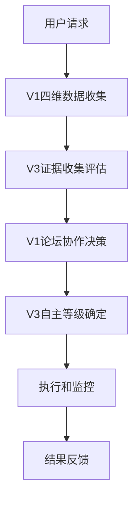

# V1V3方法论集成系统

> **核心理念**: Gate OS调度层在CC原生基础之上生长，融合V1小红书运营实践智慧和V3证据驱动决策哲学

## 🏗️ 系统架构

### 三层架构设计
```
Layer 3: 客户MD驱动层
    ↓ 用户请求和配置
Layer 2: Gate OS调度层 (在CC基础上生长)
    ↓ V1V3组件协调和调度
Layer 1: CC原生基础架构
    ↓ 底层工具和能力支撑
```

### V1V3组件映射
- **V1 小红书运营实践智慧** → Gate OS调度Agent
  - 四维数据收集 (40%): `tools/four_dimensional_data_collector.py`
  - 论坛协作机制 (35%): `agents/forum_collaboration_agent.py`
  - 动态迭代引擎 (25%): 集成到工作流引擎中

- **V3 证据驱动决策哲学** → CC原生工具 + Gate OS调度Agent
  - 证据账本系统: `tools/evidence_ledger.py`
  - 自主等级管理: `agents/autonomy_level_management.py`
  - 成本优化架构: 集成到系统级工具中

## 🚀 快速开始

### 1. 环境准备
```bash
# 确保Python环境
python3 --version

# 安装依赖 (如果需要)
pip install -r requirements.txt
```

### 2. 运行集成演示
```bash
# 运行完整的V1V3集成演示
python3 demo_v1_v3_integration.py
```

### 3. 组件功能测试
```bash
# 测试各个组件的基本功能
python3 test_v1v3_components.py
```

## 📋 组件详细说明

### V1四维数据收集器
**文件**: `src/tools/four_dimensional_data_collector.py`

**功能**: 收集四个维度的数据支持内容创作决策
- **AI工具市场**: 分析当前流行的AI创作工具
- **用户行为**: 理解目标用户的内容偏好
- **竞争对手**: 监控竞品的内容策略
- **行业趋势**: 把握内容创作的发展方向

**使用示例**:
```python
from tools.four_dimensional_data_collector import FourDimensionalDataCollector

collector = FourDimensionalDataCollector()
data = await collector.collect_comprehensive_data("美食探店内容创作")
```

### V3证据账本系统
**文件**: `src/tools/evidence_ledger.py`

**功能**: 基于证据金字塔进行决策支持
- **5级证据分类**: 从直接观察到二手数据
- **三角校验**: 多源证据交叉验证
- **置信度计算**: 量化决策的可信程度

**证据金字塔**:
1. **Level 1**: 直接观察 (置信度权重: 1.0)
2. **Level 2**: 对照实验 (置信度权重: 0.9)
3. **Level 3**: 准实验 (置信度权重: 0.7)
4. **Level 4**: 面板数据 (置信度权重: 0.5)
5. **Level 5**: 二手数据 (置信度权重: 0.3)

**使用示例**:
```python
from tools.evidence_ledger import EvidenceLedgerTool

ledger = EvidenceLedgerTool()
evidence = await ledger.record_evidence({
    'content': '美食内容点击率提升20%',
    'source': 'a_b_test',
    'evidence_type': 'controlled_experiment',
    'claim_id': 'claim_001'
})
```

### V1论坛协作Agent
**文件**: `src/agents/forum_collaboration_agent.py`

**功能**: 7个专业Agent协作决策
- **市场分析师**: 分析市场趋势和机会
- **内容策略师**: 制定内容策略和方向
- **数据科学家**: 提供数据洞察和分析
- **创意总监**: 提供创意指导和质量把控
- **社群经理**: 理解用户需求和社群动态
- **技术专家**: 评估技术实现可行性
- **业务分析师**: 分析商业价值和ROI

**使用示例**:
```python
from agents.forum_collaboration_agent import ForumCollaborationSchedulingAgent

agent = ForumCollaborationSchedulingAgent()
result = await agent.coordinate_forum_collaboration({
    'task_id': 'content_creation_001',
    'user_request': '创建美食探店内容',
    'collaboration_mode': 'full_insight_integration'
})
```

### V3自主等级管理Agent
**文件**: `src/agents/autonomy_level_management.py`

**功能**: 基于风险和影响确定决策自主程度
- **LOA0 建议**: 完全人工决策
- **LOA1 备选方案**: 提供多个选择
- **LOA2 低风险自动**: 自动执行低风险任务
- **LOA3 护栏内自动**: 在安全范围内自动执行
- **LOA4 人类专属**: 高风险决策必须人工介入

**使用示例**:
```python
from agents.autonomy_level_management import AutonomyLevelManagementAgent

agent = AutonomyLevelManagementAgent()
analysis = await agent.analyze_decision_characteristics({
    'user_request': '发布新内容',
    'complexity_level': 'medium',
    'risk_tolerance': 'moderate'
})
loa = await agent.determine_autonomy_level(analysis)
```

## 🔄 完整工作流程

### 标准执行流程


### 代码实现
```python
from demo_v1_v3_integration import GateOSV1V3IntegrationDemo

# 创建集成系统
demo_system = GateOSV1V3IntegrationDemo()

# 执行完整流程
result = await demo_system.demonstrate_content_creation_workflow(
    "创建美食探店小红书内容"
)

# 获取综合推荐
recommendations = result['integrated_recommendations']
next_steps = result['next_steps']
```

## 📊 质量指标

### 性能目标
- **V1数据收集**: ≤30秒完成四维数据收集
- **V3证据评估**: ≤10秒完成证据三角校验
- **论坛协作**: ≤60秒完成7个Agent协作
- **LOA决策**: ≤5秒确定自主等级

### 质量标准
- **证据置信度**: ≥0.7为高置信度决策
- **论坛共识度**: ≥0.8为强共识推荐
- **执行成功率**: ≥95%为高质量执行

## 🛠️ 开发和扩展

### 添加新的数据维度
```python
# 在FourDimensionalDataCollector中添加新维度
class CustomDataCollector:
    def __init__(self):
        self.dimensions = {
            'custom_dimension': CustomDimensionCollector(),
            # 其他维度...
        }
```

### 扩展专业Agent
```python
# 在ForumCollaborationSchedulingAgent中添加新Agent
class CustomProfessionalAgent(BaseProfessionalAgent):
    async def analyze_task(self, task: Dict) -> AgentResult:
        # 实现专业分析逻辑
        pass
```

### 自定义LOA规则
```python
# 在AutonomyLevelManagementAgent中自定义LOA规则
class CustomLOARules:
    def determine_loa(self, analysis: Dict) -> LOALevel:
        # 实现自定义LOA决策逻辑
        pass
```

## 🔧 故障排除

### 常见问题
1. **导入错误**: 确保在正确的目录中运行脚本
2. **异步错误**: 检查async/await语法使用
3. **依赖缺失**: 安装所需的Python包

### 调试建议
1. 使用测试脚本验证单个组件功能
2. 检查日志输出定位问题
3. 逐步调试集成流程

## 📚 相关文档

> 注：早期 V1/V3 融合设计文档已统一并入 `dev-docs/` 现有结构，如需查看最新设计，请以 `dev-docs/README.md` 为入口。

## 🎯 使用场景

### 内容创作
- 基于数据驱动的选题决策
- 多专业角度的内容优化
- 证据支持的发布策略

### 运营决策
- 用户行为分析的运营调整
- 竞品分析的市场策略
- ROI最大化的资源分配

### 风险管理
- 内容合规性自动检查
- 品牌安全性评估
- 危机预警和应对

> **核心理念**: 通过V1实践智慧和V3证据决策的融合，构建智能、高效、可靠的AI运营系统，实现客户MD驱动的全链条自动化。
