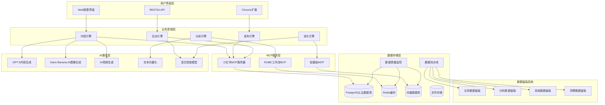
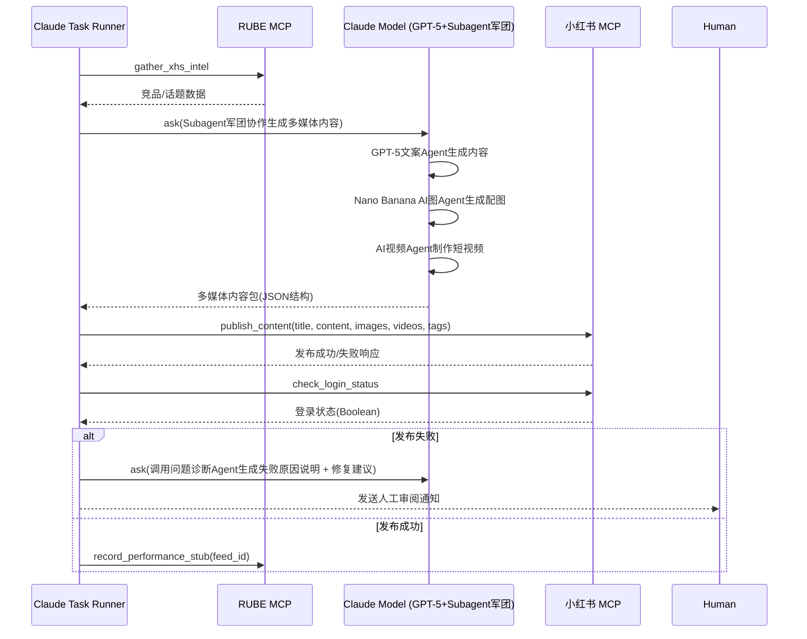

# 📱 小红书AI自动化运营系统 v1.0
# XiaoHongShu AI Automation System

<div align="center">

[](https://github.com/launchx/xiaohongshu-automation)
[](#mcp-integration)
[](#multi-account)
[](#ai-evolution)

**企业级小红书智能自动化运营解决方案**  
*Multi-Account XiaoHongShu Automation with AI-Driven Evolution*

[🚀 快速开始](#quick-start) | [📖 技术文档](#documentation) | [🔧 API参考](#api-reference) | [📊 案例分析](#case-studies)

</div>

## 🎯 设计哲学 | Design Philosophy

### 核心理念 - "智能进化的社交媒体运营生态"

本系统基于四大核心设计原则构建，致力于打造下一代AI驱动的社交媒体自动化运营平台：

#### 1. 🧠 混合智能架构 (Hybrid Intelligence Architecture)
```yaml
人机协作模式:
  人类智能层: "战略决策 + 创意指导 + 价值判断"
  AI执行层: "内容生成 + 数据分析 + 自动化执行"
  反馈进化层: "性能监控 + 策略优化 + 自我学习"

设计优势:
  - 结合人类创意和AI效率
  - 保持品牌调性的同时实现规模化
  - 基于数据反馈的持续优化
```

#### 2. 🔄 数据驱动的自进化系统 (Data-Driven Evolution)
```yaml
进化循环:
  数据收集 → 模式识别 → 策略调整 → 效果验证 → 知识沉淀

核心指标:
  - 内容表现: 阅读量、点赞、评论、转发
  - 用户互动: 关注转化、私信质量、用户留存
  - 商业价值: 询盘转化、客户获取成本、ROI

自适应能力:
  - 自动调整发布时间和频率
  - 动态优化内容风格和话题选择
  - 智能调节互动策略和回复风格
```

#### 3. 🏢 多租户企业级架构 (Multi-Tenant Enterprise Architecture)
```yaml
隔离机制:
  技术隔离: "独立MCP端口 + 隔离数据库 + 独立配置"
  业务隔离: "品牌调性 + 内容策略 + 客户数据"
  运营隔离: "发布计划 + 互动规则 + 分析报告"

扩展能力:
  - 支持无限数量企业账户
  - 每个账户独立的AI模型训练
  - 灵活的权限管理和资源分配
```

#### 4. 🔧 模块化微服务架构 (Modular Microservices)
```yaml
核心服务模块:
  内容引擎: "AI内容生成 + 多媒体处理 + 风格适配"
  发布引擎: "定时发布 + 状态监控 + 异常处理"
  互动引擎: "评论监控 + 智能回复 + 客户服务"
  分析引擎: "数据收集 + 性能分析 + 策略建议"
  进化引擎: "机器学习 + 策略优化 + 知识图谱"
  存储引擎: "全链路数据留痕 + 智能检索 + 质量保证"

技术栈:
  - MCP协议: 工具互操作性和扩展性
  - Chrome Extension: 浏览器自动化和DOM控制
  - Lightweight MCP: 边缘计算和实时处理
  - AI模型: 内容生成和智能决策
  - 数据存储: PostgreSQL + Redis + 向量数据库
```

#### 5. 📊 全链路数据留痕系统 (Comprehensive Data Tracking)
```yaml
数据留痕理念:
  收集留痕: "所有数据收集过程记录来源、时间、方法"
  处理留痕: "数据处理的每个步骤记录算法、参数、结果"
  决策留痕: "AI决策过程记录推理逻辑、置信度、影响因素"
  执行留痕: "策略执行结果记录效果、反馈、学习点"

核心存储架构:
  业务数据: "账号管理 + 内容发布 + 用户互动 + 表现指标"
  分析数据: "竞品监控 + 策略执行 + AI决策推理 + 学习评估"
  系统数据: "MCP调用日志 + 系统性能 + 数据质量 + 错误追踪"
  洞察数据: "综合报告 + 知识提取 + 经验沉淀 + 优化建议"

智能检索能力:
  多维索引: "时间、类型、来源、质量等多维度快速检索"
  关联发现: "自动发现数据间的关联关系和依赖"
  智能推荐: "基于使用模式推荐相关数据和洞察"
  异常检测: "自动识别数据异常和质量问题"
```

### 系统愿景 - "让每个企业都拥有专属的AI运营专家"

我们的目标是构建一个**自学习、自优化、自进化**的智能运营系统，能够：

- **理解品牌**: 深度学习企业品牌调性和价值观
- **创造内容**: 生成符合品牌特色的高质量内容
- **智能互动**: 提供专业、贴心、高效的客户服务
- **持续进化**: 基于数据反馈不断优化运营策略

## 🚀 快速开始 | Quick Start

以下步骤以本地 Mac + Claude Code Beta 为例，演示如何串联 RUBE MCP 策略收集、启动小红书 MCP，并在 BMAD混合智能架构下通过Subagent军团协作实现端到端自动化。

### 1. 解析客户 PRD

```bash
python automation/process_prd.py --client <client_slug> --prd docs/<client>_prd.md
# 脚本会将 PRD 归档至 clients/<client_slug>/docs/，可查看 questions.md 补齐缺失信息
python automation/spec-kit/bootstrap_client.py --client <client_slug> --config automation/spec-kit/configs/<client_slug>.json --force
```

解析后，即可继续环境配置与自动化执行。

### 2. 环境准备

1. 安装 Claude Code CLI（确保处于 `claude switch beta` 渠道并完成 `claude login`）。
2. 安装 RUBE CLI：`pip install rube-mcp`（或依照官方指南）。
3. 下载并解压小红书 MCP 二进制与登录工具，放置于 `~/Downloads/xiaohongshu-mcp-darwin-*/`。
4. 准备任务工作目录，本项目建议 `automation/claude_tasks/`，存放所有任务定义与脚本。

### 3. 启动小红书 MCP

```bash
cd ~/Downloads/xiaohongshu-mcp-darwin-amd64
./xiaohongshu-login-darwin-amd64       # 首次登录需要人工完成验证码/扫码
./xiaohongshu-mcp-darwin-amd64 \
  --port 18060 \
  --workspace "$HOME/.xiaohongshu-mcp/default" \
  > /tmp/xhs_mcp.log 2>&1 &
```

> 建议将 `workspace` 指定为稳定目录（默认写入 cookies / session），以便多任务复用。

### 4. 配置 RUBE MCP 信息收集

在 `automation/claude_tasks/rube-info-gather.yaml` 中定义需要调用的 RUBE 工作流，例如：

```yaml
version: 1
tasks:
  gather_xhs_intel:
    description: "采集竞品、话题与数据图谱"
    steps:
      - use: rube://search/trending_topics
        with:
          platform: xhs
          keyword: "AI创业"
          ai_model: "gpt-5"
      - use: rube://search/competitor_accounts
        with:
          limit: 5
          analysis_engine: "bmad"
      - use: rube://summarize/market_signals
        with:
          subagent_legion: true
```

在 Claude CLI 中注册 RUBE MCP：

```bash
claude mcp add --transport http rube http://localhost:18100/mcp
```

### 5. 定义 RUBE+Subagent军团任务编排
### 6. 自动化执行

单客户：
```bash
python automation/run_client.py --client <client_slug> --dry-run  # 可选
python automation/run_client.py --client <client_slug>
```

多客户并发：
```bash
python automation/run_all.py --refresh-docs --force
```

执行结果会写入 `clients/<client_slug>/logs/` 与 `clients/<client_slug>/status.json`，情报/草稿产出位于 `clients/<client_slug>/data/`，素材位于 `projects/<client_slug>/assets/`。

### 7. 能力边界与数据飞轮

1. **能力确认**：执行前快速核对各组件的边界条件——
   - Rube MCP：是否覆盖本次目标平台、是否需要新增工作流或调节速率；
   - 小红书 MCP：发布/互动接口是否满足需求，若需复杂交互则改用 Playwright；
   - Playwright MCP：脚本是否通过验证码、动态加载等验证；
   - BMAD Subagent：模板中是否包含行业专家、合规角色。
2. **数据采集 → 策略 → 执行 → 监控飞轮**：
   - 采集层：Rube 批量情报（写入 `data/intel/`）+ Playwright 捕捉高价值互动；
   - 策略层：BMAD 基于情报与 `status.json` 指标自动迭代策略、内容模板；
   - 执行层：XHS MCP 完成标准动作，Playwright 处理复杂手动流程，图像/视频 MCP 生成素材；
   - 监控层：Rube 回写表现数据，`status.json` 记录运行结果，为下一周期提供输入。
3. **趋势发现与告警**：设置 Rube 监控规则，对热点、负面舆情、政策更新进行提醒，可触发 Playwright/BMAD 自动响应，并纳入周报复盘。


创建 `automation/claude_tasks/publish-xhs.yaml`：

```yaml
version: 1
tasks:
  xhs_full_auto:
    description: "RUBE 信息收集 → BMAD混合智能+Subagent军团协作生成内容 → 通过小红书 MCP 发布"
    context:
      mcpServers:
        - rube
        - xiaohongshu-mcp
      ai_models:
        - gpt-5
        - nano-banana
        - video-generation
    steps:
      - run: rube.gather_xhs_intel
      - ask: |
          请基于上一步的行业洞察，调用Subagent军团协作生成：
          - GPT-5文案创作Agent: 20字标题 + 三段正文
          - Nano Banana AI图像Agent: 配套视觉内容
          - AI视频生成Agent: 短视频内容
          - 标签策略Agent: 3个精准标签
      - use: xiaohongshu-mcp.publish_content
        with:
          title: "{{step.prev.data.title}}"
          content: "{{step.prev.data.body}}"
          images: "{{step.prev.data.images}}"
          videos: "{{step.prev.data.videos}}"
          tags: "{{step.prev.data.tags}}"
      - use: xiaohongshu-mcp.check_login_status
```

> `ask` 步骤会由 Claude 自动调用偏好模型生成结构化内容，后续 `publish_content` 直接复用。

### 5. 运行任务

```bash
claude tasks run automation/claude_tasks/publish-xhs.yaml xhs_full_auto
```

任务执行过程中，Claude 会自动调用 RUBE MCP 获取数据，在BMAD混合智能架构下通过Subagent军团协作生成多媒体内容（GPT-5+Nano Banana+AI视频），再通过小红书 MCP 发布，最后校验登录状态。

### 6. 常用调试命令

- 查看小红书 MCP 日志：`tail -f /tmp/xhs_mcp.log`
- 列出可用工具：`claude mcp list`
- 手动调用工具调试：

  ```bash
  curl -X POST http://localhost:18060/mcp \
    -H "Content-Type: application/json" \
    -d '{"jsonrpc":"2.0","method":"tools/call","params":{"name":"check_login_status","arguments":{}},"id":1}'
  ```

### 7. Spec Kit 模板化启动

- 模板目录：`automation/spec-kit/templates/`
- 示例项目：`automation/spec-kit/projects/demo/`

使用流程：

1. 复制模板到客户目录：
   ```bash
   CLIENT=acme
   DEST=automation/spec-kit/projects/$CLIENT
   mkdir -p "$DEST"
   cp automation/spec-kit/templates/* "$DEST"/
   ```
2. 替换占位符（如 `{{client_name}}`）并补充素材路径、指标要求。
3. 将 `tasks.md` 中的 YAML 片段复制到 `automation/claude_tasks/<client>.yaml`。
4. 运行 `claude tasks run automation/claude_tasks/<client>.yaml <task_id>`，产出写入 `projects/<client>/runs/`。

### 8. 多媒体生成工作流

- `automation/claude_tasks/hooks/multimedia-batch.yaml`：统一的多媒体生成 Hook，可被主任务通过 `run` 调用。
- 模板 `client-config.json` 中定义 `nano_banana_config`、`video_generation_models`、`asset_output_dir`，确保任务知道如何落地多媒体内容。
- 推荐流程：
  1. GPT-5 Agent生成文案 JSON；
  2. Nano Banana AI Agent生成配套图片；
  3. AI视频生成Agent制作短视频内容；
  4. 通过 `bmad.content_guard` 进行合规检测；
  5. 将 manifest 中的 `generated_media` 数组传递给 `publish_content`。
- Demo 项目（`automation/spec-kit/projects/demo/`）已含完整示例，可直接复用。

---

## 🚀 系统概述 | System Overview

### 核心功能矩阵

| 功能模块 | 核心能力 | 技术实现 | 商业价值 |
|---------|---------|----------|----------|
| **AI智能内容生成** | 图文视频全媒体内容创作 | GPT-5 + Nano Banana AI + AI视频生成 | 降低90%内容创作成本 |
| **BMAD混合智能** | Brain-Machine-Agent-Data四层协作 | Subagent军团 + MCP工具生态 | 策略自演进，效率提升300% |
| **多账户管理** | 企业级多账户隔离运营 | MCP多端口 + 数据库分片 | 支持无限客户扩展 |
| **智能发布系统** | 全自动多媒体内容分发 | MCP工具集 + 智能调度 + 异常处理 | 提升50%发布效率 |
| **AI智能客服** | 24/7自动评论回复和客户服务 | 5级情感分析 + 意图识别 + 知识库 | 提升80%响应速度 |
| **数据驱动优化** | 智能策略优化和预测分析 | 机器学习 + A/B测试 + 预测模型 | 提升60%内容表现 |
| **自进化学习** | 基于数据留痕的自动优化 | 强化学习 + 知识图谱 + 模式识别 | 持续优化ROI |

### 技术架构图



## 🏗️ 核心架构设计 | Core Architecture

### 1. 📊 全链路数据存储架构 (Comprehensive Data Storage Architecture)

#### 数据存储设计理念 - 参考微博项目存储机制
```yaml
存储原则 (基于微博项目经验):
  全留痕原则:
    - 收集留痕: "记录数据来源、采集时间、采集方法"
    - 处理留痕: "记录算法步骤、参数设置、处理结果"
    - 决策留痕: "记录AI推理过程、置信度、影响因素"
    - 执行留痕: "记录策略执行、效果反馈、学习改进"
    
  数据流动追踪:
    - 源头标识: "每条数据的唯一来源和时间戳"
    - 处理链路: "完整的数据流转和变换记录"
    - 版本管控: "数据版本和模型迭代历史"
    - 影响分析: "数据变化对决策的影响追踪"

核心数据表设计:
  业务运营数据:
    - xhs_accounts: "小红书账号档案和配置"
    - daily_content_posts: "内容发布记录和元数据"
    - content_performance_metrics: "内容表现数据追踪"
    - user_interactions: "用户互动和评论记录"
    - ai_auto_responses: "AI自动回复记录和效果"
    
  竞品分析数据:
    - competitor_profiles: "竞品账号档案和监控配置"
    - competitor_content_monitoring: "竞品内容监控记录"
    - competitor_analysis_reports: "竞品分析报告存储"
    
  AI学习数据:
    - strategy_execution_detailed_log: "策略执行详细日志"
    - ai_decision_reasoning_log: "AI决策推理过程记录"
    - learning_effectiveness_evaluation: "学习效果评估记录"
    - knowledge_insights_extraction: "知识洞察提取记录"
    
  系统运维数据:
    - mcp_tool_call_logs: "MCP工具调用详细日志"
    - system_performance_monitoring: "系统性能监控数据"
    - data_quality_monitoring: "数据质量监控记录"
    - comprehensive_analysis_reports: "综合分析报告存储"

数据处理流水线:
  实时数据收集:
    - 内容发布Pipeline: "记录发布意图→执行结果→效果追踪"
    - 用户互动Pipeline: "监控评论→情感分析→智能回复→效果评估"
    - 竞品监控Pipeline: "数据采集→内容分析→洞察提取→策略建议"
    
  批量数据处理:
    - 性能分析Pipeline: "数据聚合→趋势分析→模式识别→优化建议"
    - 学习优化Pipeline: "经验提取→模型训练→策略更新→效果验证"
    - 报告生成Pipeline: "数据整合→分析计算→可视化→报告输出"

数据质量保证:
  自动质量检查: "数据完整性、准确性、一致性、时效性"
  异常检测预警: "数据异常自动识别和告警"
  修复建议生成: "质量问题自动诊断和修复建议"
```

#### 智能数据检索系统
```yaml
检索能力:
  多维索引: "时间、账号、内容类型、策略类型、数据来源"
  智能搜索: "基于关键词、语义相似度、模式匹配"
  关联发现: "自动发现数据关联关系和依赖链条"
  趋势分析: "历史数据趋势和预测性分析"

查询接口:
  账号表现时间线: "get_account_performance_timeline(account_id, days)"
  策略有效性分析: "get_strategy_effectiveness_analysis(account_id, strategy_type)"
  竞品洞察汇总: "get_competitor_insights_summary(industry_category)"
  学习洞察分类: "get_learning_insights_by_category(account_id, category)"
  相似成功策略: "search_similar_successful_strategies(strategy_context)"

数据应用场景:
  人类查阅: "通过Web界面查看历史数据和分析报告"
  AI优化使用: "系统自动学习历史数据优化未来策略"
  客户报告: "自动生成客户运营报告和效果分析"
  系统监控: "实时监控系统运行状态和数据质量"
```

### 2. MCP集成架构 (Model Context Protocol Integration)

#### 小红书MCP服务器集群
```yaml
主服务器配置:
  端口: 18060
  功能: "账户管理 + 内容发布 + 基础监控"
  实例: "xiaohongshu-mcp-darwin-amd64"
  
企业账户MCP集群:
  企业A: "localhost:18061"
  企业B: "localhost:18062"
  企业C: "localhost:18063"
  动态扩展: "自动分配端口18064+"
  
配置管理:
  路径: "~/.claude/mcp-xiaohongshu-cluster.json"
  隔离策略: "每个企业独立MCP实例"
  监控策略: "健康检查 + 自动重启 + 故障转移"
```

#### RUBE MCP工作流集成 (BMAD架构+新AI模型)
```yaml
工作流协调:
  数据采集: "RUBE_MULTI_EXECUTE_TOOL并行采集多平台数据"
  内容生成: "RUBE_REMOTE_WORKBENCH+Subagent军团执行AI内容创作"
  效果分析: "RUBE_SEARCH_TOOLS整合BMAD分析工具链"
  
500+应用生态:
  社交媒体: "小红书 + 微博 + 抖音 + Instagram"
  数据分析: "Google Analytics + 百度统计 + 神策"
  AI服务: "GPT-5 + Nano Banana AI + 视频生成 + Claude + 通义千问"
  存储服务: "AWS S3 + 阿里云OSS + 腾讯云COS"
```

#### Nano Banana AI多媒体MCP集成
```yaml
用途:
  - 图像生成: "Nano Banana AI + FLUX等模型"
  - 视频生成: "AI视频生成引擎 + 多模态内容创作"
  - 素材检索: "内置图库 + 第三方素材库 API"
  - 版权记录: "生成 prompt、模型版本、输出路径"

任务调用:
  - Hook: automation/claude_tasks/hooks/multimedia-batch.yaml
  - 模板占位符: client-config.json → nano_banana_config / video_generation_models
  - 输出: multimedia_manifest.json + 本地多媒体文件目录

合规:
  - `bmad.content_guard` 检查违规元素
  - Subagent审核军团自动识别风险内容
  - 人工复核 checklist 触发条件可配置
```

#### Lightweight MCP边缘计算
```yaml
实时处理能力:
  评论监控: "毫秒级评论检测和预处理"
  情感分析: "本地化情感分析模型"
  意图识别: "快速用户意图分类"
  
边缘部署:
  Chrome Extension: "浏览器内轻量级MCP运行时"
  移动端: "React Native集成的边缘MCP"
  服务器: "Docker容器化的边缘MCP节点"
```

#### 端到端自动化时序



#### 错误处理建议

```yaml
常见异常处理:
  登录失效:
    - 自动重试: 调用 `check_login_status` 若返回 false，触发登录工具脚本
    - 人工兜底: 通知运维重新扫码
  多媒体内容上传失败:
    - 预检测: Subagent任务在发布前验证多媒体文件路径存在
    - 重试: 失败后等待 30 秒重试 2 次
    - 备选: Nano Banana备用模型生成替代内容
  内容违规/审核失败:
    - 记录: 将错误信息写入 `ai_decision_reasoning_log`
    - 调整: 调用Subagent审核军团重新生成合规内容
    - 智能修复: BMAD混合智能自动识别问题并修正
  RUBE 工作流异常:
    - 回退: 使用缓存的最新一次成功数据
    - 告警: 触发 `rube://notify/ops` 通知
    - Subagent自愈: Subagent军团自动诊断和修复常见问题
  AI模型异常 (GPT-5/Nano Banana):
    - 模型切换: 自动切换到备用AI模型
    - 质量保证: Subagent审核军团验证输出质量
```

### 2. Chrome扩展深度集成 (Chrome Extension Deep Integration)

#### 浏览器自动化能力
```javascript
// Chrome扩展核心功能
const XiaoHongShuAutomation = {
  // 页面元素精确定位和操作
  domController: {
    detectLoginStatus: () => document.querySelector('.login-btn') === null,
    extractComments: () => document.querySelectorAll('.comment-item'),
    simulateUserClick: (selector) => triggerHumanLikeClick(selector),
    injectContent: (content) => setContentWithTypingSimulation(content)
  },
  
  // 实时数据同步
  dataSync: {
    uploadToMCP: (data) => fetch('http://localhost:18060/sync', {method: 'POST', body: JSON.stringify(data)}),
    receiveInstructions: () => new WebSocket('ws://localhost:18060/ws'),
    cacheLocal: (key, value) => chrome.storage.local.set({[key]: value})
  },
  
  // 智能行为模拟
  humanSimulation: {
    randomDelay: () => Math.random() * 2000 + 1000,
    mouseMovement: (target) => simulateNaturalMousePath(target),
    typingPattern: (text) => simulateHumanTyping(text, {speed: 'natural', errors: 'occasional'})
  }
};
```

#### 无缝集成工作流
```yaml
扩展功能:
  自动登录: "智能识别验证码 + 自动填充 + 登录状态保持"
  内容发布: "拖拽上传 + 智能排版 + 定时发布"
  评论监控: "实时检测新评论 + 情感分析 + 自动分类"
  数据采集: "页面数据抓取 + 竞品分析 + 趋势监控"
  
集成优势:
  零延迟: "浏览器内直接执行，无网络延迟"
  高可靠: "本地执行，不受网络波动影响"
  强兼容: "适配小红书所有页面和功能"
  智能化: "AI驱动的行为决策"
```

### 3. 多账户隔离架构 (Multi-Account Isolation Architecture)

#### 技术隔离层
```yaml
进程隔离:
  MCP服务器: "每个企业独立的MCP进程"
  数据库连接: "独立连接池和事务隔离"
  文件系统: "独立的工作目录和临时空间"
  
网络隔离:
  端口分配: "动态端口分配和管理"
  API调用: "独立的API密钥和限流"
  Webhook: "独立的回调地址和验证"
  
资源隔离:
  CPU/内存: "容器化资源限制"
  存储空间: "独立的数据分区"
  网络带宽: "QoS流量控制"
```

#### 业务隔离层
```yaml
品牌隔离:
  内容策略: "独立的品牌tone调性"
  视觉风格: "定制化的设计模板"
  互动规则: "个性化的客服话术"
  
数据隔离:
  用户数据: "严格的数据访问控制"
  业务指标: "独立的分析报告"
  AI模型: "个性化的模型训练"
  
权限隔离:
  管理权限: "基于角色的访问控制"
  操作审计: "完整的操作日志记录"
  安全策略: "独立的安全配置"
```

## 🤖 AI智能进化系统 | AI Evolution System

### 核心进化机制 - 基于全量数据留痕的智能学习

#### 1. 数据采集与模式识别 (基于完整数据留痕)
```python
class PerformanceDataCollector:
    """性能数据采集器"""
    
    def collect_content_metrics(self, account_id: str, timeframe: str):
        """采集内容表现数据"""
        return {
            'engagement_rate': self.calculate_engagement_rate(),
            'reach_metrics': self.get_reach_data(),
            'conversion_data': self.track_conversions(),
            'audience_feedback': self.analyze_comments_sentiment(),
            'optimal_timing': self.identify_peak_engagement_times(),
            'content_preferences': self.analyze_top_performing_content()
        }
    
    def identify_patterns(self, historical_data: dict):
        """识别成功模式"""
        patterns = {
            'content_types': self.analyze_content_type_performance(),
            'posting_times': self.optimize_posting_schedule(),
            'hashtag_strategies': self.evaluate_hashtag_effectiveness(),
            'visual_elements': self.assess_visual_impact(),
            'interaction_styles': self.analyze_interaction_success()
        }
        return patterns
```

#### 2. 策略自动优化引擎
```python
class StrategyOptimizationEngine:
    """策略自动优化引擎"""
    
    def optimize_content_strategy(self, account_id: str, performance_data: dict):
        """优化内容策略"""
        optimization_plan = {
            'content_adjustments': self.suggest_content_improvements(),
            'timing_optimization': self.optimize_posting_schedule(),
            'audience_targeting': self.refine_target_audience(),
            'engagement_tactics': self.improve_engagement_methods()
        }
        
        # 实施A/B测试验证优化效果
        ab_test_results = self.conduct_ab_tests(optimization_plan)
        
        # 基于测试结果调整策略
        final_strategy = self.finalize_strategy(ab_test_results)
        
        return final_strategy
    
    def adaptive_learning(self, feedback_data: dict):
        """自适应学习机制"""
        # 更新AI模型参数
        self.update_model_weights(feedback_data)
        
        # 调整决策规则
        self.refine_decision_rules(feedback_data)
        
        # 优化预测模型
        self.improve_prediction_accuracy(feedback_data)
```

#### 3. 知识图谱与经验沉淀 (完整报告存储系统)
```yaml
知识图谱结构:
  实体层:
    - 内容主题: "美妆、时尚、生活方式、科技"
    - 用户群体: "年龄、性别、兴趣、消费能力"
    - 时间因素: "季节、节假日、热点事件"
    - 竞品分析: "同行内容、策略、表现"
  
  关系层:
    - 主题-用户: "不同主题对应的目标用户群"
    - 时间-表现: "时间因素对内容表现的影响"
    - 策略-结果: "不同策略对应的效果数据"
  
  规则层:
    - 成功模式: "高表现内容的共同特征"
    - 失败教训: "表现不佳内容的问题分析"
    - 优化建议: "基于历史数据的改进方案"

完整报告存储与自学习结合:
  竞品分析报告存储:
    - 自动生成竞品分析报告: "每周二、五自动分析并存储"
    - 报告内容全留痕: "分析过程、数据来源、推理逻辑完整记录"
    - 知识提取到学习库: "从报告中提取可执行洞察和策略建议"
    - 人工查阅接口: "Web界面查看历史竞品分析报告"
    
  账号运维报告存储:
    - 多频率报告生成: "日报、周报、月报自动生成并存储"
    - 运维经验自动沉淀: "成功策略和失败教训自动提取"
    - 优化建议追踪: "建议执行效果追踪和验证"
    - 客户报告自动化: "基于存储数据自动生成客户汇报材料"
    
  AI决策报告存储:
    - 决策推理全记录: "每个AI决策的完整推理过程存储"
    - 决策效果追踪: "决策执行结果和长期影响评估"
    - 决策模式学习: "识别高效决策模式并复用"
    - 决策审计追溯: "支持人工审查和决策链条追溯"

经验沉淀机制 (基于完整数据留痕):
  成功案例库:
    - 自动识别高表现内容: "基于performance_metrics表数据"
    - 提取成功要素和模式: "存储到knowledge_insights_extraction表"
    - 构建可复用的内容模板: "模板效果追踪和迭代优化"
    
  失败分析库:
    - 分析低表现内容原因: "基于完整的内容发布和表现数据"
    - 建立风险预警机制: "自动检测类似失败模式"
    - 制定避免策略: "预防性建议和实时告警"
    
  创新探索:
    - 识别新兴趋势和机会: "基于竞品监控和市场数据"
    - 实验性策略的小规模测试: "A/B测试结果完整记录"
    - 创新方法的效果评估: "长期效果追踪和ROI分析"

数据驱动的学习循环:
  数据收集 → 模式识别 → 策略调整 → 效果验证 → 知识沉淀 → 策略优化
  ↓
  所有环节完整留痕，支持：
  - 人类查阅历史决策和效果
  - AI系统自我优化和学习
  - 客户透明度和信任建立
  - 系统审计和质量保证
```

## 📊 性能监控与分析 | Performance Monitoring & Analytics

### 实时监控仪表板

```yaml
核心KPI监控:
  内容表现:
    - 实时阅读量、点赞数、评论数
    - 内容传播路径和影响力分析
    - 用户参与度和留存率追踪
    
  账户健康度:
    - 粉丝增长趋势和质量分析
    - 账户活跃度和互动率
    - 品牌声誉和情感分析
    
  业务转化:
    - 客户询盘和转化漏斗
    - ROI和成本效益分析
    - 销售线索质量评估

预警系统:
  异常检测:
    - 数据异常自动识别
    - 账户风险预警
    - 竞品动态监控
    
  自动响应:
    - 紧急情况自动处理
    - 负面评论快速响应
    - 热点事件及时跟进
```

### 智能分析报告

```python
class IntelligentReportGenerator:
    """智能分析报告生成器"""
    
    def generate_comprehensive_report(self, account_id: str, period: str):
        """生成综合分析报告"""
        report = {
            'executive_summary': self.create_executive_summary(),
            'performance_analysis': self.analyze_content_performance(),
            'audience_insights': self.generate_audience_analysis(),
            'competitive_analysis': self.conduct_competitor_research(),
            'optimization_recommendations': self.suggest_improvements(),
            'future_predictions': self.predict_trends_and_opportunities()
        }
        
        # 自动生成可视化图表
        visualizations = self.create_data_visualizations(report)
        
        # 生成PDF和PPT格式报告
        formatted_report = self.format_report(report, visualizations)
        
        return formatted_report
    
    def real_time_insights(self, account_id: str):
        """实时洞察分析"""
        insights = {
            'trending_topics': self.identify_trending_topics(),
            'optimal_posting_time': self.calculate_best_posting_time(),
            'content_suggestions': self.suggest_content_ideas(),
            'engagement_opportunities': self.find_engagement_opportunities()
        }
        
        return insights
```

## 🔐 安全与合规指南 | Security & Compliance

```yaml
凭证管理:
  Cookie/Session:
    - 默认保存在 `~/.xiaohongshu-mcp/<tenant>/cookies.json`
    - 使用 macOS Keychain 或 sops 加密 (`sops -e`) 后再入仓
    - 每 7 天自动置换，失败时触发运维告警
  API Keys:
    - BMAD / Claude / GPT-5 / Nano Banana 密钥统一放在 `.env`，采用 direnv + gpg 加密
    - Subagent 任务文件仅引用环境变量，不写入明文

访问控制:
  角色划分:
    - Operator: 运行任务、查看日志
    - Strategist: 调整提示词、审核内容
    - Admin: 管理凭证与端口映射
  审计链路:
    - 所有 `tools/call` 请求写入 `mcp_tool_call_logs`，保留请求体/响应体散列
    - 任务运行记录保存在 `automation/runs/*.json`

节流与风控:
  发布频率:
    - 默认间隔 ≥ 5 min，同一账号每日 ≤ 50 条
    - 通过 Subagent军团任务中的 `schedule` 字段或外部 Cron 强制控制
  捕获异常:
    - 遇到 HTTP 429 / 审核失败时进入冷却 30 min
    - 连续 3 次失败则暂停账号并通知人工

合规校验:
  内容审查:
    - 发布前调用 `rube://compliance/text_guard` 过滤敏感词
    - 对生成内容进行 `rube://vision/image_guard` 图片检测
    - 新增 `rube://video/content_guard` AI视频内容合规检测
    - Subagent审核军团多层面识别文本、图片、视频风险内容
  法规参考:
    - 遵循《小红书社区公约》《广告法》《个人信息保护法》
    - 保留 180 天以上全量留痕，支持审计追溯
```

## 🔧 开发规范与部署 | Development Standards & Deployment

### 代码质量标准

```yaml
编码规范:
  Python: "遵循PEP 8规范 + Black格式化"
  JavaScript: "遵循Airbnb规范 + ESLint检查"
  TypeScript: "严格类型检查 + Prettier格式化"
  
测试覆盖率:
  单元测试: "> 90%覆盖率"
  集成测试: "关键业务流程100%覆盖"
  端到端测试: "核心用户场景完整测试"
  
代码审查:
  自动检查: "CI/CD自动代码质量检查"
  人工审查: "核心功能双人审查制"
  安全审计: "定期安全漏洞扫描"
```

### 部署架构

```yaml
生产环境:
  容器化: "Docker + Kubernetes集群部署"
  负载均衡: "Nginx + 自动扩缩容"
  数据库: "PostgreSQL主从 + Redis集群"
  监控: "Prometheus + Grafana + AlertManager"
  
开发环境:
  本地开发: "Docker Compose一键启动"
  测试环境: "自动化部署和测试"
  预发布: "生产环境完全一致的测试"
  
安全措施:
  数据加密: "传输加密 + 存储加密"
  访问控制: "多因子认证 + RBAC权限"
  审计日志: "完整的操作记录和追溯"
```

## 📈 商业模式与价值 | Business Model & Value

### 服务定价模型

```yaml
套餐体系:
  基础版 (¥2999/月):
    - 1个企业账户
    - 基础内容生成 (100条/月)
    - 标准客服回复
    - 基础数据分析
    
  专业版 (¥8999/月):
    - 3个企业账户
    - 高级内容生成 (500条/月)
    - 智能客服 + 人工审核
    - 深度数据分析 + 竞品监控
    
  企业版 (¥29999/月):
    - 无限企业账户
    - 定制化内容生成
    - 24/7专业客服
    - 全方位分析 + 策略咨询
    
  定制版 (按需报价):
    - 完全定制化解决方案
    - 专属AI模型训练
    - 私有化部署
    - 专业团队支持
```

### ROI计算模型

```yaml
成本节省分析:
  人力成本:
    传统方式: "2名专职运营 × ¥8000/月 = ¥16000/月"
    AI自动化: "系统费用 ¥8999/月 + 0.5名监督 × ¥8000/月 = ¥12999/月"
    节省: "¥3001/月 (18.75%)"
    
  时间效率:
    传统方式: "内容创作8小时/天 + 客服6小时/天 = 14小时/天"
    AI自动化: "监督审核2小时/天 + 策略调整1小时/天 = 3小时/天"
    提升: "78.6%时间效率提升"
    
  业务增长:
    内容质量: "AI分析优化提升40%内容表现"
    响应速度: "24/7客服提升80%客户满意度"
    数据驱动: "精准分析提升60%转化率"
```

## 🔮 未来发展规划 | Future Roadmap

### 技术发展路线图

```yaml
v1.0 (当前版本) - 基础自动化:
  ✅ 多账户管理
  ✅ 内容自动发布
  ✅ 智能客服回复
  ✅ 基础数据分析
  
v1.5 (3个月后) - 智能化增强:
  🔄 AI内容创作优化
  🔄 高级情感分析
  🔄 竞品智能监控
  🔄 预测性分析
  
v2.0 (6个月后) - 全平台扩展:
  ⏳ 抖音、快手集成
  ⏳ 微博、B站支持
  ⏳ 跨平台数据同步
  ⏳ 统一管理面板
  
v3.0 (12个月后) - 生态化平台:
  ⏳ 第三方应用市场
  ⏳ 开放API生态
  ⏳ AI能力输出服务
  ⏳ 全球化产品部署
```

### 市场机会分析

```yaml
市场规模:
  中国社交电商: "2025年预计突破3万亿"
  企业数字化: "90%中小企业需要数字化转型"
  AI应用渗透: "预计2025年AI在营销领域渗透率达60%"
  
竞争优势:
  技术领先: "MCP协议先发优势"
  生态完整: "全链路解决方案"
  AI驱动: "自进化智能系统"
  成本效率: "显著的ROI优势"
  
合作机会:
  MCN机构: "批量化账户管理需求"
  品牌方: "官方账户专业运营"
  电商平台: "内容营销解决方案"
  咨询公司: "数字化转型服务"
```

---

## 📚 附录 | Appendix

### 技术参考链接

- [MCP协议官方文档](https://modelcontextprotocol.io/)
- [小红书开放平台](https://open.xiaohongshu.com/)
- [Chrome扩展开发指南](https://developer.chrome.com/docs/extensions/)
- [RUBE MCP生态](https://github.com/composiohq/rube-mcp)

### 项目技术规格文档

- [001-技术架构规格](./specs/001-technical-architecture.md) - 完整的MCP集成架构和安全设计
- [002-性能分析引擎规格](./specs/002-performance-analytics-engine.md) - 独立的性能分析系统设计
- [003-AI自进化学习系统规格](./specs/003-ai-evolution-learning-system.md) - 机器学习和策略优化系统
- [004-微博集成能力规格](./specs/004-weibo-integration-capabilities.md) - 微博系统能力迁移方案
- [005-架构迁移计划](./specs/005-architecture-migration-plan.md) - 微博项目架构迁移和AI统一方案
- [006-综合数据存储系统规格](./specs/006-comprehensive-data-storage-system.md) - 全链路数据留痕和存储架构

### 核心设计特性

```yaml
完整数据留痕系统:
  设计理念: "参考微博项目的成熟存储机制，确保所有数据可追溯、可审计"
  存储范围: "业务数据 + 分析数据 + 系统数据 + 洞察数据"
  应用价值: "支持人类查阅、AI自优化、客户报告、系统审计"
  
多账户企业级架构:
  隔离机制: "技术隔离 + 业务隔离 + 权限隔离"
  扩展能力: "支持无限客户和账户数量"
  运维效率: "统一管理平台 + 自动化运维"
  
AI自进化学习系统:
  学习来源: "基于完整数据留痕的历史经验学习"
  优化机制: "策略自动调整 + 效果验证 + 知识沉淀"
  应用效果: "持续提升内容表现和运营效率"
```

### 开源贡献

本项目基于开源技术栈构建，我们承诺：
- 核心框架开源共享
- 社区驱动的功能开发
- 透明的技术路线图
- 活跃的开发者生态

### 联系方式

- 📧 技术支持: tech@launchx.ai
- 💬 商务合作: business@launchx.ai
- 🐛 问题反馈: issues@launchx.ai
- 📱 微信群: LaunchX-XHS-Community

---

<div align="center">

**© 2025 LaunchX Technology Co., Ltd. All Rights Reserved.**

*Built with ❤️ for the future of intelligent social media automation*

</div>
### 7. 能力边界与数据飞轮

1. **能力确认**：执行前快速核对各组件的边界条件——
   - Rube MCP：是否覆盖本次目标平台、是否需要新增工作流或调节速率。
   - 小红书 MCP：发布/互动接口是否满足需求，若需复杂交互则改用 Playwright。
   - Playwright MCP：脚本是否通过验证码、动态加载等验证。
   - BMAD Subagent：模板中是否包含行业专家、合规角色。
2. **数据采集 → 策略 → 执行 → 监控飞轮**：
   - 采集层：Rube 批量情报（写入 `data/intel/`）+ Playwright 捕捉高价值互动；
   - 策略层：BMAD 基于情报与 `status.json` 指标自动迭代策略、内容模板；
   - 执行层：XHS MCP 完成标准动作，Playwright 处理复杂手动流程，图像/视频 MCP 生成素材；
   - 监控层：Rube 回写表现数据，`status.json` 记录运行结果，为下一周期提供输入。
3. **趋势与告警**：设置 Rube 监控规则，对热点、负面舆情、政策更新进行提醒，可触发 Playwright/BMAD 自动响应，并纳入周报复盘。
4. **动态文案迭代**：运行结束后可执行 `python automation/update_spec_from_feedback.py --client <client>`，自动生成迭代建议并写入 `clients/<client>/reports/Auto_Iteration_Report_<timestamp>.md`，用于更新模板、标题逻辑和内容角度。

### 8. 舆情系统整合（Weibo 模块）

- 查看 `docs/WeiboIntegrationPlan.md`，了解 `tools/Weibo_PublicOpinion_AnalysisSystem` 可迁移的 MindSpider 采集、ReportEngine 报告、情感分析模块以及落地步骤。
- 若在配置中启用舆情能力（例如 `use_weibo_modules=true`）：
  1. 确认 Weibo 采集/MCP 服务已部署并具备合法数据源；
  2. 产出统一写入 `clients/<client>/data/intel/`、`clients/<client>/reports/` 等目录；
  3. 在 `clients/<client>/status.json` 记录舆情任务执行结果，并在周报中同步。
