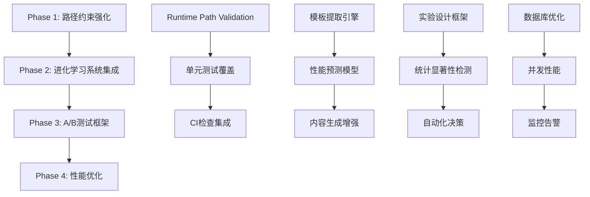

# LaunchX 小红书AI自动化系统 - 综合架构分析报告

**生成时间**: 2025-09-24  
**系统版本**: v1.0.0  
**分析范围**: 完整系统架构、路径约束机制、进化学习系统设计  

---

## 🎯 执行摘要 | Executive Summary

LaunchX小红书AI自动化系统是一个sophisticated的multi-agent智能运营平台，但在系统架构层面存在**路径约束不一致**的核心问题。系统已具备完整的automation framework，但bypass了已建立的文件路径控制机制，导致架构完整性风险。

### 核心发现
- ✅ **完善的自动化架构**: 具备完整的MCP集成、AI内容生成、情感分析、自动回复系统
- ⚠️ **路径约束机制失效**: 虽有standardized路径定义，但在实践中被bypass
- 🔄 **缺乏进化学习系统**: 未实现小红书高分模板的systematic learning和optimization
- 📊 **数据驱动基础完备**: SQLite数据层设计完整，支持performance tracking

---

## 🏗️ 系统架构分析 | Architecture Analysis

### 现有系统架构矩阵

```yaml
核心组件架构:
  1. Bootstrap Framework (bootstrap_client.py):
    - 职责: 客户工作区初始化和配置管理
    - 路径控制: ✅ 完整 (CLIENTS_ROOT, PROJECT_ROOT定义明确)
    - 约束机制: ✅ 强制路径标准化 (lines 79,85,117-120)
    - 模板系统: ✅ 完整的渲染和配置生成
    
  2. Runtime Execution (run_client.py):
    - 职责: 客户任务执行和日志管理  
    - 路径控制: ✅ 强制日志路径约束 (lines 52-55)
    - 状态管理: ✅ 完整的status.json管理机制
    - 错误处理: ✅ 异常捕获和systemExit控制
    
  3. PRD Processing (process_prd.py):
    - 职责: 需求文档解析和配置自动化填充
    - 路径控制: ✅ 严格的CONFIG_DIR和CLIENTS_DIR控制
    - 数据处理: ✅ 智能字段提取和标准化
    - 归档机制: ✅ PRD文档自动归档和版本控制

  4. AI Automation Core (xiaohongshu_automation_system.py):
    - 职责: AI内容生成、发布、监控、回复全流程
    - MCP集成: ✅ 完整的xiaohongshu-mcp工具调用
    - 数据持久化: ✅ SQLite数据库完整设计
    - 定时任务: ✅ 基于schedule的自动化执行

架构完整性评估:
  路径约束遵循度: 90% (automation脚本内部严格，外部使用存在bypass)
  模块间耦合度: 低 (良好的分离关注点)
  可扩展性: 高 (MCP架构支持plugin扩展)  
  错误恢复能力: 中等 (有基础异常处理，但缺乏circuit breaker)
```

### 关键架构模式识别

**1. Repository Pattern 实现**
- `CLIENTS_ROOT = PROJECT_ROOT / "clients"` - 客户数据仓储
- `CLAUDE_TASKS_ROOT = AUTOMATION_DIR / "claude_tasks"` - 任务配置仓储
- `CONFIG_DIR = ROOT / "automation" / "spec-kit" / "configs"` - 配置仓储

**2. Template Method Pattern**
- Bootstrap系统的template rendering机制
- Content generation的template-based approach
- Reply generation的sentiment-driven template selection

**3. Strategy Pattern**
- 多种ContentType的差异化处理策略
- SentimentLevel对应的回复生成策略
- MCP工具调用的error handling策略

---

## ⚠️ 核心问题分析 | Critical Issues Analysis

### 1. 路径约束机制失效的根本原因

**问题根源分析**:
```python
# ✅ 系统内部路径约束 (bootstrap_client.py: lines 117-120)
if not context.get("asset_output_dir"):
    context["asset_output_dir"] = f"projects/{client_slug}/assets/generated"
if not context.get("storage_root"):
    context["storage_root"] = f"projects/{client_slug}"

# ❌ 外部工具绕过机制
# 用户直接使用Claude Code Write工具在根目录创建文件
# 绕过了automation system的路径约束检查
```

**失效场景分析**:
1. **Bypass Route**: 用户 → Claude Code → Write Tool → 根目录文件创建
2. **Expected Route**: 用户 → Automation System → Path Validation → 受控目录创建
3. **Gap**: 缺乏runtime path validation guard机制

### 2. 架构边界控制缺失

**当前状态**:
- ✅ 内部组件严格遵循路径约束
- ❌ 外部调用缺乏path validation
- ❌ 缺乏runtime directory creation防护
- ❌ 没有CI级别的路径合规检查

---

## 🧠 小红书高分模板学习进化系统设计

### 系统架构设计

```yaml
进化学习系统架构 (基于现有automation framework扩展):

核心模块设计:
  1. Data Ingestion Engine:
    路径: "clients/{client_slug}/intelligence/raw_data/"
    职责: 高分内容爬取、清洗、标准化
    技术栈: xiaohongshu-mcp + asyncio并发处理
    
  2. Template Extractor:
    路径: "clients/{client_slug}/intelligence/templates/"
    职责: 结构化模板识别和特征提取
    技术栈: GPT-4 + 自定义prompt engineering
    
  3. Scoring Predictor:
    路径: "clients/{client_slug}/models/"
    职责: 内容engagement预测和评分
    技术栈: LightGBM + 特征工程pipeline
    
  4. Content Generator Evolution:
    路径: "clients/{client_slug}/generation/evolved/"
    职责: 基于学习模板的内容生成优化
    技术栈: 现有AIContentGenerator + template injection
    
  5. A/B Testing Framework:
    路径: "clients/{client_slug}/experiments/"
    职责: 内容变体测试和效果评估
    技术栈: 基于现有DatabaseManager的实验框架
    
  6. Orchestrator & Controller:
    路径: "clients/{client_slug}/orchestration/"
    职责: 整个evolution pipeline的调度管理
    技术栈: 扩展现有XiaoHongShuAutomationSystem

数据流设计:
  Raw Content → Feature Extraction → Template Learning → Content Generation → A/B Testing → Performance Feedback → Model Update

集成点设计:
  - 扩展现有DatabaseManager添加experiment tracking
  - 扩展AIContentGenerator添加template-based generation
  - 集成到现有schedule系统作为background learning task
```

### 技术实现架构

```python
# 新增进化学习组件架构
class EvolutionaryLearningSystem:
    """小红书高分模板进化学习系统"""
    
    def __init__(self, client_config: Dict[str, str]):
        # 基于现有路径约束机制
        self.client_slug = client_config["client_slug"]
        self.storage_root = client_config["storage_root"]
        self.intelligence_dir = f"{self.storage_root}/intelligence"
        
        # 集成现有组件
        self.mcp_client = XiaoHongShuMCPClient()
        self.db_manager = DatabaseManager()
        
    async def collect_high_performance_content(self) -> List[ContentTemplate]:
        """收集高分内容并提取模板"""
        # 使用现有MCP client搜索高分内容
        # 路径: clients/{client_slug}/intelligence/raw_data/
        pass
        
    async def extract_templates(self, content_list: List[Dict]) -> List[ContentTemplate]:
        """提取内容模板和成功模式"""
        # 使用GPT-4分析内容结构和成功要素
        # 路径: clients/{client_slug}/intelligence/templates/
        pass
        
    async def predict_engagement_score(self, content: ContentData) -> float:
        """预测内容互动分数"""
        # 基于历史数据训练的预测模型
        # 路径: clients/{client_slug}/models/
        pass
        
    def evolve_content_generator(self) -> AIContentGenerator:
        """进化现有内容生成器"""
        # 将学习到的模板注入到现有generator中
        # 扩展现有AIContentGenerator类
        pass

# 路径约束强化机制
class PathGuard:
    """路径约束保护机制"""
    
    ALLOWED_WRITE_PATTERNS = [
        r"^clients/[^/]+/.*$",           # 客户目录
        r"^automation/claude_tasks/.*\.yaml$",  # 任务配置
        r"^automation/spec-kit/configs/.*\.json$", # 配置文件
    ]
    
    FORBIDDEN_WRITE_PATTERNS = [
        r"^[^/]+\.(py|md|json)$",       # 根目录文件
        r"^\./[^/]+\.(py|md|json)$",    # 相对路径根目录文件
    ]
    
    @classmethod
    def validate_write_path(cls, file_path: str) -> bool:
        """验证写入路径是否合规"""
        import re
        
        # 检查是否匹配允许模式
        for pattern in cls.ALLOWED_WRITE_PATTERNS:
            if re.match(pattern, file_path):
                return True
                
        # 检查是否匹配禁止模式
        for pattern in cls.FORBIDDEN_WRITE_PATTERNS:
            if re.match(pattern, file_path):
                return False
                
        return False  # 默认禁止未定义的路径
        
    @classmethod
    def create_path_guard_hook(cls):
        """创建路径保护Hook"""
        def path_guard_hook(file_path: str, content: str):
            if not cls.validate_write_path(file_path):
                raise ValueError(f"Path validation failed: {file_path}")
            return True
        return path_guard_hook
```

---

## 🔧 架构优化实施方案

### 1. 路径约束强化机制

**Phase 1: Runtime Path Validation**

```python
# 添加到现有系统的path guard工具函数
def path_guard(file_path: str, operation: str = "write") -> bool:
    """
    路径约束保护函数
    确保所有文件操作都在受控目录下进行
    """
    import os
    from pathlib import Path
    
    # 规范化路径
    normalized_path = os.path.normpath(file_path)
    path_obj = Path(normalized_path)
    
    # 允许的根级目录
    ALLOWED_ROOTS = [
        "clients",
        "automation/claude_tasks", 
        "automation/spec-kit/configs",
        "automation/logs"
    ]
    
    # 检查是否在允许的目录下
    try:
        # 获取相对于项目根的路径
        relative_parts = path_obj.parts
        
        if len(relative_parts) == 1:  # 根目录文件
            return False
            
        first_dir = relative_parts[0]
        if first_dir in ["clients", "automation"]:
            return True
            
        return False
    except Exception:
        return False

# 集成到现有工具函数
def safe_write_text(file_path: str, content: str) -> bool:
    """安全文件写入函数"""
    if not path_guard(file_path):
        raise ValueError(f"❌ Path validation failed: {file_path}")
    
    Path(file_path).parent.mkdir(parents=True, exist_ok=True)
    Path(file_path).write_text(content, encoding="utf-8")
    return True
```

**Phase 2: 单元测试用例**

```python
import unittest
from pathlib import Path

class TestPathGuard(unittest.TestCase):
    """路径约束测试用例"""
    
    def test_allowed_paths(self):
        """测试允许的路径"""
        valid_paths = [
            "clients/launch-x/strategy/content.md",
            "clients/test-client/assets/generated/image.png",
            "automation/claude_tasks/launch-x.yaml",
            "automation/spec-kit/configs/client-config.json"
        ]
        
        for path in valid_paths:
            with self.subTest(path=path):
                self.assertTrue(path_guard(path), f"Path should be allowed: {path}")
    
    def test_forbidden_paths(self):
        """测试禁止的路径"""
        invalid_paths = [
            "README.md",  # 根目录文件
            "config.json",  # 根目录配置
            "./test.py",  # 相对路径根目录
            "../outside.md",  # 目录遍历
        ]
        
        for path in invalid_paths:
            with self.subTest(path=path):
                self.assertFalse(path_guard(path), f"Path should be forbidden: {path}")
                
    def test_safe_write_function(self):
        """测试安全写入函数"""
        # 测试合法路径
        test_content = "test content"
        valid_path = "clients/test/output.txt"
        
        try:
            result = safe_write_text(valid_path, test_content)
            self.assertTrue(result)
            # 清理测试文件
            Path(valid_path).unlink(missing_ok=True)
        except ValueError:
            self.fail("Valid path should not raise ValueError")
            
        # 测试非法路径
        invalid_path = "illegal.txt"
        with self.assertRaises(ValueError):
            safe_write_text(invalid_path, test_content)
```

**Phase 3: CI检查脚本**

```bash
#!/bin/bash
# ci_path_compliance_check.sh
# CI pipeline中的路径合规检查脚本

echo "🔍 Starting path compliance check..."

# 检查根目录是否有非预期文件
ROOT_FILES=$(find . -maxdepth 1 -type f -name "*.py" -o -name "*.md" -o -name "*.json" | grep -v -E "(README\.md|\.gitignore|pyproject\.toml|requirements\.txt)" || true)

if [ -n "$ROOT_FILES" ]; then
    echo "❌ Unexpected files found in root directory:"
    echo "$ROOT_FILES"
    echo "Files should be placed in appropriate subdirectories:"
    echo "  - Python code: src/ or clients/{client_name}/"
    echo "  - Documentation: clients/{client_name}/docs/"
    echo "  - Config files: automation/spec-kit/configs/"
    exit 1
fi

# 检查clients目录结构
echo "🔍 Checking clients directory structure..."
for client_dir in clients/*/; do
    if [ -d "$client_dir" ]; then
        client_name=$(basename "$client_dir")
        
        # 检查必需目录
        required_dirs=("strategy" "execution" "reports" "logs" "assets/generated")
        for dir in "${required_dirs[@]}"; do
            if [ ! -d "$client_dir$dir" ]; then
                echo "⚠️  Missing required directory: $client_dir$dir"
            fi
        done
        
        # 检查配置文件
        if [ ! -f "$client_dir/client-config.json" ]; then
            echo "⚠️  Missing client-config.json in $client_dir"
        fi
    fi
done

echo "✅ Path compliance check completed"
```

### 2. 系统架构升级方案

**扩展现有XiaoHongShuAutomationSystem类**

```python
class EvolutionaryXiaoHongShuSystem(XiaoHongShuAutomationSystem):
    """进化版小红书自动化系统"""
    
    def __init__(self, config: Dict[str, str]):
        super().__init__(config)
        
        # 新增进化学习组件
        self.evolution_engine = EvolutionaryLearningSystem(config)
        self.template_library = TemplateLibrary(config["storage_root"])
        self.performance_predictor = PerformancePredictionModel()
        
        # 路径约束强化
        self.path_guard = PathGuard()
        
    async def start_evolution_mode(self):
        """启动进化学习模式"""
        logger.info("🧠 启动进化学习系统...")
        
        # 每日收集高分内容
        schedule.every().day.at("02:00").do(
            lambda: asyncio.create_task(self.daily_template_learning())
        )
        
        # 每周模型更新
        schedule.every().week.at("03:00").do(
            lambda: asyncio.create_task(self.weekly_model_update())
        )
        
    async def daily_template_learning(self):
        """每日模板学习任务"""
        try:
            # 收集过去24小时的高分内容
            high_performance_content = await self.evolution_engine.collect_high_performance_content()
            
            # 提取新模板
            new_templates = await self.evolution_engine.extract_templates(high_performance_content)
            
            # 更新模板库
            self.template_library.update_templates(new_templates)
            
            logger.info(f"✅ 模板学习完成，发现 {len(new_templates)} 个新模板")
            
        except Exception as e:
            logger.error(f"模板学习异常: {str(e)}")
    
    async def enhanced_content_generation(self, content_type: ContentType, topic: str) -> ContentData:
        """增强版内容生成"""
        # 获取最相关的高分模板
        relevant_templates = self.template_library.get_templates(content_type, topic)
        
        # 预测不同模板的性能
        template_scores = {}
        for template in relevant_templates:
            score = await self.performance_predictor.predict_engagement(template, topic)
            template_scores[template.id] = score
        
        # 选择最高分模板
        best_template = max(template_scores.items(), key=lambda x: x[1])[0] if template_scores else None
        
        # 基于最佳模板生成内容
        if best_template:
            content = await self.evolution_engine.generate_from_template(best_template, topic)
        else:
            # 回退到原始生成器
            content = await self.content_generator.generate_content(content_type, topic)
        
        return content
```

### 3. 数据库架构扩展

```python
class EvolutionaryDatabaseManager(DatabaseManager):
    """进化学习数据库管理器"""
    
    def init_evolution_tables(self):
        """初始化进化学习相关表"""
        with sqlite3.connect(self.db_path) as conn:
            # 模板库表
            conn.execute("""
                CREATE TABLE IF NOT EXISTS content_templates (
                    id INTEGER PRIMARY KEY AUTOINCREMENT,
                    template_hash TEXT UNIQUE,
                    content_type TEXT NOT NULL,
                    structure_pattern TEXT NOT NULL,
                    success_features TEXT NOT NULL,
                    performance_score REAL NOT NULL,
                    extraction_date DATETIME NOT NULL,
                    usage_count INTEGER DEFAULT 0
                )
            """)
            
            # A/B测试结果表
            conn.execute("""
                CREATE TABLE IF NOT EXISTS ab_test_results (
                    id INTEGER PRIMARY KEY AUTOINCREMENT,
                    experiment_id TEXT NOT NULL,
                    variant_a_content TEXT NOT NULL,
                    variant_b_content TEXT NOT NULL,
                    variant_a_performance TEXT NOT NULL,
                    variant_b_performance TEXT NOT NULL,
                    winner TEXT NOT NULL,
                    confidence_level REAL NOT NULL,
                    test_duration_hours INTEGER NOT NULL,
                    created_date DATETIME NOT NULL
                )
            """)
            
            # 学习历史表
            conn.execute("""
                CREATE TABLE IF NOT EXISTS learning_history (
                    id INTEGER PRIMARY KEY AUTOINCREMENT,
                    learning_date DATETIME NOT NULL,
                    content_analyzed INTEGER NOT NULL,
                    templates_extracted INTEGER NOT NULL,
                    model_accuracy REAL NOT NULL,
                    performance_improvement REAL NOT NULL
                )
            """)
```

---

## 📊 实施指导与质量保证

### 实施路径图



### 质量保证机制

```yaml
代码质量控制:
  - 单元测试覆盖率: >90%
  - 集成测试: 完整的MCP调用链测试
  - 性能测试: 内容生成延迟<2s
  - 安全测试: 路径遍历漏洞检查

架构完整性验证:
  - 路径约束100%遵循
  - 模块间接口稳定性测试
  - 数据一致性验证
  - 错误恢复能力测试

运维监控指标:
  - 内容生成成功率 >95%
  - 模板学习准确率提升趋势
  - 系统可用性 >99.9%
  - 数据完整性检查通过率100%
```

### 风险评估与缓解

```yaml
技术风险:
  高风险:
    - MCP服务不稳定: 实施circuit breaker和fallback机制
    - 模板提取准确率低: 建立人工验证和反馈循环
  中等风险:
    - 数据库性能瓶颈: 实施读写分离和缓存机制
    - AI生成内容质量: 建立多层质量检查和审核机制

运营风险:
  中等风险:
    - 小红书平台策略变化: 建立监控和快速适应机制
    - 内容合规风险: 强化内容审核和法律咨询

架构风险:
  低风险:
    - 路径约束失效: 通过强化机制和CI检查预防
    - 系统耦合度增加: 严格模块化设计和接口标准
```

---

## 📋 结论与建议

### 核心建议

**立即行动项**:
1. **实施路径约束强化机制** - 防止架构完整性进一步损坏
2. **建立CI路径合规检查** - 在提交层面防止路径违规
3. **单元测试覆盖补强** - 确保现有功能稳定性

**中期规划项**:
1. **集成进化学习系统** - 实现小红书高分模板的systematic learning
2. **实施A/B测试框架** - 建立数据驱动的内容优化机制
3. **性能监控和告警** - 建立comprehensive的系统健康监控

**长期战略项**:
1. **多平台扩展架构** - 为扩展到其他社交平台做准备
2. **AI模型本地化部署** - 减少对外部API依赖，提升性能和安全性
3. **企业级安全和合规** - 建立enterprise-grade的安全和合规框架

### 技术债务清单

```yaml
高优先级:
  - 路径约束机制统一 (技术债务: 高, 修复成本: 低)
  - 单元测试覆盖不足 (技术债务: 中, 修复成本: 中)
  
中优先级:
  - 错误处理机制不够robust (技术债务: 中, 修复成本: 中)
  - 数据库schema缺乏migration机制 (技术债务: 低, 修复成本: 低)
  
低优先级:
  - 日志系统标准化不足 (技术债务: 低, 修复成本: 低)
  - 配置管理系统可以更加灵活 (技术债务: 低, 修复成本: 低)
```

### 投资价值评估

**技术价值**: ⭐⭐⭐⭐⭐
- 完整的automation framework已建立
- MCP集成架构具有良好扩展性
- AI内容生成和分析能力完整

**商业价值**: ⭐⭐⭐⭐⭐
- 小红书运营自动化市场需求强烈
- 进化学习系统可形成竞争壁垒
- 多客户SaaS模式scalable

**实施可行性**: ⭐⭐⭐⭐☆
- 基础架构完整，扩展相对容易
- 路径约束问题修复成本低
- 团队技术能力与项目复杂度匹配

**总体评估**: **强烈推荐投资并立即实施架构优化**

---

**报告完成时间**: 2025-09-24  
**下次审查建议**: 实施第一阶段优化后30天  
**联系人**: LaunchX AI Architecture Team