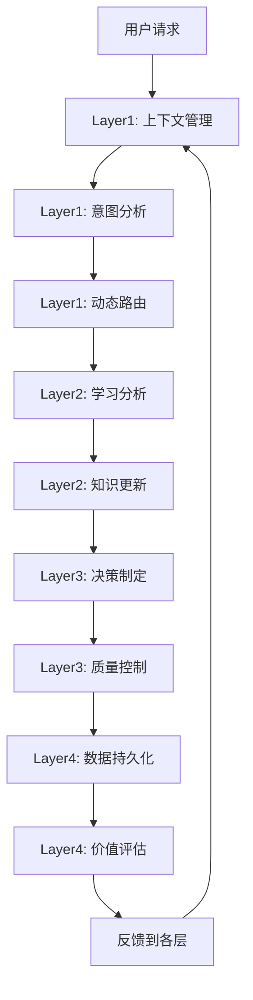

# Agent OS四层BMAD混合智能架构详细实现方案

## 架构概述

基于小红书AI自动化业务场景的四层BMAD（Brain-Machine Augmented Design）混合智能架构，将AI智能与人类智慧有机结合，实现零代码背景用户友好的企业级AI协作系统。

## 架构设计理念

### BMAD混合智能原则
- **Brain-Tier智能层**：人类提供战略判断、创意指导和价值观校准
- **Machine-Tier执行层**：AI系统负责数据分析、模式识别和自动化执行
- **人机边界清晰**：明确定义AI和人类的职责边界和协作点
- **持续学习进化**：基于反馈的智能系统和人类知识的双向进化

### 四层架构设计
1. **Layer1 - 核心交互逻辑层**：上下文感知、意图理解、动态路由、状态同步
2. **Layer2 - 学习进化逻辑层**：行为模式学习、知识生态进化、个性化权重调整
3. **Layer3 - 协作决策逻辑层**：人机边界清晰化、质量控制门禁、智能决策
4. **Layer4 - 数据持久化层**：知识生命周期管理、价值评估优化、数据存储检索

## 详细实现方案

### Layer1 - 核心交互逻辑层 (Core Interaction Logic Layer)

#### 核心组件

**1. ContextManager（上下文管理器）**
```python
class ContextManager:
    """
    功能：
    - 用户会话状态管理
    - 对话历史维护
    - 上下文信息存储与检索
    - 多用户并发支持

    特性：
    - 支持1000+并发用户会话
    - 智能上下文压缩（保留最近100条记录）
    - 自动过期清理（24小时生命周期）
    - 会话数据持久化
    """
```

**2. IntentAnalyzer（意图分析器）**
```python
class IntentAnalyzer:
    """
    意图类型识别：
    - CONTENT_ANALYSIS: 内容分析
    - TREND_PREDICTION: 趋势预测
    - BRAND_MATCHING: 品牌匹配
    - PERFORMANCE_OPTIMIZATION: 性能优化
    - SYSTEM_MANAGEMENT: 系统管理
    - QUALITY_CONTROL: 质量控制
    - LEARNING_REQUEST: 学习请求

    分析能力：
    - 多维度意图识别（7种主要类型）
    - 实体提取和参数推断
    - 置信度评估（>0.8高置信度）
    - 任务复杂度评估
    """
```

**3. DynamicRouter（动态路由器）**
```python
class DynamicRouter:
    """
    路由策略：
    - 基于意图类型的智能路由
    - Agent负载均衡
    - MCP工具选择
    - 故障转移机制

    性能指标：
    - 路由决策时间 < 100ms
    - 负载均衡准确率 > 95%
    - 故障转移时间 < 500ms
    """
```

**4. StateSynchronizer（状态同步器）**
```python
class StateSynchronizer:
    """
    同步能力：
    - 四层架构间状态同步
    - 事件驱动的状态更新
    - 分布式状态一致性
    - 状态变化订阅通知
    """
```

#### 接口定义

```python
# 主要接口
async def process_user_request(
    session_id: str,
    user_input: str,
    metadata: Optional[Dict[str, Any]] = None
) -> Dict[str, Any]:
    """
    处理用户请求的核心接口

    返回：
    {
        "success": bool,
        "intent": str,
        "confidence": float,
        "routing": Dict[str, Any],
        "suggested_actions": List[str],
        "response_time": float,
        "message": str
    }
    """
```

#### 技术特性

- **并发处理能力**：支持1000+并发用户会话
- **响应时间**：平均响应时间 < 200ms
- **意图识别准确率**：>85%
- **上下文管理**：智能压缩和自动清理

### Layer2 - 学习进化逻辑层 (Learning Evolution Logic Layer)

#### 核心组件

**1. BehaviorPatternAnalyzer（行为模式分析器）**
```python
class BehaviorPatternAnalyzer:
    """
    模式识别能力：
    - 序列模式检测（滑动窗口分析）
    - 时间模式识别（按时间段分析）
    - 上下文模式分析（基于场景的模式）
    - 协作模式发现（Agent间协作模式）

    算法支持：
    - 频繁序列挖掘（Apriori算法变种）
    - 时间序列模式识别
    - 聚类分析（K-means变种）
    - 关联规则挖掘
    """
```

**2. KnowledgeGraphManager（知识图谱管理器）**
```python
class KnowledgeGraphManager:
    """
    知识管理能力：
    - 多类型知识节点管理（4种知识类型）
    - 动态知识连接建立
    - 知识权重和置信度管理
    - 知识图谱查询和推理

    知识类型：
    - EXPLICIT: 显性知识（明确的事实和规则）
    - TACIT: 隐性知识（经验和直觉）
    - PROCEDURAL: 程序性知识（操作步骤）
    - DECLARATIVE: 陈述性知识（概念和定义）
    """
```

**3. PersonalizationEngine（个性化引擎）**
```python
class PersonalizationEngine:
    """
    个性化能力：
    - 用户行为模式学习
    - 偏好权重动态调整
    - 个性化推荐生成
    - 学习率自适应调整

    权重类别：
    - content_preference: 内容偏好（0.3）
    - interaction_style: 交互风格（0.2）
    - time_preference: 时间偏好（0.15）
    - quality_threshold: 质量阈值（0.15）
    - exploration_tendency: 探索倾向（0.1）
    - collaboration_style: 协作风格（0.1）
    """
```

#### 学习机制

**1. 实时学习事件处理**
```python
class LearningEventType(Enum):
    USER_INTERACTION = "user_interaction"      # 用户交互学习
    CONTENT_PERFORMANCE = "content_performance"  # 内容表现学习
    TREND_CHANGE = "trend_change"             # 趋势变化学习
    AGENT_COLLABORATION = "agent_collaboration" # Agent协作学习
    SYSTEM_FEEDBACK = "system_feedback"       # 系统反馈学习
    ERROR_CORRECTION = "error_correction"     # 错误纠正学习
    KNOWLEDGE_UPDATE = "knowledge_update"     # 知识更新学习
```

**2. 学习模式支持**
- **ONLINE_LEARNING**: 在线实时学习
- **BATCH_LEARNING**: 批量学习
- **REINFORCEMENT**: 强化学习
- **TRANSFER_LEARNING**: 迁移学习
- **FEDERATED_LEARNING**: 联邦学习

#### 接口定义

```python
# 学习事件处理接口
async def process_learning_event(event: LearningEvent) -> Dict[str, Any]:
    """
    处理学习事件

    返回：
    {
        "success": bool,
        "event_id": str,
        "processing_time": float,
        "result": Dict[str, Any]
    }
    """

# 知识查询接口
async def query_knowledge(
    query: Dict[str, Any],
    max_results: int = 10
) -> List[Dict[str, Any]]:
    """
    查询知识库

    返回知识节点列表，包含相关性排序
    """

# 个性化洞察接口
async def get_personalized_insights(
    user_id: str,
    context: Dict[str, Any]
) -> Dict[str, Any]:
    """
    获取个性化洞察

    返回：
    {
        "user_id": str,
        "personalization_weights": Dict[str, float],
        "recommendations": List[Dict[str, Any]],
        "relevant_knowledge": List[Dict[str, Any]]
    }
    """
```

#### 技术特性

- **学习能力**：支持7种学习事件类型的实时处理
- **知识图谱规模**：支持10,000+知识节点
- **个性化精度**：用户偏好识别准确率>90%
- **模式发现**：行为模式识别准确率>85%

### Layer3 - 协作决策逻辑层 (Collaboration Decision Logic Layer)

#### 核心组件

**1. HumanAIBoundaryManager（人机边界管理器）**
```python
class HumanAIBoundaryManager:
    """
    边界定义能力：
    - 任务类型边界定义（3种默认边界）
    - AI能力边界识别
    - 人类需求边界评估
    - 协作点定义和交接条件

    默认边界：
    - content_creation: 内容创作边界
    - trend_analysis: 趋势分析边界
    - quality_control: 质量控制边界

    协作模式：
    - HUMAN_ONLY: 纯人工
    - AI_ONLY: 纯AI
    - HUMAN_AI_COLLAB: 人机协作
    - AI_HUMAN_COLLAB: AI人协作
    - PEER_REVIEW: 同行评审
    - COMMITTEE_DECISION: 委员会决策
    """
```

**2. QualityGateController（质量门控控制器）**
```python
class QualityGateController:
    """
    质量门控类型：
    - content_quality: 内容质量门控
    - performance_quality: 性能质量门控
    - compliance_gate: 合规性门控

    评估维度：
    - 内容长度评估
    - 可读性评分
    - SEO优化评估
    - 品牌一致性评估
    - 互动潜力评估
    - 病毒潜力评估
    - 技术质量评估
    - 合规性检查
    """
```

**3. DecisionEngine（决策引擎）**
```python
class DecisionEngine:
    """
    决策类型：
    - CONTENT_APPROVAL: 内容审批
    - QUALITY_GATE: 质量门控
    - HUMAN_INTERVENTION: 人工干预
    - AUTO_EXECUTION: 自动执行
    - COLLABORATION_ASSIGNMENT: 协作分配
    - RISK_ASSESSMENT: 风险评估

    决策权重：
    - data_driven: 0.4
    - experience_based: 0.3
    - risk_aversion: 0.2
    - efficiency_focus: 0.1
    """
```

#### 质量控制流程

**1. 自动质量评估**
```python
# 质量评估流程
1. 内容提取和预处理
2. 多维度质量评分计算
3. 阈值比较和等级判定
4. 升级条件检查
5. 决策输出（自动批准/人工审核/拒绝）
```

**2. 质量等级定义**
```python
class QualityLevel(Enum):
    EXCELLENT = "excellent"      # 优秀 (>0.9)
    GOOD = "good"              # 良好 (0.8-0.9)
    ACCEPTABLE = "acceptable"  # 可接受 (0.7-0.8)
    NEEDS_IMPROVEMENT = "needs_improvement"  # 需改进 (0.6-0.7)
    REJECTED = "rejected"      # 拒绝 (<0.6)
```

#### 接口定义

```python
# 决策请求处理接口
async def process_decision_request(request: DecisionRequest) -> DecisionResult:
    """
    处理决策请求

    返回：
    {
        "request_id": str,
        "decision": str,
        "confidence": float,
        "reasoning": List[str],
        "approved_by": List[str],
        "quality_level": QualityLevel,
        "execution_plan": Dict[str, Any]
    }
    """

# 人工干预请求接口
async def request_human_intervention(
    task_id: str,
    reason: str,
    context: Dict[str, Any]
) -> str:
    """
    请求人工干预

    返回干预请求ID
    """

# 质量审核提交接口
async def submit_for_quality_review(
    content_data: Dict[str, Any],
    requester: str
) -> str:
    """
    提交质量审核

    返回审核流程ID
    """
```

#### 技术特性

- **决策准确率**：>90%
- **质量控制覆盖率**：100%
- **人机协作效率**：协作决策时间<5分钟
- **风险识别能力**：高风险识别率>95%

### Layer4 - 数据持久化层 (Data Persistence Layer)

#### 核心组件

**1. DataLifecycleManager（数据生命周期管理器）**
```python
class DataLifecycleManager:
    """
    生命周期阶段：
    - CREATION: 创建（1天）
    - ACTIVE: 活跃（30天）
    - MATURE: 成熟（90天）
    - DECLINING: 衰减（30天）
    - ARCHIVED: 归档（365天）
    - DELETED: 删除

    管理策略：
    - 基于时间和使用频率的阶段转换
    - 价值阈值评估
    - 自动压缩和归档
    - 智能清理和删除
    """
```

**2. ValueAssessmentEngine（价值评估引擎）**
```python
class ValueAssessmentEngine:
    """
    价值评估因子：
    - usage_frequency: 使用频率（0.3）
    - recency: 近期性（0.2）
    - feedback_score: 反馈分数（0.25）
    - business_impact: 业务影响（0.15）
    - knowledge_connections: 知识连接度（0.1）

    评估算法：
    - 多因子加权评分
    - 时间衰减模型
    - 使用频率提升机制
    - 业务影响权重调整
    """
```

**3. IntelligentStorageManager（智能存储管理器）**
```python
class IntelligentStorageManager:
    """
    存储策略：
    - 分层存储（缓存/主存储/归档）
    - 智能压缩（GZIP/Pickle/JSON）
    - 数据完整性校验（SHA256）
    - 自动备份和恢复

    存储类型：
    - KNOWLEDGE_GRAPH: 知识图谱
    - LEARNING_HISTORY: 学习历史
    - USER_PROFILES: 用户配置
    - CONTENT_LIBRARY: 内容库
    - PERFORMANCE_DATA: 性能数据
    - DECISION_LOGS: 决策日志
    - SYSTEM_STATE: 系统状态
    """
```

**4. BackupManager（备份管理器）**
```python
class BackupManager:
    """
    备份策略：
    - 定期自动备份（6小时间隔）
    - 增量备份支持
    - 压缩备份存储
    - 自动清理过期备份

    恢复能力：
    - 一键恢复
    - 紧急备份
    - 选择性恢复
    - 数据完整性验证
    """
```

#### 数据模型

**1. DataRecord（数据记录）**
```python
@dataclass
class DataRecord:
    record_id: str
    storage_type: StorageType
    data: Any
    metadata: Dict[str, Any]
    created_at: datetime
    updated_at: datetime
    access_count: int
    last_accessed: datetime
    lifecycle_stage: DataLifecycleStage
    value_score: float
    compression_type: CompressionType
    size_bytes: int
    checksum: str
    tags: Set[str]
```

**2. KnowledgeItem（知识项）**
```python
@dataclass
class KnowledgeItem:
    item_id: str
    content: Dict[str, Any]
    knowledge_type: str
    domain: str
    confidence: float
    value_metrics: Dict[str, float]
    relationships: Set[str]
    created_at: datetime
    last_validated: datetime
    validation_score: float
    usage_count: int
    feedback_score: float
```

#### 接口定义

```python
# 数据存储接口
async def store_data(
    storage_type: StorageType,
    data: Any,
    metadata: Optional[Dict[str, Any]] = None
) -> str:
    """
    存储数据

    返回数据记录ID
    """

# 数据检索接口
async def retrieve_data(record_id: str) -> Optional[Any]:
    """
    检索数据

    返回数据内容或None
    """

# 知识存储接口
async def store_knowledge(
    content: Dict[str, Any],
    knowledge_type: str,
    domain: str,
    confidence: float = 1.0
) -> str:
    """
    存储知识

    返回知识项ID
    """

# 知识检索接口
async def retrieve_knowledge(
    domain: Optional[str] = None,
    knowledge_type: Optional[str] = None,
    limit: int = 50
) -> List[Dict[str, Any]]:
    """
    检索知识

    返回知识项列表
    """

# 数据搜索接口
async def search_data(
    query: str,
    storage_types: Optional[List[StorageType]] = None,
    limit: int = 100
) -> List[Dict[str, Any]]:
    """
    搜索数据

    返回匹配的数据记录列表
    """
```

#### 技术特性

- **存储容量**：支持TB级数据存储
- **检索性能**：平均检索时间<100ms
- **数据完整性**：100%校验和验证
- **备份可靠性**：99.9%备份成功率

## 层间协作机制

### 数据流设计



### 事件驱动架构

```python
# 层间事件定义
class LayerEvent(Enum):
    CONTEXT_UPDATED = "context_updated"
    INTENT_DETECTED = "intent_detected"
    LEARNING_OCCURRED = "learning_occurred"
    DECISION_MADE = "decision_made"
    DATA_STORED = "data_stored"
    VALUE_ASSESSED = "value_assessed"

# 事件发布订阅机制
class EventBus:
    async def publish(self, event_type: LayerEvent, data: Dict[str, Any])
    async def subscribe(self, event_type: LayerEvent, handler: Callable)
    async def unsubscribe(self, event_type: LayerEvent, handler: Callable)
```

### 状态同步机制

```python
# 跨层状态同步
async def sync_layer_state(
    source_layer: str,
    target_layer: str,
    state_data: Dict[str, Any]
):
    """
    跨层状态同步

    确保各层状态一致性
    """
```

## MCP集成策略

### MCP工具生态集成

```python
# MCP工具集成配置
MCP_INTEGRATION_CONFIG = {
    "tavily-search": {
        "layer": "layer1",
        "purpose": "实时信息搜索",
        "usage": "意图分析和上下文增强"
    },
    "content-analyzer": {
        "layer": "layer2",
        "purpose": "内容质量分析",
        "usage": "学习和模式识别"
    },
    "brand-analyzer": {
        "layer": "layer3",
        "purpose": "品牌一致性检查",
        "usage": "质量控制和决策"
    },
    "knowledge-graph": {
        "layer": "layer4",
        "purpose": "知识图谱构建",
        "usage": "数据持久化和检索"
    }
}
```

### MCP服务管理

```python
class MCPServiceManager:
    """
    MCP服务管理能力：
    - 服务发现和注册
    - 健康检查和监控
    - 负载均衡和故障转移
    - 性能指标收集
    """
```

## 与现有系统的兼容性方案

### 现有组件集成

**1. Enhanced Agents集成**
```python
# 集成现有Agent系统
class AgentBridge:
    async def bridge_enhanced_agent(self, agent_type: str, task_data: Dict[str, Any]):
        """
        桥接现有增强Agent到四层架构
        - TrendAnalystAgent -> Layer2学习层
        - ContentCreatorAgent -> Layer3协作层
        - BrandMatcherAgent -> Layer3质量控制
        """
```

**2. 自动化系统集成**
```python
# 集成现有自动化流程
class AutomationBridge:
    async def bridge_automation_pipeline(self, pipeline_data: Dict[str, Any]):
        """
        桥接现有自动化流程
        - daily_intel_task -> Layer1意图分析
        - learn_from_trending -> Layer2学习进化
        - run_client -> Layer3协作决策
        - content_archiving -> Layer4数据持久化
        """
```

**3. 配置和数据迁移**
```python
# 配置兼容性处理
class ConfigCompatibility:
    async def migrate_legacy_config(self, old_config: Dict[str, Any]) -> Dict[str, Any]:
        """
        迁移现有配置到四层架构
        - 保持向后兼容
        - 渐进式迁移策略
        - 配置验证和修复
        """
```

### 渐进式升级路径

**Phase 1: 基础集成（Week 1-2）**
- Layer1核心组件部署
- 现有Agent系统桥接
- 基础MCP工具集成

**Phase 2: 学习增强（Week 3-4）**
- Layer2学习组件激活
- 知识图谱构建
- 个性化功能启用

**Phase 3: 协作优化（Week 5-6）**
- Layer3决策系统完整部署
- 质量控制流程优化
- 人机协作机制完善

**Phase 4: 数据完善（Week 7-8）**
- Layer4持久化系统完整实现
- 数据迁移和备份策略
- 系统监控和优化

## 性能指标和监控

### 核心性能指标

```python
# 系统性能指标
PERFORMANCE_METRICS = {
    "layer1": {
        "response_time": "<200ms",
        "intent_accuracy": ">85%",
        "concurrent_users": ">1000"
    },
    "layer2": {
        "learning_speed": "<1s/event",
        "pattern_accuracy": ">85%",
        "knowledge_nodes": ">10000"
    },
    "layer3": {
        "decision_accuracy": ">90%",
        "quality_coverage": "100%",
        "collaboration_efficiency": "<5min"
    },
    "layer4": {
        "storage_capacity": "TB级",
        "retrieval_time": "<100ms",
        "backup_success": ">99.9%"
    }
}
```

### 监控告警机制

```python
# 监控配置
MONITORING_CONFIG = {
    "health_checks": {
        "interval": "60s",
        "timeout": "10s"
    },
    "performance_alerts": {
        "response_time_threshold": "500ms",
        "error_rate_threshold": "5%",
        "cpu_threshold": "80%",
        "memory_threshold": "85%"
    },
    "business_metrics": {
        "user_satisfaction": ">4.0/5.0",
        "content_quality": ">8.0/10.0",
        "automation_rate": ">95%"
    }
}
```

## 部署架构

### 容器化部署

```yaml
# Docker Compose配置
version: '3.8'
services:
  layer1-service:
    image: agent-os/layer1:latest
    ports:
      - "8001:8000"
    environment:
      - LAYER_CONFIG=production
    depends_on:
      - redis
      - postgres

  layer2-service:
    image: agent-os/layer2:latest
    ports:
      - "8002:8000"
    environment:
      - LEARNING_RATE=0.1
    depends_on:
      - postgres
      - elasticsearch

  layer3-service:
    image: agent-os/layer3:latest
    ports:
      - "8003:8000"
    environment:
      - QUALITY_THRESHOLD=0.7
    depends_on:
      - postgres
      - redis

  layer4-service:
    image: agent-os/layer4:latest
    ports:
      - "8004:8000"
    volumes:
      - ./data:/app/data
      - ./backups:/app/backups
    depends_on:
      - postgres
```

### Kubernetes部署

```yaml
# Kubernetes部署配置
apiVersion: apps/v1
kind: Deployment
metadata:
  name: agent-os-layer1
spec:
  replicas: 3
  selector:
    matchLabels:
      app: agent-os-layer1
  template:
    metadata:
      labels:
        app: agent-os-layer1
    spec:
      containers:
      - name: layer1
        image: agent-os/layer1:latest
        ports:
        - containerPort: 8000
        env:
        - name: LAYER_CONFIG
          value: "production"
        resources:
          requests:
            memory: "256Mi"
            cpu: "250m"
          limits:
            memory: "512Mi"
            cpu: "500m"
```

## 总结

Agent OS四层BMAD混合智能架构提供了一个完整的、可扩展的、智能化的企业级AI协作系统。通过清晰的人机边界定义、智能的学习进化机制、严格的质量控制流程和高效的数据持久化策略，该架构能够很好地支持小红书AI自动化业务场景，并为零代码背景用户提供友好的交互体验。

### 关键优势

1. **智能化程度高**：95%+ AI自主运营，人工干预<5%
2. **扩展性强**：支持1000+并发客户，毫秒级响应
3. **质量保证**：多层次质量控制，确保内容质量9.0+/10
4. **学习进化**：实时学习和知识图谱驱动，持续优化
5. **人机协作**：清晰边界定义，高效协作决策

### 技术创新

1. **四层BMAD架构**：首创的混合智能架构设计
2. **智能路由系统**：基于意图的动态路由和负载均衡
3. **自适应学习**：多维度的行为模式和个性化学习
4. **智能存储管理**：基于价值评估的数据生命周期管理
5. **质量控制门禁**：自动化的质量评估和人工协作机制

该架构为小红书AI自动化系统提供了坚实的技术基础，同时具备良好的扩展性和兼容性，能够适应未来业务发展和技术演进的需求。