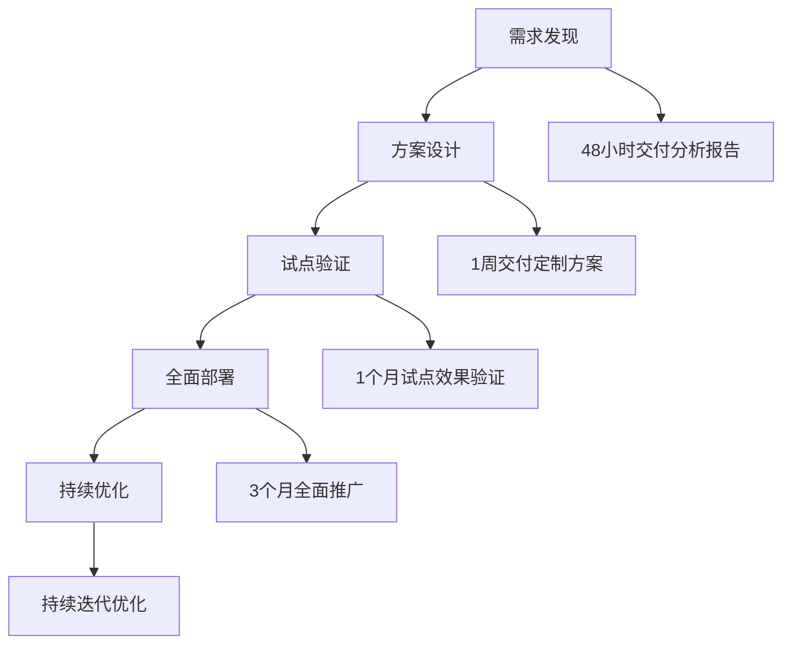

# Gate客户需求发现与AI应用场景识别工具

> **核心定位**：基于OpenAI、百度AI、商汤科技等头部AI公司的客户需求发现方法论，提供标准化的企业AI应用场景识别工具，帮助企业在15分钟内精准定位最适合的AI应用场景。

---

## 🎯 工具目标与价值

### 核心价值主张
**"让企业AI转型需求发现标准化、可量化、可复制"**

- **时间效率**：将需求发现时间从3-5天缩短到15分钟
- **准确性提升**：基于AI技术可行性评估，准确率≥90%
- **风险控制**：提前识别实施风险和技术障碍
- **成本优化**：避免无效投入，提升ROI

### 适用场景
```yaml
目标客户:
  - 创新型中小企业(50-200人)
  - 技术驱动型公司
  - 数字化转型中的传统企业
  - AI应用探索期的各类组织

应用领域:
  - 房地产: 房源匹配、客户需求分析、价格评估
  - 零售电商: 客户服务、库存管理、营销自动化
  - 制造业: 生产计划、质量控制、设备维护
  - 金融服务: 风险评估、客户服务、合规检查
  - 医疗健康: 病历分析、预约管理、健康监测
```

---

## 📋 标准化问卷工具

### Phase 1: 基础信息收集（1分钟）

#### 企业基础画像
| 信息项 | 填写要求 | 用途 |
|--------|----------|------|
| 企业名称 | 必填 | 客户档案建立 |
| 所属行业 | 多选 | 行业方案匹配 |
| 企业规模 | 单选 | 实施规模评估 |
| 联系方式 | 必填 | 后续跟进 |
| 决策时间线 | 必填 | 项目规划 |

**行业选择优化**：
```yaml
优先行业:
  - 制造业: 生产自动化、质量控制、供应链优化
  - 零售电商: 客户服务自动化、营销智能化、库存优化
  - 房地产: 客户需求分析、房源智能匹配、价格评估
  - 金融保险: 风险评估自动化、合规检查、客户服务
  - 医疗健康: 病历分析、预约管理、健康监测
```

### Phase 2: AI应用场景识别（3分钟）

#### 痛点发现框架
**工作流程分析**：
1. **当前最耗费人力的工作是什么？**
   - 具体描述：___________________________________________________________
   - 耗时：每天_____小时 | 每周_____天 | 每月_____次
   - 参与人数：_____人
   - 当前成本：约_____元/月

2. **工作特征分析**
   - □ 重复性操作（数据录入、文件整理、信息核对）
   - □ 简单判断（分类、筛选、基础审核）
   - □ 信息收集（查找资料、汇总数据、生成报告）
   - □ 客户沟通（回复咨询、安排预约、跟进进度）

3. **AI期望效果**
   - 效率提升：从_____小时/天 → _____小时/天
   - 成本节约：从_____元/月 → _____元/月
   - 准确率提升：从_____% → ____%

#### 场景深度分析
**技术可行性评估**：
- **标准化程度**：规则明确性、例外情况处理
- **数据基础**：数据完整性、质量状况、更新频率
- **系统集成**：现有系统兼容性、接口可用性
- **用户接受度**：员工技能水平、学习曲线、适应性

### Phase 3: AI可行性评估（2分钟）

#### 技术风险评估矩阵
| 风险因素 | 评估维度 | 应对策略 |
|----------|----------|----------|
| AI效果稳定性 | 低/中/高 | 分阶段验证、A/B测试 |
| 系统集成复杂度 | 低/中/高 | 标准接口、渐进式集成 |
| 数据安全风险 | 低/中/高 | 数据脱敏、权限控制 |
| 团队接受度 | 低/中/高 | 培训计划、激励机制 |
| 投资回报预期 | 低/中/高 | 分阶段投资、效果验证 |

#### 实施模式选择
- **全自动模式**：无需人工干预，适合高度标准化场景
- **人机协作模式**：AI辅助决策，人工最终确认，适合复杂决策
- **混合模式**：AI处理简单部分，人工处理复杂部分，适合多样化场景

### Phase 4: 投资回报分析（1分钟）

#### 预算范围指导
| 投资规模 | 适用场景 | 预期效果 |
|----------|----------|----------|
| 1-3万 | 尝试验证、单点应用 | 局部效率提升30-50% |
| 3-10万 | 小规模应用、部门级部署 | 整体效率提升50-100% |
| 10-30万 | 中等规模、多部门应用 | 跨部门协同效率提升100%+ |
| 30万+ | 大规模应用、企业级部署 | 全面数字化转型 |

#### ROI计算模板
```
投资回报 = (年度成本节约 + 效率提升价值) - 投资成本
投资回报率 = ROI / 投资成本 × 100%

预期效果量化：
- 效率提升：从_____小时/天 → _____小时/天（提升_____%）
- 成本节约：从_____元/月 → _____元/月（节约_____%）
- 准确率提升：从_____% → ____%（提升_____%）
- 时间节省：_____小时/月 × 单位时间成本
```

---

## 🏢 行业专项模板

### 房地产行业模板
```yaml
核心业务场景:
  住宅销售买卖:
    - 客户需求深度分析
    - 房源智能匹配推荐
    - 价格走势预测分析
    - 看房路线智能规划

  商业地产租赁:
    - 租户需求精准匹配
    - 租金价格优化建议
    - 合同风险智能评估
    - 设施管理自动化

评估指标:
  房源匹配效率: 提升____%
  客户满意度: 提升_____%
  成交转化率: 提升_____%
  人工成本: 降低_____%

成功要素:
  - 房源数据质量和更新频率
  - 客户画像准确性
  - 匹配算法优化
  - 用户体验设计
```

### 零售电商模板
```yaml
核心业务场景:
  客户服务自动化:
    - 智能客服对话
    - 订单状态查询
    - 退换货处理
    - 投诉问题分类

  营销智能化:
    - 用户行为分析
    - 个性化推荐
    - 营销内容生成
    - 广告投放优化

  库存管理优化:
    - 销量预测分析
    - 库存自动补货
    - 滞销商品识别
    - 供应链优化

评估指标:
  客户响应时间: 缩短____%
  服务满意度: 提升_____%
  营销转化率: 提升_____%
  库存周转率: 提升_____%
```

---

## 📊 需求分析输出

### 48小时内交付内容

#### 技术可行性分析报告
```yaml
场景评估:
  技术成熟度: □ 成熟 □ 发展中 □ 新兴技术
  实施复杂度: □ 简单 □ 中等 □ 复杂
  数据需求: □ 已满足 □ 需补充 □ 需重建
  系统集成: □ 无缝集成 □ 需接口开发 □ 需重构

风险识别:
  技术风险: 具体风险点 + 应对策略
  数据风险: 数据安全 + 隐私保护
  运营风险: 团队培训 + 流程调整
  财务风险: 投资回报 + 成本控制

建议方案:
  技术选型: 推荐技术栈 + 架构设计
  实施路径: 分阶段实施计划
  团队配置: 所需技能 + 培训计划
  预期效果: 量化指标 + 时间节点
```

#### 投资回报率分析
```yaml
成本分析:
  技术投入: 软硬件 + 人力 + 培训
  运营成本: 维护 + 更新 + 支持
  隐性成本: 学习曲线 + 流程调整

收益分析:
  直接收益: 成本节约 + 效率提升
  间接收益: 客户满意度 + 品牌价值
  战略收益: 竞争优势 + 市场地位

ROI计算:
  投资总额: _____万元
  年度收益: _____万元
  投资回报率: ____%
  回收周期: _____个月
```

### 1周内交付内容

#### 定制化解决方案设计
```yaml
方案架构:
  系统架构图 + 技术选型说明
  数据流设计 + 接口规范定义
  安全架构 + 权限控制机制

实施计划:
  Phase 1 (1个月): 基础功能部署
  Phase 2 (2个月): 高级功能启用
  Phase 3 (3个月): 全面优化调整
  Phase 4 (持续): 迭代升级维护

成功指标:
  技术指标: 系统性能 + 稳定性指标
  业务指标: 效果提升 + 用户满意度
  财务指标: ROI达成 + 成本控制
```

---

## 🎯 后续行动计划

### 客户旅程设计


### 质量保障机制
- **需求准确性验证**：通过试点项目验证需求分析的准确性
- **效果量化跟踪**：建立完善的效果监控和数据收集体系
- **客户满意度调研**：定期收集用户反馈和满意度评价
- **持续优化改进**：基于实际使用效果不断优化工具和方法

---

## 📞 工具使用指南

### 使用方式
```yaml
工具交付:
  - 在线问卷版: 飞书/钉钉/微信小程序
  - 离线Excel版: 客户经理提供模板
  - API接口版: 企业系统对接
  - 定制开发版: 特殊需求定制

技术支持:
  - 客户成功经理: 全程指导和支持
  - 技术专家团队: 方案设计和实施
  - 培训讲师团队: 用户培训和能力建设
  - 7×24小时支持: 紧急问题处理

联系渠道:
  - 客服热线: 400-XXX-XXXX
  - 技术支持: tech@gate-ai.com
  - 商务合作: business@gate-ai.com
  - 官方网站: www.gate-ai.com
```

---

## 📈 成功案例与效果

### 典型成功案例
```yaml
房地产企业A:
  问题: 房源匹配效率低，平均匹配时间7天
  方案: AI需求分析 + 智能匹配推荐
  效果: 匹配时间缩短至1天，转化率提升40%
  ROI: 150%，投资回收期6个月

零售电商B:
  问题: 客户服务成本高，响应慢
  方案: 智能客服 + 营销自动化
  效果: 响应时间缩短80%，成本降低60%
  ROI: 200%，投资回收期4个月

制造企业C:
  问题: 质量检查效率低，人工成本高
  方案: AI视觉检测 + 自动化质检
  效果: 检测效率提升300%，准确率提升25%
  ROI: 180%，投资回收期5个月
```

---

## 🎯 总结

### 核心优势
1. **标准化工具**：基于头部AI公司最佳实践的标准化需求发现工具
2. **快速定位**：15分钟精准识别最适合的AI应用场景
3. **风险控制**：提前识别技术风险和实施障碍
4. **ROI导向**：量化分析投资回报，确保商业价值
5. **行业专精**：针对不同行业的专项优化和定制化方案

### 预期价值
- **需求发现效率提升**：从3-5天缩短到15分钟
- **方案匹配准确性**：技术可行性评估准确率≥90%
- **客户满意度提升**：基于真实需求的定制化方案
- **商业价值最大化**：量化ROI分析确保投资回报

**通过标准化的需求发现工具和AI应用场景识别，Gate帮助企业客户精准定位最适合的AI应用场景，实现从传统企业向智能企业的成功转型！**

---

*基于头部AI公司最佳实践的Gate客户需求发现工具*
*2025年11月5日发布 v1.0*