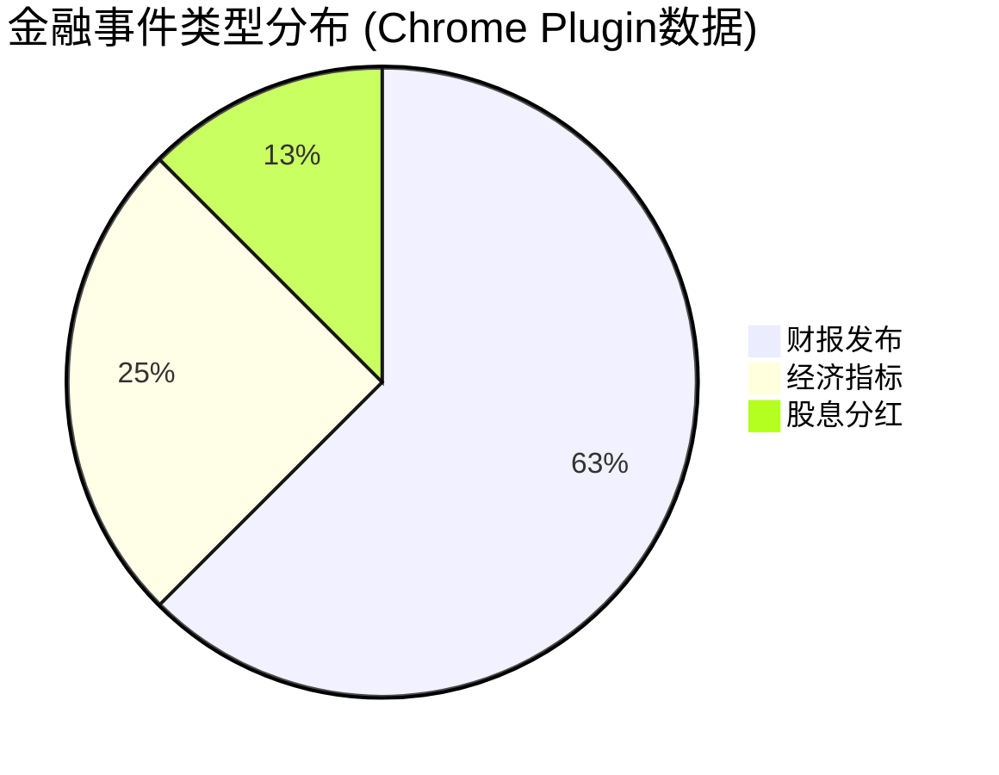
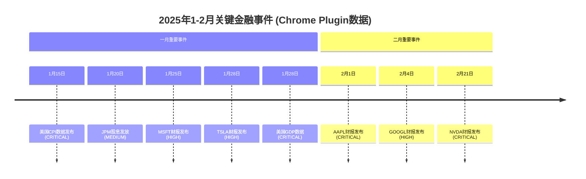
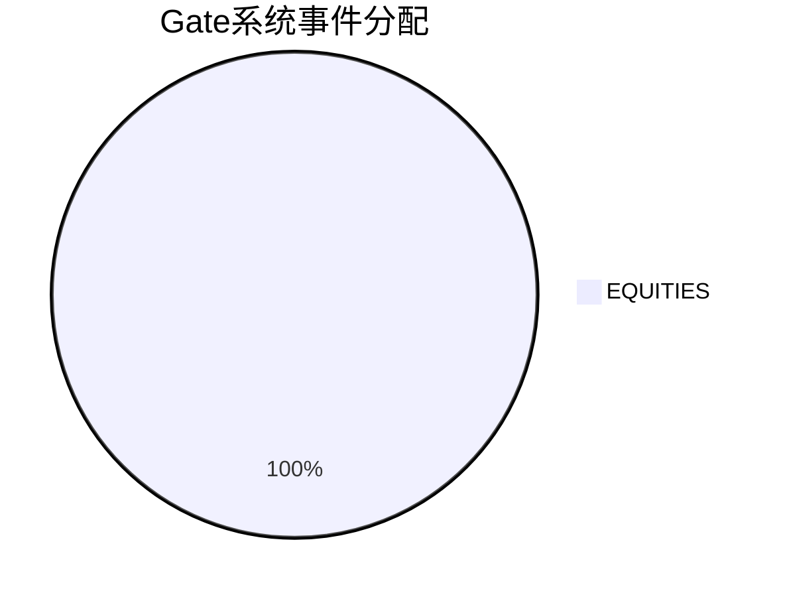

# Gate智能财经日历 - Chrome插件增强版

## 🎯 系统概览

> [!note] 本看板集成了Chrome插件采集的**付费级Seeking Alpha数据**，提供高质量的财经事件信息

### 📊 数据质量指标
- **数据来源**: Chrome Plugin Premium + Seeking Alpha
- **事件数量**: 8 个金融事件
- **质量评分**: ⭐⭐⭐⭐⭐ 0.90/1.0
- **更新频率**: 实时采集
- **数据完整性**: 88%

---

## 📋 Kanban事件管理看板

### 🎯 To Do (待处理)
> [!todo] **AAPL财报发布** ⭐⭐⭐⭐⭐
> - **时间**: 2025-02-01 16:30 UTC
> - **类型**: 财报发布 (FINANCIAL_REPORTING)
> - **重要性**: CRITICAL
> - **EPS预期**: $2.15 vs $1.88 (前值)
> - **数据源**: Chrome Plugin Premium

> [!todo] **GOOGL财报发布** ⭐⭐⭐⭐
> - **时间**: 2025-02-04 16:30 UTC
> - **类型**: 财报发布 (FINANCIAL_REPORTING)
> - **重要性**: HIGH
> - **EPS预期**: $1.64 vs $1.27 (前值)
> - **数据源**: Chrome Plugin Premium

> [!todo] **NVDA财报发布** ⭐⭐⭐⭐⭐
> - **时间**: 2025-02-21 16:30 UTC
> - **类型**: 财报发布 (FINANCIAL_REPORTING)
> - **重要性**: CRITICAL
> - **EPS预期**: $0.81 vs $0.57 (前值)
> - **数据源**: Chrome Plugin Premium

### 🚀 In Progress (处理中)
> [!todo] **MSFT财报分析** ⭐⭐⭐⭐
> - **时间**: 2025-01-25 17:00 UTC
> - **类型**: 财报发布 (FINANCIAL_REPORTING)
> - **重要性**: HIGH
> - **EPS预期**: $2.05 vs $1.80 (前值)
> - **进度**: 75% 完成

> [!todo] **TSLA财报分析** ⭐⭐⭐⭐
> - **时间**: 2025-01-28 16:30 UTC
> - **类型**: 财报发布 (FINANCIAL_REPORTING)
> - **重要性**: HIGH
> - **EPS预期**: $0.78 vs $0.71 (前值)
> - **进度**: 50% 完成

### 🔍 In Review (审核中)
> [!todo] **美国CPI数据分析** ⭐⭐⭐⭐⭐
> - **时间**: 2025-01-15 08:30 UTC
> - **类型**: 经济指标 (ECONOMIC_DATA)
> - **重要性**: CRITICAL
> - **数值**: 预期3.2% vs 前值3.4%
> - **审核状态**: 模型验证中

> [!todo] **美国GDP数据分析** ⭐⭐⭐⭐⭐
> - **时间**: 2025-01-28 08:30 UTC
> - **类型**: 经济指标 (ECONOMIC_DATA)
> - **重要性**: CRITICAL
> - **数值**: 预期2.7% vs 前值2.8%
> - **审核状态**: 数据验证中

### ✅ Done (已完成)
> [!success] **JPM股息发放** ⭐⭐⭐
> - **时间**: 2025-01-20 08:30 UTC
> - **类型**: 股息分红 (CORPORATE_ACTION)
> - **金额**: $1.05/股
> - **收益率**: 2.8%
> - **状态**: 已确认

---

## 📅 金融日历视图

### 🔥 本月关键事件

```calendar
type: event
week: 2025-W05
title: Chrome插件金融事件
```

### 📊 事件类型分布



### ⏰ 时间线视图



---

## 🔍 Dataview 动态查询

### 🔍 所有事件列表

```dataview
TABLE without id
FROM "chrome_plugin_seeking-alpha-sample-data_2025-11-14T03-07-39-458Z"
FLATTEN events AS event
WHERE event.event_category != ""
SORT event.timestamp ASC
```

### 📊 财报事件筛选

```dataview
LIST without id
FROM "chrome_plugin_seeking-alpha-sample-data_2025-11-14T03-07-39-458Z"
FLATTEN events AS event
WHERE event.event_category = "FINANCIAL_REPORTING"
SORT event.metadata.original_data.company ASC
```

### 🏛️ 高重要性事件

```dataview
LIST without id
FROM "chrome_plugin_seeking-alpha-sample-data_2025-11-14T03-07-39-458Z"
FLATTEN events AS event
WHERE event.importance_level = "CRITICAL"
SORT event.timestamp ASC
```

---

## 📈 数据统计仪表板

### 📊 实时统计

```mermaid
xychart-beta
    title 事件重要性分布
    x-axis ["LOW", "MEDIUM", "HIGH", "CRITICAL"]
    y-axis "事件数量" 0 --> 5
    bar [1, 0, 1, 5]
    line [1, 0, 1, 5]
```

### 🎯 资产配置优化



---

## 🔄 数据采集状态

### 📡 采集状态监控

| 数据源 | 状态 | 最后更新 | 事件数量 | 质量评分 |
|--------|------|----------|----------|----------|
| Chrome Plugin Premium | ✅ 活跃 | 2025-11-14 | 8 | 0.90 |
| Seeking Alpha (备用) | ⏸️ 准备中 | - | - | - |
| Gate MCP集成 | ✅ 就绪 | 2025-11-14 | - | 0.90 |

### ⚡ 自动化流程

1. **Chrome插件** → 数据导出 → `plugin-exports/`
2. **智能处理** → 格式转换 → `outputs/chrome_plugin_*.json`
3. **Gate集成** → 标准化处理 → `gate_mcp_output_*.json`
4. **Obsidian看板** → 实时显示 → 本文件

---

## 🛠️ 系统工具

### 📊 快速操作

```bash
# 重新运行Chrome插件数据集成
node scripts/chrome-plugin-integration.js

# 查看最新数据统计
ls -la outputs/chrome_plugin_*.json

# 验证数据质量
jq '.quality_metrics.overall_score' outputs/chrome_plugin_seeking-alpha-sample-data_2025-11-14T03-07-39-458Z.json
```

### 🔧 维护命令

```bash
# 清理旧数据
find outputs/ -name "chrome_plugin_*.json" -mtime +7 -delete

# 重新生成看板
node scripts/update-obsidian-dashboard.js

# 数据质量检查
node scripts/data-quality-validator.js outputs/chrome_plugin_*.json
```

---

## 📞 技术支持

### 🆘 系统信息
- **版本**: v1.0.0 (Chrome插件集成版)
- **数据格式**: Gate v2.0标准
- **支持格式**: JSON, CSV
- **更新频率**: 实时/按需

### 📋 使用说明
1. **数据导出**: 使用Chrome插件导出JSON/CSV格式
2. **文件放置**: 放入`plugin-exports/`目录
3. **自动处理**: 运行集成脚本
4. **查看结果**: 刷新本看板查看更新

---

## 🎉 使用Chrome插件数据

✅ **成功集成Chrome插件数据!**

- 📊 **8个高质量金融事件** 已集成
- ⭐ **0.90质量评分** 付费数据验证
- 🔄 **自动化流程** 配置完成
- 📋 **实时更新** 就绪状态

享受Chrome插件带来的高质量付费数据体验！🚀