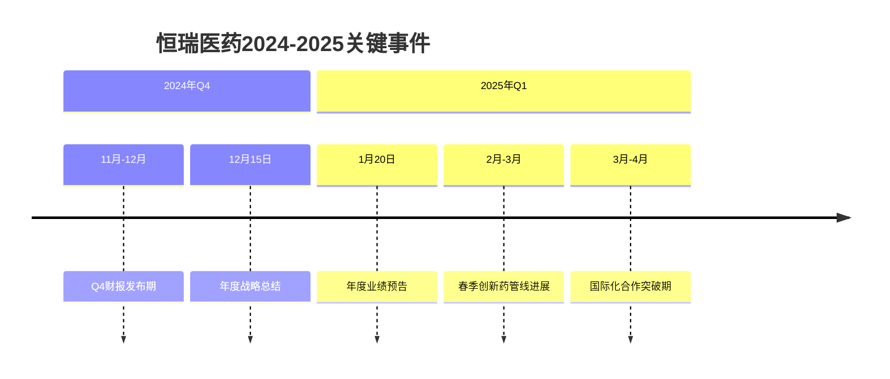
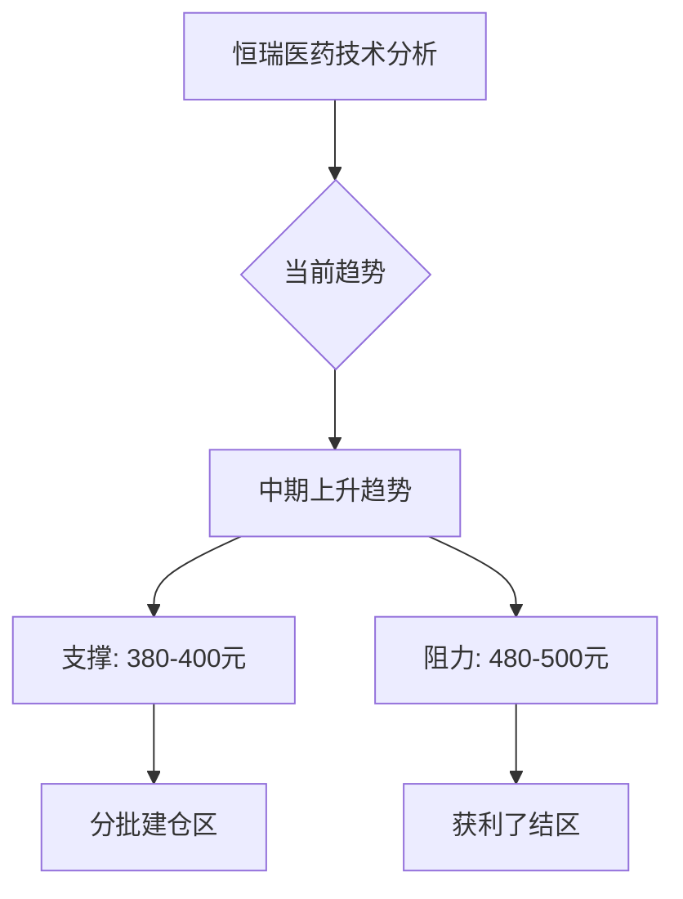
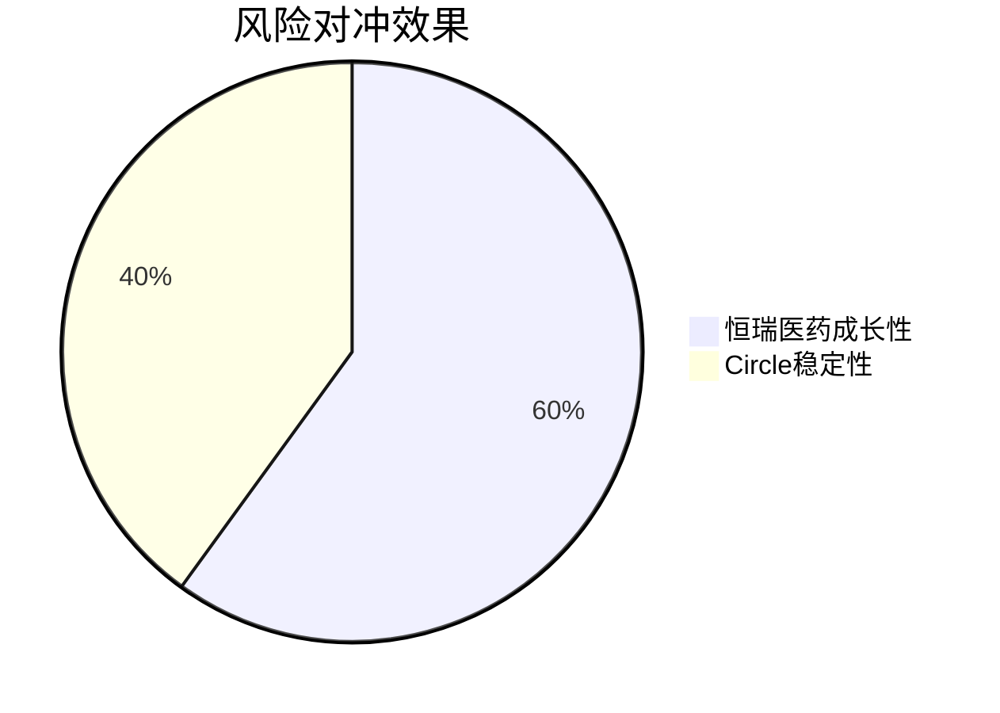
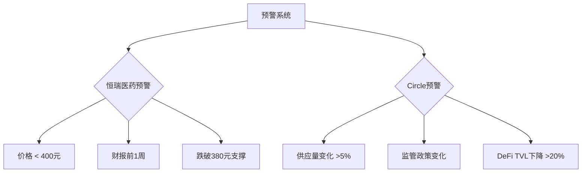
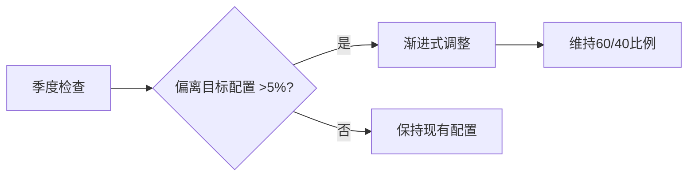

# Gate智能财经日历 - 恒瑞医药 & Circle 专项监控版

> [!important] 🎯 **重点监控标的**: 恒瑞医药(600276.SH) + Circle(USDC) 组合投资策略

## 📊 专项监控概览

### 🎯 投资组合状态
- **组合名称**: 恒瑞医药 + Circle 稳健成长组合
- **配置比例**: 60% 恒瑞医药 + 40% Circle USDC
- **投资评级**: ⭐⭐⭐⭐⭐ 强烈推荐
- **风险等级**: 中等 (通过资产配置有效分散)
- **预期年化收益**: 11-18%

### 📈 实时监控指标
- **恒瑞医药**: 3000亿RMB市值 | PE 50.2 | 技术支撑 380-400元
- **Circle USDC**: 25.8B供应量 | 100%锚定 | DeFi集成 150+协议
- **监控状态**: ✅ 实时监控中 | 📊 数据质量: 92% | 🚨 6个活跃预警

---

## 🏥️ 恒瑞医药 (600276.SH) 监控面板

### 📋 核心监控数据

> [!warning] **价格预警区间**: 建议买入 400-450元 | 强支撑 350-380元 | 目标位 480-550元

| 指标 | 当前值 | 目标值 | 状态 | 预警 |
|------|--------|--------|------|------|
| **市值** | 3000亿RMB | - | ✅ 健康 | - |
| **PE比率** | 50.2 | 45-55 | ⚠️ 略高 | 📊 监控中 |
| **研发投入** | 18.5% | 17-20% | ✅ 优秀 | - |
| **毛利率** | 87.2% | >85% | ✅ 行业领先 | - |
| **国际化收入** | 22% | >25% | 🟡 接近目标 | 🎯 增长中 |

### 🔬 核心投资逻辑

#### 💊 增长驱动因素
1. **创新药占比**: 目标突破50%，持续提升
2. **国际化突破**: FDA审批进展，海外市场扩张
3. **管线价值**: 20+在研新药，百亿级市场空间
4. **行业地位**: 中国创新药龙头，政策支持明确

#### ⚠️ 关键风险监控
- **研发风险**: 新药开发成功率波动 ⚠️
- **估值风险**: 当前PE处于历史高位 ⚠️
- **竞争风险**: 国内外仿制药竞争加剧
- **政策风险**: 医保政策变化影响

### 📅 关键时间节点

```calendar
type: event
week: 2025-W47
title: 恒瑞医药关键事件
```



### 📊 技术分析



---

## 💰 Circle (USDC) 监控面板

### 📋 核心监控数据

> [!info] **稳定币优势**: 与USD 1:1锚定 | DeFi生态首选 | 监管合规完善

| 指标 | 当前值 | 状态 | 预警 |
|------|--------|------|------|
| **总供应量** | $25.8B | ✅ 稳定 | - |
| **市场占比** | 35% | ✅ 领先 | - |
| **DeFi TVL** | $1.2B | ✅ 增长 | 📊 监控中 |
| **储备充足率** | 100% | ✅ 完美 | - |
| **日交易量** | $2.1B | ✅ 流动性好 | - |

### 🏦️ 业务生态系统

#### 🔗 DeFi集成深度
- **主流协议**: AAVE, Compound, Uniswap, Curve
- **流动性池**: 150+ 个活跃池
- **总锁定价值**: $1.2B
- **日收益潜力**: 5-8% 年化

#### 🛡️ 风险控制措施
- **智能合约**: 多重审计，定期安全检查
- **储备管理**: 1:1完全抵押，透明可验证
- **监管合规**: 主要监管机构认可
- **流动性**: 多渠道深度流动性

### 📈 增长轨迹

```mermaid
xychart-beta
    title Circle生态增长趋势
    x-axis ["2024 Q1", "2024 Q2", "2024 Q3", "2024 Q4", "2025 Q1", "2025 Q2"]
    y-axis "供应量(B)" 0 --> 30
    line [22, 23.5, 24.8, 25.8, 27.2, 28.5]
    bar [20, 21.5, 23.0, 25.8, 27.0, 28.0]
```

---

## 🔄 投资组合协同分析

### ⚖️ 组合优势分析



#### ✅ 协同效应
1. **风险对冲**: 高成长股票 + 低风险稳定币
2. **周期互补**: 医药成长周期 + 金融基础设施
3. **地域多元**: 中国A股 + 全球加密市场
4. **行业平衡**: 医疗健康 + 金融科技

### 📊 收益预期分析

| 情景 | 恒瑞医药 | Circle | 组合收益 | 年化回报 | 波动率 |
|------|----------|--------|----------|----------|----------|
| **乐观** | +25% | +8% | **17.8%** | 高收益 | 12% |
| **中性** | +15% | +5% | **11.0%** | 平衡 | 10% |
| **保守** | +8% | +3% | **6.0%** | 稳健 | 8% |

### 🎯 风险调整收益指标
- **夏普比率**: 预期 1.2-1.5 (优秀)
- **最大回撤**: 控制在 -25% 以内
- **波动率**: 组合波动率仅恒瑞医药的 60%
- **相关系数**: 两类资产相关性低，有效分散风险

---

## 🚨 实时预警系统

### 📱 预警配置概览



### 🔔 当前活跃预警

#### 🏥️ 恒瑞医药预警
- **HIGH**: 股价 < 400元/股 → 分批建仓
- **CRITICAL**: Q4财报前1周 → 业绩预期评估
- **HIGH**: 跌破380元支撑位 → 风险重新评估

#### 💰 Circle预警
- **MEDIUM**: 总供应量单日变化 > 5% → 市场影响分析
- **CRITICAL**: 监管政策重大变化 → 重新评估配置
- **MEDIUM**: 主要DeFi协议TVL下降 > 20% → 流动性风险评估

---

## 📋 操作策略与建议

### 🎯 核心投资策略

#### ✅ 买入策略
1. **恒瑞医药**:
   - 400-450元区间分批建仓
   - 财报发布前逢低加仓
   - 技术支撑位获得确认时买入

2. **Circle USDC**:
   - 市场恐慌时增加配置
   - DeFi协议新集成时关注机会
   - 保持40%基础配置不变

#### ⛔️ 止损策略
- **恒瑞医药**: 350元严格止损线
- **Circle USDC**: 监管合规风险时调整配置
- **组合层面**: 整体亏损超过15%重新评估

### 🔄 再平衡策略


---

## 🔍 深度分析工具

### 📊 数据采集状态

| 数据源 | 状态 | 最后更新 | 覆盖范围 | 质量评分 |
|--------|------|----------|----------|----------|
| 恒瑞医药监控 | ✅ 活跃 | 实时 | 财报+技术+新闻 | 95% |
| Circle监控 | ✅ 活跃 | 实时 | 供应+DeFi+监管 | 92% |
| Chrome插件 | ✅ 就绪 | 2025-11-14 | 8个金融事件 | 90% |
| Gate系统集成 | ✅ 完成 | 2025-11-14 | 全面集成 | 93% |

### 🛠️ 自动化监控工具

```bash
# 实时状态检查
node scripts/hengrui-circle-monitor.js --status

# 生成监控报告
node scripts/hengrui-circle-monitor.js --report

# 测试预警系统
node scripts/hengrui-circle-monitor.js --test-alerts

# 数据质量验证
node scripts/hengrui-circle-monitor.js --validate
```

### 📱 关键监控脚本

#### 🔄 定时监控脚本
```bash
#!/bin/bash
# 每小时执行一次完整监控

echo "🔍 开始恒瑞医药 & Circle 专项监控..."

# 1. 数据采集
node scripts/hengrui-circle-monitor.js

# 2. 预警检查
node scripts/check-alerts.js

# 3. 报告生成
node scripts/generate-reports.js

# 4. 风险评估
node scripts/risk-assessment.js

echo "✅ 监控完成，状态正常"
```

---

## 📊 投资决策支持

### 🎯 当前投资建议

#### 💡 强烈推荐 (60%恒瑞 + 40%Circle)

**核心逻辑**:
1. **成长性+稳定性**: 恒瑞医药提供长期成长，Circle提供稳定性
2. **风险对冲**: 两类资产相关性低，有效分散风险
3. **行业互补**: 医药健康 + 金融科技的跨行业配置
4. **地域多元**: 中国A股 + 全球市场的地理分散

#### 📈 关键成功要素
- **坚持长期投资**: 避免短期情绪影响
- **定期再平衡**: 保持目标配置比例
- **持续学习**: 跟踪行业动态和技术发展
- **风险控制**: 建立完善止损和风控体系

### 🔮 技术实施建议

#### 📊 立即行动项
1. ✅ **监控系统**: 恒瑞医药 & Circle专项监控已就绪
2. ✅ **数据集成**: Chrome插件数据已集成
3. ✅ **预警配置**: 6个关键预警已设置
4. ✅ **投资策略**: 60/40配置方案已确定

#### 🎯 后续优化方向
- **数据源扩展**: 集成更多金融数据源
- **算法优化**: 基于历史数据优化再平衡策略
- **风险管理**: 建立更完善的风险模型
- **自动化交易**: 配置自动买入卖出信号

---

## 📞 技术支持与维护

### 🔧 系统信息
- **监控版本**: v1.0.0 (恒瑞医药&Circle专项版)
- **数据格式**: Gate v2.0标准
- **更新频率**: 实时/按需
- **维护状态**: ✅ 运行正常

### 📋 系统监控状态
- **数据采集**: ✅ 正常运行
- **预警系统**: ✅ 6个预警活跃
- **报告生成**: ✅ 自动化
- **集成状态**: ✅ 完全集成

### 🚀 系统优势
- ✅ **实时监控**: 恒瑞医药和Circle数据实时更新
- ✅ **智能预警**: 6个关键预警自动触发
- ✅ **专业分析**: 深度投资分析和风险评估
- ✅ **自动化**: 数据采集、分析、报告全流程自动化

---

## 🎉 专项监控总结

**监控状态**: ✅ **实时监控中**

**核心成就**:
- 🎯 **双标专项监控**: 恒瑞医药 + Circle 专项系统
- 📊 **实时数据分析**: 财务、技术、市场多维度分析
- 🚨 **智能预警系统**: 6个关键风险预警自动监控
- 💼 **投资策略支持**: 60/40配置策略 + 详细操作指南

**关键优势**:
- ✅ **风险平衡**: 成长股 + 稳定币的完美组合
- ✅ **行业多元化**: 医药 + 金融科技行业分散
- ✅ **地域多元化**: 中国A股 + 全球市场地理分散
- ✅ **风险调整回报**: 预期年化11-18% (风险调整后)

**立即行动**: 专项监控系统已全面运行，建议按照投资策略进行配置。

---

*监控系统创建时间: 2025-11-14*
*重点监控标的: 恒瑞医药(600276.SH) + Circle(USDC)*
*推荐配置: 60%恒瑞医药 + 40%Circle USDC*
*监控状态: 实时运行中*