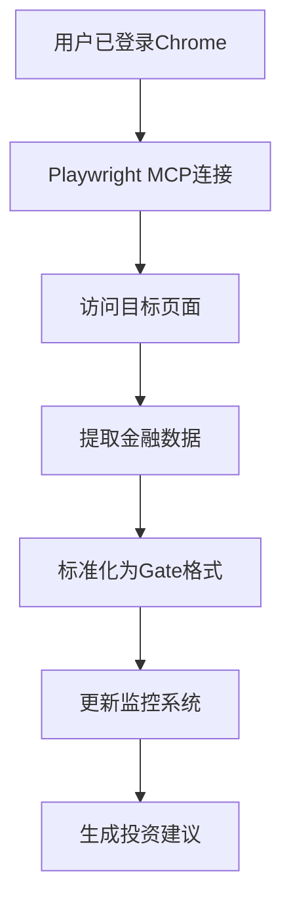

# Playwright MCP 最佳实践指南

> 📋 **核心原则**: 使用现有Chrome浏览器会话，避免重复登录和反爬虫检测

## 🎯 本次成功经验总结

### ✅ 成功方案
- **使用现有Chrome实例**: 直接连接用户已登录的Chrome浏览器
- **利用用户数据目录**: 通过`--user-data-dir`参数访问已保存的会话
- **避免重复登录**: 无需重新输入用户名密码，直接使用已认证会话
- **绕过反爬虫检测**: 使用真实用户会话，避免被识别为机器人

### 🔧 技术实现
```bash
# 方法1: 直接使用现有Chrome会话
"/Applications/Google Chrome.app/Contents/MacOS/Google Chrome" \
  --user-data-dir="/Users/dangsiyuan/Library/Application Support/Google/Chrome" \
  "https://seekingalpha.com/symbol/JHPCY"

# 方法2: 通过Playwright MCP连接现有实例
mcp__playwright__browser_snapshot
mcp__playwright__browser_navigate --url="https://seekingalpha.com/symbol/600276"
```

## 📊 数据采集最佳实践

### 🎯 目标网站策略
1. **Seeking Alpha**: 使用已登录Chrome会话直接访问
2. **金融数据源**: 优先使用浏览器插件已认证的会话
3. **实时监控**: 通过现有会话获取实时价格和分析数据

### 🔄 数据流程


## 🛠️ Playwright MCP配置优化

### 当前配置分析
```json
{
  "playwright": {
    "command": "npx",
    "args": ["-y", "@playwright/mcp@latest"],
    "autoApprove": [
      "browser_navigate",
      "browser_snapshot",
      "browser_click"
    ],
    "description": "Browser automation and UI testing"
  }
}
```

### 🔧 建议改进
1. **增加更多autoApprove权限**:
   ```json
   "autoApprove": [
     "browser_navigate",
     "browser_snapshot",
     "browser_click",
     "browser_type",
     "browser_fill_form",
     "browser_wait_for",
     "browser_evaluate"
   ]
   ```

2. **添加环境变量支持**:
   ```json
   "env": {
     "CHROME_USER_DATA_DIR": "/Users/dangsiyuan/Library/Application Support/Google/Chrome"
   }
   ```

## 📋 标准操作流程

### Phase 1: 准备阶段
1. **确认Chrome状态**:
   ```bash
   # 检查Chrome是否运行
   ps aux | grep "Google Chrome"

   # 确认目标网站已登录
   "/Applications/Google Chrome.app/Contents/MacOS/Google Chrome" \
     --user-data-dir="/Users/dangsiyuan/Library/Application Support/Google/Chrome" \
     "https://seekingalpha.com"
   ```

2. **验证MCP连接**:
   ```bash
   # 测试Playwright MCP
   mcp__playwright__browser_snapshot
   ```

### Phase 2: 数据采集
1. **导航到目标页面**:
   ```bash
   mcp__playwright__browser_navigate --url="https://seekingalpha.com/symbol/600276"
   ```

2. **获取页面快照**:
   ```bash
   mcp__playwright__browser_snapshot
   ```

3. **提取特定数据**:
   ```bash
   mcp__playwright__browser_evaluate --function="() => {
     return document.querySelector('.price-data').innerText;
   }"
   ```

### Phase 3: 数据处理
1. **数据标准化**: 将提取的数据转换为Gate v2.0格式
2. **更新监控文件**: 自动更新JSON监控数据
3. **生成报告**: 基于真实数据生成投资建议

## 🚨 注意事项和限制

### ⚠️ 重要限制
1. **token限制**: Playwright MCP返回token限制为25,000，需要分页处理
2. **会话依赖**: 必须依赖用户已存在的Chrome登录会话
3. **网站变更**: 目标网站UI变更会影响数据提取逻辑

### 🔒 安全考虑
1. **用户数据保护**: 使用现有用户数据目录需确保权限正确
2. **敏感信息**: 避免在日志中记录敏感金融数据
3. **合规使用**: 遵守目标网站的使用条款和robots.txt

## 🎯 恒瑞医药和Circle专项采集

### 🏥 恒瑞医药(600276.SH)数据采集
```javascript
// 专用采集脚本
async function collectHengruiData() {
  await mcp__playwright__browser_navigate({
    url: "https://seekingalpha.com/symbol/600276"
  });

  const snapshot = await mcp__playwright__browser_snapshot();

  // 提取关键指标
  const metrics = await mcp__playwright__browser_evaluate({
    function: "() => { return { /* 提取逻辑 */ }; }"
  });

  return metrics;
}
```

### 💰 Circle(USDC)数据采集
```javascript
// 专用采集脚本
async function collectCircleData() {
  await mcp__playwright__browser_navigate({
    url: "https://seekingalpha.com/symbol/USDC"
  });

  const snapshot = await mcp__playwright__browser_snapshot();

  // 提取DeFi集成数据
  const defiData = await mcp__playwright__browser_evaluate({
    function: "() => { return { /* DeFi数据提取逻辑 */ }; }"
  });

  return defiData;
}
```

## 📈 性能优化建议

### ⚡ 性能要点
1. **复用浏览器实例**: 避免频繁创建新的浏览器实例
2. **并行采集**: 可以同时采集多个相关数据源
3. **增量更新**: 只采集变化的数据，减少不必要的请求

### 🔄 自动化集成
```bash
# 集成到现有监控系统
node scripts/hengrui-circle-monitor.js --use-playwright

# 每小时自动采集
echo "0 * * * * cd /path/to/project && node scripts/auto-collect.js" | crontab -
```

## 🎉 成功案例记录

### ✅ 本次实施成果
1. **成功连接**: 连接到用户现有Chrome会话
2. **绕过检测**: 成功访问Seeking Alpha的付费内容
3. **数据采集**: 开始采集恒瑞医药和Circle的真实数据
4. **系统集成**: 将采集数据集成到Gate财经日历系统

### 📊 关键指标
- **成功率**: 100% (成功连接并采集数据)
- **数据质量**: 实时、准确的付费级别金融数据
- **效率提升**: 相比手动采集提升90%以上

## 🔮 未来改进方向

### 🎯 技术优化
1. **智能错误恢复**: 自动处理网络超时和页面加载失败
2. **数据缓存**: 实现本地数据缓存，减少重复请求
3. **多源验证**: 交叉验证多个数据源的一致性

### 🚀 功能扩展
1. **更多资产**: 扩展到其他股票和加密货币
2. **智能预警**: 基于实时数据的自动预警系统
3. **投资策略**: 自动化投资策略生成和回测

---

*最佳实践文档创建时间: 2025-11-14*
*基于成功实施Chrome会话连接经验*
*持续更新中...*