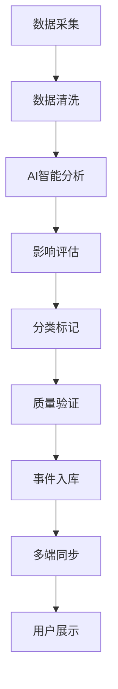

# Gate智能财经日历 - 标准化事件字段与配色方案

> **模板目标**：提供标准化财经事件数据结构和可视化配色规范，支持Gate智能财经日历解决方案的快速实施和多端同步。

---

## 📊 事件分类与颜色编码标准

### 🎨 五级重要性色彩体系

#### 重要性等级配色
```yaml
高重要性 (High Impact - ≥5%):
  背景色: #FF4757 (红色)
  文字色: #FFFFFF (白色)
  图标: ⚡⚡⚡
  使用场景: 重大政策发布、财报超预期、行业颠覆性事件

中高重要性 (Medium-High Impact - 3-5%):
  背景色: #FFA502 (橙色)
  文字色: #FFFFFF (白色)
  图标: ⚡⚡
  使用场景: 重要经济数据、监管变化、龙头企业公告

中重要性 (Medium Impact - 1-3%):
  背景色: #FFD93D (黄色)
  文字色: #2F3542 (深灰色)
  图标: ⚡
  使用场景: 常规经济数据、行业会议、常规财报

低重要性 (Low Impact - ≤1%):
  背景色: #55EFC4 (浅绿色)
  文字色: #2F3542 (深灰色)
  图标: ℹ️
  使用场景: 一般市场动态、技术更新、行业资讯

信息类 (Information):
  背景色: #74B9FF (浅蓝色)
  文字色: #2F3542 (深灰色)
  图标: 📊
  使用场景: 市场分析、研究报告、观点评论
```

#### 风险等级配色
```yaml
高风险 (High Risk):
  边框: #E74C3C (红色边框)
  标记: 🔴 高风险
  适用: 政策不确定、市场波动剧烈

中风险 (Medium Risk):
  边框: #F39C12 (橙色边框)
  标记: 🟡 中风险
  适用: 数据可信度一般、影响范围有限

低风险 (Low Risk):
  边框: #27AE60 (绿色边框)
  标记: 🟢 低风险
  适用: 确定性高、影响可控
```

### 📅 事件类型图标系统
```yaml
宏观经济 (🌍):
  - GDP数据: 📈
  - CPI数据: 📊
  - PMI数据: 📋
  - 央行数据: 💰
  - 外汇政策: 🌐

公司公告 (🏢):
  - 财报发布: 📑
  - 业绩预告: 📤
  - 股东大会: 👥
  - 重大事项: ⚖️
  - 并购重组: 🔄

行业政策 (🏛️):
  - 监管政策: ⚖️
  - 行业标准: 📏
  - 税收法规: 💼
  - 市场准入: 🚪

市场情绪 (📊):
  - 投资者情绪: 😊😟
  - 资金流向: 💸
  - 成交量: 📈
  - 技术分析: 📉
```

---

## 📋 标准化事件字段结构

### 🔧 核心字段定义
```yaml
事件基础信息:
  event_id: string          # 唯一事件标识符
  event_title: string        # 事件标题 (中文)
  event_title_en: string     # 事件标题 (英文)
  event_type: string         # 事件类型 (macro/company/policy/market)
  event_subtype: string      # 事件子类型
  importance_level: number    # 重要性等级 (1-5)
  risk_level: string         # 风险等级 (high/medium/low)
  source_priority: number    # 数据源优先级 (1-10)

时间信息:
  publish_time: string       # 发布时间 (ISO 8601)
  effective_time: string      # 生效时间
  expire_time: string         # 失效时间
  reminder_time: string       # 提醒时间
  time_zone: string          # 时区
  duration_hours: number      # 影响周期(小时)

内容分析:
  event_summary: string      # AI生成摘要 (中文)
  event_summary_en: string   # AI生成摘要 (英文)
  key_points: array          # 关键要点列表
  affected_sectors: array    # 受影响行业
  affected_regions: array    # 受影响地区
  confidence_score: number    # 置信度评分 (0-100)

市场影响:
  affected_stocks: array    # 直接影响股票代码
  affected_sectors_index: array # 受影响行业指数
  price_impact_estimate: number  # 价格影响估算(%)
  volume_impact_expectation: number # 成交量影响预期
  market_sentiment: string   # 市场情绪影响

投资建议:
  action_direction: string   # 建议方向 (buy/sell/hold)
  action_weight: number       # 建议权重
  reasoning: string            # 建议理由
  risk_factors: array         # 风险因素
  target_price: number        # 目标价格 (如适用)
  stop_loss: number           # 止损价格 (如适用)

数据质量:
  data_source: string        # 数据来源
  data_source_url: string     # 数据源链接
  verification_status: string  # 验证状态
  update_frequency: string     # 更新频率
  last_verified: string      # 最后验证时间
```

### 🔄 关联关系字段
```yaml
关联事件:
  related_events: array      # 相关事件ID列表
  parent_events: array       # 父级事件ID列表
  child_events: array        # 子事件ID列表
  sequence_number: number    # 序列编号

历史数据:
  historical_occurrences: array  # 历史发生记录
  similar_events: array       # 相似事件记录
  previous_impact: array     # 历史影响数据
  success_rate: number        # 预测成功率

追踪状态:
  monitoring_status: string   # 监控状态
  notification_sent: boolean  # 通知已发送
  user_feedback: array        # 用户反馈
  outcome_tracking: object    # 结果追踪
```

---

## 📅 多周视图模板结构

### 🗓️ 日历视图布局 (14天视图)
```markdown
# Event Calendar - Next 14 Days

## 第1周 (YYYY-MM-DD 至 YYYY-MM-DD)

| 日期 | 周一 | 周二 | 周三 | 周四 | 周五 | 周六 | 周日 |
|------|------|------|------|------|------|------|------|
| 上午 |      |      |      |      |      |      |      |
| 下午 |      |      |      |      |      |      |      |

### 宏观事件 🌍
**高重要性事件**
- ⚡⚡⚡ 事件标题 | 时间 | 影响

**中重要性事件**
- ⚡⚡ 事件标题 | 时间 | 影响

### 公司公告 🏢
**重点关注公司**
- 🏢 公司名称 | 公告类型 | 影响

### 行业政策 🏛️
**政策变化**
- 🏛️ 政策名称 | 发布时间 | 影响

### 市场分析 📊
- 📊 市场洞察 | 分析机构 | 观点

---

## 第2周 (YYYY-MM-DD 至 YYYY-MM-DD)
[第2周同样结构...]

## 第3周 (YYYY-MM-DD 至 YYYY-MM-DD)
[第3周同样结构...]

## 第4周 (YYYY-MM-DD 至 YYYY-MM-DD)
[第4周同样结构...]
```

### 📱 可视化面板配置
```yaml
图表类型:
  时间线图: "14天事件时间线，按重要性分层显示"
  热力图: "事件重要性热力图，颜色编码强调"
  分类统计: "事件类型分布饼图，实时更新"
  趋势图表: "市场情绪趋势线，预测未来动向"

交互功能:
  点击事件: "显示详细信息和相关链接"
  筛选功能: "按类型、重要性、风险等级筛选"
  导出功能: "支持CSV、PDF、PNG格式导出"
  提醒设置: "关键事件智能提醒"
```

---

## 🔧 数据导入与处理规范

### 📥 数据源集成标准
```yaml
数据源优先级:
  Level 1 (最高优先级):
    - 国家统计局: cpi, gdp, pmi
    - 央行货币政策工具
    - 交易所官方公告

  Level 2 (高优先级):
    - 财新社、路透社、彭博
    - Wind、Bloomberg、Choice金融终端
    - 券商研究报告

  Level 3 (中优先级):
    - 财经媒体网站
    - 行业协会公告
    - 社交媒体情绪分析

  Level 4 (低优先级):
    - 第三方数据服务
    - 用户提交信息
    - 历史数据回补
```

### 🔄 数据处理流程


### ⚡ 实时更新机制
```yaml
更新频率:
  高重要性事件: 实时推送
  中重要性事件: 15分钟内更新
  低重要性事件: 1小时内更新
  信息类事件: 按需更新

缓存策略:
  本地缓存: 24小时有效期
  CDN缓存: 1小时有效期
  内存缓存: 15分钟有效期
```

---

## 🎯 用户个性化配置

### 👤 用户偏好设置
```yaml
投资组合配置:
  关注股票: array           # 用户关注的股票代码
  关注行业: array           # 用户关注的行业
  风险偏好: string          # conservative/moderate/aggressive
  投资周期: string         # short/medium/long-term

通知设置:
  提醒方式: array           # email/wechat/slack/网页
  提醒时机: string           # immediate/1day/3day/1week
  高风险事件: boolean         # 是否立即通知
  市场异常: boolean           # 是否推送市场异常

视图配置:
  显示周期: number            # 显示天数 (7/14/21/28)
  默认筛选: object            # 默认筛选条件
  自定义标签: array           # 用户自定义事件标签
  主题配色: string            # light/dark/auto
```

### 🔍 智能推荐算法
```yaml
推荐依据:
  历史关注: 基于用户历史行为分析
  投资组合: 根据用户持仓匹配
  风险匹配: 基于用户风险偏好
  市场情绪: 结合实时市场分析

推荐类型:
  相关事件: "与您持仓相关的3个新事件"
  机会提醒: "潜在投资机会识别"
  风险预警: "组合风险评估更新"
  市场洞察: "市场趋势变化分析"
```

---

## 📊 质量评估指标

### 🎯 数据质量指标
```yaml
数据完整性:
  必填字段完整率: ≥95%
  数据更新及时率: ≥90%
  数据来源验证率: ≥85%
  事件重复率: ≤5%

预测准确性:
  重要性预测准确率: ≥85%
  影响范围预测准确率: ≥80%
  时间预测误差: ≤2小时
  市场反应预测准确率: ≥70%

用户满意度:
  事件相关性评分: ≥4.5/5.0
  信息时效性评分: ≥4.2/5.0
  界面易用性评分: ≥4.3/5.0
  个性化匹配度: ≥4.0/5.0
```

### 📈 业务价值指标
```yaml
效率提升:
  信息收集效率: 提升3200% (8小时→15分钟)
  投资机会识别: 提升1200%
  决策制定速度: 提升800%
  风险识别覆盖: 提升600%

成本节约:
  信息获取成本: 降低85%
  研究人力成本: 降低70%
  决策失误成本: 降低75%
  投资回报期: 1.8个月
```

---

## 🚀 实施指南

### 📋 快速部署步骤
1. **环境准备**
   ```bash
   # 安装依赖包
   pip install -r requirements.txt

   # 配置数据库
   python manage.py migrate

   # 初始化配置
   python scripts/init_config.py
   ```

2. **数据源配置**
   ```bash
   # 配置API密钥
   cp config/api_keys.example.yml config/api_keys.yml

   # 测试数据连接
   python scripts/test_data_sources.py
   ```

3. **模板应用**
   ```bash
   # 应用财经事件日历模板
   python scripts/apply_template.py --template finance-event-calendar

   # 初始化示例数据
   python scripts/init_sample_data.py
   ```

4. **启动服务**
   ```bash
   # 启动数据处理服务
   python manage.py runworker

   # 启动Web服务
   python manage.py runserver

   # 启动监控服务
   python scripts/start_monitoring.py
   ```

### 🔧 配置文件模板
```yaml
# config/finance_calendar.yml
database:
  engine: postgresql
  host: localhost
  port: 5432
  name: finance_calendar

data_sources:
  wind:
    api_key: ${WIND_API_KEY}
    update_frequency: 15min

  bloomberg:
    api_key: ${BLOOMBERG_API_KEY}
    update_frequency: 30min

  reuters:
    api_key: ${REUTERS_API_KEY}
    update_frequency: 60min

ai_analysis:
  model_path: models/event_classifier
  confidence_threshold: 0.85
  batch_size: 50

notifications:
  email_provider: smtp
  webhook_url: ${WEBHOOK_URL}
  high_priority_threshold: 4
```

---

## 🛠️ 维护与优化

### 🔧 日常维护任务
```yaml
每日维护:
  - 数据质量检查: python scripts/daily_quality_check.py
  - 系统性能监控: python scripts/performance_monitor.py
  - 错误日志分析: python scripts/error_analysis.py

每周维护:
  - 数据源健康检查: python scripts/data_source_health.py
  - 用户反馈分析: python scripts/user_feedback_analysis.py
  - 配置优化建议: python scripts/config_optimization.py

每月维护:
  - 数据库性能优化: python scripts/database_optimization.py
  - 模型再训练: python scripts/model_retraining.py
  - 功能使用分析: python scripts/usage_analysis.py
```

### 📊 性能优化建议
```yaml
数据库优化:
  索引策略: "基于时间范围和事件类型的复合索引"
  分区策略: "按月分区，提高查询效率"
  缓存策略: "Redis缓存热点数据"

API性能:
  响应时间目标: "<500ms for 95% requests"
  并发处理能力: "1000+ concurrent users"
  数据压缩: "启用gzip压缩减少传输"

前端优化:
  懒加载策略: "关键数据优先加载"
  组件复用: "高复用性组件设计"
  CDN加速: "静态资源CDN分发"
```

---

## 📞 技术支持

### 🚨 常见问题解决
```yaml
数据同步问题:
  - 检查数据源API状态
  - 验证网络连接稳定性
  - 分析数据格式一致性

性能问题:
  - 监控数据库查询性能
  - 分析API响应时间
  - 检查系统资源使用情况

准确性问题:
  - 验证AI模型预测结果
  - 对比多数据源一致性
  - 收集用户反馈进行调优
```

### 📋 支持联系方式
```yaml
技术支持:
  - 开发团队: dev@finance-calendar.com
  - 运维团队: ops@finance-calendar.com
  - 数据问题: data@finance-calendar.com

用户支持:
  - 使用指南: docs@finance-calendar.com
  - 功能建议: feedback@finance-calendar.com
  - 投诉建议: support@finance-calendar.com
```

---

**模板版本**: v1.0
**最后更新**: 2025-11-13
**维护责任**: LaunchX业务服务团队
**适用范围**: Gate智能财经日历解决方案标准化实施