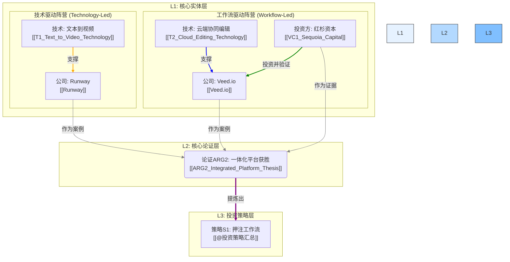

## 📋 执行摘要

[请在此处提供文档的核心内容摘要，包括关键发现、主要结论和重要建议。建议控制在200-300字以内。]

**核心要点**:
- [要点1]
- [要点2]
- [要点3]

# GI1: AI视频生态知识图谱 (AI Video Ecosystem Knowledge Graph)

- **洞察ID**: GI1
- **关联实体**: `[[Runway]]`, `[[Veed.io]]`, `[[VC1_Sequoia_Capital]]`, `[[T1_Text_to_Video_Technology]]`, `[[T2_Cloud_Editing_Technology]]`
- **状态**: `初步完成 (Draft)`
- **日期**: 2025-06-11

---

## 1. 洞察概述

本文件旨在通过**知识图谱**的形式，将我们在AI视频领域分析过的所有核心实体（公司、技术、投资机构）及其相互关系进行可视化。

这个图谱直观地揭示了"技术驱动"和"工作流驱动"这两大阵营的构成，以及它们如何共同支撑起我们的核心投资论证 `[[ARG2_Integrated_Platform_Thesis]]`。它是一个动态的、可扩展的分析仪表盘。

---

## 2. AI视频生态系统知识图谱

---

## 3. 图谱解读与分析

## 📊 核心发现

### 发现1: [标题]
[详细描述关键发现的内容、数据和意义]

### 发现2: [标题]
[详细描述关键发现的内容、数据和意义]

### 发现3: [标题]
[详细描述关键发现的内容、数据和意义]

## 🎯 重要意义

## 💡 结论与建议

## 📈 监控指标

## 📚 参考链接

### 内部资料
- [相关内部文档链接]
- [相关项目文档链接]
- [相关研究报告链接]

### 外部资源
- [外部研究报告链接]
- [行业分析链接]
- [专家观点链接]

### 数据来源
- [数据来源1] - [访问时间]
- [数据来源2] - [访问时间]
- [数据来源3] - [访问时间]

### 工具和平台
- [推荐工具1]
- [推荐工具2]
- [推荐工具3]

### 核心指标
- **[指标名称]**: [目标值] - [监控频率]
- **[指标名称]**: [目标值] - [监控频率]
- **[指标名称]**: [目标值] - [监控频率]

### 跟踪方法
- [监控方法1]
- [监控方法2]
- [监控方法3]

### 评估标准
- [标准1]: [评估方法]
- [标准2]: [评估方法]

### 主要结论
基于以上分析，我们得出以下核心结论：

1. [结论1 - 基于数据分析得出的结论]
2. [结论2 - 基于市场观察得出的结论]
3. [结论3 - 基于趋势判断得出的结论]

### 行动建议

#### 立即行动项 (0-30天)
- [行动项1] - [具体执行步骤]
- [行动项2] - [具体执行步骤]

#### 短期优化项 (30-90天)
- [优化项1] - [具体实施计划]
- [优化项2] - [具体实施计划]

#### 长期发展项 (90-180天)
- [发展项1] - [战略规划]
- [发展项2] - [战略规划]

### 成功指标
- [指标1]: [目标值] - [监控方法]
- [指标2]: [目标值] - [监控方法]

这些发现对[相关领域/决策]具有重要的指导意义，特别是：

1. [意义1]
2. [意义2]
3. [意义3]

1.  **两大阵营清晰可见**: 图谱清晰地展示了由 `Runway` 和 `T1_Text_to_Video_Technology` 构成的"技术驱动"阵营，以及由 `Veed.io`、`T2_Cloud_Editing_Technology` 和 `VC1_Sequoia_Capital` 构成的"工作流驱动"阵营。
2.  **证据链条可视化**: 从L1层的具体案例（Runway, Veed）和证据（红杉的投资），如何共同指向并支撑起L2层的核心论证 `ARG2`，这个过程一目了然。
3.  **洞察的升华路径**: 从核心论证 `ARG2` 最终提炼升华为顶级投资策略 `S1` 的路径也被清晰地呈现出来。
4.  **可扩展性**: 这个图谱是"活"的。未来当我们分析更多公司（如Pika, Captions）、技术或VC时，可以非常方便地将它们作为新的节点加入到这个图谱中，从而不断丰富和完善我们对整个生态的认知。

这个知识图谱是典型的L2层"综合洞察"的产出，它通过连接L1的分析单元，为L3的战略决策提供了坚实的可视化基础。