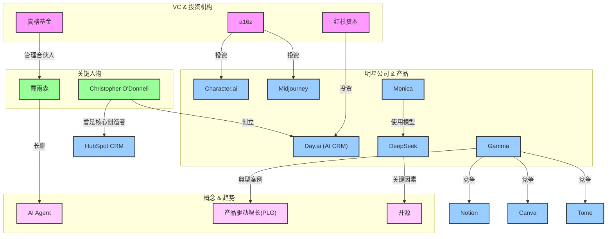

## 📋 执行摘要

[请在此处提供文档的核心内容摘要，包括关键发现、主要结论和重要建议。建议控制在200-300字以内。]

**核心要点**:
- [要点1]
- [要点2]
- [要点3]

# 知识图谱浏览器 v1.0

**版本**: 1.0
**创建日期**: 2025-06-10
**作者**: AI助手
**数据来源**: `knowledge/01_分析与洞察/00_数据库/d_关系_relationships/`

---

## 1. 简介

本浏览器旨在将您在 `02_processed` 目录中结构化的关系数据进行可视化，将静态的文本记录转化为可交互、可探索的动态知识网络。

通过这张图谱，我们可以直观地发现公司、人物和概念之间隐藏的复杂联系，从而获得超越单个文档的宏观洞察。

---

## 2. 公司与人物关系图谱

下面这张图谱，是根据您 `d1_公司关系` 和 `d4_人物关系` 数据中的一部分关键节点生成的可视化网络。

---

## 3. 图谱解读与洞察

这张图谱直观地揭示了您知识库中的几个关键模式：

1.  **顶级VC的生态布局**:
    *   **a16z** 在AIGC消费端进行了明确的布局，同时押注了UGC社区（`Character.ai`）和专业内容创作（`Midjourney`）两个方向。这反映了其对AI原生娱乐和创造力工具赛道的看好。
    *   **红杉资本** 投资 `Day.ai`，并由前 `HubSpot CRM` 的核心创始人创立，这是一个典型的"用更强的人、更新的技术，去颠覆一个成熟市场"的投资逻辑。

2.  **创始人基因的重要性**:
    *   `Day.ai` 的成功概率，很大程度上建立在其创始人 `Christopher O'Donnell` 曾成功打造过 `HubSpot CRM` 的经验之上。这种"可复制的成功经验"是投资人高度看重的"创始人基因"。

3.  **技术扩散路径**:
    *   开源模型 `DeepSeek` 正在成为新一代AI应用的技术底座之一，被 `Monica` 等产品快速采用。这揭示了"模型层"和"应用层"之间的共生关系，也表明了开源在加速AI技术普及中的关键作用。

4.  **产品维度的竞争格局**:
    *   `Gamma` 的案例清晰地表明，一个AI原生应用（如演示工具）会同时面临来自多个维度的竞争：既有传统巨头（`Canva`），也有同类AI工具（`Tome`），还有功能部分重叠的协同平台（`Notion`）。

---

## 4. 后续步骤

## 📊 核心发现

### 发现1: [标题]
[详细描述关键发现的内容、数据和意义]

### 发现2: [标题]
[详细描述关键发现的内容、数据和意义]

### 发现3: [标题]
[详细描述关键发现的内容、数据和意义]

## 🎯 重要意义

## 💡 结论与建议

## 📈 监控指标

## 📚 参考链接

### 内部资料
- [相关内部文档链接]
- [相关项目文档链接]
- [相关研究报告链接]

### 外部资源
- [外部研究报告链接]
- [行业分析链接]
- [专家观点链接]

### 数据来源
- [数据来源1] - [访问时间]
- [数据来源2] - [访问时间]
- [数据来源3] - [访问时间]

### 工具和平台
- [推荐工具1]
- [推荐工具2]
- [推荐工具3]

### 核心指标
- **[指标名称]**: [目标值] - [监控频率]
- **[指标名称]**: [目标值] - [监控频率]
- **[指标名称]**: [目标值] - [监控频率]

### 跟踪方法
- [监控方法1]
- [监控方法2]
- [监控方法3]

### 评估标准
- [标准1]: [评估方法]
- [标准2]: [评估方法]

### 主要结论
基于以上分析，我们得出以下核心结论：

1. [结论1 - 基于数据分析得出的结论]
2. [结论2 - 基于市场观察得出的结论]
3. [结论3 - 基于趋势判断得出的结论]

### 行动建议

#### 立即行动项 (0-30天)
- [行动项1] - [具体执行步骤]
- [行动项2] - [具体执行步骤]

#### 短期优化项 (30-90天)
- [优化项1] - [具体实施计划]
- [优化项2] - [具体实施计划]

#### 长期发展项 (90-180天)
- [发展项1] - [战略规划]
- [发展项2] - [战略规划]

### 成功指标
- [指标1]: [目标值] - [监控方法]
- [指标2]: [目标值] - [监控方法]

这些发现对[相关领域/决策]具有重要的指导意义，特别是：

1. [意义1]
2. [意义2]
3. [意义3]

这只是一个开始。基于您已经建立的结构化数据库，我们可以：

*   **构建更复杂的查询**: 例如，找出"所有被a16z投资的，且创始人有连续成功经验的公司"。
*   **动态生成图谱**: 根据您输入的任意一个实体（公司、人物、概念），动态生成其一度或二度关系网络。
*   **发现二级关系**: 找出A投资了B，B的核心成员创立了C，C又和D在竞争，这样的"隐藏"关系链条。

您的"知识工厂"已经准备好了所有原料，现在我们可以开始享受"自动化炼金"的乐趣了。