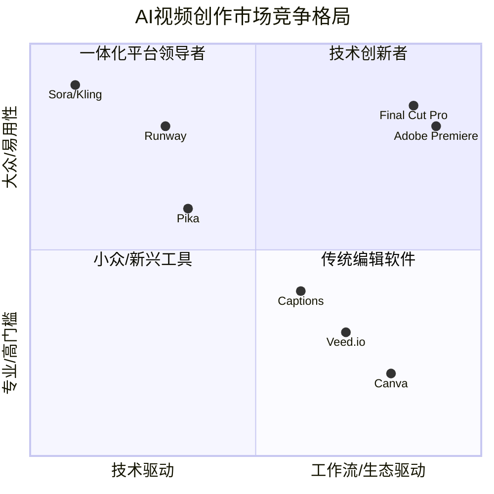

## 📋 执行摘要

[请在此处提供文档的核心内容摘要，包括关键发现、主要结论和重要建议。建议控制在200-300字以内。]

**核心要点**:
- [要点1]
- [要点2]
- [要点3]

# M1: AI视频创作市场分析

- **分析ID**: M1
- **关联公司**: `[[Runway]]`, `[[Veed.io]]`, `[[Pika]]`, `[[Kling AI (可灵)]]`, `[[Sora (OpenAI)]]`
- **关联技术**: `[[Generative AI]]`, `[[Text-to-Video]]`, `[[Cloud-based Editing]]`
- **状态**: `初步完成 (Draft)`
- **日期**: 2025-06-11

---

## 1. 市场定义与范畴

**AI视频创作市场**，指的是利用人工智能技术（特别是生成式AI）来辅助或全自动生成、编辑和优化视频内容的软件、平台与服务市场。

这个市场覆盖了从个人创作者、中小企业营销团队到大型媒体公司的完整用户光谱，其核心价值在于**降低视频创作的门槛、提升内容生产的效率**。

当前市场主要包含两类核心产品形态：
1.  **纯AI生成工具**: 以"文本到视频"或"图像到视频"为主要功能，专注于内容从无到有的生成环节。
2.  **AI增强的在线编辑平台**: 在成熟的云端视频编辑工作流中，将AI作为提效和增强创意的插件集成。

---

## 2. 市场规模与增长预测

- **现状**: 视频已成为互联网流量的主体（Cisco预测占82%以上）。与此同时，内容营销、社交媒体广告和在线教育等领域对视频的需求正以前所未有的速度爆发。
- **增长**: 虽然精确的第三方市场规模数据仍在形成中，但考虑到视频市场的巨大存量和AI带来的颠覆性效率提升，这无疑是一个**千亿级别潜力**的赛道。
- **预测**: 预计未来3-5年，随着AI生成质量的提升和成本的下降，市场将经历**指数级增长**。主要的增长动力将来自于大量过去因成本和技术门槛而被抑制的中小企业和个人创作者需求的释放。

---

## 3. 核心玩家与生态图谱

我们基于"技术驱动"和"工作流驱动"两个维度，绘制了当前市场的核心玩家生态图谱。

- **技术创新者 (左上)**: 以 `Runway`, `Sora`, `Kling` 为代表，专注于突破性的生成技术，目标用户更偏向专业人士和艺术家。
- **一体化平台领导者 (右上)**: 以 `Veed.io`, `Captions`, `Canva` 为代表，专注于提供端到端的易用工作流，目标用户是更广泛的内容创作者和营销团队。
- **传统编辑软件 (右下)**: 以 `Adobe Premiere`, `Final Cut Pro` 为代表，拥有庞大的专业用户基础，正在努力集成AI功能以应对挑战。

---

## 4. 市场演进路径与增长动力

- **双路径收敛**: 我们坚信，市场的终局将是"一体化平台"。如我们的核心论证 `[[ARG2_Integrated_Platform_Thesis]]` 所述，技术驱动和工作流驱动最终将"殊途同归"。
- **核心驱动力**:
    1. **内容需求剧增**: 企业和个人都需要更多、更快、更高质量的视频。
    2. **技术平权**: AI显著降低了专业级视频制作的门槛。
    3. **成本效益**: AI大幅降低了时间成本和人力成本。

---

## 5. 主要挑战与风险

1.  **版权问题**: AI模型的训练数据来源是目前最大的法律和道德风险，可能对行业格局产生颠覆性影响。
2.  **技术成熟度**: 生成视频的稳定性、可控性和角色一致性仍有待提高。
3.  **计算成本**: 高质量视频生成需要巨大的计算资源，这直接影响产品的定价和盈利能力。
4.  **同质化竞争**: 随着底层模型能力的趋同，应用层的竞争将异常激烈，纯粹的"套壳"应用将难以生存。

---

## 6. 关键结论

## 📊 核心发现

### 发现1: [标题]
[详细描述关键发现的内容、数据和意义]

### 发现2: [标题]
[详细描述关键发现的内容、数据和意义]

### 发现3: [标题]
[详细描述关键发现的内容、数据和意义]

## 🎯 重要意义

## 💡 结论与建议

## 📈 监控指标

## 📚 参考链接

### 内部资料
- [相关内部文档链接]
- [相关项目文档链接]
- [相关研究报告链接]

### 外部资源
- [外部研究报告链接]
- [行业分析链接]
- [专家观点链接]

### 数据来源
- [数据来源1] - [访问时间]
- [数据来源2] - [访问时间]
- [数据来源3] - [访问时间]

### 工具和平台
- [推荐工具1]
- [推荐工具2]
- [推荐工具3]

### 核心指标
- **[指标名称]**: [目标值] - [监控频率]
- **[指标名称]**: [目标值] - [监控频率]
- **[指标名称]**: [目标值] - [监控频率]

### 跟踪方法
- [监控方法1]
- [监控方法2]
- [监控方法3]

### 评估标准
- [标准1]: [评估方法]
- [标准2]: [评估方法]

### 主要结论
基于以上分析，我们得出以下核心结论：

1. [结论1 - 基于数据分析得出的结论]
2. [结论2 - 基于市场观察得出的结论]
3. [结论3 - 基于趋势判断得出的结论]

### 行动建议

#### 立即行动项 (0-30天)
- [行动项1] - [具体执行步骤]
- [行动项2] - [具体执行步骤]

#### 短期优化项 (30-90天)
- [优化项1] - [具体实施计划]
- [优化项2] - [具体实施计划]

#### 长期发展项 (90-180天)
- [发展项1] - [战略规划]
- [发展项2] - [战略规划]

### 成功指标
- [指标1]: [目标值] - [监控方法]
- [指标2]: [目标值] - [监控方法]

这些发现对[相关领域/决策]具有重要的指导意义，特别是：

1. [意义1]
2. [意义2]
3. [意义3]

- **当前投资重点**: 市场的主要机会在于**"工作流驱动"的一体化平台**。这类公司通过解决用户真实的端到端需求，建立了更稳固的商业模式和用户护城河。
- **未来变量**: 需要密切关注底层模型（如Sora）的发展，以及其可能带来的对应用层格局的颠覆。同时，版权问题的最终司法裁决将是决定行业长期健康发展的关键。
- **市场本质**: AI视频市场的核心竞争，最终是关于**"谁能最高效地帮助用户完成一条可发布的成品视频"**，而不仅仅是生成一个炫酷的片段。