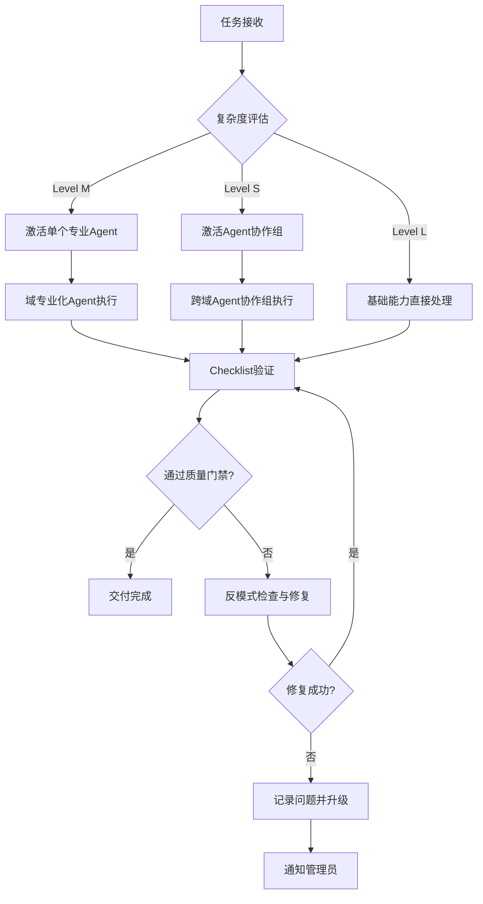
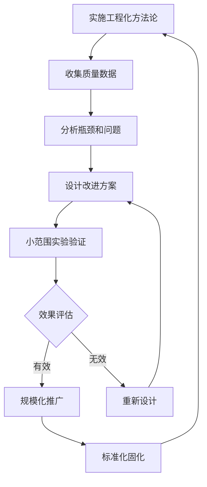

# LaunchX 工程化方法论

## 设计哲学与核心理念

### 工程化核心原则

**"用工程基础设施强制执行质量标准，确保零错误遗漏，而不是寄希望于提示词技巧"**

这一理念代表了AI协作范式的根本转变：

- **从依赖提示词技巧** → **转向工程化强制执行**
- **从寄望AI自律** → **转向基础设施保障**
- **从软性质量要求** → **转向硬性质量门禁**
- **从人工流程控制** → **转向自动化质量保障**

### 方法论架构层次

```
┌─────────────────────────────────────────────────────────────┐
│                    CLAUDE.md (战略层)                        │
│  ┌─────────────────┬─────────────────┬─────────────────────┐ │
│  │   任务复杂度    │    Phase 0      │    Agent激活        │ │
│  │   自动评估       │   认知负荷       │    配置化           │ │
│  └─────────────────┴─────────────────┴─────────────────────┘ │
└─────────────────────────────────────────────────────────────┘
                                │
                                ▼
┌─────────────────────────────────────────────────────────────┐
│                    RULES.md (执行层)                         │
│  ┌─────────────────┬─────────────────┬─────────────────────┐ │
│  │  Hook系统       │  Dev Docs       │  零错误检查         │ │
│  │  关键节点        │  三文件体系      │  TypeScript门禁    │ │
│  └─────────────────┴─────────────────┴─────────────────────┘ │
└─────────────────────────────────────────────────────────────┘
                                │
                                ▼
┌─────────────────────────────────────────────────────────────┐
│               实施脚本与配置 (基础设施层)                      │
│  ┌─────────────────┬─────────────────┬─────────────────────┐ │
│  │  技能规则配置    │  Hook脚本       │  Agent配置          │ │
│  │  skill-rules    │  quality-gates  │  domain-agents      │ │
│  └─────────────────┴─────────────────┴─────────────────────┘ │
└─────────────────────────────────────────────────────────────┘
```

## 五大核心方法论指导原则

实践抽象的五大方法论，为工程化系统提供顶层设计指导：

### 1. 专业化分工方法论 (Domain Specialization)

**核心思想**：基于业务领域进行专业化分工，通过清晰的领域边界避免任务混乱，提升专业深度。

**方法论原则**：
- **领域边界清晰化**：明确定义各专业域的职责范围和能力边界
- **专业化深度优先**：避免通用化，追求在特定领域的专业深度
- **协作接口标准化**：定义跨域协作的标准接口和交接机制
- **知识体系化沉淀**：每个域建立完整的知识体系和最佳实践

### 2. 标准化协作方法论 (Standardized Collaboration)

**核心思想**：用标准化清单驱动AI协作，强制任务完整性和验收标准，确保质量交付。

**方法论原则**：
- **Checklist驱动**：每个任务都必须有完整的检查清单
- **验收标准前置**：在任务开始前就明确验收标准和交付要求
- **过程可追溯**：每个关键决策和行动都有记录和追溯
- **质量闭环管理**：从需求到交付的完整质量闭环

### 3. 风险防控方法论 (Risk Prevention)

**核心思想**：建立明确边界和禁止事项的风险防控体系，前置识别常见陷阱。

**方法论原则**：
- **边界明确化**：明确定义可以做什么和不可以做什么
- **反模式速查**：建立常见错误和陷阱的快速参考指南
- **风险前置识别**：在任务开始前识别潜在风险点
- **应急预案体系**：为关键风险点制定应急响应预案

### 4. 知识沉淀方法论 (Knowledge Management)

**核心思想**：标准化信息闭环和知识沉淀，确保经验积累和组织学习。

**方法论原则**：
- **模板标准化**：统一的总结、汇报、复盘模板
- **信息闭环管理**：从输入到输出的完整信息闭环
- **经验结构化**：将经验转化为可复用的结构化知识
- **持续迭代优化**：基于反馈持续优化方法论本身

### 5. 时效性管理方法论 (Temporal Management)

**核心思想**：基于时间约束的知识管理，强制时效性，避免知识积压和遗忘。

**方法论原则**：
- **时效性强制约束**：设定明确的时间节点和归档要求
- **优先级动态调整**：基于时效性要求动态调整任务优先级
- **知识保鲜机制**：定期更新和清理过时信息
- **流程节奏控制**：建立稳定的工作节奏和产出周期

---

## 四大核心工程系统

### 1. 技能自动激活系统 (Skills Auto-Activation)

#### 设计原理
基于**模式识别**和**上下文感知**的自动技能加载机制，确保AI在特定技术场景下自动加载对应的专业规范和最佳实践。

#### 技术实现架构
```json
{
  "skillActivationEngine": {
    "detectionLayers": [
      {
        "layer": "keywordMatching",
        "priority": 1,
        "description": "用户输入关键词实时匹配"
      },
      {
        "layer": "filePathAnalysis",
        "priority": 2,
        "description": "文件路径模式识别"
      },
      {
        "layer": "contentPatternRecognition",
        "priority": 3,
        "description": "代码内容模式深度分析"
      }
    ],
    "activationLogic": "OR逻辑 + 优先级排序 + 上下文增强"
  }
}
```

#### 技能激活决策树
```bash
# 技能激活决策算法
activate_skills() {
  local task_input="$1"
  local file_context="$2"
  local content_analysis="$3"

  # 第一层：关键词匹配 (权重: 30%)
  local keyword_score=$(calculate_keyword_match "$task_input")

  # 第二层：文件路径触发 (权重: 40%)
  local filepath_score=$(analyze_filepath_triggers "$file_context")

  # 第三层：内容模式识别 (权重: 30%)
  local content_score=$(detect_content_patterns "$content_analysis")

  # 综合评分阈值: ≥70% 自动激活
  local total_score=$((keyword_score * 30/100 + filepath_score * 40/100 + content_score * 30/100))

  if [[ $total_score -ge 70 ]]; then
    activate_matched_skills "$task_input"
  fi
}
```

#### 价值主张
- **零配置启动**：AI无需人工指导即可识别任务类型并加载对应技能
- **上下文感知**：基于文件路径、代码模式、关键词的多维度识别
- **持续学习**：技能规则可动态扩展，支持新模式的自适应学习

### 2. Dev Docs 三文件工作流系统

#### 设计理念
将LaunchX原有的 `/spec → /plan → /do` 循环升级为标准化的三文件体系，确保每个任务都有完整的认知框架和执行蓝图。

#### 三文件认知模型
```
plan.md (战略规划)     ←→    context.md (上下文)     ←→    tasks.md (执行清单)
     │                     │                         │
   ▼ │                   ▼ │                       ▼ │
目标定义                 环境分析                   任务分解
成功指标                 资产复用                   验收标准
风险评估                 约束条件                   责任分配
时间规划                 技术栈选型                 依赖关系
```

#### 认知负荷管理
根据任务复杂度动态调整Phase 0认知负荷：

**Level L任务 (简单)**
- Phase 0 Checklist: 5-8项基础检查
- 认知负荷: <15分钟
- Dev Docs: 简化版三文件

**Level M任务 (中等)**
- Phase 0 Checklist: 10-15项标准检查
- 认知负荷: 15-30分钟
- Dev Docs: 标准三文件体系

**Level S任务 (复杂)**
- Phase 0 Checklist: 20-25项深度检查
- 认知负荷: 30-60分钟
- Dev Docs: 增强三文件 + 风险管理附录

#### 工程化价值
- **认知框架标准化**：统一的任务理解和规划框架
- **知识复用最大化**：强制关联现有资产和最佳实践
- **风险可控化**：前置识别技术、业务、合规风险
- **交付可预测**：基于标准流程的交付质量保障

### 3. 零错误质量门禁系统

#### 核心哲学
**"零错误是可以通过工程化手段强制执行的标准，而不是可望不可及的目标"**

#### 质量门禁架构
```typescript
interface QualityGate {
  level: 'critical' | 'warning' | 'info';
  check: () => QualityCheckResult;
  failureAction: 'block' | 'warn' | 'log';
  autoFix?: boolean;
  rollbackStrategy?: string;
}

// 关键节点质量门禁配置
const criticalGates: QualityGate[] = [
  {
    level: 'critical',
    check: () => typescriptCompilationCheck(),
    failureAction: 'block', // 阻塞执行
    autoFix: false,
    rollbackStrategy: 'git reset --hard HEAD~1'
  },
  {
    level: 'critical',
    check: () => lintStandardsCheck(),
    failureAction: 'block',
    autoFix: true, // 自动修复格式问题
    rollbackStrategy: 'git checkout -- .'
  }
];
```

#### 零错误实现策略
1. **编译时零容忍**：TypeScript编译错误数必须为0
2. **代码质量零妥协**：Lint检查通过率100%
3. **测试覆盖零盲区**：关键路径测试覆盖率>80%
4. **安全扫描零遗漏**：中高危安全漏洞数量=0

#### 渐进式质量保障
```bash
# Level 1: 基础语法检查 (每次编辑)
basic_syntax_check() {
  npx tsc --noEmit --skipLibCheck
}

# Level 2: 代码质量检查 (每次保存)
quality_standards_check() {
  npm run lint && npm run format:check
}

# Level 3: 测试验证 (每次提交)
test_coverage_check() {
  npm run test -- --coverage --passWithNoTests
}

# Level 4: 生产就绪检查 (每次发布)
production_readiness_check() {
  npm run build && npm audit --audit-level moderate
}
```

### 7. 专业化Agent配置系统

#### Agent激活原则
**"只有Level S/M任务才激活专业化Agent，Level L任务由基础能力直接处理"**

#### Agent专业化矩阵（融合2357核心域）
```json
{
  "agentSpecialization": {
    "investmentAnalyst": {
      "expertise": ["市场分析", "估值建模", "风险评估", "投资策略"],
      "activationThreshold": "Level M+",
      "domain": "investment_desk",
      "toolbelt": ["market-research", "financial-modeling", "risk-assessment"],
      "qualityStandards": ["数据权威性", "分析深度", "洞察价值"],
      "outputFormat": "investment-analysis-report"
    },
    "businessStrategist": {
      "expertise": ["客户需求分析", "交付规划", "关系管理", "合同谈判"],
      "activationThreshold": "Level M+",
      "domain": "business_ops",
      "toolbelt": ["proposal-generator", "delivery-tracker", "crm-integration"],
      "qualityStandards": ["需求深度分析", "交付可行性评估", "风险控制"],
      "outputFormat": "business-strategy-document"
    },
    "learningEngineer": {
      "expertise": ["方法论研究", "知识萃取", "最佳实践", "学习路径设计"],
      "activationThreshold": "Level L+",
      "domain": "learning_lab",
      "toolbelt": ["knowledge-extraction", "methodology-design", "learning-analytics"],
      "qualityStandards": ["系统性", "可复制性", "实践价值"],
      "outputFormat": "learning-framework-document"
    },
    "techArchitect": {
      "expertise": ["系统架构", "技术选型", "性能优化", "代码质量"],
      "activationThreshold": "Level L+",
      "domain": "tech_core",
      "toolbelt": ["architecture-tools", "performance-profiler", "code-analyzer"],
      "qualityStandards": ["可扩展性", "安全性", "可维护性"],
      "outputFormat": "technical-architecture-specification"
    },
    "designSpecialist": {
      "expertise": ["视觉设计", "UI/UX", "品牌策略", "用户体验"],
      "activationThreshold": "Level L+",
      "domain": "design_guild",
      "toolbelt": ["design-tools", "prototyping", "brand-guidelines"],
      "qualityStandards": ["美学价值", "用户友好", "品牌一致性"],
      "outputFormat": "design-system-document"
    }
  }
}
```

#### Agent协作工作流（优化版）


#### 方法论与工程系统的融合价值

### LaunchX + Reddit + 2357 三大融合价值

#### 五大方法论指导四大工程系统

| 方法论指导 | 工程系统体现 | 具体融合价值 |
| --- | --- | --- |
| **专业化分工方法论** | Agent专业化配置系统 | 基于领域边界的Agent分工，避免任务混乱 |
| **标准化协作方法论** | Dev Docs三文件工作流系统 | Checklist驱动的协作流程，确保质量交付 |
| **风险防控方法论** | 零错误质量门禁系统 | 反模式速查保护，前置识别常见陷阱 |
| **知识沉淀方法论** | 三文件体系 + Summary模板 | 标准化信息闭环，确保知识沉淀 |
| **时效性管理方法论** | Hook关键节点系统 + 自动归档 | 时间约束管理，强制时效性和流程节奏 |

#### 融合价值总结

1. **领域专业化分工**：基于五大核心域的清晰边界，实现专业化Agent分工
2. **Checklist驱动协作**：强制任务完整性和验收标准，确保质量交付
3. **反模式速查保护**：明确的边界和禁止事项，避免常见陷阱
4. **标准化信息闭环**：统一的Summary模板和时效性归档机制，确保知识沉淀
5. **方法论指导工程化**：五大方法论为四大工程系统提供顶层设计指导

## Hook关键节点系统（增强版）

## Hook关键节点系统

### Hook设计哲学
**"Hook系统应该像安全网，而不是绊脚绳"**

- **关键节点原则**：只在可能造成重大损失的节点设置Hook
- **零干扰原则**：Hook检查对正常工作流程的干扰最小化
- **自动修复原则**：优先自动修复，其次提示，最后阻塞
- **快速失败原则**：发现不可修复问题立即停止，避免浪费

### 关键节点识别矩阵
```typescript
interface CriticalNode {
  stage: 'pre-commit' | 'pre-push' | 'pre-deploy' | 'post-merge';
  impact: 'data-loss' | 'security-breach' | 'production-outage' | 'customer-impact';
  probability: 'high' | 'medium' | 'low';
  severity: 'critical' | 'high' | 'medium' | 'low';
  hookRequired: boolean;
}

// 关键节点决策算法
const criticalNodes: CriticalNode[] = [
  {
    stage: 'pre-commit',
    impact: 'production-outage',
    probability: 'high',
    severity: 'critical',
    hookRequired: true // TypeScript编译检查
  },
  {
    stage: 'pre-deploy',
    impact: 'customer-impact',
    probability: 'medium',
    severity: 'critical',
    hookRequired: true // 生产构建验证
  }
];
```

### Hook执行效率优化
```bash
# 增量检查策略
incremental_hook_check() {
  local changed_files=$(git diff --cached --name-only)

  # 只检查变更文件相关的规则
  for file in $changed_files; do
    case "$file" in
      *.ts|*.tsx)
        typescript_check_file "$file"
        ;;
      *.md)
        markdown_lint_check "$file"
        ;;
      *.json)
        json_schema_validate "$file"
        ;;
    esac
  done
}

# 并行检查策略
parallel_quality_checks() {
  # 并行执行独立检查项
  {
    typescript_compilation_check &
    lint_standards_check &
    security_vulnerability_scan &
    wait  # 等待所有检查完成
  }
}
```


### 反馈循环设计



### 方法论价值总结

LaunchX工程化方法论通过五大方法论指导四大核心系统的构建，实现了：

1. **质量保障工程化**：从依赖提示词技巧转向基础设施强制执行
2. **认知框架标准化**：统一的任务理解和执行框架
3. **专业能力模块化**：可配置、可扩展的技能和Agent体系
4. **风险控制前置化**：通过Hook系统在关键节点防止问题发生
5. **协作方法论化**：用五大方法论指导AI协作，实现系统性质量保障


---

**"真正的工程化不是限制创造，而是为创造提供最坚实的基础。通过构建可靠的质量保障体系，我们让AI能够更安全、更高效地发挥其创造力，最终实现人机协作的最优解。"**

*—— LaunchX 工程化方法论设计理念*