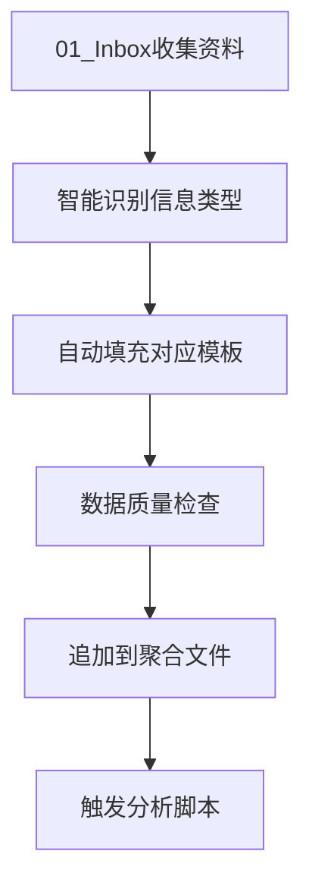

# AI投资数据模板体系

> **核心定位**：为AI投资分析提供标准化、模板化的数据收集和处理框架，确保投资决策的数据基础一致性和可比较性

## 📋 模板体系概述

### 核心价值
- **标准化数据收集**：建立统一的数据收集标准和格式
- **提升分析效率**：通过模板化减少重复性数据整理工作
- **确保数据质量**：通过结构化模板保证数据完整性和准确性
- **支持自动化流程**：为自动化投资分析提供数据基础

### 适用范围
- AI初创项目投资分析
- 投资组合数据管理
- 竞品分析和市场研究
- 投后监控和绩效评估

## 🗂️ 核心数据模板

### 1. 项目档案模板

#### 1.1 基础信息模板
```yaml
项目基础信息:
  项目名称: [项目全称]
  英文名称: [Project Name]
  成立时间: [YYYY-MM-DD]
  所在地: [城市/国家]
  官网: [https://example.com]
  项目简介: [1-2句话描述]

核心标签:
  技术标签: [AI/ML/NLP/CV等]
  行业标签: [金融/医疗/教育等]
  业务标签: [B2B/B2C/平台等]
  阶段标签: [种子/Pre-A/A轮等]
```

#### 1.2 团队信息模板
```yaml
团队结构:
  团队规模: [人数]
  核心成员: [3-5人详细信息]
    - 姓名: [创始人姓名]
      职位: [CEO/CTO等]
      背景: [教育/工作经历]
      专业领域: [技术/业务专长]
      联系方式: [邮箱/LinkedIn]

团队画像:
  技术背景占比: [XX%]
  行业经验年数: [XX年]
  创业经历: [是/否，详情]
  团队稳定性: [高/中/低]
```

#### 1.3 产品信息模板
```yaml
产品核心:
  产品定位: [一句话定位]
  核心功能: [3-5个核心功能]
  技术架构: [主要技术栈]
  知识产权: [专利/软著等]

产品状态:
  开发阶段: [概念/MVP/商业化]
  用户规模: [DAU/MAU]
  客户数量: [B2B客户数]
  覆盖地区: [国家/地区列表]
```

#### 1.4 融资信息模板
```yaml
融资历程:
  当前轮次: [种子/Pre-A/A轮]
  融资目标: [金额]
  已融资金: [金额]
  投资方: [投资机构列表]
  估值: [投前/投后估值]

财务状况:
  月收入: [MRR/ARR]
  收入增长率: [月环比]
  现金储备: [可用月数]
  盈利状况: [盈利/亏损/平衡]
```

#### 1.5 关键指标模板
```yaml
业务指标:
  用户增长: [月增长率]
  客户获取成本: [CAC]
  客户生命周期价值: [LTV]
  留存率: [月/年留存率]

技术指标:
  系统稳定性: [SLA]
  响应时间: [平均响应时间]
  数据处理能力: [并发/数据量]
  API可用性: [可用性百分比]
```

### 2. 趋势评分模板

#### 2.1 趋势强度评分
```yaml
趋势强度评估:
  市场验证度: [0-100分]
    - 用户增长趋势: [0-40分]
    - 收入增长趋势: [0-30分]
    - 市场反馈质量: [0-30分]

  技术壁垒: [0-100分]
    - 技术复杂度: [0-30分]
    - 专利保护: [0-25分]
    - 生态集成度: [0-25分]
    - 复制难度: [0-20分]

  商业化成熟度: [0-100分]
    - 商业模式清晰度: [0-30分]
    - 收入模式稳定性: [0-30分]
    - 客户获取成本合理性: [0-25分]
    - 规模化潜力: [0-15分]

  投资热度: [0-100分]
    - 融资频率: [0-30分]
    - 估值增长趋势: [0-25分]
    - 竞争激烈程度: [0-25分]
    - 媒体关注度: [0-20分]

综合评分: [总分/400]
评级: [强趋势/中等趋势/弱趋势/伪趋势]
```

#### 2.2 趋势验证状态
```yaml
验证状态:
  数据来源: [具体数据源]
  可信度评级: [★☆☆☆☆ - ★★★★★]
  验证方法: [交叉验证/专家评估/数据分析]
  更新频率: [实时/日/周/月]

置信度评估:
  数据完整性: [高/中/低]
  样本代表性: [强/中/弱]
  时效性: [最新/较新/一般]
  综合置信度: [XX%]
```

### 3. 族谱分析模板

#### 3.1 AI项目族谱分类
```yaml
族谱分类:
  主要族谱: [工作流渗透者/社区平台型/高壁垒服务者/全栈颠覆者]

  族谱特征:
    - 特征1: [具体特征描述]
    - 特征2: [具体特征描述]
    - 特征3: [具体特征描述]

  创始人基因:
    - 背景1: [技术/产品/商业背景]
    - 背景2: [行业经验/领域专长]
    - 背景3: [创业经历/个人特质]

  GTM策略:
    主要策略: [PLG/CLG/SLG/混合模式]
    执行情况: [策略执行状态]
    效果评估: [策略效果评估]
```

#### 3.2 代表项目对比
```yaml
同族谱项目对比:
  对比项目1:
    项目名称: [对比项目]
    相似度: [XX%]
    差异点: [主要差异]
    成功因素: [成功关键因素]

  对比项目2:
    项目名称: [对比项目]
    相似度: [XX%]
    差异点: [主要差异]
    成功因素: [成功关键因素]

竞争分析:
  直接竞争: [直接竞争对手列表]
  间接竞争: [间接竞争对手列表]
  竞争优势: [项目相对优势]
  竞争劣势: [项目相对劣势]
```

### 4. 投资热度模板

#### 4.1 市场热度评估
```yaml
投资热度指标:
  估值水平:
    当前估值: [金额]
    同行对比: [高于/持平/低于同行]
    估值合理性: [高/中/低]

  融资活跃度:
    融资轮次: [当前轮次]
    融资速度: [快/中/慢]
    投资方质量: [顶级/知名/一般]

  资本参与度:
    投资机构数量: [数量]
    战略投资者: [有/无]
    产业资本参与: [是/否]

市场认知:
  媒体曝光度: [高/中/低]
  行业影响力: [强/中/弱]
  用户口碑: [正面/中性/负面]
```

#### 4.2 外部数据源整合
```yaml
外部数据来源:
  数据库1: [数据库名称]
    - 数据类型: [融资/市场/技术]
    - 更新频率: [实时/日/周]
    - 可信度: [高/中/低]

  数据库2: [数据库名称]
    - 数据类型: [融资/市场/技术]
    - 更新频率: [实时/日/周]
    - 可信度: [高/中/低]

MCP服务:
  服务名称: [具体MCP服务]
  数据类型: [提供的数据类型]
  调用频率: [使用频率]
  数据质量: [质量评估]
```

## 🔄 自动化流程集成

### 1. 数据输入流程


### 2. 模板填充规范
- **数据来源标注**：每个数据点必须标注来源
- **更新时间记录**：记录每次数据更新的时间
- **质量评级**：对数据质量进行星级评级
- **验证状态**：标注数据的验证状态

### 3. 脚本执行流程
```bash
# 趋势评分计算
python tools/trend_score_calculator.py --template trend_score --project [project_id]

# 族谱分析图生成
python tools/species_cluster.py --template species_analysis --sector [sector_name]

# 投资热度分析
python tools/investment_heat_analyzer.py --template investment_heat --market [market_name]
```

## 📊 数据质量控制

### 1. 数据质量标准
- **完整性**：必填字段完成率≥95%
- **准确性**：数据准确率≥90%
- **时效性**：数据更新及时率≥85%
- **一致性**：格式一致性≥95%

### 2. 质量检查机制
- **自动检查**：脚本自动检查数据格式和完整性
- **人工审核**：关键数据点人工复核
- **交叉验证**：多源数据交叉验证
- **定期更新**：按固定周期更新数据

### 3. 异常数据处理
```yaml
异常处理流程:
  数据缺失:
    - 标注缺失字段
    - 寻找替代数据源
    - 估算和标注
    - 定期补充更新

  数据冲突:
    - 标注冲突数据
    - 查找权威数据源
    - 记录决策依据
    - 持续跟踪验证

  数据异常:
    - 标记异常值
    - 分析异常原因
    - 决定保留/修正/删除
    - 记录处理过程
```

## 🔧 使用指南

### 1. 新项目分析
1. **创建项目档案**：使用项目档案模板收集基础信息
2. **趋势评分**：填写趋势评分模板，计算趋势强度
3. **族谱定位**：使用族谱分析模板确定项目定位
4. **投资热度评估**：评估当前投资热度和市场认知

### 2. 数据维护
1. **定期更新**：按月/季度更新关键数据
2. **质量检查**：定期进行数据质量检查
3. **版本管理**：保留数据变更历史
4. **备份管理**：定期备份重要数据

### 3. 分析应用
1. **横向对比**：使用标准化数据进行项目对比
2. **趋势跟踪**：跟踪数据变化趋势
3. **决策支持**：为投资决策提供数据支撑
4. **报告生成**：基于模板数据生成分析报告

## 📋 最佳实践

### 1. 数据收集原则
- **一手数据优先**：优先使用官方和一手数据源
- **多方验证**：关键数据需要多个来源验证
- **及时更新**：数据变更后及时更新模板
- **标准化记录**：严格按照模板格式记录数据

### 2. 团队协作
- **分工明确**：不同类型数据由专人负责
- **标准统一**：团队使用统一的数据标准
- **定期同步**：定期同步数据更新状态
- **质量共享**：建立数据质量共享机制

### 3. 工具使用
- **自动化优先**：优先使用自动化工具处理数据
- **版本控制**：使用Git等工具管理数据版本
- **备份策略**：建立完善的数据备份策略
- **监控告警**：建立数据质量监控告警机制

---

**模板版本**: v1.0
**最后更新**: 2025-10-28
**维护责任**: LaunchX Investment Desk
**使用说明**：本模板体系为AI投资分析提供标准化数据框架，建议与全局投资方法论结合使用，确保投资决策的科学性和一致性。