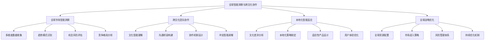

# 全球智能洞察与跨文化协作方法论

> **核心定位**：构建全球化时代的智能洞察和跨文化协作新范式，通过AI增强的全球视野分析和跨文化团队协作，实现全球化战略的有效执行

## 📋 核心问题解决

### 现状挑战
- **文化差异障碍**：不同文化背景导致的沟通障碍和协作困难
- **全球洞察不足**：缺乏系统化的全球市场趋势和机会洞察
- **跨文化管理复杂**：跨文化团队的管理和协调面临诸多挑战
- **本地化适应性差**：产品和服务在不同市场的本地化适应性不足

### 解决方案
通过全球智能洞察与跨文化协作方法论，建立完整的全球化协作体系：
- **国际成功率**：提升60%（相比传统国际化策略）
- **跨文化协作效率**：提升50%（通过文化智能优化）
- **全球洞察准确率**：≥90%（AI驱动的全球市场分析）
- **本地化适应性**：≥85%（产品服务本地化程度）

## 🏗️ 全球智能洞察理论框架

### 核心理念：Global Intelligence & Cross-Cultural Collaboration


### 双核驱动模型

#### 1. 全球智能洞察驱动
**全球洞察分析框架：**
- **多源数据整合**：整合全球市场数据、文化数据、经济数据
- **AI驱动的趋势分析**：智能识别全球趋势和市场机会
- **跨文化模式识别**：识别不同文化背景下的行为模式
- **预测性洞察生成**：基于数据分析预测未来发展方向

#### 2. 跨文化协作驱动
**跨文化协作优化框架：**
- **文化智能培训**：提升团队文化智能和跨文化理解
- **智能沟通机制**：建立高效的跨文化沟通和协作机制
- **冲突预防解决**：智能预防和解决跨文化冲突
- **协作效果优化**：持续优化跨文化团队协作效果

## 🌍 全球市场智能洞察

### 全球数据收集体系
**多维度全球数据：**
```yaml
全球数据维度:
  经济数据:
    - GDP增长率和经济趋势
    - 通胀率和货币政策
    - 汇率波动和贸易数据
    - 投资环境和政策变化

  市场数据:
    - 市场规模和增长潜力
    - 消费者行为和偏好
    - 竞争格局和市场份额
    - 渠道结构和分销模式

  文化数据:
    - 文化价值观和行为模式
    - 语言习惯和沟通方式
    - 消费文化和生活方式
    - 社会结构和制度环境

  技术数据:
    - 技术普及率和基础设施
    - 数字化转型程度
    - 创新生态和研发投入
    - 技术标准和法规环境

  社会数据:
    - 人口结构和 demographics
    - 教育水平和技能分布
    - 社会问题和挑战
    - 可持续发展趋势
```

### 智能趋势分析
**全球趋势识别策略：**
- **AI驱动的模式识别**：识别全球范围内的宏观趋势和模式
- **跨区域比较分析**：比较不同地区的发展趋势和差异
- **时间序列分析**：分析趋势的演变轨迹和未来预测
- **因果关系分析**：分析趋势背后的驱动因素和影响机制

**趋势分类体系：**
- **技术趋势**：新兴技术的发展和应用趋势
- **经济趋势**：全球经济格局和商业环境变化
- **社会趋势**：社会结构、价值观、生活方式的变化
- **文化趋势**：文化消费、娱乐、媒体的发展趋势
- **环境趋势**：可持续发展、环保意识的兴起

### 机会风险评估
**全球机会识别框架：**
- **市场机会评估**：评估不同市场的进入机会和发展潜力
- **产品机会分析**：分析产品在不同市场的适应性机会
- **合作伙伴机会**：识别潜在的全球合作伙伴和联盟机会
- **技术创新机会**：发现技术创新带来的商业机会

**风险管理体系：**
- **政治风险**：政策变化、政治不稳定、地缘政治风险
- **经济风险**：经济波动、汇率风险、通胀风险
- **文化风险**：文化冲突、误解、适应不良风险
- **法律风险**：法规变化、合规要求、知识产权风险
- **运营风险**：供应链、物流、人员管理风险

## 👥 跨文化团队协作

### 文化智能框架
**文化智能能力模型：**
```yaml
文化智能维度:
  认知维度:
    - 文化知识掌握程度
    - 文化差异理解能力
    - 文化模式识别能力
    - 跨文化推理能力

  情感维度:
    - 文化敏感性和同理心
    - 文化偏见自我认知
    - 跨文化适应能力
    - 情绪调节能力

  行为维度:
    - 跨文化沟通技巧
    - 文化适应性行为
    - 跨文化协作能力
    - 冲突解决能力

  元认知维度:
    - 文化自我反思能力
    - 跨文化学习策略
    - 文化意识持续提升
    - 跨文化经验整合
```

### 智能沟通机制
**跨文化沟通优化策略：**
- **语言智能适配**：AI辅助的语言翻译和文化适配
- **沟通风格调整**：根据文化背景调整沟通方式和风格
- **非语言沟通理解**：理解不同文化中的非语言沟通含义
- **沟通桥梁构建**：建立跨文化团队成员间的沟通桥梁

**沟通效果提升：**
- **文化背景培训**：提供目标文化的背景知识和行为指南
- **实时翻译支持**：提供高质量的实时翻译和解释服务
- **沟通反馈机制**：建立沟通效果的反馈和改进机制
- **沟通记录分析**：分析沟通记录中的文化差异和改进点

### 协作机制设计
**跨文化协作模式：**
```yaml
协作模式设计:
  结构化协作:
    - 明确角色职责分工
    - 标准化工作流程
    - 统一的沟通协议
    - 清晰的决策机制

  灵活性适应:
    - 文化差异包容
    - 工作方式弹性
    - 节假日和文化习俗尊重
    - 时区差异协调

  技术支撑:
    - 协作平台优化
    - 多语言支持
    - 文化智能工具
    - 实时沟通系统

  持续改进:
    - 协作效果评估
    - 问题识别解决
    - 最佳实践分享
    - 能力持续提升
```

## 🎯 本地化智能适应

### 本地化策略框架
**多维度本地化策略：**
- **产品本地化**：根据当地市场需求和偏好调整产品功能
- **营销本地化**：适应当地文化和消费习惯的营销策略
- **运营本地化**：建立符合当地法规和文化的运营体系
- **服务本地化**：提供符合当地用户期望的服务体验

**本地化决策流程：**
1. **市场调研分析**：深入了解目标市场的特点和需求
2. **文化差异评估**：评估文化差异对产品和服务的影响
3. **本地化策略制定**：制定针对性的本地化策略和实施计划
4. **执行监控调整**：执行本地化策略并持续监控和调整

### 适应性产品设计
**文化适应性设计原则：**
- **视觉设计适配**：色彩、图像、布局的文化适应性设计
- **交互方式适配**：符合当地用户习惯的交互方式设计
- **内容呈现适配**：语言、文字、内容的文化适配
- **功能优先级调整**：根据当地需求调整功能优先级

**适应性测试验证：**
- **本地用户测试**：邀请当地用户进行产品测试和反馈
- **文化适应性评估**：评估产品在文化层面的适应性
- **市场接受度预测**：预测产品在当地市场的接受程度
- **持续优化改进**：基于测试反馈持续优化产品适应性

### 用户体验本地化
**本地化用户体验要素：**
- **语言本地化**：高质量的翻译和本地化语言表达
- **文化元素融入**：融入当地文化元素和符号
- **使用习惯适配**：适应当地用户的使用习惯和偏好
- **服务时间适配**：考虑时区和工作时间的差异

**本地化体验优化策略：**
- **本地用户研究**：深入研究当地用户的需求和行为模式
- **本地化设计指南**：制定详细的本地化设计规范和指南
- **本地化测试体系**：建立完善的本地化测试和质量保证体系
- **本地化反馈机制**：建立当地用户的反馈收集和处理机制

## 🛠️ 实施方法论

### Phase 1: 全球洞察能力建设 (3-5周)
```yaml
洞察能力构建:
  数据体系建设:
    - 全球数据源建立
    - 数据收集流程标准化
    - 数据质量监控体系
    - 数据分析平台搭建

  分析能力建设:
    - AI分析模型训练
    - 趋势识别算法优化
    - 预测模型准确性提升
    - 洞察报告标准化

  团队能力培养:
    - 全球视野培训
    - 文化知识学习
    - 分析技能提升
    - 洞察应用能力培养
```

### Phase 2: 跨文化协作试点 (4-6周)
```yaml
跨文化试点:
  团队组建:
    - 多文化背景团队成员选择
    - 角色职责明确分工
    - 协作机制初步建立
    - 培训和能力建设

  协作执行:
    - 项目任务分解执行
    - 沟通机制运行验证
    - 冲突识别和解决
    - 协作效果监控评估

  效果评估:
    - 协作效率评估
    - 文化冲突分析
    - 成功因素识别
    - 改进建议制定
```

### Phase 3: 本地化适应实施 (6-8周)
```yaml
本地化实施:
  市场分析:
    - 目标市场深入研究
    - 用户需求详细分析
    - 竞争环境全面评估
    - 文化差异系统识别

  产品本地化:
    - 产品功能调整优化
    - 用户界面本地化设计
    - 内容和语言本地化
    - 测试和质量验证

  市场推广:
    - 本地化营销策略
    - 渠道建设和合作
    - 品牌本地化传播
    - 用户获取和激活
```

### Phase 4: 全球化推广优化 (持续进行)
```yaml
全球化推广:
  规模化扩展:
    - 成功模式复制推广
    - 新市场逐步进入
    - 团队能力持续建设
    - 流程体系不断完善

  持续优化:
    - 数据驱动决策
    - 效果监控分析
    - 问题识别解决
    - 最佳实践总结

  生态建设:
    - 本地合作伙伴发展
    - 全球供应链建设
    - 品牌影响力扩展
    - 可持续发展机制
```

## 📊 成功指标体系

### 全球洞察指标
- **趋势预测准确率**：≥90%（对全球趋势的预测准确性）
- **机会识别成功率**：≥80%（识别机会的商业化成功率）
- **风险预警及时性**：≥85%（风险预警的及时性和有效性）
- **决策支持价值**：≥75%（洞察对决策的支持价值）

### 跨文化协作指标
- **协作效率提升**：≥50%（相比同文化团队协作效率）
- **文化冲突降低率**：≥70%（文化冲突的减少程度）
- **团队满意度**：≥85%（跨文化团队成员的满意度）
- **项目成功率**：≥80%（跨文化项目的成功率）

### 本地化适应指标
- **本地化完成度**：≥90%（产品本地化的完整程度）
- **用户接受度**：≥80%（当地用户对产品的接受程度）
- **市场渗透率**：≥30%（目标市场的渗透程度）
- **品牌认知度**：≥60%（当地市场的品牌认知程度）

## 🎯 成功要素

### 能力要素
- **全球视野能力**：理解全球趋势和市场变化的能力
- **文化智能能力**：理解和适应不同文化的能力
- **跨文化沟通能力**：有效进行跨文化沟通的能力
- **本地化执行能力**：在本地市场有效执行的能力

### 工具要素
- **全球数据分析平台**：支持全球数据收集和分析的平台
- **跨文化协作工具**：支持跨文化团队协作的工具
- **本地化管理系统**：支持本地化管理的系统工具
- **智能决策支持系统**：支持全球决策的智能系统

### 流程要素
- **标准化全球流程**：标准化的全球业务流程
- **灵活的本地化流程**：可适应当地特点的本地化流程
- **持续优化机制**：基于反馈的持续优化机制
- **质量保障体系**：多层次的质量监控和保障体系

### 文化要素
- **多元文化包容**：包容和尊重不同文化的组织文化
- **全球团队精神**：具有全球视野的团队协作精神
- **学习创新文化**：持续学习和创新的文化氛围
- **本地化思维**：深入理解本地市场的思维方式

---

**方法论版本**：V1.0
**最后更新**：2025-10-28
**适用范围**：全球化智能洞察和跨文化协作实践
**预期效果**：实现国际成功率提升60%，跨文化协作效率提升50%，构建全球化智能协作新范式