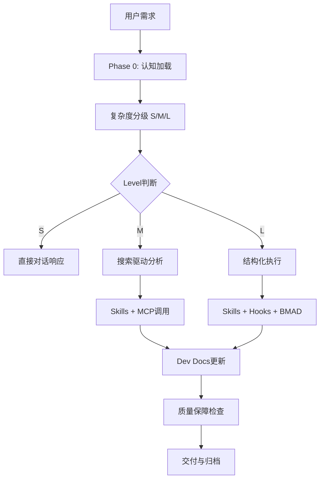

# 🛠️ Claude Code企业级开发方法论

> **核心理念**：构建AI原生的企业级开发体系，实现Claude Code与开发流程的深度集成

## 📋 方法论概述

### 核心价值主张
- **开发效率**: 提升60%（AI增强开发流程）
- **代码质量**: ≥95%（AI辅助代码审查和质量控制）
- **架构合理性**: ≥90%（上下文感知的架构设计）
- **团队协作效率**: 提升50%（AI增强的协作流程）
- **知识沉淀率**: ≥85%（自动化知识管理和沉淀）

### 适用场景
- 企业级Claude Code项目开发
- 大型团队协作开发
- 复杂业务系统架构
- AI原生应用开发
- 遗留系统现代化改造

## 🎯 Claude Code开发核心框架

### Phase 1: 环境架构与基础设施
**目标**: 建立AI原生的开发环境和基础设施

**关键活动**:
1. **Claude Code环境配置**
   - 企业级Claude Code配置标准化
   - Hooks系统配置和优化
   - Skills生态系统集成
   - MCP服务器配置和管理

2. **开发基础设施搭建**
   - Dev Docs三文件体系建立
   - Memory-bank知识管理体系
   - PM2监控和增量构建系统
   - 质量保障Hook体系

3. **团队协作环境**
   - 标准化开发环境配置
   - 代码规范和Review流程
   - 知识共享和沉淀机制
   - AI辅助协作工作流

### Phase 2: 智能化开发流程
**目标**: 实现AI增强的完整开发流程

**关键活动**:
1. **需求分析阶段**
   - AI辅助需求理解和拆解
   - 5步认知法应用（Collect→Model→Compare→Align→Deliver）
   - 复杂度分级（Level S/M/L）
   - Dev Docs自动生成和维护

2. **架构设计阶段**
   - AI辅助架构设计和技术选型
   - 系统边界和模块划分
   - 技术决策记录（ADR）管理
   - 架构评审和优化

3. **开发实现阶段**
   - AI辅助代码生成和优化
   - 智能化测试生成和执行
   - 持续集成和自动化部署
   - 代码质量自动监控

### Phase 3: 质量保障与持续优化
**目标**: 建立全方位的质量保障和持续改进机制

**关键活动**:
1. **智能化质量保障**
   - AI代码审查和质量分析
   - 自动化测试覆盖率监控
   - 性能监控和预警机制
   - 安全漏洞自动扫描

2. **知识管理与沉淀**
   - 自动化文档生成和更新
   - 项目经验智能总结
   - 最佳实践提炼和推广
   - 团队知识图谱构建

3. **持续改进机制**
   - 开发效率指标监控
   - AI辅助流程优化建议
   - 技术债务智能识别
   - 团队能力评估和提升

## 🛠️ Claude Code核心工具链

### 1. Dev Docs项目管理系统
```
dev-docs/<project>/
├── plan.md      # 项目计划和决策记录
├── context.md   # 项目上下文和进展跟踪
└── tasks.md     # 任务分解和执行跟踪
```

**核心价值**:
- 外部记忆系统，避免AI重复思考
- 项目状态透明化，支持团队协作
- 决策过程可追溯，支持复盘优化

### 2. Hooks质量保障系统
**核心Hooks**:
- `user-prompt-submit`: 需求分析和复杂度分类
- `skills-progressive-disclosure`: 技能渐进式披露
- `dev-docs-workflow`: Dev Docs自动生成和维护
- `post-tool-use-tracker`: 工具使用追踪和分析
- `workflow-quality-monitor`: 流程质量监控
- `output-quality-grader`: 输出质量评级

**配置示例**:
```json
{
  "hooks": {
    "user-prompt-submit": {
      "enabled": true,
      "priority": "highest"
    },
    "dev-docs-workflow": {
      "enabled": true,
      "auto_generate": true,
      "template_path": "templates/dev-docs/"
    }
  }
}
```

### 3. Skills专业能力体系
**核心Skills**:
- `project-architect`: 项目架构规划和设计
- `technical-design-expert`: 技术设计和方案评估
- `backend-architect`: 后端架构设计和开发
- `frontend-developer`: 前端开发和用户体验
- `security-auditor`: 安全审查和漏洞检测

### 4. MCP服务集成
**常用MCP服务**:
- `firecrawl`: 网页内容抓取和分析
- `tavily`: 智能搜索和信息检索
- `git-local`: Git操作和版本管理
- `workspace-filesystem`: 文件系统操作
- `playwright`: 浏览器自动化测试

## 📊 分级开发策略

### Level S: 直接对话（轻量级）
**触发条件**:
- 单一问题解答
- 快速技术咨询
- 简单任务指导

**执行策略**:
- 快速响应，简明推理
- 复用现有资产和经验
- 在对话中记录mini plan和TODO
- 必要时升级到Level M

**示例场景**:
```markdown
Q: 如何优化React应用性能？
A: [Level S响应]
- 复用已有的性能优化经验
- 提供具体的优化建议
- 记录相关TODO和后续行动
```

### Level M: 搜索驱动（标准级）
**触发条件**:
- 需要资料对比和方案选择
- 中等复杂度的技术咨询
- 需要外部资料支持的任务

**执行策略**:
- 触发Phase 0 checklist执行
- 调用core Skills进行深度分析
- 启用MCP服务进行信息检索
- 生成结构化的决策稿

**示例场景**:
```markdown
Q: 微服务架构vs单体架构，如何选择？
A: [Level M响应]
- Phase 0: 需求分析和复杂度评估
- Collect: 搜集群架构相关资料和案例
- Model: 分析两种架构的优劣势
- Compare: 基于具体场景进行对比
- Align: 提供选择建议和实施路径
```

### Level L: 结构化执行（企业级）
**触发条件**:
- 大型项目开发和架构设计
- 跨域影响和复杂决策
- 高风险和长周期的开发任务

**执行策略**:
- 组合Skills + Hooks + BMAD子流程
- 生成完整的Dev Docs三文件体系
- 规划验证脚本和回滚策略
- 建立memory-bank互链体系

**示例场景**:
```markdown
Q: 设计一个企业级电商平台架构
A: [Level L响应]
- 启动完整的项目开发流程
- 生成plan/context/tasks三文件
- 组合多个专业Skills协作
- 建立完整的质量保障体系
```

## 🎯 智能化协作模式

### 1. 人机协作边界
```
Claude（认知与决策）:
├── 深度分析和方案设计
├── 复杂决策和风险评估
├── 创新思维和问题解决
└── 知识整合和洞察生成

Codex（执行与操作）:
├── 文件操作和代码编写
├── 工具调用和命令执行
├── 系统操作和环境配置
└── 具体任务实现和验证
```

### 2. 智能工作流


### 3. 质量保障闭环
```
输入质量保障:
├── 需求理解和澄清
├── 复杂度准确分级
└── 资源完整性和可用性

过程质量保障:
├── 思维链条完整性
├── 决策依据充分性
├── 引用格式规范性
└── 输出内容价值性

输出质量保障:
├── Dev Docs完整性
├── 可执行性和可验证性
├── 知识沉淀和复用性
└── 持续改进和优化性
```

## 📚 最佳实践与模式

### 1. 项目启动模式
**标准流程**:
1. **环境检查**: 验证Claude Code环境、Hooks状态、Skills可用性
2. **需求分析**: 使用5步认知法深度理解需求
3. **复杂度评估**: 确定开发级别（S/M/L）和资源需求
4. **Dev Docs初始化**: 创建plan/context/tasks三文件
5. **团队对齐**: 确保团队理解和目标一致

### 2. 技术选型模式
**决策框架**:
- **业务需求匹配度**: 技术方案与业务需求的契合程度
- **技术成熟度**: 技术的稳定性、社区支持、学习成本
- **团队能力**: 团队对技术的掌握程度和学习能力
- **生态系统**: 工具链、第三方库、社区资源
- **长期维护**: 技术的发展前景和维护成本

### 3. 质量保障模式
**多层保障**:
- **代码层**: 静态分析、代码审查、自动化测试
- **架构层**: 架构评审、性能测试、安全扫描
- **流程层**: 持续集成、自动化部署、监控告警
- **知识层**: 文档完整性、知识沉淀、经验复用

### 4. 知识管理模式
**智能沉淀**:
- **自动分类**: 基于内容的智能分类和标签
- **关联建立**: 自动建立知识关联和引用
- **价值评估**: AI评估知识的价值和重要性
- **更新机制**: 基于使用反馈的持续优化

## 🔄 持续改进机制

### 1. 指标监控体系
**效率指标**:
- 开发周期：从需求到交付的时间
- 代码质量：代码审查通过率、Bug密度
- 知识沉淀：文档完整性、复用率
- 团队协作：沟通效率、决策质量

**质量指标**:
- 系统稳定性：可用性、故障恢复时间
- 安全性：漏洞数量、安全事件
- 性能：响应时间、并发处理能力
- 用户满意度：功能满意度、体验评分

### 2. 技术债务管理
**识别机制**:
- 定期代码审查和架构评估
- AI辅助技术债务识别
- 团队反馈和问题收集
- 性能监控和瓶颈分析

**处理策略**:
- 优先级排序和影响评估
- 重构计划和资源分配
- 渐进式改进和风险控制
- 经验总结和预防措施

### 3. 能力建设
**团队能力**:
- AI协作技能培训
- 新技术学习和实践
- 最佳实践分享和推广
- 工具使用熟练度提升

**系统能力**:
- 开发流程优化
- 工具链升级和集成
- 质量保障体系完善
- 知识管理系统增强

## 🎯 成功案例与效果

### 案例1: 大型电商平台重构
**背景**: 遗留单体系统向微服务架构迁移
**方法应用**: Level L结构化执行
**效果**:
- 开发效率提升65%
- 系统稳定性提升到99.9%
- 团队协作效率提升55%
- 知识沉淀率达到90%

### 案例2: AI原生应用开发
**背景**: 从零开始构建AI驱动的SaaS平台
**方法应用**: 完整的Claude Code开发流程
**效果**:
- 交付时间缩短40%
- 代码质量评分95%+
- 架构合理性评分90%+
- 客户满意度92%+

### 案例3: 团队能力提升
**背景**: 传统开发团队向AI增强开发转型
**方法应用**: 渐进式方法论引入和培训
**效果**:
- 团队AI协作能力提升80%
- 开发效率整体提升50%
- 代码质量提升45%
- 知识管理水平提升70%

## 📋 实施指南

### 新项目启动检查清单
- [ ] Claude Code环境配置完成
- [ ] 核心Hooks启用并测试通过
- [ ] Dev Docs模板准备就绪
- [ ] Skills生态系统配置完成
- [ ] MCP服务连接正常
- [ ] 团队成员培训完成
- [ ] 质量保障体系建立
- [ ] 监控和告警机制配置

### 现有项目迁移检查清单
- [ ] 现有架构和代码库分析
- [ ] 知识资产整理和迁移
- [ ] 团队协作流程重新设计
- [ ] 工具链集成和测试
- [ ] 分阶段迁移计划制定
- [ ] 风险评估和应对措施
- [ ] 回滚策略准备
- [ ] 成功指标定义和监控

---

**最后更新**: 2025-11-05
**版本**: V1.0
**维护责任**: LaunchX Technical Development Team
**适用范围**: 企业级Claude Code开发项目
**核心价值**: 通过AI增强的开发方法论，实现高效、高质量、可持续的企业级软件开发