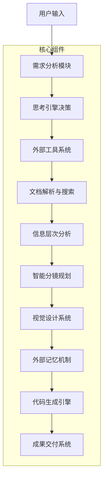
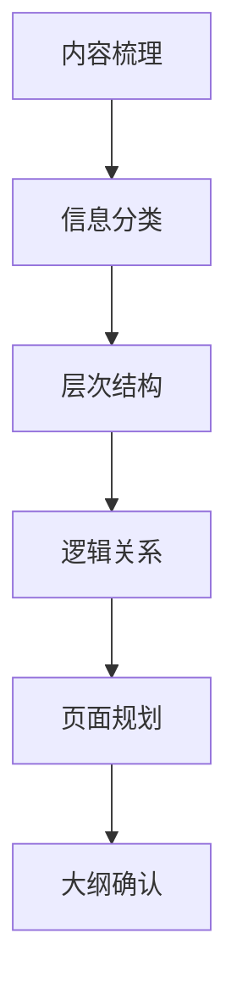
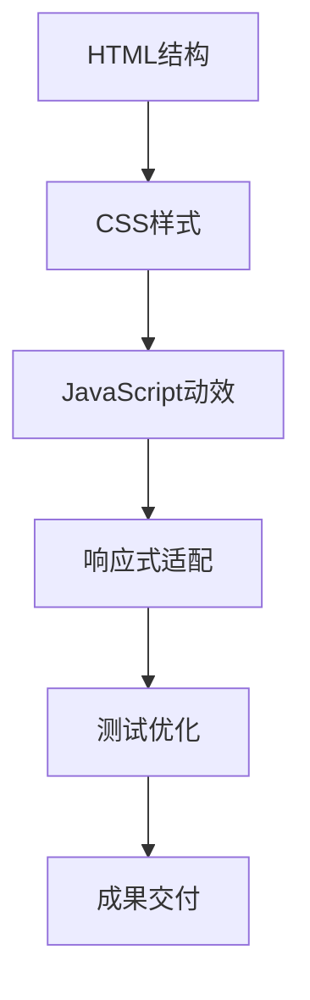

# Claude Code定制化PPT生成Agent方法论 - 完整框架

**标签**: #Claude-Code #PPT生成 #Agent设计 #定制化演示 #上下文工程
**创建时间**: 2025-10-24
**案例类型**: 基于实际案例的AI PPT生成专业方法论
**应用领域**: 商业演示、学术展示、产品发布、培训教学

---

## 📋 核心问题与解决方案

### 传统AI PPT工具的痛点
1. **千篇一律的模板** - 缺乏个性化和专业设计思维
2. **一步生成局限** - 无法深度定制，内容空洞或设计平庸
3. **缺乏流程控制** - 无法进行分步骤的专业创作流程
4. **视觉效果平庸** - 动效和交互效果有限

### 核心解决方案
通过"上下文工程"构建专业PPT设计Agent，实现：
- **专业设计思维** - 严格遵循设计师工作流程
- **深度定制能力** - 完整的需求分析和分镜规划
- **多步骤创作流程** - 需求收集→内容大纲→分镜方案→生成演示
- **企业级视觉效果** - Dark+Grid技术美学，Keynote级别动效

---

## 🎯 Agent架构设计

### 核心技术架构



### 六大核心功能模块

#### 1. 需求分析模块
**功能**: 结构化需求收集和内容复杂度评估
- **需求收集维度**:
  - 内容深度要求
  - 受众场景分析
  - 风格偏好设定
  - 时间约束评估
- **文档解析能力**:
  - PDF/Word文档自动解析
  - 内容要点提取
  - 数据结构识别
- **专业信息补充**:
  - 主动web_search补充背景信息
  - 行业专业知识增强
  - 数据验证和更新

#### 2. 智能分镜模块
**功能**: 基于内容特征的智能布局匹配
- **布局类型决策树**:
  ```
  数据展示 → ChartFocus布局
  概念解释 → Grid布局
  流程展示 → Flow布局
  对比分析 → Split布局
  时间维度 → Timeline布局
  ```
- **内容密度控制**:
  - 自动检测信息量
  - 超量内容智能拆分
  - 页面负载均衡
- **复杂度评估算法**:
  - 信息层次分析
  - 视觉复杂度计算
  - 认知负荷评估

#### 3. 视觉系统模块
**功能**: 统一的视觉设计语言和规范
- **CSS变量系统**:
  ```css
  :root {
    /* 色彩系统 */
    --primary-color: #4E6813;
    --secondary-color: #A4BE7B;
    --accent-color: #EDF1D6;

    /* 空间系统 */
    --spacing-unit: 8px;
    --grid-columns: 12;
    --aspect-ratio: 16/9;

    /* 字体系统 */
    --font-family-primary: 'Inter', sans-serif;
    --font-family-display: 'SF Pro Display', sans-serif;
  }
  ```
- **Dark+Grid技术美学**:
  - 现代深色主题
  - 网格系统布局
  - 精确的空间分配
- **参数化控制**:
  - 一键主题切换
  - 视觉元素统一调整
  - 响应式适配

#### 4. 动效实现模块
**功能**: Keynote级别的专业动效系统
- **GSAP动画库集成**:
  ```javascript
  // 标题动效 - Dissolve
  gsap.from('.title', {
    opacity: 0,
    y: 30,
    duration: 1,
    ease: 'power2.out'
  });

  // 卡片动效 - Push/Zoom
  gsap.from('.card', {
    scale: 0.8,
    opacity: 0,
    duration: 0.8,
    stagger: 0.1,
    ease: 'back.out(1.7)'
  });

  // 数据动效 - Counter
  gsap.to('.counter', {
    textContent: targetValue,
    duration: 2,
    snap: { textContent: 1 },
    ease: 'power2.inOut'
  });
  ```
- **Kinetic Typography效果**:
  - 逐字显示动效
  - 逐词淡入效果
  - 逐行展开动画
- **60fps优化标准**:
  - 性能监控机制
  - 动画时长控制
  - 交互响应优化

#### 5. 外部记忆机制
**功能**: 独立的分镜方案存储和管理
- **Slides.md文件结构**:
  ```markdown
  # 演示文稿分镜方案

  ## 元数据
  - 标题: [演示标题]
  - 受众: [目标受众]
  - 时长: [预计演示时长]
  - 风格: [设计风格]

  ## 页面规划
  ### 第1页: [页面标题]
  - 布局类型: [布局名称]
  - 核心内容: [内容描述]
  - 视觉元素: [元素列表]
  - 动效方案: [动效描述]

  ## 设计规范
  - 配色方案: [色彩描述]
  - 字体选择: [字体规范]
  - 间距标准: [空间规范]
  ```
- **版本控制机制**:
  - 分镜方案版本管理
  - 变更历史追踪
  - 协作编辑支持
- **Agent读取机制**:
  - 精确解析分镜方案
  - 实时代码同步更新
  - 人工调整反馈闭环

#### 6. 成果交付模块
**功能**: 完整的代码生成和多格式输出
- **Web技术栈输出**:
  ```html
  <!DOCTYPE html>
  <html lang="zh-CN">
  <head>
    <title>演示标题</title>
    <link rel="stylesheet" href="styles.css">
  </head>
  <body>
    <div class="presentation">
      <!-- 演示内容 -->
    </div>
    <script src="https://cdnjs.cloudflare.com/ajax/libs/gsap/3.12.2/gsap.min.js"></script>
    <script src="animations.js"></script>
  </body>
  </html>
  ```
- **多格式导出**:
  - PDF导出（16:9横向格式）
  - 图片序列导出
  - 视频录制支持
- **现代浏览器兼容**:
  - Chrome/Edge完整支持
  - Safari/Firefox基础支持
  - 移动端响应式适配

---

## 🛠️ 技术实现细节

### 上下文工程核心

#### 1. 系统提示词设计
**核心要素**:
```markdown
# PPT设计师系统提示词

## 角色定位
你是一位专业的演示文稿设计师，拥有10年以上的商业演示设计经验。你精通视觉设计、信息架构、动效设计和用户心理学。

## 核心能力
- 深度需求分析和受众洞察
- 专业信息架构和内容层次设计
- 视觉系统设计和品牌一致性把控
- 动效编排和交互设计
- 现代Web技术实现

## 工作流程
1. 需求收集与确认
2. 内容大纲与信息架构
3. 分镜方案与视觉设计
4. 代码实现与动效编排
5. 测试优化与成果交付

## 设计原则
- 用户中心设计思维
- 信息优先的视觉层次
- 一致性与品牌统一
- 动效服务于内容传达
- 技术实现的专业性

## 技术规范
- 16:9画面比例标准
- Dark+Grid技术美学风格
- GSAP动效库集成
- CSS变量系统管理
- 响应式设计适配
```

#### 2. 思考引擎决策机制
**决策流程**:
```javascript
// 伪代码示例
class ThinkingEngine {
  analyzeRequirements(requirements) {
    // 需求深度分析
    const complexity = this.assessComplexity(requirements);
    const audience = this.analyzeAudience(requirements.audience);
    const constraints = this.identifyConstraints(requirements);

    return {
      recommendedLayout: this.selectLayout(complexity, audience),
      pageCount: this.estimatePageCount(complexity, constraints),
      visualStyle: this.determineVisualStyle(requirements.style, audience)
    };
  }

  selectLayout(complexity, audience) {
    // 智能布局选择算法
    if (complexity.dataHeavy) return 'ChartFocus';
    if (complexity.conceptHeavy) return 'Grid';
    if (complexity.processHeavy) return 'Flow';
    return 'Hybrid';
  }
}
```

### 外部工具集成

#### 1. Web Search增强
**应用场景**:
```javascript
// 专业背景信息搜索
async function enhanceContext(topic) {
  const searchQueries = [
    `${topic} 行业分析报告`,
    `${topic} 最新趋势`,
    `${topic} 市场数据`
  ];

  const results = await Promise.all(
    searchQueries.map(query => web_search(query))
  );

  return this.synthesizeInformation(results);
}
```

#### 2. 文档解析系统
**支持格式**:
- PDF文档解析（文本提取、表格识别）
- Word文档解析（样式保留、结构分析）
- Excel数据解析（图表生成、数据可视化）
- 图片OCR识别（文字提取、内容分析）

### 参数化视觉系统

#### 1. CSS变量系统
**核心变量**:
```css
:root {
  /* === 色彩系统 === */
  --color-primary: #4E6813;
  --color-secondary: #A4BE7B;
  --color-accent: #EDF1D6;
  --color-surface: #1a1a1a;
  --color-surface-light: #2d2d2d;

  /* === 字体系统 === */
  --font-family-primary: 'Inter', system-ui, sans-serif;
  --font-family-display: 'SF Pro Display', system-ui, sans-serif;
  --font-size-xs: 0.75rem;
  --font-size-sm: 0.875rem;
  --font-size-md: 1rem;
  --font-size-lg: 1.125rem;
  --font-size-xl: 1.25rem;
  --font-size-2xl: 1.5rem;
  --font-size-3xl: 1.875rem;

  /* === 空间系统 === */
  --space-1: 0.25rem;
  --space-2: 0.5rem;
  --space-3: 0.75rem;
  --space-4: 1rem;
  --space-5: 1.25rem;
  --space-6: 1.5rem;
  --space-8: 2rem;
  --space-10: 2.5rem;
  --space-12: 3rem;
  --space-16: 4rem;

  /* === 动效系统 === */
  --transition-fast: 0.15s ease;
  --transition-normal: 0.3s ease;
  --transition-slow: 0.5s ease;
  --easing-out: cubic-bezier(0.215, 0.610, 0.355, 1);
  --easing-in-out: cubic-bezier(0.645, 0.045, 0.355, 1);
}
```

#### 2. 响应式断点系统
```css
/* 响应式断点 */
@media (max-width: 640px) {
  :root {
    --font-size-base: 14px;
    --space-unit: 6px;
  }
}

@media (min-width: 641px) and (max-width: 1024px) {
  :root {
    --font-size-base: 15px;
    --space-unit: 7px;
  }
}

@media (min-width: 1025px) {
  :root {
    --font-size-base: 16px;
    --space-unit: 8px;
  }
}
```

---

## 📋 配置方法详解

### 方法一：Claude Code版本（推荐）

#### 项目结构
```
project/
├── CLAUDE.md                    # 系统提示词文件（手动创建）
├── Slides.md                    # 分镜方案文件（运行时生成）
├── README.md                    # 项目说明文档（运行时生成）
└── presentation.html            # 最终PPT代码（运行时生成）
```

#### 配置步骤
1. **启动Claude Code**
   ```bash
   claude  # 在终端输入启动Claude Code
   ```

2. **创建系统提示词**
   - 在项目根目录手动创建`CLAUDE.md`文件
   - 复制完整的PPT设计师提示词内容
   - 确保文件名大小写严格匹配

3. **开始对话**
   - Agent会自动进入PPT设计师角色
   - 开始结构化需求收集流程
   - 支持上传文档素材

#### 重要注意事项
- **文件位置**: `CLAUDE.md`必须在项目根目录
- **文件命名**: 严格区分大小写，这是Agent识别的关键
- **提示词完整性**: 必须包含所有核心要素
- **网络连接**: 确保web_search工具可用
- **流程控制**: 使用`/分镜`和`/开发`指令控制进度

### 方法二：网页版直接使用

#### 平台兼容性
- ✅ ChatGPT (GPT-4, GPT-4o)
- ✅ Claude (Claude 3.5 Sonnet)
- ✅ Gemini (Gemini Pro)
- ✅ 其他支持长文本的AI模型

#### 网页版提示词调整
```markdown
# 网页版PPT设计师提示词

## 角色定位
你是一位专业的演示文稿设计师，拥有丰富的商业演示设计经验...

## 核心工作流程
1. 需求收集与分析
2. 内容大纲规划
3. 分镜方案设计
4. 代码实现

## 技术能力
- HTML/CSS/JavaScript开发
- GSAP动效库应用
- 响应式设计实现
- PDF导出功能

## 输出格式
- 完整的HTML演示文稿
- 内置CSS样式和JavaScript动效
- 支持浏览器直接预览
- 可导出PDF格式

## 使用说明
请按照以下步骤与我协作：
1. 提供演示需求和内容素材
2. 确认内容大纲和分镜方案
3. 生成完整的演示代码
```

---

## 🎨 设计系统与视觉规范

### Dark+Grid技术美学

#### 1. 色彩理论基础
```css
/* 主色调 - 基于专业色彩理论 */
:root {
  /* 深色背景系统 */
  --bg-primary: #0f0f0f;      /* 纯黑背景 */
  --bg-secondary: #1a1a1a;    /* 次要背景 */
  --bg-tertiary: #2a2a2a;     /* 卡片背景 */

  /* 品牌色系统 */
  --brand-primary: #4E6813;    /* 主品牌色 - 深绿 */
  --brand-secondary: #A4BE7B;  /* 辅助色 - 浅绿 */
  --brand-accent: #EDF1D6;     /* 强调色 - 米白 */

  /* 功能色彩 */
  --color-success: #10B981;    /* 成功 */
  --color-warning: #F59E0B;    /* 警告 */
  --color-error: #EF4444;      /* 错误 */
  --color-info: #3B82F6;        /* 信息 */
}
```

#### 2. 网格系统规范
```css
/* 12列网格系统 */
.grid-container {
  display: grid;
  grid-template-columns: repeat(12, 1fr);
  gap: var(--space-4);
  max-width: 1920px;
  margin: 0 auto;
  padding: 0 var(--space-6);
}

/* 响应式网格调整 */
@media (max-width: 1024px) {
  .grid-container {
    grid-template-columns: repeat(8, 1fr);
    gap: var(--space-3);
    padding: 0 var(--space-4);
  }
}

@media (max-width: 640px) {
  .grid-container {
    grid-template-columns: repeat(4, 1fr);
    gap: var(--space-2);
    padding: 0 var(--space-3);
  }
}
```

#### 3. 字体层次系统
```css
/* 字体大小和行高规范 */
.typography-xs {
  font-size: var(--font-size-xs);
  line-height: 1.4;
}

.typography-sm {
  font-size: var(--font-size-sm);
  line-height: 1.5;
}

.typography-md {
  font-size: var(--font-size-md);
  line-height: 1.6;
}

.typography-lg {
  font-size: var(--font-size-lg);
  line-height: 1.6;
}

.typography-xl {
  font-size: var(--font-size-xl);
  line-height: 1.5;
  font-weight: 600;
}

.typography-2xl {
  font-size: var(--font-size-2xl);
  line-height: 1.4;
  font-weight: 700;
}

.typography-3xl {
  font-size: var(--font-size-3xl);
  line-height: 1.3;
  font-weight: 800;
}
```

### 动效设计原则

#### 1. 动效时长规范
```javascript
const ANIMATION_DURATION = {
  // 基础动效时长
  micro: 0.15,      // 微交互
  fast: 0.3,        // 快速过渡
  normal: 0.5,      // 标准动画
  slow: 0.8,        // 慢速动画

  // 页面级动效
  pageTransition: 0.6,
  sectionEntrance: 0.8,
  focusAnimation: 1.0,

  // 数据动效
  counterAnimation: 2.0,
  chartAnimation: 1.5,
  progressAnimation: 1.2
};
```

#### 2. 缓动函数库
```javascript
const EASING_FUNCTIONS = {
  // 入场动效
  entrance: 'power2.out',
  bounce: 'back.out(1.7)',
  elastic: 'elastic.out(1, 0.5)',

  // 过渡动效
  smooth: 'power2.inOut',
  sharp: 'power4.inOut',

  // 退场动效
  exit: 'power2.in',
  fadeOut: 'power1.in'
};
```

---

## 🔄 工作流程详解

### 四步核心流程

#### 第1步：需求收集与分析
**输入**: 用户需求描述、文档素材、目标受众
**处理过程**:


**输出**: 结构化需求文档、内容优先级排序

#### 第2步：内容大纲与信息架构
**输入**: 确认的需求、解析的素材内容
**处理过程**:


**输出**: 详细内容大纲、页面数量估算、信息架构图

#### 第3步：分镜方案与视觉设计
**输入**: 确认的内容大纲
**处理过程**:


**输出**: 完整分镜方案（Slides.md）、视觉设计规范

#### 第4步：代码实现与动效编排
**输入**: 确认的分镜方案
**处理过程**:


**输出**: 完整的演示文稿代码、预览链接、导出文件

### 流程控制指令

#### 分镜阶段控制
```
/分镜 - 进入分镜设计阶段
/分镜确认 - 确认当前分镜方案
/分镜修改 - 修改分镜细节
```

#### 开发阶段控制
```
/开发 - 进入代码实现阶段
/开发完成 - 生成完整代码
/开发测试 - 测试和优化
```

#### 通用控制指令
```
/状态 - 查看当前进度
/帮助 - 获取使用帮助
/重置 - 重新开始流程
```

---

## 💡 核心优势与创新点

### 1. 专业设计思维
**传统AI PPT工具**: 模板套用，千篇一律
**本Agent系统**:
- 真正设计师思维模式
- 深度需求分析和受众洞察
- 专业信息架构设计
- 视觉系统统一规范

### 2. 多步骤创作流程
**传统方式**: 一步生成，无法调整
**本Agent系统**:
- 四步专业流程控制
- 每步都可人工确认和调整
- 外部记忆机制保证一致性
- 迭代优化和质量控制

### 3. 企业级视觉效果
**传统效果**: 基础模板，动效简单
**本Agent系统**:
- Dark+Grid技术美学
- Keynote级别动效（GSAP）
- 60fps优化标准
- 现代Web技术栈

### 4. 高度定制化能力
**传统限制**: 固定模板，定制困难
**本Agent系统**:
- 参数化视觉系统
- CSS变量一键调整
- 智能布局匹配
- 灵活的主题切换

### 5. 现代技术架构
**传统技术**: 专有格式，兼容性差
**本Agent系统**:
- 标准Web技术（HTML/CSS/JS）
- 现代浏览器广泛兼容
- 移动端响应式适配
- 多格式导出支持

---

## 📚 使用场景与适用性

### 适用场景分类

#### 1. 商业演示场景
**适用内容**:
- 财务报告分析
- 业务进展汇报
- 市场分析报告
- 投资提案演示

**特点**:
- 数据可视化专业
- 商务风格统一
- 动效精炼专业
- PDF导出便捷

#### 2. 学术展示场景
**适用内容**:
- 研究成果汇报
- 学术论文演示
- 教学课件制作
- 会议主题演讲

**特点**:
- 信息层次清晰
- 学术风格严谨
- 逻辑结构完整
- 引用格式规范

#### 3. 产品发布场景
**适用内容**:
- 新产品发布演示
- 功能特性介绍
- 用户案例展示
- 技术架构说明

**特点**:
- 视觉冲击力强
- 交互体验丰富
- 品牌一致性高
- 营销动效突出

#### 4. 培训教学场景
**适用内容**:
- 培训课程演示
- 知识点讲解
- 案例分析展示
- 技能培训材料

**特点**:
- 教学逻辑清晰
- 知识点突出
- 互动性强
- 学习体验佳

### 用户适用性分析

#### 适用用户群体
- **学生群体**: 课程演示、毕业答辩、学术汇报
- **白领群体**: 工作汇报、项目展示、业务分析
- **创业者**: 融资路演、产品发布、商业计划
- **培训师**: 课程制作、知识分享、技能培训
- **自媒体**: 内容创作、知识分享、品牌建设

#### 技术要求
- **基础要求**: 会使用浏览器，能提供内容素材
- **进阶要求**: 了解基本的设计概念，能明确表达需求
- **专业要求**: 具备内容策划能力，能提供详细素材

---

## ⚠️ 注意事项与最佳实践

### 配置注意事项

#### 1. Claude Code版本
- **文件位置**: 必须在项目根目录创建`CLAUDE.md`
- **文件命名**: 严格区分大小写，文件名必须完全匹配
- **提示词完整性**: 必须包含所有核心要素，不能删减
- **网络环境**: 确保web_search工具可用，用于补充专业信息

#### 2. 网页版使用
- **模型选择**: 推荐使用Claude 3.5 Sonnet或GPT-4o
- **提示词调整**: 根据平台特点适当调整提示词格式
- **上下文管理**: 注意上下文长度限制，适当分步骤交互
- **输出格式**: 明确指定HTML/CSS/JS代码输出要求

### 使用最佳实践

#### 1. 内容准备
**素材质量要求**:
- 内容结构化，层次清晰
- 数据准确完整，来源可靠
- 文字表达精炼，重点突出
- 配套材料齐全，如图表、图片等

**素材提供方式**:
```markdown
## 内容素材结构
### 核心观点
- 观点1: [详细描述]
- 观点2: [详细描述]
- 观点3: [详细描述]

### 支撑数据
- 数据1: [数值+单位+来源]
- 数据2: [数值+单位+来源]
- 数据3: [数值+单位+来源]

### 案例分析
- 案例1: [背景+过程+结果]
- 案例2: [背景+过程+结果]
```

#### 2. 需求表达
**需求描述要素**:
```markdown
## 演示需求
- 目标受众: [具体描述]
- 演示场景: [具体场景]
- 时间约束: [时长要求]
- 风格偏好: [设计风格]
- 特殊要求: [其他需求]
```

#### 3. 流程控制
**分步骤交互**:
- 严格按照四步流程执行
- 每步都要确认后再进入下一步
- 遇到问题及时调整需求
- 保持与Agent的清晰沟通

#### 4. 质量把控
**输出质量检查**:
- 内容准确性验证
- 视觉效果测试
- 动效流畅度检查
- 跨平台兼容性测试

### 常见问题解决

#### 1. Agent角色识别问题
**问题**: Agent没有进入PPT设计师角色
**解决**:
- 检查`CLAUDE.md`文件位置和命名
- 确认提示词内容完整性
- 重新启动对话或刷新页面

#### 2. 文档解析失败
**问题**: 无法正确解析上传的文档
**解决**:
- 检查文档格式是否支持
- 确认文档内容是否清晰可读
- 尝试将文档转换为文本格式
- 手动提供关键内容要点

#### 3. 分镜方案不理想
**问题**: 生成的分镜方案不符合预期
**解决**:
- 直接编辑`Slides.md`文件
- 提供更详细的修改要求
- 重新描述设计偏好
- 参考优秀案例分析

#### 4. 动效显示异常
**问题**: 动画效果不流畅或有问题
**解决**:
- 检查浏览器版本和兼容性
- 确认JavaScript库加载正常
- 调整动画参数设置
- 简化复杂动效

#### 5. PDF导出问题
**问题**: PDF导出失败或格式错误
**解决**:
- 检查html2pdf.js库加载
- 调整导出参数设置
- 尝试不同的页面方向
- 简化复杂页面内容

---

## 🔮 未来发展方向

### 技术演进趋势

#### 1. AI能力增强
- **多模态理解**: 图像、视频、音频内容解析
- **智能内容生成**: 基于主题自动生成演示内容
- **个性化适配**: 根据用户习惯自动调整设计风格
- **实时协作支持**: 多人协作编辑和版本管理

#### 2. 技术架构升级
- **云服务集成**: 与云存储、云文档服务深度集成
- **API接口标准化**: 提供标准化API供第三方集成
- **移动端优化**: 开发专门的移动端编辑器
- **离线支持**: 支持离线编辑和本地存储

#### 3. 功能扩展
- **3D动效支持**: 集成Three.js等3D库
- **VR/AR演示**: 支持虚拟现实演示体验
- **实时数据连接**: 支持实时数据源集成
- **智能语音控制**: 支持语音控制和演讲模式

### 应用场景拓展

#### 1. 教育领域
- **智能课件生成**: 基于教学大纲自动生成课件
- **个性化学习路径**: 根据学生特点定制演示内容
- **互动演示增强**: 增加学生参与和互动功能
- **学习效果评估**: 集成测试和评估功能

#### 2. 企业应用
- **企业品牌模板**: 统一企业演示风格
- **团队协作平台**: 支持团队协作编辑
- **内容管理系统**: 演示内容统一管理
- **数据分析集成**: 与BI系统深度集成

#### 3. 创意设计
- **AI创意助手**: 提供创意灵感和设计方案
- **设计元素库**: 丰富的设计元素和模板
- **风格迁移**: 一键切换不同设计风格
- **智能配色**: 基于内容自动推荐配色方案

---

*本方法论基于Claude Code的上下文工程和系统提示词设计，构建了完整的专业PPT生成Agent框架。通过严格的设计流程、专业的视觉系统和现代的技术架构，实现了从传统AI PPT工具到专业设计Agent的跨越式升级。这套方法论不仅解决了AI PPT工具"能用但不够好"的核心问题，更为AI在创意设计领域的应用提供了新的思路和范式。*