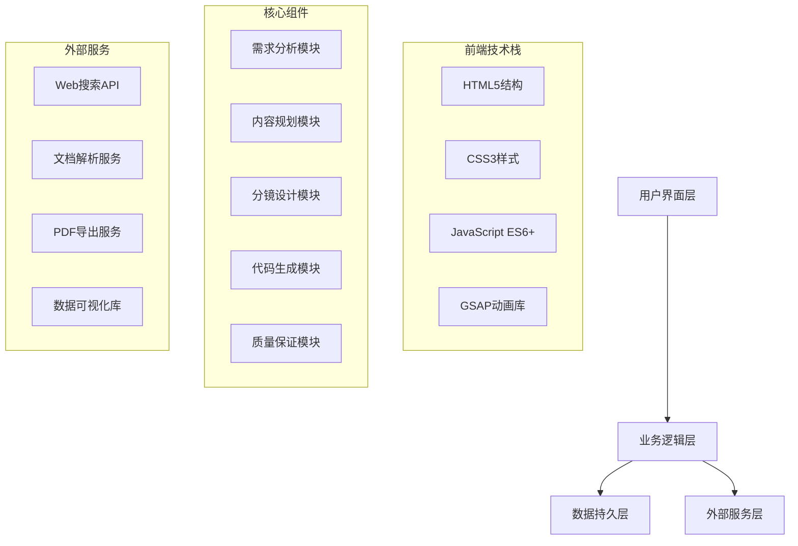

# PPT生成Agent技术实现细节

**标签**: #技术实现 #前端开发 #动画效果 #响应式设计 #性能优化
**创建时间**: 2025-10-24
**适用场景**: PPT生成Agent开发、Web演示文稿制作、动效设计实现
**技术栈**: HTML5 + CSS3 + JavaScript + GSAP

---

## 🏗️ 技术架构总览

### 系统架构图


---

## 🎨 CSS变量系统实现

### 完整的色彩系统
```css
:root {
  /* === 品牌色彩系统 === */
  --color-primary: #4E6813;          /* 主品牌色 - 深绿色 */
  --color-primary-light: #6B7A28;     /* 主品牌色浅变 */
  --color-primary-dark: #384F0E;      /* 主品牌色深变 */

  --color-secondary: #A4BE7B;        /* 辅助色 - 浅绿色 */
  --color-secondary-light: #B8C990;  /* 辅助色浅变 */
  --color-secondary-dark: #8BA362;    /* 辅助色深变 */

  --color-accent: #EDF1D6;          /* 强调色 - 米白色 */
  --color-accent-light: #F2F5E9;     /* 强调色浅变 */
  --color-accent-dark: #D8DDD0;       /* 强调色深变 */

  /* === 功能色彩系统 === */
  --color-success: #10B981;          /* 成功状态 */
  --color-success-light: #34D399;    /* 成功状态浅变 */
  --color-success-dark: #059669;      /* 成功状态深变 */

  --color-warning: #F59E0B;          /* 警告状态 */
  --color-warning-light: #FCD34D;    /* 警告状态浅变 */
  --color-warning-dark: #D97706;      /* 警告状态深变 */

  --color-error: #EF4444;            /* 错误状态 */
  --color-error-light: #F87171;      /* 错误状态浅变 */
  --color-error-dark: #DC2626;        /* 错误状态深变 */

  --color-info: #3B82F6;              /* 信息状态 */
  --color-info-light: #60A5FA;        /* 信息状态浅变 */
  --color-info-dark: #2563EB;          /* 信息状态深变 */

  /* === 中性色彩系统 === */
  --color-gray-50: #F9FAFB;           /* 浅灰色 */
  --color-gray-100: #F3F4F6;          /* 浅灰色 */
  --color-gray-200: #E5E7EB;          /* 浅灰色 */
  --color-gray-300: #D1D5DB;          /* 浅灰色 */
  --color-gray-400: #9CA3AF;          /* 中灰色 */
  --color-gray-500: #6B7280;          /* 中灰色 */
  --color-gray-600: #4B5563;          /* 深灰色 */
  --color-gray-700: #374151;          /* 深灰色 */
  --color-gray-800: #1F2937;          /* 深灰色 */
  --color-gray-900: #111827;          /* 深灰色 */

  /* === 背景色彩系统 === */
  --bg-primary: #0F0F0F;              /* 主背景 - 纯黑 */
  --bg-secondary: #1A1A1A;            /* 次要背景 */
  --bg-tertiary: #2A2A2A;              /* 卡片背景 */
  --bg-quaternary: #333333;            /* 悬浮背景 */
  --bg-inverse: #FFFFFF;              /* 反色背景 */

  /* === 表面色彩系统 === */
  --surface-primary: rgba(26, 26, 26, 0.95);
  --surface-secondary: rgba(42, 42, 42, 0.95);
  --surface-tertiary: rgba(51, 51, 51, 0.95);
  --surface-inverse: rgba(255, 255, 255, 0.95);

  /* === 边框色彩系统 === */
  --border-primary: rgba(78, 104, 19, 0.3);
  --border-secondary: rgba(164, 190, 123, 0.3);
  --border-accent: rgba(237, 241, 214, 0.3);
  --border-inverse: rgba(255, 255, 255, 0.2);
}
```

### 字体系统实现
```css
:root {
  /* === 字体家族 === */
  --font-family-primary: 'Inter', -apple-system, BlinkMacSystemFont, 'Segoe UI', Roboto, 'Helvetica Neue', Arial, sans-serif;
  --font-family-display: 'SF Pro Display', -apple-system, BlinkMacSystemFont, 'Segoe UI', Roboto, 'Helvetica Neue', Arial, sans-serif;
  --font-family-mono: 'SF Mono', 'Monaco', 'Inconsolata', 'Roboto Mono', 'Source Code Pro', monospace;

  /* === 字体大小 === */
  --font-size-xs: 0.75rem;      /* 12px */
  --font-size-sm: 0.875rem;     /* 14px */
  --font-size-base: 1rem;       /* 16px */
  --font-size-lg: 1.125rem;      /* 18px */
  --font-size-xl: 1.25rem;       /* 20px */
  --font-size-2xl: 1.5rem;       /* 24px */
  --font-size-3xl: 1.875rem;     /* 30px */
  --font-size-4xl: 2.25rem;      /* 36px */
  --font-size-5xl: 3rem;         /* 48px */
  --font-size-6xl: 3.75rem;      /* 60px */

  /* === 字体权重 === */
  --font-weight-light: 300;
  --font-weight-normal: 400;
  --font-weight-medium: 500;
  --font-weight-semibold: 600;
  --font-weight-bold: 700;
  --font-weight-extrabold: 800;
  --font-weight-black: 900;

  /* === 行高 === */
  --line-height-tight: 1.25;
  --line-height-normal: 1.5;
  --line-height-relaxed: 1.75;
  --line-height-loose: 2;
}
```

### 空间系统实现
```css
:root {
  /* === 基础空间单位 === */
  --space-px: 1px;               /* 1px */
  --space-0: 0;                  /* 0px */
  --space-1: 0.25rem;             /* 4px */
  --space-2: 0.5rem;              /* 8px */
  --space-3: 0.75rem;             /* 12px */
  --space-4: 1rem;                /* 16px */
  --space-5: 1.25rem;             /* 20px */
  --space-6: 1.5rem;              /* 24px */
  --space-8: 2rem;                /* 32px */
  --space-10: 2.5rem;             /* 40px */
  --space-12: 3rem;               /* 48px */
  --space-16: 4rem;               /* 64px */
  --space-20: 5rem;               /* 80px */
  --space-24: 6rem;               /* 96px */
  --space-32: 8rem;               /* 128px */

  /* === 语义化空间 === */
  --space-xs: var(--space-1);
  --space-sm: var(--space-2);
  --space-md: var(--space-4);
  --space-lg: var(--space-6);
  --space-xl: var(--space-8);
  --space-2xl: var(--space-12);
  --space-3xl: var(--space-16);
  --space-4xl: var(--space-20);
  --space-5xl: var(--space-24);
}
```

### 圆角系统实现
```css
:root {
  --radius-none: 0;
  --radius-sm: 0.125rem;     /* 2px */
  --radius-base: 0.25rem;    /* 4px */
  --radius-md: 0.375rem;      /* 6px */
  --radius-lg: 0.5rem;        /* 8px */
  --radius-xl: 0.75rem;       /* 12px */
  --radius-2xl: 1rem;         /* 16px */
  --radius-3xl: 1.5rem;       /* 24px */
  --radius-full: 9999px;
}
```

### 阴影系统实现
```css
:root {
  --shadow-sm: 0 1px 2px 0 rgba(0, 0, 0, 0.05);
  --shadow-base: 0 1px 3px 0 rgba(0, 0, 0, 0.1), 0 1px 2px 0 rgba(0, 0, 0, 0.06);
  --shadow-md: 0 4px 6px -1px rgba(0, 0, 0, 0.1), 0 2px 4px -1px rgba(0, 0, 0, 0.06);
  --shadow-lg: 0 10px 15px -3px rgba(0, 0, 0, 0.1), 0 4px 6px -2px rgba(0, 0, 0, 0.05);
  --shadow-xl: 0 20px 25px -5px rgba(0, 0, 0, 0.1), 0 10px 10px -5px rgba(0, 0, 0, 0.04);
  --shadow-2xl: 0 25px 50px -12px rgba(0, 0, 0, 0.25);
  --shadow-inner: inset 0 2px 4px 0 rgba(0, 0, 0, 0.06);
}
```

### 过渡系统实现
```css
:root {
  --transition-fast: 0.15s ease;
  --transition-normal: 0.3s ease;
  --transition-slow: 0.5s ease;

  /* === 缓动函数 === */
  --ease-linear: linear;
  --ease-in: ease-in;
  --ease-out: ease-out;
  --ease-in-out: ease-in-out;
  --ease-back: cubic-bezier(0.68, -0.55, 0.265, 1.55);
  --ease-antic: cubic-bezier(0.68, -0.6, 0.32, 1.6);
}
```

---

## 🎯 GSAP动画系统实现

### GSAP库集成
```html
<!-- CDN引入 -->
<script src="https://cdnjs.cloudflare.com/ajax/libs/gsap/3.12.2/gsap.min.js"></script>
<script src="https://cdnjs.cloudflare.com/ajax/libs/gsap/3.12.2/ScrollTrigger.min.js"></script>
<script src="https://cdnjs.cloudflare.com/ajax/libs/gsap/3.12.2/TextPlugin.min.js"></script>
```

### 动画配置对象
```javascript
// 动画配置
const ANIMATION_CONFIG = {
  // 动画时长
  duration: {
    micro: 0.15,      // 微交互
    fast: 0.3,        // 快速过渡
    normal: 0.5,      // 标准动画
    slow: 0.8,        // 慢速动画
    page: 1.0         // 页面级
  },

  // 缓动函数
  ease: {
    // 入场动效
    entrance: 'power2.out',
    bounce: 'back.out(1.7)',
    elastic: 'elastic.out(1, 0.5)',

    // 过渡动效
    smooth: 'power2.inOut',
    sharp: 'power4.inOut',

    // 退场动效
    exit: 'power2.in',
    fadeOut: 'power1.in'
  },

  // 延迟配置
  stagger: {
    items: 0.1,        // 元素间隔
    sections: 0.2,     // 章节间隔
    pages: 0.3          // 页面间隔
  }
};
```

### 标准动画函数库
```javascript
class AnimationLibrary {
  constructor() {
    this.timeline = gsap.timeline();
  }

  // 标题入场动画
  titleEntrance(selector, options = {}) {
    const defaults = {
      duration: ANIMATION_CONFIG.duration.normal,
      ease: ANIMATION_CONFIG.ease.entrance,
      from: {
        opacity: 0,
        y: 30
      },
      to: {
        opacity: 1,
        y: 0
      }
    };

    return gsap.from(selector, { ...defaults, ...options });
  }

  // 卡片入场动画
  cardEntrance(selector, options = {}) {
    const defaults = {
      duration: ANIMATION_CONFIG.duration.normal,
      ease: ANIMATION_CONFIG.ease.bounce,
      from: {
        scale: 0.8,
        opacity: 0
      },
      to: {
        scale: 1,
        opacity: 1
      },
      stagger: ANIMATION_CONFIG.stagger.items
    };

    return gsap.from(selector, { ...defaults, ...options });
  }

  // 文字打字机效果
  typewriter(selector, text, options = {}) {
    const defaults = {
      duration: ANIMATION_CONFIG.duration.slow,
      ease: ANIMATION_CONFIG.ease.normal,
      stagger: 0.05
    };

    const element = document.querySelector(selector);
    element.textContent = '';

    return gsap.to(element, {
      duration: ANIMATION_CONFIG.duration.slow,
      text: text,
      ease: ANIMATION_CONFIG.ease.linear,
      ...options
    });
  }

  // 数字计数动画
  counter(selector, endValue, options = {}) {
    const defaults = {
      duration: ANIMATION_CONFIG.duration.slow,
      ease: ANIMATION_CONFIG.ease.smooth,
      snap: { textContent: 1 }
    };

    const element = document.querySelector(selector);

    return gsap.to(element, {
      duration: ANIMATION_CONFIG.duration.slow,
      textContent: endValue,
      ...defaults,
      ...options
    });
  }

  // 页面切换动画
  pageTransition(currentSelector, nextSelector, options = {}) {
    const defaults = {
      duration: ANIMATION_CONFIG.duration.page,
      ease: ANIMATION_CONFIG.ease.smooth
    };

    const timeline = gsap.timeline({ ...defaults, ...options });

    // 当前页面退场
    timeline.to(currentSelector, {
      opacity: 0,
      y: -50,
      duration: ANIMATION_CONFIG.duration.fast
    });

    // 下一页面入场
    timeline.from(nextSelector, {
      opacity: 0,
      y: 50,
      duration: ANIMATION_CONFIG.duration.fast
    }, '-=0.3');

    return timeline;
  }

  // 悬停动效
  hoverEffect(selector, options = {}) {
    const defaults = {
      scale: 1.05,
      duration: ANIMATION_CONFIG.duration.fast,
      ease: ANIMATION_CONFIG.ease.smooth
    };

    return gsap.to(selector, {
      ...defaults,
      ...options,
      paused: true,
      onOver: () => this.play(),
      onOut: () => this.reverse()
    });
  }

  // 滚动显示动画
  scrollReveal(selector, options = {}) {
    const defaults = {
      trigger: selector,
      start: 'top 80%',
      end: 'bottom 20%',
      duration: ANIMATION_CONFIG.duration.normal,
      ease: ANIMATION_CONFIG.ease.entrance,
      from: {
        opacity: 0,
        y: 50
      },
      to: {
        opacity: 1,
        y: 0
      }
    };

    return ScrollTrigger.create({
      ...defaults,
      ...options
    });
  }
}

// 创建全局动画实例
window.animationLibrary = new AnimationLibrary();
```

### 高级动效组合
```javascript
// 复杂动画序列
class ComplexAnimations {
  constructor() {
    this.masterTimeline = gsap.timeline();
  }

  // 演示文稿完整动画序列
  presentationSequence() {
    const tl = gsap.timeline();

    // 1. 背景渐入
    tl.from('.presentation-background', {
      opacity: 0,
      duration: 1
    });

    // 2. 标题入场
    tl.from('.presentation-title', {
      opacity: 0,
      y: 30,
      duration: 0.8,
      ease: 'power2.out'
    }, '-=0.5');

    // 3. 副标题逐个显示
    tl.from('.presentation-subtitle', {
      opacity: 0,
      y: 20,
      duration: 0.6,
      ease: 'power2.out'
    }, '-=0.3');

    // 4. 内容卡片依次显示
    tl.from('.content-card', {
      scale: 0.8,
      opacity: 0,
      duration: 0.5,
      stagger: 0.1,
      ease: 'back.out(1.7)'
    }, '-=0.2');

    // 5. 数据图表动画
    tl.from('.chart-container', {
      opacity: 0,
      scale: 0.9,
      duration: 0.8,
      ease: 'power2.out'
    }, '-=0.4');

    return tl;
  }

  // 数据可视化动画
  chartAnimation(chartData) {
    const tl = gsap.timeline();

    // 背景显示
    tl.from('.chart-background', {
      opacity: 0,
      duration: 0.5
    });

    // 坐标轴显示
    tl.from('.chart-axis', {
      opacity: 0,
      duration: 0.3,
      stagger: 0.1
    });

    // 数据条动画
    tl.from('.chart-bar', {
      scaleY: 0,
      duration: 0.8,
      stagger: 0.1,
      ease: 'power2.out',
      transformOrigin: 'bottom'
    });

    // 数据标签显示
    tl.from('.chart-label', {
      opacity: 0,
      y: -10,
      duration: 0.4,
      stagger: 0.05
    }, '-=0.2');

    // 数值计数动画
    tl.from('.chart-value', {
      textContent: 0,
      duration: 1.5,
      snap: { textContent: 1 },
      ease: 'power2.inOut',
      stagger: 0.1
    }, '-=0.5');

    return tl;
  }
}
```

---

## 📱 响应式设计实现

### 断点系统
```css
/* 响应式断点 */
:root {
  --breakpoint-sm: 640px;    /* 小屏幕 */
  --breakpoint-md: 768px;    /* 中等屏幕 */
  --breakpoint-lg: 1024px;   /* 大屏幕 */
  --breakpoint-xl: 1280px;   /* 超大屏幕 */
  --breakpoint-2xl: 1536px;  /* 超大屏幕 */
}

/* 媒体查询 */
@media (max-width: 640px) {
  :root {
    --font-size-base: 14px;
    --space-unit: 6px;
    --border-radius: 6px;
  }
}

@media (min-width: 641px) and (max-width: 768px) {
  :root {
    --font-size-base: 15px;
    --space-unit: 7px;
    --border-radius: 8px;
  }
}

@media (min-width: 769px) and (max-width: 1024px) {
  :root {
    --font-size-base: 16px;
    --space-unit: 8px;
    --border-radius: 8px;
  }
}

@media (min-width: 1025px) {
  :root {
    --font-size-base: 16px;
    --space-unit: 8px;
    --border-radius: 10px;
  }
}
```

### 容器系统
```css
/* 演示文稿容器 */
.presentation {
  width: 100%;
  height: 100vh;
  background: var(--bg-primary);
  color: var(--text-primary);
  font-family: var(--font-family-primary);
  font-size: var(--font-size-base);
  line-height: var(--line-height-normal);
  overflow: hidden;
  position: relative;
}

/* 页面容器 */
.page {
  width: 100%;
  height: 100vh;
  display: flex;
  flex-direction: column;
  justify-content: center;
  align-items: center;
  padding: var(--space-8);
  box-sizing: border-box;
  position: relative;
}

/* 16:9比例容器 */
.page-16-9 {
  max-width: calc(100vh * 16 / 9);
  width: 100%;
  height: calc(100vw * 9 / 16);
}

/* 响应式调整 */
@media (max-width: 768px) {
  .page {
    padding: var(--space-4);
  }

  .page-16-9 {
    max-width: none;
    width: 100%;
    height: auto;
    min-height: 100vh;
  }
}
```

### 网格系统
```css
/* 12列网格系统 */
.grid {
  display: grid;
  grid-template-columns: repeat(12, 1fr);
  gap: var(--space-4);
  width: 100%;
  max-width: 1920px;
  margin: 0 auto;
  padding: 0 var(--space-6);
}

/* 网格列定义 */
.col-span-1 { grid-column: span 1; }
.col-span-2 { grid-column: span 2; }
.col-span-3 { grid-column: span 3; }
.col-span-4 { grid-column: span 4; }
.col-span-5 { grid-column: span 5; }
.col-span-6 { grid-column: span 6; }
.col-span-7 { grid-column: span 7; }
.col-span-8 { grid-column: span 8; }
.col-span-9 { grid-column: span 9; }
.col-span-10 { grid-column: span 10; }
.col-span-11 { grid-column: span 11; }
.col-span-12 { grid-column: span 12; }

/* 响应式网格调整 */
@media (max-width: 1024px) {
  .grid {
    grid-template-columns: repeat(8, 1fr);
    gap: var(--space-3);
    padding: 0 var(--space-4);
  }

  .col-span-1 { grid-column: span 1; }
  .col-span-2 { grid-column: span 2; }
  .col-span-3 { grid-column: span 3; }
  .col-span-4 { grid-column: span 4; }
  .col-span-5 { grid-column: span 5; }
  .col-span-6 { grid-column: span 6; }
  .col-span-7 { grid-column: span 7; }
  .col-span-8 { grid-column: span 8; }
  .col-span-9 { grid-column: span 9; }
  .col-span-10 { grid-column: span 10; }
  .col-span-11 { grid-column: span 11; }
  .col-span-12 { grid-column: span 12; }
}

@media (max-width: 640px) {
  .grid {
    grid-template-columns: repeat(4, 1fr);
    gap: var(--space-2);
    padding: 0 var(--space-3);
  }

  .col-span-1 { grid-column: span 1; }
  .col-span-2 { grid-column: span 2; }
  .col-span-3 { grid-column: span 3; }
  .col-span-4 { grid-column: span 4; }
  .col-span-5 { grid-column: span 5; }
  .col-span-6 { grid-column: span 6; }
  .col-span-7 { grid-column: span 7; }
  .col-span-8 { grid-column: span 8; }
  .col-span-9 { grid-column: span 9; }
  .col-span-10 { grid-column: span 10; }
  .col-span-11 { grid-column: span 11; }
  .col-span-12 { grid-column: span 12; }
}
```

---

## 🎨 Dark+Grid视觉系统实现

### 深色主题背景
```css
/* 网格背景图案 */
.grid-background {
  position: absolute;
  top: 0;
  left: 0;
  right: 0;
  bottom: 0;
  background-image:
    linear-gradient(rgba(78, 104, 19, 0.1) 1px, transparent 1px),
    linear-gradient(90deg, rgba(78, 104, 19, 0.1) 1px, transparent 1px);
  background-size: 50px 50px;
  background-position: 0 0, 0 0;
  pointer-events: none;
  z-index: 0;
}

/* 动态网格效果 */
.grid-background.animated {
  animation: gridMove 20s linear infinite;
}

@keyframes gridMove {
  0% {
    background-position: 0 0, 0 0;
  }
  100% {
    background-position: 50px 50px, 50px 50px;
  }
}
```

### 卡片组件实现
```css
/* 卡片基础样式 */
.card {
  background: var(--surface-secondary);
  border: 1px solid var(--border-primary);
  border-radius: var(--radius-lg);
  padding: var(--space-6);
  box-shadow: var(--shadow-lg);
  transition: all var(--transition-normal);
  position: relative;
  overflow: hidden;
}

/* 卡片悬停效果 */
.card:hover {
  border-color: var(--color-primary);
  box-shadow: 0 10px 25px -5px rgba(0, 0, 0, 0.25);
  transform: translateY(-2px);
}

/* 卡片内部网格 */
.card-grid {
  display: grid;
  grid-template-columns: repeat(auto-fit, minmax(250px, 1fr));
  gap: var(--space-4);
  align-items: start;
}

/* 卡片标题 */
.card-title {
  font-size: var(--font-size-xl);
  font-weight: var(--font-weight-semibold);
  color: var(--text-primary);
  margin-bottom: var(--space-4);
  line-height: var(--line-height-tight);
}

/* 卡片内容 */
.card-content {
  color: var(--text-secondary);
  font-size: var(--font-size-base);
  line-height: var(--line-height-normal);
}

/* 卡片操作区 */
.card-actions {
  display: flex;
  justify-content: flex-end;
  gap: var(--space-3);
  margin-top: var(--space-6);
  padding-top: var(--space-6);
  border-top: 1px solid var(--border-primary);
}
```

### 数据可视化组件
```css
/* 图表容器 */
.chart-container {
  background: var(--surface-secondary);
  border: 1px solid var(--border-primary);
  border-radius: var(--radius-lg);
  padding: var(--space-6);
  min-height: 300px;
  position: relative;
  overflow: hidden;
}

/* 图表标题 */
.chart-title {
  font-size: var(--font-size-lg);
  font-weight: var(--font-weight-medium);
  color: var(--text-primary);
  margin-bottom: var(--space-4);
}

/* 图表说明 */
.chart-caption {
  font-size: var(--font-size-sm);
  color: var(--text-secondary);
  line-height: var(--line-height-normal);
  margin-top: var(--space-4);
}

/* 数据标签 */
.data-label {
  display: inline-block;
  background: var(--color-primary);
  color: var(--text-primary);
  padding: var(--space-1) var(--space-3);
  border-radius: var(--radius-base);
  font-size: var(--font-size-xs);
  font-weight: var(--font-weight-medium);
  margin: var(--space-1);
}

/* 数据值 */
.data-value {
  font-size: var(--font-size-2xl);
  font-weight: var(--font-weight-bold);
  color: var(--text-primary);
  font-variant-numeric: tabular-nums;
}

/* 数据单位 */
.data-unit {
  font-size: var(--font-size-sm);
  color: var(--text-secondary);
  margin-left: var(--space-1);
}
```

---

## 🖥️ 页面导出功能实现

### HTML转PDF配置
```javascript
// PDF导出功能
class PDFExporter {
  constructor() {
    this.defaultOptions = {
      margin: 10,
      filename: `presentation_${new Date().toISOString().slice(0, 10)}.pdf`,
      image: {
        type: 'jpeg',
        quality: 0.98
      },
      html2canvas: {
        scale: 2,
        useCORS: true,
        backgroundColor: '#0F0F0F',
        logging: false,
        allowTaint: false,
        foreignObjectRendering: true
      },
      jsPDF: {
        unit: 'mm',
        format: 'a4',
        orientation: 'landscape'
      },
      pagebreak: {
        mode: ['avoid-all', 'css', 'legacy'],
        before: '.page-break',
        after: '.page-break',
        avoid: ['tr', 'img']
      }
    };
  }

  // 导出当前页面
  exportCurrentPage(options = {}) {
    const element = document.querySelector('.page');
    const config = { ...this.defaultOptions, ...options };

    // 显示加载状态
    this.showLoadingState();

    return html2pdf()
      .from(element)
      .set(config)
      .save()
      .then(() => {
        this.hideLoadingState();
        this.showSuccessMessage();
      })
      .catch((error) => {
        console.error('PDF导出失败:', error);
        this.hideLoadingState();
        this.showErrorMessage(error);
      });
  }

  // 导出所有页面
  exportAllPages(options = {}) {
    const element = document.querySelector('.presentation');
    const config = {
      ...this.defaultOptions,
      ...options,
      filename: `presentation_complete_${new Date().toISOString().slice(0, 10)}.pdf`
    };

    this.showLoadingState();

    return html2pdf()
      .from(element)
      .set(config)
      .save()
      .then(() => {
        this.hideLoadingState();
        this.showSuccessMessage();
      })
      .catch((error) => {
        console.error('PDF导出失败:', error);
        this.hideLoadingState();
        this.showErrorMessage(error);
      });
  }

  // 显示加载状态
  showLoadingState() {
    const button = document.getElementById('export-pdf');
    if (button) {
      const originalText = button.innerHTML;
      button.innerHTML = '<span class="loading-spinner"></span>正在生成PDF...';
      button.disabled = true;
      button.dataset.originalText = originalText;
    }
  }

  // 隐藏加载状态
  hideLoadingState() {
    const button = document.getElementById('export-pdf');
    if (button) {
      button.innerHTML = button.dataset.originalText || '导出PDF';
      button.disabled = false;
    }
  }

  // 显示成功消息
  showSuccessMessage() {
    this.showMessage('PDF导出成功！', 'success');
  }

  // 显示错误消息
  showErrorMessage(error) {
    this.showMessage(`PDF导出失败: ${error.message}`, 'error');
  }

  // 显示消息提示
  showMessage(message, type = 'info') {
    // 创建消息提示元素
    const messageElement = document.createElement('div');
    messageElement.className = `message message-${type}`;
    messageElement.textContent = message;
    messageElement.style.cssText = `
      position: fixed;
      top: 20px;
      right: 20px;
      background: ${type === 'success' ? '#10B981' : type === 'error' ? '#EF4444' : '#3B82F6'};
      color: white;
      padding: 12px 20px;
      border-radius: 8px;
      font-size: 14px;
      font-weight: 500;
      box-shadow: 0 4px 6px rgba(0, 0, 0, 0.1);
      z-index: 9999;
      animation: slideInRight 0.3s ease-out;
    `;

    document.body.appendChild(messageElement);

    // 3秒后自动移除
    setTimeout(() => {
      if (messageElement.parentNode) {
        messageElement.parentNode.removeChild(messageElement);
      }
    }, 3000);
  }
}

// 创建PDF导出器实例
window.pdfExporter = new PDFExporter();
```

### 高级导出选项
```javascript
// 高级PDF导出配置
class AdvancedPDFExporter extends PDFExporter {
  constructor() {
    super();
    this.advancedOptions = {
      // 自定义页面设置
      customPagebreaks: true,
      pageSelector: '.page',
      headerSelector: '.page-header',
      footerSelector: '.page-footer',

      // 高质量图像设置
      imageQuality: 'high',
      compression: 'medium',
      optimization: true,

      // 安全设置
      enableCORS: true,
      allowTaint: false,
      foreignObjectRendering: true,

      // 性能设置
      parallelWorkers: 2,
      workerUrl: '/lib/pdf-worker.js',
      timeout: 30000
    };
  }

  // 导出指定页面范围
  exportPageRange(startPage, endPage, options = {}) {
    const pages = document.querySelectorAll('.page');
    const selectedPages = Array.from(pages).slice(startPage - 1, endPage);

    // 创建临时容器
    const tempContainer = document.createElement('div');
    tempContainer.style.cssText = `
      position: absolute;
      left: -9999px;
      top: -9999px;
      width: 1920px;
      height: 1080px;
      background: var(--bg-primary);
    `;

    document.body.appendChild(tempContainer);

    // 复制选中页面到临时容器
    selectedPages.forEach((page, index) => {
      const clone = page.cloneNode(true);
      clone.style.cssText = `
        position: absolute;
        top: ${index * 1080}px;
        left: 0;
        width: 1920px;
        height: 1080px;
      `;
      tempContainer.appendChild(clone);
    });

    const config = {
      ...this.advancedOptions,
      ...options,
      filename: `presentation_pages_${startPage}-${endPage}_${new Date().toISOString().slice(0, 10)}.pdf`
    };

    return html2pdf()
      .from(tempContainer)
      .set(config)
      .save()
      .finally(() => {
        document.body.removeChild(tempContainer);
      });
  }

  // 导出图片序列
  exportImageSequence(options = {}) {
    const pages = document.querySelectorAll('.page');
    const imageOptions = {
      format: 'png',
      quality: 1.0,
      scale: 2,
      ...options
    };

    const promises = Array.from(pages).map((page, index) => {
      return html2canvas(page, imageOptions)
        .then(canvas => {
          canvas.toBlob((blob) => {
            const url = URL.createObjectURL(blob);
            const a = document.createElement('a');
            a.href = url;
            a.download = `slide_${index + 1}.png`;
            a.click();
            URL.revokeObjectURL(url);
          });
        });
    });

    return Promise.all(promises);
  }
}

// 创建高级PDF导出器实例
window.advancedPDFExporter = new AdvancedPDFExporter();
```

---

## 🚀 性能优化策略

### 代码分割与懒加载
```javascript
// 模块懒加载器
class ModuleLoader {
  constructor() {
    this.loadedModules = new Set();
    this.loadingPromises = new Map();
  }

  // 动态加载模块
  async loadModule(moduleName, moduleUrl) {
    if (this.loadedModules.has(moduleName)) {
      return Promise.resolve();
    }

    if (this.loadingPromises.has(moduleName)) {
      return this.loadingPromises.get(moduleName);
    }

    const loadPromise = this.importModule(moduleUrl)
      .then(() => {
        this.loadedModules.add(moduleName);
        this.loadingPromises.delete(moduleName);
      })
      .catch((error) => {
        this.loadingPromises.delete(moduleName);
        throw error;
      });

    this.loadingPromises.set(moduleName, loadPromise);
    return loadPromise;
  }

  // 动态导入模块
  importModule(moduleUrl) {
    return import(moduleUrl);
  }

  // 预加载关键模块
  preloadCriticalModules() {
    const criticalModules = [
      { name: 'gsap', url: 'https://cdnjs.cloudflare.com/ajax/libs/gsap/3.12.2/gsap.min.js' },
      { name: 'html2pdf', url: 'https://cdnjs.cloudflare.com/ajax/libs/html2pdf.js/0.10.1/html2pdf.bundle.min.js' },
      { name: 'echarts', url: 'https://cdnjs.cloudflare.com/ajax/libs/echarts/5.4.3/echarts.min.js' }
    ];

    criticalModules.forEach(module => {
      this.loadModule(module.name, module.url);
    });
  }
}

// 创建模块加载器实例
window.moduleLoader = new ModuleLoader();
```

### 动画性能优化
```javascript
// 动画性能管理器
class AnimationPerformanceManager {
  constructor() {
    this.activeAnimations = new Set();
    this.rafId = null;
    this.performanceBudget = {
      frameTime: 16.67, // 60fps
      maxConcurrentAnimations: 10
    };
  }

  // 检查动画性能
  checkPerformance(animation) {
    const startTime = performance.now();

    animation.eventCallback('onComplete', () => {
      const endTime = performance.now();
      const duration = endTime - startTime;

      if (duration > 100) { // 超过100ms的动画
        console.warn(`动画执行时间过长: ${duration}ms`);
      }
    });
  }

  // 限制并发动画数量
  throttleAnimations() {
    if (this.activeAnimations.size >= this.performanceBudget.maxConcurrentAnimations) {
      console.warn('并发动画数量过多，部分动画被延迟执行');
      return false;
    }

    return true;
  }

  // 注册动画
  registerAnimation(animation) {
    if (!this.throttleAnimations()) {
      return null;
    }

    this.activeAnimations.add(animation);
    this.checkPerformance(animation);

    animation.eventCallback('onComplete', () => {
      this.activeAnimations.delete(animation);
    });

    return animation;
  }

  // 使用RAF优化动画
  rafOptimized(callback) {
    return new Promise((resolve) => {
      const optimizedCallback = () => {
        cancelAnimationFrame(this.rafId);
        this.rafId = null;
        resolve(callback());
      };

      this.rafId = requestAnimationFrame(optimizedCallback);
    });
  }
}

// 创建性能管理器实例
window.performanceManager = new AnimationPerformanceManager();
```

### 内存管理
```javascript
// 内存管理器
class MemoryManager {
  constructor() {
    this.cache = new Map();
    this.maxCacheSize = 50;
    this.memoryThreshold = 50 * 1024 * 1024; // 50MB
  }

  // 智能缓存
  smartCache(key, data, ttl = 300000) { // 5分钟TTL
    // 检查缓存大小
    if (this.cache.size >= this.maxCacheSize) {
      this.cleanupOldestEntries();
    }

    const item = {
      data: data,
      timestamp: Date.now(),
      ttl: ttl,
      hits: 0,
      lastAccessed: Date.now()
    };

    this.cache.set(key, item);
    return data;
  }

  // 获取缓存
  getCache(key) {
    const item = this.cache.get(key);

    if (!item) {
      return null;
    }

    // 检查TTL
    if (Date.now() - item.timestamp > item.ttl) {
      this.cache.delete(key);
      return null;
    }

    // 更新访问统计
    item.hits++;
    item.lastAccessed = Date.now();

    return item.data;
  }

  // 清理过期缓存
  cleanupExpiredEntries() {
    const now = Date.now();

    for (const [key, item] of this.cache.entries()) {
      if (now - item.timestamp > item.ttl) {
        this.cache.delete(key);
      }
    }
  }

  // 清理最旧的条目
  cleanupOldestEntries() {
    const sortedEntries = Array.from(this.cache.entries())
      .sort((a, b) => a[1].lastAccessed - b[1].lastAccessed);

    const toDelete = sortedEntries.slice(0, Math.floor(this.maxCacheSize * 0.3));

    toDelete.forEach(([key]) => {
      this.cache.delete(key);
    });
  }

  // 获取缓存统计
  getCacheStats() {
    const total = this.cache.size;
    const expired = Array.from(this.cache.values())
      .filter(item => Date.now() - item.timestamp > item.ttl)
      .length;

    return {
      total,
      active: total - expired,
      expired,
      hitRate: this.calculateHitRate()
    };
  }

  // 计算命中率
  calculateHitRate() {
    const totalHits = Array.from(this.cache.values())
      .reduce((sum, item) => sum + item.hits, 0);

    const totalRequests = totalHits + this.cache.size;

    return totalRequests > 0 ? totalHits / totalRequests : 0;
  }
}

// 创建内存管理器实例
window.memoryManager = new MemoryManager();
```

---

## 📊 浏览器兼容性处理

### 浏览器检测
```javascript
// 浏览器检测工具
class BrowserDetector {
  constructor() {
    this.userAgent = navigator.userAgent;
    this.browser = this.detectBrowser();
    this.version = this.detectVersion();
    this.supports = this.checkSupport();
  }

  // 检测浏览器类型
  detectBrowser() {
    if (this.userAgent.includes('Chrome')) return 'chrome';
    if (this.userAgent.includes('Firefox')) return 'firefox';
    if (this.userAgent.includes('Safari')) return 'safari';
    if (this.userAgent.includes('Edge')) return 'edge';
    if (this.userAgent.includes('Opera')) return 'opera';
    return 'unknown';
  }

  // 检测浏览器版本
  detectVersion() {
    const match = this.userAgent.match(/(Chrome|Firefox|Safari|Edge|Opera)\/(\d+)/);
    return match ? match[1] : '0';
  }

  // 检查功能支持
  checkSupport() {
    return {
      // CSS支持
      cssGrid: CSS.supports('display', 'grid'),
      cssCustomProperties: CSS.supports('color', 'var(--test)'),
      cssBackdropFilter: CSS.supports('backdrop-filter', 'blur(10px)'),

      // JavaScript支持
      es6Modules: typeof Symbol !== 'undefined',
      asyncAwait: (async () => true)(),
      requestAnimationFrame: 'requestAnimationFrame' in window,

      // Web API支持
      fetch: 'fetch' in window,
      webgl: this.checkWebGLSupport(),
      webAudio: this.checkWebAudioSupport(),

      // PDF导出支持
      printSupport: 'print' in window,
      downloadSupport: 'download' in document.createElement('a')
    };
  }

  // 检查WebGL支持
  checkWebGLSupport() {
    try {
      const canvas = document.createElement('canvas');
      return !!(canvas.getContext && canvas.getContext('webgl'));
    } catch (e) {
      return false;
    }
  }

  // 检查WebAudio支持
  checkWebAudioSupport() {
    return 'AudioContext' in window || 'webkitAudioContext' in window;
  }

  // 检测移动设备
  isMobile() {
    return /Android|webOS|iPhone|iPad|iPod|BlackBerry|IEMobile|Opera Mini/i.test(this.userAgent);
  }

  // 检测触摸设备
  isTouchDevice() {
    return 'ontouchstart' in window || navigator.maxTouchPoints > 0;
  }

  // 获取浏览器信息
  getBrowserInfo() {
    return {
      name: this.browser,
      version: this.version,
      mobile: this.isMobile(),
      touch: this.isTouchDevice(),
      supports: this.supports
    };
  }
}

// 创建浏览器检测器实例
window.browserDetector = new BrowserDetector();
```

### 兼容性适配器
```javascript
// 兼容性适配器
class CompatibilityAdapter {
  constructor() {
    this.browserInfo = browserDetector.getBrowserInfo();
    this.features = new Map();
    this.fallbacks = new Map();
  }

  // 注册功能
  registerFeature(name, implementation, fallback) {
    this.features.set(name, implementation);
    this.fallbacks.set(name, fallback);
  }

  // 执行功能
  executeFeature(name, ...args) {
    const implementation = this.features.get(name);
    const fallback = this.fallbacks.get(name);

    if (implementation) {
      try {
        return implementation(...args);
      } catch (error) {
        console.warn(`功能 ${name} 执行失败，使用备用方案:`, error);
        if (fallback) {
          return fallback(...args);
        }
      }
    } else if (fallback) {
      return fallback(...args);
    } else {
      throw new Error(`功能 ${name} 不可用`);
    }
  }

  // GSAP兼容性处理
  initGSAP() {
    if (typeof gsap !== 'undefined') {
      this.registerFeature('gsap', () => gsap);
    } else {
      this.registerFeature(
        'gsap',
        () => {
          // 基础动画实现
          return {
            timeline: () => ({
              to: () => Promise.resolve(),
              from: () => Promise.resolve(),
              kill: () => Promise.resolve()
            }),
            to: () => Promise.resolve(),
            from: () => Promise.resolve(),
            set: () => Promise.resolve()
          };
        },
        () => {
          // CSS动画备用方案
          return {
            timeline: () => ({
              to: (elements, props) => {
                Object.assign(elements.style, props);
                return Promise.resolve();
              },
              from: (elements, props) => {
                Object.assign(elements.style, props);
                return Promise.resolve();
              },
              kill: () => Promise.resolve()
            }),
            to: (elements, props) => {
              Object.assign(elements.style, props);
              return Promise.resolve();
            },
            from: (elements, props) => {
              Object.assign(elements.style, props);
              return Promise.resolve();
            },
            set: (props) => Promise.resolve()
          };
        }
      );
    }
  }

  // PDF导出兼容性处理
  initPDFExport() {
    if (typeof html2pdf !== 'undefined') {
      this.registerFeature('html2pdf', () => html2pdf);
    } else {
      this.registerFeature(
        'html2pdf',
        () => {
          // 浏览器打印备用方案
          return {
            from: (element) => {
              window.print();
              return Promise.resolve();
            },
            save: () => Promise.resolve()
          };
        },
        () => {
          // 提示用户手动操作
          alert('您的浏览器不支持自动PDF导出，请使用 Ctrl+P手动保存页面为PDF');
          return Promise.resolve();
        }
      );
    }
  }

  // 初始化所有兼容性适配
  initialize() {
    this.initGSAP();
    this.initPDFExport();

    // 根据浏览器类型调整配置
    if (this.browserInfo.browser === 'safari') {
      // Safari特殊处理
      document.body.classList.add('safari');
    } else if (this.browserInfo.browser === 'firefox') {
      // Firefox特殊处理
      document.body.classList.add('firefox');
    }
  }
}

// 创建兼容性适配器实例
window.compatibilityAdapter = new CompatibilityAdapter();
window.compatibilityAdapter.initialize();
```

---

## 🎯 质量保证机制

### 自动化测试框架
```javascript
// PPT质量测试框架
class PPTQualityTester {
  constructor() {
    this.testResults = [];
    this.testSuites = [
      this.testContentAccuracy,
      this.testVisualConsistency,
      this.testAnimationPerformance,
      this.testBrowserCompatibility,
      this.testAccessibility,
      this.testExportQuality
    ];
  }

  // 运行所有测试
  async runAllTests() {
    console.log('开始运行PPT质量测试...');

    for (const testSuite of this.testSuites) {
      try {
        const result = await testSuite.call(this);
        this.testResults.push({
          name: testSuite.name,
          passed: result.passed,
          details: result.details,
          score: result.score
        });
      } catch (error) {
        this.testResults.push({
          name: testSuite.name,
          passed: false,
          details: error.message,
          score: 0
        });
      }
    }

    return this.generateReport();
  }

  // 内容准确性测试
  testContentAccuracy() {
    const testResult = {
      name: '内容准确性测试',
      passed: true,
      details: [],
      score: 100
    };

    try {
      // 检查标题是否存在
      const titles = document.querySelectorAll('.presentation-title, .page-title, .section-title');
      if (titles.length === 0) {
        testResult.passed = false;
        testResult.details.push('缺少标题元素');
        testResult.score -= 20;
      }

      // 检查内容是否为空
      const contentElements = document.querySelectorAll('.content, .description, .text');
      contentElements.forEach(element => {
        if (!element.textContent.trim()) {
          testResult.passed = false;
          testResult.details.push('发现空内容元素');
          testResult.score -= 10;
        }
      });

      // 检查图片alt属性
      const images = document.querySelectorAll('img');
      images.forEach(img => {
        if (!img.alt && !img.title) {
          testResult.passed = false;
          testResult.details.push('图片缺少alt属性');
          testResult.score -= 5;
        }
      });

    } catch (error) {
      testResult.passed = false;
      testResult.details.push(`测试执行失败: ${error.message}`);
      testResult.score = 0;
    }

    return testResult;
  }

  // 视觉一致性测试
  testVisualConsistency() {
    const testResult = {
      name: '视觉一致性测试',
      passed: true,
      details: [],
      score: 100
    };

    try {
      // 检查色彩一致性
      const computedStyles = getComputedStyle(document.body);
      const primaryColor = computedStyles.getPropertyValue('--color-primary');

      if (!primaryColor || primaryColor.trim() === '') {
        testResult.passed = false;
        testResult.details.push('未设置主色彩变量');
        testResult.score -= 15;
      }

      // 检查字体一致性
      const fontSize = computedStyles.getPropertyValue('--font-size-base');
      if (!fontSize || fontSize.trim() === '') {
        testResult.passed = false;
        testResult.details.push('未设置基础字体大小');
        testResult.score -= 10;
      }

      // 检查间距一致性
      const spacingUnit = computedStyles.getPropertyValue('--space-unit');
      if (!spacingUnit || spacingUnit.trim() === '') {
        testResult.passed = false;
        testResult.details.push('未设置间距单位');
        testResult.score -= 10;
      }

    } catch (error) {
      testResult.passed = false;
      testResult.details.push(`测试执行失败: ${error.message}`);
      testResult.score = 0;
    }

    return testResult;
  }

  // 动画性能测试
  testAnimationPerformance() {
    const testResult = {
      name: '动画性能测试',
      passed: true,
      details: [],
      score: 100
    };

    try {
      // 检查动画库是否加载
      if (typeof gsap === 'undefined') {
        testResult.passed = false;
        testResult.details.push('GSAP动画库未加载');
        testResult.score -= 30;
      }

      // 测试动画流畅度
      const startTime = performance.now();
      const testElement = document.createElement('div');
      testElement.style.cssText = 'transition: all 0.3s ease;';
      document.body.appendChild(testElement);

      // 触发动画
      testElement.style.transform = 'translateX(10px)';

      // 等待动画完成
      setTimeout(() => {
        const endTime = performance.now();
        const duration = endTime - startTime;

        if (duration > 500) {
          testResult.passed = false;
          testResult.details.push(`动画响应时间过长: ${duration}ms`);
          testResult.score -= 20;
        }

        document.body.removeChild(testElement);
      }, 100);

    } catch (error) {
      testResult.passed = false;
      testResult.details.push(`测试执行失败: ${error.message}`);
      testResult.score = 0;
    }

    return testResult;
  }

  // 生成测试报告
  generateReport() {
    const totalScore = this.testResults.reduce((sum, result) => sum + result.score, 0);
    const maxScore = this.testResults.length * 100;
    const percentage = Math.round((totalScore / maxScore) * 100);

    const report = {
      timestamp: new Date().toISOString(),
      browser: browserDetector.getBrowserInfo(),
      totalScore,
      maxScore,
      percentage,
      results: this.testResults,
      summary: this.generateSummary()
    };

    // 输出报告到控制台
    console.table(report);
    console.log(`测试完成 - 总分: ${totalScore}/${maxScore} (${percentage}%)`);
    console.log(report.summary);

    return report;
  }

  // 生成测试总结
  generateSummary() {
    const passedTests = this.testResults.filter(r => r.passed).length;
    const totalTests = this.testResults.length;
    const failedTests = totalTests - passedTests;

    if (failedTests === 0) {
      return '🎉 所有测试通过！演示文稿质量优秀。';
    } else {
      return `⚠️ ${failedTests}个测试失败，需要优化。`;
    }
  }
}

// 创建质量测试器实例
window.pptQualityTester = new PPTQualityTester();
```

---

*这份技术实现细节文档涵盖了PPT生成Agent的核心技术栈，包括CSS变量系统、GSAP动画库、响应式设计、PDF导出、性能优化、浏览器兼容性和质量保证等各个方面。通过这些详细的技术实现，确保了Agent能够生成专业、高质量、现代化的演示文稿，为用户提供卓越的视觉体验。*