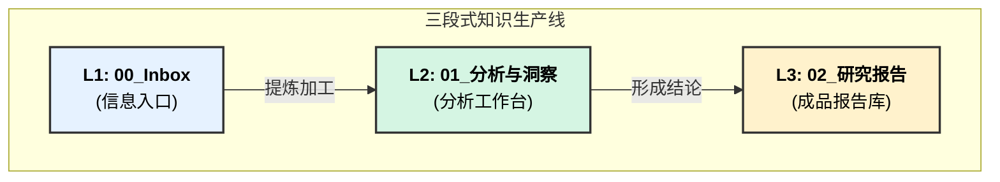

## 📋 执行摘要

[请在此处提供文档的核心内容摘要，包括关键发现、主要结论和重要建议。建议控制在200-300字以内。]

**核心要点**:
- [要点1]
- [要点2]
- [要点3]

# 知识生产系统总纲

---
**版本**: 1.0
**状态**: 已生效
**核心理念**: 将信息处理流程化，分离"输入"、"处理"、"输出"，构建一个从原始信号到可行动洞察的高效、可追溯的知识生产线。
---

## 核心工作流：三段式信息流水线

本系统由三个一级目录构成，分别对应知识生产的三个核心阶段。

---

## 各模块职责与规则

## 📊 核心发现

### 发现1: [标题]
[详细描述关键发现的内容、数据和意义]

### 发现2: [标题]
[详细描述关键发现的内容、数据和意义]

### 发现3: [标题]
[详细描述关键发现的内容、数据和意义]

## 🎯 重要意义

## 💡 结论与建议

## 📈 监控指标

## 📚 参考链接

### 内部资料
- [相关内部文档链接]
- [相关项目文档链接]
- [相关研究报告链接]

### 外部资源
- [外部研究报告链接]
- [行业分析链接]
- [专家观点链接]

### 数据来源
- [数据来源1] - [访问时间]
- [数据来源2] - [访问时间]
- [数据来源3] - [访问时间]

### 工具和平台
- [推荐工具1]
- [推荐工具2]
- [推荐工具3]

### 核心指标
- **[指标名称]**: [目标值] - [监控频率]
- **[指标名称]**: [目标值] - [监控频率]
- **[指标名称]**: [目标值] - [监控频率]

### 跟踪方法
- [监控方法1]
- [监控方法2]
- [监控方法3]

### 评估标准
- [标准1]: [评估方法]
- [标准2]: [评估方法]

### 主要结论
基于以上分析，我们得出以下核心结论：

1. [结论1 - 基于数据分析得出的结论]
2. [结论2 - 基于市场观察得出的结论]
3. [结论3 - 基于趋势判断得出的结论]

### 行动建议

#### 立即行动项 (0-30天)
- [行动项1] - [具体执行步骤]
- [行动项2] - [具体执行步骤]

#### 短期优化项 (30-90天)
- [优化项1] - [具体实施计划]
- [优化项2] - [具体实施计划]

#### 长期发展项 (90-180天)
- [发展项1] - [战略规划]
- [发展项2] - [战略规划]

### 成功指标
- [指标1]: [目标值] - [监控方法]
- [指标2]: [目标值] - [监控方法]

这些发现对[相关领域/决策]具有重要的指导意义，特别是：

1. [意义1]
2. [意义2]
3. [意义3]

### 1. `00_Inbox` (信息入口)
- **职责**: **快速、无压力地捕获一切原始信息**。这是所有知识的起点。
- **内容示例**: 网页剪藏、PDF笔记、会议纪要、一闪而过的想法、文章链接等。
- **核心规则**:
    - **只进不出**: 此处只做收集，不做深度处理和归类。
    - **快速记录**: 优先保证信息不丢失，格式不限。

### 2. `01_分析与洞察` (分析工作台)
- **职责**: **核心的分析、思考与洞察发生地**。这里是"厨房"，负责将来自`00_Inbox`的"食材"加工成"半成品"。
- **内部结构**:
    - `01_分析单元/`: 用于构建标准化的**"画像"**（公司、人物、产品等），是分析的基础模块。
    - `02_综合洞察/`: 用于进行**交叉分析、趋势判断、论点推导**，是形成洞察的核心区域。
- **核心规则**:
    - **过程导向**: 允许"混乱"和迭代，记录思考的过程。
    - **深度链接**: 所有分析都应尽可能链接到`00_Inbox`中的原始信号，以及`01_分析单元`中的相关画像，确保可追溯性。

### 3. `02_研究报告` (成品报告库)
- **职责**: **只存放最终的、经过精炼的、高价值的输出成果**。这里是"餐厅"，所有内容都应是可直接"消费"的成品。
- **内容示例**: 专题分析报告、投资策略备忘录、市场趋势判断、项目评估结论等。
- **核心规则**:
    - **结论导向**: 内容应简洁、清晰，突出核心结论和行动指南。
    - **高度结构化**: 使用标准化的报告模板，便于查阅和引用。
    - **链接到过程**: 报告可以链接回`01_分析与洞察`中的详细分析过程，但其自身必须是独立的、可完整理解的。

---
*本文档是本知识库的最高指导原则，所有操作应遵循此工作流。*