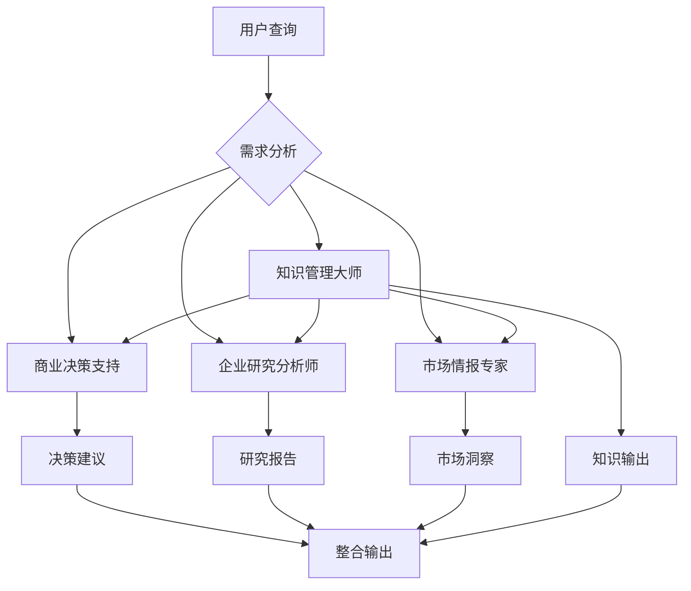

# Launch-X Skills 工作流程指南

## 🎯 Skills生态系统架构



## 🔄 Skills协同工作流程

### 流程1: 投资决策支持工作流
```yaml
触发条件: 用户询问投资相关问题时
工作流程:
  1. 商业决策支持Skill → 初步分析和价值判断
  2. 企业研究分析师Skill → 深度尽调和企业分析
  3. 市场情报专家Skill → 市场环境和竞争分析
  4. 知识管理大师Skill → 整合报告和决策建议

输出结果: 综合投资决策支持报告
```

### 流程2: 企业咨询服务工作流
```yaml
触发条件: 用户需要企业咨询时
工作流程:
  1. 企业研究分析师Skill → 企业现状分析
  2. 市场情报专家Skill → 行业地位和机会分析
  3. 商业决策支持Skill → 战略建议和ROI分析
  4. 知识管理大师Skill → 咨询报告整理和输出

输出结果: 专业企业咨询方案
```

### 流程3: 市场机会识别工作流
```yaml
触发条件: 用户寻求新机会时
工作流程:
  1. 市场情报专家Skill → 市场趋势和机会识别
  2. 商业决策支持Skill → 商业价值和投资回报分析
  3. 企业研究分析师Skill → 实施可行性分析
  4. 知识管理大师Skill → 机会评估报告整理

输出结果: 市场机会评估报告
```

### 流程4: 知识管理优化工作流
```yaml
触发条件: 定期知识整理和内容创作
工作流程:
  1. 知识管理大师Skill → 知识收集和整理
  2. 市场情报专家Skill → 行业动态更新
  3. 商业决策支持Skill → 决策支持内容更新
  4. 知识管理大师Skill → 最终内容生成和发布

输出结果: 知识报告和品牌内容
```

## 🎯 使用指南

### 直接调用方式
```bash
# 投资分析

## 📋 执行摘要

[请在此处提供文档的核心内容摘要，包括关键发现、主要结论和重要建议。建议控制在200-300字以内。]

**核心要点**:
- [要点1]
- [要点2]
- [要点3]


/skill business-decision-support "分析这个AI项目的投资价值"

# 企业尽调
/skill enterprise-research-analyst "对这家企业进行深度分析"

# 市场研究
/skill market-intelligence-expert "分析当前AI市场趋势"

# 知识整理
/skill knowledge-master "整理本月知识内容并生成报告"
```

### 自动识别调用
Claude会根据用户问题自动选择最适合的Skill：

- "这家公司值得投资吗？" → 商业决策支持Skill
- "帮我写份行业研究报告" → 企业研究分析师Skill
- "现在进入这个市场时机如何？" → 市场情报专家Skill
- "帮我整理这些信息" → 知识管理大师Skill

### 组合调用示例
```yaml
复杂需求: "我正在考虑投资一家AI创业公司，需要全面分析"

系统响应:
  1. 自动识别为投资决策需求
  2. 启动投资决策支持工作流
  3. 协调多个Skills并行分析
  4. 生成综合投资分析报告
```

## 🔧 技术实现

### Skills调用机制
```python
class SkillsOrchestrator:
    def process_query(self, query: str):
        # 1. 意图识别
        intent = self.identify_intent(query)

        # 2. 技能选择
        primary_skill = self.select_primary_skill(intent)
        supporting_skills = self.select_supporting_skills(intent)

        # 3. 并行执行
        results = self.execute_skills_parallel(
            primary_skill, supporting_skills, query
        )

        # 4. 结果整合
        integrated_result = self.integrate_results(results)

        return integrated_result
```

### 知识激活逻辑
```python
def activate_knowledge_domains(skill_type: str, query: str):
    # 基于技能类型激活对应知识域
    knowledge_mapping = {
        "business-decision-support": ["02_分析与洞察", "05_方法论中心", "c_AI投资研究"],
        "enterprise-research-analyst": ["03_研究报告", "04_被投企业数据库"],
        "market-intelligence-expert": ["07_市场项目档案", "e_AI技术栈趋势研究"],
        "knowledge-master": ["08_知识传播与品牌", "09_周报月报", "01_Inbox"]
    }

    domains = knowledge_mapping.get(skill_type, [])
    return retrieve_and_process_knowledge(domains, query)
```

## 📊 性能监控

## 📊 核心发现

### 发现1: [标题]
[详细描述关键发现的内容、数据和意义]

### 发现2: [标题]
[详细描述关键发现的内容、数据和意义]

### 发现3: [标题]
[详细描述关键发现的内容、数据和意义]

## 🎯 重要意义

## 💡 结论与建议

## 📚 参考链接

### 内部资料
- [相关内部文档链接]
- [相关项目文档链接]
- [相关研究报告链接]

### 外部资源
- [外部研究报告链接]
- [行业分析链接]
- [专家观点链接]

### 数据来源
- [数据来源1] - [访问时间]
- [数据来源2] - [访问时间]
- [数据来源3] - [访问时间]

### 工具和平台
- [推荐工具1]
- [推荐工具2]
- [推荐工具3]


### 主要结论
基于以上分析，我们得出以下核心结论：

1. [结论1 - 基于数据分析得出的结论]
2. [结论2 - 基于市场观察得出的结论]
3. [结论3 - 基于趋势判断得出的结论]

### 行动建议

#### 立即行动项 (0-30天)
- [行动项1] - [具体执行步骤]
- [行动项2] - [具体执行步骤]

#### 短期优化项 (30-90天)
- [优化项1] - [具体实施计划]
- [优化项2] - [具体实施计划]

#### 长期发展项 (90-180天)
- [发展项1] - [战略规划]
- [发展项2] - [战略规划]

### 成功指标
- [指标1]: [目标值] - [监控方法]
- [指标2]: [目标值] - [监控方法]


这些发现对[相关领域/决策]具有重要的指导意义，特别是：

1. [意义1]
2. [意义2]
3. [意义3]


### 关键指标
- Skills调用成功率
- 响应时间
- 用户满意度
- 知识覆盖率

### 优化机制
- 基于反馈的技能选择优化
- 知识库动态更新
- 工作流程自动化改进
- 个性化推荐机制

---

*通过四大Skills的协同工作，我们实现了从静态知识到动态智能的完整转化！*