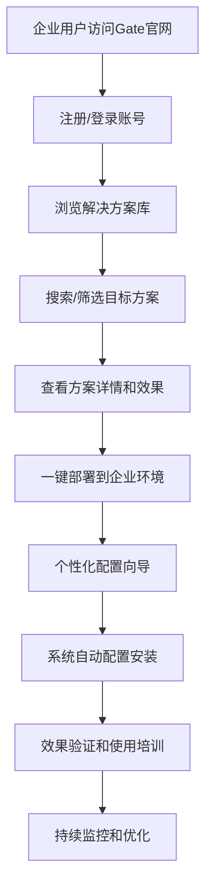

# Gate项目应用运营 - 完整工作流方案

> **核心目标**：构建从场景需求到客户一键复用的完整Gate项目运营体系，让企业客户能够通过Gate官网快速发现、预览并一键部署完整的AI解决方案。

---

## 🎯 项目目标与愿景

### 核心使命
**"让企业AI转型像安装APP一样简单"**

- **降低门槛**：通过标准化解决方案大幅降低企业AI转型门槛
- **提升效率**：从6个月的AI系统部署周期缩短到1周
- **标准化复用**：建立可重复使用的解决方案库和实施模板
- **规模化增长**：实现解决方案的规模化复制和商业价值最大化

### 具体目标
1. **场景标准化**：将企业AI转型需求标准化为可复用的解决方案
2. **技能内化**：在Gate平台内部创建专业的企业AI转型技能
3. **工作流固化**：建立从需求到交付的标准化工作流程
4. **营销精准化**：通过小红书等渠道精准触达目标客户
5. **部署自动化**：实现客户一键部署和快速启用

---

## 🔄 完整工作流程设计

### Phase 1: 场景发现与技能创建 (内部流程)
```
企业场景 → Gate分析 → Skills创建 → 工作流设计 → 方案封装
```

**详细步骤**：
1. **场景收集**：收集真实的企业AI转型需求和痛点
2. **需求分析**：使用Gate智能分析引擎解构场景需求
3. **技能设计**：在Gate平台内部创建对应的AI技能
4. **工作流编排**：设计标准化的实施工作流程
5. **方案封装**：将技能+工作流打包成完整解决方案

### Phase 2: 方案验证与优化 (内部流程)
```
方案测试 → 效果验证 → 迭代优化 → 标准化 → 文档化
```

**详细步骤**：
1. **内部测试**：在Gate环境中测试解决方案可行性
2. **效果验证**：验证方案效果和商业价值
3. **迭代优化**：基于测试结果优化方案细节
4. **标准化固化**：形成标准化的实施方案
5. **文档完善**：编写完整的使用说明和实施指南

### Phase 3: 外部营销与宣传 (外部流程)
```
小红书内容 → 用户吸引 → 官网引流 → 方案展示 → 意向收集
```

**详细步骤**：
1. **内容创作**：基于解决方案创作小红书营销内容
2. **用户教育**：通过专业内容教育目标市场
3. **引流转化**：从小红书引导用户到Gate官网
4. **方案展示**：在官网展示完整解决方案
5. **商机收集**：收集潜在客户需求和联系方式

### Phase 4: 客户一键复用 (外部流程)
```
客户注册 → 方案选择 → 一键部署 → 配置适配 → 效果实现 → 持续优化
```

**详细步骤**：
1. **客户注册**：企业在Gate官网注册账号
2. **方案发现**：通过搜索或推荐找到合适的解决方案
3. **一键部署**：点击部署按钮自动配置和安装
4. **个性化适配**：根据企业具体需求调整配置
5. **效果实现**：快速获得AI转型的实际效果
6. **持续优化**：基于使用数据持续优化改进

---

## 🛠️ 技术实现方案

### Gate内部Skills创建机制
```yaml
技能定义框架:
  - SKILL.md: 技能定义和能力描述
  - instructions.md: Claude执行指令
  - resources/: 支持资源和模板
  - workflows/: 标准化工作流程
  - tests/: 验证测试用例

技能类型分类:
  企业分析类:
    - 企业AI成熟度评估
    - 数字化转型诊断
    - 技术架构分析
    - 业务流程优化

  解决方案类:
    - AI系统架构设计
    - 数据智能引擎建设
    - 业务流程自动化
    - 组织变革支持

  实施工具类:
    - 项目管理工具
    - 风险评估框架
    - 效果监控仪表
    - 持续优化机制
```

### 外部调用API设计
```yaml
RESTful API接口:
  GET /api/solutions: 获取解决方案列表
  GET /api/solutions/{id}: 获取方案详情
  POST /api/deploy: 一键部署解决方案
  GET /api/status/{deployment}: 查询部署状态
  POST /api/configure: 个性化配置方案

SDK集成:
  JavaScript SDK: 前端集成
  Python SDK: 后端集成
  REST API: 第三方系统集成
  Webhook: 事件通知机制
```

### 一键部署技术架构
```yaml
部署引擎:
  容器化部署: Docker + Kubernetes
  配置管理: 环境变量 + 配置文件
  服务编排: 微服务架构
  数据迁移: 自动化数据导入

监控体系:
  部署监控: 实时状态跟踪
  性能监控: 系统性能指标
  业务监控: 使用效果指标
  告警机制: 异常自动通知
```

---

## 📱 小红书营销策略

### 内容矩阵规划
```yaml
教育内容 (30%):
  - 企业AI转型基础知识
  - 行业解决方案介绍
  - 技术概念通俗解释
  - 实施方法论分享

案例展示 (25%):
  - 真实客户成功案例
  - 解决方案实施过程
  - 效果数据对比分析
  - 客户使用体验分享

产品演示 (20%):
  - Gate平台功能展示
  - 一键部署过程演示
  - 系统界面操作演示
  - 效果实现验证

商业价值 (15%):
  - ROI分析和投资回报
  - 成本效益对比
  - 竞争优势分析
  - 市场趋势洞察

互动活动 (10%):
  - 用户问答和答疑
  - 案例征集和分享
  - 专家访谈直播
  - 社群互动讨论
```

### 运营策略
```yaml
发布节奏:
  - 每周5篇内容更新
  - 固定发布时间表
  - 节假日特别策划
  - 热点话题快速响应

用户互动:
  - 评论区专业回复
  - 私信及时响应
  - 用户问题收集
  - 反馈持续改进

转化引导:
  - 官网链接植入
  - 专属优惠活动
  - 试用申请引导
  - 销售线索跟进
```

---

## 💻 客户一键复用实现

### 用户使用流程


### 技术实现方式
```yaml
方案封装格式:
  - Docker镜像: 包含完整应用环境
  - 配置文件: 环境参数和业务配置
  - 数据模板: 初始化数据和示例
  - 文档说明: 使用指南和最佳实践

部署触发机制:
  - Web界面一键部署
  - API程序化部署
  - 批量部署支持
  - 定制化部署选项

配置适配过程:
  - 环境自动检测
  - 参数智能推荐
  - 配置验证机制
  - 错误处理和回滚
```

### 用户体验设计
```yaml
发现阶段:
  - 智能推荐引擎
  - 分类浏览导航
  - 搜索功能优化
  - 个性化推荐

评估阶段:
  - 方案详情展示
  - 效果数据说明
  - 成功案例参考
  - 用户评价体系

部署阶段:
  - 一键部署操作
  - 进度实时展示
  - 配置向导引导
  - 问题自动诊断

使用阶段:
  - 快速上手指导
  - 功能使用教程
  - 效果监控面板
  - 优化建议推送
```

---

## 🎯 成功指标与评估

### 技术指标
```yaml
系统性能:
  - 部署成功率: ≥95%
  - 部署时间: ≤30分钟
  - 系统可用性: ≥99.5%
  - 响应时间: ≤2秒

用户体验:
  - 方案匹配准确率: ≥90%
  - 用户操作成功率: ≥98%
  - 用户满意度: ≥4.5/5.0
  - 问题解决时效: ≤24小时
```

### 业务指标
```yaml
用户增长:
  - 月活跃用户数: 增长率≥50%
  - 方案采用率: ≥60%
  - 用户留存率: ≥85%
  - 客户推荐率: ≥70%

商业价值:
  - 年收入目标: ¥1亿元
  - 客户生命周期价值: ≥¥50万元
  - 获客成本: ≤¥10,000
  - 投资回报率: ≥200%
```

### 内容营销指标
```yaml
小红书运营:
  - 粉丝增长: ≥10,000/月
  - 内容互动率: ≥8%
  - 官网引流: ≥5,000/月
  - 转化率: ≥3%

品牌影响力:
  - 行业知名度: Top 3
  - 专业权威性: 专家认可
  - 用户口碑: 净推荐值≥70
  - 媒体曝光: ≥100篇/年
```

---

## 🗂️ 项目文档结构

```
🤖 AI生成 auto-generated/20251028/gate项目应用运营/
├── README.md                           # 项目总体说明 (本文件)
├── Gate项目小红书内容营销运营策略.md      # 小红书营销详细策略
├── Gate企业AI操作系统产品解决方案与案例分析.md  # 产品解决方案详情
├── gate项目组织建议.md                    # 项目组织架构建议
├── Gate-Skills创建工作流.md              # 技能创建详细流程
├── 客户一键复用技术实现方案.md            # 一键复用技术细节
├── 小红书内容制作模板和示例.md            # 内容制作标准化模板
├── 项目实施时间表和里程碑.md              # 项目执行计划
├── 成功案例收集和分析模板.md              # 案例分析标准化
├── 技术架构和API设计文档.md              # 技术实现细节
├── 数据监控和效果评估体系.md              # 监控评估体系
└── 财务预算和ROI分析.md                  # 财务规划分析
```

---

## 🚀 下一步行动计划

### 短期目标 (1个月)
1. **完善技术架构**：完成Gate内部Skills创建机制
2. **建立内容体系**：创作首批小红书营销内容
3. **测试部署流程**：验证一键部署技术方案
4. **建立监控体系**：搭建数据监控和分析系统

### 中期目标 (3个月)
1. **规模化内容生产**：建立稳定的内容生产和发布机制
2. **用户增长验证**：实现首批100家企业客户获取
3. **效果验证迭代**：基于用户反馈优化产品和服务
4. **商业模式验证**：验证付费转化和收入模式

### 长期目标 (12个月)
1. **市场领导地位**：成为企业AI操作系统领域的领导者
2. **生态体系建设**：建立完整的合作伙伴生态
3. **标准化输出**：形成可复制的成功模式和标准
4. **国际化扩展**：探索海外市场的机会和模式

---

## 📞 项目团队与联系方式

### 核心团队
- **项目负责人**：Gate产品运营负责人
- **技术负责人**：Gate平台技术架构师
- **营销负责人**：LaunchX营销策略专家
- **内容负责人**：专业内容创作团队

### 联系方式
- **项目合作**：gate-project@a2a.ink
- **技术支持**：tech-support@gate.a2a.ink
- **商务合作**：business@gate.a2a.ink
- **媒体联系**：media@gate.a2a.ink

---

## 📄 文档版本说明

- **当前版本**：v1.0.0
- **最后更新**：2025-10-28
- **下次更新**：根据项目进展定期更新
- **维护责任**：LaunchX Gate项目组

---

*本项目旨在建立从场景创建到客户一键复用的完整Gate项目运营体系，通过标准化、自动化、规模化的方式，让企业AI转型变得简单、高效、可复制。我们将持续迭代优化，为企业客户提供最好的AI转型解决方案和服务。*