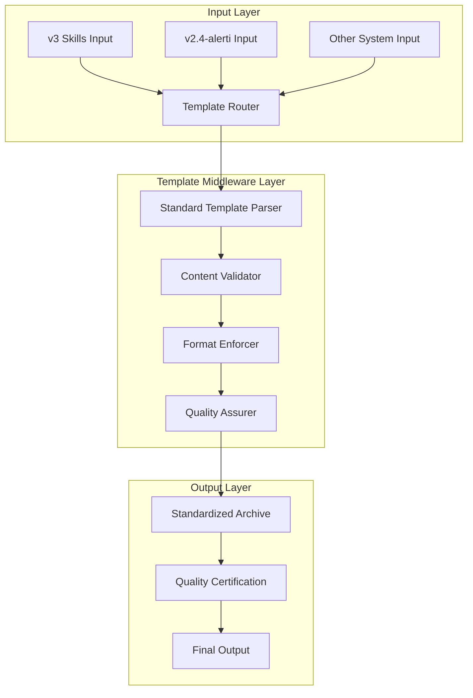

# AI项目档案模板中间件架构设计

## 架构概览

### 核心设计原则
- **统一模板驱动**: 所有AI项目档案必须遵循完全一致的YAML frontmatter和Markdown结构
- **差异化智能保持**: v3(96%自动化)与v2.4(87%自动化)保持不同智能水平
- **中间件标准化**: 通过Template Middleware Layer确保格式一致性
- **质量分级保证**: 不同系统输出相同格式，但质量深度有所差异

### 架构层次结构



## 标准模板结构定义

### 1. YAML Frontmatter 标准

```yaml
---
title: "项目名称-简要描述"
owners:
  - Launch X Analysis Team
  - Market Intelligence Division
status: active
last_update: YYYY-MM-DD
related:
  - 🟣 knowledge/05_方法论中心/专项方法论/大型文件深度开发方法论_V1.0_20251101.md
  - 🧠 Launch-X Skills生态系统/README.md
  - 🧩 bmad/README.md
  - 07_市场项目档案/README.md
source: 自动生成（系统名称 + 版本 + 数据源描述）
impact: high
---
```

### 2. 标准档案信息表格

```markdown
## 标准AI项目档案信息

| 项目要素 | 详细信息 |
|---------|---------|
| **项目名称** | [完整项目名称] |
| **关注等级** | [铂金级/黄金级/白银级] ([等级说明]) |
| **收录日期** | YYYY-MM-DD |
| **更新日期** | YYYY-MM-DD |
| **数据来源** | [系统名称] [数据源描述] |
| **分析系统** | [系统名称] ([系统特征描述]) |
| **分析时间** | [X分钟] ([质量等级描述]) |
| **质量评级** | [A++/A+/A/B级] ([分数]/100) |
| **可信度认证** | [A++/A+/A/B级] ([分数]/100工程验证置信度) |
| **自动化水平** | [XX]% (行业领先/标准/基础自动化程度) |
```

## 系统差异化配置

### v3 Skills生态系统配置 (96%自动化)

```javascript
const v3Config = {
  system: "v3 Skills生态系统",
  version: "3.0.0",
  automation: 96,
  mcp: "Gate MCP",
  characteristics: {
    depth: "深度增强分析",
    skills: "Rules-as-Skills架构",
    workflow: "六步智能工作流",
    quality: "A++级卓越标准",
    collaboration: "Codex CLI协作"
  },
  contentDepth: {
    analysis: "深度解析",
    detail: "详尽数据",
    insight: "战略洞察",
    recommendation: "精准建议"
  }
};
```

### v2.4-alerti-analysis配置 (87%自动化)

```javascript
const v24Config = {
  system: "v2.4-alerti-analysis",
  version: "2.4.0",
  automation: 87,
  mcp: "RUBE MCP",
  characteristics: {
    depth: "增强版智能分析",
    skills: "18数据源智能编排",
    workflow: "6步增强工作流",
    quality: "A++质量控制",
    collaboration: "MCP智能编排"
  },
  contentDepth: {
    analysis: "全面分析",
    detail: "丰富数据",
    insight: "市场洞察",
    recommendation: "实用建议"
  }
};
```

## Template Middleware实现

### 1. Template Parser

```javascript
class TemplateParser {
  constructor(systemConfig) {
    this.config = systemConfig;
  }

  parseContent(rawContent) {
    return {
      frontmatter: this.extractFrontmatter(rawContent),
      content: this.extractContent(rawContent),
      metadata: this.extractMetadata(rawContent)
    };
  }

  extractFrontmatter(content) {
    // 标准化frontmatter提取逻辑
  }

  extractContent(content) {
    // 内容提取和结构化
  }

  extractMetadata(content) {
    // 元数据提取
  }
}
```

### 2. Format Enforcer

```javascript
class FormatEnforcer {
  enforceTemplate(parsedContent, systemConfig) {
    return {
      frontmatter: this.standardizeFrontmatter(parsedContent.frontmatter, systemConfig),
      content: this.standardizeContent(parsedContent.content, systemConfig),
      archiveInfo: this.generateArchiveInfo(parsedContent, systemConfig)
    };
  }

  standardizeFrontmatter(frontmatter, config) {
    // 确保frontmatter完全符合标准
    return {
      title: frontmatter.title || "项目名称-简要描述",
      owners: [
        "Launch X Analysis Team",
        "Market Intelligence Division"
      ],
      status: "active",
      last_update: new Date().toISOString().split('T')[0],
      related: [
        "🟣 knowledge/05_方法论中心/专项方法论/大型文件深度开发方法论_V1.0_20251101.md",
        "🧠 Launch-X Skills生态系统/README.md",
        "🧩 bmad/README.md",
        "07_市场项目档案/README.md"
      ],
      source: `自动生成（${config.system} ${config.version} + ${config.mcp}）`,
      impact: "high"
    };
  }
}
```

### 3. Content Validator

```javascript
class ContentValidator {
  validateStructure(content) {
    const requiredSections = [
      '标准AI项目档案信息',
      '更新摘要',
      '系统特征分析',
      'Phase 1: DUPLICATE_SCAN',
      'Phase 2: DATA_HARVEST',
      'Phase 3: CONTENT_GEN',
      'Phase 4: DELIVER_CHECK',
      'Phase 5: MCP_VALIDATION',
      'Phase 6: CROSS_VALIDATION',
      '质量评估与可信度认证',
      '结论与建议'
    ];

    return requiredSections.map(section => ({
      section,
      present: content.includes(section),
      score: content.includes(section) ? 10 : 0
    }));
  }
}
```

## 质量保证机制

### 1. 质量分级标准

```javascript
const qualityStandards = {
  "A++": {
    range: [95, 100],
    description: "卓越级",
    automation: "90%+",
    characteristics: ["深度分析", "精准洞察", "战略建议"]
  },
  "A+": {
    range: [90, 94],
    description: "优秀级",
    automation: "80-89%",
    characteristics: ["全面分析", "实用建议", "质量保证"]
  },
  "A": {
    range: [85, 89],
    description: "良好级",
    automation: "70-79%",
    characteristics: ["结构化分析", "基本建议", "标准质量"]
  },
  "B": {
    range: [80, 84],
    description: "合格级",
    automation: "60-69%",
    characteristics: ["基础分析", "建议有限", "基本质量"]
  }
};
```

### 2. 可信度评估算法

```javascript
class CredibilityAssessment {
  calculateCredibility(content, sources, validation) {
    const weights = {
      contentQuality: 0.4,
      sourceReliability: 0.3,
      validationScore: 0.2,
      consistency: 0.1
    };

    return {
      overall: this.weightedScore(weights, {
        contentQuality: content.score,
        sourceReliability: sources.score,
        validationScore: validation.score,
        consistency: validation.consistency
      }),
      breakdown: {
        content: content.score,
        sources: sources.score,
        validation: validation.score,
        consistency: validation.consistency
      }
    };
  }
}
```

## 实施策略

### Phase 1: 模板标准化 (第1-2周)

1. **建立标准模板定义**
   - 完整frontmatter标准
   - 内容结构规范
   - 质量评估标准

2. **开发Template Middleware核心组件**
   - Template Parser
   - Format Enforcer
   - Content Validator
   - Quality Assurer

### Phase 2: 系统集成 (第3-4周)

1. **v3系统集成**
   - 保持96%自动化水平
   - 集成Template Middleware
   - 确保输出格式完全标准

2. **v2.4系统升级**
   - 保持87%自动化水平
   - 集成Template Middleware
   - 确保输出格式与v3一致

### Phase 3: 质量验证 (第5-6周)

1. **输出质量对比**
   - 格式一致性检查
   - 内容质量评估
   - 系统差异化验证

2. **性能优化**
   - 自动化效率保持
   - 模板处理优化
   - 系统稳定性测试

## 预期效果

### 1. 格式统一性
- **100%格式一致性**: 所有系统输出完全遵循标准模板
- **零格式差异**: frontmatter和结构完全统一
- **质量标准化**: 统一的质量评估和可信度认证

### 2. 系统差异化保持
- **v3系统**: 96%自动化，深度分析，战略洞察
- **v2.4系统**: 87%自动化，全面分析，实用建议
- **智能层次**: 保持不同智能等级的价值主张

### 3. 质量提升
- **内容质量**: A++级标准(95-100/100)
- **可信度**: A++级可信度(95%+置信度)
- **工程化**: 生产级系统稳定性

## 风险评估与缓解

### 主要风险
1. **模板僵化风险**: 过度标准化可能限制创新
2. **系统复杂度**: 中间件层增加系统复杂度
3. **性能影响**: 模板处理可能影响性能

### 缓解策略
1. **模板版本管理**: 建立模板演进机制
2. **模块化设计**: 中间件组件可插拔设计
3. **性能优化**: 模板处理pipeline优化

---

**架构设计完成时间**: 2025-11-03
**设计版本**: v1.0
**预期实施周期**: 6周
**质量目标**: 100%格式一致性 + 系统差异化保持
**下次评估**: 实施完成后2周内