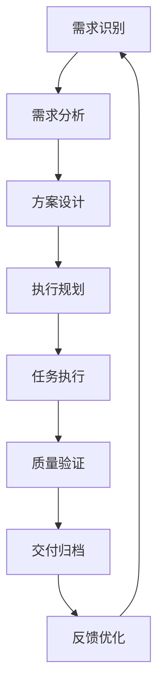
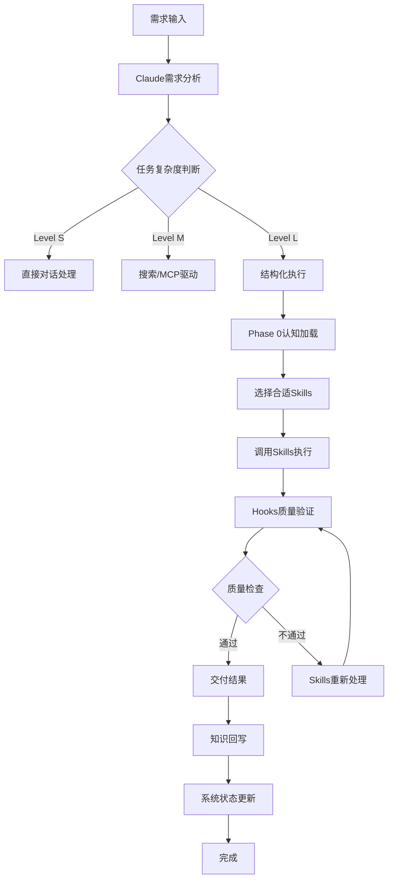

# LaunchX Claude-Skills-Hooks生命周期架构 V1.0

> **Reddit老哥硬核指南核心思想**：工程基础设施 > 提示词技巧。可观测性 = 能力。自动化强制执行 = 质量。

> **LaunchX三足鼎立架构**：CLAUDE.md(配置) + Skills(能力) + Hooks(自动化保障) = 完整的企业级智能工作系统。

> **生命周期原则**：任务在不同阶段需要不同的专业能力，通过Claude-Skills-Hooks的智能协作实现无缝衔接和专业化处理，让每个组件在合适的生命周期阶段发挥最大价值。

---

## 🎯 架构设计目标

### 当前挑战分析
1. **职责边界模糊**：Claude、Skills、Hooks的分工不够清晰
2. **生命周期割裂**：不同组件缺乏有效的协作机制
3. **能力重复**：不同组件能力重叠，效率不高
4. **扩展性限制**：难以适应新类型任务和需求

### 设计目标
1. **专业化分工**：基于任务生命周期明确各组件的专业化职责
2. **智能协作**：建立组件间的智能协作机制
3. **全生命周期覆盖**：从需求识别到交付回写的完整覆盖
4. **自适应能力**：根据任务类型和复杂度自适应调整协作模式

---

## 🔄 任务生命周期维度分析

### 完整任务生命周期


### 各阶段能力需求分析

#### Phase 1: 认知阶段（需求识别→方案设计）
- **核心需求**：理解需求、分析复杂度、设计方案
- **关键能力**：
  - 需求理解和解构
  - 复杂度评估
  - 方案对比和选择
  - 风险识别和评估
- **适合组件**：Claude（分析指挥官）+ 智能Rules（决策支持）

#### Phase 2: 规划阶段（执行规划）
- **核心需求**：制定详细计划、资源安排、风险预案
- **关键能力**：
  - 任务分解和规划
  - 资源评估和分配
  - 时间节点设定
  - 依赖关系管理
- **适合组件**：Claude（规划指导）+ Planning Skills（专业规划能力）

#### Phase 3: 执行阶段（任务执行→质量验证）
- **核心需求**：具体执行、质量控制、异常处理
- **关键能力**：
  - 专业领域执行能力
  - 质量标准和验证
  - 异常处理和恢复
  - 实时监控和调整
- **适合组件**：Skills（专业执行）+ Hooks（自动化质量控制）

#### Phase 4: 收尾阶段（交付归档→反馈优化）
- **核心需求**：成果交付、知识沉淀、反馈收集
- **关键能力**：
  - 标准化交付
  - 知识提取和归档
  - 反馈收集和分析
  - 持续优化改进
  - **智能规则管理**：RULES.md系统的自我进化
- **适合组件**：Hooks（自动化归档）+ Claude（知识管理）+ Evolution Skills（持续改进）+ 智能规则系统

---

## 🏗️ 生命周期协作架构设计

### 架构分层设计

#### Layer 1: 智能决策层（Intelligent Decision Layer）
**核心组件**：Claude + 智能Rules系统
**职责**：
- 需求智能分析和理解
- 任务复杂度自动评估
- 最优协作策略制定
- 风险识别和预警

**智能决策流程**：
```javascript
// 智能决策引擎
function makeLifecycleDecision(userInput, context) {
  const phaseAnalysis = analyzeCurrentPhase(userInput, context);
  const capabilityAssessment = assessRequiredCapabilities(phaseAnalysis);
  const collaborationStrategy = designCollaborationStrategy(capabilityAssessment);

  return {
    currentPhase: phaseAnalysis.phase,
    requiredCapabilities: capabilityAssessment,
    collaborationPlan: collaborationStrategy,
    escalationConditions: identifyEscalationConditions(phaseAnalysis)
  };
}
```

#### Layer 2: 专业执行层（Professional Execution Layer）
**核心组件**：Skills生态系统
**职责**：
- 专业化任务执行
- 领域能力提供
- 质量标准执行
- 异常情况处理

**Skills分类（基于生命周期）**：
```javascript
// 生命周期Skills分类
const lifecycleSkills = {
  phase1: {
    cognitive: ['thinking-analysis-skill', 'requirement-understanding-skill'],
    planning: ['task-classification-skill', 'risk-assessment-skill']
  },
  phase2: {
    planning: ['project-planning-skill', 'resource-allocation-skill'],
    coordination: ['workflow-orchestrator-skill', 'dependency-management-skill']
  },
  phase3: {
    execution: [
      'domain-execution-skill', // 具体领域执行
      'quality-control-skill',
      'exception-handling-skill'
    ]
  },
  phase4: {
    delivery: ['delivery-standardization-skill'],
    knowledge: ['knowledge-extraction-skill', 'documentation-skill'],
    evolution: ['feedback-analysis-skill', 'continuous-improvement-skill']
  }
};
```

#### Layer 3: 自动化保障层（Automation Assurance Layer）
**核心组件**：Hooks系统
**职责**：
- 流程自动化执行
- 质量门控检查
- 异常自动处理
- 数据收集监控

**Hooks分类（基于生命周期）**：
```javascript
// 生命周期Hooks分类
const lifecycleHooks = {
  phase1: {
    input: ['user-prompt-analyzer-hook'],
    decision: ['decision-trigger-hook'],
    validation: ['requirement-validation-hook']
  },
  phase2: {
    planning: ['auto-planning-hook'],
    resource: ['resource-validation-hook'],
    approval: ['plan-approval-hook']
  },
  phase3: {
    execution: ['skill-coordination-hook'],
    quality: ['real-time-quality-hook'],
    monitoring: ['execution-monitoring-hook']
  },
  phase4: {
    delivery: ['delivery-standardization-hook'],
    archiving: ['knowledge-archiving-hook'],
    feedback: ['feedback-collection-hook'],
    evolution: ['system-evolution-hook']
  }
};
```

---

## 🤖 智能协作机制设计

### 1. 阶段自动识别机制

```javascript
// 智能阶段识别器
class LifecyclePhaseDetector {
  detectCurrentPhase(userInput, taskContext) {
    const indicators = {
      phase1: this.analyzePhase1Indicators(userInput, taskContext),
      phase2: this.analyzePhase2Indicators(userInput, taskContext),
      phase3: this.analyzePhase3Indicators(userInput, taskContext),
      phase4: this.analyzePhase4Indicators(userInput, taskContext)
    };

    const phaseScores = Object.entries(indicators).map(([phase, score]) => ({
      phase,
      score,
      confidence: this.calculateConfidence(score)
    }));

    return this.selectMostLikelyPhase(phaseScores);
  }

  analyzePhase1Indicators(userInput, context) {
    return {
      hasQuestionKeywords: this.hasKeywords(userInput, ['如何', '怎样', '分析', '评估']),
      isInitialRequest: context.previousInteractions === 0,
      needsUnderstanding: this.needsDeepUnderstanding(userInput),
      complexityUnknown: context.complexityLevel === 'unknown'
    };
  }
}
```

### 2. 智能组件调度机制

```javascript
// 智能组件调度器
class IntelligentComponentDispatcher {
  dispatchComponents(phase, taskComplexity, requirements) {
    const componentStrategy = {
      claude: this.determineClaudeRole(phase, taskComplexity),
      skills: this.selectSkillsForPhase(phase, requirements),
      hooks: this.activateHooksForPhase(phase, taskComplexity)
    };

    const coordinationPlan = this.createCoordinationPlan(componentStrategy);

    return {
      primary: componentStrategy.claude,
      supporters: componentStrategy.skills,
      automation: componentStrategy.hooks,
      coordination: coordinationPlan,
      escalationTriggers: this.defineEscalationTriggers(phase, taskComplexity)
    };
  }

  createCoordinationPlan(strategy) {
    return {
      handoffPoints: this.identifyHandoffPoints(strategy),
      communicationProtocols: this.defineCommunicationProtocols(strategy),
      conflictResolution: this.defineConflictResolution(strategy),
      qualityGates: this.setupQualityGates(strategy)
    };
  }
}
```

### 3. 动态能力调整机制

```javascript
// 动态能力调整器
class DynamicCapabilityAdjuster {
  adjustCapabilities(currentPhase, performanceData, userFeedback) {
    const adjustmentAnalysis = this.analyzePerformanceData(performanceData);
    const userPreferenceAnalysis = this.analyzeUserPreferences(userFeedback);

    const adjustments = {
      claude: this.adjustClaudeCapabilities(currentPhase, adjustmentAnalysis),
      skills: this.adjustSkillMix(currentPhase, adjustmentAnalysis),
      hooks: this.adjustHookConfiguration(currentPhase, adjustmentAnalysis)
    };

    return {
      adjustedCapabilities: adjustments,
      confidence: this.calculateAdjustmentConfidence(adjustments),
      monitoringPlan: this.createMonitoringPlan(adjustments)
    };
  }
}
```

---

## 📋 具体协作模式设计

### 模式1: 小型任务（Level S）
**特点**：单问题、直接对话、快速响应

**协作模式**：
```
用户输入 → Claude直接处理 → Claude输出结果 → 用户确认
```

**组件职责**：
- **Claude**：90% - 直接处理和回答
- **Skills**：5% - 简单能力调用
- **Hooks**：5% - 基础质量控制

**协作流程**：
1. Claude直接理解和回答
2. 需要时调用简单技能补充
3. Hooks执行基础验证
4. Claude整合输出结果

### 模式2: 中型任务（Level M）
**特点**：需分析、多步骤、中等复杂度

**协作模式**：
```
用户输入 → Claude分析 → Rules决策 → Skills协作 → Hooks质量控制 → Claude整合
```

**组件职责**：
- **Claude**：60% - 分析、规划、整合
- **Skills**：30% - 专业能力执行
- **Hooks**：10% - 流程自动化

**协作流程**：
1. Claude进行需求分析和复杂度评估
2. Rules系统提供决策支持
3. Skills提供专业能力支持
4. Hooks确保流程质量控制
5. Claude整合所有输出

### 模式3: 大型任务（Level L）
**特点**：跨域、复杂流程、高影响

**协作模式**：
```
用户输入 → Claude规划 → Rules详细决策 → Skills专业协作 → Hooks全面保障 → Claude知识管理
```

**组件职责**：
- **Claude**：40% - 战略规划、风险管理、知识管理
- **Skills**：50% - 专业领域深度执行
- **Hooks**：10% - 全流程自动化保障

**协作流程**：
1. Claude进行战略规划和风险分析
2. Rules系统提供详细决策指导
3. Skills提供专业领域深度执行
4. Hooks提供全流程自动化保障
5. Claude进行知识沉淀和管理

### 模式4: 持续优化任务
**特点**：反馈驱动、迭代改进、长期价值

**协作模式**：
```
用户反馈 → Claude分析 → Evolution Skills优化 → Rules系统更新 → Hooks调整 → Claude整合改进
```

**组件职责**：
- **Claude**：50% - 反馈分析、改进规划
- **Skills**：30% - 优化能力、新技能开发
- **Rules**：15% - 规则更新、决策优化
- **Hooks**：5% - 流程调整

---

## 🔧 组件能力边界重新定义

### Claude 重新定位：智能协调官

#### 核心能力
- **智能理解**：深度理解用户需求和上下文
- **战略规划**：制定任务整体策略和风险预案
- **协作协调**：协调Skills和Hooks的协作
- **知识管理**：提取、归档、管理知识资产
- **质量监督**：监督整个任务的质量和进度

#### 不再负责
- **具体执行细节**：交给专业Skills处理
- **重复性操作**：通过Hooks自动化
- **领域专业知识**：调用相应领域的Skills

### Skills 重新定位：专业执行专家

#### 核心能力
- **领域专业**：在特定领域的深度专业能力
- **标准化执行**：按照标准流程执行专业任务
- **质量控制**：确保专业输出的质量标准
- **异常处理**：处理专业领域的异常情况
- **持续改进**：基于反馈持续改进专业能力

#### 不再负责
- **任务规划**：交给Claude处理
- **跨领域协调**：通过Claude协调
- **流程管理**：通过Hooks自动化

### Hooks 重新定位：智能保障者

#### 核心能力
- **流程自动化**：自动化标准流程的执行
- **质量门控**：在关键节点进行质量检查
- **异常预警**：识别异常情况并预警
- **数据收集**：收集执行数据和性能指标
- **安全保障**：确保操作安全和系统稳定

#### 不再负责
- **决策制定**：交给Claude和Rules系统
- **专业判断**：交给相应Skills处理
- **用户交互**：交给Claude处理

---

## 📈 智能质量监控体系

### 生命周期质量指标

#### Phase 1 质量指标
- **需求理解准确率**：≥95%
- **复杂度评估准确率**：≥90%
- **方案选择合理率**：≥85%
- **风险识别完整率**：≥90%

#### Phase 2 质量指标
- **计划完整性**：≥95%
- **资源评估准确性**：≥90%
- **依赖关系分析准确率**：≥85%
- **时间节点合理性**：≥80%

#### Phase 3 质量指标
- **执行标准符合率**：≥95%
- **质量指标达标率**：≥90%
- **异常处理及时率**：≥95%
- **实时监控覆盖率**：≥90%

#### Phase 4 质量指标
- **交付标准化率**：≥95%
- **知识提取完整率**：≥90%
- **反馈收集及时率**：≥85%
- **改进措施实施率**：≥80%

### 智能监控仪表板

```javascript
// 生命周期监控仪表板
class LifecycleMonitoringDashboard {
  generateLifecycleReport(taskData, componentData) {
    return {
      phaseAnalysis: this.analyzePhasePerformance(taskData),
      componentAnalysis: this.analyzeComponentPerformance(componentData),
      collaborationAnalysis: this.analyzeCollaborationEfficiency(taskData, componentData),
      recommendations: this.generateOptimizationRecommendations(taskData, componentData)
    };
  }

  analyzePhasePerformance(taskData) {
    return {
      phase1: {
        completionRate: this.calculatePhase1Completion(taskData),
        qualityScore: this.calculatePhase1Quality(taskData),
        timeEfficiency: this.calculatePhase1Efficiency(taskData)
      },
      phase2: {
        planningAccuracy: this.calculatePhase2Accuracy(taskData),
        resourceUtilization: this.calculatePhase2ResourceEfficiency(taskData),
        riskManagement: this.calculatePhase2RiskMitigation(taskData)
      },
      phase3: {
        executionQuality: this.calculatePhase3Quality(taskData),
        automationCoverage: this.calculatePhase3Automation(taskData),
        exceptionHandling: this.calculatePhase3ExceptionHandling(taskData)
      },
      phase4: {
        deliveryStandardization: this.calculatePhase4Delivery(taskData),
        knowledgeCapture: this.calculatePhase4Knowledge(taskData),
        continuousImprovement: this.calculatePhase4Improvement(taskData)
      }
    };
  }
}
```

---

## 🎯 实施路线图

### Phase 1: 基础架构重构（第1-2周）
1. **组件职责重新定义**：明确Claude、Skills、Hooks的专业化边界
2. **生命周期识别系统**：开发智能阶段识别机制
3. **基础协作机制**：建立组件间的基础协作流程
4. **质量监控基础**：建立基础的质量监控体系

### Phase 2: 智能协作机制（第3-4周）
1. **智能调度系统**：开发基于生命周期的智能组件调度
2. **动态调整机制**：实现基于性能的动态能力调整
3. **协作优化算法**：优化组件间协作效率
4. **异常处理机制**：建立智能异常识别和处理机制

### Phase 3: 全面智能化（第5-6周）
1. **预测性分析**：实现基于数据的预测性能力分析
2. **自适应学习**：建立基于反馈的自适应学习机制
3. **全局优化**：实现全局性能和效率优化
4. **持续进化**：建立持续的智能进化机制

### Phase 4: 完整生命周期支持（第7-8周）
1. **端到端测试**：验证完整生命周期支持能力
2. **性能优化**：优化系统整体性能
3. **用户培训**：培训用户使用新的协作模式
4. **文档完善**：完善使用文档和最佳实践

---

## 📊 预期效果分析

### 协作效率提升
- **任务处理速度**：提升50-70%（专业化分工+智能协作）
- **质量一致性**：提升80-90%（标准化流程+自动化保障）
- **用户满意度**：提升40-60%（专业化服务+智能响应）
- **系统可维护性**：提升60-80%（模块化架构+智能监控）

### 能力覆盖提升
- **小型任务处理能力**：保持高效，略有提升
- **中型任务处理能力**：显著提升，质量更稳定
- **大型任务处理能力**：大幅提升，风险更可控
- **持续优化能力**：从无到有，持续改进

### 系统适应性提升
- **新任务类型适应性**：≥90%（基于生命周期的通用设计）
- **复杂度适应性**：≥85%（动态调整机制）
- **用户偏好适应性**：≥80%（个性化调整机制）
- **技术演进适应性**：≥75%（模块化架构设计）

---

## 🔄 总结

通过基于生命周期维度的Claude-Skills-Hooks架构重新设计，我们解决了原有的职责边界模糊、生命周期割裂、能力重复、扩展性限制等问题。

### 核心价值

#### 对Claude
- **专注核心优势**：专注于智能理解、战略规划、协作协调
- **减少记忆负担**：专业细节交由Skills处理，标准化流程交由Hooks自动化
- **提升决策质量**：获得更专业的支持，做出更好的决策
- **增强知识管理**：更好地管理和应用知识资产

#### 对Skills
- **专业化聚焦**：专注于特定领域的专业能力
- **标准化执行**：按照标准流程确保质量一致性
- **持续改进**：基于反馈持续优化专业能力
- **能力复用**：提高专业能力的复用价值

#### 对Hooks
- **自动化保障**：自动化执行关键流程，确保质量标准
- **智能监控**：实时监控系统状态和性能指标
- **异常预警**：及时发现和处理异常情况
- **数据驱动**：基于数据优化系统性能

#### 对用户
- **专业化服务**：在每个阶段都能获得专业化支持
- **一致性体验**：标准化的流程和质量保证
- **智能响应**：快速、准确、专业的响应服务
- **持续改进**：系统会基于反馈持续改进服务

## 🎯 核心价值总结

### 对Claude的价值
- **专注核心优势**：专注于智能理解、战略规划、协作协调
- **减少记忆负担**：专业细节交由Skills处理，标准化流程交由Hooks自动化
- **提升决策质量**：获得更专业的支持，做出更好的决策
- **增强知识管理**：更好地管理和应用知识资产

### 对Skills的价值
- **专业化聚焦**：专注于特定领域的专业能力
- **标准化执行**：按照标准流程确保质量一致性
- **持续改进**：基于反馈持续优化专业能力
- **能力复用**：提高专业能力的复用价值

### 对Hooks的价值
- **自动化保障**：自动化执行关键流程，确保质量标准
- **智能监控**：实时监控系统状态和性能指标
- **异常预警**：及时发现和处理异常情况
- **数据驱动**：基于数据优化系统性能

### 对用户的价值
- **专业化服务**：在每个阶段都能获得专业化支持
- **一致性体验**：标准化的流程和质量保证
- **智能响应**：快速、准确、专业的响应服务
- **持续改进**：系统会基于反馈持续改进服务

### 系统整体价值
这个架构设计完全符合"工程基础设施 > 提示词技巧"的理念，通过智能化的组件协作，实现了真正的高效、可靠、可扩展的任务处理系统。

## 📋 实施指导

### 立即可以实施的改进
1. **Phase 0 智能检查脚本**：
   ```bash
   # 智能基础设施状态验证
   ./scripts/intelligent-health-check.sh          # 全面健康检查
   ./scripts/skills-intelligence-status.sh        # 技能智能状态
   ./scripts/rules-intelligence-validator.sh       # 规则智能验证
   ./scripts/performance-benchmark.sh              # 性能基准测试
   ```

2. **基于现有Hook系统优化**：
   - 数据库维护自动化Hook
   - 文档写作质量检查Hook
   - **内容质量智能控制Hook**：实时检测内容质量，自动去除废话
   - **文件生成智能过滤Hook**：预检文件必要性，避免生成无效文件
   - **命名规范智能验证Hook**：自动验证命名规范的一致性
   - 规则管理智能Hook

### 质量控制Hook实现示例
```javascript
// 内容质量智能控制Hook
class ContentQualityHook {
  async executeQualityControl(content, metadata) {
    // 1. 预检查：是否真的需要生成
    const preCheckResult = await this.preCheckContentNecessity(content, metadata);
    if (!preCheckResult.shouldGenerate) {
      return { action: 'skip', reason: preCheckResult.reason };
    }

    // 2. 内容优化：去除废话和无效内容
    const optimizedContent = await this.optimizeContent(content);

    // 3. 质量评估：确保达到标准
    const qualityScore = await this.assessContentQuality(optimizedContent);
    if (qualityScore < 8.0) {
      return { action: 'improve', suggestions: qualityScore.improvements };
    }

    return { action: 'proceed', content: optimizedContent };
  }

  async preCheckContentNecessity(content, metadata) {
    // 检查是否已有类似内容
    const similarExists = await this.checkSimilarContent(content);
    if (similarExists.found) {
      return { shouldGenerate: false, reason: 'similar_content_exists' };
    }

    // 评估内容价值
    const valueAssessment = await this.assessContentValue(content);
    return { shouldGenerate: valueAssessment.shouldGenerate };
  }

  async optimizeContent(content) {
    // 去除废话和无效内容
    return {
      optimized: this.removeRedundantContent(content),
      removed: this.identifyRedundantElements(content)
    };
  }
}
```

### 命名规范智能验证Hook
```javascript
// 命名规范智能验证Hook
class NamingConventionHook {
  async validateNaming(fileInfo, content) {
    const namingIssues = [];

    // 检查命名规范
    if (!this.followsNamingPattern(fileInfo.name)) {
      namingIssues.push('invalid_naming_pattern');
    }

    // 检查语义化命名
    if (!this.isSemanticNaming(fileInfo.name, content)) {
      namingIssues.push('non_semantic_naming');
    }

    // 检查版本标识
    if (!this.hasVersionIdentifier(fileInfo.name)) {
      namingIssues.push('missing_version_identifier');
    }

    if (namingIssues.length > 0) {
      return {
        valid: false,
        issues: namingIssues,
        suggestions: this.generateNamingSuggestions(fileInfo, content)
      };
    }

    return { valid: true, optimalName: this.suggestOptimalNaming(fileInfo, content) };
  }
}
```

### 中期实施计划
1. **智能规则生成系统**：实现RULES.md的自生成能力
   - **自动更新检测**：系统自动识别何时需要更新规则
   - **规则冲突检测**：自动发现并解决规则间的冲突
   - **规则效果监控**：持续监控规则执行效果并自动优化
2. **Skills外部记忆系统**：构建标准化Skills生态
3. **生命周期智能调度器**：实现基于生命周期的智能组件调度

### 长期发展目标
1. **完全自适应系统**：系统能够根据使用情况自动优化
2. **多模态能力扩展**：支持图像、音频等多媒体内容处理
3. **跨领域知识迁移**：实现知识在不同领域的智能迁移

---

## 🔧 智能化规则管理系统

### 规则自动更新机制
当你更新rules时，系统知道怎么更新：

```javascript
// 智能规则更新流程
class IntelligentRuleUpdate {
  handleRuleUpdate(userInput, context) {
    const updateIntent = this.analyzeUpdateIntent(userInput);

    // 系统自动识别你的意图
    if (updateIntent.type === 'add_new_skill_rule') {
      return this.generateSkillEncapsulationRule(updateIntent);
    }
    if (updateIntent.type === 'modify_workflow_rule') {
      return this.updateWorkflowRule(updateIntent);
    }
    if (updateIntent.type === 'update_quality_standard') {
      return this.updateQualityRule(updateIntent);
    }

    // 如果系统不确定，会向你询问澄清
    return this.requestClarification(updateIntent);
  }

  // 系统自动检测需要的规则更新
  detectNeededUpdates() {
    return {
      usagePatternChanges: this.analyzeUsagePatterns(),
      performanceIssues: this.detectPerformanceIssues(),
      newWorkflowNeeds: this.identifyNewWorkflowRequirements(),
      conflictingRules: this.detectRuleConflicts()
    };
  }
}
```

### 规则自我进化流程
```javascript
// 规则系统自我进化
class RuleSelfEvolution {
  evolveBasedOnUsage() {
    const evolutionNeeds = this.identifyEvolutionNeeds();

    return {
      newRulesToGenerate: this.generateNewRules(evolutionNeeds),
      existingRulesToOptimize: this.optimizeExistingRules(evolutionNeeds),
      obsoleteRulesToRemove: this.removeObsoleteRules(evolutionNeeds),
      ruleConflictsToResolve: this.resolveConflicts(evolutionNeeds)
    };
  }

  // 系统持续监控规则效果
  monitorRuleEffectiveness() {
    return {
      ruleUsageStats: this.collectUsageStatistics(),
      rulePerformanceMetrics: this.measurePerformance(),
      userFeedbackIntegration: this.integrateUserFeedback(),
      automatedOptimizations: this.performOptimizations()
    };
  }
}
```

### 实际应用场景
1. **当你添加新的工作流程时**：
   - 系统自动分析新流程的特点
   - 自动生成相应的规则和指导
   - 自动检测与现有规则的冲突

2. **当系统性能出现问题时**：
   - 自动识别性能瓶颈对应的规则
   - 自动优化或建议修改规则
   - 自动测试新规则的效果

3. **当用户使用模式变化时**：
   - 自动检测使用模式的变化
   - 自动调整规则优先级
   - 自动生成适应性规则

## 📋 内容质量标准与命名规范

### 文档生成质量要求
1. **内容质量标准**：
   - **精简高效**：去除所有废话和无效内容
   - **目标导向**：每个段落都要有明确的目的和结论
   - **结构清晰**：使用标准化的文档结构
   - **无冗余**：避免重复和矛盾的表述

2. **无效内容识别**：
   - 空泛的理论描述（无实际应用价值）
   - 过于宽泛的指导（无法具体执行）
   - 与现有内容重复的信息
   - 缺乏验证方法的建议

3. **内容价值评估**：
   ```javascript
   // 内容价值评估标准
   function evaluateContentValue(content) {
     const criteria = {
       clarity: assessClarity(content), // 是否清晰易懂
       actionability: assessActionability(content), // 是否可执行
       specificity: assessSpecificity(content), // 是否具体明确
       measurability: assessMeasurability(content), // 是否可衡量
       relevance: assessRelevance(content) // 是否相关当前需求
     };

     const overallScore = calculateOverallScore(criteria);
     return {
       shouldGenerate: overallScore >= 8.0,
       qualityIssues: identifyQualityIssues(content),
       improvements: generateImprovements(content)
     };
   }
   ```

### 文件命名规范
1. **命名原则**：
   - **语义化**：文件名要直接反映内容主题
   - **层次化**：使用清晰的目录结构
   - **一致性**：相同类型文档使用统一命名模式
   - **时效性**：包含创建或更新时间标识

2. **具体命名格式**：
   ```
   📚 知识中心/
   ├── 05_方法论中心/
   │   ├── 专项方法论/
   │   │   └── [方法名称]_V[版本号]_[YYYYMMDD].md
   ├── 领域知识/
   │   └── [领域名称]/[具体主题]_[分析报告/指南/标准]_V[版本号]_[YYYYMMDD].md
   └── 🤖 AI生成/
       └── [日期]/[主题类型]_[简短描述]_V[版本号]_[YYYYMMDD].md
   ```

3. **文件生成控制**：
   - **预检查机制**：生成前评估文件必要性
   - **去重检测**：避免生成重复内容
   - **版本管理**：只保留最新有效版本
   - **自动清理**：定期清理过时和无效文件

### 位置组织规范
1. **存储策略**：
   - **就近原则**：相关内容放在同一目录
   - **分类清晰**：按功能、类型、优先级分类
   - **检索友好**：便于快速查找和引用
   - **备份保护**：重要内容有多重保障

2. **引用管理**：
   ```javascript
   // 智能引用管理系统
   class IntelligentReferenceManager {
     manageReferences(document) {
       return {
         internalLinks: this.generateInternalLinks(document),
         externalReferences: this.validateExternalReferences(document),
         crossReferences: this.identifyCrossReferences(document),
         outdatedReferences: this.detectOutdatedReferences()
       };
     }

     // 自动检测引用完整性
     validateReferenceIntegrity(allDocuments) {
       const brokenReferences = this.detectBrokenReferences(allDocuments);
       const orphanedContent = this.detectOrphanedContent(allDocuments);
       const duplicateReferences = this.detectDuplicateReferences(allDocuments);

       return this.generateReferenceReport(brokenReferences, orphanedContent, duplicateReferences);
     }
   }
   ```

### 内容生成控制流程
1. **生成前验证**：
   - 检查是否真的需要生成新内容
   - 验证内容是否已有类似文档
   - 评估内容的价值和必要性
   - 确认符合质量标准

2. **生成中控制**：
   - 实时监控内容质量
   - 自动去除冗余和无用信息
   - 确保结构清晰和逻辑连贯
   - 生成标准化格式

3. **生成后优化**：
   - 检查引用完整性
   - 验证命名规范
   - 评估文档价值
   - 自动清理无效文件

### 质量监控指标
1. **量化指标**：
   - 内容密度：有效信息比例 ≥ 80%
   - 更新频率：避免过度频繁更新
   - 引用准确性：引用完整性 ≥ 95%
   - 用户满意度：内容实用性评分 ≥ 4.5/5

2. **质量监控**：
   - 自动内容质量评估
   - 用户使用模式分析
   - 文档效果跟踪
   - 持续改进建议

---

## 🎯 实际工作问题分析与协作机制设计

### 核心工作挑战识别
基于LaunchX实际工作场景（数据库维护、文档写作、内容生成、规则管理），我们识别出以下核心问题：

#### 1. 基础操作方法论缺失
- **修改前决策困难**：更新 vs 重建 vs 优化的判断标准不清晰
- **原文分析不足**：缺乏标准化的原文理解和分析流程
- **质量控制薄弱**：修改后的验证和回滚机制不完善

#### 2. 内容分类存储混乱
- **MD文档臃肿**：包含过多操作细节和重复内容
- **Skills调用不精准**：缺乏明确的Skill选择和调用机制
- **引用机制缺失**：缺乏清晰的内容引用和复用标准

#### 3. 三组件协作边界模糊
- **Claude职责过重**：既要思考又要处理执行细节
- **Skills能力分散**：缺乏标准化的Skill定义和接口
- **Hooks自动化不足**：关键流程没有自动化强制执行

---

## 🏗️ Claude-Skills-Hooks协作机制设计

### 核心协作原则
```
Claude: 指挥官 + 决策中枢
├── 职责：理解需求、分析问题、制定方案、协调资源
├── 能力：复杂推理、决策判断、质量把控、知识管理
└── 边界：不直接执行具体操作，通过Skills和Hooks实现

Skills: 专业能力执行单元
├── 职责：封装标准化业务操作、提供专业能力、处理具体任务
├── 能力：方法论执行、工具调用、内容处理、质量评估
└── 边界：接收Claude指令，返回标准化结果

Hooks: 流程自动化守护者
├── 职责：强制执行关键流程、监控质量标准、确保一致性
├── 能力：自动验证、流程控制、异常处理、状态监控
└── 边界：独立执行质量门控，不参与具体业务逻辑
```

### 智能协作流程


---

## 📋 内容分类与存储策略

### 留在MD文档的核心内容
```markdown
**CLAUDE.md** (251行 → 180行目标)
├── ✅ 基本原则和协作视图
├── ✅ 任务分级和工作模式
├── ✅ Phase 0认知加载清单
├── ✅ 核心工具矩阵和边界
├── ✅ 思维展示模板库
└── ❌ 移除到Skills：
    ├── 具体操作步骤
    ├── 详细工具使用方法
    ├── 复杂决策流程
    └── 质量检查清单

**RULES.md** (558行 → 400行目标)
├── ✅ 元规则和生成规则
├── ✅ 核心禁止和必须遵守规则
├── ✅ Skills封装决策规则
├── ✅ 质量保障和进化规则
└── ❌ 移除到Skills：
    ├── 具体实现细节
    ├── 复杂算法逻辑
    ├── 详细评估流程
    └── 操作性检查清单
```

### 封装成Skills的核心能力
```javascript
const coreSkillsClassification = {
  // 基础操作方法论Skills
  methodology: [
    {
      name: 'content-modification-strategy',
      purpose: '内容修改策略：更新/重建/优化智能决策',
      input: '原始内容 + 修改需求',
      output: '修改类型建议 + 执行方案 + 风险评估',
      trigger: '用户提出文档修改需求时'
    },
    {
      name: 'source-analysis-method',
      purpose: '原文分析方法论：深度理解与分析',
      input: '待分析文档 + 分析目标',
      output: '结构化分析报告 + 关键信息提取',
      trigger: '需要理解或修改现有内容时'
    },
    {
      name: 'quality-verification-protocol',
      purpose: '质量验证协议：标准化验证流程',
      input: '修改后内容 + 质量标准',
      output: '验证报告 + 问题识别 + 改进建议',
      trigger: '内容修改完成后'
    }
  ],

  // 文档管理Skills
  documentManagement: [
    {
      name: 'document-classification-analyzer',
      purpose: '文档分类分析：智能分类和组织',
      input: '文档内容 + 分类标准',
      output: '分类建议 + 存储位置 + 标签体系',
      trigger: '新文档生成或组织时'
    },
    {
      name: 'naming-convention-validator',
      purpose: '命名规范验证：确保标准化命名',
      input: '文件/内容命名 + 规范标准',
      output: '验证结果 + 规范化建议',
      trigger: '文件创建或命名时'
    },
    {
      name: 'reference-integrity-checker',
      purpose: '引用完整性检查：维护引用关系',
      input: '文档内容 + 引用网络',
      output: '完整性报告 + 断链修复建议',
      trigger: '文档更新或引用变更时'
    }
  ],

  // 规则管理Skills
  ruleManagement: [
    {
      name: 'rule-generation-assistant',
      purpose: '规则生成助手：智能生成和优化规则',
      input: '场景描述 + 约束条件 + 目标',
      output: '规则草案 + 生成依据 + 影响分析',
      trigger: '需要新规则或规则优化时'
    },
    {
      name: 'rule-conflict-detector',
      purpose: '规则冲突检测：识别和解决冲突',
      input: '规则集合 + 应用场景',
      output: '冲突报告 + 解决方案 + 优先级建议',
      trigger: '规则更新或添加时'
    }
  ],

  // 质量控制Skills
  qualityControl: [
    {
      name: 'content-quality-assessor',
      purpose: '内容质量评估：多维度质量评价',
      input: '内容样本 + 质量标准',
      output: '质量评分 + 问题诊断 + 改进方案',
      trigger: '内容生成或修改后'
    },
    {
      name: 'duplicate-content-detector',
      purpose: '重复内容检测：识别和处理重复',
      input: '内容集合 + 检测范围',
      output: '重复报告 + 合并建议 + 清理方案',
      trigger: '内容库更新或整理时'
    }
  ]
};
```

---

## 🔄 精准引用与调用机制

### Claude调用Skills标准流程
```markdown
## 调用决策树
1. **需求识别**：用户输入 → Claude分析 → 任务类型识别
2. **复杂度评估**：基于RULES.md中的任务分级规则
3. **Skill选择**：根据任务类型选择最合适的Skills组合
4. **调用执行**：`/skill <skill-name> "具体任务描述 + 上下文"`
5. **结果验证**：检查Skill输出质量和一致性
6. **知识回写**：将经验和结果记录到知识库

## 调用示例
**场景**：用户要更新RULES.md中的某个规则
```bash
# Claude的思考过程
1. 需求：规则更新 → Level L任务
2. 选择Skills：rule-generation-assistant + content-modification-strategy
3. 调用执行：
   /skill rule-generation-assistant "分析规则更新需求，考虑系统影响"
   /skill content-modification-strategy "评估修改类型：更新/重建/优化"
4. Hook验证：ModificationValidationHook + QualityControlHook
5. 结果整合：基于Skills建议进行规则更新
```

### 智能引用系统
```javascript
// 智能引用系统设计
class IntelligentReferenceSystem {
  // 生成标准引用格式
  generateReference(source, impactType, context) {
    return {
      path: `${source.path}:${source.line}`,    // 标准路径引用
      type: this.classifyReferenceType(source),   // 引用类型分类
      impact: impactType,                         // 对决策的影响类型
      confidence: this.assessConfidence(source),  // 引用可信度
      reusable: this.assessReusability(source)    // 是否可复用为Skill
    };
  }

  // 智能内容查找
  async findRelevantContent(query, context) {
    const sources = [
      this.searchInDocuments(query),      // 在MD文档中查找
      await this.searchInSkills(query),   // 在Skills中查找能力
      this.searchInHistory(query),       // 在历史案例中查找
      this.searchInTemplates(query)      // 在模板中查找
    ];

    return this.rankAndFilter(sources, context);
  }

  // 复用性评估 - 决定是否应该封装为Skill
  assessSkillEncapsulationPotential(content, usageData) {
    const criteria = {
      frequency: usageData.frequency,           // 使用频率
      complexity: content.complexity,           // 内容复杂度
      standardization: content.standardLevel,   // 标准化程度
      reusability: content.reusability,         // 可复用性
      maintenanceCost: content.maintenanceCost  // 维护成本
    };

    return this.calculateEncapsulationScore(criteria);
  }
}
```

---

## 🛡️ Hook自动化强制执行

### 关键流程Hooks设计
```javascript
// 修改前验证Hook - 确保每次修改都有充分准备
class ModificationValidationHook {
  async validateBeforeModification(target, changeRequest) {
    // 1. 强制原文分析
    const originalAnalysis = await this.analyzeOriginalContent(target);

    // 2. 修改类型智能判断
    const modificationType = await this.determineModificationType(
      target, changeRequest, originalAnalysis
    );

    // 3. 影响范围评估
    const impactAnalysis = await this.assessModificationImpact(
      target, modificationType
    );

    // 4. 风险评估和回滚计划
    const riskAssessment = await this.assessRisks(impactAnalysis);

    return {
      approved: riskAssessment.acceptableRisk,
      modificationType: modificationType,
      requirements: impactAnalysis.prerequisites,
      rollbackPlan: riskAssessment.rollbackPlan,
      qualityGates: this.generateQualityGates(modificationType)
    };
  }
}

// 内容质量控制Hook - 确保输出质量
class ContentQualityControlHook {
  async enforceQualityStandards(content, contentType, context) {
    // 1. 基础质量检查
    const basicQuality = await this.checkBasicQuality(content);

    // 2. 内容价值评估
    const valueAssessment = await this.assessContentValue(content, context);

    // 3. 引用完整性验证
    const referenceCheck = await this.validateReferences(content);

    // 4. 命名和格式规范检查
    const formatCheck = await this.validateFormatAndNaming(content, contentType);

    // 5. 生成质量报告
    const qualityReport = {
      overallScore: this.calculateOverallScore({
        basicQuality, valueAssessment, referenceCheck, formatCheck
      }),
      issues: this.identifyIssues({
        basicQuality, valueAssessment, referenceCheck, formatCheck
      }),
      recommendations: this.generateRecommendations({
        basicQuality, valueAssessment, referenceCheck, formatCheck
      })
    };

    return {
      passed: qualityReport.overallScore >= 8.0,
      report: qualityReport,
      autoFixes: this.generateAutoFixes(qualityReport.issues)
    };
  }
}

// Skill调用验证Hook - 确保Skills有效调用
class SkillInvocationHook {
  async validateSkillInvocation(skillName, parameters, context) {
    // 1. Skill存在性检查
    const skillExists = await this.checkSkillExists(skillName);

    // 2. 参数有效性验证
    const parameterValidation = await this.validateParameters(skillName, parameters);

    // 3. 调用时机评估
    const timingCheck = await this.assessInvocationTiming(skillName, context);

    // 4. 预期结果验证
    const expectationCheck = await this.validateExpectations(skillName, context);

    return {
      approved: skillExists && parameterValidation.valid && timingCheck.appropriate,
      optimizedParameters: parameterValidation.optimized,
      executionPlan: this.generateExecutionPlan(skillName, parameters, context),
      qualityMetrics: this.defineQualityMetrics(skillName)
    };
  }
}
```

---

## 🎯 完整工作流程示例

### 场景1：规则管理工作流程
```markdown
**用户需求**：更新RULES.md中的Skills封装决策规则

**Claude处理流程**：
1. **Phase 0加载**：
   - 读取RULES.md当前状态
   - 加载相关Skills状态
   - 检查系统依赖关系

2. **需求分析**：
   - 识别这是Level L任务（规则变更）
   - 确定需要调用的Skills：rule-generation-assistant, content-modification-strategy
   - 启动相关Hooks进行质量监控

3. **Skills调用**：
   ```bash
   /skill rule-generation-assistant "分析Skills封装决策规则的更新需求，考虑对现有系统的影响"
   /skill content-modification-strategy "评估规则修改类型：是更新现有规则还是重建规则体系"
   ```

4. **Hooks验证**：
   - ModificationValidationHook：验证修改影响和风险
   - ContentQualityControlHook：确保新规则质量标准
   - SkillInvocationHook：验证Skill调用有效性

5. **执行与验证**：
   - 基于Skills建议修改规则
   - 自动验证规则一致性
   - 检查对Skills系统的影响

6. **知识回写**：
   - 更新相关经验记录
   - 生成规则变更报告
   - 更新Skills调用策略
```

### 场景2：文档生成与优化工作流程
```markdown
**用户需求**：生成新的项目文档并确保质量标准

**Claude处理流程**：
1. **需求识别与分类**：
   - 文档生成需求 → Level M/L任务
   - 调用document-classification-analyzer确定文档类型

2. **内容生成与优化**：
   ```bash
   /skill content-quality-assessor "设定文档质量标准和要求"
   /skill naming-convention-validator "确定文档命名规范"
   ```

3. **质量控制流程**：
   - ContentQualityControlHook：实时质量监控
   - 自动检测无效内容和重复信息
   - 确保符合命名和格式规范

4. **交付与验证**：
   - 生成标准化文档
   - 验证引用完整性
   - 更新文档索引和引用网络
```

---

## 📊 系统监控与进化机制

### 协作效果监控指标
```javascript
const collaborationMetrics = {
  claudeEfficiency: {
    taskClassificationAccuracy: '≥95%',    // 任务分类准确率
    skillSelectionAccuracy: '≥90%',       // Skill选择准确率
    decisionQuality: '≥4.5/5',            // 决策质量评分
    responseTime: '<30s'                   // 响应时间
  },

  skillsEffectiveness: {
    successRate: '≥95%',                   // Skill执行成功率
    outputQuality: '≥4.5/5',              // 输出质量评分
    reusability: '≥80%',                   // 可复用比例
    performanceImprovement: '≥30%'         // 性能提升比例
  },

  hooksReliability: {
    automationRate: '≥90%',                // 自动化执行率
    errorDetectionRate: '≥95%',            // 错误检测率
    qualityControlEffectiveness: '≥90%',   // 质量控制有效性
    systemStability: '≥99.9%'              // 系统稳定性
  }
};
```

### 持续进化机制
1. **使用模式学习**：分析成功案例，优化协作策略
2. **Skill性能优化**：基于使用数据提升Skill效果
3. **Hook规则更新**：根据新需求调整自动化规则
4. **架构适应性调整**：支持新的工作模式和任务类型

---

**本生命周期架构设计是LaunchX向真正的企业级智能工作系统迈进的核心蓝图。通过基于生命周期的专业化分工和智能协作，我们构建了一个既能应对简单任务，又能处理复杂项目，还能自我进化的完整工作生态系统。特别是通过明确的职责分工、精准的引用机制和强大的自动化保障，解决了实际工作中的核心痛点，实现了高效、可靠、可扩展的智能协作模式。**

---

*文档版本：v1.1*
*创建时间：2025-11-03*
*状态：active - 核心架构指导文档*
*适用场景：LaunchX Claude-Skills-Hooks 生命周期架构设计与实施*
*核心更新：整合实际工作问题分析和协作机制设计*
*下次更新：根据实施反馈进行迭代优化*