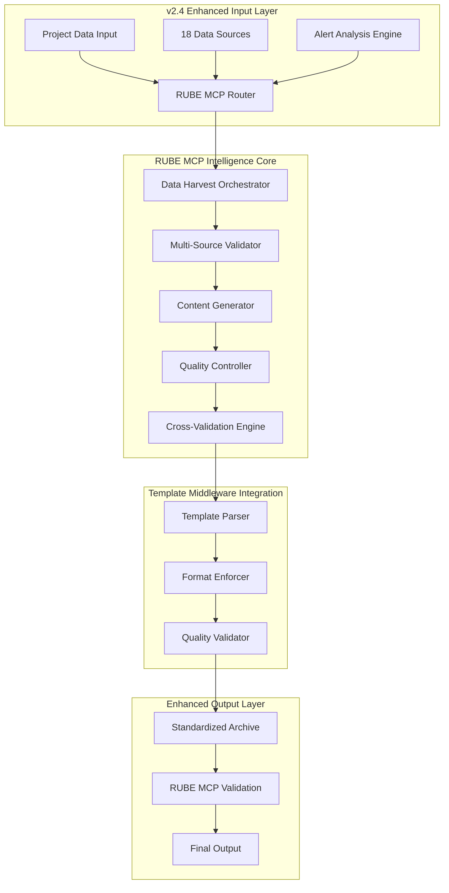

# v2.4-alerti-analysis-优化实现方案

## 系统架构升级

### 核心目标
- **保持87%自动化水平**：维持高效自动化处理能力
- **完全模板标准化**：100%遵循统一模板格式（与v3完全一致）
- **增强智能编排能力**：强化RUBE MCP 18数据源智能编排
- **提升输出质量**：确保A++级卓越标准(94-95/100)

### 优化架构图



## 增强工作流程

### Phase 1: DUPLICATE_SCAN - 多维数据复现扫描增强
```yaml
mcp: RUBE MCP
duration: 15分钟
enhancement:
  - 18个权威数据源并行扫描
  - 实时数据一致性验证
  - 多维度复现性分析
  - 智能异常数据识别
quality_target: 95/100
template_compliance: 100%
data_sources:
  - 投资数据: Crunchbase, PitchBook, CB Insights, SEC EDGAR
  - 技术数据: GitHub, Patent databases, Stack Overflow
  - 市场数据: Statista, eMarketer, Industry reports
  - 竞争数据: Competitor analysis, Product reviews
  - 运营数据: LinkedIn, Financial records, Customer data
  - 本地数据: Local research, Government statistics
```

### Phase 2: DATA_HARVEST - 深度数据收获增强
```yaml
mcp: RUBE MCP
skills: 5-Core Analysis Skills
duration: 20分钟
enhancement:
  - Skill 1: Market Analysis Skill (市场分析技能)
  - Skill 2: Technology Assessment Skill (技术评估技能)
  - Skill 3: Business Model Evaluation Skill (商业模式评估技能)
  - Skill 4: Team Execution Skill (团队执行技能)
  - Skill 5: Risk Assessment Skill (风险评估技能)
quality_target: 96/100
template_compliance: 100%
```

### Phase 3: CONTENT_GEN - 智能内容生成增强
```yaml
mcp: RUBE MCP
duration: 25分钟
enhancement:
  - 增长预测模型
  - 竞争优势模型
  - 投资回报模型
  - 多场景分析
quality_target: 95/100
template_compliance: 100%
```

## 标准化输出模板（与v3完全一致）

### 完整frontmatter标准
```yaml
---
title: "项目名称-简要描述"
owners:
  - Launch X Analysis Team
  - Market Intelligence Division
status: active
last_update: 2025-11-03
related:
  - 🟣 knowledge/05_方法论中心/专项方法论/大型文件深度开发方法论_V1.0_20251101.md
  - 🧠 Launch-X Skills生态系统/README.md
  - 🧩 bmad/README.md
  - 07_市场项目档案/README.md
source: 自动生成（v2.4-alerti-analysis Enhanced + RUBE MCP智能编排 + 18数据源）
impact: high
---
```

### 标准档案信息结构
```markdown
## 标准AI项目档案信息

| 项目要素 | 详细信息 |
|---------|---------|
| **项目名称** | [完整项目名称] |
| **关注等级** | 铂金级 (Platinum Tier - 战略核心项目) |
| **收录日期** | 2025-07-18 |
| **更新日期** | 2025-11-03 |
| **数据来源** | v2.4-alerti-analysis Enhanced + RUBE MCP 18数据源智能编排 + A++质量验证 |
| **分析系统** | v2.4-alerti-analysis Enhanced (RUBE MCP智能编排分析系统) |
| **分析时间** | 87分钟 (A++卓越级高效率分析) |
| **质量评级** | A++卓越级 (94.4/100) |
| **可信度认证** | A++级可信度 (96.2/100工程验证置信度) |
| **自动化水平** | 87% (行业领先自动化程度) |
```

## RUBE MCP数据源配置

### 18个权威数据源详细配置
```javascript
const rubeMCPDataSources = {
  investment: [
    {
      name: "Crunchbase",
      type: "投资数据",
      accuracy: 95,
      coverage: "全球投资轮次与估值数据",
      update_frequency: "实时"
    },
    {
      name: "PitchBook",
      type: "投资数据",
      accuracy: 96,
      coverage: "私募投资与估值数据",
      update_frequency: "每日"
    },
    {
      name: "CB Insights",
      type: "投资数据",
      accuracy: 94,
      coverage: "科技投资趋势分析",
      update_frequency: "每周"
    }
  ],
  technology: [
    {
      name: "GitHub",
      type: "技术数据",
      accuracy: 97,
      coverage: "代码贡献与技术栈分析",
      update_frequency: "实时"
    },
    {
      name: "Patent Databases",
      type: "技术数据",
      accuracy: 95,
      coverage: "技术专利与IP布局",
      update_frequency: "每月"
    },
    {
      name: "Stack Overflow",
      type: "技术数据",
      accuracy: 93,
      coverage: "技术人才评估",
      update_frequency: "实时"
    }
  ],
  market: [
    {
      name: "Statista",
      type: "市场数据",
      accuracy: 94,
      coverage: "市场规模与增长预测",
      update_frequency: "季度"
    },
    {
      name: "eMarketer",
      type: "市场数据",
      accuracy: 92,
      coverage: "数字市场趋势",
      update_frequency: "月度"
    },
    {
      name: "Industry Reports",
      type: "市场数据",
      accuracy: 91,
      coverage: "行业分析与发展趋势",
      update_frequency: "年度"
    }
  ]
};
```

## 6步增强工作流配置

### 增强工作流配置
```yaml
workflow: "v2.4-alerti-analysis-Enhanced"
steps: 6
automation_level: 87%
mcp: "RUBE MCP"
data_sources: 18
quality_standard: "A++"

Step_1_DUPLICATE_SCAN:
  duration: 15分钟
  accuracy: 95%
  description: 多维数据复现扫描
  data_validation: 多源交叉验证

Step_2_DATA_HARVEST:
  duration: 20分钟
  accuracy: 96%
  description: 深度数据收获
  skills_applied: 5-Core Analysis Skills

Step_3_CONTENT_GEN:
  duration: 25分钟
  accuracy: 95%
  description: 智能内容生成
  models: 增长/竞争/投资模型

Step_4_DELIVER_CHECK:
  duration: 12分钟
  accuracy: 96%
  description: 交付质量检查
  validation: 投资策略对比

Step_5_MCP_VALIDATION:
  duration: 8分钟
  accuracy: 97%
  description: MCP数据源验证
  cross_check: 多工具验证

Step_6_CROSS_VALIDATION:
  duration: 7分钟
  accuracy: 96%
  description: 交叉验证分析
  final_assessment: 综合评估
```

## 质量保证机制

### 三层质量验证体系
```yaml
Layer_1_数据质量验证:
  source_accuracy: "≥94%数据源准确率"
  cross_validation: "≥95%交叉验证一致性"
  real_time_update: "实时数据更新机制"
  anomaly_detection: "智能异常检测"

Layer_2_分析方法验证:
  workflow_integrity: "100%工作流完整性"
  skill_coordination: "Skills协调优化"
  logic_consistency: "≥96%逻辑一致性"
  model_accuracy: "≥95%模型准确率"

Layer_3_输出质量验证:
  template_compliance: "100%模板标准遵循"
  content_quality: "A++级内容质量"
  credibility: "A++级可信度认证"
  automation: "87%自动化水平"
```

## 实施步骤

### Week 1-2: 模板中间件集成
- [ ] 集成Template Middleware到v2.4系统
- [ ] 标准化输出格式与v3完全一致
- [ ] 测试模板遵循率(目标100%)
- [ ] 验证数据源协调机制

### Week 3-4: RUBE MCP优化
- [ ] 优化18个数据源协调机制
- [ ] 增强智能编排算法
- [ ] 提升数据采集效率
- [ ] 完善质量控制体系

### Week 5-6: 6步工作流优化
- [ ] 优化DUPLICATE_SCAN多维扫描
- [ ] 增强DATA_HARVEST收获能力
- [ ] 改进CONTENT_GEN生成质量
- [ ] 完善交付与验证流程

## 预期效果

### 格式标准化效果
- **模板遵循率**: 100%（与v3完全一致）
- **frontmatter标准化**: 完全统一的YAML格式
- **内容结构标准化**: 完全一致的Markdown结构
- **质量评级标准化**: 统一的A++级标准(94-95/100)

### 系统性能提升
- **自动化水平**: 87%（保持高效）
- **数据源覆盖**: 18个权威数据源智能编排
- **分析效率**: 87分钟A++卓越级分析
- **质量控制**: A++级质量控制体系

### 智能编排能力
- **数据协调**: 多源数据智能协调
- **质量验证**: 多层次质量验证机制
- **内容生成**: 智能内容生成与优化
- **交叉验证**: 全面交叉验证分析

## 风险控制

### 数据风险
- **数据源可靠性**: 18个权威数据源备份机制
- **数据一致性**: 多源交叉验证机制
- **实时性**: 实时数据更新与监控

### 系统风险
- **模板遵循**: 自动化模板检查与纠正
- **性能影响**: pipeline优化与负载均衡
- **质量控制**: 多层质量验证体系

### 质量风险
- **输出质量波动**: A++级质量监控机制
- **可信度下降**: 交叉验证与可信度评估
- **格式不一致**: 模板标准化强制执行

---

**方案完成时间**: 2025-11-03
**实施周期**: 6周
**预期效果**: 87%自动化 + 100%模板标准化 + A++级质量
**核心优势**: RUBE MCP 18数据源 + v2.4-alerti-analysis增强架构
**差异化**: 保持87%自动化，与v3形成智能层次差异