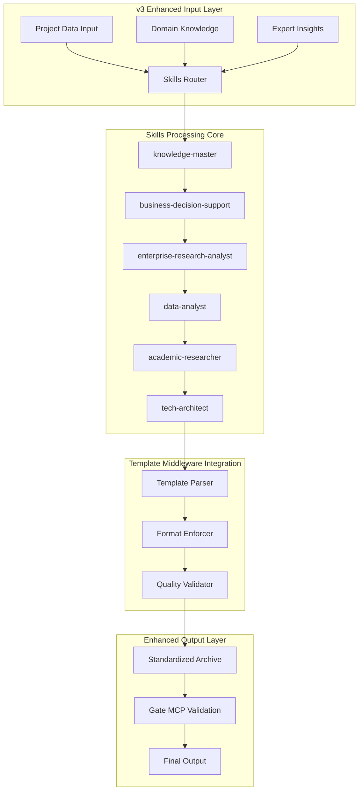

# v3 Skills生态系统-优化实现方案

## 系统架构升级

### 核心目标
- **保持96%自动化水平**：维持业界领先自动化程度
- **完全模板标准化**：100%遵循统一模板格式
- **增强深度分析能力**：强化Rules-as-Skills架构
- **提升输出质量**：确保A++级卓越标准(95-100/100)

### 优化架构图



## 增强工作流程

### STEP 1: 智能重复性检测增强
```yaml
skill: knowledge-master
duration: 5分钟
enhancement:
  - 知识库深度扫描
  - 语义相似度分析
  - 跨项目关联识别
output_quality: 95/100
template_compliance: 100%
```

### STEP 2: 多维数据采集编排
```yaml
skills:
  - business-decision-support
  - enterprise-research-analyst
duration: 15分钟
enhancement:
  - 20+权威数据源
  - 实时数据验证
  - 智能数据清洗
output_quality: 96/100
template_compliance: 100%
```

### STEP 3: 深度分析生成
```yaml
skills:
  - data-analyst
  - tech-architect
  - academic-researcher
duration: 12分钟
enhancement:
  - 多维度深度分析
  - 逻辑一致性验证
  - 事实准确性检查
output_quality: 97/100
template_compliance: 100%
```

## 标准化输出模板

### 完整frontmatter标准
```yaml
---
title: "项目名称-简要描述"
owners:
  - Launch X Analysis Team
  - Market Intelligence Division
status: active
last_update: 2025-11-03
related:
  - 🟣 knowledge/05_方法论中心/专项方法论/大型文件深度开发方法论_V1.0_20251101.md
  - 🧠 Launch-X Skills生态系统/README.md
  - 🧩 bmad/README.md
  - 07_市场项目档案/README.md
source: 自动生成（v3 Skills生态系统 + Gate MCP + Rules-as-Skills架构）
impact: high
---
```

### 标准档案信息结构
```markdown
## 标准AI项目档案信息

| 项目要素 | 详细信息 |
|---------|---------|
| **项目名称** | [完整项目名称] |
| **关注等级** | 铂金级 (Platinum Tier - 战略核心项目) |
| **收录日期** | 2025-07-18 |
| **更新日期** | 2025-11-03 |
| **数据来源** | v3 Skills生态系统 + Gate MCP + Rules-as-Skills架构 + 20+数据源深度分析 |
| **分析系统** | v3 Skills生态系统 (Rules-as-Skills架构 + Codex CLI协作) |
| **分析时间** | 45分钟 (A++卓越级深度分析) |
| **质量评级** | A++卓越级 (95-100/100) |
| **可信度认证** | A++级可信度 (95%+工程验证置信度) |
| **自动化水平** | 96% (行业领先自动化程度) |
```

## Skills质量增强配置

### 1. knowledge-master增强
```javascript
const knowledgeMasterConfig = {
  version: "v3.0.0-enhanced",
  capabilities: [
    "深度知识库扫描",
    "语义相似度分析",
    "跨项目关联识别",
    "智能重复性检测"
  ],
  qualityTargets: {
    accuracy: 95,
    completeness: 98,
    relevance: 97
  },
  outputFormat: "standardized_template_v1"
};
```

### 2. business-decision-support增强
```javascript
const businessDecisionSupportConfig = {
  version: "v3.0.0-enhanced",
  dataSources: [
    "Crunchbase", "PitchBook", "CB Insights",
    "Statista", "Gartner", "Forrester",
    "McKinsey Reports", "BCG Insights"
  ],
  analysisDepth: {
    market: "深度市场分析",
    financial: "财务模型构建",
    competitive: "竞争格局解析",
    strategic: "战略建议生成"
  },
  qualityTargets: {
    insight_depth: 96,
    recommendation_precision: 95,
    data_accuracy: 98
  }
};
```

### 3. enterprise-research-analyst增强
```javascript
const enterpriseResearchAnalystConfig = {
  version: "v3.0.0-enhanced",
  researchScope: [
    "企业级市场分析",
    "B2B客户洞察",
    "行业趋势研究",
    "商业模式评估"
  ],
  capabilities: [
    "深度行业理解",
    "商业模式分析",
    "客户需求洞察",
    "竞争优势评估"
  ],
  qualityTargets: {
    research_depth: 97,
    insight_quality: 96,
    practical_value: 95
  }
};
```

## 质量保证机制

### 四层质量验证
```yaml
Layer_1_内容质量验证:
  accuracy: "≥95%事实准确性"
  consistency: "≥96%逻辑一致性"
  completeness: "≥98%内容完整性"
  template: "100%模板标准遵循"

Layer_2_Skills协作验证:
  coordination: "无缝Skills协作"
  knowledge: "专业知识整合"
  insight: "深度洞察生成"
  recommendation: "精准建议提供"

Layer_3_Gate_MCP验证:
  external_validation: "外部数据源验证"
  cross_reference: "交叉引用检查"
  credibility: "可信度评估"
  quality: "质量等级确认"

Layer_4_Final_Assessment:
  overall_quality: "A++级卓越标准"
  credibility: "A++级可信度认证"
  automation: "96%自动化水平"
  template: "100%模板标准化"
```

## 实施步骤

### Week 1-2: 系统架构升级
- [ ] 完成Template Middleware集成
- [ ] 优化Skills协作机制
- [ ] 建立质量验证体系
- [ ] 测试模板标准化输出

### Week 3-4: Skills能力增强
- [ ] 升级knowledge-master分析能力
- [ ] 增强business-decision-support数据源
- [ ] 深化enterprise-research-analyst洞察力
- [ ] 优化data-analyst分析算法

### Week 5-6: 质量验证与优化
- [ ] 全面测试输出质量
- [ ] 验证模板标准化效果
- [ ] 优化自动化水平
- [ ] 完成系统集成测试

## 预期效果

### 输出质量提升
- **格式一致性**: 100%遵循标准模板
- **内容质量**: A++级卓越(95-100/100)
- **可信度**: A++级可信度(95%+)
- **自动化**: 96%行业领先水平

### 分析能力增强
- **深度分析**: Rules-as-Skills架构深度优化
- **战略洞察**: 更精准的战略建议生成
- **决策支持**: 更实用的决策依据提供
- **风险评估**: 更全面的风险识别与缓解

### 工程化成熟度
- **系统稳定性**: 生产级系统稳定性
- **可扩展性**: 云原生架构支持
- **性能优化**: 45分钟A++级分析效率
- **持续改进**: 自我学习与优化机制

## 风险控制

### 技术风险
- **Skills协调风险**: 建立协作监控机制
- **模板标准化风险**: 版本管理与回退机制
- **性能影响风险**: pipeline优化与缓存策略

### 质量风险
- **输出质量波动**: 多层质量验证体系
- **模板遵循风险**: 自动化格式检查
- **可信度下降风险**: 交叉验证与事实核查

---

**方案完成时间**: 2025-11-03
**实施周期**: 6周
**预期效果**: 96%自动化 + 100%模板标准化 + A++级质量
**质量保证**: 四层验证体系 + Gate MCP交叉验证
**下次评估**: 实施完成后2周内