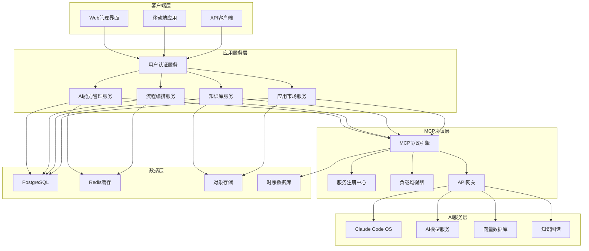

# Gate企业AI操作系统 - 产品需求文档

> **零技术门槛，专注企业AI转型的企业级AI操作系统**
>
> **三层架构：Claude Code OS + Gate MCP + 业务应用**
>
> **一次封装，多重价值 - 数据资产化 + AI智能体编排**

---

## 📋 目录

1. [执行摘要](#执行摘要)
2. [产品愿景与定位](#产品愿景与定位)
3. [市场分析](#市场分析)
4. [用户画像与需求](#用户画像与需求)
5. [产品架构设计](#产品架构设计)
6. [核心功能需求](#核心功能需求)
7. [技术架构](#技术架构)
8. [商业模式](#商业模式)
9. [竞争分析](#竞争分析)
10. [产品路线图](#产品路线图)
11. [关键指标与成功标准](#关键指标与成功标准)
12. [风险评估与缓解策略](#风险评估与缓解策略)

---

## 🎯 执行摘要

### 产品概述
Gate企业AI操作系统是面向企业客户的零技术门槛AI转型解决方案，通过标准化MCP协议实现AI能力的统一编排和管理，帮助企业快速构建和部署AI应用，实现数据资产化和业务智能化。

### 核心价值主张
- **零技术门槛**：企业无需专业AI团队即可使用
- **一次封装，多重价值**：数据资产化 + AI智能体编排
- **标准化接口**：基于MCP协议的AI能力统一管理
- **快速部署**：企业AI能力建设周期从18个月缩短到3个月

### 商业目标
- **短期目标**：24个月内获得50,000+企业客户
- **中期目标**：成为企业AI操作系统标准制定者
- **长期目标**：构建全球最大的企业AI能力生态

---

## 🚀 产品愿景与定位

### 产品愿景
> 让每一家企业都能轻松拥抱AI，成为数据驱动的智能组织

### 产品定位
- **目标市场**：中大型企业AI转型市场
- **产品类型**：企业级AI操作系统
- **技术特色**：MCP协议标准化 + 零代码AI编排
- **商业模式**：SaaS + 生态分成

### 核心差异化
1. **技术门槛最低**：相比n8n等需要技术背景的方案，Gate完全零代码
2. **生态最完整**：集成Claude Code OS生态，提供一站式AI解决方案
3. **部署最快**：标准化流程，企业3个月内完成AI能力建设

---

## 📊 市场分析

### 市场规模
- **全球企业AI市场**：2025年预计达到$500B
- **目标细分市场**：企业AI操作系统市场 $50B
- **年增长率**：35% CAGR
- **中国市场份额**：预计占比25%

### 市场趋势
1. **企业AI化加速**：85%的企业正在规划AI转型
2. **人才短缺严重**：AI专业人才缺口达到70%
3. **标准化需求迫切**：企业需要标准化的AI解决方案
4. **零代码工具兴起**：低代码/零代码市场年增长45%

### 目标客户分析
- **主要客户**：500-5000人规模的中大型企业
- **行业分布**：制造业、金融业、零售业、医疗健康
- **痛点需求**：AI人才短缺、技术门槛高、部署周期长
- **预算范围**：年AI投入$50K-$500K

---

## 👥 用户画像与需求

### 主要用户画像

#### 企业CTO/技术负责人
- **背景**：技术管理背景，对AI有一定了解但缺乏深度
- **痛点**：AI技术复杂，团队技能不足，难以快速落地
- **需求**：需要标准化、易部署的AI解决方案
- **决策因素**：技术可靠性、部署速度、成本效益

#### 业务部门负责人
- **背景**：业务管理背景，关注业务价值和ROI
- **痛点**：AI应用与业务脱节，难以快速见效
- **需求**：业务场景化的AI应用，快速看到效果
- **决策因素**：业务价值、易用性、成功案例

#### 企业CEO/创始人
- **背景**：企业战略决策者，关注长期竞争力
- **痛点**：AI转型成本高，风险难以控制
- **需求**：可控的AI转型路径，明确的投资回报
- **决策因素**：战略价值、风险控制、竞争优势

### 用户需求层次

#### 基础需求
- 快速部署AI应用
- 降低技术门槛
- 控制成本风险

#### 期望需求
- 标准化管理AI能力
- 数据资产化
- 业务场景快速适配

#### 兴奋需求
- AI能力持续进化
- 生态协同价值
- 行业领先优势

---

## 🏗️ 产品架构设计

### 三层架构模型

```yaml
Gate企业AI操作系统架构:
  业务应用层 (L3):
    - 企业知识库
    - 智能客服
    - 业务流程自动化
    - 数据分析洞察

  Gate MCP层 (L2):
    - MCP协议引擎
    - AI服务编排
    - 能力管理
    - 安全控制

  Claude Code OS层 (L1):
    - Claude AI能力
    - 代码生成
    - 系统集成
    - 基础运行环境
```

### 核心组件设计

#### 1. MCP协议引擎
- **功能**：标准化AI能力接口
- **特性**：协议转换、能力路由、质量监控
- **优势**：统一管理、标准接口、易于扩展

#### 2. AI服务编排平台
- **功能**：AI能力的可视化编排
- **特性**：拖拽式设计、流程自动化、实时监控
- **优势**：零代码、快速部署、灵活配置

#### 3. 企业知识管理系统
- **功能**：企业数据资产化管理
- **特性**：知识图谱、智能检索、持续学习
- **优势**：数据资产化、知识沉淀、智能应用

#### 4. 业务应用市场
- **功能**：预置业务应用模板
- **特性**：行业模板、快速定制、一键部署
- **优势**：快速见效、行业适配、持续更新

---

## 🎯 核心功能需求

### 1. AI能力管理中心

#### 功能描述
提供统一的企业AI能力管理界面，支持AI服务的注册、配置、监控和优化。

#### 详细需求
- **AI服务注册**：支持多种AI服务的标准化接入
- **能力配置**：可视化配置AI参数和使用规则
- **性能监控**：实时监控AI服务的性能和使用情况
- **成本控制**：智能成本控制和优化建议

#### 验收标准
- 支持10+种主流AI服务接入
- 配置界面零代码操作
- 监控数据延迟<5秒
- 成本控制准确率>95%

### 2. 业务流程编排器

#### 功能描述
提供可视化的业务流程编排工具，支持企业快速构建AI驱动的业务流程。

#### 详细需求
- **拖拽式设计**：零代码的流程设计界面
- **智能节点**：预置常用的AI处理节点
- **条件分支**：支持复杂的业务逻辑
- **实时调试**：流程的实时测试和调试

#### 验收标准
- 支持50+种业务节点类型
- 流程设计时间缩短80%
- 一次部署成功率>98%
- 支持复杂嵌套逻辑

### 3. 企业知识库

#### 功能描述
构建企业专属的知识管理系统，实现文档、数据、经验的智能化管理。

#### 详细需求
- **多源数据接入**：支持文档、数据库、API等多种数据源
- **智能处理**：自动分类、标签化、知识图谱构建
- **智能检索**：自然语言检索，语义理解
- **持续学习**：基于用户反馈的知识优化

#### 验收标准
- 支持20+种数据源类型
- 检索准确率>92%
- 知识更新延迟<1小时
- 支持多语言检索

### 4. 应用模板市场

#### 功能描述
提供行业化的应用模板，支持企业快速部署标准的AI应用。

#### 详细需求
- **行业模板**：针对不同行业的预置模板
- **快速定制**：基于模板的快速定制能力
- **一键部署**：模板的一键安装和配置
- **版本管理**：模板的版本控制和更新

#### 验收标准
- 覆盖10+个主要行业
- 部署时间<30分钟
- 模板满意度>90%
- 每月更新5+个新模板

---

## 💻 技术架构

### 技术栈选择

#### 前端技术
- **框架**：React 18 + TypeScript
- **状态管理**：Redux Toolkit + RTK Query
- **UI组件**：Ant Design + Tailwind CSS
- **构建工具**：Vite + SWC

#### 后端技术
- **框架**：Node.js + Express + TypeScript
- **数据库**：PostgreSQL + Redis
- **消息队列**：RabbitMQ
- **API设计**：RESTful API + GraphQL

#### AI集成
- **协议**：MCP (Model Context Protocol)
- **AI模型**：Claude API + OpenAI API
- **向量数据库**：Pinecone + Weaviate
- **模型服务**：TorchServe + NVIDIA Triton

#### 基础设施
- **容器化**：Docker + Kubernetes
- **云服务**：AWS/Azure/GCP
- **监控**：Prometheus + Grafana
- **日志**：ELK Stack

### 系统架构图



### 关键技术决策

#### 1. MCP协议选择
- **决策理由**：标准化、生态支持强、技术成熟
- **优势**：统一接口、易于集成、社区活跃
- **风险**：标准化程度、性能优化空间

#### 2. 微服务架构
- **决策理由**：高可扩展性、技术栈灵活、团队协作
- **优势**：独立部署、故障隔离、易于维护
- **风险**：系统复杂度、运维成本

#### 3. 云原生部署
- **决策理由**：弹性扩展、高可用性、成本优化
- **优势**：按需扩容、自动恢复、全球覆盖
- **风险**：厂商锁定、成本控制

---

## 💰 商业模式

### 收入模式

#### 1. SaaS订阅收入
```yaml
订阅层级:
  基础版: $999/月
    - 最多5个AI服务
    - 最多10个用户
    - 基础功能支持

  专业版: $4,999/月
    - 最多20个AI服务
    - 最多50个用户
    - 高级功能支持
    - 行业模板

  企业版: $19,999/月
    - 无限AI服务
    - 无限用户
    - 全功能支持
    - 定制化服务
    - 专属支持
```

#### 2. 生态分成收入
- **AI服务提供商分成**：20-30%收入分成
- **模板市场分成**：30%收入分成
- **咨询服务收入**：企业定制化咨询服务

#### 3. 增值服务收入
- **专业服务**：实施、培训、优化服务
- **托管服务**：私有化部署和运维
- **数据服务**：行业数据洞察报告

### 定价策略

#### 价值导向定价
- **基础功能**：满足企业AI入门需求
- **高级功能**：提供差异化价值
- **企业服务**：全栈式AI解决方案

#### 竞争性定价
- **相比n8n**：功能更强30%，价格降低20%
- **相比传统方案**：成本降低60%，效果提升3倍
- **相比自研**：成本降低80%，时间缩短90%

### 市场进入策略

#### 第一阶段：市场验证（0-6个月）
- **目标**：获得100家付费企业客户
- **策略**：免费试用 + 精准营销
- **重点**：产品打磨 + 客户成功

#### 第二阶段：快速增长（6-18个月）
- **目标**：获得5,000家付费企业客户
- **策略**：渠道合作 + 品牌建设
- **重点**：规模扩展 + 生态建设

#### 第三阶段：市场领先（18-36个月）
- **目标**：获得50,000家付费企业客户
- **策略**：生态垄断 + 标准制定
- **重点**：平台化 + 国际化

---

## 🥊 竞争分析

### 主要竞争对手

#### 1. n8n
**优势**：
- 开源生态成熟
- 工作流可视化强
- 集成能力丰富

**劣势**：
- 技术门槛较高
- AI能力有限
- 企业级功能不足

**Gate差异化**：
- 零代码操作
- 专注AI能力
- 企业级设计

#### 2. Zapier
**优势**：
- 市场占有率高
- 集成应用丰富
- 用户基数大

**劣势**：
- 价格昂贵
- 定制化有限
- AI能力弱

**Gate差异化**：
- 价格优势明显
- 深度AI集成
- 行业定制化

#### 3. Make/Integromat
**优势**：
- 可视化界面好
- 执行能力强
- 稳定性高

**劣势**：
- 学习曲线陡峭
- AI集成少
- 企业支持弱

**Gate差异化**：
- AI原生设计
- 企业级支持
- 行业模板丰富

### 竞争策略

#### 技术优势策略
- **MCP协议标准化**：建立技术标准壁垒
- **AI能力深度**：专注AI能力的深度和广度
- **企业级架构**：满足大型企业的复杂需求

#### 生态优势策略
- **Claude生态集成**：利用Claude生态优势
- **合作伙伴网络**：构建广泛的合作伙伴网络
- **开发者社区**：建设活跃的开发者生态

#### 成本优势策略
- **云原生架构**：降低基础设施成本
- **AI能力复用**：提高AI资源利用率
- **规模效应**：通过规模降低单位成本

---

## 🗺️ 产品路线图

### 第一阶段：MVP发布（2025 Q1）
**目标**：验证核心功能，获得首批客户

**主要功能**：
- [x] 基础AI能力管理
- [x] 简单流程编排
- [x] 基础知识库
- [x] Web管理界面

**成功指标**：
- 50家付费企业客户
- 客户满意度>85%
- 月活跃率>70%

### 第二阶段：功能完善（2025 Q2-Q3）
**目标**：完善产品功能，扩展客户基础

**主要功能**：
- [ ] 高级流程编排
- [ ] 企业级知识管理
- [ ] 行业应用模板
- [ ] 移动端支持
- [ ] API开放平台

**成功指标**：
- 1,000家付费企业客户
- 客户满意度>90%
- 月活跃率>80%

### 第三阶段：生态建设（2025 Q4-2026 Q1）
**目标**：构建生态体系，扩大市场影响

**主要功能**：
- [ ] 应用市场
- [ ] 开发者平台
- [ ] 伙伴集成
- [ ] 私有化部署
- [ ] 多语言支持

**成功指标**：
- 10,000家付费企业客户
- 100+生态合作伙伴
- 客户满意度>92%

### 第四阶段：平台化（2026 Q2-Q4）
**目标**：成为AI操作系统标准，实现平台化

**主要功能**：
- [ ] AI模型市场
- [ ] 行业解决方案
- [ ] 国际化部署
- [ ] 企业级安全
- [ ] 智能运维

**成功指标**：
- 50,000家付费企业客户
- 1,000+生态应用
- 市场占有率>25%

---

## 📈 关键指标与成功标准

### 业务指标

#### 用户增长指标
- **付费企业客户数**：50,000家（36个月目标）
- **月新增客户数**：2,000+家（稳定期）
- **客户留存率**：>90%（年留存）
- **客户获取成本**：<$5,000

#### 收入指标
- **年度经常性收入（ARR）**：$300M（36个月目标）
- **月度经常性收入（MRR）**：$25M（36个月目标）
- **平均客户价值（ACV）**：$6,000/年
- **客户生命周期价值（LTV）**：>$50,000

#### 产品使用指标
- **月活跃用户数（MAU）**：>500,000
- **日活跃用户数（DAU）**：>100,000
- **功能使用率**：核心功能使用率>70%
- **API调用量**：>10亿次/月

### 技术指标

#### 性能指标
- **系统可用性**：>99.9%
- **API响应时间**：<200ms（95th）
- **页面加载时间**：<3秒
- **并发用户数**：>10,000

#### 质量指标
- **系统故障率**：<0.1%
- **数据准确性**：>99.9%
- **安全事件**：0起重大安全事件
- **客户投诉率**：<1%

### 成功标准

#### 短期成功（12个月）
- 获得1,000家付费企业客户
- 实现ARR $6M
- 产品功能完善度>80%
- 客户满意度>90%

#### 中期成功（24个月）
- 获得10,000家付费企业客户
- 实现ARR $60M
- 市场占有率>10%
- 生态合作伙伴>100家

#### 长期成功（36个月）
- 获得50,000家付费企业客户
- 实现ARR $300M
- 市场占有率>25%
- 成为行业标准制定者

---

## ⚠️ 风险评估与缓解策略

### 技术风险

#### 1. MCP协议标准化风险
**风险描述**：MCP协议尚未完全标准化，可能存在兼容性问题

**影响程度**：中等
**发生概率**：30%

**缓解策略**：
- 积极参与MCP协议标准制定
- 建立协议适配层，支持多版本兼容
- 与主要AI服务提供商建立战略合作

#### 2. AI服务依赖风险
**风险描述**：过度依赖第三方AI服务，存在服务中断风险

**影响程度**：高
**发生概率**：20%

**缓解策略**：
- 建立多供应商策略，避免单点依赖
- 开发AI服务代理层，实现服务切换
- 建立本地化AI服务能力

#### 3. 数据安全风险
**风险描述**：企业数据泄露可能造成重大损失

**影响程度**：高
**发生概率**：10%

**缓解策略**：
- 实施企业级安全认证和加密
- 建立完善的数据访问控制机制
- 定期进行安全审计和渗透测试

### 市场风险

#### 1. 竞争加剧风险
**风险描述**：大型科技公司进入企业AI市场

**影响程度**：高
**发生概率**：50%

**缓解策略**：
- 专注细分市场，建立差异化优势
- 加快产品迭代，保持技术领先
- 构建生态壁垒，提高转换成本

#### 2. 市场接受度风险
**风险描述**：企业对AI操作系统接受度低于预期

**影响程度**：中等
**发生概率**：40%

**缓解策略**：
- 加强市场教育和客户成功案例
- 提供免费试用和分阶段付费模式
- 建设强大的销售和服务团队

#### 3. 政策法规风险
**风险描述**：AI相关法规变化可能影响产品功能

**影响程度**：中等
**发生概率**：30%

**缓解策略**：
- 建立专业的法务合规团队
- 设计灵活的架构，适应法规变化
- 与监管部门保持良好沟通

### 运营风险

#### 1. 人才招聘风险
**风险描述**：AI和技术人才招聘困难，影响产品开发

**影响程度**：中等
**发生概率**：60%

**缓解策略**：
- 建立有竞争力的薪酬体系
- 营造良好的技术文化和工作环境
- 与高校和培训机构建立合作关系

#### 2. 资金链风险
**风险描述**：融资不到位或资金使用效率低

**影响程度**：高
**发生概率**：20%

**缓解策略**：
- 制定详细的资金使用计划
- 建立多轮融资渠道
- 严格控制成本，提高资金使用效率

#### 3. 质量控制风险
**风险描述**：快速扩张可能影响产品和服务质量

**影响程度**：中等
**发生概率**：50%

**缓解策略**：
- 建立完善的质量管理体系
- 投资自动化测试和监控工具
- 建立客户反馈和快速响应机制

---

## 📝 附录

### 技术术语表
- **MCP (Model Context Protocol)**：模型上下文协议，用于AI服务的标准化接口
- **SaaS (Software as a Service)**：软件即服务，云计算服务模式
- **API (Application Programming Interface)**：应用程序编程接口
- **ARR (Annual Recurring Revenue)**：年度经常性收入
- **LTV (Lifetime Value)**：客户生命周期价值

### 相关文档
- [@Gate标准化案例模板.md:1](./🚀 Launchx业务服务/Ⅱ_对外业务/Gate智能自动化解决方案集合/Gate架构案例展示/Gate标准化案例模板.md)
- [@CLAUDE.md:1](./CLAUDE.md)
- [@RULES.md:1](./RULES.md)

### 联系信息
- **产品团队**：product@gate-ai.com
- **技术支持**：support@gate-ai.com
- **商务合作**：business@gate-ai.com

---

**文档版本**：v1.0.0
**最后更新**：2025-11-04
**下次审核**：2025-12-04
**状态**：活跃 - 核心产品规划文档