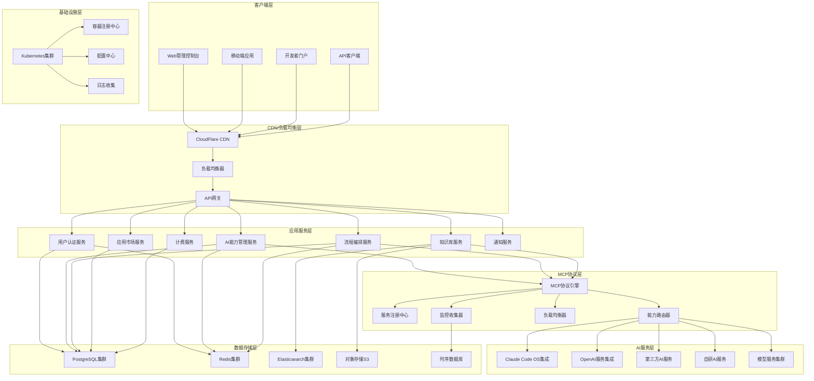

# Gate企业AI操作系统 - 技术架构设计

> **三层架构：Claude Code OS + Gate MCP + 业务应用**
>
> **云原生、微服务、API优先的现代化企业级架构**

---

## 📋 目录

1. [架构概述](#架构概述)
2. [系统架构设计](#系统架构设计)
3. [技术栈选择](#技术栈选择)
4. [核心组件设计](#核心组件设计)
5. [数据架构设计](#数据架构设计)
6. [安全架构设计](#安全架构设计)
7. [部署架构设计](#部署架构设计)
8. [性能与扩展性设计](#性能与扩展性设计)
9. [监控与运维设计](#监控与运维设计)
10. [技术决策与权衡](#技术决策与权衡)

---

## 🏗️ 架构概述

### 设计原则

#### 企业级架构原则
```yaml
高可用性 (High Availability):
  - 系统可用性目标: 99.9%
  - 故障自动恢复时间: <5分钟
  - 数据一致性保证: 强一致性
  - 灾难恢复能力: RTO<1小时, RPO<15分钟

高扩展性 (High Scalability):
  - 水平扩展能力: 无限制
  - 垂直扩展能力: 支持
  - 弹性伸缩能力: 自动化
  - 性能线性增长: >90%

高安全性 (High Security):
  - 数据加密: 传输+存储
  - 身份认证: 多因子认证
  - 访问控制: RBAC+ABAC
  - 安全审计: 全链路追踪

高可维护性 (High Maintainability):
  - 模块化设计: 松耦合
  - 标准化接口: RESTful+GraphQL
  - 自动化运维: DevOps
  - 文档完整性: 100%覆盖
```

#### 云原生架构原则
```yaml
容器化 (Containerization):
  - 应用容器化: 100%
  - 微服务架构: 服务拆分
  - 编排管理: Kubernetes
  - 镜像管理: 标准化流程

API优先 (API First):
  - API设计优先: OpenAPI 3.0
  - 文档驱动: 自动生成
  - 版本管理: 语义化版本
  - 向后兼容: 保证支持

微服务架构 (Microservices):
  - 服务边界清晰: 业务驱动
  - 数据库分离: 每服务独立
  - 异步通信: 事件驱动
  - 故障隔离: 服务级隔离

DevOps文化 (DevOps Culture):
  - CI/CD流水线: 自动化
  - 基础设施即代码: IaC
  - 监控告警: 实时响应
  - 持续改进: 数据驱动
```

### 架构演进路线

#### 第一阶段：MVP架构 (2025 Q1)
```yaml
架构特点:
  - 单体应用架构
  - 简化技术栈
  - 快速原型验证
  - 核心功能优先

技术栈:
  - 前端: React + TypeScript
  - 后端: Node.js + Express
  - 数据库: PostgreSQL
  - 部署: 单机部署

目标: 验证产品核心价值，获得首批用户反馈
```

#### 第二阶段：微服务化 (2025 Q2-Q3)
```yaml
架构特点:
  - 微服务架构
  - 服务拆分
  - API网关
  - 服务注册发现

技术栈:
  - 服务框架: Node.js + Fastify
  - 服务通信: REST + gRPC
  - 配置管理: Apollo
  - 服务治理: Istio

目标: 支持业务扩展，提升系统可维护性
```

#### 第三阶段：云原生化 (2025 Q4-2026 Q1)
```yaml
架构特点:
  - 容器化部署
  - Kubernetes编排
  - 自动化运维
  - 多云支持

技术栈:
  - 容器运行时: Docker
  - 编排平台: Kubernetes
  - 服务网格: Istio
  - 监控系统: Prometheus

目标: 实现云原生架构，支持大规模部署
```

#### 第四阶段：智能化 (2026 Q2+)
```yaml
架构特点:
  - AI驱动运维
  - 自适应架构
  - 智能优化
  - 预测性维护

技术栈:
  - AIOps平台: 自研
  - 机器学习: TensorFlow
  - 时序数据库: InfluxDB
  - 智能监控: 自研

目标: 实现智能化运维，提升系统效率
```

---

## 🏛️ 系统架构设计

### 整体架构图



### 分层架构详解

#### 1. 客户端层 (Client Layer)
```yaml
Web管理控制台:
  - 技术栈: React 18 + TypeScript + Ant Design
  - 功能: AI能力管理、流程编排、知识库管理
  - 特性: 响应式设计、实时更新、拖拽操作
  - 部署: CDN + 静态托管

移动端应用:
  - 技术栈: React Native + TypeScript
  - 功能: 移动端管理、消息推送、离线操作
  - 特性: 原生体验、离线支持、生物识别
  - 部署: App Store + Google Play

开发者门户:
  - 技术栈: Next.js + TypeScript + MDX
  - 功能: API文档、SDK下载、开发工具
  - 特性: 交互式文档、代码示例、在线调试
  - 部署: Vercel + CDN

API客户端:
  - 技术栈: TypeScript + Axios + OpenAPI Generator
  - 功能: 多语言SDK、CLI工具、示例代码
  - 特性: 类型安全、自动生成、完整文档
  - 分发: npm + GitHub + 官网
```

#### 2. API网关层 (API Gateway Layer)
```yaml
API网关核心功能:
  - 路由转发: 基于路径、方法、头信息
  - 认证授权: JWT + OAuth2 + RBAC
  - 限流熔断: 令牌桶 + 熔断器
  - 监控日志: 请求追踪 + 性能监控
  - 缓存策略: 多级缓存 + 智能失效
  - 协议转换: REST ↔ GraphQL ↔ gRPC

技术实现:
  - 网关框架: Kong + 自研插件
  - 配置管理: 声明式配置 + GitOps
  - 服务发现: Consul + 健康检查
  - 负载均衡: 一致性哈希 + 健康检查
  - 安全防护: WAF + DDoS防护

性能指标:
  - 吞吐量: 100,000 RPS
  - 延迟: P99 < 100ms
  - 可用性: 99.99%
  - 并发连接: 1,000,000
```

#### 3. 应用服务层 (Application Service Layer)
```yaml
用户认证服务:
  - 功能: 用户管理、身份认证、权限控制
  - 技术栈: Node.js + Fastify + JWT
  - 数据库: PostgreSQL + Redis
  - 特性: 多因子认证、SSO、RBAC

AI能力管理服务:
  - 功能: AI服务注册、配置管理、监控
  - 技术栈: Node.js + TypeScript + gRPC
  - 数据库: PostgreSQL + Redis
  - 特性: 服务发现、负载均衡、故障恢复

流程编排服务:
  - 功能: 可视化编排、流程执行、状态管理
  - 技术栈: Node.js + Workflow Engine
  - 数据库: PostgreSQL + Redis
  - 特性: 拖拽设计、实时调试、版本控制

知识库服务:
  - 功能: 文档管理、知识检索、智能问答
  - 技术栈: Python + FastAPI + Elasticsearch
  - 数据库: PostgreSQL + Elasticsearch
  - 特性: 全文检索、语义搜索、知识图谱

应用市场服务:
  - 功能: 应用发布、版本管理、付费分发
  - 技术栈: Node.js + TypeScript
  - 数据库: PostgreSQL + 对象存储
  - 特性: 审核流程、支付集成、使用统计

计费服务:
  - 功能: 订阅管理、用量统计、账单生成
  - 技术栈: Node.js + TypeScript
  - 数据库: PostgreSQL + 时序数据库
  - 特性: 实时计费、多种支付、财务报表

通知服务:
  - 功能: 消息推送、邮件通知、短信提醒
  - 技术栈: Node.js + TypeScript
  - 数据库: PostgreSQL + 消息队列
  - 特性: 多渠道、模板化、批量发送
```

#### 4. MCP协议层 (MCP Protocol Layer)
```yaml
MCP协议引擎:
  - 功能: 协议解析、消息路由、格式转换
  - 技术栈: Rust + Tokio + gRPC
  - 特性: 高性能、类型安全、并发处理
  - 性能: 1,000,000 TPS

服务注册中心:
  - 功能: 服务注册、发现、健康检查
  - 技术栈: Consul + 自研扩展
  - 特性: 多数据中心、故障转移、配置管理
  - 可用性: 99.99%

能力路由器:
  - 功能: 智能路由、负载均衡、故障转移
  - 技术栈: Go + 自研算法
  - 特性: 动态路由、权重调节、健康检查
  - 性能: 500,000 RPS

监控收集器:
  - 功能: 指标收集、日志聚合、链路追踪
  - 技术栈: OpenTelemetry + Prometheus
  - 特性: 多语言支持、实时处理、长期存储
  - 吞吐量: 10GB/分钟
```

#### 5. AI服务层 (AI Service Layer)
```yaml
Claude Code OS集成:
  - 功能: Claude API集成、代码生成、系统分析
  - 技术栈: Python + Anthropic SDK
  - 特性: 异步调用、批量处理、缓存优化
  - 性能: P95 < 2秒

OpenAI服务集成:
  - 功能: GPT模型集成、多模态处理、微调服务
  - 技术栈: Python + OpenAI SDK
  - 特性: 模型选择、参数调优、结果优化
  - 性能: P95 < 5秒

第三方AI服务:
  - 功能: 多厂商集成、统一接口、服务质量监控
  - 技术栈: 多语言适配器 + 统一SDK
  - 特性: 自动切换、负载均衡、质量评估
  - 覆盖: 20+ AI服务商

自研AI服务:
  - 功能: 专用模型、行业解决方案、定制化服务
  - 技术栈: PyTorch + TensorFlow + FastAPI
  - 特性: 模型训练、推理服务、持续优化
  - 部署: GPU集群 + 容器化

模型服务集群:
  - 功能: 模型推理、批量处理、实时服务
  - 技术栈: TorchServe + NVIDIA Triton
  - 特性: 多模型支持、自动扩缩、版本管理
  - 性能: 100,000 QPS
```

---

## 🛠️ 技术栈选择

### 前端技术栈

#### 核心框架选择
```yaml
React 18 + TypeScript:
  选择理由:
    - 成熟稳定的企业级框架
    - 强类型支持，减少运行时错误
    - 丰富的生态系统和社区支持
    - 优秀的开发工具链

替代方案对比:
  - Vue.js: 学习曲线更平缓，但生态较小
  - Angular: 功能完整但学习成本高
  - Svelte: 性能优秀但生态不够成熟

具体技术选型:
  - 状态管理: Redux Toolkit + RTK Query
  - UI组件库: Ant Design + Tailwind CSS
  - 构建工具: Vite + SWC
  - 路由管理: React Router v6
  - 表单处理: React Hook Form + Zod
  - 图表组件: ECharts + D3.js
  - 代码编辑器: Monaco Editor
```

#### 移动端技术栈
```yaml
React Native + TypeScript:
  选择理由:
    - 与Web端技术栈统一
    - 原生性能体验
    - 热更新支持
    - 丰富的第三方库

关键组件:
  - 导航: React Navigation
  - 状态管理: Redux Toolkit
  - UI组件: React Native Elements
  - 网络: Axios + AsyncStorage
  - 图表: Victory Native
  - 推送: React Native Firebase
```

### 后端技术栈

#### 主要服务框架
```yaml
Node.js + TypeScript + Fastify:
  选择理由:
    - 高性能异步I/O
    - 与前端技术栈统一
    - 丰富的生态系统
    - 优秀的TypeScript支持

替代方案对比:
  - Go: 性能更优但生态较小
  - Java: 企业级成熟但开发效率低
  - Python: AI生态好但性能较差
  - Rust: 性能极佳但学习成本高

关键组件:
  - Web框架: Fastify
  - ORM: Prisma
  - 数据验证: Zod
  - 日志: Pino
  - 测试: Jest + Supertest
  - 文档: Swagger/OpenAPI
```

#### 微服务支持技术
```yaml
服务通信:
  - 同步通信: gRPC + RESTful API
  - 异步通信: RabbitMQ + Apache Kafka
  - 配置管理: Apollo + Consul
  - 服务发现: Consul + etcd
  - 负载均衡: Nginx + HAProxy
  - API网关: Kong + 自研插件

消息队列:
  - RabbitMQ: 业务消息处理
  - Kafka: 大数据流处理
  - Redis: 轻量级队列
  - SQS: 云原生消息队列

缓存策略:
  - Redis: 分布式缓存
  - Memcached: 内存缓存
  - CDN: 静态资源缓存
  - 应用缓存: 多级缓存
```

### 数据库技术栈

#### 关系型数据库
```yaml
PostgreSQL:
  选择理由:
    - 企业级关系型数据库
    - 强一致性保证
    - 丰富的数据类型支持
    - 优秀的扩展性

具体配置:
  - 主版本: PostgreSQL 15+
  - 高可用: Patroni + etcd
  - 读写分离: PgBouncer
  - 连接池: PgBouncer
  - 监控: pgBadger + Prometheus
  - 备份: WAL-G + S3

数据分片策略:
  - 水平分片: 基于租户ID
  - 垂直分片: 按业务域
  - 读写分离: 主从复制
  - 地理分布: 多地域部署
```

#### NoSQL数据库
```yaml
Redis:
  用途: 缓存、会话、排行榜
  配置: Redis Cluster + 主从复制
  持久化: RDB + AOF
  监控: Redis Sentinel

MongoDB:
  用途: 文档存储、日志数据
  配置: Replica Set + Sharding
  索引: 复合索引 + 全文索引
  监控: MongoDB Atlas + Prometheus

Elasticsearch:
  用途: 全文搜索、日志分析
  配置: 集群部署 + 索引优化
  分片: 基于时间和租户
  监控: Kibana + X-Pack
```

### AI/ML技术栈

#### AI模型集成
```yaml
Python AI生态:
  - 深度学习: PyTorch + TensorFlow
  - 机器学习: scikit-learn + XGBoost
  - 自然语言: Hugging Face + spaCy
  - 计算机视觉: OpenCV + PIL
  - 数据处理: Pandas + NumPy

模型服务化:
  - 推理框架: TorchServe + ONNX Runtime
  - 模型部署: NVIDIA Triton Inference Server
  - 性能优化: TensorRT + OpenVINO
  - 模型监控: MLflow + Weights & Biases

向量数据库:
  - Pinecone: 云原生向量数据库
  - Weaviate: 开源向量搜索引擎
  - Milvus: 开源向量数据库
  - Chroma: 轻量级向量数据库
```

---

## 🔧 核心组件设计

### MCP协议引擎设计

#### 协议架构
```yaml
MCP协议层次结构:
  应用层 (Application Layer):
    - 业务逻辑处理
    - 数据格式转换
    - 错误处理机制
    - 状态管理

  协议层 (Protocol Layer):
    - MCP协议解析
    - 消息格式验证
    - 版本兼容处理
    - 协议扩展支持

  传输层 (Transport Layer):
    - 网络通信管理
    - 连接池维护
    - 负载均衡
    - 故障转移

  基础层 (Infrastructure Layer):
    - 日志记录
    - 监控指标
    - 配置管理
    - 安全认证
```

#### 核心模块设计
```yaml
消息处理器 (Message Processor):
  功能:
    - MCP消息解析和验证
    - 协议版本兼容处理
    - 消息路由和转发
    - 错误处理和重试

  技术实现:
    - 语言: Rust
    - 框架: Tokio + tonic
    - 序列化: Protocol Buffers
    - 性能: 1M+ TPS

能力管理器 (Capability Manager):
  功能:
    - AI能力注册和发现
    - 能力元数据管理
    - 能力匹配和推荐
    - 能力质量评估

  技术实现:
    - 存储: etcd + PostgreSQL
    - 缓存: Redis
    - 索引: Elasticsearch
    - 算法: 图匹配 + 语义分析

会话管理器 (Session Manager):
  功能:
    - 会话创建和维护
    - 会话状态管理
    - 会话恢复机制
    - 会话安全控制

  技术实现:
    - 存储: Redis Cluster
    - 序列化: MessagePack
    - 过期: TTL + LRU
    - 持久化: RDB + AOF
```

### AI服务编排器设计

#### 编排引擎架构
```yaml
工作流引擎 (Workflow Engine):
  核心组件:
    - 流程定义解析器
    - 任务调度器
    - 状态管理器
    - 事件处理器

  执行模型:
    - 有向无环图 (DAG)
    - 并行执行支持
    - 条件分支处理
    - 循环和迭代

  技术实现:
    - 引擎: Temporal + Cadence
    - 存储: PostgreSQL + Redis
    - 消息: RabbitMQ
    - 监控: Prometheus + Grafana

任务执行器 (Task Executor):
  执行模式:
    - 同步执行: 简单任务
    - 异步执行: 长时间任务
    - 并行执行: 无依赖任务
    - 流式执行: 大数据任务

  错误处理:
    - 重试机制: 指数退避
    - 超时控制: 可配置超时
    - 故障恢复: 检查点机制
    - 告警通知: 多渠道通知
```

#### 可视化设计器
```yaml
前端设计器:
  技术栈:
    - 框架: React + TypeScript
    - 图形库: React Flow + D3.js
    - 状态管理: Redux Toolkit
    - 拖拽: dnd-kit

  核心功能:
    - 拖拽式节点编辑
    - 连线配置
    - 属性面板
    - 实时预览
    - 代码生成

  用户体验:
    - 响应式设计
    - 键盘快捷键
    - 撤销重做
    - 自动保存
    - 协作编辑
```

### 企业知识库设计

#### 知识管理架构
```yaml
数据处理管道 (Data Processing Pipeline):
  数据接入:
    - 文档解析: PDF + Word + Excel
    - 网页抓取: Scrapy + Selenium
    - API集成: REST + GraphQL
    - 数据库连接: 多种数据库支持

  数据预处理:
    - 文本清洗: 去重 + 去噪
    - 格式标准化: 统一编码
    - 语言检测: 多语言支持
    - 质量评估: 完整性检查

  向量化处理:
    - 文本嵌入: OpenAI + 自研模型
    - 降维处理: PCA + UMAP
    - 索引构建: HNSW + IVF
    - 存储优化: 压缩 + 分片

知识检索系统 (Knowledge Retrieval System):
  检索算法:
    - 关键词检索: BM25 + TF-IDF
    - 语义检索: 向量相似度
    - 混合检索: 多算法融合
    - 个性化检索: 用户画像

  排序优化:
    - 相关性排序: 机器学习模型
    - 多样性排序: 覆盖面优化
    - 时效性排序: 时间衰减
    - 权重调优: A/B测试
```

---

## 💾 数据架构设计

### 数据分层架构

#### 数据湖架构
```yaml
原始数据层 (Raw Data Layer):
  数据源:
    - 结构化数据: 业务数据库
    - 半结构化数据: JSON + XML
    - 非结构化数据: 文档 + 图像
    - 流式数据: 事件 + 日志

  存储策略:
    - 对象存储: AWS S3 + Azure Blob
    - 数据格式: Parquet + ORC + Avro
    - 压缩算法: Snappy + ZSTD
    - 分区策略: 时间 + 租户

处理数据层 (Processed Data Layer):
  处理流程:
    - 数据清洗: 去重 + 去噪
    - 数据转换: 格式标准化
    - 数据聚合: 统计 + 计算
    - 数据关联: 多源整合

  存储优化:
    - 列式存储: 分析查询优化
    - 索引优化: 查询加速
    - 压缩优化: 存储成本控制
    - 缓存策略: 热点数据加速
```

#### 数据仓库设计
```yaml
维度建模:
  事实表设计:
    - 用户行为事实表
    - 系统性能事实表
    - 业务交易事实表
    - AI服务使用事实表

  维度表设计:
    - 时间维度表
    - 用户维度表
    - 服务维度表
    - 产品维度表

  关系设计:
    - 星型模型: 简单查询
    - 雪花模型: 规范化设计
    - 混合模型: 性能与规范平衡
    - 缓慢变化维: SCD2策略
```

### 实时数据处理

#### 流处理架构
```yaml
数据摄入层 (Data Ingestion Layer):
  数据源:
    - 应用日志: Filebeat + Logstash
    - 消息队列: Kafka + RabbitMQ
    - 数据库变更: Debezium + CDC
    - API事件: Webhook + REST

  数据格式:
    - 结构化: JSON + Avro
    - 半结构化: 混合格式
    - 二进制: Protocol Buffers
    - 自定义: 灵活扩展

流处理引擎 (Stream Processing Engine):
  处理框架:
    - Apache Flink: 复杂事件处理
    - Apache Spark Streaming: 批流一体
    - Kafka Streams: 轻量级处理
    - 自研引擎: 特定场景优化

  处理模式:
    - 实时计算: 毫秒级延迟
    - 微批处理: 秒级延迟
    - 窗口计算: 时间窗口 + 计数窗口
    - 状态管理: 检查点 + 容错
```

### 数据治理

#### 数据质量管理
```yaml
质量评估维度:
  完整性 (Completeness):
    - 必填字段检查
    - 数据覆盖率统计
    - 缺失值分析
    - 数据漂移检测

  准确性 (Accuracy):
    - 数据格式验证
    - 业务规则检查
    - 数据一致性校验
    - 异常值检测

  一致性 (Consistency):
    - 跨系统一致性
    - 时间序列一致性
    - 主数据一致性
    - 引用完整性

  及时性 (Timeliness):
    - 数据延迟监控
    - 更新频率检查
    - 实时性要求验证
    - SLA指标追踪

数据血缘管理:
  血缘追踪:
    - 数据源追踪
    - 转换过程记录
    - 影响分析
    - 根因分析

  可视化展示:
    - 数据流图谱
    - 依赖关系图
    - 影响范围图
    - 数据质量报告
```

---

## 🔒 安全架构设计

### 身份认证与授权

#### 认证体系
```yaml
多因子认证 (MFA):
  认证因子:
    - 知识因子: 密码 + PIN码
    - 持有因子: 手机 + 硬件令牌
    - 生物因子: 指纹 + 人脸识别
    - 行为因子: 操作习惯分析

  认证协议:
    - OAuth 2.0: 授权框架
    - OpenID Connect: 认证协议
    - SAML 2.0: 企业单点登录
    - LDAP: 企业目录集成

单点登录 (SSO):
  - SAML 2.0: 企业级SSO
  - OAuth 2.0: 应用级SSO
  - JWT: 无状态认证
  - CAS: 开源SSO方案
```

#### 访问控制
```yaml
基于角色的访问控制 (RBAC):
  角色定义:
    - 系统管理员: 全部权限
    - 租户管理员: 租户管理权限
    - 业务用户: 业务操作权限
    - 只读用户: 查看权限

  权限模型:
    - 用户 - 角色 - 权限
    - 权限继承机制
    - 最小权限原则
    - 权限审计日志

基于属性的访问控制 (ABAC):
  属性定义:
    - 用户属性: 部门 + 职位
    - 资源属性: 类型 + 敏感度
    - 环境属性: 时间 + 地点
    - 操作属性: 创建 + 读取 + 更新 + 删除

  策略引擎:
    - 规则定义: 动态策略
    - 策略评估: 实时决策
    - 策略缓存: 性能优化
    - 策略审计: 合规要求
```

### 数据安全

#### 数据加密
```yaml
传输加密:
  协议选择:
    - TLS 1.3: 最新安全协议
    - mTLS: 双向认证
    - QUIC: 传输层安全
    - VPN: 网络层加密

  证书管理:
    - 自动签发: Let's Encrypt
    - 证书轮换: 定期更新
    - 证书监控: 到期提醒
    - 私钥管理: HSM存储

存储加密:
  加密算法:
    - AES-256: 对称加密
    - RSA-4096: 非对称加密
    - ChaCha20: 流加密
    - 量子加密: 前瞻性准备

  密钥管理:
    - KMS服务: 云端密钥管理
    - 密钥轮换: 定期更新
    - 密钥分级: 不同敏感度
    - 密钥备份: 灾难恢复
```

#### 数据脱敏
```yaml
脱敏策略:
  静态脱敏:
    - 替换: 伪数据替换
    - 掩码: 部分遮蔽
    - 加密: 可逆加密
    - 删除: 敏感数据删除

  动态脱敏:
    - 实时脱敏: 查询时处理
    - 角色脱敏: 基于权限
    - 上下文脱敏: 基于场景
    - 审计脱敏: 操作记录

脱敏算法:
  - 哈希脱敏: 不可逆
  - 格式保留加密: 保持格式
  - 随机化: 随机替换
  - 泛化: 范围化处理
```

### 网络安全

#### 网络架构安全
```yaml
网络分段:
  - DMZ区域: 公网服务区
  - 应用区域: 应用服务区
  - 数据区域: 数据存储区
  - 管理区域: 运维管理区

访问控制:
  - 防火墙规则: 最小开放
  - 网络ACL: 细粒度控制
  - VPC隔离: 私有网络
  - 零信任架构: 持续验证

入侵检测:
  - IDS: 入侵检测系统
  - IPS: 入侵防护系统
  - WAF: Web应用防火墙
  - DDoS防护: 流量清洗
```

---

## 🚀 部署架构设计

### 容器化部署

#### Kubernetes集群设计
```yaml
集群架构:
  主节点 (Master Nodes):
    - API Server: 集群入口
    - etcd: 配置存储
    - Scheduler: 调度器
    - Controller Manager: 控制器

  工作节点 (Worker Nodes):
    - Kubelet: 节点代理
    - Kube-proxy: 网络代理
    - Container Runtime: 容器运行时
    - CNI: 网络插件

高可用设计:
  - 多主节点: 3+ 节点
  - etcd集群: 3+ 节点
  - 负载均衡: HAProxy + Keepalived
  - 故障转移: 自动切换
```

#### 容器管理
```yaml
镜像管理:
  - 镜像仓库: Harbor + Docker Registry
  - 镜像扫描: Trivy + Clair
  - 镜像签名: Notary
  - 镜像优化: 多阶段构建

容器编排:
  - Deployment: 无状态应用
  - StatefulSet: 有状态应用
  - DaemonSet: 守护进程
  - Job/CronJob: 批处理任务

资源管理:
  - 资源限制: CPU + Memory
  - 资源配额: 命名空间级别
  - 优先级类: 调度优先级
  - 自动扩缩: HPA + VPA
```

### 多云部署

#### 云服务提供商选择
```yaml
主要云平台:
  AWS (Amazon Web Services):
    - 优势: 服务最全 + 生态成熟
    - 服务: EC2 + RDS + S3 + Lambda
    - 区域: 全球覆盖 + 多可用区
    - 成本: 按需付费 + 预留实例

  Azure (Microsoft Azure):
    - 优势: 企业集成 + 混合云
    - 服务: VM + SQL + Blob + Functions
    - 区域: 全球覆盖 + 政府云
    - 成本: 企业协议 + 混合折扣

  GCP (Google Cloud Platform):
    - 优势: AI/ML + 大数据分析
    - 服务: GCE + Cloud SQL + GCS + Cloud Functions
    - 区域: 全球覆盖 + 边缘节点
    - 成本: 持续使用折扣 + 承诺使用折扣

多云策略:
  - 主云平台: 主要业务部署
  - 备份云平台: 灾难恢复
  - 边缘云平台: 低延迟服务
  - 混合云平台: 本地集成
```

#### 云原生服务
```yaml
托管服务:
  - 数据库: RDS + Cloud SQL + Cosmos DB
  - 缓存: ElastiCache + Redis Cloud
  - 消息: SQS + Pub/Sub + Service Bus
  - 存储: S3 + Blob Storage + Cloud Storage
  - 计算: Lambda + Cloud Functions + Cloud Functions

无服务器架构:
  - 函数计算: 事件驱动
  - 容器实例: 按需启动
  - API网关: 托管服务
  - 事件总线: 事件路由

DevOps工具链:
  - CI/CD: CodePipeline + GitHub Actions + Cloud Build
  - 监控: CloudWatch + Stackdriver + Azure Monitor
  - 日志: CloudWatch Logs + Stackdriver Logging
  - 安全: Security Hub + Azure Security Center
```

---

## ⚡ 性能与扩展性设计

### 性能优化策略

#### 应用层优化
```yaml
代码优化:
  - 算法优化: 时间复杂度降低
  - 数据结构优化: 空间复杂度降低
  - 并发编程: 多线程 + 异步
  - 缓存策略: 多级缓存

数据库优化:
  - 索引优化: 复合索引 + 覆盖索引
  - 查询优化: SQL调优 + 执行计划
  - 连接池: 连接复用
  - 读写分离: 主从复制

网络优化:
  - HTTP/2: 多路复用
  - 压缩传输: Gzip + Brotli
  - CDN加速: 静态资源
  - 负载均衡: 多算法
```

#### 系统层优化
```yaml
操作系统优化:
  - 内核参数调优: TCP/IP栈
  - 文件系统优化: ext4 + xfs
  - 内存管理: Huge Pages
  - CPU亲和性: 进程绑定

硬件优化:
  - CPU选择: 高主频 + 多核心
  - 内存配置: DDR4 + ECC
  - 存储优化: SSD + NVMe
  - 网络优化: 10GbE + RDMA
```

### 扩展性设计

#### 水平扩展
```yaml
无状态设计:
  - 会话外部化: Redis + JWT
  - 文件存储: 对象存储
  - 配置外部化: 配置中心
  - 任务队列: 消息队列

数据分片:
  - 水平分片: 按租户ID
  - 垂直分片: 按业务域
  - 功能分片: 按功能模块
  - 地理分片: 按地区

微服务架构:
  - 服务拆分: 业务驱动
  - 服务通信: 轻量级协议
  - 服务发现: 动态注册
  - 服务治理: 熔断 + 限流
```

#### 自动扩缩容
```yaml
指标监控:
  - CPU使用率: >70% 扩容
  - 内存使用率: >80% 扩容
  - 请求队列长度: >100 扩容
  - 响应时间: >500ms 扩容

扩缩策略:
  - 水平扩展: 增加实例
  - 垂直扩展: 增加资源
  - 预测扩容: 基于历史数据
  - 定时扩容: 基于业务周期
```

---

## 📊 监控与运维设计

### 监控体系

#### 监控指标
```yaml
基础设施监控:
  - 服务器: CPU + 内存 + 磁盘 + 网络
  - 容器: 资源使用 + 性能指标
  - 数据库: 连接数 + 查询性能
  - 网络: 带宽 + 延迟 + 丢包率

应用监控:
  - 应用性能: 响应时间 + 吞吐量
  - 错误率: HTTP状态码 + 异常
  - 业务指标: 用户活跃度 + 转化率
  - 用户体验: 页面加载时间 + 操作流畅度

AI服务监控:
  - 模型性能: 推理时间 + 准确率
  - 资源使用: GPU利用率 + 内存占用
  - 服务质量: 可用性 + 响应时间
  - 成本控制: API调用成本
```

#### 监控工具栈
```yaml
指标收集:
  - Prometheus: 指标收集 + 存储
  - Grafana: 可视化 + 告警
  - Alertmanager: 告警管理
  - Thanos: 长期存储 + 多集群

日志管理:
  - Elasticsearch: 日志存储 + 搜索
  - Logstash: 日志处理 + 转换
  - Kibana: 日志可视化
  - Filebeat: 日志收集

链路追踪:
  - Jaeger: 分布式追踪
  - OpenTelemetry: 标准化
  - Zipkin: 追踪存储
  - SkyWalking: APM监控
```

### 自动化运维

#### CI/CD流水线
```yaml
持续集成:
  - 代码检查: ESLint + SonarQube
  - 单元测试: Jest + Mocha
  - 集成测试: Cypress + Playwright
  - 构建打包: Docker + Kaniko

持续部署:
  - 环境管理: 开发 + 测试 + 预发 + 生产
  - 部署策略: 蓝绿 + 金丝雀 + 滚动
  - 回滚机制: 自动回滚 + 手动回滚
  - 发布审批: 人工审批 + 自动审批

持续监控:
  - 部署监控: 部署状态 + 健康检查
  - 性能监控: 关键指标 + 告警
  - 业务监控: 核心指标 + SLA
  - 反馈循环: 持续优化
```

#### 故障管理
```yaml
故障检测:
  - 健康检查: 服务状态检测
  - 异常检测: 指标异常识别
  - 告警规则: 多级别告警
  - 告警聚合: 噪音过滤

故障响应:
  - 自动恢复: 服务重启 + 故障转移
  - 人工介入: 故障确认 + 处理决策
  - 应急预案: 标准化流程
  - 沟通协调: 多方协同

故障分析:
  - 根因分析: 问题定位
  - 影响评估: 损失评估
  - 改进措施: 预防措施
  - 知识沉淀: 经验总结
```

---

## ⚖️ 技术决策与权衡

### 关键技术决策

#### 编程语言选择
```yaml
Rust选择 (MCP协议引擎):
  优势:
    - 内存安全: 无GC + 无数据竞争
    - 高性能: 接近C/C++性能
    - 并发性: async/await + 无锁数据结构
    - 类型安全: 编译时检查

  挑战:
    - 学习曲线: 较陡峭
    - 生态系统: 相对较小
    - 开发效率: 相对较低
    - 人才招聘: 相对困难

  决策理由:
    - 性能要求: 高性能协议处理
    - 安全要求: 内存安全
    - 长期维护: 稳定可靠
    - 技术债务: 最小化
```

#### 数据库选择
```yaml
PostgreSQL选择 (主数据库):
  优势:
    - 功能丰富: JSON + 全文搜索 + 地理信息
    - 扩展性好: 插件生态 + 自定义类型
    - 性能稳定: 优化器 + 查询计划
    - 社区活跃: 持续更新 + 问题解决

  替代方案对比:
    MySQL: 功能相对简单
    MongoDB: 一致性较弱
    Cassandra: 复杂查询能力弱
    TiDB: 生态系统相对新

  决策理由:
    - 企业级特性: ACID + 事务
    - 开发效率: SQL标准
    - 运维成本: 相对较低
    - 人才储备: 相对丰富
```

### 架构权衡

#### 一致性与可用性
```yaml
CAP理论权衡:
  选择: CP (一致性 + 分区容错性)
  理由: 企业级应用对数据一致性要求高
  实现: 强一致性 + 最终一致性结合

  强一致性场景:
    - 用户账户信息
    - 权限配置
    - 计费信息
    - 配置数据

  最终一致性场景:
    - 日志数据
    - 统计数据
    - 缓存数据
    - 分析数据
```

#### 性能与成本
```yaml
云服务选择:
  计算资源:
    - 按需实例: 灵活性高，成本高
    - 预留实例: 成本低，灵活性差
    - 竞价实例: 成本最低，可能中断
    - 混合策略: 平衡成本与性能

  存储资源:
    - 标准存储: 成本低，性能一般
    - 高性能存储: 成本高，性能好
    - 归档存储: 成本最低，访问慢
    - 智能分层: 自动优化成本

  决策策略:
    - 核心服务: 高性能实例
    - 辅助服务: 标准实例
    - 批处理任务: 竞价实例
    - 存储数据: 智能分层
```

### 技术风险管理

#### 技术债务管理
```yaml
技术债务识别:
  - 代码质量: 复杂度 + 重复率
  - 架构设计: 耦合度 + 扩展性
  - 测试覆盖: 单元测试 + 集成测试
  - 文档完整性: 技术文档 + 用户文档

  债务偿还策略:
    - 定期重构: 持续改进
    - 新功能开发: 重构结合
    - 技术升级: 版本更新
    - 团队培训: 技能提升
```

#### 技术创新管理
```yaml
新技术评估:
  - 成熟度评估: TRL技术成熟度
  - 风险评估: 技术风险 + 业务风险
  - 成本效益: 开发成本 + 维护成本
  - 团队能力: 学习成本 + 培训需求

  创新策略:
    - 渐进式创新: 稳步推进
    - 试点项目: 小范围验证
    - 技术储备: 前瞻性研究
    - 开源贡献: 技术影响力
```

---

## 📝 总结

Gate企业AI操作系统的技术架构基于现代化云原生设计，通过分层架构、微服务、容器化等技术实现企业级的高可用、高性能、高扩展性系统。

### 核心技术特点
1. **三层架构**：Claude Code OS + Gate MCP + 业务应用
2. **云原生设计**：Kubernetes + Docker + 微服务
3. **API优先**：RESTful + GraphQL + gRPC
4. **智能化运维**：AIOps + 自动化监控

### 技术竞争优势
1. **MCP协议标准化**：技术领先性
2. **云原生架构**：现代化部署
3. **微服务设计**：高扩展性
4. **AI原生集成**：智能化能力

### 长期技术演进
- **短期**：完善核心功能，稳定系统架构
- **中期**：优化性能，扩展生态
- **长期**：智能化运维，自主创新

该技术架构能够支撑Gate从MVP到大规模企业级平台的完整发展路径，为50,000+企业客户提供稳定、高效的AI操作系统服务。

---

**文档版本**：v1.0.0
**最后更新**：2025-11-04
**下次审核**：2025-12-04
**状态**：活跃 - 技术架构设计文档