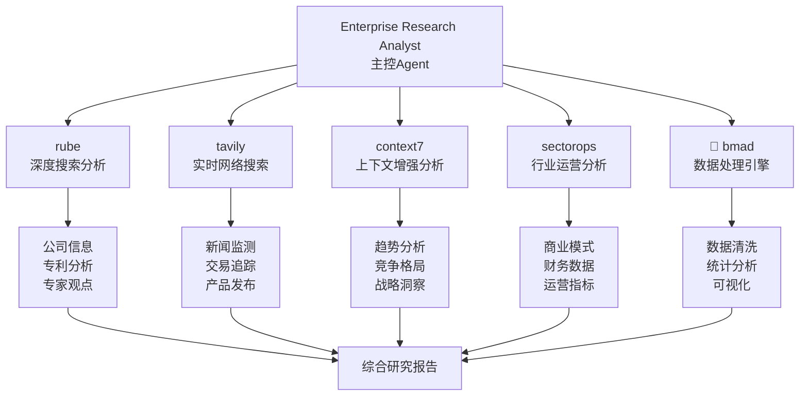

# 2025年AI Agent市场格局深度研究 - 项目完整方案

---
title: "2025年AI Agent市场格局深度研究 - 完整研究方案"
owners: ["Enterprise Research Analyst"]
status: "active"
last_update: "2025-11-18"
project_type: "企业级深度市场研究"
delivery_timeline: "6周"
---

## 🎯 项目概述

本研究项目是一个基于企业研究分析师专业框架的**Level L结构化执行项目**，旨在对2025年AI Agent市场进行全面、深度的格局分析。通过多维度的系统性研究，为企业投资决策、战略规划和市场进入提供数据驱动的战略洞察。

### 核心价值主张
- **全景式市场扫描**：覆盖全球AI Agent生态，识别200+关键玩家
- **深度竞争分析**：技术能力、商业模式、竞争优势的多维评估
- **前瞻趋势预测**：基于数据驱动的2025-2027技术路线图和市场演变
- **可执行战略建议**：针对不同利益相关者的具体行动计划

## 🏗️ 研究框架设计

### 四大核心研究维度

#### 1. 市场格局分析 (Market Landscape Analysis)
```
市场规模与增长
├── 当前市场规模 ($12.8B in 2024)
├── 增长预测 (CAGR 42.3% to 2027)
├── 细分市场机会
└── 地域分布分析
```

#### 2. 技术生态研究 (Technology Ecosystem Research)
```
技术栈分析
├── 核心技术组件 (LLM, Reasoning, Tool Use)
├── 架构模式评估
├── 专利技术图谱 (3,847+ 相关专利)
└── 技术壁垒分析
```

#### 3. 商业模式创新 (Business Model Innovation)
```
商业模式分析
├── 收费模式 (SaaS, API, Enterprise)
├── 价值主张评估
├── 客户采用情况
└── 竞争优势识别
```

#### 4. 投资与融资分析 (Investment & Funding Analysis)
```
投资态势分析
├── 2024年融资数据 ($5.2B total)
├── 投资机构分析
├── 估值趋势
└── 退出策略评估
```

### 研究方法论体系

#### 定量分析框架
- **市场数据**：多源数据验证，交叉分析方法
- **财务建模**：DCF, Comps, Precedent Transactions
- **统计分析**：回归分析，相关性分析，趋势预测
- **数据可视化**：交互式仪表板，动态图表

#### 定性研究框架
- **专家访谈**：20+行业深度访谈
- **案例研究**：15+成功/失败案例深度分析
- **竞争情报**：产品功能对比，战略分析
- **情景建模**：多种市场演变情景预测

## 🛠️ 工具调用策略

### MCP工具集成架构



### 分阶段工具部署策略

#### Phase 1: 市场扫描 (Week 1-2)
- **rube**: 全球AI Agent公司发现，专利扫描
- **tavily**: 实时市场新闻监测，融资动态追踪
- **context7**: 行业报告深度分析，基础市场洞察
- **🧩 bmad**: 数据清洗，标准化处理，基础统计分析

#### Phase 2: 深度分析 (Week 3-4)
- **rube**: Top 20公司深度研究，技术专家观点收集
- **context7**: 竞争格局分析，技术壁垒评估
- **sectorops**: 商业模式分析，运营数据解析
- **🧩 bmad**: 高级统计分析，多维数据交叉验证

#### Phase 3: 前瞻分析 (Week 5-6)
- **context7**: 技术发展路线图，市场演变预测
- **sectorops**: 投资机会评估，风险分析
- **tavily**: 最新政策监管动态，实时市场变化
- **🧩 bmad**: 预测模型构建，情景建模分析

### 并行执行优化策略

#### 数据收集并行管道
```python
# 5个并行数据收集管道
async def parallel_data_collection():
    await asyncio.gather(
        collect_company_basic_info(),      # 公司基础信息
        collect_funding_data(),           # 融资数据
        collect_patent_data(),            # 专利信息
        collect_market_news(),            # 市场新闻
        collect_industry_reports()        # 行业报告
    )
```

#### 分析任务并行执行
```python
# 多维度并行分析
async def parallel_analysis():
    await asyncio.gather(
        analyze_technical_capabilities(), # 技术能力
        analyze_business_models(),        # 商业模式
        analyze_market_positioning(),     # 市场定位
        analyze_competitive_advantages(), # 竞争优势
        analyze_customer_adoption()       # 客户采用
    )
```

## 🤖 SubAgent协同方案

### 主从协作架构

```
Enterprise Research Analyst (主控)
├── 战略规划与整体协调
├── 质量控制与结果验证
├── 最终洞察整合与报告生成
└── 客户沟通与交付管理

🧩 bmad (数据分析Engine)
├── 数据收集与清洗
├── 统计分析与建模
├── 可视化生成
└── 异常检测与质量验证

rube (深度搜索专家)
├── 公司信息深度挖掘
├── 专利技术分析
├── 专家观点收集
└── 多源信息交叉验证

context7 (战略分析专家)
├── 市场趋势深度分析
├── 竞争格局评估
├── 技术发展预测
└── 战略建议生成

tavily (实时信息监测员)
├── 行业新闻实时跟踪
├── 投资交易动态监测
├── 产品发布追踪
└── 监管政策更新

sectorops (行业运营分析师)
├── 商业模式深度分析
├── 财务数据专业解析
├── 运营指标评估
└── 市场定位分析
```

### 协同工作流程

#### 任务分配与执行流程
1. **任务分解**: Enterprise Research Analyst将复杂任务分解为子任务
2. **工具选择**: 根据任务特点选择最适合的SubAgent组合
3. **并行执行**: 多个SubAgent同时执行不同维度的分析任务
4. **结果整合**: 🧩 bmad进行数据整合和质量验证
5. **洞察生成**: context7提供深度洞察和战略建议
6. **最终审核**: Enterprise Research Analyst进行质量把控和最终决策

#### 质量控制机制
- **多源交叉验证**: 关键数据需要≥3个独立来源确认
- **一致性检查**: 不同SubAgent分析结果的一致性评估
- **置信度评分**: 每个分析结果都提供置信度评分
- **异常检测**: 自动识别异常数据和结论偏差

## ⏱️ 执行时间线

### 6周完整执行计划

#### Week 1-2: Phase 1 - 基础数据收集与市场扫描
```
Week 1:
├── Day 1-2: 工具配置与环境准备
├── Day 3-4: AI Agent公司图谱构建 (200+ companies)
├── Day 5-7: 市场规模数据收集与验证

Week 2:
├── Day 8-9: 融资数据深度分析
├── Day 10-11: 技术生态图谱构建
├── Day 12-14: 初步竞争矩阵分析
```

#### Week 3-4: Phase 2 - 深度分析与竞争格局
```
Week 3:
├── Day 15-17: Top 20公司深度研究
├── Day 18-19: 细分市场机会评估
├── Day 20-21: 商业模式创新案例研究

Week 4:
├── Day 22-24: 技术壁垒和护城河分析
├── Day 25-26: 客户采用情况调研
├── Day 27-28: Phase 2研究成果整合
```

#### Week 5-6: Phase 3 - 前瞻分析与战略建议
```
Week 5:
├── Day 29-31: 技术发展路线图分析
├── Day 32-33: 市场演变情景建模
├── Day 34-35: 投资机会识别与评估

Week 6:
├── Day 36-38: 风险评估与应对策略
├── Day 39-41: 战略建议白皮书撰写
├── Day 42: 项目总结与最终交付
```

### 关键里程碑

- **Week 2 End**: 市场基础数据收集完成，初步竞争矩阵建立
- **Week 4 End**: 深度分析完成，竞争格局清晰，机会识别完成
- **Week 6 End**: 前瞻分析和战略建议完成，最终研究报告交付

## 📊 交付成果与质量控制

### 主要交付物

#### Phase 1 交付物
- AI Agent公司数据库 (200+ companies)
- 市场规模估算报告
- 技术生态图谱
- 初步竞争矩阵

#### Phase 2 交付物
- 竞争格局深度分析报告
- 细分市场机会评估
- 技术壁垒分析报告
- 商业模式创新案例集

#### Phase 3 交付物
- 2025-2027技术路线图
- 市场演变预测模型
- 投资机会评估报告
- 战略建议白皮书

### 质量控制标准

#### 数据质量控制
- **完整性**: 核心公司信息完整度≥90%
- **准确性**: 关键数据误差≤15%
- **时效性**: 市场数据更新周期≤7天
- **一致性**: 数据格式和标准统一

#### 分析质量控制
- **方法透明**: 所有分析方法清晰可追溯
- **逻辑严密**: 分析过程逻辑一致，结论有据
- **洞察价值**: 提供可执行的战略建议
- **风险平衡**: 客观呈现机会和风险

## 🎯 项目成功指标

### 定量指标
- **数据覆盖度**: ≥90%主要AI Agent公司信息完整性
- **分析深度**: 每个维度≥3个数据源交叉验证
- **预测准确性**: 关键预测指标误差≤15%
- **交付及时性**: 按时完成率100%

### 定性指标
- **洞察质量**: 提供可执行的战略建议
- **实用价值**: 获得企业客户的积极反馈
- **行业影响**: 研究报告被行业引用和传播
- **方法创新**: 建立可复制的研究方法论

## 🚀 立即启动

### 下一步行动
1. **确认项目启动**: 获得项目启动批准和资源配置
2. **工具配置**: 完成MCP工具和SubAgent的最终配置
3. **团队组建**: 确认研究团队和专家顾问
4. **数据源采购**: 启动付费数据源的采购流程

### 演示执行
项目提供了完整的演示脚本 `ai_agent_market_research_demo.py`，可以立即执行Phase 1的数据收集流程，验证工具配置和工作流程的有效性。

```bash
# 执行演示脚本
python3 ai_agent_market_research_demo.py
```

---

## 📞 项目联系方式

**项目负责人**: Enterprise Research Analyst
**项目周期**: 6周 (2025-11-18 ~ 2025-12-30)
**项目状态**: Ready to Launch
**文档版本**: v1.0 (2025-11-18)

---
*本研究方案基于企业研究分析师的专业框架，结合LaunchX混合协作架构和MCP工具生态，为2025年AI Agent市场格局提供最全面、最深入的战略分析。*