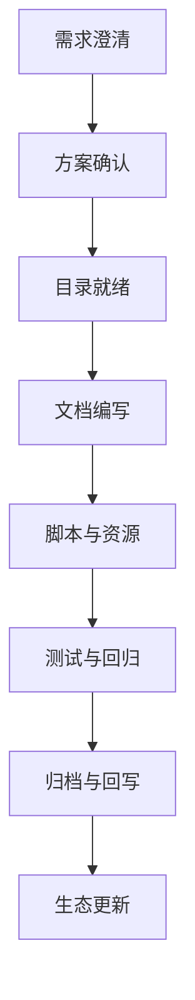

<<<<<<< HEAD
---
title: Launch-X Skills开发协作指南
owners:
- LaunchX Skills团队
status: active
last_update: '2025-10-24'
related:
- ./README.md
- ./🎯 Skills生态系统总览-优化版.md
- ./📚 Claude Skills官方标准学习.md
- ../../CLAUDE.md
source: 人工采集
impact: 规范七大Skills的开发流程、质量门槛与协同机制
tags:
- skills
- workflow
---

# Skills CLAUDE.md · Launch-X Skills开发协作指南

> **目标**：让 Claude / Codex 在开发与维护 Launch-X 七大核心 Skills 时，遵循统一流程、质量标准与协同机制，确保“知识 → 技能 → 工作流”的闭环可复用。
=======


-

## 🚀 快速导航
<<<<<<< HEAD
| 阶段 | 核心文档 | 关键收获 |
| --- | --- | --- |
| **标准研读** | [📚 Claude Skills官方标准学习](./📚%20Claude%20Skills官方标准学习.md) | 官方结构、Launch-X 扩展质量清单 |
| **生态全览** | [🧠 Skills生态系统总览](./README.md) | 七大 Skills 定位、目录结构、工作流 |
| **实践指引** | 本文档 | Skills 开发流程、测试与协同规范 |
| **方法论补充** | [🔧 从零到一开发实战指南](../../🟣%20knowledge/f_AI开发技巧/Claude%20Skills从零到一开发实战指南.md) | 30 分钟建设 Skills 的实操步骤 |

---

## 🎯 Skills开发的四条底线
1. **官方标准优先**：遵循 Claude Skills 模块化结构（`SKILL.md` + `instructions.md` + `scripts/` + `resources/` + `tests/`）。  
2. **单一职责**：七大核心 Skills（1/2/3/4/5/6/8）必须各司其职，新增能力先确认与现有技能不冲突。  
3. **可验证性**：每个技能提供最少一份手动测试清单；关键脚本须规划 smoke test。  
4. **知识回写**：所有产出 24 小时内回写知识库，并更新 frontmatter/related 索引。

---

## 🧱 Phase 0 Checklist（每次开发前确认）
- [ ] 核对需求是否已在 `plans/` 或 `specs/` 立项，明确验收标准。  
- [ ] 查看 `🧠 Skills生态系统总览/README.md`，确认 7 个技能的职责边界。  
- [ ] 查阅 `tests/test-plan.md`，了解现有验证覆盖情况。  
- [ ] 检查知识资产是否齐全（🟣 knowledge、templates、历史案例）。  
- [ ] 预热必要脚本/数据（如 `scripts/` 下的工具或 MCP 服务）。

---

## 🔧 Skills开发标准流程


### 1. 需求→方案（Spec → Plan）
- 明确技能服务的业务场景、输入输出、依赖知识域。  
- 对照 7 个 Skills 现况，判断是增强现有能力还是新增扩展包。  
- 形成 `/plan` 清单，经负责人确认后进入 `/do`。

### 2. 目录就绪
标准结构如下：
```
技能目录/
├── SKILL.md
├── instructions.md
├── README.md
├── scripts/
├── resources/
└── tests/
```
- **新增文件须补 frontmatter**，确保标题、owners、last_update、related 字段齐全。  
- `related` 中至少包含 `instructions.md`、`README.md` 以及关键知识库引用。

### 3. 文档编写
- `SKILL.md`：使用标准模板，补充参数、输出示例、性能指标。  
- `instructions.md`：明确角色定位、流程拆解、质量检查点。  
- `README.md`：写清使用方式、目录说明、协同建议、质量清单。  
- `tests/test-plan.md`：列出手动测试场景与待办的自动化用例。

### 4. 脚本与资源
- `scripts/`：重要脚本需包含 docstring、使用示例和回滚提示。  
- `resources/`：存放模板、样本数据、配置；结构化数据优先 JSON/CSV。  
- 任何脚本/资源更新需同步在 README/测试计划中说明。

### 5. 测试与回归
- 根据 `tests/test-plan.md` 完成最小验证，记录执行日期与结果。  
- 若脚本有自动化能力，可在 `scripts/ci/` 或测试计划中备注 TODO。  
- 发现风险需回写到 Summary，并与相关技能负责人沟通。

### 6. 归档与回写
- 输出先存入 `🤖 AI生成 auto-generated/YYYYMMDD/`，审核后归档至目标目录。  
- 更新涉及文档的 frontmatter `last_update`。  
- 若影响全局索引，记得同步 `memory-bank/`、根 README 或其他指挥文档。

### 7. 生态更新
- 目录结构/责任分工有变动时，更新 `🎯 Skills生态系统总览-优化版.md`。  
- 新增测试、脚本或流程需在 Summary 中说明并通知相关协作者。

---

## ✅ 质量与性能标准

### 输出质量
- 结构化：执行摘要 + 主体 + 行动项/指标。  
- 可溯源：关键结论引用数据、知识库或案例路径。  
- 行动化：输出包含负责人、节点或下一步建议。  
- 语言规范：对外文档优先中文，涉及技术脚本可中英结合。

### 性能门槛
- Skills 响应时间控制在 3–8 分钟。  
- 复杂调用需在 Summary 中注明预估耗时与资源占用。  
- 对外输出前须保证前一次回归不超过 7 天。

### 合规提醒
- 禁止引用未授权数据源或不明渠道信息。  
- 涉及公司机密/合规风险的场景需在 Summary 明确标红，并提出升级路径。

---

## 🔄 七大Skills协同策略
- **投资三角（1️⃣+2️⃣+3️⃣）**：商业决策支持、企业研究、市场情报联动，形成投资闭环。  
- **知识回写（4️⃣）**：所有技能输出由知识管理大师沉淀，维护索引与版本。  
- **项目交付（5️⃣+6️⃣+8️⃣）**：项目架构 → 技术设计 → 深度学习三段式，实现产品化落地。  
- **跨技能引用**：在各 README/Instructions 中标注协同触发条件及回滚方案。

---

## ❓ 常见问题
| 问题 | 诊断步骤 | 处理建议 |
| --- | --- | --- |
| 技能职责重叠 | 查阅 `🎯 Skills生态系统总览-优化版.md` 和历史 Summary | 重走 `/spec`，安排能力迁移或合并 |
| 输出质量不稳 | 检查 `instructions.md` 是否缺失质量门槛 | 补充验证步骤、引用来源、示例 |
| 测试缺失 | 查看 `tests/test-plan.md` 是否记录最近回归 | 先手动验证记录时间，再排期自动化 |
| 知识回写遗漏 | 对比知识库索引与 Summary | 及时补齐 frontmatter / related / README |

---

## ♻️ 持续改进
- **反馈闭环**：Summary 中记录风险或用户反馈，定期整理到 `🟣 knowledge/09_周报月报`。  
- **案例沉淀**：将优秀调用案例、外部标杆事件沉淀至 `🟣 knowledge/07_市场项目档案`。  
- **能力升级**：新增技能或重大改版需先在 `plans/` 输出影响评估与回滚策略。  
- **生态同步**：每次大更新后在 `README.md` 与根级指挥文档中写明变更摘要。

> 将本指南与七大 Skill 的 README、测试计划配合使用，即可在 Launch-X 生态中实现高标准、可追踪、可复用的技能建设流程。
=======

| 阶段 | 核心文档 | 关键操作 |
| --- | --- | --- |
| **学习准备** | [📚 Claude Skills官方标准学习](./📚%20Claude%20Skills官方标准学习.md) | 掌握官方开发规范 |
| **开发实战** | [🔧 从零到一开发实战指南](../../🟣%20knowledge/f_AI开发技巧/Claude%20Skills从零到一开发实战指南.md) | 30分钟构建Skill |
| **生态总览** | [🧠 Skills生态系统总览](./README.md) | 12个Skills全景 |
| **本地协作** | 本文件 | Skills开发协作规范 |

---

## 📋 Phase 0 Skills开发Checklist

### 环境准备
- [ ] 确认Claude Code CLI已安装并登录
- [ ] 验证Skills功能已启用 (`claude config get skills.enabled`)
- [ ] 检查本地技能路径 (`~/.claude/skills/` 和项目 `.claude/skills/`)
- [ ] 预热相关MCP服务器

### 需求分析
- [ ] 使用任务评估框架对技能需求评分 (总分≥15才开发)
- [ ] 确定技能的核心价值和适用场景
- [ ] 分析与现有12个Skills的关系和差异
- [ ] 明确输入输出规范和质量标准

### 资源准备
- [ ] 定位相关的🟣知识域资源
- [ ] 准备模板数据和示例
- [ ] 设计测试用例和验证方法
- [ ] 规划技能的协作关系

---

## 🔧 Skills开发工作流

### 1. 技能文件夹创建 (2分钟)
```bash
# 创建标准目录结构
mkdir -p "技能名称"
cd "技能名称"
mkdir -p scripts resources templates tests
```

### 2. SKILL.md编写 (8分钟)
**必须包含的完整要素**:
- 基本信息 (名称、版本、分类、标签)
- 功能描述 (主要用途、适用场景、核心价值)
- 使用方式 (直接调用、自然语言调用、自动识别)
- 输入参数 (必需、可选参数说明)
- 输出结果 (格式、内容、示例)
- 依赖项 (知识来源、分析工具、决策模板)
- 性能指标 (执行时间、成功率、适用复杂度)

### 3. instructions.md编写 (15分钟)
**核心指令设计原则**:
- **角色定位明确**: 清晰定义Claude的专业身份
- **流程标准化**: 将复杂分析分解为标准步骤
- **输出结构化**: 确保输出格式一致
- **质量控制**: 包含验证和优化机制

**标准结构**:
- 技能角色定位 (专业能力、经验背景)
- 工作原则 (客观性、全面性、实用性等)
- 分析框架 (分步骤的标准流程)
- 输出标准 (报告结构、质量要求)
- 知识来源 (基于的理论和数据)
- 持续改进 (反馈收集、优化机制)

### 4. 资源文件准备 (5分钟)
```yaml
resources/结构:
  data/: 行业模板、估值方法、风险因子等JSON数据
  templates/: 报告模板、分析框架等Markdown模板
  examples/: 成功案例、失败案例等参考示例
```

### 5. 本地测试验证 (5分钟)
**测试清单**:
- [ ] 技能能正确识别和加载
- [ ] 输出格式符合预期
- [ ] 分析逻辑清晰合理
- [ ] 数据来源可靠
- [ ] 建议具有可操作性
- [ ] 响应时间在合理范围内(3-8分钟)

### 6. 打包上传 (3分钟)
```bash
# 创建ZIP包 (包含文件夹作为根)
cd ..
zip -r "技能名称.zip" "技能名称/"

# 通过Claude.ai界面上传
# Settings > Capabilities > Skills > Upload skill
```

### 7. 生产环境验证 (2分钟)
**验证指标**:
- 功能完整性: 所有功能正常工作
- 输出质量: 输出内容质量达到预期
- 响应时间: 响应时间合理
- 用户体验: 使用体验流畅
- 稳定性: 多次测试结果稳定

---

## 🎯 质量控制标准

### 输出质量要求
- **结构清晰**: 使用标准模板，层次分明
- **内容完整**: 覆盖分析的所有重要方面
- **逻辑严密**: 分析逻辑清晰，因果关系明确
- **数据支撑**: 所有结论都有数据或事实支撑
- **建议可操作**: 提供具体可执行的建议

### 性能标准
- **响应时间**: 3-8分钟内完成分析
- **成功率**: 90%以上的准确执行率
- **一致性**: 相同输入产生稳定一致的输出
- **可扩展性**: 支持不同复杂度的任务

### 协作标准
- **知识整合**: 充分利用Launch-X知识体系
- **技能协同**: 与其他11个Skills形成协作网络
- **反馈机制**: 建立用户反馈收集和改进流程
- **版本管理**: 规范的版本控制和更新机制

---

## 🔄 与现有生态的协同

### Agent SDK集成
- **基础能力**: Skills作为Agent SDK的基础能力单元
- **编排机制**: Agent可以调用和组合多个Skills
- **数据共享**: Skills间可以共享分析结果和数据
- **流程协同**: 在复杂工作流中实现Skills自动编排

### 知识体系对接
- **知识域映射**: 每个Skill明确对应的🟣知识域
- **数据源整合**: 统一使用Launch-X知识库和数据源
- **方法论应用**: 应用标准化的分析方法和框架
- **质量控制**: 遵循统一的质量标准和验证流程

---

## 📊 常见问题解决

### ❌ 技能无法加载
**检查项目**:
1. 文件夹结构是否符合标准
2. SKILL.md和instructions.md是否完整
3. ZIP包结构是否正确
4. 文件编码和命名是否规范

### ❌ 输出质量不稳定
**解决方案**:
1. 在instructions.md中增加明确的质量控制检查点
2. 使用统一的术语定义和分析框架
3. 保持一致的输出结构和可量化的评估指标

### ❌ 响应时间过长
**优化策略**:
1. 简化分析步骤，优化决策逻辑
2. 预处理常用数据，减少文件读取次数
3. 并行处理独立任务，设置合理超时时间

---

## 🎉 持续改进机制

### 用户反馈收集
- **使用统计**: 跟踪技能使用频率和效果
- **满意度调研**: 定期收集用户满意度评价
- **问题报告**: 建立便捷的问题反馈渠道
- **建议收集**: 收集改进建议和新功能需求

### 迭代优化流程
1. **定期评估**: 每月评估技能使用数据和质量指标
2. **问题识别**: 优先处理高频问题和性能瓶颈
3. **功能迭代**: 基于用户需求迭代优化核心功能
4. **版本发布**: 规范的版本测试、发布和通知流程

---

## 📚 引用索引

- **上层指导**: [`../../CLAUDE.md`](../../CLAUDE.md) - Launch-X总体协作规范
- **生态总览**: [`README.md`](./README.md) - 12个Skills生态系统介绍
- **官方标准**: [`📚 Claude Skills官方标准学习.md`](./📚%20Claude%20Skills官方标准学习.md) - 官方开发规范
- **实战指南**: [`../../🟣 knowledge/f_AI开发技巧/Claude Skills从零到一开发实战指南.md`](../../🟣%20knowledge/f_AI开发技巧/Claude%20Skills从零到一开发实战指南.md) - 完整开发教程
- **技能目录**: 12个Skills文件夹 - 具体技能实现

---

*遵循本指南，确保每个Skills都符合官方标准和Launch-X质量要求，与现有生态形成有机协同！*
>>>>>>> a4c0d42015874ecd06f7f922c116dc5b41a2bac0
